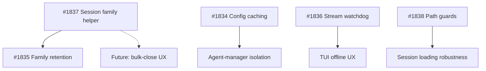

# Development Plan - 2026-09-25

## Executive Summary

This plan implements 4 NEW actionable items from 2026-09-25 research (Kilocode commits) focused on **reliability and isolation hardening**: project-scoped config caching (HIGH), session family retention (MEDIUM), stream-silence watchdog (MEDIUM), and inaccessible path guards (infrastructure). Total estimated effort: ~18-28h across 5 issues.

**Strategic focus**: Prevent silent failures in multi-worktree and long-running agent scenarios through config isolation, family-aware retention, and network disconnect surfacing.

## Priority Ranking (Top 5 from backlog)

| # | Issue | Category | Size | Priority | Effort | Rationale |
|---|-------|----------|------|----------|--------|-----------|
| 1 | #1834 | config | MEDIUM | HIGH | ~6-10h | Project-scoped provider/config caching prevents silent credential/config leakage across agent-manager worktree switches (Kilocode #14557 pattern) |
| 2 | #1835 | core | SMALL | MEDIUM | ~2-4h | Session family retention prevents deleting sub-agents of active parents (Kilocode #14502 pattern) |
| 3 | #1837 | core | SMALL | MEDIUM | ~2-3h | **Infrastructure**: Session family traversal helper enables #1835 and future multi-session features |
| 4 | #1836 | tui+core | MEDIUM | MEDIUM | ~6-8h | Stream-silence probe surfaces offline state instead of infinite spinner (Kilocode #13523 pattern) |
| 5 | #1838 | core | SMALL | MEDIUM | ~2-3h | Guard session scope against EACCES/EPERM from inaccessible historical paths (Kilocode #14557 pattern) |

**Cumulative: ~18-28h** (items 1-5)

**Dependency order**:
1. Start with #1837 (session family helper) - foundational
2. Parallel track A: #1835 (uses #1837) + #1838 (independent)
3. Parallel track B: #1834 (independent, HIGH priority) + #1836 (independent)

## Detailed Implementation Strategy

### Phase 1: Foundation (Session Family Infrastructure) - ~2-3h

**Issue #1837: Add session family traversal helper**

**Goal**: Centralize session family tree logic (parent chain + descendants) for retention and future multi-session features.

**Files to modify**:
- `src/core/sessionManager.ts` - add `getSessionFamily()`, `getSessionChildren()` helpers
- `tests/core/sessionManager.test.ts` - family traversal tests

**Implementation steps**:
1. Add `getSessionFamily(sessionId: string): string[]` method:
   - Walk `parentSessionId` upward to find root
   - Collect all descendants via breadth-first traversal
   - Return full family tree (root + all children/grandchildren)
2. Add `getSessionChildren(sessionId: string): string[]` helper:
   - Filter sessions where `parentSessionId === sessionId`
   - Used by `getSessionFamily()` for downward walk
3. Handle edge cases:
   - Missing sessions (orphaned sub-agents) - return partial family
   - Circular references (should not exist, but guard with visited set)
4. Tests:
   - Multi-level family (parent → child → grandchild) traversal
   - Orphaned sub-agent handling (parent deleted, child exists)
   - Single-session family (no parent, no children)

**Acceptance**:
- [ ] `getSessionFamily()` and `getSessionChildren()` exist in SessionManager
- [ ] Tests pass for multi-level traversal and edge cases
- [ ] No circular reference infinite loops

---

### Phase 2: Reliability Hardening (Parallel Tracks) - ~16-25h

#### Track A: Session Lifecycle + Path Guards (~4-7h)

**Issue #1835: Retain session families in cleanup sweep** (~2-4h)

**Goal**: Prevent deleting sub-agents of active parent sessions during retention cleanup.

**Files to modify**:
- `src/core/retentionScheduler.ts` - update `cleanupExpiredSessions()`
- `tests/core/retentionScheduler.test.ts` - family retention tests

**Implementation steps**:
1. Audit `cleanupExpiredSessions()` (around line 100):
   - Confirm it filters by `lastAccessedAt` only (not family-aware)
2. Update retention logic:
   - Build retained session set: for each kept session, call `getSessionFamily()` and mark entire family
   - Filter deletion candidates to exclude retained family IDs
3. Preserve orphan cleanup (parent gone, sub-agent lingers)
4. Tests:
   - Active parent → sub-agents retained
   - Inactive family → all deleted together
   - Orphaned sub-agent → still cleaned up

**Acceptance**:
- [ ] Active parent's descendants not deleted during cleanup
- [ ] Orphaned sub-agents still cleaned up
- [ ] Tests cover family retention scenarios

---

**Issue #1838: Guard session scope resolution against inaccessible paths** (~2-3h)

**Goal**: Prevent EACCES/EPERM crashes when loading sessions with historical inaccessible sandbox paths.

**Files to modify**:
- `src/core/sessionManager.ts` - wrap `filesystem.resolve()` calls
- `src/core/sessionContext.ts` - if path resolution exists there
- `tests/core/sessionManager.test.ts` - inaccessible path tests

**Implementation steps**:
1. Audit session loading code:
   - Find `filesystem.resolve()` calls in `loadSession()` / workdir resolution
   - Check `sessionContext.ts` for path resolution
2. Add try-catch wrapper:
   - Catch EACCES, EPERM, ENOENT (permission/missing path errors)
   - Treat unresolvable paths as out-of-scope (log DEBUG, continue session load)
3. Ensure session loads successfully despite inaccessible workdir
4. Tests with mocked `filesystem.resolve()` throwing errors

**Acceptance**:
- [ ] Inaccessible workdir does not crash session load
- [ ] Error logged at DEBUG level
- [ ] Session scope resolution degrades gracefully

---

#### Track B: Config Isolation + Network Resilience (~12-18h)

**Issue #1834: Project-scoped provider/config caching for agent-manager** (~6-10h)

**Goal**: Prevent config/credential leakage when agent-manager switches worktrees.

**Files to modify**:
- `src/providers/index.ts` - add project-scoped cache keying
- `src/core/agent-manager/orchestration-api.ts` - cache clearing on switch
- `src/config/alexi.ts` - project-scoped config loading (if needed)
- `tests/providers/index.test.ts` - cache isolation tests
- `tests/core/agent-manager.test.ts` - worktree switch tests

**Implementation steps**:
1. Audit provider cache scope:
   - Check if `getProviderForModel()` caches globally or per-project
   - Likely global cache (Map keyed by model ID only)
2. Add project-scoped cache:
   - Key by `{projectPath: string, modelId: string}` composite
   - Normalize project path via `path.resolve(cwd)`
3. Cache clearing on worktree switch:
   - Agent-manager calls `clearProviderCache(projectPath)` when deactivating worktree
4. Retry-on-activation:
   - When agent-manager activates worktree, retry provider/config init if previous bootstrap failed
5. Tests:
   - Worktree A credentials NOT reused in worktree B
   - Config isolated per project root
   - Failed bootstrap recovers on activation

**Acceptance**:
- [ ] Provider cache keyed to resolved project path
- [ ] Worktree switch clears cache
- [ ] No credential leakage across projects
- [ ] Failed bootstrap retries on activation

---

**Issue #1836: Stream-silence connectivity probe for offline detection** (~6-8h)

**Goal**: Surface network disconnects in TUI instead of infinite spinner.

**Files to modify**:
- `src/core/streamWatchdog.ts` - add 10s silence probe
- `src/core/network.ts` - reuse/extend connectivity probe
- `src/cli/tui/` - render "[waiting for network]" inline error
- `tests/core/streamWatchdog.test.ts` - probe tests

**Implementation steps**:
1. Audit `streamWatchdog.ts` (line 100-200):
   - Check if it probes connectivity on silence (likely only reacts to NetworkManager events)
2. Add stream-silence watchdog:
   - 10s no-chunk timer (reset on chunk arrival or tool-call-start)
   - On timeout: probe connectivity
     - Local endpoints (localhost, 127.0.0.1, LAN, bare hostname): TCP connect to provider baseURL
     - Remote providers: public-host probe (existing NetworkManager pattern)
   - Fail attempt with disconnect error if unreachable
   - Pass probe → reset timer, continue waiting
3. Provider endpoint resolution:
   - Resolve baseURL from model ID (via provider registry)
   - Expand env vars in URL (e.g. `${AICORE_HOST}`)
   - Detect local vs remote (IP range check, hostname heuristics)
4. TUI integration:
   - Render "[waiting for network]" in prompt inline error on disconnect
   - Use existing inline error UI (check `src/cli/tui/prompt.tsx` or similar)
5. Tests:
   - Stream silence (11s) → probe triggered
   - Disconnect → error surfaced
   - Passing probe → timer reset
   - Tool execution (bash, task) → timer held
   - Local endpoint → TCP probe, remote → public-host probe

**Acceptance**:
- [ ] 10s stream silence triggers connectivity probe
- [ ] Disconnect surfaces "[waiting for network]" in TUI
- [ ] Tool execution extends timeout window
- [ ] Local/remote endpoints probed appropriately

---

## Implementation Dependencies



**Critical path**: #1837 → #1835 (session lifecycle)
**Parallel tracks**: #1834 (config), #1836 (network), #1838 (path guards)

---

## Out of Scope (Reference Only)

- **Kilocode #13808 Close All Tasks**: Bulk-close pattern documented but NOT implemented (Alexi TUI is single-session today, no tab grid). Future multi-session UX will reference this.
- **Kilocode #14540 session cleanup vacuum**: Database vacuuming not applicable (Alexi uses file-based sessions, no SQLite). Cancellable cleanup UX is reference material if retention UI added.

---

## Testing Strategy

All issues follow the same quality gate sequence:

```bash
npm run typecheck  # Strict TS, no @ts-ignore
npm run lint       # 0 errors
npm run test:coverage  # >= 40% lines
npm run format:check   # Prettier compliance
npm run build      # Emit dist/
```

**Test focus areas**:
- **Config isolation** (#1834): worktree switch does not leak credentials
- **Session families** (#1835, #1837): multi-level traversal, orphan handling
- **Network resilience** (#1836): probe triggered on silence, disconnect surfaced
- **Error handling** (#1838): EACCES/EPERM gracefully handled

---

## Success Metrics

- **0 silent config leakage** across agent-manager worktree switches
- **0 active sub-agent deletions** during retention sweep
- **< 15s** to surface network disconnect in TUI (10s silence + probe)
- **0 session load crashes** from inaccessible historical paths
- **40%+ test coverage** maintained across all changes

---

## Risk Mitigation

| Risk | Mitigation |
|------|------------|
| Provider cache refactor breaks existing routing | Add tests for single-project case (backwards compat), gradual rollout with feature flag |
| Session family traversal hits circular refs | Visited set guard, integration tests with malformed session data |
| Stream watchdog false positives on slow providers | Timer only starts after first chunk (stream established), tool execution holds timer |
| Path guard catches too many errors | Only catch EACCES/EPERM/ENOENT (filesystem access errors), re-throw others |

---

## Future Work (Not in This Plan)

- **Max-tokens recovery** (Cline #13340 pattern, ~16-20h, HIGH priority from 2026-09-22 research) - compaction + nudge retries on truncated turn
- **MCP CIMD** (Kilocode #14508, ~8-12h, HIGH priority from 2026-09-24) - MCP compatibility detection
- **Git plugin install** (Kilocode #14485, ~12-16h, HIGH priority from 2026-09-23) - MCP server auto-install
- **Goal tool** (Kilocode #14445, ~16-20h, HIGH priority from 2026-09-22) - autonomous multi-turn agent
- **Bulk-close UX** (Kilocode #13808, ~4-6h when needed) - multi-session lifecycle management (deferred until TUI gains multi-session view)

---

## Commit Strategy

Follow conventional commits with allowed scopes:

- #1834: `feat(config): project-scoped provider caching for agent-manager [alexi-bot]`
- #1835: `feat(core): retain session families in cleanup sweep [alexi-bot]`
- #1836: `feat(tui): stream-silence probe for offline detection [alexi-bot]`
- #1837: `feat(core): add session family traversal helpers [alexi-bot]`
- #1838: `fix(core): guard session scope against inaccessible paths [alexi-bot]`

All commits signed with `[alexi-bot]` suffix for Daily Merge identification.
