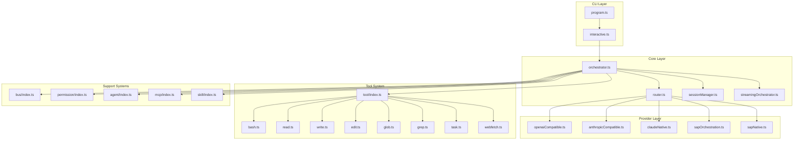
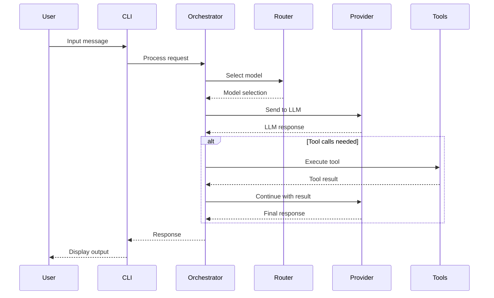
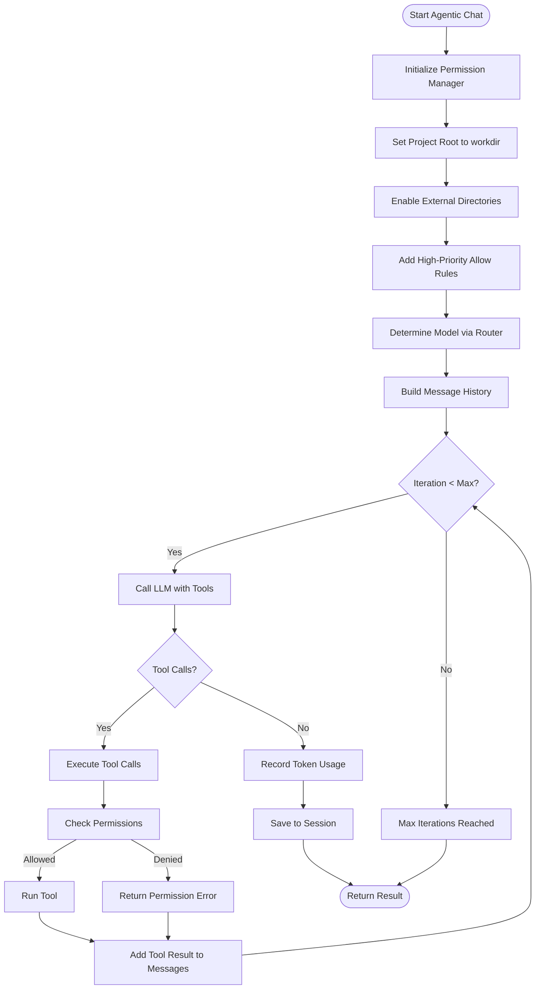
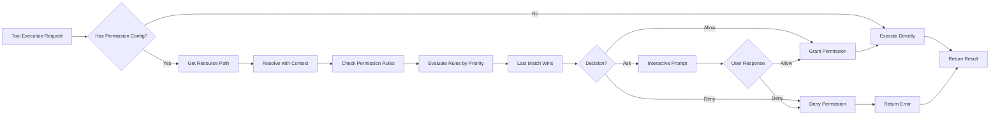
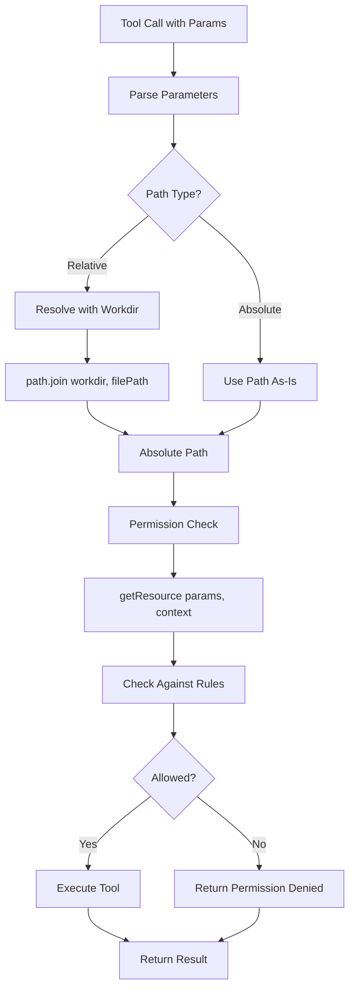
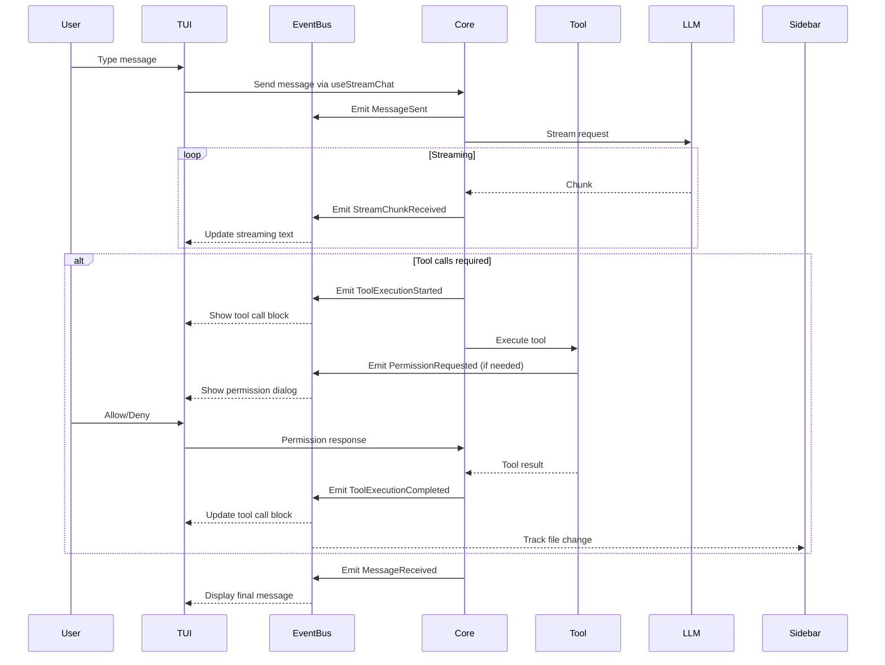
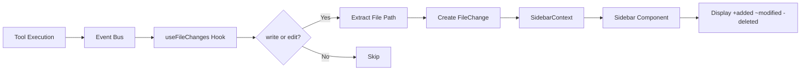
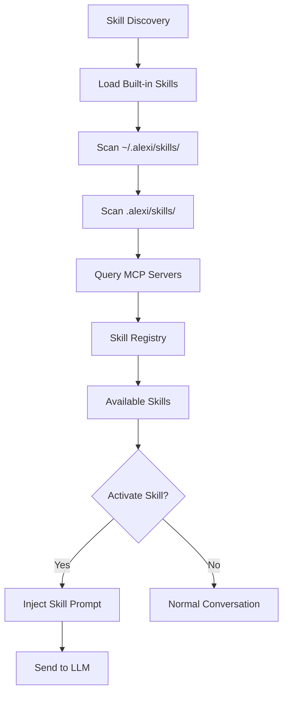
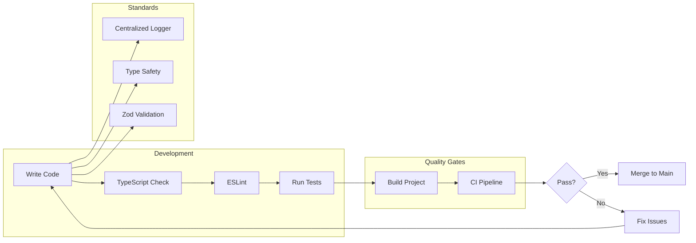

# Alexi Architecture

This document describes the high-level architecture of Alexi, an AI-powered CLI assistant.

## Overview

Alexi is a TypeScript/Node.js application that orchestrates multiple LLM providers with intelligent routing, session management, and extensible tool systems.

## System Architecture



## Module Descriptions

### CLI Layer

| Module | File | Description |
|--------|------|-------------|
| Program | `src/cli/program.ts` | CLI entry point using Commander.js |
| Interactive | `src/cli/interactive.ts` | Interactive mode with streaming UI (deprecated, use TUI) |
| TUI App | `src/cli/tui/App.tsx` | Main TUI application with React/Ink |
| Chat Page | `src/cli/tui/pages/ChatPage.tsx` | Main chat interface with sidebar and message area |
| Logs Page | `src/cli/tui/pages/LogsPage.tsx` | Debug log viewer with filtering |
| Heap Monitor | `src/cli/heap.ts` | Memory monitoring and heap snapshot utilities |
| Completer | `src/cli/utils/completer.ts` | Unified autocomplete engine for commands, models, paths |
| Keybindings | `src/cli/utils/keybindings.ts` | Keyboard shortcut handling |

### Core Layer

| Module | File | Description |
|--------|------|-------------|
| Orchestrator | `src/core/orchestrator.ts` | Main orchestration logic |
| Router | `src/core/router.ts` | Model selection and routing |
| Session Manager | `src/core/sessionManager.ts` | Conversation session persistence |
| Streaming Orchestrator | `src/core/streamingOrchestrator.ts` | Real-time streaming support |
| Agentic Chat | `src/core/agenticChat.ts` | Autonomous agent with tool execution loop |
| Stage Manager | `src/core/stageManager.ts` | Workflow stage management |
| Workflow Manager | `src/core/workflowManager.ts` | Multi-stage workflow orchestration |

### Provider Layer

| Module | File | Description |
|--------|------|-------------|
| OpenAI Compatible | `src/providers/openaiCompatible.ts` | OpenAI API compatible provider |
| Anthropic Compatible | `src/providers/anthropicCompatible.ts` | Anthropic Messages API |
| Claude Native | `src/providers/claudeNative.ts` | Direct Claude integration |
| SAP Orchestration | `src/providers/sapOrchestration.ts` | SAP AI Core via SDK |
| SAP Native | `src/providers/sapNative.ts` | Native SAP AI Core API |

### Tool System

| Tool | File | Description |
|------|------|-------------|
| Bash | `src/tool/tools/bash.ts` | Execute shell commands |
| Bash Hierarchy | `src/tool/tools/bash-hierarchy.ts` | Hierarchical permission rules for bash commands |
| Read | `src/tool/tools/read.ts` | Read files and directories |
| Write | `src/tool/tools/write.ts` | Write files |
| Edit | `src/tool/tools/edit.ts` | Edit files with string replacement |
| Glob | `src/tool/tools/glob.ts` | Find files by pattern |
| Grep | `src/tool/tools/grep.ts` | Search file contents |
| WarpGrep | `src/tool/tools/warpgrep.ts` | AI-powered semantic code search |
| Task | `src/tool/tools/task.ts` | Launch sub-agents |
| WebFetch | `src/tool/tools/webfetch.ts` | Fetch web content |
| Question | `src/tool/tools/question.ts` | Ask user questions |
| TodoWrite | `src/tool/tools/todowrite.ts` | Manage task lists |

### Support Systems

| Module | File | Description |
|--------|------|-------------|
| Event Bus | `src/bus/index.ts` | Pub/sub event system for tool execution and permissions |
| Permission | `src/permission/index.ts` | File access control with rule-based decisions |
| Permission Config | `src/permission/config-paths.ts` | Permission rule file management |
| Permission Drain | `src/permission/drain.ts` | Graceful permission manager shutdown |
| Agent | `src/agent/index.ts` | Autonomous agent system with specialization |
| Agent System | `src/agent/system.ts` | Multi-layer system prompt assembly |
| MCP | `src/mcp/index.ts` | Model Context Protocol integration |
| MCP Client | `src/mcp/client.ts` | MCP client with tool discovery |
| Skill | `src/skill/index.ts` | Reusable AI prompts and behaviors |
| Compaction | `src/compaction/index.ts` | Context compression for long conversations |
| Profile | `src/profile/index.ts` | User profile management |
| User Config | `src/config/userConfig.ts` | Persistent user configuration with MDM support |
| Session Headers | `src/providers/sessionHeaders.ts` | Session tracking headers for SAP AI Core |
| Logger | `src/utils/logger.ts` | Centralized logging utility |
| Global Utilities | `src/utils/global.ts` | Global path and configuration helpers |

## Data Flow



## Agentic Chat Flow



## Permission System Flow



## Tool System with Context Resolution

The tool system resolves relative paths using the workdir context:



## Instruction File System

Alexi uses a multi-layer instruction file system to provide context to AI agents:

```mermaid
graph TB
    subgraph Sources[\"Instruction Sources\"]
        Soul[Soul Prompt<br/>core identity]
        Model[Model Prompt<br/>Anthropic/OpenAI/Gemini]
        Env[Environment Info<br/>workdir, git, platform]
        Agent[Agent Prompt<br/>code/debug/plan/explore]
        Project[Project AGENTS.md<br/>./AGENTS.md]
        User[User ALEXI.md<br/>~/.alexi/ALEXI.md]
        Rules[Project Rules<br/>.alexi/rules/*.md]
        Custom[Custom Rules<br/>user-provided]
    end
    
    subgraph Assembly[\"System Prompt Assembly\"]
        Assemble[buildAssembledSystemPrompt]
    end
    
    subgraph Output[\"Final Prompt\"]
        System[Complete System Prompt]
    end
    
    Soul --> Assemble
    Model --> Assemble
    Env --> Assemble
    Agent --> Assemble
    Project --> Assemble
    User --> Assemble
    Rules --> Assemble
    Custom --> Assemble
    
    Assemble --> System
    
    style Soul fill:#E3F2FD
    style Model fill:#E8F5E9
    style Agent fill:#FFF3E0
    style Project fill:#F3E5F5
    style User fill:#FCE4EC
    style Rules fill:#E0F2F1
    style System fill:#4CAF50
```

### Instruction File Locations

| File | Path | Purpose |
|------|------|---------|
| Project Instructions | `./AGENTS.md` | Project-specific context, coding standards, build commands |
| User Instructions | `~/.alexi/ALEXI.md` | Global user preferences applied to all projects |
| Project Rules | `./.alexi/rules/*.md` | Scoped rules for specific aspects (API design, security, etc.) |

### Managing Instruction Files

```bash
# List all instruction files
/memory

# Edit project instructions
/memory edit project

# Edit user instructions
/memory edit user

# Create AGENTS.md from template
/memory init
```

## TUI (Terminal User Interface) Architecture

Alexi features a full-screen interactive TUI built with React and Ink, providing a rich terminal experience with visual parity to Kilo/OpenCode.

### TUI Component Hierarchy

```mermaid
graph TB
    subgraph App[\"App.tsx\"]
        AppLayout[AppLayout Component]
    end
    
    subgraph Providers[\"Context Providers\"]
        ThemeProvider[ThemeProvider]
        PageProvider[PageProvider]
        SessionProvider[SessionProvider]
        ChatProvider[ChatProvider]
        AttachmentProvider[AttachmentProvider]
        SidebarProvider[SidebarProvider]
        KeybindProvider[KeybindProvider]
        DialogProvider[DialogProvider]
    end
    
    subgraph Pages[\"Page Components\"]
        ChatPage[ChatPage]
        LogsPage[LogsPage]
    end
    
    subgraph ChatComponents[\"Chat Page Components\"]
        SplitPane[SplitPane]
        Sidebar[Sidebar]
        MessageArea[MessageArea]
        InputBox[InputBox]
        StatusBar[StatusBar]
    end
    
    subgraph LogComponents[\"Logs Page Components\"]
        LogViewer[LogViewer]
        LogStatusBar[StatusBar]
    end
    
    subgraph Dialogs[\"Dialog Components\"]
        HelpDialog[HelpDialog]
        ModelPicker[ModelPicker]
        AgentSelector[AgentSelector]
        PermissionDialog[PermissionDialog]
        SessionList[SessionList]
        McpManager[McpManager]
        ThemeDialog[ThemeDialog]
        FilePicker[FilePicker]
        QuitDialog[QuitDialog]
        ArgDialog[ArgDialog]
    end
    
    App --> ThemeProvider
    ThemeProvider --> PageProvider
    PageProvider --> SessionProvider
    SessionProvider --> ChatProvider
    ChatProvider --> AttachmentProvider
    AttachmentProvider --> SidebarProvider
    SidebarProvider --> KeybindProvider
    KeybindProvider --> DialogProvider
    DialogProvider --> AppLayout
    
    AppLayout --> ChatPage
    AppLayout --> LogsPage
    AppLayout --> Dialogs
    
    ChatPage --> SplitPane
    SplitPane --> Sidebar
    SplitPane --> MessageArea
    ChatPage --> InputBox
    ChatPage --> StatusBar
    
    LogsPage --> LogViewer
    LogsPage --> LogStatusBar
```

### TUI Context System

| Context | File | Purpose |
|---------|------|---------|
| ThemeContext | `src/cli/tui/context/ThemeContext.tsx` | Dark/light theme switching and color management |
| PageContext | `src/cli/tui/context/PageContext.tsx` | Page navigation (chat, logs) |
| SessionContext | `src/cli/tui/context/SessionContext.tsx` | Session state management |
| ChatContext | `src/cli/tui/context/ChatContext.tsx` | Message history and streaming state |
| AttachmentContext | `src/cli/tui/context/AttachmentContext.tsx` | Image attachment management |
| SidebarContext | `src/cli/tui/context/SidebarContext.tsx` | File change tracking and sidebar visibility |
| KeybindContext | `src/cli/tui/context/KeybindContext.tsx` | Leader key mode and keybinding state |
| DialogContext | `src/cli/tui/context/DialogContext.tsx` | Modal dialog overlay management |

### TUI Hooks

| Hook | File | Purpose |
|------|------|---------|
| useStreamChat | `src/cli/tui/hooks/useStreamChat.ts` | LLM streaming with tool execution |
| usePermission | `src/cli/tui/hooks/usePermission.ts` | Permission prompt handling |
| useKeyboard | `src/cli/tui/hooks/useKeyboard.ts` | Global keyboard shortcuts |
| useCommands | `src/cli/tui/hooks/useCommands.ts` | Slash command registration |
| useToolEvents | `src/cli/tui/hooks/useToolEvents.ts` | Tool execution event subscriptions |
| useFileChanges | `src/cli/tui/hooks/useFileChanges.ts` | File modification tracking |
| useLogCollector | `src/cli/tui/hooks/useLogCollector.ts` | Log entry aggregation from event bus |
| useScrollPosition | `src/cli/tui/hooks/useScrollPosition.ts` | Scroll state with vim navigation |
| useVimMode | `src/cli/tui/hooks/useVimMode.ts` | Vim keybinding modes (normal, insert, visual, command) |

### TUI Event Flow



### File Change Tracking

The TUI automatically tracks file modifications made by tools:



### Keyboard Shortcuts

| Key | Mode | Action |
|-----|------|--------|
| `Ctrl+X` | Global | Activate leader mode |
| `Ctrl+X` then `m` | Leader | Open model picker |
| `Ctrl+X` then `a` | Leader | Open agent selector |
| `Ctrl+X` then `s` | Leader | Open session list |
| `Ctrl+X` then `t` | Leader | Open theme dialog |
| `Ctrl+X` then `h` | Leader | Open help dialog |
| `Ctrl+X` then `l` | Leader | Switch to logs page |
| `Ctrl+X` then `c` | Leader | Switch to chat page |
| `Ctrl+X` then `b` | Leader | Toggle sidebar |
| `Ctrl+K` | Global | Open command palette |
| `Ctrl+C` | Global | Exit application |
| `Ctrl+V` | Input | Paste clipboard image |
| `Tab` | Global | Cycle to next agent |
| `Shift+Tab` | Global | Cycle to previous agent |

### Vim Mode Support

The TUI includes optional vim keybinding support via `useVimMode` hook:

- **Normal mode**: Navigation and commands
- **Insert mode**: Text editing
- **Visual mode**: Text selection
- **Command mode**: Ex-style commands

Vim mode can be toggled with `:set vim` command in the TUI.

## Configuration

### Environment Variables

```
AICORE_SERVICE_KEY    # SAP AI Core credentials
AICORE_RESOURCE_GROUP # SAP AI Core resource group
OPENAI_API_KEY        # OpenAI API key (optional)
ANTHROPIC_API_KEY     # Anthropic API key (optional)
```

### Routing Configuration

Routing rules are defined in `routing-config.json` or `~/.alexi/routing-config.json`:

```json
{
  "rules": [
    {
      "name": "code-tasks",
      "priority": 100,
      "condition": { "contains": ["code", "implement", "fix"] },
      "model": "anthropic--claude-4-sonnet"
    }
  ],
  "default": {
    "model": "anthropic--claude-4-sonnet"
  }
}
```

## Skill System

The skill system provides reusable AI prompts and behaviors that can be activated during conversations. Skills are defined with structured metadata and can be loaded from multiple sources.

### Skill Definition

```typescript
interface Skill {
  id: string;
  name: string;
  description: string;
  prompt: string;
  
  // Optional structured prompts
  prompts?: {
    system?: string;
    review?: string;
    planning?: string;
    codeReview?: string;
  };
  
  // Tool constraints
  tools?: string[];
  disabledTools?: string[];
  
  // Model preferences
  preferredModel?: string;
  temperature?: number;
  maxTokens?: number;
  
  // Metadata
  category?: string;
  tags?: string[];
  aliases?: string[];
  source?: 'builtin' | 'file' | 'mcp';
}
```

### Skill Sources

Skills can be loaded from multiple sources:

1. **Built-in skills**: Defined in code using `defineSkill()`
2. **File-based skills**: Markdown files with frontmatter in `~/.alexi/skills/` or `.alexi/skills/`
3. **MCP skills**: Discovered from Model Context Protocol servers

### Skill Discovery Flow



### Skill File Format

Skills are defined in markdown files with YAML frontmatter:

```markdown
---
id: code-review
name: Code Review Expert
description: Provides detailed code reviews with security and performance insights
category: development
tags: [code, review, security]
preferredModel: anthropic--claude-4-sonnet
temperature: 0.3
tools: [read, grep, bash]
---

You are an expert code reviewer specializing in security, performance, and best practices.

When reviewing code:
1. Check for security vulnerabilities
2. Identify performance bottlenecks
3. Suggest architectural improvements
4. Verify adherence to coding standards
```

### Using Skills

```bash
# List available skills
/skills

# Activate a skill
/skill code-review

# Deactivate current skill
/skill off
```

## Directory Structure

```
alexi/
├── src/
│   ├── cli/           # CLI entry points
│   ├── core/          # Core orchestration
│   ├── providers/     # LLM providers
│   ├── tool/          # Tool system
│   │   └── tools/     # Individual tools
│   ├── agent/         # Agent system
│   ├── bus/           # Event bus
│   ├── permission/    # Permission system
│   ├── mcp/           # MCP integration
│   ├── skill/         # Skill system
│   ├── config/        # Configuration
│   ├── log/           # Logging
│   ├── profile/       # Profile management
│   └── ...
├── tests/             # Test files
├── dist/              # Compiled output
└── docs/              # Documentation
```

## Key Design Decisions

### 1. Multi-Provider Architecture

Alexi supports multiple LLM providers through a unified interface, allowing:
- Easy switching between providers
- Fallback mechanisms
- Cost optimization through routing

### 2. Tool System with Permission Control

Tools are implemented as independent modules that:
- Follow a consistent interface based on Zod schema validation
- Can be enabled/disabled per session
- Support permission-based access control with last-match-wins rule evaluation
- Resolve relative paths using workdir context for agentic operations
- Support interactive permission prompts and high-priority allow rules
- Convert Zod schemas to JSON Schema for LLM function calling with proper type handling

### 3. Agentic Execution Mode

The agentic chat system enables autonomous file operations:
- Automatic permission configuration for write and execute actions
- High-priority allow rules (priority 200) override default ask prompts
- External directory access for full workspace capability
- Tool execution loop with LLM-driven decision making
- Iteration limits to prevent infinite loops (default: 50)

### 4. Event-Driven Architecture

The event bus enables:
- Loose coupling between modules
- Plugin extensibility
- Real-time streaming updates
- Permission events (DoomLoopDetected, ExternalAccessAttempted)

### 5. Session Management

Sessions provide:
- Multi-turn conversation context
- Persistence across CLI invocations
- Export and sharing capabilities

## Security Considerations

1. **Secrets Management**: Secrets are redacted in exports and logs
2. **Permission System**: File access is controlled by configurable rules
3. **Environment Isolation**: Sensitive config stored in `~/.alexi/`
4. **Type Safety**: Strict TypeScript configuration with proper type assertions
5. **Logging**: Centralized logger replaces direct console calls for better control

## Logging System

Alexi uses a centralized logging utility to provide consistent logging across the application.

### Logger API

```typescript
import { logger } from './utils/logger.js';

// Set log level (debug, info, warn, error)
logger.setLevel('debug');

// Log messages at different levels
logger.debug('Debug message', additionalData);
logger.info('Info message');
logger.warn('Warning message');
logger.error('Error message', error);

// Print without formatting (for CLI output)
logger.print('Raw output');
```

### Log Levels

| Level | Priority | Description | Output Format |
|-------|----------|-------------|---------------|
| `debug` | 0 | Detailed debugging information | `[DEBUG] message` |
| `info` | 1 | General informational messages | `message` (no prefix) |
| `warn` | 2 | Warning messages | `[WARN] message` |
| `error` | 3 | Error messages | `[ERROR] message` |

The logger respects the configured log level and only outputs messages at or above that level. The default level is `info`.

### ESLint Integration

The logger utility is the only module permitted to use direct console calls. All other modules should import and use the centralized logger to maintain ESLint compliance.

```typescript
// ❌ Avoid direct console usage
console.log('message');

// ✅ Use centralized logger
import { logger } from './utils/logger.js';
logger.info('message');
```

## Type Safety and Code Quality

### TypeScript Configuration

Alexi uses strict TypeScript configuration with proper type assertions:

```typescript
// Model capability filtering with explicit type assertion
const models = config.models.filter(
  (m) => (m as ModelCapability & { enabled?: boolean }).enabled !== false
);

// Zod schema type handling with interface definitions
interface ZodDefBase {
  description?: string;
}

const def = (schema as unknown as { _def: ZodDefBase })._def;
```

### ESLint Rules

Key ESLint rules enforced:

- `no-console: warn` - Prevents direct console usage (except in logger)
- `@typescript-eslint/no-explicit-any: warn` - Flags any type usage
- `@typescript-eslint/no-unused-vars: error` - Prevents unused variables
- `prefer-const: error` - Enforces const for immutable variables
- `eqeqeq: error` - Requires strict equality checks

### Code Quality Diagram



## Future Improvements

- [ ] Add more provider implementations
- [ ] Improve test coverage
- [ ] Add metrics and telemetry
- [ ] Implement caching layer
- [ ] Add web UI option
