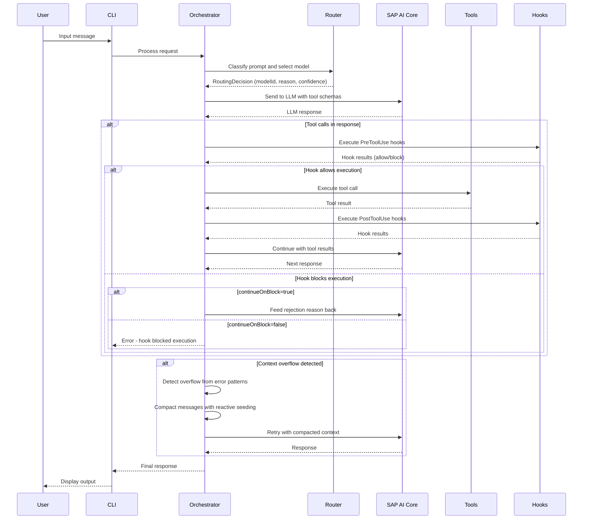
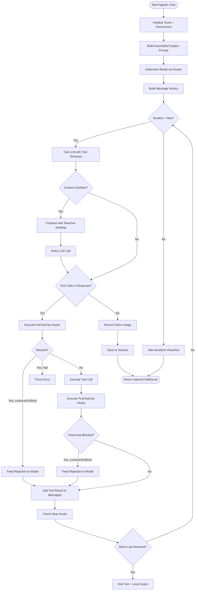
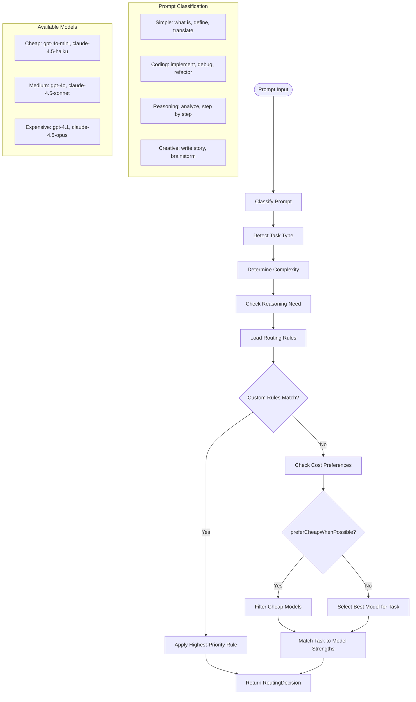
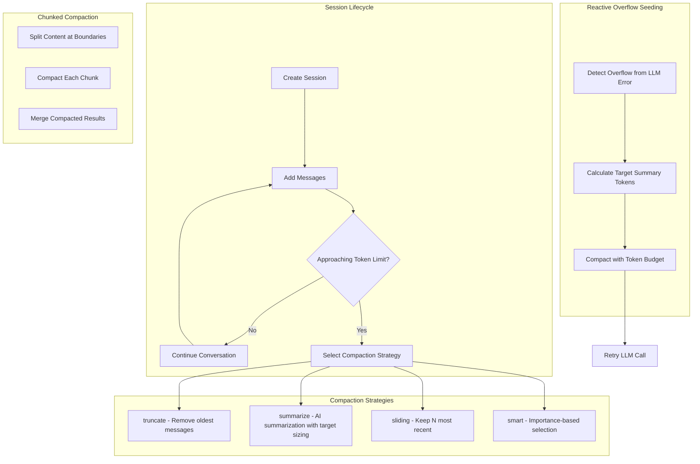
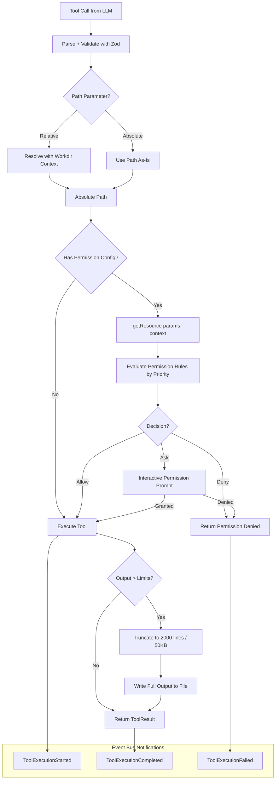

# Alexi Architecture

This document describes the high-level architecture of Alexi, an intelligent LLM orchestrator for SAP AI Core.

## Overview

Alexi is a TypeScript/Node.js CLI application that orchestrates LLM calls through SAP AI Core with intelligent routing, session management, agentic tool execution, lifecycle hooks, and context compaction.

## System Architecture

```mermaid
graph TB
    subgraph CLI["CLI Layer"]
        Program[program.ts]
        Interactive[interactive.ts]
        TUI[tui/ - Ink Components]
    end

    subgraph Core["Core Layer"]
        Orchestrator[orchestrator.ts]
        Router[router.ts]
        SessionManager[sessionManager.ts]
        AgenticChat[agenticChat.ts]
        Compaction[compaction.ts]
        CompactionChunks[compaction-chunks.ts]
    end

    subgraph Providers["Provider Layer"]
        SAP[sapOrchestration.ts]
    end

    subgraph Tools["Tool System"]
        ToolIndex[tool/index.ts]
        Bash[bash.ts]
        Read[read.ts]
        Write[write.ts]
        Edit[edit.ts]
        Glob[glob.ts]
        Grep[grep.ts]
        WarpGrep[warpgrep.ts]
        Task[task.ts]
        TaskStatus[task_status.ts]
        WebFetch[webfetch.ts]
        TodoWrite[todowrite.ts]
    end

    subgraph Support["Support Systems"]
        Bus[bus/index.ts]
        Permission[permission/index.ts]
        Agent[agent/index.ts]
        CustomAgentLoader[customAgentLoader.ts]
        MCP[mcp/client.ts]
        Skill[skill/index.ts]
        Hooks[hooks/index.ts]
        Telemetry[utils/telemetry.ts]
    end

    Program --> Interactive
    Program --> TUI
    Interactive --> Orchestrator
    Orchestrator --> Router
    Orchestrator --> SessionManager
    Orchestrator --> AgenticChat
    AgenticChat --> Compaction
    Compaction --> CompactionChunks
    Router --> SAP
    AgenticChat --> ToolIndex
    AgenticChat --> Hooks
    ToolIndex --> Bash
    ToolIndex --> Read
    ToolIndex --> Write
    ToolIndex --> Edit
    ToolIndex --> Glob
    ToolIndex --> Grep
    ToolIndex --> WarpGrep
    ToolIndex --> Task
    ToolIndex --> TaskStatus
    ToolIndex --> WebFetch
    ToolIndex --> TodoWrite
    Orchestrator --> Bus
    Orchestrator --> Permission
    Orchestrator --> Agent
    Agent --> CustomAgentLoader
    Orchestrator --> MCP
    Orchestrator --> Skill
    Orchestrator --> Telemetry
```



## Module Descriptions

### CLI Layer

| Module | File | Description |
|--------|------|-------------|
| Program | `src/cli/program.ts` | CLI entry point using Commander.js |
| Interactive | `src/cli/interactive.ts` | Interactive REPL mode (legacy) |
| TUI | `src/cli/tui/` | Ink-based terminal UI with React 19 components |
| Commands | `src/cli/commands/` | Modular command registration |

### Core Layer

| Module | File | Description |
|--------|------|-------------|
| Orchestrator | `src/core/orchestrator.ts` | Main orchestration logic |
| Router | `src/core/router.ts` | Model selection and intelligent routing |
| Session Manager | `src/core/sessionManager.ts` | Conversation session persistence |
| Agentic Chat | `src/core/agenticChat.ts` | Autonomous agent with tool execution loop |
| Compaction | `src/core/compaction.ts` | Context window management and summarization |
| Compaction Chunks | `src/core/compaction-chunks.ts` | Chunked compaction for large contexts |
| Stage Manager | `src/core/stageManager.ts` | Workflow stage management |
| Effort Level | `src/core/effortLevel.ts` | Cost/quality tradeoff configuration |

### Provider Layer

| Module | File | Description |
|--------|------|-------------|
| SAP Orchestration | `src/providers/sapOrchestration.ts` | SAP AI Core via SDK (sole production provider) |

All LLM calls route exclusively through the SAP AI Core Orchestration API. The provider resolves model deployments and handles authentication via the `AICORE_SERVICE_KEY` environment variable.

### Tool System

| Tool | File | Description |
|------|------|-------------|
| Bash | `src/tool/tools/bash.ts` | Execute shell commands with permission control |
| Read | `src/tool/tools/read.ts` | Read files and directories with streaming and offset support |
| Write | `src/tool/tools/write.ts` | Write files with BOM handling |
| Edit | `src/tool/tools/edit.ts` | Edit files with exact string replacement |
| Glob | `src/tool/tools/glob.ts` | Find files by pattern matching |
| Grep | `src/tool/tools/grep.ts` | Search file contents with regex |
| WarpGrep | `src/tool/tools/warpgrep.ts` | AI-powered semantic code search |
| Task | `src/tool/tools/task.ts` | Launch sub-agents for complex tasks |
| Task Status | `src/tool/tools/task_status.ts` | Query background task status |
| WebFetch | `src/tool/tools/webfetch.ts` | Fetch web content |
| TodoWrite | `src/tool/tools/todowrite.ts` | Manage structured task lists |
| Question | `src/tool/tools/question.ts` | Ask user questions interactively |
| Suggest | `src/tool/tools/suggest.ts` | Suggest code review actions |

### Support Systems

| Module | File | Description |
|--------|------|-------------|
| Event Bus | `src/bus/index.ts` | Type-safe pub/sub event system with Zod validation |
| Permission | `src/permission/index.ts` | File access control with priority-based rules |
| Agent Registry | `src/agent/index.ts` | Agent registration with built-in and custom agents |
| Custom Agent Loader | `src/agent/customAgentLoader.ts` | Load agents from markdown files with file inclusions |
| MCP Client | `src/mcp/client.ts` | Model Context Protocol server connections |
| Hooks | `src/hooks/index.ts` | Lifecycle hooks (command, HTTP, script) |
| Compaction | `src/compaction/index.ts` | Context compaction with multiple strategies |
| Telemetry | `src/utils/telemetry.ts` | Usage metrics tracking |

## Data Flow



## Agentic Chat Flow



## Routing Decision Flow



## Session Management and Compaction



## Hooks System

The hooks system provides lifecycle hooks for tool execution and session events:

### Hook Events

| Event | Trigger | Use Case |
|-------|---------|----------|
| `SessionStart` | Session begins or resumes | Initialize resources |
| `SessionEnd` | Session terminates | Cleanup |
| `PreToolUse` | Before tool execution | Validate, gate, or transform |
| `PostToolUse` | After successful tool execution | Audit, notify |
| `PostToolUseFailure` | After failed tool execution | Error reporting |
| `Stop` | Agent finishes responding | Loop guards |
| `Error` | Error occurred | Alert, log |

### Hook Types

| Type | Mechanism | Example |
|------|-----------|---------|
| `command` | Spawn child process | `"echo {{toolName}}"` |
| `http` | Fetch with timeout | POST to webhook URL |
| `script` | Dynamic import JS/TS file | Custom validation logic |

### Block Cap

Stop hooks include a consecutive block cap (default: 8, configurable via `ALEXI_STOP_HOOK_BLOCK_CAP`) to prevent infinite loops. When a Stop hook blocks `N` consecutive times, the agentic loop ends automatically.

## Tool System with Context Resolution



## Agent System

### Built-in Agents

| Agent | Mode | Description | Tool Restrictions |
|-------|------|-------------|-------------------|
| `code` | all | General-purpose coding agent | All tools |
| `debug` | all | Debugging and fixing issues | All tools |
| `plan` | all | Implementation planning | Read-only: read, glob, grep, webfetch |
| `explore` | subagent | Fast codebase exploration | Read-only: read, glob, grep |
| `orchestrator` | primary | Multi-agent orchestration | All tools |

### Custom Agent Loading

Custom agents are loaded from markdown files with YAML frontmatter:

```markdown
---
name: "My Agent"
slug: my-agent
mode: all
tools: [read, write, edit, glob, grep, bash]
temperature: 0.3
---

You are a specialized agent for...
```

**File Inclusions**: Agent prompts support `{file:path/to/file}` syntax for including external file content, resolved relative to the agent file's directory. Recursive inclusions are supported up to depth 3.

**Search Paths** (lowest to highest precedence):
1. `~/.alexi/agents/*.md` (user-global)
2. `.alexi/agents/*.md` (project-local)

### Agent Registry

The `AgentRegistry` class manages agent lifecycle:

```typescript
const registry = getAgentRegistry();
await registry.loadCustomAgents(workdir); // Async - resolves file inclusions
const agent = registry.get('code');
const available = registry.listPrimary(); // Agents for direct use
const subagents = registry.listSubagents(); // Agents for Task tool
```

## Event Bus

The event bus (`src/bus/index.ts`) provides a type-safe pub/sub system using Zod for payload validation:

```typescript
import { defineEvent } from '../bus/index.js';
import { z } from 'zod';

// Define a typed event
const MyEvent = defineEvent('my.event', z.object({
  action: z.string(),
  timestamp: z.number(),
}));

// Subscribe
const unsub = MyEvent.subscribe((payload) => {
  console.log(payload.action); // Fully typed
});

// Publish
MyEvent.publish({ action: 'test', timestamp: Date.now() });
```

### Pre-defined Events

| Event | Channel | Payload |
|-------|---------|---------|
| Tool Started | `tool.execution.started` | toolName, toolId, parameters, timestamp |
| Tool Completed | `tool.execution.completed` | toolName, toolId, result, duration, timestamp |
| Tool Failed | `tool.execution.failed` | toolName, toolId, error, duration, timestamp |
| Permission Requested | `permission.requested` | id, toolName, action, resource, description |
| Permission Response | `permission.response` | id, granted, remember |
| Agent Switched | `agent.switched` | from, to, reason |
| Hook Executed | `hook.executed` | event, type, success, duration |
| Hook Failed | `hook.failed` | event, type, error |
| Session Created | `session.created` | sessionId, modelId |
| Stream Chunk | `stream.chunk` | text, isFirst, isLast |

## MCP Integration

Alexi connects to external MCP (Model Context Protocol) servers to aggregate their tools:

```typescript
const mcpManager = new McpClientManager();
await mcpManager.connect(serverConfig, { workdir: '/path/to/project' });
const tools = mcpManager.getAllTools(); // McpToolInfo[]
```

The MCP client supports:
- Stdio transport (spawns child processes)
- Tool discovery and caching (30s TTL)
- Environment variable resolution in server configs
- Connection status tracking per server

## Key Design Decisions

### 1. SAP AI Core as Sole Provider

All LLM calls route through SAP AI Core Orchestration API exclusively. This provides enterprise-grade security, compliance, and centralized model management through SAP's infrastructure.

### 2. Reactive Context Compaction

When the LLM returns a context overflow error, the system:
1. Detects overflow via error message pattern matching
2. Estimates overflow tokens from the error or conversation size
3. Compacts messages using the selected strategy with a target token budget
4. Retries the LLM call with compacted context

### 3. Lifecycle Hooks with Feedback Loop

Hooks can block tool execution with two behaviors:
- **Halt mode** (default): Throws an error, stopping the agentic loop
- **Continue mode** (`continueOnBlock: true`): Feeds the rejection reason back to the model as a user message, allowing it to try a different approach

### 4. Background Tasks (Experimental)

The Task tool supports background execution when `ALEXI_EXPERIMENTAL_BACKGROUND_TASKS=true`. Tasks run asynchronously and can be queried via the `task_status` tool.

### 5. File Inclusion in Agent Prompts

Custom agent prompts support `{file:path}` syntax for composing prompts from multiple files, enabling modular prompt engineering with recursive inclusion up to depth 3.

## Directory Structure

```
alexi/
├── src/
│   ├── agent/          # Agent system with custom loader
│   ├── bus/            # Type-safe event bus
│   ├── cli/            # CLI entry points and TUI
│   ├── compaction/     # Context compaction strategies
│   ├── config/         # Environment, routing, user config
│   ├── core/           # Orchestrator, router, session, agentic chat
│   ├── hooks/          # Lifecycle hooks (command, HTTP, script)
│   ├── mcp/            # Model Context Protocol client
│   ├── permission/     # Permission management
│   ├── providers/      # SAP AI Core provider
│   ├── skill/          # Specialized prompt skills
│   ├── tool/           # Tool system and implementations
│   └── utils/          # Logger, telemetry, shared utilities
├── tests/              # Vitest test suites
├── docs/               # Documentation
└── .github/workflows/  # CI/CD and automation
```

## Security Considerations

1. **Secrets Management**: SAP AI Core credentials stored in `AICORE_SERVICE_KEY` environment variable
2. **Permission System**: File access controlled by configurable priority-based rules
3. **Hook Isolation**: Hooks execute in child processes with controlled environment
4. **Block Cap**: Stop hook loop guard prevents infinite agentic loops
5. **Output Truncation**: Tool output limited to 2000 lines / 50KB to prevent context overflow
6. **Type Safety**: Strict TypeScript with Zod runtime validation
