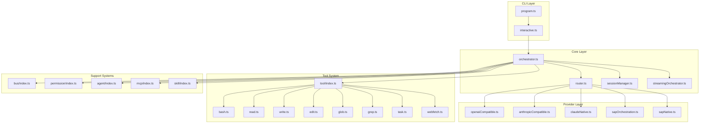
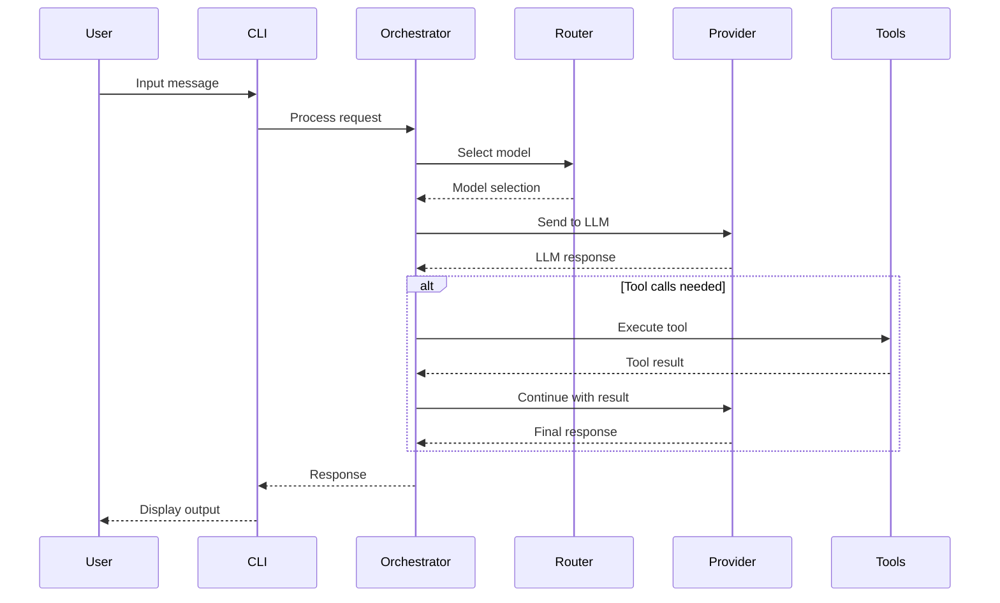
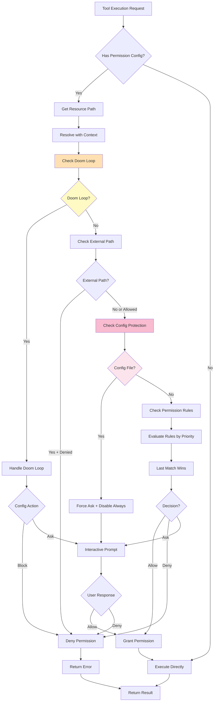
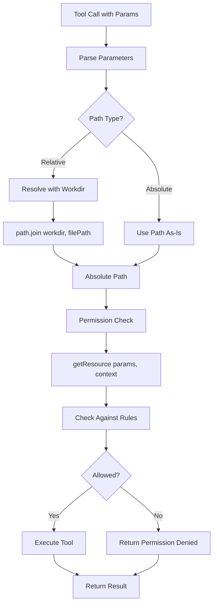
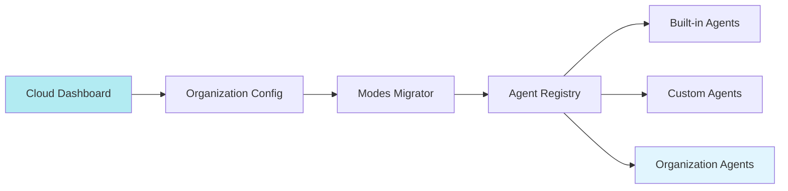
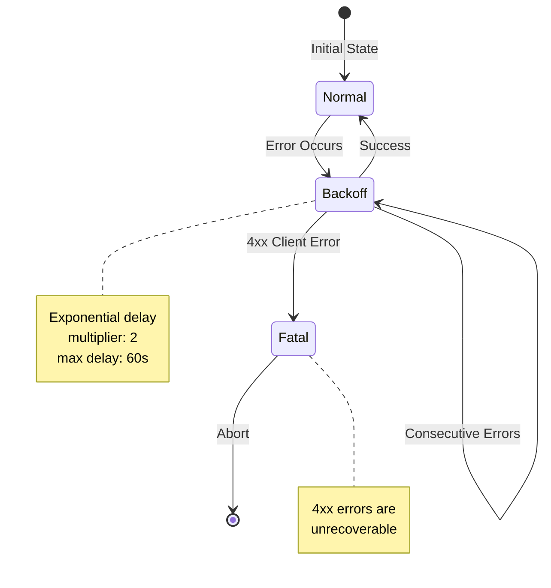
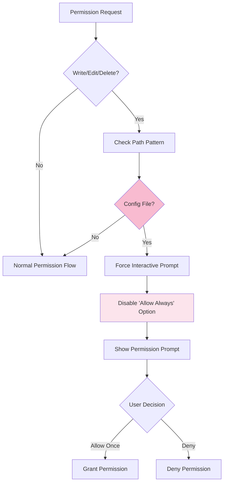
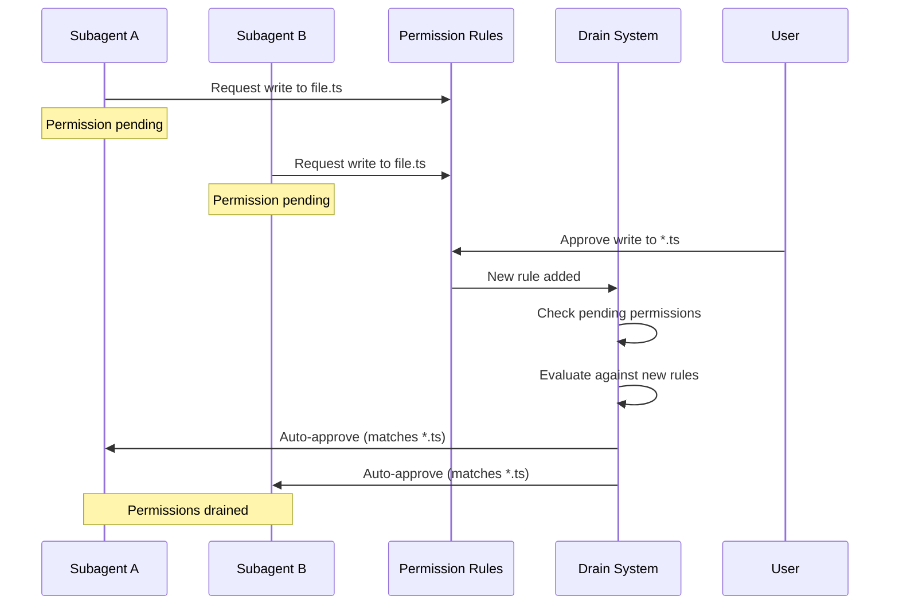
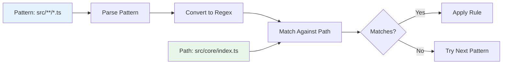
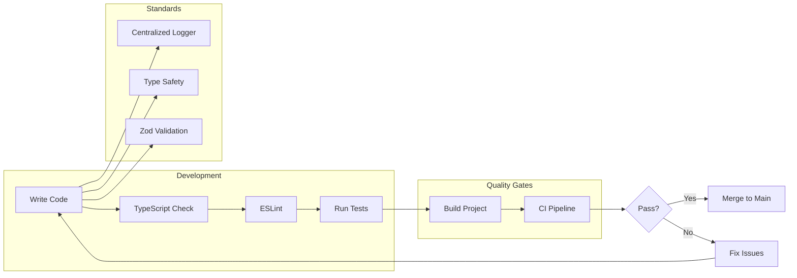

# Alexi Architecture

This document describes the high-level architecture of Alexi, an AI-powered CLI assistant.

## Overview

Alexi is a TypeScript/Node.js application that orchestrates multiple LLM providers with intelligent routing, session management, and extensible tool systems.

## System Architecture



## Module Descriptions

### CLI Layer

| Module | File | Description |
|--------|------|-------------|
| Program | `src/cli/program.ts` | CLI entry point using Commander.js |
| Interactive | `src/cli/interactive.ts` | Interactive mode with streaming UI |
| Completer | `src/cli/utils/completer.ts` | Unified autocomplete engine for commands, models, paths |
| Keybindings | `src/cli/utils/keybindings.ts` | Keyboard shortcut handling |

### Core Layer

| Module | File | Description |
|--------|------|-------------|
| Orchestrator | `src/core/orchestrator.ts` | Main orchestration logic |
| Router | `src/core/router.ts` | Model selection and routing |
| Session Manager | `src/core/sessionManager.ts` | Conversation session persistence |
| Streaming Orchestrator | `src/core/streamingOrchestrator.ts` | Real-time streaming support |
| Agentic Chat | `src/core/agenticChat.ts` | Autonomous agent with tool execution loop |
| Stage Manager | `src/core/stageManager.ts` | Workflow stage management |
| Workflow Manager | `src/core/workflowManager.ts` | Multi-stage workflow orchestration |

### Provider Layer

| Module | File | Description |
|--------|------|-------------|
| OpenAI Compatible | `src/providers/openaiCompatible.ts` | OpenAI API compatible provider |
| Anthropic Compatible | `src/providers/anthropicCompatible.ts` | Anthropic Messages API |
| Claude Native | `src/providers/claudeNative.ts` | Direct Claude integration |
| SAP Orchestration | `src/providers/sapOrchestration.ts` | SAP AI Core via SDK |
| SAP Native | `src/providers/sapNative.ts` | Native SAP AI Core API |

### Tool System

| Tool | File | Description |
|------|------|-------------|
| Bash | `src/tool/tools/bash.ts` | Execute shell commands |
| Bash Hierarchy | `src/tool/tools/bash-hierarchy.ts` | Hierarchical permission rules for bash commands |
| Read | `src/tool/tools/read.ts` | Read files and directories |
| Write | `src/tool/tools/write.ts` | Write files |
| Edit | `src/tool/tools/edit.ts` | Edit files with string replacement |
| Glob | `src/tool/tools/glob.ts` | Find files by pattern |
| Grep | `src/tool/tools/grep.ts` | Search file contents |
| WarpGrep | `src/tool/tools/warpgrep.ts` | AI-powered semantic code search |
| Task | `src/tool/tools/task.ts` | Launch sub-agents |
| WebFetch | `src/tool/tools/webfetch.ts` | Fetch web content |
| Question | `src/tool/tools/question.ts` | Ask user questions |
| TodoWrite | `src/tool/tools/todowrite.ts` | Manage task lists |

### Support Systems

| Module | File | Description |
|--------|------|-------------|
| Event Bus | `src/bus/index.ts` | Pub/sub event system |
| Permission | `src/permission/index.ts` | File access control with config protection |
| Permission Config Paths | `src/permission/config-paths.ts` | Config file detection and protection |
| Permission Drain | `src/permission/drain.ts` | Auto-resolve pending permissions |
| Permission Pattern Matching | `src/permission/next.ts` | Glob pattern matching for permissions |
| Agent | `src/agent/index.ts` | Autonomous agent system with org support |
| Agent System | `src/agent/system.ts` | Multi-layer system prompt assembly |
| Modes Migrator | `src/config/modes-migrator.ts` | Organization mode synchronization |
| Error Backoff | `src/core/error-backoff.ts` | Circuit breaker and exponential backoff |
| MCP | `src/mcp/index.ts` | Model Context Protocol |
| Skill | `src/skill/index.ts` | Specialized prompt skills |
| Compaction | `src/compaction/index.ts` | Context compression |
| Profile | `src/profile/index.ts` | User profile management |
| User Config | `src/config/userConfig.ts` | Persistent user configuration |
| Logger | `src/utils/logger.ts` | Centralized logging utility |

## Data Flow



## Agentic Chat Flow


## Permission System Flow



## Tool System with Context Resolution

The tool system resolves relative paths using the workdir context:



## Instruction File System

Alexi uses a multi-layer instruction file system to provide context to AI agents:

```mermaid
graph TB
    subgraph Sources[\"Instruction Sources\"]
        Soul[Soul Prompt<br/>core identity]
        Model[Model Prompt<br/>Anthropic/OpenAI/Gemini]
        Env[Environment Info<br/>workdir, git, platform]
        Agent[Agent Prompt<br/>code/debug/plan/explore]
        Project[Project AGENTS.md<br/>./AGENTS.md]
        User[User ALEXI.md<br/>~/.alexi/ALEXI.md]
        Rules[Project Rules<br/>.alexi/rules/*.md]
        Custom[Custom Rules<br/>user-provided]
    end
    
    subgraph Assembly[\"System Prompt Assembly\"]
        Assemble[buildAssembledSystemPrompt]
    end
    
    subgraph Output[\"Final Prompt\"]
        System[Complete System Prompt]
    end
    
    Soul --> Assemble
    Model --> Assemble
    Env --> Assemble
    Agent --> Assemble
    Project --> Assemble
    User --> Assemble
    Rules --> Assemble
    Custom --> Assemble
    
    Assemble --> System
    
    style Soul fill:#E3F2FD
    style Model fill:#E8F5E9
    style Agent fill:#FFF3E0
    style Project fill:#F3E5F5
    style User fill:#FCE4EC
    style Rules fill:#E0F2F1
    style System fill:#4CAF50
```

### Instruction File Locations

| File | Path | Purpose |
|------|------|---------|
| Project Instructions | `./AGENTS.md` | Project-specific context, coding standards, build commands |
| User Instructions | `~/.alexi/ALEXI.md` | Global user preferences applied to all projects |
| Project Rules | `./.alexi/rules/*.md` | Scoped rules for specific aspects (API design, security, etc.) |

### Managing Instruction Files

```bash
# List all instruction files
/memory

# Edit project instructions
/memory edit project

# Edit user instructions
/memory edit user

# Create AGENTS.md from template
/memory init
```

## Organization-Managed Agents

Alexi supports organization-managed agents that sync from cloud configuration:



### Organization Agent Features

1. **Cloud Synchronization**: Agents defined in organization dashboard automatically sync to local registry
2. **Protected Removal**: Organization-managed agents cannot be removed locally
3. **Display Names**: Support for human-readable names separate from agent IDs
4. **Metadata Options**: Extensible options field for organization-specific configuration

### Organization Agent Schema

```typescript
interface OrgMode {
  name: string;
  displayName?: string;
  description?: string;
  steps?: string[];
  options?: Record<string, unknown>;
  permission?: Record<string, unknown>;
}

// Migrated to agent registry as:
interface AgentConfig {
  id: string;
  name: string;
  displayName?: string;
  description: string;
  mode: 'primary' | 'subagent' | 'all';
  systemPrompt: string;
  options?: {
    source: 'organization';
    displayName?: string;
    [key: string]: unknown;
  };
}
```

### Agent Removal Protection

```typescript
// Attempting to remove organization agent
removeAgent('org-mode-id');
// Throws: "Cannot remove organization agent — manage it from the cloud dashboard: org-mode-id"

// Attempting to remove built-in agent
removeAgent('code');
// Throws: "Cannot remove built-in agent: code"

// Custom agents can be removed
removeAgent('my-custom-agent');
// Returns: true
```

## Error Backoff System

Alexi includes a circuit breaker pattern for handling API errors gracefully:



### Error Backoff Configuration

```typescript
interface BackoffConfig {
  initialDelayMs: number;  // Default: 1000ms
  maxDelayMs: number;      // Default: 60000ms
  multiplier: number;      // Default: 2
  maxRetries: number;      // Default: 5
}

const backoff = new ErrorBackoff({
  initialDelayMs: 2000,
  maxDelayMs: 120000,
  multiplier: 2,
  maxRetries: 3
});

// Record errors
backoff.recordError(500); // Transient error
backoff.recordError(429); // Rate limit

// Check if should backoff
if (backoff.shouldBackoff()) {
  const delayMs = backoff.getRemainingBackoffMs();
  await sleep(delayMs);
}

// Record success to reset
backoff.recordSuccess();

// Check for fatal errors (4xx)
if (backoff.isFatal()) {
  throw new Error('Unrecoverable client error');
}
```

### Backoff Delay Calculation

| Attempt | Delay (1s initial, 2x multiplier) |
|---------|-----------------------------------|
| 1 | 1 second |
| 2 | 2 seconds |
| 3 | 4 seconds |
| 4 | 8 seconds |
| 5 | 16 seconds |
| 6+ | 60 seconds (max) |

## Config File Protection

The permission system includes special protection for configuration files:



### Protected Configuration Paths

**Config Directories** (at any depth):
- `.alexi/`
- `.kilo/`
- `.kilocode/`
- `.opencode/`

**Excluded Subdirectories** (not protected):
- `.alexi/plans/`
- `.kilocode/plans/`

**Root-Level Config Files**:
- `alexi.json`, `alexi.jsonc`
- `kilo.json`, `kilo.jsonc`
- `opencode.json`, `opencode.jsonc`
- `AGENTS.md`

### Config Protection API

```typescript
import { ConfigProtection } from './permission/config-paths.js';

// Check if relative path is config file
ConfigProtection.isRelative('.alexi/config.json'); // true
ConfigProtection.isRelative('.alexi/plans/feature.md'); // false (excluded)
ConfigProtection.isRelative('AGENTS.md'); // true
ConfigProtection.isRelative('src/index.ts'); // false

// Check if absolute path is config file
const cwd = process.cwd();
ConfigProtection.isAbsolute(`${cwd}/.alexi/config.json`, cwd); // true
ConfigProtection.isAbsolute(`${cwd}/src/index.ts`, cwd); // false

// Check if permission request targets config files
ConfigProtection.isRequest({
  permission: 'write',
  patterns: ['.alexi/config.json']
}); // true

ConfigProtection.isRequest({
  permission: 'read',
  patterns: ['.alexi/config.json']
}); // false (read is allowed)

// Metadata key for disabling "always" option
const key = ConfigProtection.DISABLE_ALWAYS_KEY; // 'disableAlways'
```

## Permission Drain System

The drain system automatically resolves pending permissions when new rules are added:



### Drain System Features

1. **Automatic Resolution**: Pending permissions automatically resolve when covered by new rules
2. **Config File Exemption**: Config file edits never auto-resolve (always require explicit approval)
3. **Sibling Coordination**: When one subagent gets permission, siblings with same request auto-approve
4. **Denial Propagation**: When permission is denied, matching pending requests auto-reject

### Drain API

```typescript
import { drainCovered } from './permission/drain.js';

await drainCovered(
  pendingRequests,      // Map of pending permission requests
  approvedRules,        // Newly approved rules
  evaluateFunction,     // Permission evaluation function
  events,               // Event system for notifications
  DeniedError,          // Error class for rejections
  excludeRequestId      // Optional: exclude specific request from drain
);
```

## Pattern Matching System

The permission system uses glob patterns for flexible matching:



### Supported Wildcards

| Wildcard | Meaning | Example |
|----------|---------|---------|
| `*` | Match any characters except `/` | `*.ts` matches `file.ts` but not `dir/file.ts` |
| `**` | Match any characters including `/` | `src/**/*.ts` matches `src/a/b/file.ts` |
| `?` | Match single character | `file?.ts` matches `file1.ts` but not `file10.ts` |

### Pattern Matching Examples

```typescript
import { matchesPattern } from './permission/next.js';

// Exact match
matchesPattern('file.ts', 'file.ts'); // true

// Wildcard match
matchesPattern('*.ts', 'index.ts'); // true
matchesPattern('*.ts', 'dir/index.ts'); // false

// Globstar match
matchesPattern('src/**/*.ts', 'src/core/index.ts'); // true
matchesPattern('src/**/*.ts', 'src/a/b/c/file.ts'); // true

// Question mark match
matchesPattern('file?.ts', 'file1.ts'); // true
matchesPattern('file?.ts', 'file10.ts'); // false

// Catch-all
matchesPattern('*', 'anything'); // true
```

### Rule Evaluation

```typescript
import { evaluatePatternRules } from './permission/next.js';

const rules = [
  { pattern: 'src/**/*.ts', action: 'allow' },
  { pattern: 'src/**/test/*.ts', action: 'deny' },
  { pattern: 'src/core/*.ts', action: 'allow' }
];

// First matching rule wins
evaluatePatternRules(rules, 'src/core/index.ts'); // 'allow'
evaluatePatternRules(rules, 'src/test/file.ts'); // 'deny'
evaluatePatternRules(rules, 'docs/README.md'); // undefined
```


## Configuration

### Environment Variables

```
AICORE_SERVICE_KEY    # SAP AI Core credentials
AICORE_RESOURCE_GROUP # SAP AI Core resource group
OPENAI_API_KEY        # OpenAI API key (optional)
ANTHROPIC_API_KEY     # Anthropic API key (optional)
```

### Routing Configuration

Routing rules are defined in `routing-config.json` or `~/.alexi/routing-config.json`:

```json
{
  "rules": [
    {
      "name": "code-tasks",
      "priority": 100,
      "condition": { "contains": ["code", "implement", "fix"] },
      "model": "anthropic--claude-4-sonnet"
    }
  ],
  "default": {
    "model": "anthropic--claude-4-sonnet"
  }
}
```

## Directory Structure

```
alexi/
├── src/
│   ├── cli/           # CLI entry points
│   ├── core/          # Core orchestration
│   ├── providers/     # LLM providers
│   ├── tool/          # Tool system
│   │   └── tools/     # Individual tools
│   ├── agent/         # Agent system
│   ├── bus/           # Event bus
│   ├── permission/    # Permission system
│   ├── mcp/           # MCP integration
│   ├── skill/         # Skill system
│   ├── config/        # Configuration
│   ├── log/           # Logging
│   ├── profile/       # Profile management
│   └── ...
├── tests/             # Test files
├── dist/              # Compiled output
└── docs/              # Documentation
```

## Key Design Decisions

### 1. Multi-Provider Architecture

Alexi supports multiple LLM providers through a unified interface, allowing:
- Easy switching between providers
- Fallback mechanisms
- Cost optimization through routing

### 2. Tool System with Permission Control

Tools are implemented as independent modules that:
- Follow a consistent interface based on Zod schema validation
- Can be enabled/disabled per session
- Support permission-based access control with last-match-wins rule evaluation
- Resolve relative paths using workdir context for agentic operations
- Support interactive permission prompts and high-priority allow rules
- Convert Zod schemas to JSON Schema for LLM function calling with proper type handling

### 3. Agentic Execution Mode

The agentic chat system enables autonomous file operations:
- Automatic permission configuration for write and execute actions
- High-priority allow rules (priority 200) override default ask prompts
- External directory access for full workspace capability
- Tool execution loop with LLM-driven decision making
- Iteration limits to prevent infinite loops (default: 50)

### 4. Event-Driven Architecture

The event bus enables:
- Loose coupling between modules
- Plugin extensibility
- Real-time streaming updates
- Permission events (DoomLoopDetected, ExternalAccessAttempted)

### 5. Session Management

Sessions provide:
- Multi-turn conversation context
- Persistence across CLI invocations
- Export and sharing capabilities

## Security Considerations

1. **Secrets Management**: Secrets are redacted in exports and logs
2. **Permission System**: File access is controlled by configurable rules
3. **Environment Isolation**: Sensitive config stored in `~/.alexi/`
4. **Type Safety**: Strict TypeScript configuration with proper type assertions
5. **Logging**: Centralized logger replaces direct console calls for better control

## Logging System

Alexi uses a centralized logging utility to provide consistent logging across the application.

### Logger API

```typescript
import { logger } from './utils/logger.js';

// Set log level (debug, info, warn, error)
logger.setLevel('debug');

// Log messages at different levels
logger.debug('Debug message', additionalData);
logger.info('Info message');
logger.warn('Warning message');
logger.error('Error message', error);

// Print without formatting (for CLI output)
logger.print('Raw output');
```

### Log Levels

| Level | Priority | Description | Output Format |
|-------|----------|-------------|---------------|
| `debug` | 0 | Detailed debugging information | `[DEBUG] message` |
| `info` | 1 | General informational messages | `message` (no prefix) |
| `warn` | 2 | Warning messages | `[WARN] message` |
| `error` | 3 | Error messages | `[ERROR] message` |

The logger respects the configured log level and only outputs messages at or above that level. The default level is `info`.

### ESLint Integration

The logger utility is the only module permitted to use direct console calls. All other modules should import and use the centralized logger to maintain ESLint compliance.

```typescript
// ❌ Avoid direct console usage
console.log('message');

// ✅ Use centralized logger
import { logger } from './utils/logger.js';
logger.info('message');
```

## Type Safety and Code Quality

### TypeScript Configuration

Alexi uses strict TypeScript configuration with proper type assertions:

```typescript
// Model capability filtering with explicit type assertion
const models = config.models.filter(
  (m) => (m as ModelCapability & { enabled?: boolean }).enabled !== false
);

// Zod schema type handling with interface definitions
interface ZodDefBase {
  description?: string;
}

const def = (schema as unknown as { _def: ZodDefBase })._def;
```

### ESLint Rules

Key ESLint rules enforced:

- `no-console: warn` - Prevents direct console usage (except in logger)
- `@typescript-eslint/no-explicit-any: warn` - Flags any type usage
- `@typescript-eslint/no-unused-vars: error` - Prevents unused variables
- `prefer-const: error` - Enforces const for immutable variables
- `eqeqeq: error` - Requires strict equality checks

### Code Quality Diagram



## Future Improvements

- [ ] Add more provider implementations
- [ ] Improve test coverage
- [ ] Add metrics and telemetry
- [ ] Implement caching layer
- [ ] Add web UI option
