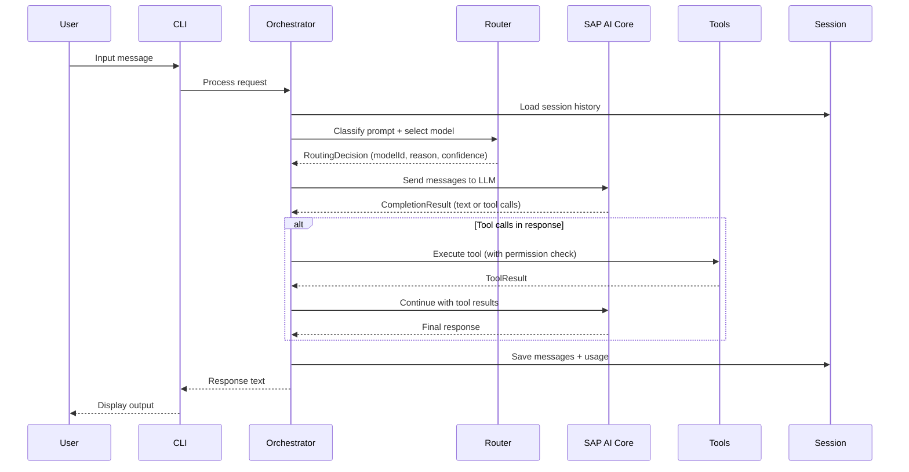
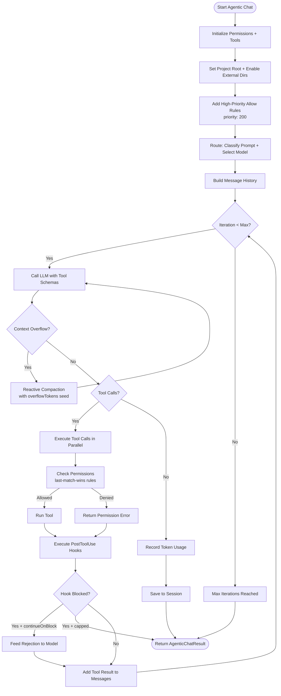
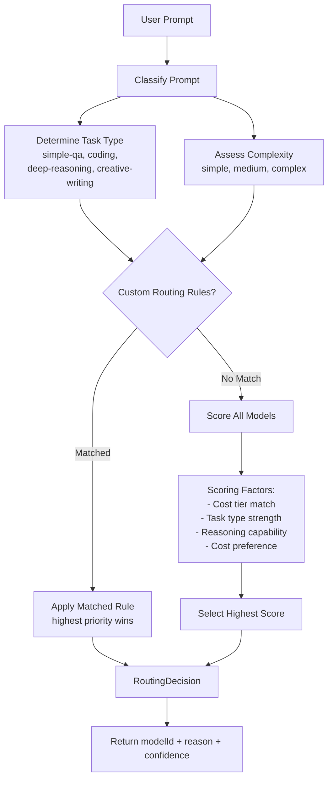
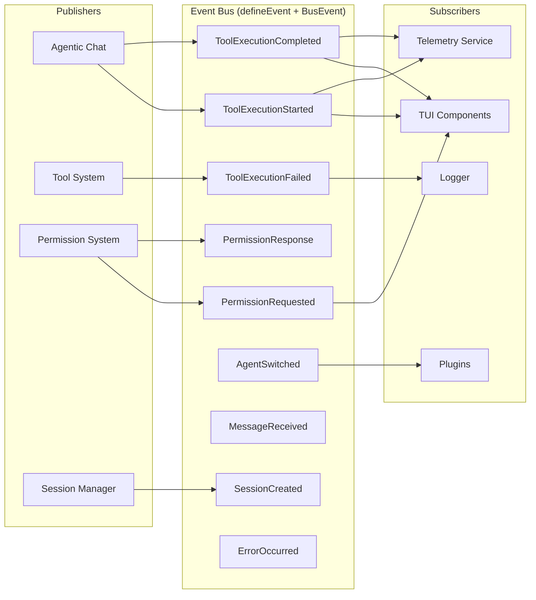
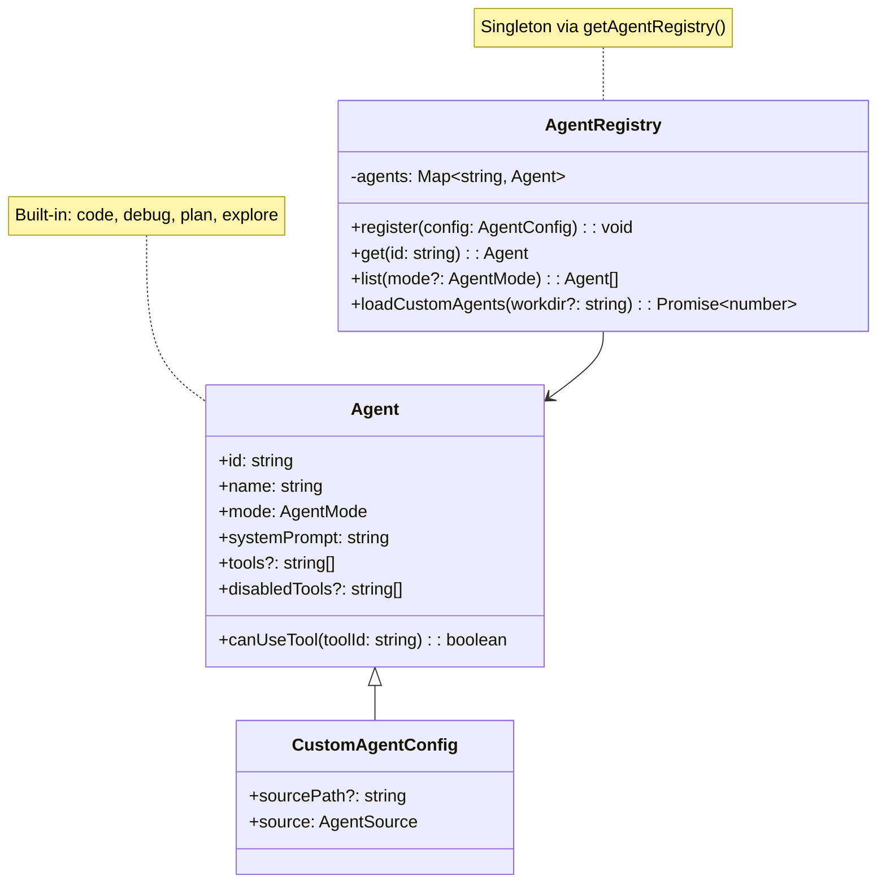
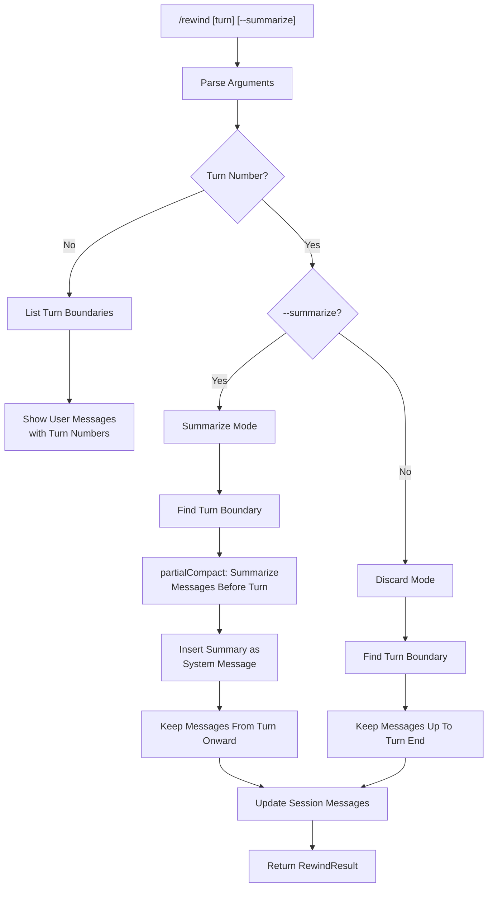
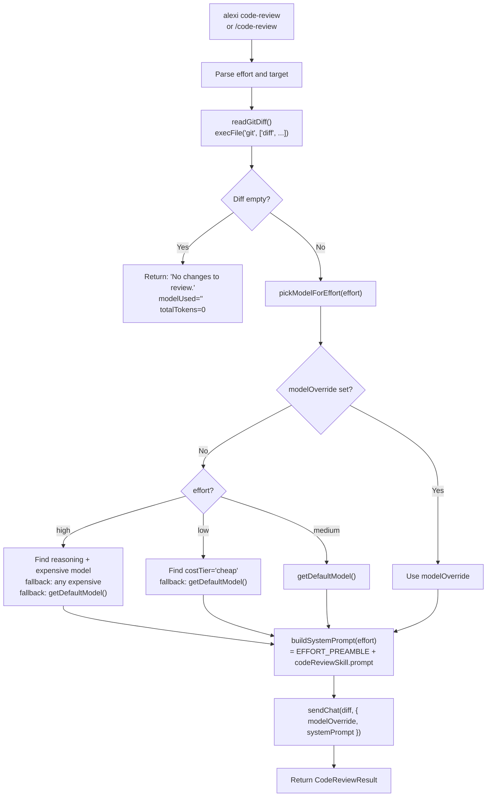
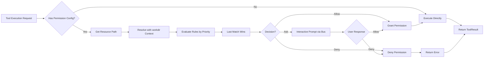

# Alexi Architecture

This document describes the high-level architecture of Alexi, an intelligent LLM orchestrator for SAP AI Core.

## Overview

Alexi is a TypeScript/Node.js CLI application that orchestrates LLM calls exclusively through SAP AI Core, featuring intelligent routing, multi-turn session management, agentic tool execution, lifecycle hooks, context compaction, and an extensible tool system with 30+ built-in tools.

## System Architecture

```mermaid
graph TB
    subgraph CLI["CLI Layer"]
        Program[program.ts]
        Interactive[interactive.ts]
        TUI[Ink TUI]
    end

    subgraph Core["Core Layer"]
        Orchestrator[orchestrator.ts]
        AgenticChat[agenticChat.ts]
        Router[router.ts]
        SessionManager[sessionManager.ts]
        StreamingOrch[streamingOrchestrator.ts]
        Compaction[compaction/index.ts]
        CompactionChunks[compaction-chunks.ts]
        NetworkMgr[network.ts]
    end

    subgraph Provider["Provider Layer (SAP AI Core)"]
        SAPOrch[sapOrchestration.ts]
        Auth[auth.ts]
        Transform[transform.ts]
    end

    subgraph Tools["Tool System"]
        ToolIndex[tool/index.ts]
        Bash[bash.ts]
        Read[read.ts]
        Write[write.ts]
        Edit[edit.ts]
        Glob[glob.ts]
        Grep[grep.ts]
        Task[task.ts]
        WebFetch[webfetch.ts]
        TaskStatus[task_status.ts]
    end

    subgraph Support["Support Systems"]
        Bus[bus/index.ts]
        Permission[permission/index.ts]
        Agent[agent/index.ts]
        MCP[mcp/index.ts]
        Hooks[hooks/index.ts]
        Skill[skill/index.ts]
        Reference[reference/index.ts]
    end

    subgraph Commands["Command System"]
        Rewind[command/rewind.ts]
        SessionReplay[cli/session-replay.ts]
    end

    Program --> Interactive
    Program --> TUI
    Interactive --> Orchestrator
    TUI --> Orchestrator
    Orchestrator --> Router
    Orchestrator --> SessionManager
    Orchestrator --> StreamingOrch
    AgenticChat --> Router
    AgenticChat --> Compaction
    AgenticChat --> Hooks
    Compaction --> CompactionChunks
    Router --> SAPOrch
    SAPOrch --> Auth
    SAPOrch --> Transform
    AgenticChat --> ToolIndex
    ToolIndex --> Bash
    ToolIndex --> Read
    ToolIndex --> Write
    ToolIndex --> Edit
    ToolIndex --> Glob
    ToolIndex --> Grep
    ToolIndex --> Task
    ToolIndex --> WebFetch
    ToolIndex --> TaskStatus
    Orchestrator --> Bus
    Orchestrator --> Permission
    Orchestrator --> Agent
    Orchestrator --> MCP
    Orchestrator --> Skill
    Orchestrator --> NetworkMgr
    Interactive --> Rewind
    Rewind --> Compaction
    Interactive --> SessionReplay
    Orchestrator --> Reference
```



## Module Descriptions

### CLI Layer

| Module | File | Description |
|--------|------|-------------|
| Program | `src/cli/program.ts` | CLI entry point using Commander.js, registers 10 command groups |
| Interactive | `src/cli/interactive.ts` | Legacy interactive mode (deprecated in favor of TUI) |
| TUI | `src/cli/tui/` | Full-screen Ink/React TUI with streaming, dialogs, and slash commands |

### Core Layer

| Module | File | Description |
|--------|------|-------------|
| Orchestrator | `src/core/orchestrator.ts` | Single-turn `sendChat()` with routing and session |
| Agentic Chat | `src/core/agenticChat.ts` | Multi-turn autonomous agent with tool loop, compaction, and hooks |
| Router | `src/core/router.ts` | Model selection based on prompt classification and routing rules |
| Session Manager | `src/core/sessionManager.ts` | File-based session persistence to `~/.alexi/sessions/` |
| Streaming Orchestrator | `src/core/streamingOrchestrator.ts` | Real-time streaming support |
| Compaction | `src/compaction/index.ts` | Context compression with multiple strategies |
| Compaction Chunks | `src/core/compaction-chunks.ts` | Splits large contexts into manageable chunks for API limits |
| Network Manager | `src/core/network.ts` | Auto-reconnection with exponential backoff |
| Core Flags | `src/core/flag.ts` | Minimal feature-flag module exposing environment-driven boolean flags consumed by `alexi` (e.g. `KILO_DISABLE_EXTERNAL_SKILLS`). Evaluated once at module load via a private `truthy()` helper that matches `"true"` or `"1"` (case-insensitive). |

### Provider Layer

Alexi uses a **single provider architecture** -- all LLM calls route exclusively through SAP AI Core Orchestration API.

| Module | File | Description |
|--------|------|-------------|
| SAP Orchestration | `src/providers/sapOrchestration.ts` | Sole provider via `@sap-ai-sdk/orchestration` |
| Auth | `src/providers/auth.ts` | OAuth token management for SAP AI Core |
| Transform | `src/providers/transform.ts` | Message format transformation for SAP API |
| Model Match | `src/providers/model-match.ts` | Model ID resolution for deployments |
| Session Headers | `src/providers/sessionHeaders.ts` | HTTP header management for sessions |

Provider resolution:

```typescript
// src/providers/index.ts
function getDefaultModel(): string {
  // 1. AICORE_MODEL env variable
  // 2. ~/.alexi/config.json defaultModel
  // 3. Fallback: 'gpt-4o'
}

function getProviderForModel(modelId: string): SapOrchestrationProvider {
  // Single provider handles all models via SAP AI Core
}
```

### Tool System

Alexi registers **30 built-in tools** via `registerBuiltInTools()`:

| Tool | File | Permission | Description |
|------|------|-----------|-------------|
| `bash` | `bash.ts` | execute | Execute shell commands with timeout |
| `read` | `read.ts` | read | Read files and directories (auto-extracts text from `.docx` via mammoth and `.xlsx`/`.xlsm` via xlsx) |
| `write` | `write.ts` | write | Write/create files |
| `edit` | `edit.ts` | write | Exact string replacement in files |
| `glob` | `glob.ts` | read | Find files by pattern |
| `grep` | `grep.ts` | read | Search file contents by regex |
| `warpgrep` | `warpgrep.ts` | read | AI-powered semantic code search |
| `task` | `task.ts` | -- | Launch sub-agent tasks (foreground/background) |
| `task_status` | `task_status.ts` | -- | Query background task status |
| `webfetch` | `webfetch.ts` | network | Fetch web content |
| `websearch` | `websearch.ts` | network | Web search |
| `question` | `question.ts` | -- | Ask user questions |
| `todowrite` | `todowrite.ts` | -- | Manage task lists |
| `suggest` | `suggest.ts` | -- | Suggest next actions |
| `delete` | `delete.ts` | write | Delete files |
| `multiedit` | `multiedit.ts` | write | Multiple edits in one call |
| `ls` | `ls.ts` | read | List directory contents |
| `skill` | `skill.ts` | -- | Load specialized skills |
| `definitions` | `definitions.ts` | read | Get code definitions |
| `browser` | `browser.ts` | network | Browser automation |
| `diagnostics` | `diagnostics.ts` | read | Code diagnostics |
| `batch` | `batch.ts` | -- | Batch tool execution |
| `memory` | `memory.ts` | -- | Store/retrieve memories |
| `recall` | `recall.ts` | -- | Recall past sessions |
| `agent-manager` | `agent-manager.ts` | admin | Manage agent instances |
| `apply-patch` | `apply-patch.ts` | write | Apply code patches |
| `repo-clone` | `repo-clone.ts` | execute | Clone repositories |

### Support Systems

| Module | File | Description |
|--------|------|-------------|
| Event Bus | `src/bus/index.ts` | Typed pub/sub event system with Zod validation |
| Permission | `src/permission/index.ts` | Last-match-wins rule evaluation with doom loop detection |
| Agent | `src/agent/index.ts` | Agent registry with built-in + custom agents |
| Hooks | `src/hooks/index.ts` | Lifecycle hooks (command, HTTP, script) with block cap |
| MCP | `src/mcp/index.ts` | Model Context Protocol client/server integration |
| Skill | `src/skill/index.ts` | Specialized prompt injection for domain tasks |
| Compaction | `src/compaction/index.ts` | Context window management with 4 strategies |
| Telemetry | `src/utils/telemetry.ts` | Usage metrics tracking |
| Reference | `src/reference/index.ts` | External repository references with typed cache |
| Plugin Tools | `src/tool/plugin-tools.ts` | Plugin tool compatibility wrappers |
| Tool Registry | `src/tool/registry.ts` | Enhanced registry with prompt-based tool resolution |

## Data Flow



## Agentic Chat Flow

The agentic chat system (`src/core/agenticChat.ts`) implements an autonomous multi-turn execution loop with context overflow recovery, lifecycle hooks, and compaction:



### Context Overflow Recovery

When the LLM returns a context-length error, the agentic chat detects it via pattern matching and triggers reactive compaction:

```typescript
// Error patterns detected:
const CONTEXT_OVERFLOW_PATTERNS = [
  /context.length/i,
  /context.*exceeded/i,
  /token.*limit.*exceeded/i,
  /max_tokens_exceeded/i,
  // ...
];

// Compaction with overflow seeding:
const { messages: compactedMessages } = await checkAndCompact(
  messages, { strategy: 'summarize', overflowTokens }
);
```

The `overflowTokens` parameter seeds the target summary length so the compacted context fits within limits.

## Routing Decision Flow



### Model Capability Registry

```typescript
interface ModelCapability {
  id: string;
  type: 'openai' | 'claude' | 'gemini';
  costTier: 'cheap' | 'medium' | 'expensive';
  strengths: string[];   // e.g., ['coding', 'deep-reasoning']
  maxTokens: number;
  reasoning: boolean;
}
```

## Event Bus Architecture

The event bus (`src/bus/index.ts`) provides typed pub/sub with Zod schema validation:



### Event API

```typescript
import { defineEvent, BusEvent } from '../bus/index.js';
import { z } from 'zod';

// Define a typed event
const MyEvent = defineEvent('MyEvent', z.object({
  toolName: z.string(),
  duration: z.number(),
}));

// Subscribe (handler added eagerly to prevent race conditions)
const unsub = MyEvent.subscribe((payload) => {
  console.log(payload.toolName, payload.duration);
});

// Publish
MyEvent.publish({ toolName: 'read', duration: 42 });

// Async publish (waits for all handlers)
await MyEvent.publishAsync({ toolName: 'write', duration: 100 });

// One-time listener
MyEvent.once((payload) => { /* ... */ });

// Wait for event with predicate
const result = await waitForEvent(MyEvent, (p) => p.toolName === 'bash', 5000);
```

### Eager Subscription

Subscriptions are acquired eagerly to prevent race conditions where events could be missed between the `subscribe()` call and the first `listen`. The handler is immediately added to the event handler set before the unsubscribe function is returned.

## Agent System



### Built-in Agents

| ID | Name | Mode | Purpose |
|----|------|------|---------|
| `code` | Code Agent | all | General-purpose coding (default) |
| `debug` | Debug Agent | all | Debugging and fixing issues |
| `plan` | Plan Agent | all | Architecture and planning (read-only tools) |
| `explore` | Explore Agent | subagent | Fast codebase exploration |

### Custom Agent Loading

Custom agents are loaded from markdown files with YAML frontmatter:

```markdown
---
slug: my-agent
name: My Custom Agent
mode: primary
tools: [read, write, edit, bash]
---

You are a specialized agent for...
```

Agents support `{file:path/to/file}` inclusions (recursive, max depth 3) resolved relative to the agent file's directory.

Loading order (lowest precedence first, duplicates overwrite):
1. `~/.alexi/agents/*.md` (user-global)
2. `.alexi/agents/*.md` (project-local)

## Hooks System

The hooks system (`src/hooks/index.ts`) provides lifecycle callbacks for tool execution and session events:

```typescript
interface HookDefinition {
  event: HookEvent;    // SessionStart, PreToolUse, PostToolUse, Stop, etc.
  type: HookType;      // 'command' | 'http' | 'script'
  command?: string;    // Shell command with template variables
  url?: string;        // HTTP endpoint
  script?: string;     // JS/TS file path
  timeout?: number;    // Default: 30000ms
  continueOnBlock?: boolean; // Feed rejection back to model
}
```

Key features:
- **Block Cap**: Consecutive Stop hook rejections are capped to prevent infinite loops
- **continueOnBlock**: When a hook rejects, the error is fed back to the model instead of halting
- **Template Variables**: Hook commands support `{{toolName}}`, `{{sessionId}}`, etc.

## Compaction System

Context compaction manages conversation length when approaching token limits:

| Strategy | Description |
|----------|-------------|
| `truncate` | Remove oldest messages beyond limit |
| `summarize` | AI-powered summarization of old messages |
| `sliding` | Sliding window keeping recent messages |
| `smart` | Hybrid: importance scoring + summarization |

### Reactive Seeding

When context overflow is detected during LLM calls, the system calculates optimal summary size:

```typescript
const targetSummaryTokens = Math.max(
  1,
  Math.floor(totalOldTokens - overflowTokens * 1.5)
);
// Appended to summary prompt:
// "Keep your summary under approximately N tokens."
```

### Chunked Compaction

Large contexts are split into chunks at natural boundaries (newlines, paragraphs) before compaction:

```typescript
import { compactInChunks } from './compaction-chunks.js';

const result = await compactInChunks(content, async (chunk) => {
  return await summarize(chunk);
}, 100000); // max tokens per chunk
```

## Rewind Command

The `/rewind` command (`src/command/rewind.ts`) provides conversation history manipulation by allowing users to navigate to a specific turn boundary and either discard or summarize messages:



### Turn Boundaries

A "turn" is defined as starting at each user message (system messages are ignored). The rewind system identifies these boundaries and allows navigation:

```typescript
interface TurnBoundary {
  turnNumber: number;
  messageIndex: number;
  preview: string;        // First 50 chars of user message
  role: Message['role'];
}
```

### Rewind Modes

| Mode | Description | Use Case |
|------|-------------|----------|
| `list` | Show all turn boundaries | Explore conversation structure |
| `discard` | Remove messages after turn N | Undo recent conversation turns |
| `summarize` | Compress messages before turn N | Free context while preserving history |

The summarize mode delegates to `partialCompact()` from the compaction system, which uses the configured LLM summarize function to create a `[CONVERSATION SUMMARY]` system message.

## Code Review Command

The `code-review` command (`src/command/codeReview.ts`) runs a structured correctness-bug review
over `git diff`. The same `executeCodeReview` core is exposed through three surfaces:

| Surface | Entry point | File |
|---------|-------------|------|
| Non-interactive CLI | `alexi code-review` | `src/cli/commands/codeReview.ts` |
| Legacy interactive REPL | `/code-review [effort]` | `src/cli/interactive.ts` (`handleCommand`) |
| Ink TUI slash command | `/code-review [effort]` | `src/cli/tui/hooks/useCommands.ts` |

The executor reads the diff with `child_process.execFile('git', ['diff', ...])` (no shell) so
user-provided `--base <branch>` values cannot be interpreted as shell metacharacters. Reusing
`execFile` instead of the bash tool also keeps the executor self-contained and easy to mock in
unit tests.



### Effort levels

The effort level controls both the system prompt preamble and the model selection:

| Effort | Preamble | Model preference |
|--------|----------|------------------|
| `low` | "Focus only on critical correctness bugs. Skip style and nice-to-haves." | `costTier === 'cheap'` |
| `medium` | _(none)_ | `getDefaultModel()` |
| `high` | "Be thorough: trace edge cases, race conditions, error handling, security implications, and test coverage gaps." | `reasoning === true` AND `costTier === 'expensive'` |

The base system prompt is the `code-review` skill prompt from `src/skill/skills/index.ts`,
preserving the structured `MUST FIX / SHOULD IMPROVE / NICE TO HAVE` review format.

### Targets

```typescript
export type CodeReviewTarget = 'uncommitted' | { base: string };
```

- `'uncommitted'` (default) → `git diff HEAD`
- `{ base: 'main' }` → `git diff main...HEAD`

The non-interactive CLI exposes both targets via `--base <branch>`. The interactive slash
commands only review uncommitted changes; use the CLI for base-branch reviews.

### Cancellation

The legacy REPL slash command creates a dedicated `AbortController` for the review and stores
it as `state.abortController` so Ctrl+C cancels the in-flight review without cancelling the
session. The original abort controller is restored in a `finally` block. The executor itself
checks `opts.signal?.aborted` before reading the diff and again before invoking the model.

### Empty-diff fast path

When `git diff` returns an empty string the executor returns
`{ success: true, review: 'No changes to review.', modelUsed: '', totalTokens: 0 }` without
invoking `sendChat`. Both interactive surfaces and the CLI handle this transparently.

## Network Management

The `NetworkManager` class (`src/core/network.ts`) provides automatic reconnection with exponential backoff to prevent session loss during network interruptions:

```typescript
class NetworkManager extends EventEmitter {
  // Exponential backoff with configurable parameters
  maxRetries: number;     // Default: 5
  baseDelayMs: number;    // Default: 1000ms
  maxDelayMs: number;     // Default: 30000ms
}
```

Events emitted: `reconnect:attempt`, `reconnect:success`, `reconnect:failed`.

## Reference System

The reference module (`src/reference/`) manages external repository references with typed cache failures:

| Component | File | Description |
|-----------|------|-------------|
| `ReferenceService` | `reference.ts` | Manages local and git repository references |
| `RepositoryCache` | `repository-cache.ts` | TTL-based cache with typed error hierarchy |

The cache uses typed failure classes (`CacheMissError`, `CacheStaleError`, `CacheCapacityError`) extending a base `CacheError` for precise error handling.

## Plugin Tool System

The plugin tool system (`src/tool/plugin-tools.ts`) provides a compatibility layer for external plugin tools:

```typescript
interface PluginToolContext {
  workdir: string;
  signal?: AbortSignal;
  sessionId?: string;
  ask: (question: string) => Promise<string>;  // Promise-based, not Effect
}
```

Plugin tools use `createPluginToolWrapper()` to adapt their simplified interface to Alexi's full tool system, ensuring the `ask` method returns a Promise instead of an Effect for backwards compatibility.

## Enhanced Tool Registry

The `EnhancedToolRegistry` (`src/tool/registry.ts`) extends the base tool system with dynamic prompt-based tool resolution:

```typescript
class EnhancedToolRegistry {
  register(tool: Tool): void;
  registerPromptResolver(name: string, resolver: PromptToolResolver): void;
  resolveForPrompt(context: ToolResolutionContext): Promise<Tool[]>;
}
```

This allows tools to be dynamically resolved based on session context, agent permissions, and prompt characteristics.

## Session Replay

The `SessionReplay` class (`src/cli/session-replay.ts`) enables replaying session history when resuming interactive sessions:

```typescript
class SessionReplay {
  replay(messages: Message[], options?: ReplayOptions): Promise<ReplayResult>;
  formatMessage(message: Message): string;
  getSummary(messages: Message[]): SessionSummary;
}
```

Options include: `maxMessages` (default: 50), `showToolCalls`, `showSystemMessages`, and an `onMessage` callback for each replayed message.

## Permission System



### Permission Actions

```typescript
type PermissionAction = 'read' | 'write' | 'execute' | 'network' | 'admin';
type PermissionDecision = 'allow' | 'deny' | 'ask';
```

### Doom Loop Detection

The permission system detects repeated denials and configures mitigation:

```typescript
interface DoomLoopConfig {
  maxRetries: number;
  windowMs: number;
  onDetected: 'warn' | 'block' | 'ask';
}
```

## MCP Integration

Model Context Protocol support allows external tool servers to be connected:

```typescript
import { getMcpClientManager } from './mcp/index.js';

const manager = getMcpClientManager();
await manager.connect({
  name: 'my-server',
  transport: 'stdio',
  command: 'npx',
  args: ['@my/mcp-server'],
});

// MCP tools are automatically registered in the tool registry
```

Connections are managed with automatic reconnection and a 30-second tool cache TTL.

## Directory Structure

```
alexi/
├── src/
│   ├── agent/          # Agent registry, custom loader, system prompt assembly
│   ├── bus/            # Typed event bus (defineEvent, BusEvent)
│   ├── cli/            # CLI program + TUI (Ink/React components) + session replay
│   ├── command/        # Slash command system (rewind, etc.)
│   ├── compaction/     # Context compaction strategies
│   ├── config/         # Environment, routing, user config, project context
│   ├── context/        # Repo map, symbol ranking, tree-sitter
│   ├── core/           # Orchestrator, router, session, agentic chat
│   ├── git/            # Auto-commit, attribution, dirty file tracking
│   ├── hooks/          # Lifecycle hooks (command, HTTP, script)
│   ├── mcp/            # Model Context Protocol client/server
│   ├── permission/     # Permission rules, doom loop detection
│   ├── providers/      # SAP AI Core Orchestration (sole provider)
│   ├── reference/      # External repository references and caching
│   ├── skill/          # Specialized prompt skills
│   ├── tool/           # Tool system + 30 built-in tool implementations
│   ├── tui/            # Ink-based TUI components
│   └── utils/          # Logger, telemetry, shared utilities
├── tests/              # Vitest test suites
├── docs/               # Generated documentation
├── .github/
│   ├── workflows/      # 19 GitHub Actions workflows
│   └── prompts/        # AI prompt templates for CI automation
├── CHANGELOG.md
├── AGENTS.md
├── package.json
└── tsconfig.json
```

## Key Design Decisions

### 1. Single Provider Architecture (SAP AI Core)

All LLM calls route exclusively through SAP AI Core Orchestration API via `@sap-ai-sdk/orchestration`. This provides:
- Centralized governance and compliance
- Unified token tracking and cost management
- Single authentication surface (AICORE_SERVICE_KEY)
- Access to multiple underlying models (GPT-4o, Claude, Gemini) through one API

### 2. Tool System with Permission Control

Tools are implemented as independent modules with:
- Zod schema validation for parameters
- Permission-based access control (last-match-wins rule evaluation)
- Context-aware relative path resolution via workdir
- Event bus integration for observability
- Support for background execution (experimental)

### 3. Agentic Execution with Compaction

The agentic chat system enables autonomous multi-turn operations:
- Automatic permission configuration (priority 200 allow rules)
- Context overflow detection and reactive compaction
- Lifecycle hooks with block cap and continueOnBlock
- Configurable iteration limits (default: 50)
- Effort levels controlling max tokens and behavior

### 4. Event-Driven Architecture

The typed event bus enables:
- Loose coupling between modules
- Plugin extensibility
- Real-time TUI updates
- Telemetry collection
- Permission dialog coordination

### 5. Custom Agent System with File Inclusion

Custom agents support:
- Markdown + YAML frontmatter format
- `{file:path}` recursive inclusion (max depth 3)
- User-global and project-local scopes
- Tool allowlists and denylists
- Model and temperature preferences

## Security Considerations

1. **Secrets Management**: AICORE_SERVICE_KEY stored in environment, never in config files
2. **Permission System**: Last-match-wins rules with doom loop detection
3. **Config Protection**: Sensitive config paths have special protection rules
4. **Environment Isolation**: User config in `~/.alexi/`, never committed
5. **Hook Sandboxing**: Hooks run with configurable timeout (default 30s)
6. **Type Safety**: Strict TypeScript with Zod runtime validation throughout
