# Alexi Architecture

This document describes the high-level architecture of Alexi, an intelligent LLM orchestrator for SAP AI Core.

## Overview

Alexi is a TypeScript/Node.js CLI application that orchestrates LLM calls exclusively through SAP AI Core, featuring intelligent routing, multi-turn session management, agentic tool execution, lifecycle hooks, context compaction, and an extensible tool system with 30+ built-in tools.

## System Architecture


```mermaid
graph TB
    subgraph CLI["CLI Layer"]
        Program[program.ts]
        Interactive[interactive.ts]
        TUI[Ink TUI]
    end

    subgraph Core["Core Layer"]
        Orchestrator[orchestrator.ts]
        AgenticChat[agenticChat.ts]
        Router[router.ts]
        SessionManager[sessionManager.ts]
        StreamingOrch[streamingOrchestrator.ts]
        Compaction[compaction/index.ts]
        CompactionChunks[compaction-chunks.ts]
        NetworkMgr[network.ts]
    end

    subgraph Provider["Provider Layer (SAP AI Core)"]
        SAPOrch[sapOrchestration.ts]
        Auth[auth.ts]
        Transform[transform.ts]
    end

    subgraph Tools["Tool System"]
        ToolIndex[tool/index.ts]
        Bash[bash.ts]
        Read[read.ts]
        Write[write.ts]
        Edit[edit.ts]
        Glob[glob.ts]
        Grep[grep.ts]
        Task[task.ts]
        WebFetch[webfetch.ts]
        TaskStatus[task_status.ts]
    end

    subgraph Support["Support Systems"]
        Bus[bus/index.ts]
        Permission[permission/index.ts]
        Agent[agent/index.ts]
        MCP[mcp/index.ts]
        Hooks[hooks/index.ts]
        Skill[skill/index.ts]
        Reference[reference/index.ts]
    end

    subgraph Commands["Command System"]
        Rewind[command/rewind.ts]
        SessionReplay[cli/session-replay.ts]
    end

    Program --> Interactive
    Program --> TUI
    Interactive --> Orchestrator
    TUI --> Orchestrator
    Orchestrator --> Router
    Orchestrator --> SessionManager
    Orchestrator --> StreamingOrch
    AgenticChat --> Router
    AgenticChat --> Compaction
    AgenticChat --> Hooks
    Compaction --> CompactionChunks
    Router --> SAPOrch
    SAPOrch --> Auth
    SAPOrch --> Transform
    AgenticChat --> ToolIndex
    ToolIndex --> Bash
    ToolIndex --> Read
    ToolIndex --> Write
    ToolIndex --> Edit
    ToolIndex --> Glob
    ToolIndex --> Grep
    ToolIndex --> Task
    ToolIndex --> WebFetch
    ToolIndex --> TaskStatus
    Orchestrator --> Bus
    Orchestrator --> Permission
    Orchestrator --> Agent
    Orchestrator --> MCP
    Orchestrator --> Skill
    Orchestrator --> NetworkMgr
    Interactive --> Rewind
    Rewind --> Compaction
    Interactive --> SessionReplay
    Orchestrator --> Reference
```

## Module Descriptions

### CLI Layer

| Module | File | Description |
|--------|------|-------------|
| Program | `src/cli/program.ts` | CLI entry point using Commander.js, registers 10 command groups |
| Interactive | `src/cli/interactive.ts` | Legacy interactive mode (deprecated in favor of TUI) |
| TUI | `src/cli/tui/` | Full-screen Ink/React TUI with streaming, dialogs, and slash commands |

#### CLI Command Lazy-Loading (issue #1769)

Commander command **registration** is fast — it only records subcommand metadata (name, description, options, action closure) against the `program` instance. What used to be slow was that registering the metadata pulled in every module the action would eventually need: the Ink/React TUI, the orchestrator, the agent loop, the SAP AI SDK's `DeploymentApi`, `git`, the repo map, the permission bus. On a `alexi --help`, `alexi --version`, or `alexi models` invocation the user paid the full startup cost of subsystems they were never going to use.

`src/cli/commands/*.ts` now defer their heavy runtime graphs to the `.action(async (opts) => { ... })` body via a single `Promise.all([...])` of dynamic `import(...)` calls. Only when Commander actually dispatches the matched subcommand do those modules resolve.

```mermaid
flowchart TD
    User[$ alexi &lt;subcommand&gt;] --> Program[src/cli/program.ts]
    Program --> Register[registerXxxCommand]
    Register -->|static import at top level| Types[type-only + Commander types + small utils]
    Register -->|register metadata only| Meta[[.action(...) closure captured, not executed]]
    Program --> Dispatch{matched subcommand?}
    Dispatch -->|no| Fast[--help / --version / other cmd<br/>heavy modules never resolved]
    Dispatch -->|yes| ActionEnter[.action(opts) starts]
    ActionEnter --> DynImport[Promise.all of import('...')]
    DynImport --> Heavy[TUI, orchestrator, agent loop, git,<br/>repo map, permission bus, SAP AI SDK]
    Heavy --> RunAction[run the actual command]
```

The refactor is per-file and pattern-consistent. Every command action now opens with a destructuring `Promise.all` of the modules it needs:

```typescript
// src/cli/commands/chat.ts — action body (excerpt)
.action(async (opts: ChatOptions) => {
  const [
    { sendChat },
    { isAbortError },
    { SessionManager },
    { resolveDefaultAgent },
    { getConfigDefaultAgent },
    { getAgentRegistry },
    { SessionDrain },
  ] = await Promise.all([
    import('../../core/orchestrator.js'),
    import('../../core/streamingOrchestrator.js'),
    import('../../core/sessionManager.js'),
    import('../../agent/defaultAgent.js'),
    import('../../config/userConfig.js'),
    import('../../agent/index.js'),
    import('../../session/drain.js'),
  ]);
  // ... rest of the action body uses the destructured locals
});
```

Per-file scope for the refactor:

| Command file | Modules moved to dynamic import (see `tests/cli/lazyLoading.test.ts` `BANNED_TOP_LEVEL_IMPORTS`) |
|--------------|--------------------------------------------------------------------------------------------------|
| `agent.ts` | `agenticChat`, `sessionManager`, `streamingOrchestrator`, `effortLevel`, `git/autoCommit`, `git/config`, `git/dirtyFiles`, `context/repoMap`, `utils/gitWorktree`, `agent/defaultAgent`, `config/userConfig`, `permission/index`, `bus/index`, `../utils/mistakeLimitPrompt` |
| `chat.ts` | `core/orchestrator`, `core/streamingOrchestrator`, `core/sessionManager`, `agent/defaultAgent`, `agent/index`, `config/userConfig`, `session/drain` |
| `interactive.ts` | `../tui/index`, `providers/index`, `git/autoCommit`, `git/config`, `git/dirtyFiles`, `context/repoMap`, `utils/gitWorktree`, `permission/index` |
| `models.ts` | `@sap-ai-sdk/ai-api` (only `listDeployments` needs `DeploymentApi`) |
| `server.ts` | `server/auth`, `server/socket`, `server/protocol`, `command/index` (with a per-file `loadAuth()` helper so `server start` / `server stop` / `server status` share the same dependency graph without repeating the import list) |

Rules the refactor codifies (enforced by `tests/cli/lazyLoading.test.ts`):

1. **Type-only imports stay at the top level.** `import type { AutoCommitManager } from '../../git/autoCommit.js'` is erased at compile time, so it has zero runtime cost. Two `ReturnType<typeof createAutoCommitManager>` uses were rewritten to `AutoCommitManager` (imported as a type) so the surface stayed typed without pulling `git/autoCommit.js` into the eager graph.
2. **Exports used by other tests stay at the top level.** `chat.ts` still statically imports the modules that `runChatImageMode` and `runCommandNonInteractive` need, because tests import those helpers directly and expect their dependencies wired. Only imports used purely inside the `.action(...)` body are moved.
3. **Every banned static import has a matching dynamic import(...).** The audit fails if a specifier is removed from the top-level graph but not added to a dynamic loader — that state throws `ReferenceError` at runtime, and the audit catches it at review time.
4. **`src/cli/commands/index.ts` still re-exports every `register*` helper.** Downstream callers that import by name (`import { registerChatCommand } from '.../commands/index.js'`) keep working; the refactor is invisible to them.

Non-command entry points (the socket server, direct programmatic use of `sendChat`, the TUI when spawned from `startTui` outside the CLI) are unaffected — they import their dependencies statically at the call site.

> **Not part of the CLI surface (2026-07-26 sync noise):** the 2026-07-26 upstream sync (commit `0985297e`) emitted a 5-line orphan file `src/cli/remote.ts` containing a non-exported `executeRemoteCommand(command: string): void` function that references an undeclared `isValidCommand` free identifier. It is **not** wired into `src/cli/program.ts`, does not correspond to any `alexi <subcommand>` on the [CLI Commands](API.md#cli-commands) reference, and fails `npm run typecheck` with `TS2304: Cannot find name 'isValidCommand'`. There is no `alexi remote` subcommand; remote LLM invocation goes through the SAP AI Core Orchestration provider (`src/providers/sapOrchestration.ts`), and remote MCP tool surfaces live under `src/mcp/`. The stub is pending autohealing deletion; see the CHANGELOG `### Added` entry for 2026-07-26.

### Core Layer

| Module | File | Description |
|--------|------|-------------|
| Orchestrator | `src/core/orchestrator.ts` | Single-turn `sendChat()` with routing and session |
| Agentic Chat | `src/core/agenticChat.ts` | Multi-turn autonomous agent with tool loop, compaction, and hooks |
| Router | `src/core/router.ts` | Model selection based on prompt classification and routing rules |
| Session Manager | `src/core/sessionManager.ts` | File-based session persistence to `~/.alexi/sessions/` |
| Streaming Orchestrator | `src/core/streamingOrchestrator.ts` | Real-time streaming support |
| Compaction | `src/compaction/index.ts` | Context compression with multiple strategies |
| Compaction Chunks | `src/core/compaction-chunks.ts` | Splits large contexts into manageable chunks for API limits |
| Network Manager | `src/core/network.ts` | Auto-reconnection with exponential backoff |
| Core Flags | `src/core/flag.ts` | Minimal feature-flag module exposing environment-driven boolean flags consumed by `alexi` (e.g. `KILO_DISABLE_EXTERNAL_SKILLS`). Evaluated once at module load via a private `truthy()` helper that matches `"true"` or `"1"` (case-insensitive). |
| PowerShell Resolver | `src/core/powershell.ts` | Filesystem-only `pwsh.exe` (PowerShell 7) locator used by the Windows shell resolver. Prefers PS 7 over legacy PS 5.1 to avoid UTF-8 / redirected-pipe bugs. See [PowerShell 7 Resolver](#powershell-7-resolver-srccorepowershellts). |
| PTY Process Tree | `src/core/pty/termination.ts` | `/proc`-preferred process tree walker for PTY descendant signalling. Falls back to `ps` on non-Linux or when `/proc` is unavailable. Tolerates `/proc` vanish races (kilocode `aadded4a3`). See [Process Tree Walker](#process-tree-walker-srccorepty-terminationts). |
| Session Overflow | `src/core/session/overflow.ts` | `usableOutputBudget(max, used)` excludes encrypted reasoning tokens from the deduction so reasoning-heavy models do not trigger premature overflow (opencode `17611729e`). |
| Session Processor | `src/core/session/processor.ts` | `evaluateCompleteness(input)` classifies reasoning-only stream endings as `{ status: 'retry', reason: 'reasoning-only' }` when the finish reason is not `stop` (opencode `58eea7381`). |

### Provider Layer

Alexi uses a **single provider architecture** -- all LLM calls route exclusively through SAP AI Core Orchestration API.

| Module | File | Description |
|--------|------|-------------|
| SAP Orchestration | `src/providers/sapOrchestration.ts` | Sole provider via `@sap-ai-sdk/orchestration` |
| Auth | `src/providers/auth.ts` | OAuth token management + typed auth error hierarchy for SAP AI Core (see [Authentication Error Classification](#authentication-error-classification)) |
| Transform | `src/providers/transform.ts` | Message-format transforms (image chunks, reasoning replay, schema lowering) |
| Model Catalog | `src/providers/modelCatalog.ts` | Live deployment discovery from SAP AI Core (5-minute TTL) |
| Model Fetch Errors | `src/providers/modelFetchErrors.ts` | Classified fetch errors (`ModelFetchError`, `classifyFetchError`, `fetchWithRetry`) shared by the catalog refresh and `alexi models` — see [`docs/PROVIDERS.md#model-fetch-error-surfacing-issue-1824`](./PROVIDERS.md#model-fetch-error-surfacing-issue-1824) |
| Model Match | `src/providers/model-match.ts` | Model ID resolution for deployments |
| Session Headers | `src/providers/sessionHeaders.ts` | HTTP header management for sessions |

Provider resolution:

```typescript
// src/providers/index.ts
function getDefaultModel(): string {
  // 1. AICORE_MODEL env variable
  // 2. ~/.alexi/config.json defaultModel
  // 3. Fallback: 'gpt-4o'
}

function getProviderForModel(modelId: string): SapOrchestrationProvider {
  // Single provider handles all models via SAP AI Core
}
```

The provider index module also kicks off a fire-and-forget refresh of the dynamic model catalog when `AICORE_SERVICE_KEY` is set:

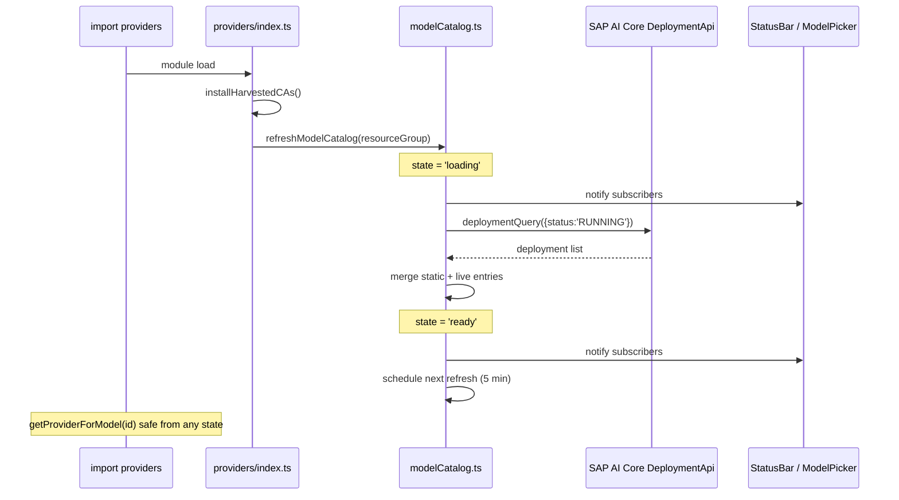
```mermaid
sequenceDiagram
    participant Import as import providers
    participant Index as providers/index.ts
    participant Catalog as modelCatalog.ts
    participant AICore as SAP AI Core DeploymentApi
    participant TUI as StatusBar / ModelPicker

    Import->>Index: module load
    Index->>Index: installHarvestedCAs()
    Index->>Catalog: refreshModelCatalog(resourceGroup)
    Note over Catalog: state = 'loading'
    Catalog->>TUI: notify subscribers
    Catalog->>AICore: deploymentQuery({status:'RUNNING'})
    AICore-->>Catalog: deployment list
    Catalog->>Catalog: merge static + live entries
    Note over Catalog: state = 'ready'
    Catalog->>TUI: notify subscribers
    Catalog->>Catalog: schedule next refresh (5 min)
    Note over Import: getProviderForModel(id) safe from any state
```

Non-live callers (`getProviderForModel`, `isOrchestrationModel`) never block on the catalog — they read from the merged snapshot maintained by `modelCatalog.ts` or fall back to the hardcoded `ORCHESTRATION_MODELS` list when the catalog has not yet loaded. Full details in [`docs/PROVIDERS.md#dynamic-model-catalog`](./PROVIDERS.md#dynamic-model-catalog).

### Tool System

Alexi registers **31 built-in tools** via `registerBuiltInTools()` (the former `warpgrep` / `codebase_search` tool has been extracted to the `alexi-mcp-warpgrep` MCP server — see [`docs/mcp-servers.md`](./mcp-servers.md)). Two additional tools (`kilo_board_read` / `kilo_board_write`) are conditionally registered when `isBoardEnabled()` returns `true`:

| Tool | File | Permission | Description |
|------|------|-----------|-------------|
| `bash` | `bash.ts` | execute | Execute shell commands with timeout |
| `read` | `read.ts` | read | Read files and directories (auto-extracts text from `.docx` via mammoth and `.xlsx`/`.xlsm` via xlsx; symlink-escape safeguard when caller sets `ctx.extra.denyDirectory === true` — see [Read tool: `denyDirectory` symlink safeguard](#read-tool-denydirectory-symlink-safeguard)) |
| `write` | `write.ts` | write | Write/create files |
| `edit` | `edit.ts` | write | Exact string replacement in files |
| `glob` | `glob.ts` | read | Find files by pattern |
| `grep` | `grep.ts` | read | Search file contents by regex (appends an "install `@morphllm/morphsdk` for semantic search" hint to its description when `isWarpgrepAvailable()` returns `false`) |
| `task` | `task.ts` | -- | Launch sub-agent tasks (foreground/background) |
| `task_status` | `task_status.ts` | -- | Query background task status |
| `webfetch` | `webfetch.ts` | network | Fetch web content |
| `websearch` | `websearch.ts` | network | Web search |
| `question` | `question.ts` | -- | Ask user questions |
| `todowrite` | `todowrite.ts` | -- | Manage task lists |
| `suggest` | `suggest.ts` | -- | Suggest next actions |
| `delete` | `delete.ts` | write | Delete files |
| `multiedit` | `multiedit.ts` | write | Multiple edits in one call |
| `ls` | `ls.ts` | read | List directory contents |
| `skill` | `skill.ts` | -- | Load specialized skills |
| `definitions` | `definitions.ts` | read | Get code definitions (TS `.ts`/`.tsx`/`.mts`/`.cts`/`.d.ts`, JS `.js`/`.jsx`/`.mjs`/`.cjs`, `.py`, `.sh`/`.bash`) |
| `browser` | `browser.ts` | network | Browser automation |
| `diagnostics` | `diagnostics.ts` | read | Code diagnostics |
| `batch` | `batch.ts` | -- | Batch tool execution |
| `memory` | `memory.ts` | -- | Store/retrieve memories |
| `recall` | `recall.ts` | -- | Recall past sessions |
| `agent-manager` | `agent-manager.ts` | admin | Manage agent instances |
| `apply-patch` | `apply-patch.ts` | write | Apply code patches |
| `repo-clone` | `repo-clone.ts` | execute | Clone repositories |
| `schedule_wakeup` | `schedule-wakeup.ts` | -- | Schedule a future resume of the current session (ISO-8601 timestamp or relative duration; see [Wakeup Subsystem](#wakeup-subsystem-srckilocodewakeup)) |
| `cancel_wakeup` | `cancel-wakeup.ts` | -- | Cancel a previously scheduled wakeup by id (idempotent) |

#### Shell detection and PowerShell fail-fast bootstrap

The `bash` and `shell` tools do NOT rely on `spawn(..., { shell: true })`. They resolve the shell binary themselves via `detectShell()` (`src/tool/tools/shell/id.ts`), then compose a `spawn(file, [...prefixArgs, userCommand, ...suffixArgs], { shell: false })` invocation using `shellSpawnArgs(info)`. This gives the tools three properties `shell: true` could not:

1. **The tool description knows which shell it is talking to.** `shellType` is emitted on `BashResult` so debuggers, tests, and the TUI can display "ran in `pwsh`" vs "ran in `bash`".
2. **Byte-identical passthrough.** The user's command string is passed as its own `spawn` argument. Nothing rewrites it; nothing quotes it. Multibyte characters, embedded quotes, and `param(...)` blocks survive intact.
3. **Per-shell semantics.** `shellSpawnArgs` returns a different prelude for each shell.

The `shellSpawnArgs(info)` contract (`src/tool/tools/shell/id.ts:275`):

```typescript
export function shellSpawnArgs(info: ShellInfo): {
  file: string;
  prefixArgs: string[];
  suffixArgs?: string[];
};
```

- **POSIX shells** (`bash`, `zsh`, `fish`, `sh`, unknown): returns `{ file, prefixArgs: ['-c'] }`. Command is `spawn(file, ['-c', userCommand], ...)`.
- **cmd.exe**: returns `{ file, prefixArgs: ['/d', '/s', '/c'] }`. Command is `spawn(file, ['/d', '/s', '/c', userCommand], ...)`.
- **PowerShell** (`pwsh`, `powershell.exe`): returns `{ file, prefixArgs: ['-NoProfile', '-Command', "$ErrorActionPreference='Stop'; & {"], suffixArgs: ['}'] }`. Command is `spawn(file, ['-NoProfile', '-Command', "$ErrorActionPreference='Stop'; & {", userCommand, '}'], ...)`.

The PowerShell branch is the interesting one. It wraps every user command in a scriptblock `& { <user command> }` that runs under `$ErrorActionPreference='Stop'`. This is the Cline PR #13358 pattern for cline/cline#13285 (mirrored in alexi issue #1456) and it gives PowerShell commands **fail-fast semantics**: the first non-terminating error terminates with a non-zero exit and a single error record, matching what a naive user expects when they run a broken pipeline.

Three properties are preserved deliberately:

- **The user command is byte-identical.** It is passed as its own `spawn` argument that PowerShell joins between the opening `& {` and closing `}`. Alexi never mutates the string.
- **`param(...)` scripts still work.** Because `param` occupies the first-statement position INSIDE the scriptblock braces, scripts starting with `param($x = 5)` still parse. A naive top-level prepend would displace `param` and fail with `CommandNotFoundException`.
- **Per-cmdlet opt-out is intact.** Users who need partial results from an intentionally noisy command can add `-ErrorAction Continue` / `-ErrorAction SilentlyContinue` to the specific cmdlet, or reassign `$ErrorActionPreference` inside their script to restore the old non-fail-fast behaviour.

**Tradeoffs** (documented so the tradeoff is chosen, not accidental):

- `Stop` promotes every non-terminating error, not just per-item pipeline floods. `Get-ChildItem -Recurse` crossing an access-denied junction ("Application Data", "System Volume Information") now aborts at the first denial with truncated output and exit 1, where it previously completed with warnings. Users who need partial results add `-ErrorAction Continue` to the specific cmdlet.
- On Windows PowerShell 5.1, in-script stderr redirection (`2>&1`, `2>file`) of a succeeding native command wraps each stderr line in a `NativeCommandError`; under `Stop` the first one terminates the script. PowerShell 7.2+ exempts native stderr from the preference (PowerShell/PowerShell#3996, #14273). This matches GitHub Actions behaviour on 5.1 today.

**Precedent.** GitHub Actions prepends `$ErrorActionPreference = 'stop'` to every `powershell` / `pwsh` step ([workflow-syntax docs](https://docs.github.com/en/actions/using-workflows/workflow-syntax-for-github-actions#jobsjob_idstepsshell)), so model-authored PowerShell commands already run under these semantics in CI. Aligning the bash / shell tools matches that contract, so the same PowerShell script produces the same behaviour whether Alexi runs it locally or via a CI workflow step.

**Regression tests.** `tests/tool/tools/shell/powershell-fail-fast.test.ts` end-to-end-drives `pwsh` (skipped when no `pwsh` / `powershell.exe` is on PATH) and asserts on all four behaviours: fail-fast exit-code, single-error-record bounded stderr, successful commands still succeed (no false-positive Stop), `-ErrorAction Continue` opt-out, and `param(...)` compatibility.

#### Indexing config: custom file extensions

`glob`, `grep`, and `codesearch` extend their default extension whitelist
with a user-configurable list, so modern stacks (`.mdx`, `.astro`,
`.svelte`, `.vue`, `.proto`, `.graphql`, `.tf`, ...) are indexed without
the caller having to spell them out in every `include` pattern.

Extensions are collected from three sources and merged additively (later
sources add to earlier ones; duplicates are de-duped case-insensitively):

1. **Global user config** – `~/.alexi/config.json`
2. **Project config** – `<repo>/.alexi/config.json`
3. **Project extensions file** – `<repo>/.alexi/extensions`

Both config files use the same `indexing` section and accept two fields:

```jsonc
{
  "indexing": {
    // Canonical form: leading dot required, strictly validated.
    "additionalExtensions": [".proto", ".graphql"],
    // Alias: accepts bare names (mdx) OR dotted names (.mdx).
    "extensions": ["mdx", "astro", "svelte", "vue"]
  }
}
```

The `.alexi/extensions` file is a flat text file with one extension per
line. Blank lines and lines starting with `#` are ignored; inline
comments after `#` are stripped. Names may be written with or without a
leading dot.

```text
# Custom extensions for indexing
mdx
astro
svelte    # Svelte components
.vue
```

**Semantics.** Additional extensions are always ADDITIVE — they extend
the set of files a tool considers, they never restrict a caller-provided
`include`. When a caller passes `--include '*.ts'` and the config
declares `mdx`, the effective pattern becomes `*.{ts,mdx}`. When no
`include` is passed, extensions do not narrow the search (`grep` still
searches all files, matching historical behavior).

**Validation.** `additionalExtensions` requires the strict dotted form
(`.proto`); invalid entries throw when written via
`setConfigAdditionalExtensions` and are silently dropped when read
(so a corrupt config never crashes tools). The `extensions` alias is
more permissive (accepts `mdx`, `.mdx`, `MDX`) and normalizes to lower
case dotted form. See `src/config/userConfig.ts` for details.

### Support Systems

| Module | File | Description |
|--------|------|-------------|
| Event Bus | `src/bus/index.ts` | Typed pub/sub event system with Zod validation |
| Permission | `src/permission/index.ts` | Last-match-wins rule evaluation with doom loop detection |
| Sub-agent Blockers | `src/permission/agent-manager.ts` | Fail-closed blocker store (`isBlocked`, `getBlocker`, `answerQuestion`, `setBlocker`) for orchestrator-to-sub-agent unblock flow. Wired into the `agent_manager` tool's `answer` action. See [Sub-agent Blocker Store](#sub-agent-blocker-store-srcpermissionagent-managerts). |
| Agent | `src/agent/index.ts` | Agent registry with built-in + custom agents (**pending autohealing revert as of 2026-07-24 — see [Agent System](#agent-system)**) |
| Hooks | `src/hooks/index.ts` | Lifecycle hooks (command, HTTP, script) with block cap — see [`docs/HOOKS.md`](./HOOKS.md) for the full event catalogue and a reference `.alexiignore` access-control example |
| MCP | `src/mcp/index.ts` | Model Context Protocol client/server integration (qualified `${escapedServer}::${tool}` keys — see [MCP tool key composition](#mcp-tool-key-composition)) |
| Skill | `src/skill/index.ts` | Specialized prompt injection for domain tasks |
| Compaction | `src/compaction/index.ts` | Context window management with 4 strategies |
| Telemetry | `src/utils/telemetry.ts` | Usage metrics tracking |
| Reference | `src/reference/index.ts` | External repository references with typed cache |
| Plugin Tools | `src/tool/plugin-tools.ts` | Plugin tool compatibility wrappers |
| Tool Registry | `src/tool/registry.ts` | Enhanced registry with prompt-based tool resolution |

#### Read tool: `denyDirectory` symlink safeguard

The `read` tool (`src/tool/read.ts`) supports an opt-in symlink-escape check driven by the tool-call context. When a caller sets `ctx.extra.denyDirectory === true`, the tool performs a second `realPath` resolution on the incoming `requested` path *after* the initial permission and existence checks and compares the normalized result against the pre-resolved `target`. When the two differ, the call is rejected with `Directory attachments cannot be expanded: <requested>` before any file contents are streamed back to the model.

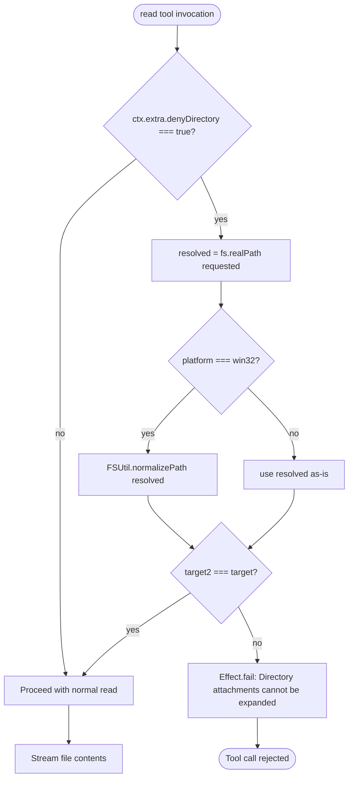
```mermaid
flowchart TB
    Call([read tool invocation]) --> P{ctx.extra.denyDirectory === true?}
    P -- no --> Normal[Proceed with normal read]
    P -- yes --> R1[resolved = fs.realPath requested]
    R1 --> N{platform === win32?}
    N -- yes --> Norm[FSUtil.normalizePath resolved]
    N -- no --> AsIs[use resolved as-is]
    Norm --> Cmp{target2 === target?}
    AsIs --> Cmp
    Cmp -- yes --> Normal
    Cmp -- no --> Fail[Effect.fail: Directory attachments cannot be expanded]

    Normal --> Read[Stream file contents]
    Fail --> Reject([Tool call rejected])
```

Semantics and scope:

- The safeguard is a defence-in-depth addition on top of the existing rule-based permission model (`src/permission/`, see [Permission System](#permission-system)) and the sandbox root enforced by the tool registry. It does not replace either.
- The check fires **only** when the caller explicitly opts in via `ctx.extra.denyDirectory`. When the flag is unset or `false`, `read` behaves exactly as before (no extra `realPath` call, no comparison, no rejection).
- The compared `target` and `target2` are both `realPath`-resolved values. On POSIX, they are compared byte-for-byte; on Windows, both sides are normalized via `FSUtil.normalizePath` first, so drive-letter case, backslash-vs-forward-slash, and trailing-separator variance do not produce false positives.
- The rejection is an `Effect.fail(new Error(...))` — it flows through the standard tool-call error path, is surfaced to the agent loop as a tool error, and does not throw synchronously.
- The intended threat model is a symlink that lives under an otherwise-permitted parent directory but whose `realPath` target escapes the sandbox. Callers that expand directory attachments (`context`, `session-export`, and any consumer that recursively walks user-supplied paths) should set `denyDirectory: true` when the underlying operation must not follow such symlinks.

The permission-system entry point (`src/permission/next.ts`) is not modified by this change — callers set `ctx.extra.denyDirectory` themselves at the invocation site.

## Data Flow

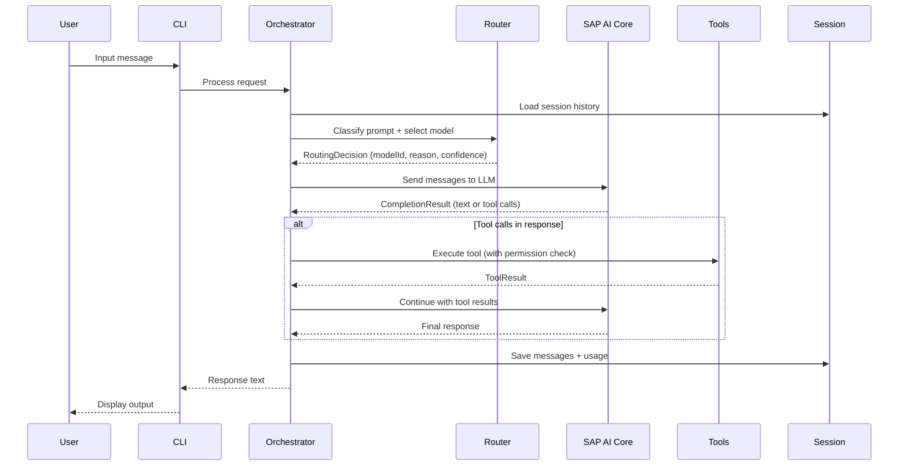
```mermaid
sequenceDiagram
    participant User
    participant CLI
    participant Orchestrator
    participant Router
    participant Provider as SAP AI Core
    participant Tools
    participant Session

    User->>CLI: Input message
    CLI->>Orchestrator: Process request
    Orchestrator->>Session: Load session history
    Orchestrator->>Router: Classify prompt + select model
    Router-->>Orchestrator: RoutingDecision (modelId, reason, confidence)
    Orchestrator->>Provider: Send messages to LLM
    Provider-->>Orchestrator: CompletionResult (text or tool calls)
    
    alt Tool calls in response
        Orchestrator->>Tools: Execute tool (with permission check)
        Tools-->>Orchestrator: ToolResult
        Orchestrator->>Provider: Continue with tool results
        Provider-->>Orchestrator: Final response
    end
    
    Orchestrator->>Session: Save messages + usage
    Orchestrator-->>CLI: Response text
    CLI-->>User: Display output
```

## Agentic Chat Flow

The agentic chat system (`src/core/agenticChat.ts`) implements an autonomous multi-turn execution loop with context overflow recovery, lifecycle hooks, and compaction:

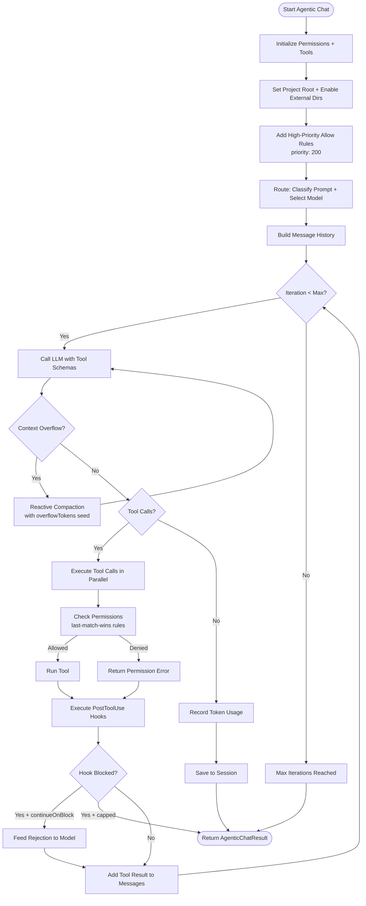
```mermaid
flowchart TB
    Start([Start Agentic Chat]) --> Init[Initialize Permissions + Tools]
    Init --> SetRoot[Set Project Root + Enable External Dirs]
    SetRoot --> AddRules[Add High-Priority Allow Rules<br/>priority: 200]
    AddRules --> DetermineModel[Route: Classify Prompt + Select Model]
    
    DetermineModel --> BuildMessages[Build Message History]
    BuildMessages --> LoopStart{Iteration < Max?}
    
    LoopStart -->|Yes| CallLLM[Call LLM with Tool Schemas]
    CallLLM --> CheckOverflow{Context Overflow?}
    
    CheckOverflow -->|Yes| Compact[Reactive Compaction<br/>with overflowTokens seed]
    Compact --> CallLLM
    
    CheckOverflow -->|No| CheckTools{Tool Calls?}
    
    CheckTools -->|Yes| ExecTools[Execute Tool Calls in Parallel]
    ExecTools --> CheckPerm[Check Permissions<br/>last-match-wins rules]
    CheckPerm -->|Allowed| RunTool[Run Tool]
    CheckPerm -->|Denied| ReturnError[Return Permission Error]
    
    RunTool --> Hooks[Execute PostToolUse Hooks]
    ReturnError --> Hooks
    Hooks --> CheckBlock{Hook Blocked?}
    CheckBlock -->|Yes + continueOnBlock| FeedBack[Feed Rejection to Model]
    CheckBlock -->|Yes + capped| End
    CheckBlock -->|No| AddToolResult[Add Tool Result to Messages]
    FeedBack --> AddToolResult
    AddToolResult --> LoopStart
    
    CheckTools -->|No| RecordCost[Record Token Usage]
    RecordCost --> SaveSession[Save to Session]
    SaveSession --> End([Return AgenticChatResult])
    
    LoopStart -->|No| MaxReached[Max Iterations Reached]
    MaxReached --> End
```

### Context Overflow Recovery

When the LLM returns a context-length error, the agentic chat detects it via pattern matching and triggers reactive compaction:

```typescript
// Error patterns detected:
const CONTEXT_OVERFLOW_PATTERNS = [
  /context.length/i,
  /context.*exceeded/i,
  /token.*limit.*exceeded/i,
  /max_tokens_exceeded/i,
  // ...
];

// Compaction with overflow seeding:
const { messages: compactedMessages } = await checkAndCompact(
  messages, { strategy: 'summarize', overflowTokens }
);
```

The `overflowTokens` parameter seeds the target summary length so the compacted context fits within limits.

### Environment Details Fence

The volatile prompt blocks — memory context, session context, repo map — are appended after the stable assembled system prompt and wrapped in a single `<environment_details>\n...\n</environment_details>` fence. This separation guards two concerns simultaneously: it stops environment context from bleeding into the stable prompt prefix (which would break cache reuse) and it prevents the model from mistaking environment metadata for authored user text on the next turn.

Since 2026-09-05 (kilocode #13190) the fence injection is idempotent: `buildSystemPrompt` checks whether the assembled prompt already carries an `<environment_details>` block (e.g. because a caller pre-baked one via `options.systemPrompt` / `customRules`, or a plugin injected one through `buildAssembledSystemPromptAsync`) and skips the second injection when it does. The check uses `.trim().includes(...)` so leading whitespace does not defeat detection — matches `hasEnvironmentDetailsBlock` in `src/providers/openai/prompt-cache.ts` byte for byte, so the orchestrator and the prompt-cache breakpoint logic never disagree on whether a message carries an env block.

```typescript
// src/core/agenticChat.ts:buildSystemPrompt
const envParts: string[] = [];
if (memoryContext) envParts.push(memoryContext);
if (sessionContext) envParts.push(sessionContext);
if (repoMapText) envParts.push(repoMapText);
if (envParts.length > 0) {
  const alreadyHasEnvBlock = parts.some((p) => p.trim().includes('<environment_details>'));
  if (!alreadyHasEnvBlock) {
    parts.push(`<environment_details>\n${envParts.join('\n\n')}\n</environment_details>`);
  }
}
```

The duplicate-block prevention matters most for the OpenAI GPT-5.6+ family: two env fences on the same system message would inject per-call working-directory and timestamp variation into the stable prompt-cache prefix twice per turn, and any downstream `applyCacheBreakpoint` pass would still land the breakpoint on a volatile message rather than a clean stable prefix. Regression coverage is in `src/core/__tests__/agenticChat.test.ts` under the `environment_details duplicate-block prevention (kilocode #13190)` describe block — three cases covering the default path, a pre-baked `customRules` block, and repeated invocations sharing a session manager.

### Unknown-Tool Repair Hints

When the model attempts to call a tool that is not registered, `executeToolCall` no longer returns a bare `Unknown tool: <name>` error. Instead it looks up the closest registered candidates via a case-insensitive substring match against `getAllToolNames()` and appends up to five suggestions:

```typescript
// src/core/agenticChat.ts:executeToolCall (excerpt)
const similar = availableNames.filter(
  (n) =>
    n.toLowerCase().includes(requestedName.toLowerCase()) ||
    requestedName.toLowerCase().includes(n.toLowerCase())
).slice(0, 5);

const hintParts: string[] = [`Unknown tool: ${requestedName}`];
if (similar.length > 0) {
  hintParts.push(`Did you mean one of: ${similar.join(', ')}?`);
} else if (availableNames.length > 0) {
  hintParts.push(`Available tools: ${availableNames.slice(0, 8).join(', ')}`);
}
```

The enriched error is fed back to the model so it can self-correct on the next turn. The lookup degrades gracefully to the bare error when the registry is unavailable (test harnesses).

### Loop and Mistake Steering (issue #1692)

The agentic loop instantiates two independent detectors per `agenticChat` invocation (they are per-call, not module-scoped, so a long-running TUI session does not carry counters across independent user turns):

- **`LoopDetector`** (`src/core/loopDetector.ts`) fingerprints each observed tool call as `${toolName}:${stableStringify(parsedArgs)}`. Arguments are re-serialised with sorted keys so semantically equivalent calls (`{"path":"/a","content":"x"}` vs `{"content":"x","path":"/a"}`) fingerprint identically. Invalid JSON falls back to the raw string. Trips at 5 consecutive identical fingerprints by default (`AgenticChatOptions.loopLimit`, minimum 2).
- **`MistakeTracker`** (`src/core/mistakeTracker.ts`) counts consecutive tool failures regardless of which tool failed or what arguments it received — a rapid burst of unrelated failures (bad file paths, wrong syntax, permission errors) usually means the model is flailing rather than looping on a single call. A single successful tool result resets the counter to zero. Trips at 6 consecutive failures by default (`AgenticChatOptions.mistakeLimit`, minimum 2).

The `question` tool is deliberately excluded from loop fingerprinting (`src/core/agenticChat.ts:937`) because repeated user prompts are not a stuck loop.

Both detectors are checked at a single synchronisation point after every iteration's tool results have been recorded. On a trip, the loop delegates to the optional `onConsecutiveMistakeLimitReached(reason)` callback with `{ kind: 'loop' | 'mistake', consecutiveCount, toolName }`:

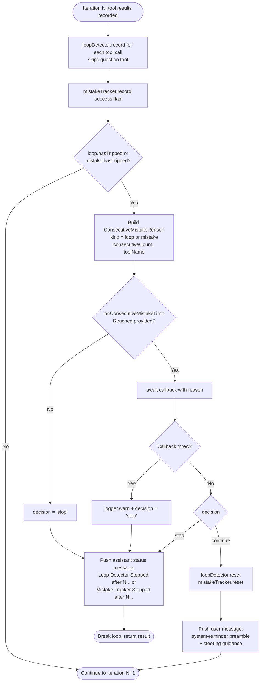
```mermaid
flowchart TB
    Iter([Iteration N: tool results recorded]) --> RecLoop[loopDetector.record for each tool call<br/>skips question tool]
    RecLoop --> RecMistake[mistakeTracker.record success flag]
    RecMistake --> Check{loop.hasTripped or<br/>mistake.hasTripped?}
    Check -->|No| Continue([Continue to iteration N+1])
    Check -->|Yes| BuildReason[Build ConsecutiveMistakeReason<br/>kind = loop or mistake<br/>consecutiveCount, toolName]
    BuildReason --> HasCB{onConsecutiveMistakeLimit<br/>Reached provided?}
    HasCB -->|No| StopSilent[decision = 'stop']
    HasCB -->|Yes| InvokeCB[await callback with reason]
    InvokeCB --> CBError{Callback threw?}
    CBError -->|Yes| WarnStop[logger.warn + decision = 'stop']
    CBError -->|No| Decision{decision}
    StopSilent --> StopMsg[Push assistant status message:<br/>Loop Detector Stopped after N... or<br/>Mistake Tracker Stopped after N...]
    WarnStop --> StopMsg
    StopMsg --> End([Break loop, return result])
    Decision -->|stop| StopMsg
    Decision -->|continue| ResetBoth[loopDetector.reset<br/>mistakeTracker.reset]
    ResetBoth --> InjectSteering[Push user message:<br/>system-reminder preamble<br/>+ steering guidance]
    InjectSteering --> Continue
```

Returning `'stop'` (or omitting the callback entirely) ends the run with a status message and a synthetic assistant turn — either `[Loop Detector] Stopped after N identical calls to '<tool>'.` or `[Mistake Tracker] Stopped after N consecutive tool failures.`. Returning `'continue'` resets both detectors, injects a `<system-reminder>` preamble plus the steering guidance (`The previous approach is stuck. Try a different method, simpler steps, or ask me for help.`) as a synthetic user message, and resumes the loop so the model can try a different strategy on the next iteration.

A throwing callback is caught and treated as `'stop'` (`logger.warn(...callback threw... Stopping run.)`) so a hung TUI hook cannot crash a headless agent run. `ConsecutiveMistakeReason` is re-exported from `src/core/orchestrator.ts` and `src/core/streamingOrchestrator.ts` for callers that dispatch through `sendChat` / `streamChat` and later fan out to `agenticChat`.

#### CLI-side callback wiring (`src/cli/utils/mistakeLimitPrompt.ts`)

`agenticChat` owns detection, steering-message injection, and the callback contract. It does NOT own any user interaction — that surface lives in a separate CLI module so `agenticChat` remains reusable from the TUI, the HTTP server, and headless test harnesses.

The non-interactive `alexi agent` command constructs its callback with `createMistakeLimitPrompt(...)` in `src/cli/commands/agent.ts:324-335`:

```typescript
// src/cli/commands/agent.ts
const onConsecutiveMistakeLimitReached = createMistakeLimitPrompt({
  yolo: Boolean(opts.yolo || opts.dangerouslySkipPermissions),
  quiet: Boolean(opts.quiet),
  signal: abortController.signal,
});

const res = await agenticChat(message, {
  // ...other options...
  onConsecutiveMistakeLimitReached,
});
```

The factory returns a `MistakeLimitCallback` (`(reason: ConsecutiveMistakeReason) => Promise<'continue' | 'stop'>`) that applies a small decision matrix. The following sequence diagram covers all four terminal branches the callback can take:

```mermaid
sequenceDiagram
    participant Agent as agenticChat loop
    participant CB as createMistakeLimitPrompt callback
    participant User as User (TTY)
    participant Err as stderr

    Agent->>CB: onConsecutiveMistakeLimitReached(reason)
    Note over CB: describeReason(reason)<br/>builds one-line explanation

    alt yolo=true
        CB->>Err: [mistake-limit] <explanation> Auto-continuing (--yolo).
        CB-->>Agent: 'continue'
    else non-TTY (headless / CI)
        CB->>Err: [mistake-limit] <explanation> Stopping (non-interactive; re-run with --yolo).
        CB-->>Agent: 'stop'
    else quiet + TTY
        CB->>Err: [mistake-limit] <explanation> Stopping (quiet mode).
        CB-->>Agent: 'stop'
    else TTY (default)
        CB->>Err: [mistake-limit] <explanation>
        CB->>User: Try a different approach? (y/n)
        alt answer starts with 'y'
            User-->>CB: y | yes | YES | " y "
            CB->>Err: Continuing with steering guidance.
            CB-->>Agent: 'continue'
        else any other answer or EOF or abort signal
            User-->>CB: n | "" | quit | (abort)
            CB->>Err: Stopping run.
            CB-->>Agent: 'stop'
        end
    end
```

Design invariants pinned by `tests/cli/utils/mistakeLimitPrompt.test.ts`:

- **No I/O in `describeReason`.** It is a pure formatter used by BOTH the interactive prompt and the headless stderr line so the two surfaces cannot drift.
- **`readline` is only opened on the interactive branch.** Yolo, non-TTY, and quiet paths must not attach a `data` listener to `stdin` (asserted via `expect(stdin.listenerCount('data')).toBe(0)`). This keeps headless runs from silently blocking on stdin.
- **Empty input defaults to `'stop'`.** A user who just presses Enter gets the safer answer; the `'continue'` decision requires an explicit affirmative.
- **`AbortSignal` releases the readline handle.** The `abort` listener calls `rl.close()`; the `finally` block removes the listener and closes the handle so the callback never leaks event-loop resources even when the user hits Ctrl+C mid-prompt.
- **Injectable I/O.** `MistakeLimitPromptOptions` accepts `stdin` / `stdout` / `stderr` / `isTTY` so the test harness never touches the real process handles. This also lets the TUI wire its own `Sink`-like writable if it ever needs the same decision matrix outside the plain CLI command.

The end-to-end contract is: `agenticChat` decides *when* to ask, `createMistakeLimitPrompt` decides *how* to ask (or whether to skip the ask entirely and pick a deterministic default). Keeping detection, steering, and the UI in three separate layers means the TUI, the HTTP server, and future in-editor hosts can each supply their own `MistakeLimitCallback` without duplicating any part of the detector or the steering-message injection.

## Session Lifecycle and Abort Propagation

`SessionManager` (`src/core/sessionManager.ts`) tracks a per-session `AbortController` for every active run in an in-memory `Map<string, SessionRunState>`. The map is instance-scoped rather than module-scoped so tests can construct isolated managers without leaking abort state across cases.

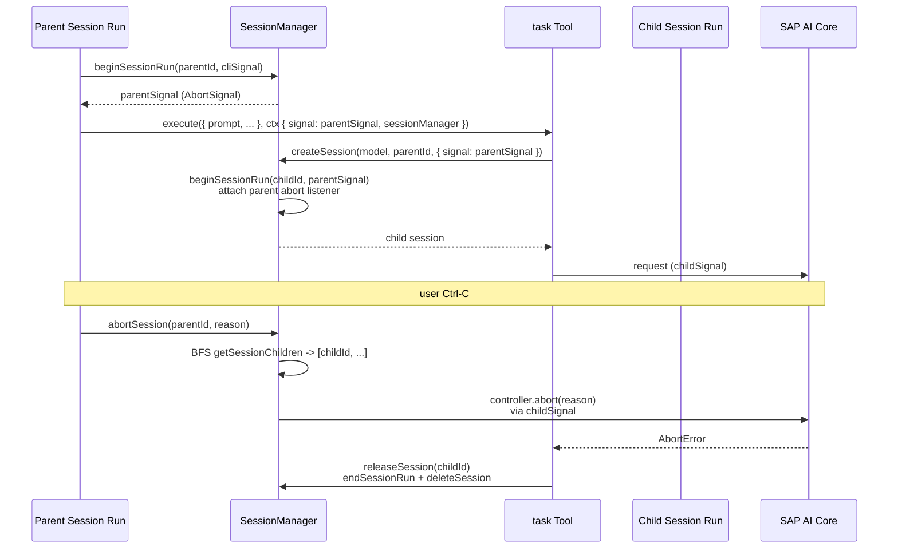
```mermaid
sequenceDiagram
    participant Parent as Parent Session Run
    participant SM as SessionManager
    participant Task as task Tool
    participant Child as Child Session Run
    participant Provider as SAP AI Core

    Parent->>SM: beginSessionRun(parentId, cliSignal)
    SM-->>Parent: parentSignal (AbortSignal)
    Parent->>Task: execute({ prompt, ... }, ctx { signal: parentSignal, sessionManager })
    Task->>SM: createSession(model, parentId, { signal: parentSignal })
    SM->>SM: beginSessionRun(childId, parentSignal)<br/>attach parent abort listener
    SM-->>Task: child session
    Task->>Provider: request (childSignal)
    Note over Parent,Provider: user Ctrl-C
    Parent->>SM: abortSession(parentId, reason)
    SM->>SM: BFS getSessionChildren -> [childId, ...]
    SM->>Provider: controller.abort(reason)<br/>via childSignal
    Provider-->>Task: AbortError
    Task->>SM: releaseSession(childId)<br/>endSessionRun + deleteSession
```

Key contract points, all in `src/core/sessionManager.ts:100-410`:

- `beginSessionRun(sessionId, parentSignal?)` is idempotent: a second call for the same id tears down the previous run (removing its parent-signal listener) and starts a fresh one, so listeners never accumulate.
- If `parentSignal` is already aborted when `beginSessionRun` is called, the returned signal is aborted synchronously — this honours the standard `AbortSignal.any` contract so a delegated subagent that starts *after* the parent was cancelled never gets a live signal to run against.
- `endSessionRun(sessionId)` MUST be called from a `finally` block after the run completes. It removes the parent-signal listener but does NOT abort the controller — normal completion should not surface as an abort.
- `abortSession(sessionId, reason)` walks the persisted `parentSessionId` chain breadth-first via `getSessionChildren` and aborts every descendant with an active run. The walk uses a `visited: Set<string>` so a corrupted `A -> B -> A` store cannot spin forever.
- `releaseSession(sessionId)` is `endSessionRun` + `deleteSession`. The `task` tool uses it so delegated subagent transcripts do not clutter `sessions list` after they finish.

`agenticChat` threads the manager onto every `ToolContext` and, on its own parent-signal abort check, cascades to the current session:

```typescript
// src/core/agenticChat.ts (loop head)
if (options?.signal?.aborted) {
  const sessionId = options?.sessionManager?.getCurrentSession()?.metadata.id;
  if (sessionId) {
    options?.sessionManager?.abortSession(sessionId, options.signal.reason);
  }
  throw new Error('Operation aborted');
}
```

The `task` tool wires the child session lifecycle in `src/tool/tools/task.ts:574-677`. If the parent is already aborted at spawn time it refuses to start the subagent (returning `{ status: 'cancelled' }`) instead of wasting the cost tracker's provider budget on a request whose result no consumer will read.

## Session Retention Lifecycle

Session transcripts persisted to `~/.alexi/sessions/*.json` accumulate over time. Without a bounded lifetime an active operator's sessions directory grows without limit, slowing FTS index rebuilds, `alexi sessions` listings, and repo-map inference passes that scan the directory. The retention pipeline (schema in `src/config/userConfig.ts`, runner in `src/core/sessionManager.ts:828`, scheduler in `src/core/retentionScheduler.ts`, CLI surface in `src/cli/commands/sessions.ts`) deletes sessions older than a configured `maxAgeDays` while guaranteeing no in-flight or freshly-written transcript is touched.

The pipeline has four collaborators, wired top-down from the CLI entry point:

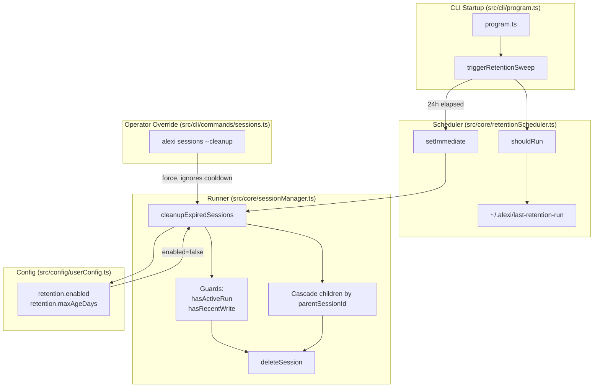
```mermaid
graph TB
    subgraph Startup["CLI Startup (src/cli/program.ts)"]
        Program[program.ts]
        Trigger[triggerRetentionSweep]
    end

    subgraph Scheduler["Scheduler (src/core/retentionScheduler.ts)"]
        StateFile["~/.alexi/last-retention-run"]
        ShouldRun[shouldRun]
        SetImm[setImmediate]
    end

    subgraph Runner["Runner (src/core/sessionManager.ts)"]
        Cleanup[cleanupExpiredSessions]
        Guards["Guards:<br/>hasActiveRun<br/>hasRecentWrite"]
        Cascade[Cascade children by parentSessionId]
        Delete[deleteSession]
    end

    subgraph Config["Config (src/config/userConfig.ts)"]
        Policy["retention.enabled<br/>retention.maxAgeDays"]
    end

    subgraph CLIFlag["Operator Override (src/cli/commands/sessions.ts)"]
        Flag[alexi sessions --cleanup]
    end

    Program --> Trigger
    Trigger --> ShouldRun
    ShouldRun --> StateFile
    Trigger -->|24h elapsed| SetImm
    SetImm --> Cleanup
    Cleanup --> Policy
    Policy -->|enabled=false| Cleanup
    Cleanup --> Guards
    Guards --> Delete
    Cleanup --> Cascade
    Cascade --> Delete
    Flag -->|force, ignores cooldown| Cleanup
```

Contract points, pinned by `tests/core/sessionManager-retention.test.ts`:

- **Opt-in by construction.** `cleanupExpiredSessions` short-circuits with `{ deleted: 0, skipped: 0, errors: [] }` when `getConfigSessionRetention().enabled` is `false` — no directory scan is performed. The scheduler still fires and updates the state file so a subsequent `retention.enabled: true` flip does not immediately trigger a same-second sweep.
- **Cooldown state.** `~/.alexi/last-retention-run` stores the last-run timestamp as a plain number. `readLastRun` returns `0` when the file is missing, empty, non-numeric, or contains a timestamp more than 24h in the future (guarding against clock drift / hostile edits). The scheduler treats `0` as "due now".
- **Fire-and-forget.** `triggerRetentionSweep` writes the state file BEFORE dispatching the sweep so an unhandled error inside `cleanupExpiredSessions` does not cause the next startup to re-run immediately. The sweep runs via `setImmediate` on the CLI event loop, not a worker thread — the CLI startup path returns to the caller before the scan begins.
- **Active-run guard.** `hasActiveRun(sessionId)` (populated by `beginSessionRun` / `endSessionRun` — see the abort-propagation contract above) protects sessions with an in-flight run from deletion even when they are past the age cutoff.
- **Recent-write guard.** A session whose LAST message `timestamp` is within `RECENT_WRITE_WINDOW_MS` (1 hour) is held back regardless of `metadata.updated`. This catches the edge case where a session was actively receiving writes right up to the age boundary.
- **Cascade to children.** After an expired root session is deleted, the runner walks the loaded map for sessions whose `metadata.parentSessionId` matches the deleted id and applies the same expiry check + guards. Young children of expired parents survive so an in-flight subagent whose parent aged out is not silently discarded.
- **Best-effort per-session I/O.** Errors reading, parsing, or deleting an individual session file are captured in `summary.errors[]` and the sweep continues to the next candidate. A corrupted JSON blob cannot block cleanup of the rest of the directory.
- **`--cleanup` bypasses the cooldown.** `alexi sessions --cleanup` instantiates a fresh `SessionManager` and calls `cleanupExpiredSessions` directly. The 24h scheduler cooldown does not gate this path — operators can force a sweep before running FTS reindex or a diagnostic pass. The exit code is `1` when `errors[]` is non-empty; otherwise `0`. When `retention.enabled` is `false`, the flag still runs the code path but the runner's own gate returns the empty summary immediately.

## Headless Exit and Session Drain

Headless CLI commands (`alexi chat`, `alexi agent`) can race their own `process.exit(...)` against unfinished background work: tool events still being fanned out on the event bus, streaming chunks still being written to disk, telemetry flushes. Without a drain, the process can exit(0) while sessions are still emitting events, corrupting persisted state and losing user-visible output.

`SessionDrain` (`src/session/drain.ts`) is a module-level singleton that tracks outstanding `Promise`s and waits for them to settle before the CLI returns. It is re-exported from `src/tool/registry.ts` so ported call sites can `import { SessionDrain } from '../tool/registry.js'`, mirroring the upstream opencode registry LayerNode surface without pulling in Effect-TS.

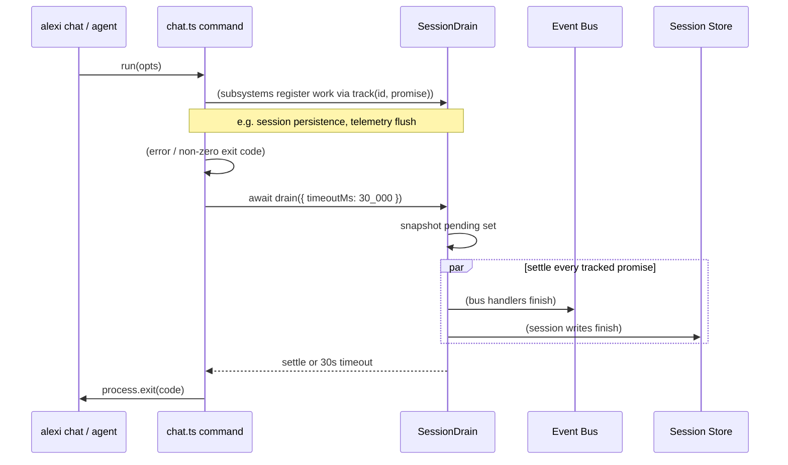
```mermaid
sequenceDiagram
    participant CLI as alexi chat / agent
    participant Chat as chat.ts command
    participant Drain as SessionDrain
    participant Bus as Event Bus
    participant FS as Session Store

    CLI->>Chat: run(opts)
    Chat->>Drain: (subsystems register work via track(id, promise))
    Note over Chat,Drain: e.g. session persistence, telemetry flush
    Chat->>Chat: (error / non-zero exit code)
    Chat->>Drain: await drain({ timeoutMs: 30_000 })
    Drain->>Drain: snapshot pending set
    par settle every tracked promise
        Drain->>Bus: (bus handlers finish)
        Drain->>FS: (session writes finish)
    end
    Drain-->>Chat: settle or 30s timeout
    Chat->>CLI: process.exit(code)
```

Contract:

- `SessionDrain.track(id, promise)` returns an untrack function; callers should call it from a `finally` block, but a settled promise auto-untracks itself so a forgotten handle cannot indefinitely block exit.
- `SessionDrain.drain({ timeoutMs })` is one-shot per lifecycle. After the first drain resolves, further `track()` calls become no-ops. The default budget is 30s; pass `0` to wait indefinitely (used only when a hard flush guarantee is required).
- The waiter set is snapshotted at the start of `drain()` so a handler that schedules follow-up work during its own settle cannot mutate the collection we are iterating (upstream `snapshot drain waiters before resuming them` fix).

Every `process.exit(...)` call site in `src/cli/commands/chat.ts` — missing message argument, session-not-found error, custom-command non-zero exit, and the top-level `catch (e)` — now awaits `SessionDrain.drain({ timeoutMs: 30_000 })` first. The drain failure path is deliberately swallowed on the error branch because the process is already exiting with a non-zero code.

## Inline Model Override (`@provider/model`)

The `sendChat` (`src/core/orchestrator.ts`) and `streamChat` (`src/core/streamingOrchestrator.ts`) entry points scan the current user message for `@<provider>/<model>` mentions and switch the model for **that turn only** when the referenced id is present in the live-merged model catalog. The parser lives in `src/core/inlineModelOverride.ts` and is deliberately isolated so both entry points share one contract:

```typescript
// src/core/inlineModelOverride.ts
export const INLINE_MODEL_PATTERN = /@([a-z0-9-]+)\/([a-z0-9-./]+)/i;

export function extractInlineModelOverride(message: string): string | undefined {
  if (typeof message !== 'string' || message.length === 0) return undefined;
  const match = message.match(INLINE_MODEL_PATTERN);
  if (!match) return undefined;
  const candidateModel = `${match[1]}/${match[2]}`;
  if (isAvailableModel(candidateModel)) {
    logger.info(`[Inline Override] Using ${candidateModel} for this turn`);
    return candidateModel;
  }
  logger.warn(`[Inline Override] Model "${candidateModel}" not found in catalog, ignoring`);
  return undefined;
}
```

Semantic properties, all pinned by `tests/orchestrator.test.ts` under `describe('inline model override (@provider/model)')`:

- **Case-insensitive parse, verbatim catalog lookup.** `@Anthropic/Claude-Opus-4` matches the pattern, but the candidate string handed to `isAvailableModel` preserves the original casing so the catalog lookup does not need a case-folding step.
- **First-match-wins.** Only the first `@provider/model` mention in a message drives the override. Additional mentions later in the same message are ignored.
- **Never throws.** Empty / non-string input and unknown catalog entries both return `undefined`; the caller falls through to its normal model selection.
- **Catalog-gated.** An unknown candidate is not silently used — a `[Inline Override] Model "<id>" not found in catalog, ignoring` warning is emitted so the operator sees why the override was skipped. This is what stops typos (`@anthropic/clude-opus-4`) from silently rerouting traffic.
- **Per-turn scope.** The session's default model is not mutated. The next user turn without an inline reference reverts to the caller-supplied default.

### Precedence contract

Both `sendChat` and `streamChat` resolve the effective model in the same four-tier order:

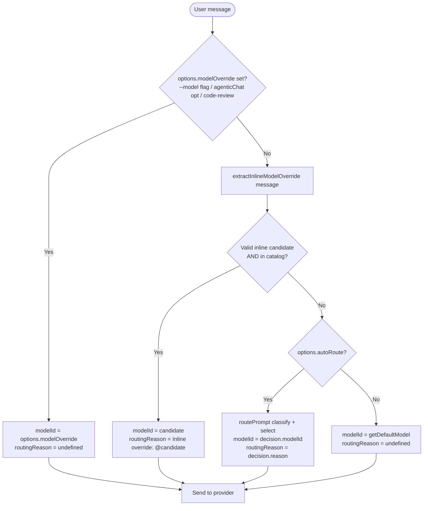
```mermaid
flowchart TB
    Msg([User message]) --> Explicit{options.modelOverride set?<br/>--model flag / agenticChat opt / code-review}
    Explicit -->|Yes| UseExplicit[modelId = options.modelOverride<br/>routingReason = undefined]
    Explicit -->|No| Parse[extractInlineModelOverride message]
    Parse --> Inline{Valid inline candidate<br/>AND in catalog?}
    Inline -->|Yes| UseInline[modelId = candidate<br/>routingReason = Inline override: @candidate]
    Inline -->|No| Auto{options.autoRoute?}
    Auto -->|Yes| Route[routePrompt classify + select<br/>modelId = decision.modelId<br/>routingReason = decision.reason]
    Auto -->|No| Default[modelId = getDefaultModel<br/>routingReason = undefined]
    UseExplicit --> Send[Send to provider]
    UseInline --> Send
    Route --> Send
    Default --> Send
```

The corresponding code in `src/core/orchestrator.ts:53-86`:

```typescript
// Inline model override (issue #1716): `@<provider>/<model>` mentions
// in the user message switch the model for THIS turn only. The
// explicit `modelOverride` (CLI `--model` flag) still wins so power
// users retain a hard opt-out.
const turnModelOverride = options?.modelOverride
  ? undefined
  : extractInlineModelOverride(message);

if (options?.autoRoute && !options?.modelOverride && !turnModelOverride) {
  const decision = routePrompt(message, { preferCheap: options.preferCheap });
  modelId = decision.modelId;
  routingReason = decision.reason;
} else {
  // Precedence: explicit modelOverride > inline @provider/model > default
  modelId = (options?.modelOverride ?? turnModelOverride ?? getDefaultModel()).trim();
  if (turnModelOverride && !options?.modelOverride) {
    routingReason = `Inline override: @${turnModelOverride}`;
  }
}
```

`streamChat` applies the same contract with one additional guard: inline parsing is skipped when the message payload is an array (multimodal content). A message containing image parts is not scanned for `@provider/model` mentions because the parser only makes sense for a plain text prompt.

```typescript
// src/core/streamingOrchestrator.ts:154-180
const turnModelOverride =
  !options?.modelOverride && typeof messageText === 'string'
    ? extractInlineModelOverride(messageText)
    : undefined;
```

Design boundaries:

- The override does NOT persist across turns. This is deliberately not a hidden shortcut for `/model` — persistent model switches still require the CLI flag or an explicit config change.
- `routingReason` is populated (`Inline override: @<model>`) so downstream telemetry, TUI status displays, and `session-export` can distinguish inline overrides from auto-router decisions and explicit `--model` flags.
- The parser is a pure function of the message text; it does not touch the session manager, the router, or the provider layer. Adding a new provider that ships as `<new-provider>/<model>` requires no change to `inlineModelOverride.ts` — only the model catalog needs to know about the new id.

## Session Model Preferences

`src/core/modelPreference.ts` owns the per-session reconciliation contract for the "which model does this session want to use, and where did that choice come from?" question. It exists because upstream kilocode fixed a class of bug in which `session.model = config.defaultModel` was applied unconditionally on every turn — a config reload would then silently overwrite a user's explicit `/model` selection. Alexi's routing is JSON-driven (see `docs/ROUTING.md`), so a config reload is a routine event and the fix is load-bearing.

### Provenance model

Every persisted preference carries a `source` field that records **why** the value was set. The reconciler uses `source` to decide whether an incoming update is allowed to overwrite the current value:

```typescript
// src/core/modelPreference.ts:36-43
export type SessionModelPreferenceSource = 'user-explicit' | 'default' | 'inherited';

export interface SessionModelPreference {
  modelID: string;
  providerID: string;
  reasoningEffort?: EffortLevel;
  source: SessionModelPreferenceSource;
}
```

- `'user-explicit'`: the user picked this via `/model <id>`, the `--model` CLI flag, the TUI model picker, or an equivalent explicit affordance. Only another `'user-explicit'` update may overwrite.
- `'inherited'`: forwarded from a parent session (subagent handoff, resumed session). Behaves like `'user-explicit'` for override purposes — a parent's explicit choice is respected downstream.
- `'default'`: derived from `routing-config.json` / `AICORE_MODEL` / the built-in default. Freely overwritten by any incoming update.

### Reconciliation rules

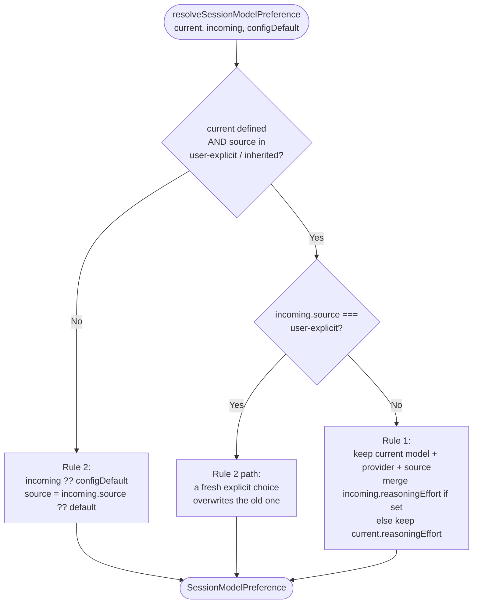
```mermaid
flowchart TB
    Start([resolveSessionModelPreference<br/>current, incoming, configDefault]) --> HasCurrent{current defined<br/>AND source in<br/>user-explicit / inherited?}
    HasCurrent -->|No| Fallback[Rule 2:<br/>incoming ?? configDefault<br/>source = incoming.source ?? default]
    HasCurrent -->|Yes| Incoming{incoming.source ===<br/>user-explicit?}
    Incoming -->|Yes| Overwrite[Rule 2 path:<br/>a fresh explicit choice<br/>overwrites the old one]
    Incoming -->|No| Preserve[Rule 1:<br/>keep current model + provider + source<br/>merge incoming.reasoningEffort if set<br/>else keep current.reasoningEffort]
    Fallback --> Emit([SessionModelPreference])
    Overwrite --> Emit
    Preserve --> Emit
```

Two rules, in order:

1. **Rule 1 — explicit-choice survival.** When the current preference has `source` in `{'user-explicit', 'inherited'}` AND the incoming update is NOT `'user-explicit'`, the current `modelID`, `providerID`, and `source` are preserved. The **only** field a non-explicit incoming update may refresh on a protected current preference is `reasoningEffort` — a user typing `/effort high` mid-session must not need to re-pick their model. When the incoming payload omits `reasoningEffort`, the current value is kept (upstream kilocode `50f7d01ad` "preserve effort intent and live session defaults").
2. **Rule 2 — incoming → default fallback.** Otherwise fall back to `incoming ?? configDefault` for every field. This preserves the classical "config wins over nothing" behaviour for brand-new sessions and lets a user explicit choice overwrite a previous explicit choice.

The function is pure — it never mutates its arguments and the return value is safe to persist directly. The complete implementation is `src/core/modelPreference.ts:64-94`.

### Public helpers

Three constructor helpers ensure callers set `source` correctly instead of hand-writing it (which would defeat the persistence guard):

- `userExplicitPreference(modelID, providerID, reasoningEffort?)` (`src/core/modelPreference.ts:103-109`): construct a preference explicitly attributed to the user. All call sites that process a `/model` command, a `--model` CLI flag, or a TUI model-picker selection route through this helper so `source: 'user-explicit'` is set and the next `resolveSessionModelPreference` call protects the choice.
- `defaultPreference(modelID, providerID, reasoningEffort?)` (`src/core/modelPreference.ts:117-123`): construct a preference derived from configuration. Freely overwritten by any incoming update, matching the pre-fix behaviour for brand-new sessions.
- `migrateLegacyPreference(raw)` (`src/core/modelPreference.ts:136-147`): hydration shim for on-disk preferences persisted before `source` existed. Legacy entries are conservatively defaulted to `'user-explicit'` so a user's saved model choice is NOT silently downgraded to `'default'` (which would then be overwritten on the next config reload). An already-present `source` field is preserved verbatim.

### Interaction with inline overrides

`resolveSessionModelPreference` operates at a different layer from the inline `@provider/model` override documented in **Inline Model Override** above. The inline override applies for a **single turn** and does NOT touch the persisted `SessionModelPreference`; a `/model` command or a `--model` flag DOES update the persistent preference and routes through `userExplicitPreference` so the choice survives config reloads. Auto-router decisions (`options.autoRoute`) are one-shot per turn and do not upgrade the persisted preference to `'user-explicit'` — the router is a suggestion path, not an intent signal.

### Regression coverage

`src/core/__tests__/modelPreference.test.ts` pins the load-bearing behaviours in six + two cases:

- Applies the config default on a brand-new session (no current preference).
- Does NOT overwrite a `'user-explicit'` current with a `'default'` incoming update.
- Allows a fresh `'user-explicit'` incoming to overwrite an existing `'user-explicit'` current.
- Merges a fresh `reasoningEffort` from a non-explicit incoming into a `'user-explicit'` current WITHOUT swapping model or provider (`/effort high` path).
- Preserves the existing `reasoningEffort` when the incoming update omits it (a config-default reload with a different effort must not downgrade the user's effort intent).
- Treats `'inherited'` the same as `'user-explicit'` for override protection.
- `migrateLegacyPreference` defaults a missing `source` to `'user-explicit'`.
- `migrateLegacyPreference` preserves an explicitly-provided `source: 'default'`.

## Routing Decision Flow

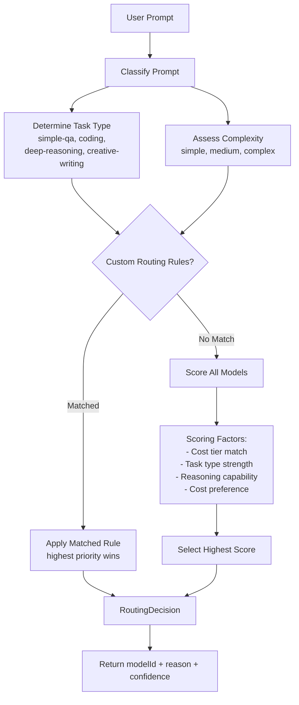
```mermaid
flowchart TB
    Input[User Prompt] --> Classify[Classify Prompt]
    
    Classify --> TaskType[Determine Task Type<br/>simple-qa, coding,<br/>deep-reasoning, creative-writing]
    Classify --> Complexity[Assess Complexity<br/>simple, medium, complex]
    
    TaskType --> CheckRules{Custom Routing Rules?}
    Complexity --> CheckRules
    
    CheckRules -->|Matched| ApplyRule[Apply Matched Rule<br/>highest priority wins]
    CheckRules -->|No Match| ScoreModels[Score All Models]
    
    ScoreModels --> Factors[Scoring Factors:<br/>- Cost tier match<br/>- Task type strength<br/>- Reasoning capability<br/>- Cost preference]
    Factors --> SelectBest[Select Highest Score]
    
    ApplyRule --> Decision[RoutingDecision]
    SelectBest --> Decision
    
    Decision --> Return[Return modelId + reason + confidence]
```

### Model Capability Registry

```typescript
interface ModelCapability {
  id: string;
  type: 'openai' | 'claude' | 'gemini';
  costTier: 'cheap' | 'medium' | 'expensive';
  strengths: string[];   // e.g., ['coding', 'deep-reasoning']
  maxTokens: number;
  reasoning: boolean;
}
```

## Event Bus Architecture

The event bus (`src/bus/index.ts`) provides typed pub/sub with Zod schema validation:

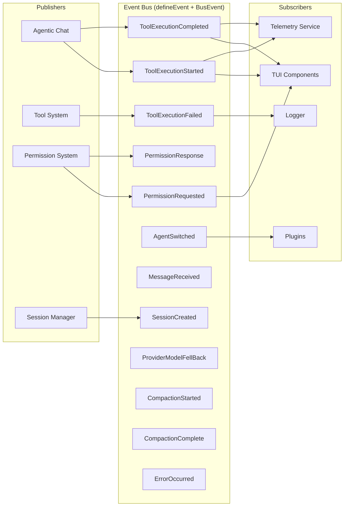
```mermaid
graph LR
    subgraph Publishers
        AgenticChat[Agentic Chat]
        ToolSystem[Tool System]
        PermSystem[Permission System]
        SessionMgr[Session Manager]
    end

    subgraph EventBus["Event Bus (defineEvent + BusEvent)"]
        ToolStart[ToolExecutionStarted]
        ToolEnd[ToolExecutionCompleted]
        ToolFail[ToolExecutionFailed]
        PermReq[PermissionRequested]
        PermResp[PermissionResponse]
        AgentSwitch[AgentSwitched]
        MsgRecv[MessageReceived]
        SessCreate[SessionCreated]
        ProviderFB[ProviderModelFellBack]
        CompStart[CompactionStarted]
        CompDone[CompactionComplete]
        ErrOccur[ErrorOccurred]
    end

    subgraph Subscribers
        TUI[TUI Components]
        Telemetry[Telemetry Service]
        Logger[Logger]
        Plugins[Plugins]
    end

    AgenticChat --> ToolStart
    AgenticChat --> ToolEnd
    ToolSystem --> ToolFail
    PermSystem --> PermReq
    PermSystem --> PermResp
    SessionMgr --> SessCreate

    ToolStart --> TUI
    ToolEnd --> TUI
    PermReq --> TUI
    ToolFail --> Logger
    ToolStart --> Telemetry
    ToolEnd --> Telemetry
    AgentSwitch --> Plugins
```

### Event API

```typescript
import { defineEvent, BusEvent } from '../bus/index.js';
import { z } from 'zod';

// Define a typed event
const MyEvent = defineEvent('MyEvent', z.object({
  toolName: z.string(),
  duration: z.number(),
}));

// Subscribe (handler added eagerly to prevent race conditions)
const unsub = MyEvent.subscribe((payload) => {
  console.log(payload.toolName, payload.duration);
});

// Publish
MyEvent.publish({ toolName: 'read', duration: 42 });

// Async publish (waits for all handlers)
await MyEvent.publishAsync({ toolName: 'write', duration: 100 });

// One-time listener
MyEvent.once((payload) => { /* ... */ });

// Wait for event with predicate
const result = await waitForEvent(MyEvent, (p) => p.toolName === 'bash', 5000);
```

### Eager Subscription

Subscriptions are acquired eagerly to prevent race conditions where events could be missed between the `subscribe()` call and the first `listen`. The handler is immediately added to the event handler set before the unsubscribe function is returned.

### Batched Publish (`publishAll` / `publishAllAsync`)

For call sites that emit many related events (draining a session fork, replaying a compacted transcript, flushing queued tool events) the bus exposes a batched publish primitive that mirrors the "commit all events in a single transaction before notifying subscribers" contract of the upstream kilocode `event-batch.ts` module — adapted to Alexi's synchronous, in-memory bus (no Effect-TS, no durable event store).

The contract is two-phase:

1. **Validate every payload up front.** Zod's `parse` runs across the whole batch before any handler is invoked. A validation failure propagates to the caller with no partial publish.
2. **Fan out with a per-event handler snapshot.** For each entry a snapshot of the current subscriber set is taken before iteration, so a handler that unsubscribes another handler mid-batch cannot observe a mutating set. Individual handler errors are caught and logged per entry.

```typescript
import { publishAll, publishAllAsync, type BatchEntry } from '../bus/index.js';
import { ToolExecutionStarted, ToolExecutionCompleted } from '../bus/index.js';

const entries: BatchEntry[] = [
  { event: ToolExecutionStarted, payload: { toolName: 'read', toolId: 'a', parameters: {}, timestamp: Date.now() } },
  { event: ToolExecutionCompleted, payload: { toolName: 'read', toolId: 'a', result: {}, duration: 12, timestamp: Date.now() } },
];

// Sync — handlers run inline, callers do not await
publishAll(entries);

// Async — awaits every handler via Promise.all per entry
await publishAllAsync(entries);
```

An `EventBatch` namespace is re-exported from `src/bus/event-batch.ts` so ported call sites (`EventBatch.publishAll(...)` / `EventBatch.publishAllAsync(...)`) work verbatim against the Alexi bus.

### Bash / Shell Output Streaming

The bash and shell tools (`src/tool/tools/bash.ts`, `src/tool/tools/shell.ts`) emit incremental `stdout` / `stderr` chunks on the event bus as they arrive from the underlying child process. The final aggregated `stdout` / `stderr` are still returned in the normal `ToolExecutionCompleted` payload; the streaming path is purely additive for TUI rendering of progress bars, `npm install` output, and long test runs (issue #1442).

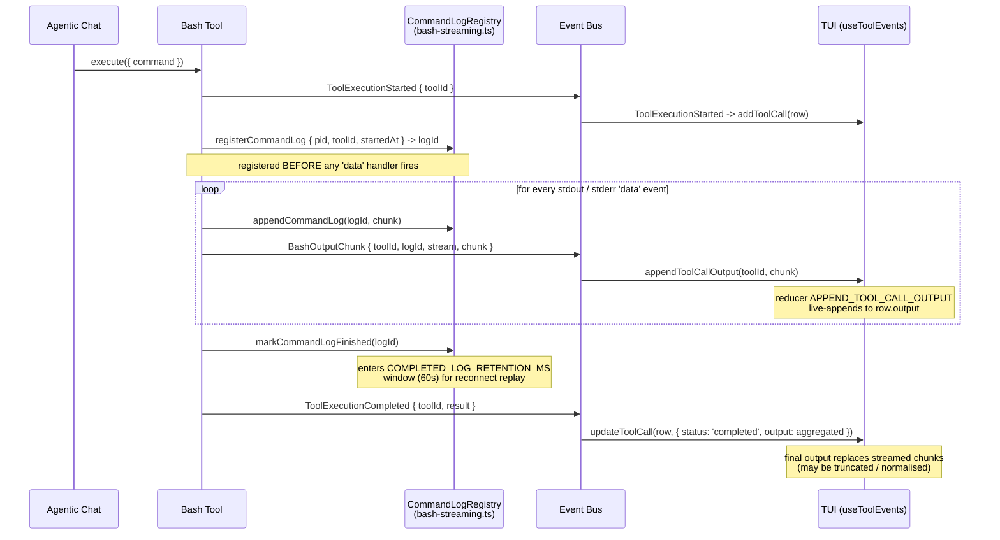
```mermaid
sequenceDiagram
    participant Agent as Agentic Chat
    participant Tool as Bash Tool
    participant Reg as CommandLogRegistry<br/>(bash-streaming.ts)
    participant Bus as Event Bus
    participant TUI as TUI (useToolEvents)

    Agent->>Tool: execute({ command })
    Tool->>Bus: ToolExecutionStarted { toolId }
    Bus->>TUI: ToolExecutionStarted -> addToolCall(row)
    Tool->>Reg: registerCommandLog { pid, toolId, startedAt } -> logId
    Note over Tool,Reg: registered BEFORE any 'data' handler fires

    loop for every stdout / stderr 'data' event
        Tool->>Reg: appendCommandLog(logId, chunk)
        Tool->>Bus: BashOutputChunk { toolId, logId, stream, chunk }
        Bus->>TUI: appendToolCallOutput(toolId, chunk)
        Note over TUI: reducer APPEND_TOOL_CALL_OUTPUT<br/>live-appends to row.output
    end

    Tool->>Reg: markCommandLogFinished(logId)
    Note over Reg: enters COMPLETED_LOG_RETENTION_MS<br/>window (60s) for reconnect replay
    Tool->>Bus: ToolExecutionCompleted { toolId, result }
    Bus->>TUI: updateToolCall(row, { status: 'completed', output: aggregated })
    Note over TUI: final output replaces streamed chunks<br/>(may be truncated / normalised)
```

The `BashOutputChunk` payload is defined in `src/bus/index.ts:325`:

```typescript
export const BashOutputChunk = defineEvent(
  'bash.output.chunk',
  z.object({
    toolId: z.string(),  // matches ToolExecutionStarted / Completed
    logId: z.string(),   // matches command-log registry entry
    stream: z.enum(['stdout', 'stderr']),
    chunk: z.string(),
    timestamp: z.number(),
  })
);
```

Design invariants of the command-log registry (`src/tool/tools/bash-streaming.ts`):

1. **PID-reuse defence**: logs are keyed by a synthetic `logId` (nanoid) rather than the OS PID. `getCommandLogByPid(pid, startedAt)` cross-references the recorded PID plus `startedAt` timestamp, so a subsequent process that happens to reuse the same PID cannot collide with the earlier entry. Callers requiring a stable identifier must match on `logId`.
2. **Probe-outage retention**: completed logs are retained for `COMPLETED_LOG_RETENTION_MS` (60 seconds) after `markCommandLogFinished`, so a TUI hub that briefly drops its subscription (probe outage, hot reload) can still fetch the tail on reconnect. Entries are dropped by `cleanupCompletedLogs`, which is auto-triggered on each new `registerCommandLog`.
3. **Bounded memory**: each log has an in-memory append buffer capped at `MAX_LOG_BYTES` (32 KB). When the cap is exceeded, the oldest bytes are dropped (snapping forward to the next newline within 1 KB) and a `[... older output evicted from streaming buffer ...]` truncation marker is inserted. The authoritative full output still lives in the process's own `stdout` accumulator (bash.ts) or on disk (`persistLargeOutput`).
4. **Telemetry-safe publish**: `BashOutputChunk.publish` is wrapped in `try { … } catch { /* never let telemetry take down a running command */ }` so a failing bus subscriber cannot tear down the running child process.
5. **Abort cleanup**: `cleanupCommandLog(logId)` reaps a log unconditionally. The bash tool calls it on `close`, on `error`, and from the abort-signal handler, so a cancelled command does not leak into the registry.

The TUI consumes the stream via `useToolEvents` (`src/cli/tui/hooks/useToolEvents.ts`), which subscribes to `BashOutputChunk` alongside `ToolExecutionStarted` / `Completed` / `Failed`. Chunks are dispatched into the `ChatContext` reducer as `APPEND_TOOL_CALL_OUTPUT`, which live-appends to the active row's `output` without moving the entry between the `activeToolCalls` and `completedToolCalls` buckets. On completion, the `ToolExecutionCompleted` handler replaces `output` with the final aggregated payload from the tool result — this may be truncated or normalised differently (carriage returns, head-and-tail elision) than the raw streamed chunks.

### Plan Ready Signal (`plan.opened`)

The `open_plan` tool (`src/tool/tools/open-plan.ts`) publishes a typed `plan.opened` event on the shared bus whenever an agent surfaces a plan markdown file for review. Ports upstream kilocode `6024a76db feat(vscode): open agent-created plans` and `325656483 fix(vscode): scope plan opens to active session`. Upstream the tool asks the VSCode host to open the file in an editor pane; Alexi has no VSCode webview, so the port adapts the semantics to a CLI/CI-safe notification instead of spawning an editor process (which would deadlock in headless CI runs).

```typescript
// src/tool/tools/open-plan.ts
export const PlanOpened = defineEvent(
  'plan.opened',
  z.object({
    sessionId: z.string().optional(),
    path: z.string(),        // resolved absolute path
    title: z.string().optional(),
    timestamp: z.number(),   // Date.now() at publish time
  })
);
```

Emission contract:

1. **Path resolution.** Relative paths are resolved against `context.workdir` (or `process.cwd()` when the context has no workdir). Absolute paths are used as-is.
2. **Existence and extension check.** The target must exist as a file (not a directory) AND end in `.md`. Missing or non-markdown targets return an error and do NOT publish the event.
3. **Title default.** When the caller omits `title`, the tool defaults it to `path.basename(resolved)`.
4. **Publish failures are swallowed.** The `PlanOpened.publish(...)` call is wrapped in `try/catch` because the event is a notification, not a correctness dependency. A schema-mismatch on the subscriber side must not crash the tool.

Typical consumers: the Ink TUI to render a plan-ready banner, SAP integration hooks to attach the plan to an issue, external CI listeners to gate a stage on plan review. Subscribers register via `PlanOpened.subscribe(handler)` and receive an `unsubscribe` function.

## Native OS Notifications

Alexi surfaces desktop notifications when a streaming chat completes cleanly or when a long-running bash command finishes. The implementation lives in `src/core/notifications.ts` and is wired into `src/core/streamingOrchestrator.ts` and `src/tool/tools/bash.ts`.

### Design goals

The module has three responsibilities that are worth stating explicitly because they inform every branch of the code:

1. **Never crash the CLI.** A missing native binary (`terminal-notifier`, `notify-send`, `snoretoast`), a broken `node-notifier` load, a platform-specific dispatch error, or an unwritable config file all resolve `false` after `logger.debug`. There is no code path in which a failed notification can throw.
2. **Never surprise CI or agents.** Non-interactive contexts (no TTY, `CI=1`, `ALEXI_NO_NOTIFICATIONS=1`, or an `ask` decision with no attached terminal) short-circuit before any prompt or dispatch. Agent workflows and GitHub Actions runs never trigger a desktop alert.
3. **Ask once, remember forever.** The first interactive call with an unset `notifications` key prompts via `@inquirer/prompts` `confirm`; the answer is persisted to `~/.alexi/config.json` under the `notifications` key as `allow` or `deny`. Subsequent calls resolve the decision on every invocation so a user who edits the config from `deny` to `allow` mid-session sees the change on the next completion event.

### Decision flow

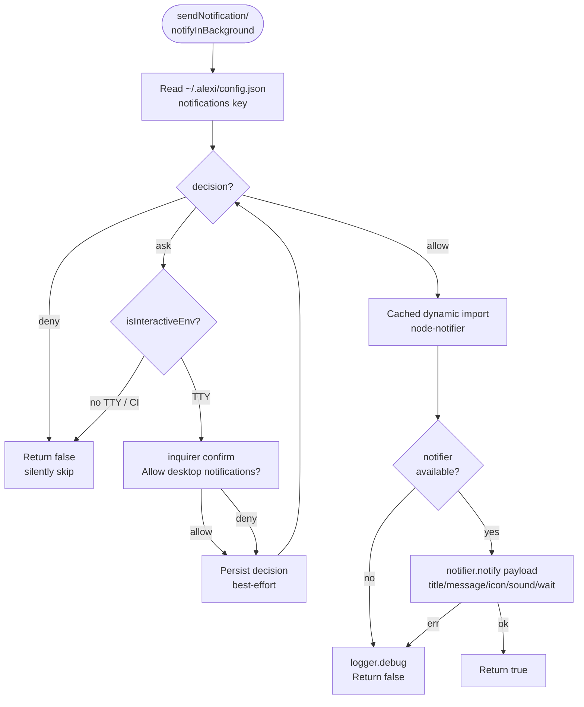
```mermaid
flowchart TD
    Call([sendNotification/<br/>notifyInBackground])
    ReadCfg[Read ~/.alexi/config.json<br/>notifications key]
    Decision{decision?}
    Ask{isInteractiveEnv?}
    Skip[Return false<br/>silently skip]
    Prompt[inquirer confirm<br/>Allow desktop notifications?]
    Persist[Persist decision<br/>best-effort]
    LoadNotifier[Cached dynamic import<br/>node-notifier]
    NotifierOk{notifier<br/>available?}
    Dispatch[notifier.notify payload<br/>title/message/icon/sound/wait]
    Success[Return true]
    Error[logger.debug<br/>Return false]

    Call --> ReadCfg
    ReadCfg --> Decision
    Decision -->|deny| Skip
    Decision -->|ask| Ask
    Ask -->|no TTY / CI| Skip
    Ask -->|TTY| Prompt
    Prompt -->|allow| Persist
    Prompt -->|deny| Persist
    Persist --> Decision
    Decision -->|allow| LoadNotifier
    LoadNotifier --> NotifierOk
    NotifierOk -->|no| Error
    NotifierOk -->|yes| Dispatch
    Dispatch -->|err| Error
    Dispatch -->|ok| Success
```

### Public surface

```typescript
// src/core/notifications.ts
export type NotificationDecision = 'allow' | 'deny' | 'ask';

export interface SendNotificationOptions {
  icon?: string;
  sound?: boolean;
  wait?: boolean;
  __notifierOverride?: NotifierLike; // tests only
  __askOverride?: (title: string, message: string) => Promise<boolean>; // tests only
}

export const LONG_RUNNING_THRESHOLD_MS = 30_000;

export function isInteractiveEnv(): boolean;
export function getNotificationDecision(): NotificationDecision;
export function setNotificationDecision(decision: NotificationDecision): void;
export function sendNotification(
  title: string,
  message: string,
  options?: SendNotificationOptions
): Promise<boolean>;
export function notifyInBackground(
  title: string,
  message: string,
  options?: SendNotificationOptions
): void;
```

`isInteractiveEnv()` returns `false` when `ALEXI_NO_NOTIFICATIONS=1`, when `CI` is set to any value other than `0` / `false`, or when either `process.stdin` or `process.stdout` is not a TTY. `getNotificationDecision()` coerces malformed persisted values back to `'ask'` so callers never see arbitrary strings. `notifyInBackground` is the fire-and-forget wrapper — it discards the promise safely and inherits `sendNotification`'s no-throw guarantee.

### Call sites

Two call sites currently invoke `notifyInBackground`:

- **`src/core/streamingOrchestrator.ts:344`** — fires `notifyInBackground('Alexi', 'Task completed')` only when the streaming loop exits via the `completedCleanly` branch. Aborts (`AbortSignal`), provider errors, context-overflow retries, and rate-limit backoffs do NOT fire a completion alert, so "task completed" is a truthful signal.
- **`src/tool/tools/bash.ts`** — fires `notifyInBackground('Command finished', description ?? command)` in two cases: (a) a detached command's final exit event (by definition long-running because the user picked "Proceed" only after `DETACH_PROMPT_MS`), and (b) a foreground command whose wall-clock elapsed time is `>= LONG_RUNNING_THRESHOLD_MS` (30 seconds). Short-running foreground commands (`ls`, `git status`) never fire — the notification is only useful when the user has switched context.

Both sites gate on the shared `notifications` config key, so a single `deny` decision silences both surfaces without any per-caller wiring.

### Dependency loading

`node-notifier` is loaded via a cached dynamic import in `loadNotifier()`. The cache is a three-state variable (`undefined` = not attempted, `null` = attempted and failed, `NotifierLike` = ready) so users who deny notifications never pay the native-binary probe cost — the module is only imported on the first `allow` call. `_resetNotifierCacheForTests()` clears the cache for unit tests. The `NotifierLike` interface is deliberately reduced to the single `notify(options, callback?)` method Alexi uses so `@types/node-notifier` is a devDependency rather than a hard runtime type import and tests can pass inline mocks.

## Agent System

> **Build status (2026-07-24):** the 2026-07-24 upstream sync (commit `530351f4`) destructively replaced `src/agent/index.ts` with a 3-line broken import stub (`import { newAgentPatterns } from 'packages/opencode/src/agent/agent';`). The agent-registry surface documented in this section — `AgentRegistry`, the five built-in agents, `stripInternalOptions`, `INTERNAL_OPTION_KEYS`, `getAgentRegistry` / `switchAgent` / `parseAgentMention`, and the `AgentSwitched` bus event — is currently unresolvable and breaks the build. Seven downstream modules import from `src/agent/index.js` and are all failing to type-check: `src/core/agenticChat.ts`, `src/core/streamingOrchestrator.ts`, `src/cli/commands/chat.ts`, `src/config/modes-migrator.ts`, `src/server/index.ts`, `src/tool/tools/task.ts`, and the tests in `src/agent/index.test.ts` / `src/core/__tests__/agenticChat.test.ts`. Autohealing must revert the file to its pre-sync content (parent commit `9f9fad90`); see the corresponding CHANGELOG `### Removed` entry for the full recovery specification. The rest of this section describes the intended runtime shape once the file is restored.

> **Build status (2026-07-26 addendum):** the 2026-07-26 upstream sync (commit `0985297e`, version bump `1.18.11` → `1.18.12`) did **not** touch `src/agent/index.ts` — the file remains in the broken state described in the 2026-07-24 note above. The 2026-07-26 sync did, however, add a new 5-line orphan file `src/agent/instance-advertisement.ts` under this same `src/agent/` directory, exporting a stray `advertiseInstance(instanceId: string): void` function that only calls `console.log` and has no consumer anywhere in the source tree. It is **not** part of the intended agent surface documented in this section — Alexi does not have an "instance advertisement" primitive; multi-agent coordination is owned by the `AgentRegistry` in `src/agent/index.ts` (once restored) and per-invocation dispatch by `src/core/agenticChat.ts` / `src/core/streamingOrchestrator.ts`. The file violates the project-wide `no-console` ESLint rule (only `src/utils/logger.ts` may use `console`) and is pending autohealing deletion; see the CHANGELOG `### Added` entry for 2026-07-26 for the disposition. Two further 2026-07-26 orphan stubs were also added outside this section — `src/cli/remote.ts` (a broken `executeRemoteCommand` scaffold; see [CLI Layer](#cli-layer)) and `src/context/global-sync/bootstrap.ts` + `src/context/server-session-reducer.ts` (broken context-module scaffolds).

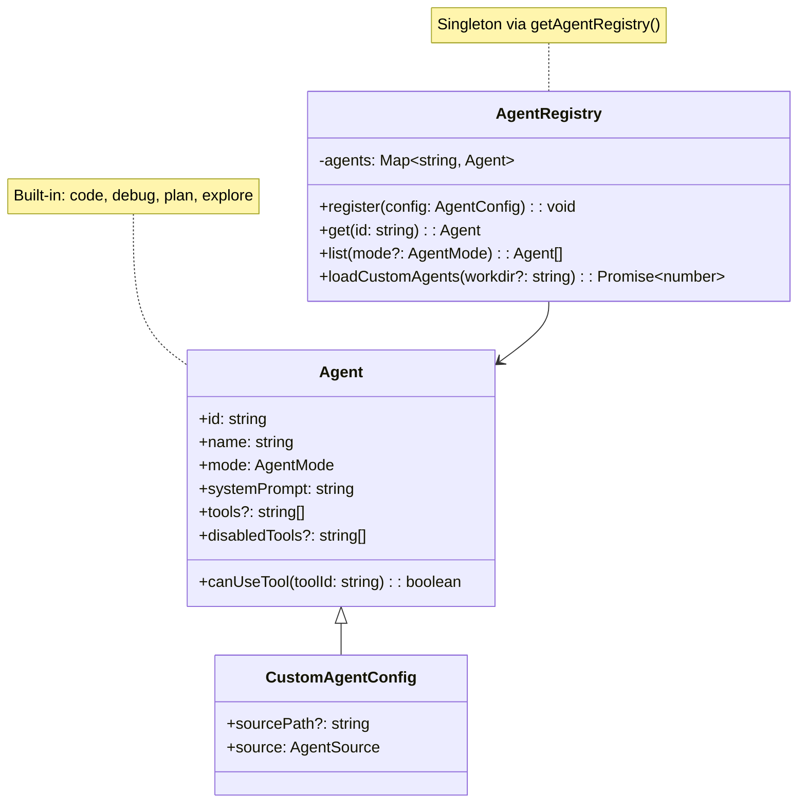
```mermaid
classDiagram
    class AgentRegistry {
        -agents: Map~string, Agent~
        +register(config: AgentConfig): void
        +get(id: string): Agent
        +list(mode?: AgentMode): Agent[]
        +loadCustomAgents(workdir?: string): Promise~number~
    }

    class Agent {
        +id: string
        +name: string
        +mode: AgentMode
        +systemPrompt: string
        +tools?: string[]
        +disabledTools?: string[]
        +canUseTool(toolId: string): boolean
    }

    class CustomAgentConfig {
        +sourcePath?: string
        +source: AgentSource
    }

    AgentRegistry --> Agent
    Agent <|-- CustomAgentConfig

    note for AgentRegistry "Singleton via getAgentRegistry()"
    note for Agent "Built-in: code, debug, plan, explore"
```

### Built-in Agents

| ID | Name | Mode | Purpose |
|----|------|------|---------|
| `code` | Code Agent | all | General-purpose coding (default) |
| `debug` | Debug Agent | all | Debugging and fixing issues |
| `plan` | Plan Agent | all | Architecture and planning (read-only tools) |
| `explore` | Explore Agent | subagent | Fast codebase exploration |

### Custom Agent Loading

Custom agents are loaded from markdown files with YAML frontmatter:

```markdown
---
slug: my-agent
name: My Custom Agent
mode: primary
tools: [read, write, edit, bash]
---

You are a specialized agent for...
```

Agents support `{file:path/to/file}` inclusions (recursive, max depth 3) resolved relative to the agent file's directory.

Loading order (lowest precedence first, duplicates overwrite):
1. `~/.alexi/agents/*.md` (user-global)
2. `.alexi/agents/*.md` (project-local)

## Hooks System

The hooks system (`src/hooks/index.ts`) provides lifecycle callbacks for tool execution and session events:

```typescript
interface HookDefinition {
  event: HookEvent;    // SessionStart, PreToolUse, PostToolUse, Stop, etc.
  type: HookType;      // 'command' | 'http' | 'script'
  command?: string;    // Shell command with template variables
  url?: string;        // HTTP endpoint
  script?: string;     // JS/TS file path
  timeout?: number;    // Default: 30000ms
  continueOnBlock?: boolean; // Feed rejection back to model
}
```

Key features:
- **Block Cap**: Consecutive Stop hook rejections are capped to prevent infinite loops
- **continueOnBlock**: When a hook rejects, the error is fed back to the model instead of halting
- **Template Variables**: Hook commands support `{​{toolName}}`, `{​{sessionId}}`, etc.

### `contextModification` payloads and `displayRole` hiding

Both `PreToolUse` and `PostToolUse` hooks can return a `contextModification` string. The agentic loop (`src/core/agenticChat.ts`) collects them across every tool call in an iteration and, once every tool result for that iteration has been appended, flushes them as stamped user messages in a fixed order:

1. Every `PreToolUse` payload for the iteration is emitted first, each wrapped as `<hook_context tool_name=\"…\" tool_call_id=\"…\" phase=\"pre\">…</hook_context>`.
2. Then every `PostToolUse` payload is emitted, wrapped as `<hook_context tool_name=\"…\" tool_call_id=\"…\">…</hook_context>` (no `phase` attribute — the omission preserves backwards compatibility with prompts that already reference the un-phased envelope).

Each payload is markup-sanitized via `sanitizeHookContext` (`src/utils/markup-sanitize.ts`): embedded `<hook_context>` tags are HTML-escaped so a malicious or buggy hook cannot break out of the envelope, forge a different `tool_name`, or spoof a `phase`. Each payload is also independently truncated to `MAX_HOOK_CONTEXT_BYTES` (50 KB, matching upstream Cline) inside `parseContextModification` — before it ever reaches the agent loop — so a runaway hook cannot drown the model prompt.

`contextModification` on a hook result whose `success` is `false` is intentionally dropped: rejection handling (halt or `continueOnBlock` feedback) always takes precedence and no `<hook_context>` block is injected for a failed hook.

Introduced in 1.21.4 (issue #1466): the same messages that reach the model are ALSO persisted to the session with `displayRole: 'system'` so they are hidden from the user-facing transcript (TUI `MessageArea`, `sessions export`, `SessionReplay`). This gives hook authors an \"instrument the model, don't clutter the user\" primitive.

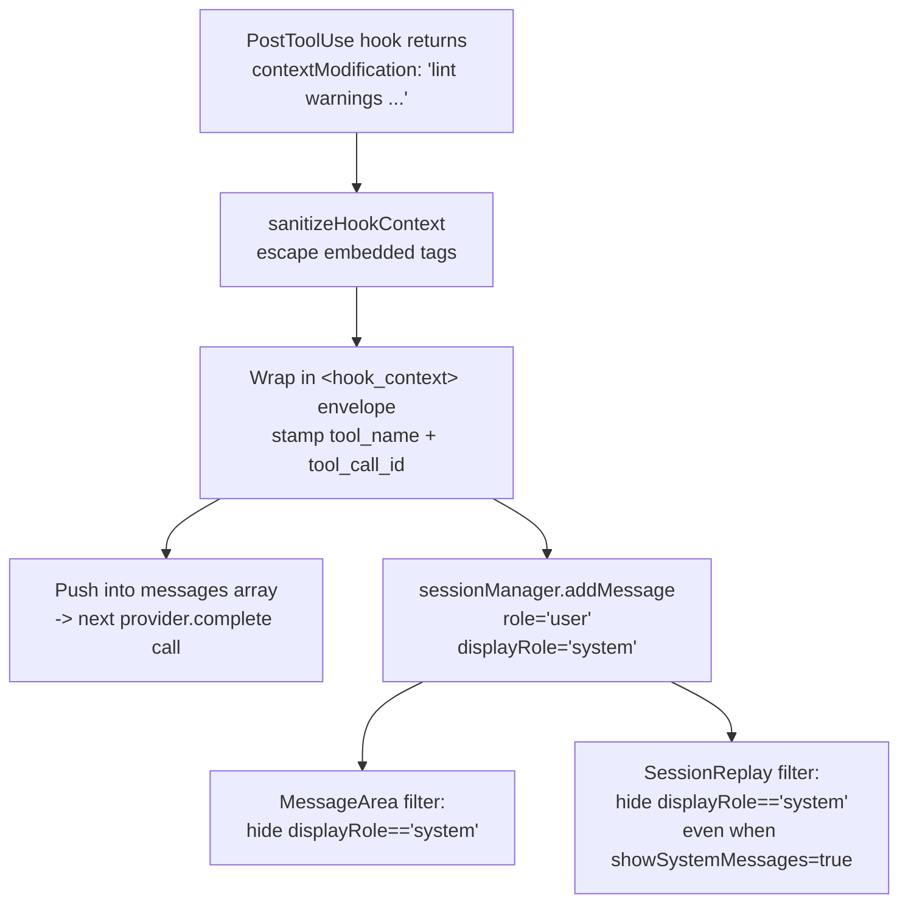
```mermaid
flowchart TB
    Hook[PostToolUse hook returns<br/>contextModification: 'lint warnings ...']
    Sanitize[sanitizeHookContext<br/>escape embedded tags]
    Stamp[Wrap in &lt;hook_context&gt; envelope<br/>stamp tool_name + tool_call_id]
    Model[Push into messages array<br/>-&gt; next provider.complete call]
    Session[sessionManager.addMessage<br/>role='user'<br/>displayRole='system']
    TUI[MessageArea filter:<br/>hide displayRole=='system']
    Replay[SessionReplay filter:<br/>hide displayRole=='system'<br/>even when showSystemMessages=true]

    Hook --> Sanitize
    Sanitize --> Stamp
    Stamp --> Model
    Stamp --> Session
    Session --> TUI
    Session --> Replay
```

Contract:

- The provider always receives the message with its logical `role` (`'user'` for hook context). `displayRole` is a UI-only filter.
- `MessageArea` filters `messages.filter(m => m.displayRole !== 'system')` before rendering. When every message is filtered, the empty-state placeholder ("Start a conversation…") appears.
- `SessionReplay.replay(messages, opts)` hard-hides `displayRole: 'system'` even when `showSystemMessages: true`. Real `role: 'system'` messages (the actual system prompt) remain visible when that option is set.
- `SessionManager.addMessage(role, content, tokens?, options?)` accepts either the raw `displayRole` string or an options object (`{ displayRole }`) as its fourth argument for backwards compatibility with three-argument call sites.
- Auto-title generation (`activeSession.metadata.title` from the first user message) skips messages carrying any `displayRole` value, so hook payloads cannot end up as the session title.

## Compaction System

Context compaction manages conversation length when approaching token limits:

| Strategy | Description |
|----------|-------------|
| `truncate` | Remove oldest messages beyond limit |
| `summarize` | AI-powered summarization of old messages |
| `sliding` | Sliding window keeping recent messages |
| `smart` | Hybrid: importance scoring + summarization |

### Reactive Seeding

When context overflow is detected during LLM calls, the system calculates optimal summary size:

```typescript
const targetSummaryTokens = Math.max(
  1,
  Math.floor(totalOldTokens - overflowTokens * 1.5)
);
// Appended to summary prompt:
// "Keep your summary under approximately N tokens."
```

### Trigger Projection from Provider-Reported Usage

Ports upstream kilocode `f607bf0e0` (`Fix auto-compaction threshold`) plus companions `030412ea0` and `e28ec562b`. Historically, `shouldCompact(messages, maxContextTokens, threshold)` walked the entire transcript on every call via `estimateMessagesTokens`, which double-counted the system prompt on every turn and could trip the trigger prematurely on large tool outputs. `shouldCompact` now accepts an options bag that projects the NEXT-turn cost from the provider's reported baseline plus anything new that has landed since:

```typescript
// src/core/compaction.ts
export interface ShouldCompactOptions {
  threshold?: number;
  reserveOutputTokens?: number;
  /** Provider-reported input tokens from the previous completed turn. */
  reportedUsage?: number;
  /** Approx system-prompt tokens — counted at most ONCE, not per turn. */
  systemPromptTokens?: number;
  /** Approx tokens of tool result content since the last reportedUsage. */
  toolContentTokens?: number;
}

export function shouldCompact(
  messages: Message[],
  maxContextTokens: number,
  thresholdOrOptions?: number | ShouldCompactOptions
): boolean;
```

Projection algorithm (when `reportedUsage > 0`):

```text
currentTokens = reportedUsage
              + systemPromptTokens          // counted once
              + toolContentTokens           // new tool output not yet baked in
              + Σ (4 + estimateTokens(m.content))
                  for m in messages where m.tokens is unrecorded
```

Messages that already carry a recorded `tokens.input` / `tokens.output` are excluded from `Σ` because those counts are already folded into `reportedUsage` — including them would double-count. Every uncounted message adds a `+4` structural overhead for role / delimiter tokens. Legacy positional form (`shouldCompact(messages, maxContextTokens, thresholdNumber)`) still works — a `number` third argument is normalised to `{ threshold: thresholdOrOptions }` and takes the pre-existing estimation path. `reserveOutputTokens` continues to be subtracted from `maxContextTokens` BEFORE the percentage threshold on both paths, so the reserved output budget never trips the trigger.

Caller contract: `reportedUsage` MUST be cleared (dropped to `undefined` or `0`) after a cancelled / aborted response so a stale baseline does not keep the projection inflated on every subsequent call. The projection is intentionally conservative on uncounted messages — the trigger fires slightly early rather than slightly late so summarisation has room to run before the provider rejects the next request for context overflow.

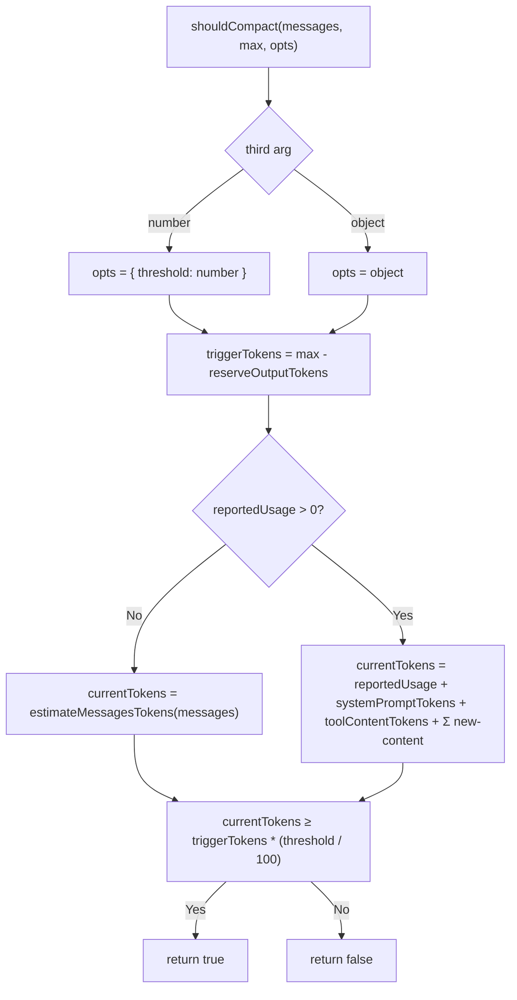
```mermaid
flowchart TD
    Call["shouldCompact(messages, max, opts)"] --> LegacyOrOpts{third arg}
    LegacyOrOpts -->|number| Legacy["opts = { threshold: number }"]
    LegacyOrOpts -->|object| Explicit["opts = object"]
    Legacy --> Trigger["triggerTokens = max - reserveOutputTokens"]
    Explicit --> Trigger
    Trigger --> Path{reportedUsage &gt; 0?}
    Path -->|No| OldPath["currentTokens = estimateMessagesTokens(messages)"]
    Path -->|Yes| NewPath["currentTokens = reportedUsage + systemPromptTokens + toolContentTokens + Σ new-content"]
    OldPath --> Compare
    NewPath --> Compare
    Compare["currentTokens ≥ triggerTokens * (threshold / 100)"]
    Compare -->|Yes| Fire[return true]
    Compare -->|No| Skip[return false]
```

### Empty-Summary Guard

Ports upstream opencode `#14318` (2026-09-23 sync). When the LLM (or the deterministic fallback) returns an empty or whitespace-only summary, `compactConversation()` no longer silently discards the older history:

```typescript
// src/core/compaction.ts
if (!summary || summary.trim().length === 0) {
  const fallback = createFallbackSummary(messagesToSummarize);
  if (fallback && fallback.trim().length > 0) {
    summary = fallback;
  } else {
    compactionErrorMessage =
      'compaction returned empty summary; keeping existing session state';
    const noopResult: CompactionResult = {
      originalMessages: messages.length,
      compactedMessages: messages.length,
      estimatedTokensSaved: 0,
      summary: '',
    };
    return {
      messages: [...messages],
      result: noopResult,
    };
  }
}
```

The deterministic `createFallbackSummary()` is preferred as a last resort; only if even that is empty does the function return the ORIGINAL messages unchanged. The no-op `CompactionResult` reports `compactedMessages === originalMessages`, `estimatedTokensSaved: 0`, and `summary: ''`, with `compactionErrorMessage` surfaced through the `CompactionComplete` bus event so subscribers can distinguish a truly successful compaction from a preserved-state one. This prevents a rare-but-catastrophic failure mode where a flaky provider response would wipe multi-hour context down to a single empty system message.

### Summary Prompt

The compaction summary prompt (`SUMMARY_PROMPT` in `src/core/compaction.ts`) was reverted in the 2026-09-23 sync to a simpler, more explicit "context summarization agent" formulation so smaller models (DSv4 Flash class) follow the structured-output requirement reliably:

```typescript
const SUMMARY_PROMPT = `You are a context summarization agent. You are given a conversation between a user and an agent. Your goal is to produce a structured summary matching the format specified so another coding agent can continue the work.

Extract and preserve:
1. KEY DECISIONS: What was decided and why
2. FILES CHANGED: List all files created/modified/deleted (preserve exact paths and identifiers)
3. CONTEXT: Tech stack, constraints, requirements mentioned
4. CURRENT STATE: What task is in progress, what's next
5. USER INSTRUCTIONS: Preserve ALL user-specified preferences, constraints, and explicit instructions verbatim (coding style, API keys, endpoints, "always do X", "never do Y")
...
Conversation:
{messages}`;
```

The five-section extract-and-preserve list is unchanged, so downstream reducers that parse the sectioned output continue to work; only the framing wrapper differs (dropping the earlier "anchored" / "coding agent" phrasing).

### Chunked Compaction

Large contexts are split into chunks at natural boundaries (newlines, paragraphs) before compaction:

```typescript
import { compactInChunks } from './compaction-chunks.js';

const result = await compactInChunks(content, async (chunk) => {
  return await summarize(chunk);
}, 100000); // max tokens per chunk
```

### Compaction Lifecycle Events

Compaction can take several seconds on large sessions — long enough that the
UI needs to distinguish "still working" from "hung". `src/core/compaction.ts`
publishes two typed events through the event bus (`src/bus/index.ts`) so any
subscriber (TUI, telemetry, plugins) can observe start/finish transitions:

```typescript
// src/bus/index.ts
export const CompactionStarted = defineEvent(
  'compaction.started',
  z.object({
    sessionId: z.string().optional(),
    messageCount: z.number(),
    estimatedTokens: z.number().optional(),
    trigger: z.enum(['auto', 'manual', 'partial']).optional(),
    timestamp: z.number(),
  })
);

export const CompactionComplete = defineEvent(
  'compaction.complete',
  z.object({
    sessionId: z.string().optional(),
    originalMessages: z.number(),
    compactedMessages: z.number(),
    estimatedTokensSaved: z.number(),
    durationMs: z.number(),
    trigger: z.enum(['auto', 'manual', 'partial']).optional(),
    error: z.string().optional(),
    timestamp: z.number(),
  })
);
```

Key invariants enforced by `compactConversation()` and `partialCompact()`:

- `CompactionStarted` is only published once real work begins — the
  early-return branches (empty input, messages below `preserveLastN`, generous
  target buffer) never emit lifecycle events, so consumers do not see spurious
  "Compacting…" flashes for no-op calls.
- `CompactionComplete` is emitted from a `try/finally` guard so it fires even
  when summary generation throws. The `error` field carries the message. This
  prevents the TUI from getting stuck on the spinner if the summarizer errors.
- Bus publish failures are swallowed inside the emit helpers so a broken
  subscriber cannot break compaction itself.
- The `trigger` discriminator lets subscribers separate normal auto-compaction
  (`'auto'`), user-invoked compaction (`'manual'`), and rewind/summarize
  partial compaction (`'partial'`).

The Ink TUI `StatusBar` (`src/cli/tui/components/StatusBar.tsx`) subscribes to
both events to show a "Compacting context..." spinner segment while
compaction is running, matching the existing streaming-spinner pattern:

```tsx
const [isCompacting, setIsCompacting] = React.useState(false);

React.useEffect(() => {
  const unsubStart = CompactionStarted.subscribe(() => setIsCompacting(true));
  const unsubComplete = CompactionComplete.subscribe(() => setIsCompacting(false));
  return () => {
    unsubStart();
    unsubComplete();
  };
}, []);
```

```mermaid
sequenceDiagram
    participant Caller as Agentic Chat / Rewind
    participant Compact as compactConversation()
    participant Bus as Event Bus
    participant TUI as StatusBar (Ink)

    Caller->>Compact: messages, options
    alt No work required (early return)
        Compact-->>Caller: unchanged messages
    else Real compaction
        Compact->>Bus: publish CompactionStarted<br/>{trigger, messageCount, estimatedTokens}
        Bus-->>TUI: setIsCompacting(true)
        Note over Compact: Summarize (LLM or fallback),<br/>chunk if oversized
        alt Success
            Compact->>Bus: publish CompactionComplete<br/>{compactedMessages, tokensSaved, durationMs}
        else Error thrown
            Compact->>Bus: publish CompactionComplete<br/>{error, durationMs} (finally block)
            Compact-->>Caller: re-throw
        end
        Bus-->>TUI: setIsCompacting(false)
        Compact-->>Caller: CompactionResult
    end
```

## Rewind Command

The `/rewind` command (`src/command/rewind.ts`) provides conversation history manipulation by allowing users to navigate to a specific turn boundary and either discard or summarize messages:

```mermaid
flowchart TB
    Input["/rewind [turn] [--summarize]"] --> Parse[Parse Arguments]
    Parse --> HasTurn{Turn Number?}
    
    HasTurn -->|No| List[List Turn Boundaries]
    HasTurn -->|Yes| HasSummarize{--summarize?}
    
    HasSummarize -->|Yes| Summarize[Summarize Mode]
    HasSummarize -->|No| Discard[Discard Mode]
    
    List --> ShowBoundaries[Show User Messages<br/>with Turn Numbers]
    
    Discard --> FindBoundary[Find Turn Boundary]
    FindBoundary --> KeepUpTo[Keep Messages Up To Turn End]
    KeepUpTo --> UpdateSession[Update Session Messages]
    
    Summarize --> FindBoundary2[Find Turn Boundary]
    FindBoundary2 --> PartialCompact[partialCompact: Summarize<br/>Messages Before Turn]
    PartialCompact --> InsertSummary[Insert Summary as<br/>System Message]
    InsertSummary --> KeepFrom[Keep Messages From Turn Onward]
    KeepFrom --> UpdateSession
    
    UpdateSession --> Result[Return RewindResult]
```

### Turn Boundaries

A "turn" is defined as starting at each user message (system messages are ignored). The rewind system identifies these boundaries and allows navigation:

```typescript
interface TurnBoundary {
  turnNumber: number;
  messageIndex: number;
  preview: string;        // First 50 chars of user message
  role: Message['role'];
}
```

### Rewind Modes

| Mode | Description | Use Case |
|------|-------------|----------|
| `list` | Show all turn boundaries | Explore conversation structure |
| `discard` | Remove messages after turn N | Undo recent conversation turns |
| `summarize` | Compress messages before turn N | Free context while preserving history |

The summarize mode delegates to `partialCompact()` from the compaction system, which uses the configured LLM summarize function to create a `[CONVERSATION SUMMARY]` system message.

## Code Review Command

The `code-review` command (`src/command/codeReview.ts`) runs a structured correctness-bug review
over `git diff`. The same `executeCodeReview` core is exposed through three surfaces:

| Surface | Entry point | File |
|---------|-------------|------|
| Non-interactive CLI | `alexi code-review` | `src/cli/commands/codeReview.ts` |
| Legacy interactive REPL | `/code-review [effort]` | `src/cli/interactive.ts` (`handleCommand`) |
| Ink TUI slash command | `/code-review [effort]` | `src/cli/tui/hooks/useCommands.ts` |

The executor reads the diff with `child_process.execFile('git', ['diff', ...])` (no shell) so
user-provided `--base <branch>` values cannot be interpreted as shell metacharacters. Reusing
`execFile` instead of the bash tool also keeps the executor self-contained and easy to mock in
unit tests.

```mermaid
flowchart TB
    Entry["alexi code-review<br/>or /code-review"] --> Opts[Parse effort and target]
    Opts --> Diff["readGitDiff()<br/>execFile('git', ['diff', ...])"]
    Diff --> Empty{Diff empty?}
    Empty -->|Yes| Skip["Return: 'No changes to review.'<br/>modelUsed=''  totalTokens=0"]
    Empty -->|No| Pick["pickModelForEffort(effort)"]
    Pick --> Override{modelOverride set?}
    Override -->|Yes| UseOverride[Use modelOverride]
    Override -->|No| ByEffort{effort?}
    ByEffort -->|high| Reasoning["Find reasoning + expensive model<br/>fallback: any expensive<br/>fallback: getDefaultModel()"]
    ByEffort -->|low| Cheap["Find costTier='cheap'<br/>fallback: getDefaultModel()"]
    ByEffort -->|medium| Default["getDefaultModel()"]
    Reasoning --> Build
    Cheap --> Build
    Default --> Build
    UseOverride --> Build["buildSystemPrompt(effort)<br/>= EFFORT_PREAMBLE + codeReviewSkill.prompt"]
    Build --> Send["sendChat(diff, { modelOverride, systemPrompt })"]
    Send --> Result[Return CodeReviewResult]
```

### Effort levels

The effort level controls both the system prompt preamble and the model selection:

| Effort | Preamble | Model preference |
|--------|----------|------------------|
| `low` | "Focus only on critical correctness bugs. Skip style and nice-to-haves." | `costTier === 'cheap'` |
| `medium` | _(none)_ | `getDefaultModel()` |
| `high` | "Be thorough: trace edge cases, race conditions, error handling, security implications, and test coverage gaps." | `reasoning === true` AND `costTier === 'expensive'` |

The base system prompt is the `code-review` skill prompt from `src/skill/skills/index.ts`,
preserving the structured `MUST FIX / SHOULD IMPROVE / NICE TO HAVE` review format.

### Structured review output contract

The `codeReviewSkill.prompt` mandates a machine-parseable output shape so downstream tooling (PR comment renderers, review dashboards, DoD checkers) can locate findings without regex-guessing:

- Exactly three top-level level-3 markdown headers, in this order: `### MUST FIX`, `### SHOULD IMPROVE`, `### NICE TO HAVE`. Empty sections are emitted with the header and no bullets — the header is NEVER omitted, and findings are NEVER invented to fill an empty category.
- Every finding is a bullet whose FIRST token is a backticked `path/to/file.ext:LINE` reference (or `path/to/file.ext` when no specific line applies), followed by an imperative summary. A second line explains WHY the finding matters, and for MUST FIX / SHOULD IMPROVE an indented `- Fix: ...` sub-bullet carries a concrete remediation.
- Bullets are self-contained: no "the above" / "the earlier bullet" references, because the fix pass may reorder them.
- When there are no findings anywhere, a single `_No issues found._` line is emitted above the three empty headers so parsers can distinguish "reviewed, clean" from "review failed silently".

### Targets

```typescript
export type CodeReviewTarget = 'uncommitted' | { base: string };
```

- `'uncommitted'` (default) → `git diff HEAD`
- `{ base: 'main' }` → `git diff main...HEAD`

The non-interactive CLI exposes both targets via `--base <branch>`. The interactive slash
commands only review uncommitted changes; use the CLI for base-branch reviews.

### Cancellation

The legacy REPL slash command creates a dedicated `AbortController` for the review and stores
it as `state.abortController` so Ctrl+C cancels the in-flight review without cancelling the
session. The original abort controller is restored in a `finally` block. The executor itself
checks `opts.signal?.aborted` before reading the diff and again before invoking the model.

### Empty-diff fast path

When `git diff` returns an empty string the executor returns
`{ success: true, review: 'No changes to review.', modelUsed: '', totalTokens: 0 }` without
invoking `sendChat`. Both interactive surfaces and the CLI handle this transparently.

### VCS Provider Detection (`src/git/remoteDetection.ts`, `src/git/urlFormatter.ts`)

The non-interactive CLI (`src/cli/commands/codeReview.ts`) is provider-aware for two output concerns — the terminology used in status lines ("MR" vs "PR"), and gating of the GitHub-only `--comment` path — while the review itself remains provider-agnostic. Detection is a **strictly additive** step: any failure resolves to `null` and the command falls back to its pre-existing GitHub-shaped behaviour. No new required dependencies were introduced.

Public surface:

```typescript
// src/git/remoteDetection.ts
export type VCSProvider = 'github' | 'gitlab' | 'bitbucket';
export interface VCSRemote { provider: VCSProvider; org: string; repo: string }

export function parseRemoteUrl(url: string): VCSRemote | null;
export function parseRemoteVOutput(stdout: string): VCSRemote | null;
export async function detectVCSProvider(workdir: string): Promise<VCSRemote | null>;

// src/git/urlFormatter.ts
export interface FormatMRPRUrlArgs {
  provider: VCSProvider;
  org: string;
  repo: string;
  number: number;
}
export function formatMRPRUrl(args: FormatMRPRUrlArgs): string;
export function requestNoun(provider: VCSProvider): 'MR' | 'PR';
```

Supported hostname mapping (case-insensitive substring match, `HOST_MAP` in `src/git/remoteDetection.ts`):

| Host substring | Provider |
|----------------|----------|
| `github.com` | `github` |
| `gitlab.com` | `gitlab` |
| `bitbucket.org` | `bitbucket` |

Self-hosted GitLab / Bitbucket instances are intentionally out of scope — they fall through to `null` and the CLI treats them as GitHub-shaped. Recognised URL shapes per host (in probe order): scp-style SSH (`git@<host>:<org>/<repo>(.git)?`), `ssh://` (`ssh://git@<host>/<org>/<repo>(.git)?`), and HTTPS (`https://<host>/<org>/<repo>(.git)?`). Trailing `.git` and trailing `/` are stripped.

`parseRemoteVOutput` walks the raw stdout of `git remote -v`, one line per `<name>\t<url> (fetch|push)` entry, and prefers a remote named `origin` when it points at a supported host — otherwise it returns the first supported remote seen. `detectVCSProvider(workdir)` shells out to `execFile('git', ['remote', '-v'], { cwd: workdir, maxBuffer: 1 MB })` inside a promise that never rejects: an `ENOENT` (git missing), a non-zero exit, or an unparseable output all resolve to `null`.

Provider-specific URL formatting is centralised in `formatMRPRUrl` so agent PR flows, hooks, and MCP tools can reuse the same shape without pulling in additional dependencies:

| Provider | URL template |
|----------|--------------|
| `github` | `https://github.com/<org>/<repo>/pull/<n>` |
| `gitlab` | `https://gitlab.com/<org>/<repo>/-/merge_requests/<n>` |
| `bitbucket` | `https://bitbucket.org/<org>/<repo>/pull-requests/<n>` |

`formatMRPRUrl` throws on a non-integer or non-positive `number` and on an empty `org` / `repo`, and uses a `never`-typed exhaustiveness guard on `provider` so a new value added to `VCSProvider` becomes a compile-time error until the switch statement covers it.

CLI decision flow when `--comment` is set:

```mermaid
flowchart TB
    Start["alexi code-review --comment"] --> Detect["detectVCSProvider(workdir)"]
    Detect --> Result{Remote detected?}
    Result -->|null| GH1["noun = 'PR'<br/>commentPassthrough = opts.comment"]
    Result -->|github| GH2["noun = 'PR'<br/>commentPassthrough = opts.comment"]
    Result -->|gitlab| Skip1["noun = 'MR'<br/>commentPassthrough = false<br/>warn: skipping MR comment posting"]
    Result -->|bitbucket| Skip2["noun = 'PR'<br/>commentPassthrough = false<br/>warn: skipping PR comment posting"]
    Skip1 --> EnvLookup
    Skip2 --> EnvLookup
    EnvLookup["tryFormatEnvMRPRUrl(remote)<br/>ALEXI_MR_NUMBER / ALEXI_PR_NUMBER<br/>→ CI_MERGE_REQUEST_IID (gitlab)<br/>→ BITBUCKET_PR_ID (bitbucket)"] --> Have{Number valid?}
    Have -->|Yes| PrintURL["stderr: detected MR/PR: <url>"]
    Have -->|No| Continue
    PrintURL --> Continue
    GH1 --> Continue
    GH2 --> Continue
    Continue["executeCodeReview({ comment: commentPassthrough, ... })"]
```

The `tryFormatEnvMRPRUrl` helper (`src/cli/commands/codeReview.ts:38`) tries in order:

1. `ALEXI_MR_NUMBER` (generic override, both providers)
2. `ALEXI_PR_NUMBER` (generic override, both providers)
3. `CI_MERGE_REQUEST_IID` — only when `remote.provider === 'gitlab'`
4. `BITBUCKET_PR_ID` — only when `remote.provider === 'bitbucket'`

A non-integer or non-positive value at any step yields `undefined` and the URL line is silently omitted — the skip warning still fires so the operator knows why `--comment` did not run.

Test coverage lives in `tests/git/remoteDetection.test.ts` (14 cases across HTTPS / scp-SSH / `ssh://` shapes, trailing-slash tolerance, unsupported hosts, empty input, malformed remotes, and the `origin`-preferred / first-supported-fallback ordering in `parseRemoteVOutput`) and `tests/git/urlFormatter.test.ts` (URL shape per provider, `throw`-on-invalid-number, `throw`-on-empty-org/repo, and `requestNoun` mapping).

## Network Management

The `NetworkManager` class (`src/core/network.ts`) provides automatic reconnection with exponential backoff to prevent session loss during network interruptions:

```typescript
class NetworkManager extends EventEmitter {
  // Exponential backoff with configurable parameters
  maxRetries: number;     // Default: 5
  baseDelayMs: number;    // Default: 1000ms
  maxDelayMs: number;     // Default: 30000ms
}
```

Events emitted: `reconnect:attempt`, `reconnect:success`, `reconnect:failed`.

## Error Handling

Alexi classifies runtime errors into two categories and applies different
policies to each:

- **Transient errors** are network- or timing-driven failures that a retry
  with backoff can plausibly resolve. Retry is bounded by an explicit
  attempt budget; each attempt waits an exponentially growing delay.
- **Permanent errors** are configuration, authentication, or shape errors
  that will not improve with more attempts. Retry is skipped so the
  attempt budget is not wasted on inputs that cannot succeed, and the
  underlying cause is surfaced with an actionable hint.

The rule of thumb across the codebase: **transient -> retry with backoff;
permanent -> fail fast with an actionable message**. Agent workflows and
human operators can rely on this contract to diagnose why a connection
attempt failed after 1 try (permanent) versus 3 tries (transient budget
exhausted).

Authentication failures are a sub-category of this contract with their
own typed hierarchy and OAuth refresh flow; see
[Authentication Error Classification](#authentication-error-classification)
for the full table and refresh sequence.

### Error classification tables

The following patterns are treated as transient (safe to retry) throughout
Alexi and its CI wrappers:

| Pattern                                | Where classified                      |
| -------------------------------------- | ------------------------------------- |
| `socket hang up`                       | `.github/workflows/*.yml` retry loops |
| `ECONNRESET`                           | `TRANSIENT_ERROR_CODES` in `src/mcp/client.ts`, CI retry loops |
| `ECONNREFUSED`                         | `TRANSIENT_ERROR_CODES` in `src/mcp/client.ts` |
| `ETIMEDOUT`                            | `TRANSIENT_ERROR_CODES` in `src/mcp/client.ts`, CI retry loops |
| `ENOTFOUND`                            | CI retry loops (`ci-auto-fix.yml`, `documentation-update.yml`) |
| `EPIPE`, `EAGAIN`, `EBUSY`             | `TRANSIENT_ERROR_CODES` in `src/mcp/client.ts` |
| `fetch failed`                         | CI retry loops                        |
| HTTP `502`, `503`, `429` / `rate limit`| Agent factory retry regex, kilo run wrappers |
| MCP `startup timeout for server ...`   | `classifyConnectError` in `src/mcp/client.ts` |
| `xai capacity exceeded` / `capacity exceeded` (message match) | `isXAICapacityError` in `src/core/error-backoff.ts` |

The following patterns are treated as permanent (must NOT be retried) and
require operator intervention:

| Pattern                                | Where classified                      |
| -------------------------------------- | ------------------------------------- |
| HTTP `401`, `403` (auth)               | `classifyRouteError` in `src/core/router.ts` |
| HTTP `404` / `model_not_found` / `deployment_not_found` | `classifyRouteError` (route auto-disable) |
| HTTP `400`, `422` (validation)         | Provider layer; not retried           |
| `ENOENT` (command not found)           | `CONFIG_ERROR_CODES` in `src/mcp/client.ts` |
| `EACCES`, `ENOTDIR`, `EPERM`           | `CONFIG_ERROR_CODES` in `src/mcp/client.ts` |
| `missing environment variable ...`     | `findMissingEnvVars` in `src/mcp/client.ts` |
| `command not found` / `no such file or directory` | `classifyConnectError` in `src/mcp/client.ts` |

Note the split between routing errors and MCP errors. `src/core/router.ts`
owns provider-side HTTP status classification for route auto-disable; MCP
owns local child-process and system-call error classification. Transient
5xx / network failures at the provider layer are NOT recorded via
`recordRouteOutcome` -- they remain owned by `ErrorBackoff`.

### User-facing auth error rewriting (issue #1625)

The interactive REPL (`src/cli/interactive.ts:handleStreamingError`) has
an extra classification hop that runs *after* abort- and
stream-stalled-error handling but *before* the generic `Error: ...`
fallback. When `classifyProviderError(err) === 'auth'` (HTTP 401 or 403
per the structural verdict in `src/providers/format.ts:411`), the REPL
rewrites the error into actionable guidance that names the specific
configuration surfaces where a key might live — `AICORE_SERVICE_KEY`,
`SAP_PROXY_API_KEY`, or the `apiKey` field of an MCP server in
`mcp-servers.json` — and appends the raw provider response as a gray
diagnostic tail. This dispatches only for structural auth failures; a
plain `Error` whose message merely mentions the word "unauthorized" in
prose without a status code is NOT rewritten. Mirrors upstream Cline PR
#13549. See `docs/PROVIDERS.md#authentication-errors` for the operator
walkthrough and the sequence diagram.

### Config write-boundary sanitization

Complementing the auth-error rewrite is a preventive step at the config
write boundary: `sanitizeApiKey` in `src/providers/auth.ts:68` strips
Unicode control characters (`\p{Cc}`) and formatting characters
(`\p{Cf}` — zero-width spaces, joiners, BOM, bidi marks) from any API
key value before it is persisted, then trims surrounding whitespace.
Whitespace-only or invisibles-only input yields the empty string so
callers can treat the field as "cleared"; non-string input yields the
empty string so the helper is safe to funnel arbitrary config values
through. The current call site is `addMcpServer` in `src/mcp/config.ts`,
which both normalizes the persisted `apiKey` on write AND drops the
field entirely when the sanitized value is empty. This closes the class
of failures where an invisible clipboard artefact (trailing newline,
zero-width space, BOM) corrupts a pasted key and later surfaces as a
401 indistinguishable from a genuinely wrong key. The helper is
deliberately shared from `src/providers/auth.ts` (not `src/mcp/`) so
future config surfaces (project-level `.alexi/config.json`, plugin
credentials, connector-store writes) can adopt the same normalization
without duplicating the regex.

### Authentication Error Classification

Alexi carries a typed auth-error hierarchy in `src/providers/auth.ts`.
Every provider-side authentication failure is normalised into one of
these classes by `parseAuthError(err, provider)` before it reaches the
retry / UX layers. This lets `ErrorBackoff` (`src/core/error-backoff.ts`)
and route health (`src/core/router.ts`) reason about the failure
uniformly without re-parsing raw provider messages.

The rule that ties this section back to the general Error Handling
contract above: **auth failures are permanent by default**. The only
transient-shaped auth failures are `TokenExpiredError` (rescuable by
the OAuth refresh flow) and `RateLimitError` (rescuable by waiting out
the exponential backoff). Everything else — invalid credentials, no
refresh token stored, refresh token revoked — requires operator
intervention and MUST NOT consume retry budget.

#### Error type hierarchy

All classes below extend `AuthError`, which itself extends `Error` and
carries the offending `provider` id plus an optional `cause`. Sources:
[`src/providers/auth.ts:80`](../src/providers/auth.ts) and following.

| Error class                     | Thrown when                                                                                                              |
| ------------------------------- | ------------------------------------------------------------------------------------------------------------------------ |
| `AuthError`                     | Base class. Also used for OAuth token-endpoint responses that are not-4xx but malformed (non-JSON body, missing fields). |
| `InvalidCredentialsError`       | Provider returned an "invalid credentials" style rejection. Structural credential problem — the key itself is wrong.     |
| `MissingCredentialsError`       | Required config fields (e.g. `AICORE_SERVICE_KEY`) are absent. Carries `missingFields: string[]`.                        |
| `TokenExpiredError`             | Access token has expired. Refresh flow may still rescue it — see below.                                                  |
| `NoRefreshTokenError`           | `refreshAccessToken` found no stored refresh token for the provider. No HTTP call is attempted.                          |
| `ReauthenticationRequiredError` | OAuth server rejected the refresh (4xx on the token endpoint — invalid_grant, revoked token, wrong tenant).              |
| `NetworkError`                  | Network-level failure (DNS, socket, connection reset) during an auth call.                                               |
| `RateLimitError`                | Provider signalled a rate-limit condition. Carries `retryAfter?: number` when the header was present.                    |
| `StartupTimeoutError`           | Connectivity check on process startup exceeded its budget for a specific provider.                                       |

Provider-specific rate-limit variants — `FreeTierRateLimitError` and
`ProviderRateLimitError` — live in `src/providers/sapOrchestration.ts`
and match a duck-typed shape (`code` / `name` / `statusCode: 429`)
rather than extending `AuthError`. They are documented here for
completeness because `ErrorBackoff.isFatal(err)` uses them to
distinguish the permanent free-tier variant (upgrade required) from
the transient paid-tier variant (retry with backoff).

#### Permanent vs transient errors

`isPermanentAuthError(err)` in
[`src/providers/auth.ts:191`](../src/providers/auth.ts) is the
authoritative classifier used to short-circuit retries. The complement
classifier for the broader (non-auth) transient set is
`isRetryableError(err)` in
[`src/core/error-backoff.ts:106`](../src/core/error-backoff.ts).

| Error class                     | Permanent | Retryable | User action required                              |
| ------------------------------- | --------- | --------- | ------------------------------------------------- |
| `InvalidCredentialsError`       | Yes       | No        | Fix API key / re-login                            |
| `MissingCredentialsError`       | Yes       | No        | Populate the named config fields                  |
| `NoRefreshTokenError`           | Yes       | No        | Run `alexi login`                                 |
| `ReauthenticationRequiredError` | Yes       | No        | Run `alexi login` (refresh token dead)            |
| `FreeTierRateLimitError`        | Yes       | No        | Wait for quota window OR upgrade to paid tier     |
| `TokenExpiredError`             | No        | Yes\*     | None — OAuth refresh is auto-attempted first      |
| `RateLimitError`                | No        | Yes       | None — auto-retry with backoff (honours Retry-After) |
| `ProviderRateLimitError`        | No        | Yes       | None — auto-retry with backoff                    |
| `NetworkError`                  | No        | Yes       | None — auto-retry with backoff                    |
| `StartupTimeoutError`           | No        | Yes       | None — connectivity retry with backoff            |
| `AuthError` (base)              | Unknown   | Unknown   | Escalate — the classifier could not narrow it     |

\* `TokenExpiredError` is not directly retried against the provider;
the caller invokes `refreshAccessToken` first and then retries the
original request exactly once with the new bearer. See the OAuth
refresh flow below.

#### Retry budget implications

Auth error classification feeds three retry surfaces, each with an
independent budget. Permanent errors must NOT consume budget on any
of them.

- **`ErrorBackoff` (provider layer)** — `recordError(statusCode?, err?)`
  in [`src/core/error-backoff.ts:174`](../src/core/error-backoff.ts).
  A `4xx` status flips `isFatal()` so the caller exits the retry loop.
  `429` is treated as transient (rate-limit window will reset), except
  when the underlying error is a `FreeTierRateLimitError` — that
  variant is fatal because retrying against the same free-tier quota
  cannot succeed until the window resets or the deployment is
  upgraded. The default budget is `maxRetries: 5`, `initialDelayMs:
  1000`, `maxDelayMs: 60000`, `multiplier: 2`.
- **Route auto-disable (`src/core/router.ts`)** —
  [`classifyRouteError`](../src/core/router.ts) narrows an error to
  `permanent` (HTTP 401 / 403 / 404, `model_not_found`,
  `deployment_not_found`) or `unknown`. Only `permanent` outcomes are
  fed to `recordRouteOutcome`, which disables the route after
  `routeFailureThreshold` (default `3`) consecutive permanent
  failures. Transient auth errors (`TokenExpiredError`, generic 429)
  never poison route health.
- **CI retry loops** — the agent-factory / `kilo run` wrappers retry
  only when the run log matches the transient regex
  (`socket hang up|ECONNRESET|ETIMEDOUT|ENOTFOUND|fetch failed|502|503|429|rate limit`).
  Permanent auth failures surface immediately and open a
  `factory-escalation` issue instead of being silently retried.

`isPermanentAuthFailure(err)` in
[`src/core/error-backoff.ts:281`](../src/core/error-backoff.ts) is the
structural check used at the retry-loop entry point — it matches
`NoRefreshTokenError` and `ReauthenticationRequiredError` by `name`
rather than `instanceof` so multi-copy module loads (a common vitest
worker artefact) do not silently downgrade a permanent failure to
"unknown".

#### OAuth refresh flow

`refreshAccessToken(providerId, options?)` in
[`src/providers/auth.ts:348`](../src/providers/auth.ts) implements the
token-refresh path. The flow is:

1. Load `ConnectorState` for `providerId` from the connector store.
   If no entry exists, or the entry has no `refreshToken`, throw
   `NoRefreshTokenError` immediately — no HTTP call is made.
2. POST `grant_type=refresh_token&refresh_token=<token>` to the
   stored `tokenEndpoint` with `application/x-www-form-urlencoded`.
   Optional `client_id` / `client_secret` from the connector state
   are included when present.
3. On a 4xx response — invalid_grant, expired refresh token, tenant
   mismatch, etc. — throw `ReauthenticationRequiredError`. This is
   *permanent*: retrying with the same refresh token is guaranteed
   to fail again, so the caller must not spend budget on it.
4. On a non-4xx failure (5xx, malformed body, network reset), throw
   `NetworkError` or a bare `AuthError` — both are *transient* and
   the caller's `ErrorBackoff` layer decides whether to retry.
5. On success, update the connector store with the new `accessToken`
   and `expiry`, honour refresh-token rotation if the server issued
   a new `refreshToken`, persist the token to
   `~/.alexi/connectors.json` when
   [`getConfigPersistAuthTokens()`](../src/config/userConfig.ts) is
   true, emit `TokenRefreshed` on the event bus, and return the new
   bearer.

The refresh flow itself does NOT retry — the caller (typically
`src/providers/sapOrchestration.ts`) retries the original request
exactly once with the new token. Nesting a retry loop inside
`refreshAccessToken` would risk multiplying budget across layers.

`isTokenExpiredError(err)` in
[`src/providers/auth.ts:476`](../src/providers/auth.ts) is the
structural check callers use to decide whether to invoke the refresh
flow at all. It matches `TokenExpiredError` instances and any error
carrying HTTP `status === 401 || status === 403` (via `status`,
`statusCode`, or `response.status`). Prose-only mentions of
"unauthorized" without a status code do NOT trigger the refresh —
that guard prevents a downstream hook message from spuriously
consuming a refresh round-trip.

Refresh-flow related events:

- `TokenRefreshed` — published on `src/bus/index.ts` after a
  successful refresh. Payload: `{ providerId, expiry, timestamp }`.
  Consumers include the TUI status bar (shows "token refreshed" hint)
  and the connector-state persistence layer.

Cross-references:

- Provider hierarchy and where these errors originate:
  [Provider Layer](#provider-layer).
- Auth-error UX rewriting in the interactive REPL:
  [User-facing auth error rewriting (issue #1625)](#user-facing-auth-error-rewriting-issue-1625).
- Input sanitisation at the config write boundary (defensive
  pre-step that prevents corrupted keys from becoming 401s):
  [Config write-boundary sanitization](#config-write-boundary-sanitization).
- Operator walkthrough and sequence diagrams:
  [`docs/PROVIDERS.md#authentication-errors`](./PROVIDERS.md#authentication-errors).

### Exponential backoff formula

Every retry site in Alexi uses the same formula:

```text
delay = min(initialDelay * 2^(attempt - 1), maxDelay)
```

`attempt` is 1-indexed, so the first retry waits exactly `initialDelay`,
the second waits `initialDelay * 2`, and so on until `maxDelay` clamps
further growth. The canonical implementation is
`computeBackoffDelayMs(retryIndex, initialDelayMs, maxDelayMs)` in
`src/mcp/client.ts` (also mirrored inline in `NetworkManager` and
`ErrorBackoff`).

Concrete backoff sequences for the defaults each site ships with:

| Site                          | `initialDelay` | `maxDelay` | `maxAttempts` | Delay sequence (ms)                |
| ----------------------------- | -------------- | ---------- | ------------- | ---------------------------------- |
| MCP connect retry             | 1000           | 4000       | 3             | 1000, 2000                         |
| `NetworkManager` reconnect    | 1000           | 30000      | 5             | 1000, 2000, 4000, 8000             |
| `ErrorBackoff` (provider API) | 1000           | 60000      | 5             | 1000, 2000, 4000, 8000, 16000      |
| `retryProviderCall` (turn)    | 1000           | 15000      | 3             | 1000, 2000                         |

`NetworkManager` and `ErrorBackoff` allow the caller to override every
field via the constructor options block; MCP retry defaults are documented
inline in `src/mcp/config.ts` and can be overridden per-server in
`mcp-servers.json`.

### Stream / provider error retry policy

Provider-layer failures during a chat completion or streaming call flow
through two independent mechanisms:

- **`ErrorBackoff` (`src/core/error-backoff.ts`)** — a circuit-breaker
  primitive. `recordError(statusCode?)` increments the consecutive-error
  counter, computes an exponential-backoff delay
  (`initialDelayMs * multiplier^(n-1)`, clamped at `maxDelayMs`), and
  arms `shouldBackoff()` for the length of that delay. A `4xx` status
  additionally flips `isFatal()` so the caller can distinguish "wait and
  retry" from "stop, this will not recover". `recordSuccess()` resets the
  counter on any successful call. Status codes are extracted from raw
  error messages with `extractStatusCode(errorMessage)`, which matches
  `status: NNN` for 4xx/5xx values only.
- **`isRetryableError(err)` in `src/core/error-backoff.ts`** (added 1.21.4, port of opencode `71d08e9`) — a coarse "is this transient?" check consulted by higher-level retry drivers. Returns `true` when `isRateLimitError(err)` OR `isXAICapacityError(err)` returns true, `false` for `null` / `undefined` and for permanent auth failures. Extend cautiously — a false positive means real config failures get retried and waste provider budget.
- **`isXAICapacityError(err)` in `src/core/error-backoff.ts`** — matches `err.message` against `/xai.*capacity|capacity.*exceeded/i`. xAI (and some SAP proxies fronting xAI-family models) occasionally emits a mid-stream "capacity exceeded" error that is semantically the same as a 5xx transient overload; without this classifier such errors would be treated as permanent and surface to the user as a hard failure. Detection is intentionally structural (message regex) because the upstream API does not attach a stable machine-readable code.
- **`classifyRouteError` in `src/core/router.ts`** — a permanent-failure
  classifier. Returns `{ kind: 'aborted' }` for user-initiated Ctrl+C
  (short-circuits so aborts never poison route health), `{ kind:
  'permanent' }` for HTTP 401/403/404 and `model_not_found` /
  `deployment_not_found` messages, and `{ kind: 'unknown' }` otherwise.
  Only `permanent` outcomes are fed to `recordRouteOutcome`, which
  disables a route after `routeFailureThreshold` (default 3) consecutive
  permanent failures. A single success resets the counter.

Example error messages and their classification:

- `Error: fetch failed: socket hang up` -> transient. Retried by the CI
  retry-with-backoff wrappers and by `ErrorBackoff` at the provider layer.
- `HTTP 429 Too Many Requests` -> transient. Retried; the CI regex
  matches `429` and `rate limit`.
- `status: 503 Service Unavailable` -> transient. `ErrorBackoff.recordError(503)`
  arms a backoff but does not mark the route fatal.
- `status: 401 Unauthorized` -> permanent. `classifyRouteError` returns
  `permanent`; the caller must not retry, and `ErrorBackoff.isFatal()`
  becomes true so the loop exits.
- `Error: model_not_found` -> permanent. `classifyRouteError` records a
  permanent outcome and, after `routeFailureThreshold` matches, disables
  the route for the rest of the session.

### Turn-level retry wrapper (`retryProviderCall`, issue #1737)

Between the caller (`agenticChat`) and the provider-layer `ErrorBackoff`
there is a third, narrower retry layer defined in `src/agent/index.ts`.
It exists to solve a specific failure mode: a single transient blip
(HTTP 429, 502, `ECONNRESET`, xAI capacity) at request-start would
otherwise abort the whole agent run because the provider layer has
already returned its error to the caller. `ErrorBackoff` circuit-breaks
consecutive errors across a session; `retryProviderCall` retries a
**single provider invocation** so that a brief SAP AI Core outage no
longer terminates an otherwise recoverable turn.

Composition (top-down):

```text
agenticChat (caller)
  └─> retryProviderCall (turn budget: 3 attempts, 15 s cap)
        └─> provider.complete
              └─> ErrorBackoff (session budget: 5 attempts, 60 s cap)
```

Both layers compose without duplicating work. A `4xx`-classified fatal
error short-circuits `ErrorBackoff.isFatal()`, and `isRetryableError()`
in `retryProviderCall` rejects the same permanent set — so a permanent
error is never retried twice, and a transient error is bounded by each
layer's own budget.

Contract enforced by `retryProviderCall` (`src/agent/index.ts:233`):

- **Only transient errors retry.** `isRetryableError(err)` (defined in
  `src/core/error-backoff.ts`) is the single classifier. HTTP 401/400,
  `model_not_found`, config failures, and named auth errors (e.g.
  `NoRefreshTokenError`) throw immediately with no sleep.
- **Streaming guard: never retry after content is emitted.** A caller
  that already surfaced any content delta or tool-call passes a
  `StreamingStateTracker` whose `hasEmittedContent()` returns `true`; the
  wrapper rethrows immediately because a replayed request would produce
  duplicate output with no downstream retract mechanism. Non-streaming
  callers (like `provider.complete` in the agentic loop) omit the tracker
  and the guard is a no-op.
- **Bounded exponential backoff.** `computeRetryDelay(attempt, err, cfg)`
  yields `1 s → 2 s → 4 s`, capped at `maxDelayMs` (default 15 s). A
  server-supplied `Retry-After` (via `getRetryAfterMs(err)`) is preferred
  over the default schedule, still capped at `maxDelayMs`.
- **Original error is rethrown.** After the final attempt the underlying
  provider error is rethrown unchanged so downstream classification
  (route auto-disable, compaction recovery, REPL auth rewrite) still
  sees the real cause — no wrapped/masked variant.
- **Injectable sleep for tests.** `setTurnRetrySleep(fn?)` replaces the
  default `setTimeout`-backed sleep with an instrumented no-op so the
  backoff schedule can be asserted without real timers. Production
  callers never touch this hook. See
  [`docs/TESTING.md#testing-the-turn-level-retry-wrapper`](TESTING.md#testing-the-turn-level-retry-wrapper).

`agenticChat` wraps two provider call sites with `retryProviderCall`
(`src/core/agenticChat.ts:673`, `src/core/agenticChat.ts:727`): the
primary turn call and the post-compaction re-drive. A transient outage
that lands during the compaction window therefore no longer turns an
otherwise recoverable overflow into a hard failure.

```mermaid
flowchart TB
    Caller[agenticChat turn]
    Caller --> Turn[retryProviderCall wrapper]
    Turn --> Attempt{attempt N}
    Attempt --> Provider[provider.complete]
    Provider --> Backoff{ErrorBackoff}
    Backoff -->|success| Return[return result]
    Backoff -->|4xx fatal| Fatal[rethrow immediately]
    Backoff -->|transient| Err[throw to turn wrapper]
    Err --> Emitted{content emitted?}
    Emitted -->|yes| RethrowStream[rethrow - streaming guard]
    Emitted -->|no| Classify{isRetryableError?}
    Classify -->|no| RethrowPerm[rethrow - permanent]
    Classify -->|yes| Budget{attempt < maxRetries?}
    Budget -->|no| RethrowBudget[rethrow - budget exhausted]
    Budget -->|yes| Sleep[sleep computeRetryDelay]
    Sleep --> Attempt
    Return --> Caller
    Fatal --> Caller
    RethrowStream --> Caller
    RethrowPerm --> Caller
    RethrowBudget --> Caller
```

Public surface (all exported from `src/agent/index.ts`):

```typescript
export interface TurnRetryConfig {
  maxRetries: number;     // default 3
  initialDelayMs: number; // default 1000
  maxDelayMs: number;     // default 15_000
  multiplier: number;     // default 2
}

export interface StreamingStateTracker {
  hasEmittedContent(): boolean;
}

export function computeRetryDelay(
  attemptNumber: number,
  err: unknown,
  config?: TurnRetryConfig
): number;

export function setTurnRetrySleep(fn?: (ms: number) => Promise<void>): void;

export function retryProviderCall<T>(
  providerCallFn: () => Promise<T>,
  streamState?: StreamingStateTracker,
  config?: Partial<TurnRetryConfig>
): Promise<T>;
```

### MCP connection retry policy

MCP has TWO independent timeout budgets and a separate retry policy on top:

- **Startup timeout** (`config.timeout.startup`, default 3000 ms; see
  issue #1339 and Cline #13086) — bounds the stdio handshake / cold-spawn
  phase (`client.connect`). The 3 s cap is aggressive on purpose: a hung
  MCP server that never responds to `initialize` must NOT stall session
  creation on the critical path. It covers ~2 s cold `npx -y` warm-cache
  starters while keeping worst-case per-server connect near ~6 s.
  JVM-based servers (Oracle SQLcl and similar) OR a first-time cold
  `npx -y` install exceed this bound and MUST set an explicit
  `timeout.startup` override in `mcp-servers.json` (typical values
  15000-45000 ms). Exceeding it raises a named error pointing at
  `timeout.startup`.
- **Request timeout** (`config.timeout.request`, default 60000 ms) —
  bounds every metadata or tool call made after the handshake
  (`callTool`, `listTools`, `listResources`, `listPrompts`, `readResource`,
  `getPrompt`). Exceeding it raises a named error pointing at
  `timeout.request`. Legacy `timeout: number` applies to BOTH phases for
  backwards compatibility.

Retry is layered on top of the startup budget only. When
`config.retry.enabled === true` in `mcp-servers.json`, `McpClientManager.connect`
retries a failed initial connection with the backoff formula above.
Defaults: `maxAttempts: 3`, `initialDelayMs: 1000`, `maxDelayMs: 4000`
(so the worst-case attempt sequence is `attempt1, wait 1000ms, attempt2,
wait 2000ms, attempt3`, roughly 3 attempts across ~7 s).

Only transient errors consume attempts:

- Transient (`ECONNREFUSED`, `ECONNRESET`, `ETIMEDOUT`, `EPIPE`, `EAGAIN`,
  `EBUSY`, startup-timeout messages) -> retry with backoff. The connection
  moves to `retrying` status between attempts so `getStatus()` can render
  a spinner rather than a red X.
- Permanent (`ENOENT`, `EACCES`, `ENOTDIR`, `EPERM`, `missing environment
  variable`, `command not found`) -> fail immediately with `status: 'failed'`
  and an actionable `error` message naming the exact config field to fix.

Request-phase failures (`callTool`, `listTools`, ...) are NOT retried by
the MCP client. They surface directly to the caller as `{ success: false,
error: <message> }`; retry policy for those is owned by the agent loop
that invoked the tool, not by the transport.

### Agent workflow retry (CI)

Agent workflows (`.github/workflows/agent*.yml`, `auto-implement.yml`,
`ci-auto-fix.yml`, `documentation-update.yml`, `agent-autohealing.yml`)
wrap every `kilo run` invocation in a bash retry-with-backoff loop driven
by the `KILO_RETRIES` env var (default `2`). The loop consumes retry
budget ONLY when the run log matches the transient regex:

```text
socket hang up|ECONNRESET|ETIMEDOUT|ENOTFOUND|fetch failed|502|503|429|rate limit
```

Non-matching failures (agent errors, lint failures, test failures) exit
immediately -- retrying an expensive model on the same broken input just
wastes budget. When the budget is exhausted, the factory opens a
deduplicated `factory-escalation`-labelled issue so silent failures become
tracked human handoffs.

## Reference System

The reference module (`src/reference/`) manages external repository references with typed cache failures:

| Component | File | Description |
|-----------|------|-------------|
| `ReferenceService` | `reference.ts` | Manages local and git repository references |
| `RepositoryCache` | `repository-cache.ts` | TTL-based cache with typed error hierarchy |

The cache uses typed failure classes (`CacheMissError`, `CacheStaleError`, `CacheCapacityError`) extending a base `CacheError` for precise error handling.

## Plugin Tool System

The plugin tool system (`src/tool/plugin-tools.ts`) provides a compatibility layer for external plugin tools:

```typescript
interface PluginToolContext {
  workdir: string;
  signal?: AbortSignal;
  sessionId?: string;
  ask: (question: string) => Promise<string>;  // Promise-based, not Effect
}
```

Plugin tools use `createPluginToolWrapper()` to adapt their simplified interface to Alexi's full tool system, ensuring the `ask` method returns a Promise instead of an Effect for backwards compatibility.

### Plugin auto-load and `alexi plugin init`

Any directory under `.alexi/skills/<name>/` (project) or `~/.alexi/skills/<name>/` (global) that contains a valid `plugin.json` is auto-discovered by `PluginManager.loadAutoDiscovered()` (see `src/plugin/index.ts`). The manifest format is validated by `PluginManifestSchema` (Zod) and supports `name`, `version`, `description`, `author`, `dependencies`, and a `commands` array of relative markdown paths. Discovery dedupes by `fs.realpathSync` so symlinks pointing at the same target load only once; invalid manifests emit a `PluginError` event and do not block sibling plugins.

To bootstrap a new plugin, run:

```sh
alexi plugin init <name>             # scaffold under .alexi/skills/<name>/
alexi plugin init <name> --global    # scaffold under ~/.alexi/skills/<name>/
```

The scaffolder creates `plugin.json`, `commands/<name>.md`, and `README.md`. Reload via `/reload-skills` (when available) or restart Alexi.

## Enhanced Tool Registry

The `EnhancedToolRegistry` (`src/tool/registry.ts`) extends the base tool system with dynamic prompt-based tool resolution:

```typescript
class EnhancedToolRegistry {
  register(tool: Tool): void;
  registerPromptResolver(name: string, resolver: PromptToolResolver): void;
  resolveForPrompt(context: ToolResolutionContext): Promise<Tool[]>;
}
```

This allows tools to be dynamically resolved based on session context, agent permissions, and prompt characteristics.

## Session Replay

The `SessionReplay` class (`src/cli/session-replay.ts`) enables replaying session history when resuming interactive sessions:

```typescript
class SessionReplay {
  replay(messages: Message[], options?: ReplayOptions): Promise<ReplayResult>;
  formatMessage(message: Message): string;
  getSummary(messages: Message[]): SessionSummary;
}
```

Options include: `maxMessages` (default: 50), `showToolCalls`, `showSystemMessages`, and an `onMessage` callback for each replayed message.

## Permission System

```mermaid
flowchart LR
    ToolExec[Tool Execution Request] --> HasPerm{Has Permission Config?}
    HasPerm -->|Yes| GetResource[Get Resource Path]
    HasPerm -->|No| DirectExec[Execute Directly]
    
    GetResource --> ResolveCtx[Resolve with workdir Context]
    ResolveCtx --> CheckRules[Evaluate Rules by Priority]
    
    CheckRules --> LastMatch[Last Match Wins]
    
    LastMatch --> Decision{Decision?}
    Decision -->|Allow| Grant[Grant Permission]
    Decision -->|Deny| Reject[Deny Permission]
    Decision -->|Ask| Interactive[Interactive Prompt via Bus]
    
    Interactive --> UserResp{User Response}
    UserResp -->|Allow| Grant
    UserResp -->|Deny| Reject
    
    Grant --> DirectExec
    Reject --> RetErr[Return Error]
    DirectExec --> Result[Return ToolResult]
    RetErr --> Result
```

### Permission Actions

```typescript
type PermissionAction = 'read' | 'write' | 'execute' | 'network' | 'admin';
type PermissionDecision = 'allow' | 'deny' | 'ask';
```

### Read-only mode enforcement

`src/permission/index.ts` treats the session modes `ask` and `plan` as promises of read-only behaviour to the user. Under these modes, write-shaped tools are denied even when a broad wildcard rule like `"*": "allow"` would otherwise match. An explicit per-tool `allow` still wins so operators can opt individual tools back in without regressing on the read-only guarantee. This is important for SAP AI Core compliance workflows that rely on `ask` / `plan` for reviewable read-only runs.

```typescript
const READ_ONLY_MODES = new Set<string>(['ask', 'plan']);
const WRITE_TOOLS = new Set<string>([
  'write', 'edit', 'patch', 'shell', 'bash',
  'kilo_edit', 'kilo_write', 'apply_patch',
]);

export function evaluate(input: {
  tool: string;
  mode: string;
  rules: Record<string, 'allow' | 'ask' | 'deny'>;
}): 'allow' | 'ask' | 'deny' {
  if (READ_ONLY_MODES.has(input.mode) && WRITE_TOOLS.has(input.tool)) {
    const explicit = input.rules[input.tool];
    if (explicit === 'allow') {
      return 'allow';
    }
    return 'deny';
  }
  return input.rules[input.tool] ?? input.rules['*'] ?? 'ask';
}
```

`evaluate` defaults to `'ask'` when no rule matches so behaviour is safe by default. Exposed for tests and for callers (agent factory, hooks) that need to gate write-shaped tools without going through the full `PermissionManager.check()` flow.

### Doom Loop Detection

The permission system detects repeated denials and configures mitigation:

```typescript
interface DoomLoopConfig {
  maxRetries: number;
  windowMs: number;
  onDetected: 'warn' | 'block' | 'ask';
}
```

### Stalled Approval Recovery

`src/permission/recovery.ts` reconciles pending `askUser()` prompts that were disrupted by an abort / hot-reload / provider re-init. Entries past their deadline resolve as denials with `reason: 'stalled_recovery'`; entries whose paired rule-save aborted are dropped with `reason: 'save_aborted'`. `SessionManager.createSession()` fires the sweep on every session creation via a fire-and-forget dynamic import so unit tests of `sessionManager` do not pull in the recovery module. See [Stalled Permission Approval Recovery](#stalled-permission-approval-recovery) for the sequence diagram and the full contract.

## MCP Integration

Model Context Protocol support allows external tool servers to be connected:

```typescript
import { getMcpClientManager } from './mcp/index.js';

const manager = getMcpClientManager();
await manager.connect({
  name: 'my-server',
  transport: 'stdio',
  command: 'npx',
  args: ['@my/mcp-server'],
});

// MCP tools are automatically registered in the tool registry
```

Connections are managed with automatic reconnection and a 30-second tool cache TTL.

See [MCP tool key composition](#mcp-tool-key-composition) below for the namespacing
contract every consumer of `getAllTools()` must respect.

### MCP tool key composition

MCP tools live in the same global tool registry as built-in tools, so their names
must be namespaced to avoid collisions between servers (and between MCP and
built-in tools). The contract below is the single source of truth — any caller
that dispatches, filters, or matches on tool names MUST follow it.

#### Qualified key shape

Every MCP tool is registered under a qualified key of the form:

```text
${escapedServer}::${tool}
```

- `escapedServer` is the MCP server name with reserved characters escaped (see
  below).
- `tool` is the raw tool name as advertised by the MCP server. It is NOT
  escaped, and it MAY itself contain `::` — split rules below handle that.
- The separator is exactly two ASCII colons (`::`). A single `:` is reserved
  and escaped inside `escapedServer` precisely so the separator stays
  unambiguous.

#### Escape order (server name → escaped server)

The escape MUST replace `%` first and `:` second. Reversing the order would
double-escape any `%` that the user-supplied server name introduces while
escaping `:` (e.g. `:` -> `%3A`, then `%` -> `%25` would turn the escape
sequence itself into `%253A`).

```typescript
const escapedServer = serverName
  .replaceAll('%', '%25') // FIRST: escape the escape character
  .replaceAll(':', '%3A'); // THEN: escape the separator character
```

#### Reverse-escape order (escaped server → server name)

The reverse path is also order-sensitive — unescape `%3A` first and `%25`
second, the mirror image of the forward order. Reversing this order would
incorrectly resurrect a literal `%3A` from a server name that legitimately
contained the substring `%253A`.

```typescript
const serverName = escapedServer
  .replaceAll('%3A', ':') // FIRST: restore the separator character
  .replaceAll('%25', '%'); // THEN: restore the escape character
```

#### Split on the LAST `::`

Because the right-hand `tool` segment may contain `::`, callers MUST split a
qualified key on the LAST occurrence of `::`, not the first. Splitting on the
first `::` would silently truncate tool names like `my-server::a::b::c` and
route to the wrong tool.

```typescript
const idx = qualified.lastIndexOf('::');
if (idx < 0) {
  // Not an MCP-qualified key — treat as a built-in tool name.
}
const serverPart = qualified.slice(0, idx); // still escaped — reverse-escape before display
const toolPart = qualified.slice(idx + 2); // raw tool name, never escaped
```

#### Display vs. routing

The UI MAY strip the `${escapedServer}::` prefix when rendering a tool name for
humans (e.g. show `read_file` instead of `filesystem::read_file` in a tool-use
trace). However:

- Routing (looking the tool up in the registry).
- Permission rules (`tools.allow` / `tools.deny` matchers).
- Hook matchers (`PreToolUse`, `PostToolUse` filters).

MUST use the full qualified key. NEVER round-trip the display form back into
dispatch — a stripped name is ambiguous (two servers can expose the same tool
name) and bypasses the namespacing guarantee.

#### Canonical implementation

The helpers above live in `src/mcp/client.ts`:

- `escapeServerName(serverName)` — forward escape (`%` then `:`).
- `parseQualifiedName(qualified)` — split on the last `::` and return
  `{ serverPart, toolPart }`; also reverse-escapes `serverPart`.
- `getToolByQualifiedName(qualified)` — registry lookup using the full
  qualified key.

When adding a new consumer of `getAllTools()`, import from `src/mcp/client.ts`
rather than re-implementing the split/escape logic.

### MCP Apps (experimental)

Introduced in 1.21.4 (port of kilocode `36c57c12c`, tightened by `c02134ab4` and `b7069922d`). "MCP Apps" is a thin API that wraps the existing `McpClientManager` and presents each connected server as an "app" with two verbs — `listResources` and `callTool`. Gated behind `ALEXI_EXPERIMENTAL_MCP_APPS=1` at the call site; the intent is to stabilise the shape before wiring it into a permanent HTTP surface. Exports live at `src/mcp/apps.ts` and are re-exported by `src/mcp/index.ts` under prefixed names (`mcpAppsListResources`, `mcpAppsCallTool`, `MCPAppsError`, `MCP_APPS_ENV_FLAG`, `isMCPAppsEnabled`, `MCPResource`) so both the flag check and the verbs are always available for feature detection.

Design notes:

1. **Tight error surface.** Every thrown value from `manager.callTool` or `manager.refreshResources` is wrapped in `MCPAppsError` carrying `operation: 'listResources' | 'callTool'`, `server`, optional `tool`, and the underlying `cause`. Upstream HTTP handlers can render a stable JSON envelope without inspecting the raw cause, and cross-module `instanceof` checks are avoided by matching on `name === 'MCPAppsError'`.
2. **Optional-method tolerance.** `listResources` gracefully returns an empty array when the connected server does not implement the optional method, mirroring the existing `McpClientManager.listResources` semantics so apps aren't forced to wrap it in `try/catch` for a common case.
3. **Borrowed transport.** The module intentionally does not spawn its own MCP transport; it borrows the connection already owned by the manager. Once the per-instance refactor (kilocode `b8984e468`) propagates to MCP, this will honour cross-instance isolation for free.

```typescript
import { isMCPAppsEnabled, mcpAppsListResources, mcpAppsCallTool, MCPAppsError } from '../mcp/index.js';

if (!isMCPAppsEnabled()) {
  // Short-circuit with a 404 or "not enabled" response.
  return { status: 404, body: 'mcp-apps not enabled' };
}

try {
  const resources = await mcpAppsListResources('filesystem');
  const result = await mcpAppsCallTool('filesystem', 'read_file', { path: '/etc/hosts' });
  return { status: 200, body: { resources, result } };
} catch (err) {
  if (err instanceof MCPAppsError) {
    return { status: 502, body: { operation: err.operation, server: err.server, cause: String(err.cause) } };
  }
  throw err;
}
```

`MCPResource` (`{ uri?, name?, mimeType?, [key: string]: unknown }`) is deliberately loose because the MCP resource contract has been evolving — callers are expected to pass this straight through to the HTTP client rather than reasoning about individual fields.

## Persistent State and SQLite

Alexi persists a small amount of long-lived state to the user's home directory. Two modules govern how that state is resolved and how the shared SQLite database is opened.

### State directory resolution

`src/core/global/paths.ts` transparently probes the preferred state directory (usually `$XDG_STATE_HOME/alexi`) for writability before use, and falls back to a secondary location when the primary is unwritable. This matters on containers, restricted user profiles, and VS Code Server on Windows where the preferred directory frequently is not writable; previously the CLI crashed on startup with an opaque `EACCES` / `EROFS`.

```mermaid
flowchart TD
    A[resolveStateDir<br/>dataDir, preferred] --> B{XDG_STATE_HOME<br/>explicitly set?}
    B -- yes --> C[fallback = undefined<br/>user's choice wins]
    B -- no --> D["fallback = &lt;dataDir&gt;/state"]
    C --> E[resolveState preferred, fallback]
    D --> E
    E --> F{fallback exists<br/>AND writable?<br/>sticky check}
    F -- yes --> G[return fallback<br/>no flapping]
    F -- no --> H[ready preferred:<br/>mkdirp + writable probe]
    H -- ok --> I[return preferred]
    H -- fail + no fallback --> J[throw]
    H -- fail + fallback --> K[ready fallback]
    K -- ok --> L[return fallback]
    K -- fail --> J
```

Writability is checked with an exclusive-mode temp file (`wx` flag, filename `.alexi-write-<pid>-<uuid>`, mode `0o600`) so a stale probe file from a crashed run cannot mask a real permission problem. The fallback is **sticky**: once selected it is preferred on subsequent runs so the resolved state directory does not flap between locations across restarts. When `$XDG_STATE_HOME` was explicitly set by the user, no fallback is provided — the user's explicit choice wins and any failure is surfaced rather than silently redirected.

### SQLite connection PRAGMAs

`src/core/database/database.ts` produces the canonical ordered list of PRAGMA statements a caller should execute against whichever SQLite binding is in use (better-sqlite3, effect-sql, node:sqlite). Order matters: when two processes open the same database and one is racing to recover an abandoned WAL/SHM segment, the busy handler MUST already be installed before `journal_mode = WAL` runs — otherwise the recovering process can crash with `SQLITE_BUSY` before any retry logic kicks in.

```typescript
export const CONNECTION_PRAGMAS: readonly string[] = Object.freeze([
  'PRAGMA busy_timeout = 5000',     // install busy handler FIRST
  'PRAGMA journal_mode = WAL',      // may trigger WAL recovery
  'PRAGMA synchronous = NORMAL',
  'PRAGMA cache_size = -64000',
  'PRAGMA foreign_keys = ON',
  'PRAGMA wal_checkpoint(PASSIVE)',
]);
```

`configureConnection(db, options?)` applies the sequence via a minimal `PragmaRunner` interface:

```typescript
export interface PragmaRunner {
  run(sql: string): Promise<unknown> | unknown;
}

// better-sqlite3
const db = new Database(filename);
await configureConnection({ run: (sql) => db.exec(sql) });
```

`ownsWalInit` (default `true`) skips the `journal_mode = WAL` step for adapters that already ran it — you almost certainly want the default. SAP AI Core deployments frequently run the daemon and CLI in parallel against the same session store, so this ordering is a required stability guarantee.

### Persistent snapshot-disable

`src/core/snapshot.ts` persists the "snapshots disabled" flag under `~/.alexi/state/snapshot.json` (JSON key: `disabled`) so the choice survives CLI restart. A missing or unreadable file is treated as "not disabled" (snapshots on by default) so an unwritable state directory degrades gracefully rather than silently disabling snapshots. Public API: `disableSnapshots()`, `enableSnapshots()`, `shouldSnapshot()`, `SNAPSHOT_DISABLE_STATE_KEY` (`kilocode.snapshot.disabled`). The paired `pruneSnapshots(sessionId, keep = 20)` helper cleans stale snapshot / truncation files by `mtime`, oldest first.

## Shell Permission Pattern Masking

`src/tool/shell-pattern.ts` (upstream kilocode range `c33d81690..a85ae672a`) closes an over-denial gap in the read-only bash rulesets. The rulesets deny shell operators with anywhere-match globs (`*|*`, `*>*`, `*;*`, `*$(*`) so a real pipe, real redirect, or real command substitution is caught. When the shell tool used the raw command text as the permission `resource`, a `|` inside a quoted `grep -E "foo|bar"` regex or the `>` in `2>/dev/null` matched those globs and denied a legitimate read-only command.

The masker renders the permission pattern FROM the tree-sitter parse of the command instead of re-lexing the text. Operator characters (`< > | & ; $ \` newline`) are replaced with `_` only where the parser proves they are inert:

| Inert location | Reason |
|----------------|--------|
| Quoted strings (`"..."`, `'...'`) | Shell does not re-lex operators inside a quoted body. |
| ANSI-C strings (`$'...'`) | Same as quoted strings. |
| Heredoc bodies | Heredoc contents are pure data. |
| Escaped words (`\|`, `\>`) | Backslash suppresses operator interpretation. |
| `/dev/null` redirect targets (`2>/dev/null`) | Cannot touch a real file — target is a well-known sink. |
| Fd duplication (`2>&1`) | No filesystem touch. |
| Explicit fd close (`n>&-`) | No filesystem touch. |

Everything else — real pipes, real redirects, real command substitution, real statement separators — is preserved verbatim so the deny globs still fire on them.

Public surface:

```typescript
// src/tool/shell-pattern.ts
export type ShellID = ShellType;    // alias for src/tool/tools/shell/id.ts

export function pattern(
  node: TreeSitterSyntaxNode | null,
  kind: ShellID,
  raw: string
): string;

export function patternFor(command: string, kind: ShellID): string;
```

`patternFor` is the runtime entry point. It parses `command` via `parseSource(command, 'command.bash')` from `src/context/treeSitter.ts` and delegates to `pattern`. Non-POSIX shells (`powershell`, `cmd`) fall through to raw text because they do not share the bash operator glossary. Tree-sitter is an optional peer dependency — when `tree-sitter-bash` is not installed the masker returns the raw command unchanged, matching upstream's behaviour on parse failure.

Wiring in `src/tool/tools/shell.ts`:

```typescript
import { patternFor } from '../shell-pattern.js';

// shellTool permission block
permission: {
  action: 'execute',
  // Alexi: run the raw command through `patternFor` before it becomes the
  // permission `resource`. This masks inert operator characters (quoted
  // pipes, `2>/dev/null`, fd duplication like `2>&1`) that the read-only
  // ruleset would otherwise deny by anywhere-matching `*|*` / `*>*` globs.
  // Real operators still reach the ruleset. Falls back to the raw command
  // when `tree-sitter-bash` is not installed.
  getResource: (params) =>
    patternFor(normalizeUrls(params.command), detectShell().type),
},
```

The mask is a strict superset of the raw text at every position — no character is added or removed; each masked position is replaced by an underscore, so the resulting pattern has the same length and byte positions as the input. This preserves any position-anchored globs the ruleset uses.

```mermaid
flowchart TB
    Raw["Raw command<br/>grep -E &quot;foo|bar&quot; file.txt"] --> Parse["parseSource(command, 'command.bash')"]
    Parse --> Root{Grammar available?}
    Root -->|No| RawOut[Return raw command]
    Root -->|Yes| Walk["Recursively render nodes"]
    Walk --> Literal{Node is literal?}
    Literal -->|string/heredoc/word/number| Mask[Mask operator chars → _]
    Literal -->|file_redirect/heredoc_redirect| Inert{inert()?}
    Inert -->|Yes: /dev/null, dup, close| Mask
    Inert -->|No: real redirect| Preserve[Preserve operators]
    Literal -->|Other| Recurse[Recurse into children]
    Mask --> Combine[Reassemble with gap-preserving joins]
    Preserve --> Combine
    Recurse --> Combine
    Combine --> Result["Masked pattern<br/>grep -E &quot;foo_bar&quot; file.txt"]
    RawOut --> Ruleset
    Result --> Ruleset[Permission ruleset match]
```

## Sandbox Git-Write Detection

`src/kilocode/sandbox/git.ts` isolates classification logic for git subcommands that mutate the working tree, index, refs, or config. On macOS `sandbox-exec` (and analogous restricted environments), such commands can silently fail or succeed with unexpected side-effects. The shell tool (`src/tool/tools/shell.ts`) consults `requiresSandboxEscalation(command, sandbox)` when `ALEXI_SANDBOX=1` and escalates through the interactive permission prompt so the user is aware their sandbox is about to be punched through.

Classification is deliberately broad — "when in doubt, escalate", not "only escalate on destructive commands". Read-only subcommands (`log`, `status`, `diff`, `show`, `ls-files`, `rev-parse`, …) are NOT included. Write-shaped subcommands: `add`, `am`, `apply`, `branch`, `checkout`, `cherry-pick`, `clean`, `commit`, `config`, `fetch`, `gc`, `init`, `merge`, `mv`, `pull`, `push`, `rebase`, `reflog`, `remote`, `reset`, `restore`, `revert`, `rm`, `stash`, `submodule`, `switch`, `tag`, `worktree`.

`isGitWrite(command)` walks past leading global flags (`-C`, `-c`, `--git-dir`, `--work-tree`) before checking the subcommand token, so `git -C path subcommand ...` and `git --git-dir=... subcommand ...` classify correctly.

### Masked-mutation detection (2026-09-18)

Upstream commits `32aaae25d` and `2da7e2bb7` hardened the classifier against read-only-shaped invocations that carry a mutating global flag. The following flags now force a `write` classification regardless of the subcommand shape:

| Flag | Attack shape |
|------|--------------|
| `-c` / `--config` | `git -c core.hooksPath=/tmp/attacker log` — points git at a caller-controlled hooks directory, so a subsequent legitimate `commit` on the same repo runs an attacker binary as a `pre-commit` hook. |
| `--exec-path` | Overrides where git looks for helper binaries. |
| `--upload-pack` / `--receive-pack` | Points remote-side git at caller-controlled binaries during `fetch` / `push`. |
| `--work-tree` / `--git-dir` | Re-scope the operation onto a different repo the user did not intend to touch. |

`isGitWrite()` now runs masked-mutation detection FIRST — write intent takes precedence over any read-only subcommand classification. Short-flag clusters are expanded (`-abc` becomes `-a -b -c`) so `-c` embedded in a cluster is detected, while numeric-tail short flags (`-n1`, `-C10`) are preserved verbatim because they carry a value, not a flag list.

```typescript
// From src/kilocode/sandbox/git.ts
const MASKED_MUTATION_FLAGS: ReadonlySet<string> = new Set([
  '-c', '--config',
  '--exec-path',
  '--upload-pack', '--receive-pack',
  '--work-tree', '--git-dir',
]);

export function isGitWrite(command: string): boolean {
  const tokens = command.trim().split(/\s+/);
  if (tokens[0] !== 'git') return false;
  const expanded = expandShortFlagClusters(tokens.slice(1));
  // 1. Masked mutation wins over subcommand shape.
  if (hasMaskedMutation(expanded)) return true;
  // 2. Otherwise walk past leading global flags to the subcommand.
  // ...
}
```

## Sandbox `gh` (GitHub CLI) Classification

`src/kilocode/sandbox/gh.ts` (upstream kilocode `13e05d066`, `ecedeea49`, `700345267`, `15b6b3287`) is the analogue for the GitHub CLI. Prior to these fixes every `gh` invocation triggered an escalation prompt because the sandbox layer treated the entire GitHub CLI as untrusted — an interactive code-review flow full of `gh pr list` and `gh issue view` calls became unusable. The classifier lets read-only subcommands pass through without a prompt while keeping writes and the auth-sensitive `gh auth *` subgroup behind the permission gate.

```typescript
export type GhClassification = 'readonly' | 'auth-gated' | 'write';

export function classifyGh(args: readonly string[]): GhClassification;
export function isGhReadOnly(tokens: readonly string[]): boolean;
```

`classifyGh(args)` expects `gh`'s argv AFTER the `gh` token itself (e.g. `['pr', 'list']`), so the shell tool tokenises the raw command before delegating. Read-only allow-list highlights: `browse`, `config get`, `gist list`/`view`, `issue list`/`view`/`status`, `label list`, `pr list`/`view`/`status`/`checks`/`diff`, `release list`/`view`, `repo list`/`view`, `run list`/`view`/`watch`, `search`, `workflow list`/`view`, plus the single-token helpers `help`, `version`, `--help`, `--version`.

Anything that creates, updates, or deletes remote state (`gh pr create`, `gh issue edit`, `gh release create`, …) or opens an editor / `--web` shell classifies as `'write'`. The `gh auth *` subgroup is read-only in shape but the auth material is sensitive, so `auth status`, `auth token`, `auth setup-git`, and bare `gh auth` land in `'auth-gated'` — callers must still surface an escalation prompt but must NOT treat them as destructive writes.

```mermaid
flowchart TD
    Cmd[gh &lt;argv&gt;] --> Empty{args empty?}
    Empty -->|Yes| RO[readonly]
    Empty -->|No| Filter[Filter flag tokens]
    Filter --> OnlyFlags{Only flags?}
    OnlyFlags -->|Yes| CheckFlag{args[0] in readonly set?}
    CheckFlag -->|Yes| RO
    CheckFlag -->|No| Wr[write]
    OnlyFlags -->|No| TwoWord[two-word key]
    TwoWord --> Auth{In auth set OR starts &#x27;auth&#x27;?}
    Auth -->|Yes| AuthGated[auth-gated]
    Auth -->|No| ReadCheck{In readonly set?}
    ReadCheck -->|Yes| RO
    ReadCheck -->|No| Wr
```

## Stalled Permission Approval Recovery

`src/permission/recovery.ts` (upstream kilocode `d8eaefdf1`, `f6d761e65`, `fa897b854`) closes the class of hangs where a permission approval was in-flight when a session was aborted, hot-reloaded, or had its provider re-initialised, and the tool pipeline then blocked forever waiting for a `bus.waitForEvent(PermissionResponse)` reply that could never arrive. Alexi's `PermissionManager.askUser()` already uses a per-prompt timeout, but the recovery module adds cross-cutting reconciliation for the case where the event bus itself is disrupted between publish and subscribe.

The registry keeps in-flight prompts in a process-local `Map<string, PendingPermission>` keyed by request id. Every entry carries its creation timestamp and per-prompt timeout window (`DEFAULT_RECOVERY_WINDOW_MS = 5 * 60 * 1000`, i.e. 5 minutes). Sweep-based reconciliation resolves stalled entries as DENIALS — a lost prompt must never silently escalate a tool call — with a diagnostic `reason` so callers can distinguish between a normal denial and a recovery-driven one.

```typescript
export interface PermissionRecoveryResult {
  approved: boolean;                                        // Always false — recovery denies.
  reason: 'stalled_recovery' | 'save_aborted';
}

export function trackPendingPermission(
  id: string,
  resolver: (result: PermissionRecoveryResult) => void,
  timeoutMs: number = 5 * 60 * 1000,
): void;

export function clearPendingPermission(id: string): void;

export function recoverStalledPermissions(): number;

export function reconcileAbortedSave(ruleId: string): boolean;
```

`SessionManager.createSession()` (`src/core/sessionManager.ts:179+`) fires `recoverStalledPermissions()` on every session creation via a fire-and-forget dynamic import of `../permission/recovery.js`. Dynamic import keeps the recovery module out of `sessionManager`'s import graph when recovery is unused (e.g. unit tests that never touch permissions). Failures are swallowed with a no-op `.catch()` — recovery is best-effort and the session must still start even if the module cannot load.

```mermaid
sequenceDiagram
    participant Caller as Session start / provider re-init
    participant SM as SessionManager.createSession()
    participant Rec as recovery.ts
    participant Pending as pending: Map&lt;id, entry&gt;
    Caller->>SM: createSession(sessionID, ...)
    SM-)Rec: dynamic import('../permission/recovery.js')
    Rec->>Pending: iterate entries
    loop for each entry
        alt now - entry.createdAt > entry.timeoutMs
            Rec->>Pending: pending.delete(id)
            Rec-)Caller: entry.resolver({ approved: false, reason: 'stalled_recovery' })
        else within window
            Rec->>Pending: keep entry
        end
    end
    SM-->>Caller: session
```

## Deferred Session Title Generation

`src/kilocode/session/title.ts` (upstream kilocode `7e0ce5ec6`, `31bfc440c`, `4ab5fe935`) defers session title generation until AFTER the first substantive user activity, dramatically improving perceived latency on session start — the model no longer spends a round-trip generating a title before the user's actual first prompt executes. Alexi does not use Effect-TS in-tree, so the upstream code shape is translated to plain async/await.

Gating rules (all four must hold before an attempt is scheduled):

| # | Rule | Constant |
|---|------|----------|
| 1 | Session not yet titled | `state.generated === false` |
| 2 | Attempt budget not exhausted | `TITLE_MAX_ATTEMPTS = 3` |
| 3 | Past per-session backoff window | `TITLE_BACKOFF_MS = 60_000` ms after a failure |
| 4 | Message long enough after trimming | `TITLE_MIN_MESSAGE_LENGTH = 8` |

```typescript
export type TitleGenerator = (sessionId: string, firstMessage: string) => Promise<string>;

export async function ensureTitle(
  sessionId: string,
  message: string,
  generate: TitleGenerator,
): Promise<string | undefined>;

export function resetTitleState(sessionId?: string): void;
```

`ensureTitle` is idempotent — after a successful call the cached title is returned on every subsequent call for the same session. On failure the entry's `gatedUntil` is pushed to `Date.now() + TITLE_BACKOFF_MS` and a warning is logged; the next call inside the backoff window returns `undefined` without invoking `generate`. The `TitleGenerator` shape stays caller-supplied so this module remains decoupled from `src/providers/` — the caller wires in whichever provider it wants (SAP AI Core / proxy / mock).

## Programmatic Tool Calling (`experimental.code_mode`)

`src/tool/code-mode.ts` (upstream kilocode `6b5e8a04e`, `e0dcb0e4e`) is the entry point for the **Programmatic Tool Calling** experiment. When `experimental.code_mode === true` in the user config, MCP tool calls are routed through a confined JavaScript runtime with on-demand tool discovery instead of being advertised on every turn. The direct-tool path exposes the full MCP tool catalog to the model on every request, which is expensive under SAP AI Core token-metered deployments (opus / gpt-4-class); code_mode trades a small per-call resolution overhead for a much smaller per-turn schema block.

The runtime is intentionally NOT eagerly imported — `loadCodeMode()` dynamic-imports the runtime module the first time the flag is observed, so users who never enable code_mode pay zero import cost. `loadCodeMode()` also short-circuits to `null` when the process is network-restricted (`ALEXI_NO_NETWORK=1`, `ALEXI_NO_NETWORK=true`, `NO_PROXY=*`, `no_proxy=*`) because on-demand tool discovery requires network egress to fetch tool definitions.

```typescript
export interface CodeMode {
  dispatch(toolName: string, args: unknown): Promise<unknown>;
  dispose(): Promise<void>;
}

export async function loadCodeMode(): Promise<CodeMode | null>;
```

The shim in `src/tool/code-mode.ts` unlocks the config gate; the actual sandbox implementation lands in follow-up commits as the upstream implementation stabilises. See [docs/CONFIGURATION.md — experimental.code_mode](CONFIGURATION.md#experimental-code_mode) for the config surface and interaction with `getConfigCodeMode()` / `setConfigCodeMode()`.

## Context Self-Inspection Tools (`experimental.contextTools`)

Introduced 2026-09-23 (`1.22.28`, ports upstream opencode `feat(cli): add experimental self-context tools (#14268)`). Two new built-in tools let the agent introspect its own message / token budget so it can proactively decide when to summarize or narrow scope BEFORE the auto-compaction threshold fires abruptly. Gated behind `experimental.contextTools` in `~/.alexi/config.json` (default `false`).

### Registration

`registerBuiltInTools()` in `src/tool/tools/index.ts` reads the flag once at process startup and only registers the two tools when it returns `true`:

```typescript
if (getConfigContextTools()) {
  registerTool(contextInspectTool as Tool<any, any>);
  registerTool(contextSummarizeTool as Tool<any, any>);
}
```

The flag is not hot-reloaded; a config change picks up on the next process restart. When disabled, neither tool appears in the tool schema and the model cannot invoke it.

### `context_inspect`

Reports current session token usage and distance to the compaction threshold:

```typescript
interface ContextInspectResult {
  messageCount: number;
  tokens: number;
  budget: number | null;
  utilization: number | null;
  /** Whether compaction is likely to fire on the next turn (utilization >= 0.9). */
  nearThreshold: boolean;
}
```

- `tokens` is computed via the shared `estimateMessagesTokens(session.messages)` helper from `src/core/compaction.ts`, so it uses recorded `tokens.input` / `tokens.output` when available and falls back to the `~4 chars / token` heuristic otherwise.
- `budget` is read from `SessionManager.maxContextTokens` when present (structural cast — the field is private on the class), or `null` when the session manager does not expose it.
- `utilization = tokens / budget` when `budget` is a positive number; otherwise `null`.
- `nearThreshold = utilization !== null && utilization >= 0.9`.
- Errors with `{ success: false, error: '<...> requires an active session manager; call this tool from within an agent turn.' }` when invoked without a session manager on the `ToolContext`, and with `{ success: false, error: 'No active session to inspect.' }` when the manager has no current session.

### `context_summarize`

Proactively hints the orchestrator to compact at the next safe point (between turns, never mid-response). The tool does NOT run compaction directly — it records intent and returns the current usage so the model can confirm the state:

```typescript
interface ContextSummarizeResult {
  scheduled: boolean;
  reason?: string;
  messageCount: number;
  tokens: number;
}
```

The optional `reason` string is preserved verbatim in the result for debugging. Scheduling the actual compaction is left to the caller — this preserves the existing invariant that compaction happens between turns and never partially rewrites a response mid-stream. Same session-required error semantics as `context_inspect`.

```mermaid
sequenceDiagram
    participant Agent as LLM Agent
    participant Inspect as context_inspect
    participant SessMgr as SessionManager
    participant Summarize as context_summarize
    participant Compact as compactConversation()

    Agent->>Inspect: (no params)
    Inspect->>SessMgr: getCurrentSession()
    SessMgr-->>Inspect: session
    Note over Inspect: estimateMessagesTokens(session.messages)
    Inspect-->>Agent: { messageCount, tokens, budget, utilization, nearThreshold }
    alt nearThreshold true
        Agent->>Summarize: { reason: "before large repo scan" }
        Summarize-->>Agent: { scheduled: true, tokens, messageCount }
        Note over Agent: Agent completes turn
        Agent->>Compact: (auto, between turns)
        Compact-->>Agent: CompactionResult
    else nearThreshold false
        Note over Agent: Proceed with next tool call
    end
```

See [docs/CONFIGURATION.md — Experimental Context Self-Inspection Tools](CONFIGURATION.md#experimental-context-self-inspection-tools-experimentalcontexttools) for the config surface and [docs/API.md — Context Self-Inspection API](API.md#context-self-inspection-api-experimentalcontexttools) for the public TypeScript surface.

## Directory Structure

```
alexi/
├── src/
│   ├── agent/          # Agent registry, custom loader, system prompt assembly,
│   │                   #   AGENTS.md reminder helpers
│   ├── bus/            # Typed event bus (defineEvent, BusEvent)
│   ├── ci/             # CI integration helpers (e.g. PR comment formatting)
│   ├── cli/            # CLI program + Ink/React TUI + session replay
│   ├── command/        # Slash command system (rewind, code-review, ...)
│   ├── compaction/     # Context compaction strategies
│   ├── config/         # Environment, routing, user config, project context
│   ├── context/        # Repo map, symbol ranking, tree-sitter
│   ├── core/           # Orchestrator, router, session, agentic chat,
│   │                   #   compaction-chunks, network, flag
│   ├── doctor/         # `alexi doctor` self-check command
│   ├── flag/           # User-facing feature-flag command surface
│   ├── git/            # Auto-commit message generation, attribution
│   ├── hooks/          # Lifecycle hooks (command, HTTP, script)
│   ├── i18n/           # Internationalization tables
│   ├── init/           # `alexi init` project bootstrap
│   ├── kilocode/       # Upstream-ported classification utilities
│   │                   #   (e.g. sandbox/git.ts) -- pending ADR 006
│   ├── log/            # Log surface (separate from utils/logger)
│   ├── mcp/            # Model Context Protocol client/server
│   ├── permission/     # Permission rules, doom loop detection,
│   │                   #   shell-parser
│   ├── plan/           # Plan-mode helpers (consumed by tool/tools/bash.ts)
│   ├── plugin/         # Plugin auto-load + rule command runner
│   ├── profile/        # Profile management
│   ├── providers/      # SAP AI Core Orchestration (SOLE provider surface)
│   ├── reference/      # External repository references and caching
│   ├── server/         # Embedded server entrypoint
│   ├── session/        # Session-side helpers (reminders, ask-code-switch)
│   ├── share/          # Sharing / export helpers
│   ├── skill/          # Specialized prompt skills (with reload)
│   ├── sound/          # Audio notification surface
│   ├── sync/           # Sync helpers (e.g. upstream sync)
│   ├── tool/           # Tool system + built-in tool implementations
│   ├── ui/             # UI shims (composer.css, timers.ts -- pending cleanup)
│   ├── undo/           # Undo / rewind state
│   ├── update/         # Self-update command
│   └── utils/          # Logger, telemetry, shared utilities
├── tests/              # Vitest test suites (also colocated under src/)
├── docs/
│   ├── adr/            # Architecture Decision Records (ADR 001 onward)
│   └── *.md            # Architecture, providers, routing, testing docs
├── .github/
│   ├── workflows/      # GitHub Actions workflows (T-shape agent factory)
│   └── prompts/        # baseline-system + role-* prompts
├── CHANGELOG.md
├── AGENTS.md
├── package.json
└── tsconfig.json
```

The current top-level layout has grown to 35 modules (up from the
original ~10). ADR 001 (`docs/adr/001-establish-adr-process.md`) records
the layering rules these directories must respect; planned follow-up
ADRs will backfill rationale for each newer top-level module. See
`docs/adr/REVIEW-2026-09-14.md` for the current baseline snapshot and
`docs/adr/REVIEW-*.md` more generally for the running architecture log.

## Minify-Safe Patterns

Production bundlers (esbuild, Bun, terser, swc) routinely rename local
class and function identifiers to single letters. Any runtime code that
relies on those names — most commonly through `obj.constructor.name` —
breaks silently the moment a minified build ships. This section codifies
the defensive patterns alexi uses (and expects every future telemetry /
instrumentation integration such as OpenTelemetry, Sentry, Datadog, or
Langfuse to adopt) so that class-detection logic keeps working after
minification.

### Rules

1. **Never use `constructor.name` for class detection in production
   code.** It is safe for logging, debug output, and error messages, but
   never as a control-flow gate. A minifier will rename
   `class TelemetryService {}` to `class t {}` and every
   `obj.constructor.name === 'TelemetryService'` check silently starts
   returning `false`.
2. **Prefer structural checks.** In descending order of preference:
   - **Object identity** (`obj === expectedSingleton`). Cheapest, most
     robust, immune to any bundler transform.
   - **Method existence** (`typeof obj.method === 'function'`). Requires
     that property names survive minification, which is the default in
     every major bundler unless the developer opts into
     property-mangling (`mangleProps` / `--minify-syntax` with a filter).
   - **Duck-typing on the full method surface**. Combine multiple method
     checks so that unrelated shapes carrying a single common method
     (e.g. any event emitter that exposes `track`) are not accepted.
3. **Verify with a minified-build test before shipping.** Any new
   telemetry / instrumentation module MUST come with a test that
   round-trips its exports through a minifier and re-imports the result.
   See `tests/utils/telemetry-minify.test.ts` for the reference pattern.

### Reference implementation: `src/utils/telemetry.ts`

The telemetry module exposes three surfaces designed for minify-safe
consumer code:

- `TelemetryServiceLike` — a structural interface listing the required
  method surface. Consumers type-check against this, not against the
  concrete `TelemetryService` class (which is not exported precisely
  because its identity should not be part of the public contract).
- `isTelemetryService(obj: unknown): obj is TelemetryServiceLike` — a
  duck-typed guard. Returns `true` only when `obj` is a non-null object
  carrying all four methods (`setEnabled`, `track`, `getEvents`,
  `clear`). Deliberately does NOT accept a single-method match to avoid
  false positives from unrelated event emitters.
- `telemetryInstance` — an exported reference to the singleton, so
  consumers that need identity-level detection can do
  `obj === telemetryInstance` instead of any name-based check.

```ts
// BAD: breaks under any minifier that renames local classes.
if (obj.constructor.name === 'TelemetryService') {
  register(obj);
}

// GOOD: identity check, minify-immune.
import { telemetryInstance } from '../utils/telemetry.js';
if (obj === telemetryInstance) {
  register(obj);
}

// ALSO GOOD: duck-typed, minify-safe as long as method names are not
// property-mangled (opt-in, not the default).
import { isTelemetryService } from '../utils/telemetry.js';
if (isTelemetryService(obj)) {
  obj.track('registered');
}
```

### Reference test: `tests/utils/telemetry-minify.test.ts`

The test loads `src/utils/telemetry.ts`, transforms it through esbuild
with `minify: true` (esbuild is the minifier already in the toolchain;
the same test can be run through Bun's `--minify` flag by pointing
`bun build --minify` at the same source file), imports the minified
output via a `data:text/javascript` URL, and then asserts:

- The internal `class TelemetryService {}` declaration has been renamed
  by the minifier (proving the risk is real).
- `isTelemetryService(telemetryInstance)` still returns `true` against
  the minified singleton — the structural check survives the transform.
- Partial-shape objects (`{ track: fn }` alone) are correctly rejected.
- The `Telemetry` facade round-trips `setEnabled` / `track` /
  `getEvents` / `clear` after minification.
- Cross-boundary duck-typing works both ways: the *unminified*
  `isTelemetryService` accepts an instance from the *minified* module,
  and vice versa.

Any future telemetry integration that adds a new detection surface
(class, factory, or singleton) MUST extend this test — or add a sibling
test alongside its module — before landing.

## OTLP Tracing Relay (Observability Layer)

Introduced in 1.22.17 (ports Cline PR #13974). A privacy-preserving OpenTelemetry OTLP relay attaches AI SDK-style spans to every SAP AI Core Orchestration provider call so operators can send provider-layer telemetry to any OTLP collector (Langfuse, Phoenix, Datadog LLM Observability, OpenLLMetry) without shipping content off-box. The relay is implemented in `src/utils/tracing.ts` (355 lines) with provider integration in `src/providers/sapOrchestration.ts` (`startProviderSpan` / `finishProviderSpan` / `failProviderSpan`).

### Layering

```mermaid
graph TB
    subgraph Boot["Boot / Shutdown"]
        Program["src/cli/program.ts"]
        InitCall["void initTracing()"]
        Shutdown["shutdownTracing()<br/>on SIGINT/SIGTERM/beforeExit"]
    end

    subgraph Tracing["src/utils/tracing.ts"]
        Config["resolveTracingConfig()"]
        OptOut["isTelemetryOptOut()<br/>fail-closed"]
        Sample["shouldSampleSession()<br/>FNV-1a"]
        InitFn["initTracing()<br/>lazy SDK import"]
    end

    subgraph Provider["src/providers/sapOrchestration.ts"]
        Chat["chat()"]
        Stream["stream()"]
        Start["startProviderSpan()"]
        Finish["finishProviderSpan()"]
        Fail["failProviderSpan()"]
    end

    subgraph Env["Environment / User Config"]
        EnvVars["ALEXI_OTEL_*"]
        UserCfg["~/.alexi/config.json<br/>telemetryOptOut"]
    end

    subgraph OTLP["OTLP Collector"]
        Exporter["grpc / http/json / http/protobuf"]
    end

    Program --> InitCall
    Program --> Shutdown
    InitCall --> InitFn
    InitFn --> Config
    Config --> EnvVars
    Config --> OptOut
    OptOut --> UserCfg
    InitFn --> Exporter
    Chat --> Start
    Stream --> Start
    Start --> Sample
    Chat --> Finish
    Stream --> Finish
    Chat --> Fail
    Stream --> Fail
    Finish --> Exporter
    Fail --> Exporter

    style OptOut fill:#c62828,color:#fff
    style Sample fill:#1565c0,color:#fff
    style Config fill:#2e7d32,color:#fff
```

### Design invariants

1. **Disabled by default.** `resolveTracingConfig()` returns `{ enabled: false }` unless `ALEXI_OTEL_TRACES_EXPORTER` is set to one of `grpc`, `http/json`, `http/protobuf`. An invalid value produces `disabledReason: 'ALEXI_OTEL_TRACES_EXPORTER value invalid'` — the relay never silently defaults.
2. **Fail-closed opt-out.** `isTelemetryOptOut()` reads `telemetryOptOut` from `~/.alexi/config.json` and honours the macOS managed-preference `disableTelemetry`/`telemetryEnabled: false` keys. Any exception while reading the config (corrupt JSON, permission error) is caught and treated as opt-out.
3. **Lazy SDK import.** The OpenTelemetry SDK (`@opentelemetry/sdk-trace-node`, `@opentelemetry/resources`, `@opentelemetry/semantic-conventions`, and the three OTLP exporters) is dynamic-imported inside `initTracing()` only when tracing is actually enabled, so the ~40ms cold-start cost is not paid on the default path.
4. **Provider-registration failure is non-fatal.** If exporter construction or `provider.register()` throws, the caught error transitions the cached config to `{ enabled: false, disabledReason: 'tracer provider registration failed' }` for the rest of the process rather than crashing the CLI.
5. **Metadata only by default.** Prompt and completion content are NEVER attached to a span unless `ALEXI_TRACE_RECORD_CONTENT=true`, and even then the response preview is truncated at 8 KiB.
6. **Session-consistent sampling.** `shouldSampleSession(sessionId, samplePercent)` hashes the session id with a dependency-free FNV-1a 32-bit function and buckets it modulo 100. `0` never samples; `100` always samples; values in-between are deterministic per session so partial traces cannot bias the sampled population.

### Provider integration shape

`SapOrchestrationProvider.chat()` and `stream()` each open a span before dispatching the SDK call and attach usage/status on the return path:

```mermaid
sequenceDiagram
    participant Caller
    participant Provider as SapOrchestrationProvider
    participant Span as OTel Span
    participant SAP as SAP AI Core

    Caller->>Provider: chat(messages, options)
    Provider->>Span: startProviderSpan(chat, {model, sessionId, count})
    Note over Span: undefined when disabled<br/>or not sampled
    Provider->>SAP: chatCompletion(...)
    alt Success
        SAP-->>Provider: response
        Provider->>Span: finishProviderSpan({usage, finishReason, contentPreview?})
        Span-->>Provider: SpanStatusCode.OK
    else Rate-limit / error
        SAP-->>Provider: throw
        Provider->>Span: failProviderSpan(classifiedError)
        Span-->>Provider: SpanStatusCode.ERROR
        Provider-->>Caller: throw classifiedError
    end
    Provider-->>Caller: {text, toolCalls, finishReason, usage}
```

Streaming mode aggregates the delta text into `aggregatedText` during iteration and passes it as `contentPreview` at finish time only when `recordContent` is enabled — the aggregation itself is skipped when the span is `undefined`, so there is no cost on the disabled path.

### Boot and shutdown wiring

`src/cli/program.ts` invokes `void initTracing()` eagerly at CLI boot so the first provider call already sees a registered TracerProvider. The call is idempotent and a no-op when tracing is disabled. Shutdown is handled in three places:

- `SIGINT` / `SIGTERM` handlers run `Promise.allSettled([killAllTracked(), shutdownTracing()])` so pending OTLP spans flush alongside the background-process cleanup before `process.exit(0)`.
- `process.on('beforeExit')` fires `shutdownTracing()` as a safety net for natural process exit when the TracerProvider has already gone idle. `beforeExit` only fires when the event loop is empty, so this is genuinely a safety net rather than a primary path.
- `shutdownTracing()` never throws — a broken exporter must not block process exit.

Configuration reference for env vars (`ALEXI_OTEL_TRACES_EXPORTER`, `ALEXI_OTEL_EXPORTER_OTLP_ENDPOINT`, `ALEXI_OTEL_SERVICE_NAME`, `ALEXI_TRACE_SAMPLE_PERCENT`, `ALEXI_TRACE_RECORD_CONTENT`) lives in [`docs/CONFIGURATION.md`](CONFIGURATION.md#alexi_otel_traces_exporter). Full attribute schema and provider call flow live in [`docs/PROVIDERS.md`](PROVIDERS.md#otlp-tracing-relay-observability).

## Key Design Decisions

### 1. Single Provider Architecture (SAP AI Core)

All LLM calls route exclusively through SAP AI Core Orchestration API via `@sap-ai-sdk/orchestration`. This provides:
- Centralized governance and compliance
- Unified token tracking and cost management
- Single authentication surface (AICORE_SERVICE_KEY)
- Access to multiple underlying models (GPT-4o, Claude, Gemini) through one API

### 2. Tool System with Permission Control

Tools are implemented as independent modules with:
- Zod schema validation for parameters
- Permission-based access control (last-match-wins rule evaluation)
- Context-aware relative path resolution via workdir
- Event bus integration for observability
- Support for background execution (experimental)

### 3. Agentic Execution with Compaction

The agentic chat system enables autonomous multi-turn operations:
- Automatic permission configuration (priority 200 allow rules)
- Context overflow detection and reactive compaction
- Lifecycle hooks with block cap and continueOnBlock
- Configurable iteration limits (default: 50)
- Effort levels controlling max tokens and behavior

### 4. Event-Driven Architecture

The typed event bus enables:
- Loose coupling between modules
- Plugin extensibility
- Real-time TUI updates
- Telemetry collection
- Permission dialog coordination

### 5. Custom Agent System with File Inclusion

Custom agents support:
- Markdown + YAML frontmatter format
- `{file:path}` recursive inclusion (max depth 3)
- User-global and project-local scopes
- Tool allowlists and denylists
- Model and temperature preferences

## Optional Peer Dependencies

Some features rely on native or heavy libraries whose install cost is not
justified for users who never invoke them. These are declared as
`peerDependencies` with `peerDependenciesMeta.<pkg>.optional = true` in
`package.json`, so `npm install` succeeds without them and prints an
informational message rather than a hard failure.

### Tree-sitter grammars (~200MB+ combined install size)

The repo-map (`src/context/repoMap.ts`) and symbol extractor
(`src/context/symbols.ts`) parse source files with tree-sitter to produce
a ranked list of top-level definitions for the LLM system prompt. The
parser runtime and every language grammar are optional peer dependencies
so `npm install` for the base package stays fast (~30-50% faster on a
fresh `node_modules`) and only users who exercise code-analysis features
pay the native-build cost:

| Package                   | Language                    | Extensions             |
| ------------------------- | --------------------------- | ---------------------- |
| `tree-sitter`             | Runtime (required by every grammar) | -              |
| `tree-sitter-typescript`  | TypeScript / TSX            | `.ts`, `.tsx`, `.mts`, `.cts`, `.d.ts` |
| `tree-sitter-javascript`  | JavaScript                  | `.js`, `.jsx`, `.mjs`, `.cjs` |
| `tree-sitter-bash`        | Bash / shell                | `.sh`, `.bash` |
| `tree-sitter-python`      | Python                      | `.py` |
| `tree-sitter-rust`        | Rust                        | `.rs` |
| `tree-sitter-go`          | Go                          | `.go` |

`src/context/treeSitter.ts` lazy-loads every grammar the first time a file
of the matching extension is parsed. Loading is done via a
`createRequire(import.meta.url)`-backed shim wrapped in `try / catch`, and
each successful or failed load is memoised so subsequent parses are cheap.
When a grammar cannot be loaded, `parseSource()` returns `null`, which
`extractSymbols()` and `generateRepoMap()` treat as "no symbols for this
file" — the map is still produced, just without symbol detail for the
missing language.

If a user wants full repo-map support (or a downstream tool needs
tree-sitter parsing for a specific language), they should install the
runtime plus the corresponding grammar. Examples:

```bash
# Everything
npm install tree-sitter tree-sitter-typescript tree-sitter-javascript \
  tree-sitter-bash tree-sitter-python tree-sitter-rust tree-sitter-go

# Just Python
npm install tree-sitter tree-sitter-python

# Just Rust and Go
npm install tree-sitter tree-sitter-rust tree-sitter-go
```

For diagnostics, `treeSitter.ts` also exports:

- `getMissingGrammars(): Grammar[]` — returns the list of optional packages
  that failed to load.
- `formatMissingGrammarError(): string | null` — returns a copy-paste-ready
  install hint listing every missing package, or `null` when every
  optional grammar is available.
- `checkGrammarAvailable(language): boolean` — per-language capability
  probe. Returns `true` iff both the `tree-sitter` runtime AND the
  grammar for `language` (`'typescript' | 'javascript' | 'bash' |
  'python' | 'rust' | 'go'`) load successfully.
- `formatMissingLanguageError(language): string | null` — per-language,
  copy-paste-ready install hint of the form
  `Code analysis for <Language> requires <package>. Install: npm install
  <package>`. Returns `null` when the grammar is already loadable.
- `preloadGrammars(): Promise<void>` — eager async warm-up for
  long-running processes (e.g. the embedded server) that want to detect
  missing grammars at boot rather than on first parse.

The `definitions` tool (`src/tool/tools/definitions.ts`) uses regex-based
extraction and does NOT depend on the tree-sitter grammars, so it
continues to work even when the optional peers are absent. The install
hint above is however the recommended remediation any time a caller
observes the repo-map / symbol pipeline degrading to "no symbols".

### Puppeteer (headless browser screenshots)

`puppeteer` remains a regular `optionalDependencies` entry (not a peer)
because its install failure mode is more subtle — Chromium download can
fail behind corporate proxies but the JS package still lands. Consumers
that need browser automation should install it explicitly.

## Security Considerations

1. **Secrets Management**: AICORE_SERVICE_KEY stored in environment, never in config files
2. **Permission System**: Last-match-wins rules with doom loop detection
3. **Config Protection**: Sensitive config paths have special protection rules
4. **Environment Isolation**: User config in `~/.alexi/`, never committed
5. **Hook Sandboxing**: Hooks run with configurable timeout (default 30s)
6. **Type Safety**: Strict TypeScript with Zod runtime validation throughout

## TUI Transcript Rendering Model (Non-Virtualized)

Alexi's Ink transcript (`src/cli/tui/components/MessageArea.tsx`) is deliberately prop-driven and non-virtualized. Every completed run in `messages` is grouped by `collapseCompletedWork(visibleMessages, { isStreaming })` and rendered directly via `Box` / `Text` / `MessageBubble` / `ToolRow` / `WorkActivity`. There is no row-measuring virtualizer in the render path (`virtua`, `react-window`, and `react-virtualized` are NOT dependencies of Alexi, and none of them is imported by the TUI).

This is a load-bearing architectural choice — not an oversight. Upstream Kilocode has already been bitten by a virtualizer that cached measured row sizes indexed by row position rather than by message identity, so when the user switched sessions the new transcript inherited stale row heights from the old one and the visible frame was silently misaligned (Kilocode issue → PR #14486). Alexi renders each run directly, so a `messages` prop swap unmounts and remounts the run subtree keyed by `run.id`; there is no measured row cache to invalidate.

Forward-looking contract (documented on the component and enforced by the regression suite):

- If a virtualizer is introduced later, it MUST be keyed by session id: `<Virtualizer key={sessionId} ... />`. That guarantees the entire virtualizer instance — including any measured-row cache — is torn down and rebuilt on a session switch.
- Any measured-row cache MUST live on the per-session instance, never as module-level state.
- The regression suite `tests/cli/tui/MessageArea.session-switch.test.tsx` (issue #1815) pins this contract. A future refactor that re-introduces cross-session state on the transcript surface will fail the suite before it lands.

```mermaid
flowchart TB
    Session[Active session<br/>sessionManager.messages]
    Props[MessageAreaProps<br/>messages: MessageDisplay[]]
    Filter[Filter displayRole=='system'<br/>visibleMessages]
    Collapse[collapseCompletedWork<br/>-> runs: RunDisplay[]]
    Render{{"runs.map(run => ...)<br/>key={run.id}"}}
    Bubble[MessageBubble<br/>ToolRow / WorkActivity]

    Session -->|prop| Props
    Props --> Filter
    Filter --> Collapse
    Collapse --> Render
    Render -->|per run| Bubble

    Note[No virtua / react-window / react-virtualized<br/>No module-level row cache<br/>Session switch = new messages prop = full re-render]

    Render -. contract .-> Note
```

## TUI Tool-Call Disclosure

The Ink TUI renders tool calls through a two-layer component pair introduced in 1.20.2:

- `src/cli/tui/components/ToolRow.tsx` — the primary renderer. Owns disclosure state, per-status colors (`colors.toolRunning`, `colors.toolCompleted`, `colors.toolFailed`), tool-specific icons, and body rendering (bash command output, diff, plain output, error).
- `src/cli/tui/components/ToolCallBlock.tsx` — a thin backwards-compatible wrapper that re-exports `ToolRowProps` as `ToolCallBlockProps` and delegates to `ToolRow`. Preserved so external consumers importing `ToolCallBlock` continue to work.
- `src/cli/tui/utils/formatToolOutput.ts` — pure string helpers (`formatBashCommand`, `truncateOutput`, `formatParamsPreview`, `formatDuration`, `guessLanguageFromPath`) kept separate from the React components so they can be unit-tested without an Ink render harness.
- `src/cli/tui/components/DiffView.tsx` — now applies best-effort syntax highlighting via `cli-highlight` on every diff line, driven by `guessLanguageFromPath(filePath)`. Falls back to plain text on any highlighter failure so a broken grammar never breaks the render.

Behavioural rules:

- Rows auto-expand on `failed` status so users see errors without interacting.
- Bash output renders with a classic terminal-style `$ command` prefix.
- Long outputs are truncated to `DEFAULT_MAX_OUTPUT_LINES = 20` lines with a `... (N more lines)` hint (kept lines: `DEFAULT_TRUNCATED_OUTPUT_LINES = 15`).
- Param previews (`filePath`, `path`, `file`, `command`, `pattern`, `query` in that priority order) are truncated to 50 characters with a `\u2026` ellipsis.

```mermaid
sequenceDiagram
    participant Agent as AgenticChat
    participant Bus as EventBus
    participant MessageArea as MessageArea.tsx
    participant ToolRow as ToolRow.tsx
    participant DiffView as DiffView.tsx
    participant Format as formatToolOutput.ts
    participant Highlighter as cli-highlight

    Agent->>Bus: toolCallStarted(id, toolName, params)
    Bus->>MessageArea: ToolCallState (status: running)
    MessageArea->>ToolRow: render (status=running, isExpanded=false)
    ToolRow->>Format: formatParamsPreview(params)
    Format-->>ToolRow: "filePath: src/foo.ts"
    Note over ToolRow: Row shows Spinner + tool icon + params preview + " running\u2026"

    Agent->>Bus: toolCallCompleted(id, output, diff?)
    Bus->>MessageArea: ToolCallState (status: completed, output, diff?)
    MessageArea->>ToolRow: render (status=completed, isExpanded=true)

    alt Bash tool
        ToolRow->>Format: formatBashCommand(params.command)
        Format-->>ToolRow: "$ npm test"
        ToolRow->>Format: truncateOutput(output, 20, 15)
        Format-->>ToolRow: { text, truncated, remaining }
    else Edit tool with diff
        ToolRow->>DiffView: render(filePath, hunks)
        DiffView->>Format: guessLanguageFromPath(filePath)
        Format-->>DiffView: "typescript"
        loop for each diff line
            DiffView->>Highlighter: highlight(content, { language, ignoreIllegals: true })
            alt Highlighter throws
                Highlighter--xDiffView: error
                DiffView->>DiffView: fall back to raw content
            else
                Highlighter-->>DiffView: highlighted ANSI string
            end
        end
    end
```

## Session Response Completeness Classifier

`src/core/session/processor.ts` (ports opencode `58eea7381 fix(cli): retry reasoning-only incomplete responses`) is a small, purely-functional classifier that inspects the shape of a completed streaming response and decides whether the caller should surface it to the user OR retry silently. It exists to handle a specific pathological shape seen on reasoning-heavy models routed through SAP AI Core: the stream closes with a finish reason other than `stop` AND the entire message body consists only of `reasoning` / `thinking` parts with no visible `text` / `tool-call` / `tool-result` output. Without this check, the user would see a blank assistant turn.

Public surface:

```typescript
export type MessagePartType = 'text' | 'reasoning' | 'thinking' | 'tool-call' | 'tool-result';

export interface MessagePart {
  type: MessagePartType;
  [key: string]: unknown;
}

export interface CompletenessInput {
  parts: readonly MessagePart[];
  /**
   * Provider-reported stream finish reason. `stop` is the only value
   * that means "the model reached a natural end"; every other value
   * (`length`, `content-filter`, `error`, `unknown`, ...) is treated
   * as potentially incomplete when combined with a reasoning-only body.
   */
  finishReason?: string;
}

export type CompletenessResult =
  { status: 'complete' } | { status: 'retry'; reason: 'reasoning-only' };

export function isReasoningOnly(parts: readonly MessagePart[]): boolean;
export function evaluateCompleteness(input: CompletenessInput): CompletenessResult;
```

`isReasoningOnly` returns `true` when the parts list is non-empty AND every part has `type === 'reasoning'` or `type === 'thinking'`. The empty-parts case (no output at all) is deliberately NOT this classifier's job — that shape is caught by the separate empty-response check.

`evaluateCompleteness` returns:

- `{ status: 'retry', reason: 'reasoning-only' }` when both conditions hold — reasoning-only body AND `finishReason !== 'stop'`.
- `{ status: 'complete' }` in every other shape (any visible content, or a natural `stop`).

The `retry` outcome is wired into the same retry pump as transient network errors: the session store treats it identically to a `socket hang up` from the SAP AI Core Orchestration API, so it takes one attempt off the `withRetry(...)` budget documented below and does not consume the caller's `KILO_RETRIES` in agent workflows. The classifier is strictly additive — pre-existing complete responses (any shape with a `text` / `tool-call` / `tool-result` part, OR any shape with `finishReason === 'stop'`) still classify as `{ status: 'complete' }`.

```mermaid
flowchart LR
    Stream[Stream closes]
    Parts[parts: readonly MessagePart[]]
    Finish[finishReason]
    Classify[evaluateCompleteness]
    Complete[status: complete<br/>surface to user]
    Retry[status: retry<br/>reason: reasoning-only]
    Pump[Retry pump<br/>withRetry / session store]

    Stream --> Parts
    Stream --> Finish
    Parts --> Classify
    Finish --> Classify
    Classify -->|reasoning-only<br/>AND !== stop| Retry
    Classify -->|any visible content<br/>OR === stop| Complete
    Retry --> Pump
    Pump -->|re-issue request| Stream
```

The `CompletenessResult` type is a single flat discriminated union (`{ status: 'complete' } | { status: 'retry'; reason: 'reasoning-only' }`) — Prettier collapses this onto one line as of `de9d1530`, 2026-08-25; no semantic change.

## TUI Output Linkification

Since 2026-09-10 (`7af9be2a`) the TUI runs every tool output through a small linkifier before rendering, so URLs and `path:line` references become clickable in supporting terminals. The transform lives in two paired modules:

- `src/cli/tui/utils/hyperlink.ts` — low-level OSC-8 wrapper. `supportsHyperlinks()` gates the wrap on TTY + a small allow-list of `TERM_PROGRAM` values (`iTerm.app`, `WezTerm`, `ghostty`, `Apple_Terminal`, `vscode`, `cursor`, `Hyper`, `WarpTerminal`), the `TERM` string containing `kitty`, or a non-empty `WT_SESSION` (Windows Terminal). `FORCE_HYPERLINK=1` overrides to on, `NO_HYPERLINK=1` overrides to off. When unsupported, `hyperlink(url, label?)` returns plain text (or `label (url)` when the label differs) — the byte sequence stays clean on non-TTY, CI, and pipe/redirect destinations.
- `src/cli/tui/utils/linkify.ts` — pattern detector. Scans input text for two match categories, resolves each to a URL suitable for OSC-8 wrapping, and splices the matches back into the string in a single pass.

`ToolRow` (`src/cli/tui/components/ToolRow.tsx:186` for the bash branch, `:196` for the generic branch) applies `linkify()` to the truncated body text produced by `truncateOutput()`. The linkifier is the LAST transform applied to tool output before Ink renders it, which keeps the truncation contract intact — `... (N more lines)` counts are still computed on the raw text, and the OSC-8 escapes are added on top.

```mermaid
flowchart LR
    Raw[Raw tool output]
    Trunc[truncateOutput<br/>maxLines=20, keepLines=15]
    Linkify[linkify<br/>URL + path:line detection]
    Hyperlink[hyperlink<br/>OSC-8 wrap or plain fallback]
    Ink[Ink Text renderer]
    Terminal[Terminal output]

    Raw --> Trunc
    Trunc --> Linkify
    Linkify -->|for each match| Hyperlink
    Hyperlink -->|supported TTY| Ink
    Hyperlink -->|unsupported| Ink
    Ink --> Terminal
```

### Match categories

Two disjoint patterns are recognised. URL matches always take precedence on overlap so a URL that happens to contain a `:42` tail is never double-wrapped.

| Category | Regex | Notes |
|----------|-------|-------|
| URL | `/\b(https?:\/\/\|file:\/\/)[^\s<>"']+/g` | Trailing sentence punctuation (`.,;:!?)]}>`) is stripped from the captured URL and re-appended as plain text after the OSC-8 wrap — avoids sending users to `https://example.com.` (which typically 404s). |
| `path:line[:column]` | `/(?<![\w/.-])((?:\.{0,2}\/)?(?:[\w.-]+\/)*[\w.-]+\.[a-zA-Z]{1,10}\|(?:\.{0,2}\/)(?:[\w.-]+\/)*[\w.-]+):(\d+)(?::(\d+))?\b/g` | Path segment must contain at least one `/` OR a `.` followed by 1-6 word characters (a file extension). Filters out `12:34`, `localhost:3000`, `1.2.3`, `token: 12345`. |

Resolved URIs for `path:line` matches use the form `file://<absolute-path>#<line>` (or `#<line>:<column>` when the column group matched). Relative paths are resolved against the `cwd` argument (default `process.cwd()`); Windows backslashes are normalised to forward slashes before URI construction so `file:///C:/Users/...` is well-formed.

### Non-supporting terminals

`hyperlink()` short-circuits to plain text when `supportsHyperlinks()` returns false, so the linkifier is safe to apply unconditionally. On CI, when stdout is piped, or on a terminal without OSC-8 support, tool output is byte-identical to the pre-linkify text — the transform is invisible.

### Incremental linkifier for streaming output (issue #1807)

Since 2026-09-22 the bash tool row runs its output through an incremental linkifier (`src/cli/tui/utils/incrementalLinkify.ts`) rather than calling `linkify()` directly. The direct call is O(n) per render — good for a single completed row, but degrades to O(n^2) over the lifetime of a streaming command that emits thousands of chunks (`npm install --verbose`, `git log --all`, large `find` outputs) because every chunk arrival re-scans the entire accumulated buffer. This is the shell-side analogue of the Kilocode incremental syntax-highlighting optimisation (kilocode PR #14361).

The cache is safe by construction: the URL and `path:line` regexes in `linkify` only match within a single line (their alternation stops at whitespace and `\n`), so any prefix that ends at a `\n` boundary is guaranteed to linkify to the same output regardless of what characters follow. The linkifier caches that prefix.

```mermaid
flowchart LR
    Chunk[New chunk arrives]
    Extend{Buffer is extension<br/>of cached prefix?}
    Miss[Cache miss:<br/>reset + full linkify]
    Tail[Slice text - cachedPrefix]
    Newline{Tail contains ?}
    Commit[Advance commit point<br/>to last in tail]
    Concat[Return cachedTransformed<br/>+ linkify tail]
    Terminal[Ink Text renderer]

    Chunk --> Extend
    Extend -- no --> Miss --> Terminal
    Extend -- yes --> Tail
    Tail --> Newline
    Newline -- yes --> Commit --> Concat
    Newline -- no --> Concat
    Concat --> Terminal
```

Public surface:

```typescript
export interface IncrementalLinkifier {
  (text: string): string;
  reset(): void;
  lastCachedChars(): number;
}

export function createIncrementalLinkifier(cwd?: string): IncrementalLinkifier;
```

`ToolRow` holds one instance per row via `useRef` + `useMemo`, so the cache persists across re-renders for the same tool call:

```tsx
// src/cli/tui/components/ToolRow.tsx
const linkifierRef = useRef<IncrementalLinkifier | null>(null);
const linkifier = useMemo(() => {
  if (linkifierRef.current === null) {
    linkifierRef.current = createIncrementalLinkifier();
  }
  return linkifierRef.current;
}, []);
// ...
{linkifier(truncatedText)}
```

Cache contract (from the module docstring):

| Case | Behaviour | `lastCachedChars()` |
|------|-----------|---------------------|
| First call | Full scan, freeze prefix up to last `\n` | `0` |
| Extension with newline in tail | Reuse committed prefix, scan tail, advance commit point | prev committed length |
| Extension without newline in tail | Reuse committed prefix, scan tail, commit point unchanged | prev committed length |
| Buffer shrinks or diverges | Cache miss: reset and full scan | `0` |
| Empty input | Return `''` | `0` |

Correctness invariant: for any single call, `incrementalLinkifier(text)` is byte-identical to `linkify(text, cwd)`. The 174-line `tests/cli/tui/shell-output.test.ts` suite pins this equivalence plus the incremental-behaviour invariants (see `docs/TESTING.md#testing-the-incremental-linkifier-issue-1807`).

Performance: on a synthetic 2000-chunk workload (mixed URL / `path:line` / progress lines), the incremental path is 5-20x faster than repeated `linkify()` calls; the test suite asserts a conservative 1.5x lower bound to stay stable under CI variance.

## Session Retry with Bounded Exponential Backoff

`src/core/session/retry.ts` (introduced in 1.20.2, ports opencode `c789868`) provides `withRetry(fn, shouldRetry, opts)` — a classifier-agnostic retry helper used across session-level operations that fault transiently against SAP AI Core. Defaults are tuned for interactive chat:

| Option | Default | Description |
|--------|---------|-------------|
| `maxAttempts` | 8 | Maximum number of attempts (including the first) |
| `baseMs` | 500 | Initial delay in ms before the first retry |
| `maxMs` | 30 000 | Upper bound on any single delay in ms |
| `jitter` | `true` | Apply full jitter to the computed delay |

Formula: `delay(attempt) = min(maxMs, baseMs * 2^attempt)`, then full jitter (`Math.random() * delay`) — see AWS "Exponential Backoff and Jitter" (2015). Worst case with defaults: 8 attempts × 30s cap ≈ 4 minutes.

The `shouldRetry` predicate is supplied by the caller so this module stays classifier-agnostic. The transient-vs-permanent contract lives in `AGENTS.md` and is implemented in `src/core/error-backoff.ts`.

## Config Instance Cache Invalidation

`src/config/invalidation.ts` (introduced in 1.20.2, ports kilocode `19a2a3c4d`) provides a registry-based invalidation surface for per-instance config caches. Modules that maintain a config-derived cache (routing config, provider config, permission ruleset, etc.) register a disposer via `registerInstanceCache(dispose)` at module load; when global config changes, `invalidateGlobalConfig()` flushes every registered cache.

`updateGlobal(updates, { dispose: true })` in `src/config/userConfig.ts` performs a dynamic import of `./invalidation.js` and calls `invalidateGlobalConfig()` after writing the updated config to disk. This ensures in-flight sessions see fresh SAP AI Core credentials, routing rewrites, and permission changes without a restart. `dispose: false` opts out.

```mermaid
flowchart LR
    User[User writes<br/>~/.alexi/config.json]
    UpdateGlobal[updateGlobal<br/>userConfig.ts]
    SaveDisk[fs.writeFileSync<br/>config.json]
    DynImport[dynamic import<br/>invalidation.js]
    Invalidate[invalidateGlobalConfig]
    Reg[instanceCaches: Set]
    Routing[Routing config cache]
    Provider[Provider config cache]
    Permission[Permission ruleset cache]

    User --> UpdateGlobal
    UpdateGlobal --> SaveDisk
    UpdateGlobal -- "if dispose: true" --> DynImport
    DynImport --> Invalidate
    Invalidate --> Reg
    Reg -->|dispose| Routing
    Reg -->|dispose| Provider
    Reg -->|dispose| Permission
```

Errors thrown by individual disposers are caught and logged via `console.warn` (this module intentionally does not depend on `src/utils/logger.ts` to keep it importable from early boot paths).

## Database Migration Runner

`src/core/database/migration.ts` (introduced in 1.20.2, ports kilocode `2c2b0a2ff`) prevents primary-key collisions when two processes race to apply the same migration. The runner takes an IMMEDIATE write lock via `db.transactionImmediate(fn)` and re-checks `tx.has(migration.id)` inside the transaction before applying the migration body. If the id is already present, the migration was applied by the other process while we were waiting for the lock — return without replaying.

The `MigrationDb` / `MigrationTx` interfaces are intentionally narrow so this module does not hard-couple to a specific SQL adapter (better-sqlite3, effect-sql, or raw pg). Callers implement `transactionImmediate` against the equivalent of `BEGIN IMMEDIATE` (SQLite) or a serialize isolation level (Postgres).

### Raw-DDL migrations (`DdlMigrationTx`)

Migrations that need to issue raw DDL statements (index creates, view definitions) extend the base `MigrationTx` shape with an optional `execute` method:

```typescript
// src/core/database/migrations/20260907102000_model_usage_index.ts
export interface DdlMigrationTx extends MigrationTx {
  execute?: (sql: string) => Promise<void> | void;
}
```

Migrations MUST check for its presence before dispatching so the module stays safe to load in test harnesses that use the minimal `MigrationTx` contract without a SQL driver:

```typescript
async up(tx: DdlMigrationTx) {
  if (typeof tx.execute !== 'function') {
    return;
  }
  await tx.execute(MODEL_USAGE_INDEX_STATEMENT);
}
```

### `20260907102000_model_usage_index` — cold session load speedup

Ports kilocode `66053ef65 fix(session): speed up cold session loading`. Adds a SQLite partial index on `part(session_id)` filtered to rows whose JSON `data.type` is `'step-finish'`. Cold session loading and model-usage aggregation both hit this query pattern; without the index the reader scans every part row for a session, which dominates start-up cost on projects with long transcripts.

```sql
CREATE INDEX IF NOT EXISTS `part_session_step_finish_idx`
  ON `part` (`session_id`)
  WHERE json_valid("part"."data")
    AND json_extract("part"."data", '$.type') = 'step-finish'
```

The DDL is exported as `MODEL_USAGE_INDEX_STATEMENT` from `src/core/database/migrations/20260907102000_model_usage_index.ts` so callers with a raw SQL connection can install it eagerly (e.g. before the migration runner is wired up in a fresh test database). `Alexi_change` vs upstream: no Effect-TS. The upstream migration is written in the effect-sql style (`yield* tx.run(...)`); Alexi's runner is plain `async / await`, so the DDL is translated into an ordered `execute` call.

## Filesystem Watcher (VCS-Guarded)

`src/core/filesystem/watcher.ts` (introduced in 1.20.2) only initializes the filesystem watcher when the workspace location has VCS metadata AND the experimental flag `ALEXI_EXPERIMENTAL_FILEWATCHER=1` is set. This prevents crashes and excessive polling in SAP AI Core sandboxed workspaces that may not be git repositories.

```ts
export function maybeStartFileWatcher(
  location: WatchLocation,
  subscribe: (dir: string) => () => void
): (() => void) | null {
  if (location.vcs && isExperimentalFileWatcherEnabled()) {
    return subscribe(location.directory);
  }
  return null;
}
```

The `subscribe` callback is injected so this module stays independent of the concrete watcher backend (chokidar, native `fs.watch`, or an Effect-based stream).

### Per-instance scoping (`InstanceWatcher`)

Introduced in 1.21.4 (port of kilocode `b8984e468`). The watcher's `Map<directory, disposer>` state is now scoped to an `InstanceWatcher` object rather than a module-level singleton. Two concurrent Alexi sessions — multiple SAP AI Core workspaces running in the same process, or a headless `alexi agent` command running alongside the interactive TUI — MUST NOT share watcher state; a `stop()` from one session would otherwise tear down the peer's watches.

```mermaid
sequenceDiagram
    participant SessionA as Session A
    participant SessionB as Session B
    participant WatcherA as InstanceWatcher A
    participant WatcherB as InstanceWatcher B
    participant Default as defaultInstance (legacy)

    SessionA->>WatcherA: start(/proj/a, subscribe)
    WatcherA-->>SessionA: disposer (idempotent)
    SessionB->>WatcherB: start(/proj/b, subscribe)
    WatcherB-->>SessionB: disposer

    Note over WatcherA,WatcherB: state is isolated
    SessionB->>WatcherB: dispose()
    Note over WatcherA: WatcherA.size() still 1
    SessionA->>WatcherA: dispose()

    Note over Default: legacy callers use<br/>startWatcher() shim
```

Contract:

- `start(location, subscribe)` is idempotent per directory. A second call for the same directory returns the existing disposer without invoking `subscribe` again.
- `stop(directory)` only tears down the requested directory on this instance. Returns `true` if a watch was disposed, `false` otherwise.
- `has(directory)`, `size()` expose read-only introspection.
- `setDebounceTimer(directory, timer)` replaces any previously stored timer for the same directory (previous timer is `clearTimeout`'d first). Exposed so watcher backends can share the instance's timer table without holding a private `Map` of their own.
- `dispose()` is safe to call multiple times. It clears every debounce timer first, then iterates a snapshot of `watchers.values()` (each disposer mutates the map during iteration) and invokes each disposer.

Backwards compatibility is preserved via two shims:

- `startWatcher(location, subscribe)` — module-level function that delegates to `defaultInstance`. Pre-refactor call sites that assumed a global watcher keep working unchanged.
- `getDefaultWatcherInstance()` — test-only accessor exposed so watcher tests can assert on cross-instance isolation without exposing the raw instance state.

New code should own its own `InstanceWatcher` (typically hung off the session or workspace object) so concurrent sessions cannot tear down each other's watches.

## Provider Transform Additions

`src/providers/transform.ts` gained two new helpers in 1.20.2 (ports kilocode `031ea2feb`):

- `deriveReasoningVariants<T extends ModelInfoLike>(model): T[]` — returns the base model followed by one variant per available reasoning effort (id suffixed with `-<effort>`). Never mutates its input.
- `mergeProviderModels<T>(base, custom): Record<string, T>` — merges a custom provider's model map on top of a base provider's model map without wiping base variants. Custom entries win per-id; base variants survive when the custom map does not redefine the same id.

1.22.1 adds a third:

- `preserveCompletionLimit(provider: string, computed: number): number` (port of opencode `da4a91b36`) — clamps the caller's computed `max_completion_tokens` to a provider-declared hard cap. Cerebras (and a handful of other SAP-orchestrated providers) hard-cap `max_completion_tokens` at a value BELOW the model's advertised context window; Alexi's generic normalization step recomputes `max_completion_tokens = contextWindow - promptTokens`, which silently overwrites that cap and causes the request to fail with a 400 at the provider edge. The helper reads a static `PROVIDER_COMPLETION_LIMITS: Readonly<Record<string, number>>` table (currently `{ cerebras: 8192 }` — the tightest per-model cap across the SAP AI Core catalog) and returns `Math.max(0, Math.min(computed, cap))` when a cap exists, or the unclamped `computed` (still floored at zero) otherwise. Never raises above the cap; never returns a negative limit. New entries are added to `PROVIDER_COMPLETION_LIMITS` only when a provider's cap is BELOW its context window — providers whose cap equals the context window use the default assumption. See [PROVIDERS.md](./PROVIDERS.md#provider-completion-token-hard-caps) for the full call-site rationale.

The pre-existing `sanitizeOpenAISchema`, `enforceStrictSchema`, `isOpenAIShapedModel`, `lowerMcpToolsForOpenAIShaped`, `transformInterleavedReasoning`, and `ensureDeepSeekReasoning` helpers are unchanged.

## Session Response Classification and Output Budget

Two 1.22.1 modules port upstream fixes for reasoning-heavy models routed through the SAP AI Core orchestration API.

### `src/core/session/processor.ts` — reasoning-only response classifier

Some SAP AI Core deployments (notably OpenAI o1 / o3 and Claude reasoning models) occasionally emit a stream containing ONLY `reasoning` / `thinking` parts and then close the stream without ever producing a visible assistant message. Treating that as "complete" strands the user on a blank turn — the transcript renders empty and the retry pump has no signal to re-issue the request.

`evaluateCompleteness(input)` classifies each completed streaming response:

```typescript
export type MessagePartType = 'text' | 'reasoning' | 'thinking' | 'tool-call' | 'tool-result';

export interface MessagePart {
  type: MessagePartType;
  [key: string]: unknown;
}

export interface CompletenessInput {
  parts: readonly MessagePart[];
  finishReason?: string;
}

export type CompletenessResult =
  | { status: 'complete' }
  | { status: 'retry'; reason: 'reasoning-only' };

export function evaluateCompleteness(input: CompletenessInput): CompletenessResult;
export function isReasoningOnly(parts: readonly MessagePart[]): boolean;
```

Rules:

- Returns `{ status: 'retry', reason: 'reasoning-only' }` when the body contains ONLY reasoning/thinking parts AND the finish reason is anything except `'stop'`.
- Returns `{ status: 'complete' }` when `finishReason === 'stop'` even on a reasoning-only body (the model explicitly signalled a natural end — retrying would just burn budget).
- Returns `{ status: 'complete' }` when any `text` / `tool-call` / `tool-result` part is present.
- `isReasoningOnly([])` returns `false` — the "no output at all" case is handled by a separate empty-response classifier, not by this helper.

Callers wire the `retry` outcome into their existing retry pump; the session store treats this identically to a transient network error. Ports opencode `58eea7381`.

### `src/core/session/overflow.ts` — output-budget accounting

Some providers surface an ENCRYPTED reasoning payload alongside the visible output. That payload is provider-side state — the client never gets renderable tokens for it — so it must NOT be deducted from the `max_output_tokens` budget when Alexi decides whether the response fits or has overflowed.

```typescript
export interface OutputBudgetUsage {
  output: number;
  reasoningEncrypted?: number;
}

export function usableOutputBudget(max: number, used: OutputBudgetUsage): number;
```

Returns `Math.max(0, max - used.output)` — encrypted reasoning is DELIBERATELY excluded from the deduction. Clamps to zero on overshoot so callers never see a negative budget. Before this fix, `remaining = max - (output + reasoningEncrypted)` caused premature truncation whenever a reasoning-heavy model burned a large encrypted budget: Alexi would signal overflow and start compaction even though the user's visible output was well under the limit. Ports opencode `17611729e`.

## Sub-agent Blocker Store (`src/permission/agent-manager.ts`)

New 1.22.1 module for the orchestration layer to record and resolve blockers against sub-agent sessions. Ports opencode `7baefdddf feat(agent-manager): answer pending questions` plus `98559c9d6 fix(agent-manager): fail closed on blocker lookup errors`.

A blocker is a small record attached to a sub-agent id:

```typescript
export interface Blocker {
  kind: 'question' | 'permission';
  prompt?: string;
  meta?: Record<string, unknown>;
}
```

- `kind: 'question'` — the sub-agent is waiting for a text answer from the orchestrator.
- `kind: 'permission'` — the sub-agent is waiting on a tool-permission decision. Only `question` blockers are answerable through the `agent_manager` tool today.

Public API:

- `getBlocker(agentId): Promise<Blocker | undefined>` — return the blocker or `undefined`. Lookup failures propagate as `undefined` from this helper; use `isBlocked` when you need fail-closed semantics.
- `setBlocker(agentId, blocker): Promise<void>` — record a blocker against `agentId`.
- `answerQuestion(agentId, answer, opts?: { sourceSessionId?: string }): Promise<void>` — clear the blocker after the orchestrator delivered an answer. The optional `opts.sourceSessionId` ports kilocode `a1c674ada feat(agent-manager): route peer replies to source sessions`; when set, downstream reply routing should target that session rather than the caller's default. Currently accepted for API parity and logged at `debug` level; concrete routing is wired in the orchestration layer as a follow-up.
- `isBlocked(agentId): Promise<boolean>` — **fail-closed** lookup: returns `true` when the sub-agent is blocked OR when the store throws.
- `setBlockerStore(next: BlockerStore): void` — swap the backing store. Intended for tests and for future persistent backends (Redis, filesystem journal).
- `_resetBlockerStoreForTests(): void` — reset to a fresh `InMemoryBlockerStore`. Test hook only.

### Fail-closed invariant

`isBlocked` is the pinch point that keeps sub-agent permission safe under transient IO failure:

```typescript
export async function isBlocked(agentId: string): Promise<boolean> {
  try {
    const blocker = await store.get(agentId);
    return blocker != null;
  } catch (err) {
    logger.warn('blocker lookup failed; failing closed', { agentId, err });
    // Fail-closed: treat as blocked so caller cannot proceed on stale state.
    return true;
  }
}
```

Returning `false` on a store error would let a caller silently bypass a real block on a corrupted map, revoked credentials, or a partially-restarted Redis. That contradicts SAP-grade security posture — any ambiguity is resolved against the sub-agent, never against the user. The `_resetBlockerStoreForTests` hook combined with `setBlockerStore` lets tests inject a throwing `BlockerStore` implementation and pin the invariant down (see `tests/permission/agent-manager.test.ts`).

### `agent_manager` tool `answer` action

`src/tool/tools/agent-manager.ts` gains an `action: 'answer'` handler wired to `getBlocker` + `answerQuestion`:

```typescript
case 'answer': {
  if (!agentId || !answer) {
    return { success: false, error: 'agentId and answer are required for action=answer' };
  }
  // Ports kilocode `4e2b7a035 fix(agent-manager): prevent swarm self-messaging`.
  // Refuse when the caller's sessionId matches the agentId being answered —
  // otherwise the orchestrator can trap itself in a self-reply loop.
  if (_context.sessionId && _context.sessionId === agentId) {
    return { success: false, error: 'Agent cannot message itself' };
  }
  const blocker = await getBlocker(agentId);      // fail-closed lookup
  if (!blocker) {
    return { success: false, error: `No pending question for agent ${agentId}` };
  }
  if (blocker.kind !== 'question') {
    return { success: false, error: `Agent ${agentId} is not blocked on a question` };
  }
  // Route replies back to the originating session when the caller supplied one,
  // otherwise fall back to the caller's session. Ports kilocode `a1c674ada`.
  const resolvedSource = sourceSessionId || _context.sessionId;
  await answerQuestion(agentId, answer, {
    sourceSessionId: resolvedSource ?? undefined,
  });
  return {
    success: true,
    data: {
      action: 'answer',
      answered: agentId,
      message: resolvedSource
        ? `Answer delivered to agent ${agentId} (reply routes to session ${resolvedSource})`
        : `Answer delivered to agent ${agentId}`,
    },
  };
}
```

The orchestrator LLM invokes this whenever a sub-agent's `status` shows a pending question. The Zod schema (`AgentManagerParamsSchema`) accepts both `undefined` and explicit `null` for every optional field, so strict providers (OpenAI structured output, SAP AI Core in strict mode) that emit `null` for absent fields validate cleanly without provider-specific pre-processing.

The schema now includes an optional `sourceSessionId: z.string().nullable().optional()` field. When set, the sub-agent's reply is routed back to that originating session so multi-agent swarms preserve conversation locality instead of dumping every reply into the caller; when omitted, the field falls back to `_context.sessionId`, preserving the previous single-session behaviour. The resolved source id is echoed in the tool result message so callers can confirm the routing target without inspecting logs.

## Auxiliary-Task Model Selection (`src/providers/model-selection.ts`)

Distinct from the tool-scoped [Per-Task Model Selection](#per-task-model-selection-srctoolmodel-selectionts) below, the **auxiliary-task** selector chooses the model used by background pipelines that must run alongside a chat turn without consuming the primary model's budget — title generation, session summarisation, context compaction, and commit-message generation. Introduced 2026-09-12 (`1.22.18`, ports upstream kilocode `1e73d3862` and opencode `provider.ts` +14/-3).

The module lives at `src/providers/model-selection.ts` (215 lines) and is re-exported from `src/providers/index.ts`. Public surface is documented in [docs/API.md](API.md#auxiliary-task-model-selection-srcprovidersmodel-selectionts) and the flow diagram lives in [docs/PROVIDERS.md](PROVIDERS.md#auxiliary-task-model-selection); the summary here documents where the module fits in the overall provider layer.

### Load-bearing invariant

Auxiliary tasks MUST NOT issue a call to an unconfigured small deployment. The naive design ("prefer `gpt-4o-mini` for title generation") fails as soon as the operator has NOT provisioned a `gpt-4o-mini` deployment in their SAP AI Core tenant — the auxiliary call returns `deployment_not_found` and the chat turn silently loses its title / summary / compaction result while the primary user response still works, producing a confusing partial failure.

`selectModelForTask('auxiliary', ctx)` guards on `hasSapDeployment('small')` being explicitly true AND `smallModelDeployment` being non-empty. When either is false, it reuses the primary `defaultModel` — auxiliary calls then cost the same as primary calls, but they never fail because of an unconfigured deployment.

### Where the small-model id comes from

`resolveSmallModelDeployment()` combines three signals in first-non-empty-wins order:

```mermaid
flowchart LR
    Start[resolveSmallModelDeployment] --> M{models.compaction<br/>set in ~/.alexi/config.json?}
    M -->|yes| ReturnM[Return models.compaction]
    M -->|no| L{context.compactionModel<br/>legacy key present?}
    L -->|yes| WarnL[One-shot deprecation<br/>warning to stderr]
    WarnL --> ReturnL[Return context.compactionModel]
    L -->|no| E{AICORE_SMALL_MODEL<br/>env var set?}
    E -->|yes| ReturnE[Return env value]
    E -->|no| Undef[Return undefined]
```

The one-shot deprecation warning is emitted at most once per process, guarded by a module-level `_warnedLegacyCompactionModel` boolean. Tests reset the flag via the internal `_resetLegacyCompactionModelWarning()` helper.

### Interaction with the primary path

The auxiliary selector is completely orthogonal to `getProviderForModel` / `getProviderForModelWithFallback`. Callers on the auxiliary path resolve their model id up front with `getAuxiliaryModelId()`, then feed that string into the same provider resolver used by the primary chat path — so all provider-layer machinery (auto-CA harvesting, prompt-cache breakpoints, streaming abort, retry backoff) applies identically to auxiliary calls. The only behavioural difference is which deployment id the SAP AI Core Orchestration API is asked to hit.

The Kilo branch present in `selectModelForTask` (`kilo/kilo-auto` when `hasKiloCredentials()` is truthy) is dead code in Alexi's SAP-first configuration — `buildContext()` fixes `providerID: 'sap-ai-core'` and `hasKiloCredentials` always returns `false`. It is kept for symmetry with the upstream kilocode shape so a future Kilo provider integration is a single-file change.

## Per-Task Model Selection (`src/tool/model-selection.ts`)

Alexi supports opt-in per-invocation model selection for subagents spawned by the `task` tool and sessions created by the `agent_manager` tool. The feature is gated behind a config flag (`experimental.task_model_selection`, default `false`) so the SAP AI Core default routing behaviour is preserved for operators who do not opt in.

Model resolution logic lives in `src/tool/model-selection.ts` (ports upstream opencode/kilocode `packages/opencode/src/kilocode/tool/model-selection.ts`, commit `ab143253a`). The module was extracted so both `task` and `agent_manager` share identical resolution semantics — historically the logic was inline inside `agent-manager.ts` only.

### Resolution flow

```mermaid
flowchart TD
    Start["Tool call with model / provider / reasoning_effort"] --> Gate{"experimental.task_model_selection<br/>enabled?"}
    Gate -->|no| Reject["return error:<br/>Per-task model selection disabled"]
    Gate -->|yes| ProviderCheck{"provider set<br/>but no model?"}
    ProviderCheck -->|yes| RejectProvider["return error:<br/>provider requires model"]
    ProviderCheck -->|no| Candidates["candidates()<br/>enumerate every (providerID, model)<br/>from modelCatalog"]
    Candidates --> Lookup["lookup(all, query)"]
    Lookup --> ExactID{"exact<br/>providerID/modelID<br/>match?"}
    ExactID -->|yes| Pool["pool = exactID matches"]
    ExactID -->|no| ExactName{"exact model.name<br/>match?"}
    ExactName -->|yes| Pool2["pool = name matches"]
    ExactName -->|no| Fuzzy["fuzzy token match<br/>on name + providerID/id"]
    Fuzzy --> Pool3["pool = fuzzy matches"]
    Pool --> Names
    Pool2 --> Names
    Pool3 --> Names
    Names["dedupe on model.name"] --> Empty{"pool empty?"}
    Empty -->|yes| NoMatch["return error:<br/>No model matches"]
    Empty -->|no| Ambig{"multiple distinct<br/>names?"}
    Ambig -->|yes| Ambiguous["return error:<br/>Ambiguous model"]
    Ambig -->|no| Prefer["provider preference:<br/>1. source.variant<br/>2. preferredProviderID<br/>3. first candidate"]
    Prefer --> Success["return SelectedModel<br/>{ providerID, modelID }"]
```

### Public API

```typescript
// src/tool/model-selection.ts

export type Candidate = {
  providerID: string;
  model: { id: string; name: string };
};

export type Source = { model: string; variant?: string };

export type SelectedModel = { providerID: string; modelID: string };

export type SelectModelError = { error: string };

/** Enumerate every (providerID, model) pair known to Alexi. */
export function candidates(): Candidate[];

/**
 * Resolve a free-form query to matching candidates + distinct names.
 * Precedence: exact providerID/modelID > exact model.name > fuzzy token match.
 */
export function lookup(all: Candidate[], value: string): {
  pool: Candidate[];
  names: string[];
};

/**
 * Resolve a model source to a concrete (providerID, modelID) pair.
 * Provider preference: source.variant > preferredProviderID > first in pool.
 */
export function selectModel(
  source: Source,
  preferredProviderID?: string
): SelectedModel | SelectModelError;

/** Type guard narrowing to the error branch. */
export function isSelectModelError(
  r: SelectedModel | SelectModelError
): r is SelectModelError;
```

Alexi ships a single runtime provider (`sap-ai-core`), so every catalog entry is emitted with `providerID = 'sap-ai-core'`. Upstream opencode returns the full cross-product across every registered provider — the shape (`Candidate`, `lookup`, `selectModel`) matches upstream exactly so callers port cleanly.

### Gating at the tool boundary

Both `task` and `agent_manager` gate on `getConfigTaskModelSelection()` before resolving:

- `src/tool/tools/task.ts:361` — when any of `params.model`, `params.provider`, or `params.reasoning_effort` is supplied AND the flag is `false`, the tool returns `error: 'Per-task model selection is disabled. Set experimental.task_model_selection=true in ~/.alexi/config.json to allow subagents to override model/provider/reasoning_effort.'`. The `provider` without `model` invariant is enforced identically to `agent_manager`.
- `src/tool/tools/agent-manager.ts:123` — `config.provider` without `config.model` returns `error: 'config.provider requires config.model to be set'`. Resolution delegates to `selectModel()`; the `create` response surfaces the resolved `session.model` and `session.provider` after resolution.
- `src/tool/tools/agent-manager-models.ts` — `agent_manager_models` discovery tool refuses to enumerate models when the flag is off and returns `{ enabled: false, message: '...' }` with a pointer to the flag. When on, returns paginated `{ modelName, providers, ids }` rows filtered by an optional `query`.

The `TaskResult` interface surfaces the resolved pair back to the parent orchestrator so logs record which model actually ran, not the free-form request string:

```typescript
interface TaskResult {
  taskId: string;
  agentId: string;
  response: string;
  completed: boolean;
  status?: TaskStatus;
  background?: boolean;
  usage?: TaskUsageSummary;
  /** Resolved provider-native model id after selectModel(). */
  model?: string;
  provider?: string;
  reasoning_effort?: 'low' | 'medium' | 'high';
}
```

## Shared Agent Board (`src/core/database/boardStore.ts`)

New 1.22.10 module (2026-09-03 upstream sync, ports kilocode `162e30d23` + accompanying store/migration commits). Adds a task-scoped coordination channel for multi-agent swarms — a per-task chat room the model can use to broadcast status, questions, or intermediate results to peer subagents without round-tripping through the parent orchestrator.

**Config-key promotion (1.22.21, 2026-09-15 upstream sync):** the setting has been promoted out of `experimental.*` to the top-level `sharedAgentBoard` key and its default is now `true` (ports kilocode `1c33649f9`, `c63f77c2e`, `50fc57db0`, `6cfb025f9`). `getConfigSharedAgentBoard()` reads in the resolution order (1) top-level `sharedAgentBoard`, (2) legacy `experimental.sharedAgentBoard` (backwards-compatible; a one-time deprecation warning is logged the first time this path is hit), (3) default `true`. `setConfigSharedAgentBoard(enabled)` writes the new top-level key and, when a legacy `experimental.sharedAgentBoard` entry is present, removes it — if the `experimental` object becomes empty after the deletion the parent key is removed as well so the config file converges on the new shape on the next write.

### Registration flow

```mermaid
flowchart TD
    Start[registerBuiltInTools called] --> BuiltIn[Register standard built-ins:<br/>read, write, edit, glob, grep, task, ...]
    BuiltIn --> Flag{getConfigSharedAgentBoard&#40;&#41;?}
    Flag -->|false| Done[Board tools NOT registered<br/>Model does not see them]
    Flag -->|true| RegisterRead[Register kilo_board_read]
    RegisterRead --> RegisterWrite[Register kilo_board_write]
    RegisterWrite --> Done2[Board tools visible in schema]

    subgraph runtime[At tool-call time]
      ToolCall[Model calls kilo_board_read/write] --> Resolve[BoardContext.resolve&#40;sessionID&#41;]
      Resolve --> Attached{boardId found?}
      Attached -->|no| ReadHint[read: return empty + hint]
      Attached -->|no| WriteErr[write: return error]
      Attached -->|yes| Store[BoardStore.read / write<br/>~/.alexi/board.db]
    end
```

### Public API

```typescript
// src/core/database/boardStore.ts

export interface BoardMessage {
  id: string;
  boardId: string;
  sessionID: string;
  author: string;
  content: string;
  createdAt: string;
}

export interface BoardWriteInput {
  sessionID: string;
  author: string;
  content: string;
}

export interface BoardReadOptions {
  /** ISO timestamp — only return messages strictly newer than this. */
  since?: string;
  /** Maximum number of messages to return. Defaults to 50. */
  limit?: number;
}

export const BoardStore = {
  ensure(boardId: string, taskId: string): Promise<void>;
  write(boardId: string, input: BoardWriteInput): Promise<BoardMessage>;
  read(boardId: string, opts?: BoardReadOptions): Promise<BoardMessage[]>;
  /** Upstream fix 162e30d23: suppress stale "new messages" banners. */
  acknowledgeReads(boardId: string, sessionID: string, messageIds: readonly string[]): Promise<void>;
  /**
   * Ports kilocode PR #13782. Hide every message currently on the board
   * from future `read()` calls without deleting rows. Idempotent: repeat
   * calls simply push the `cleared_seq` watermark forward.
   */
  reset(boardId: string): Promise<void>;
  /** Test-only. Production code MUST NOT call. */
  __resetForTests(): void;
};
```

### `reset()` and the `cleared_seq` watermark (kilocode PR #13782)

`BoardStore.reset(boardId)` writes `Date.now()` (Unix milliseconds) into the board row's `cleared_seq` column via `UPDATE kilo_board SET cleared_seq = ? WHERE id = ?`. On subsequent `read()` calls, `BoardStore` pulls the current `cleared_seq` for the target board and, if it is greater than zero, filters out any row whose `Date.parse(createdAt)` predates the watermark. Rows with an unparseable `createdAt` are kept (fail-open) so a bad timestamp never permanently hides a message. Filtering is done in JavaScript rather than SQL to keep the read path adapter-agnostic — the row count per board is already bounded by `limit` upstream, so the extra pass is negligible.

The column is added by migration `20260903104806_kilocode_board_reset` (`src/core/database/migrations/20260903104806_kilocode_board_reset.ts`) whose DDL is exported as `BOARD_RESET_SCHEMA_STATEMENTS` and applied eagerly by `BoardStore.ensureSchema` on every process start. Because SQLite's `ALTER TABLE ... ADD COLUMN` is not guarded by `IF NOT EXISTS`, the eager path wraps each statement in `try/catch` and silently swallows `duplicate column name` errors from the second open onwards; any other error is re-thrown. The migration runner path is a no-op when the transaction adapter does not expose `execute()`, which keeps the module safe to load in test harnesses that use the minimal `MigrationTx` contract without a SQL driver.

`isBoardMigration(name)` in `src/core/database/migration.ts` classifies both `kilocode_board` and `kilocode_board_reset` (and their timestamped forms) as belonging to the shared agent board feature family so tooling that filters or gates the board feature by migration name treats them as one group.

```mermaid
sequenceDiagram
    participant Agent as Subagent
    participant Tool as kilo_board_write
    participant Store as BoardStore
    participant DB as ~/.alexi/board.db

    Note over Agent,DB: Reset flow (kilocode PR #13782)
    Agent->>Store: reset(boardId)
    Store->>DB: UPDATE kilo_board SET cleared_seq = Date.now()
    DB-->>Store: ok

    Note over Agent,DB: Later read
    Agent->>Tool: kilo_board_read
    Tool->>Store: read(boardId, { limit })
    Store->>DB: SELECT cleared_seq FROM kilo_board WHERE id = ?
    DB-->>Store: cleared_seq = T
    Store->>DB: SELECT ... FROM kilo_board_message WHERE board_id = ?
    DB-->>Store: rows
    Store->>Store: filter rows where Date.parse(createdAt) > T
    Store-->>Tool: filtered messages
```

```typescript
// src/core/database/boardContext.ts

export const BoardContext = {
  attach(sessionID: string, boardId: string): void;
  resolve(sessionID: string | undefined): Promise<string | undefined>;
  detach(sessionID: string): void;
  __resetForTests(): void;
};
```

### Storage and graceful degradation

Board data lives at `~/.alexi/board.db` (separate from `~/.alexi/sessions.db` so a corrupted board cannot poison session search). The schema — `kilo_board`, `kilo_board_message`, `kilo_board_read` — is applied eagerly on first `BoardStore` access via idempotent `CREATE ... IF NOT EXISTS` statements exported as `BOARD_SCHEMA_STATEMENTS` from `src/core/database/migrations/20260828074139_kilocode_board.ts`. The three tables:

- `kilo_board` — `id PRIMARY KEY`, `task_id NOT NULL`, `created_at NOT NULL`. One row per board.
- `kilo_board_message` — `id PRIMARY KEY`, `board_id NOT NULL REFERENCES kilo_board(id) ON DELETE CASCADE`, `session_id`, `author`, `content`, `created_at`. Indexed by `(board_id, created_at)` for the chronological read query.
- `kilo_board_read` — `(board_id, session_id, message_id)` composite PK. Written by `acknowledgeReads` so already-read messages do not re-surface on subsequent turns (upstream fix `162e30d23`).

When `better-sqlite3` is unavailable (native binding missing), `BoardStore` degrades gracefully: `read` returns `[]`, `write` returns the message shape without persisting, and `acknowledgeReads` is a no-op. This mirrors the existing lazy-load pattern in `src/session/search.ts` and keeps the CLI usable on hosts where the native module cannot be built.

### Tool wiring

Two `defineTool` handlers in `src/tool/tools/board.ts`:

- **`kilo_board_read`** — resolves the current session's `boardId` via `BoardContext.resolve(context.sessionId)`, reads via `BoardStore.read`, then calls `BoardStore.acknowledgeReads` on the returned message ids. When no board is attached, returns `{ success: true, data: { messages: [] }, hint: 'No shared board is attached to this session.' }` so the tool never fails outside a swarm context.
- **`kilo_board_write`** — resolves the `boardId` the same way, then calls `BoardStore.write` with `context.sessionId` and either the explicit `agentName` on `ToolContext` (surfaced by the `task` tool's swarm-identity propagation) or the fallback `'agent'`. When no board is attached, returns `{ success: false, error: 'No shared board is attached to this session — cannot post.' }`. Accepts an optional `recipient` parameter (kilocode `7febec58f`); when set, the tool scans the most recent 100 messages for any activity from that session id and, if none is found, returns `deliveryStatus: 'no-recipient'` with a hint (`Warning: recipient subagent "<id>" is stopped or does not exist. Message posted but will not be delivered.`). The message is still written — the parent orchestrator decides how to react.

Both tools are re-exported from `src/tool/registry.ts` so external consumers can build a tool list identical to the upstream registry shape. Actual registration into the runtime `ToolRegistry` happens in `src/tool/tools/index.ts:118`, gated by `getConfigSharedAgentBoard()`.

### Unified enablement predicate (kilocode PR #14013)

`src/kilocode/board/enabled.ts` exports `isBoardEnabled(experimentalConfigFlag?: boolean)`, a sync predicate that combines three signals so tools and code paths can call a single check:

1. Environment flag `KILOCODE_EXPERIMENTAL_SWARM_BOARD` (upstream parity — set in CI or ad-hoc shells to opt in without touching the on-disk config). Truthy values `1|true|yes|on` force-enable; falsy values `0|false|no|off` force-disable.
2. Installation-channel default via `unstableDefault('KILOCODE_EXPERIMENTAL_SWARM_BOARD')` in `src/flag/flag.ts` — on for `dev`/`beta`/`local`, off for stable. Exposed as `Flag.KILOCODE_EXPERIMENTAL_SWARM_BOARD` for anywhere that needs the resolved default without the on-disk config.
3. The persisted `experimental.sharedAgentBoard` flag in `~/.alexi/config.json` — Alexi's existing surface, unchanged.

Any of the three enables the feature; the env flag wins over the on-disk config when explicitly set to a falsy value. The function is side-effect-free and safe to call from tool registration.

### Alexi-native enable path (`isBoardEnabled()` in `src/config/userConfig.ts`, issue #1698)

A second resolver lives in `src/config/userConfig.ts:628` under the `KILO_*` namespace, complementing the `KILOCODE_*` upstream-parity resolver. It composes three signals with a boolean OR — an explicit config `false` does NOT override a set env flag:

1. Top-level `sharedAgentBoard: true` in `~/.alexi/config.json` (via `getConfigSharedAgentBoard()`; legacy `experimental.sharedAgentBoard` is still accepted with a one-time deprecation warning, and the default is now `true`).
2. `process.env.KILO_EXPERIMENTAL_SHARED_AGENT_BOARD === '1'` — feature-specific env flag matching the `KILO_FLAGS` / `KILO_RETRIES` convention used in the agent workflows.
3. `process.env.KILO_EXPERIMENTAL === '1'` — umbrella flag that enables every experimental feature at once (CI, ad-hoc containers).

Env comparisons are strict-string `=== '1'`; any other value (`'0'`, `'true'`, empty, unset) is treated as unset so `KILO_EXPERIMENTAL=0` is never misread as an opt-in. This resolver is the primary gate consulted by `registerBuiltInTools()` (`src/tool/tools/index.ts:129`) — the `kilo_board_read` / `kilo_board_write` tools are only exported to the model when it returns `true` — and by the swarm-identity metadata attached to `task` payloads (`src/tool/tools/task.ts:476`). The kilocode-namespaced `isBoardEnabled` in `src/kilocode/board/enabled.ts` is preserved for downstream tooling that expects upstream env-flag names; the two live in separate modules and target different env-var namespaces because they serve different audiences.

See [CONFIGURATION.md — Experimental Shared Agent Board](CONFIGURATION.md#experimental-shared-agent-board) for the operator-facing enablement guide and [API.md — Shared Agent Board API](API.md#shared-agent-board-api) for the full TypeScript surface.

## PTY Latch (`src/core/kilocode/pty/latch.ts`)

New 1.22.17 module (2026-09-11 upstream sync, ports kilocode `203f19f5d fix(cli): keep PTY output and exit emitted before listeners attach`). A dependency-free primitive that buffers emissions from a short-lived event source until a listener attaches, then flushes the buffer in FIFO order.

### Problem

`node-pty` (and analogous PTY libraries) can emit `data` and `exit` events synchronously inside `spawn()`. For very short-lived processes (e.g. `printf hello`) the child can exit before the caller has had a chance to attach `.onData` / `.onExit` listeners. Those events are then lost forever, causing the calling agent code to hang waiting for output that already fired.

### Design

```typescript
export interface PtyLatch<T> {
  /**
   * Emit a value. If a listener is currently attached, the value is
   * delivered synchronously. Otherwise the value is buffered in FIFO
   * order and delivered on the next `attach()`.
   */
  emit(value: T): void;
  /**
   * Attach a listener. Any buffered values are flushed to it
   * synchronously in emission order before this call returns.
   * Returns a detach function that, when called, clears the current
   * listener so subsequent emissions buffer again.
   */
  attach(listener: (value: T) => void): () => void;
}

export function createPtyLatch<T>(): PtyLatch<T>;
```

The flush loop halts early if the listener re-assigns itself to `undefined` mid-drain (`listener === next` check), so remaining buffered values stay for the next `attach()`. Detach clears the current listener, re-enabling buffering — late reattach is safe. Alexi does not ship a native PTY driver today, but the primitive is reusable wherever a short-lived event source races with async listener attachment (e.g. subprocess bash tool wrappers).

## PowerShell 7 Resolver (`src/core/powershell.ts`)

New 1.22.1 module that detects `pwsh.exe` (PowerShell 7) so Windows tool invocation can prefer it over the legacy `powershell.exe` (Windows PowerShell 5.1). PS 5.1 has known UTF-8 / encoding bugs — redirected pipes lose non-ASCII characters, `Out-File` defaults to UTF-16 with BOM — which manifested in Alexi as broken diff and grep output on Windows hosts. Ports kilocode `98ea338c8`.

### Detection strategy

Filesystem-only, no process spawn (safe to call from cold paths):

1. `which('pwsh')` walks `$PATH` honouring `%PATHEXT%` (`.COM;.EXE;.BAT;.CMD` by default on Windows).
2. `probe(env)` filters `locations(env)` down to files that actually exist. Known install roots covered: MSI (`%ProgramFiles%\PowerShell\7\pwsh.exe`), MSIX (`%ProgramFiles(x86)%\PowerShell\7\pwsh.exe`), and the Store alias (`%LOCALAPPDATA%\Microsoft\WindowsApps\pwsh.exe`).

### Public API

```typescript
export function args(command: string): string[];      // ['-NoLogo', '-NoProfile', '-NonInteractive', '-Command', command]
export const locations: (env?: NodeJS.ProcessEnv) => string[];   // candidate absolute paths
export const probe:     (env?: NodeJS.ProcessEnv) => string[];   // subset of `locations` that exist as files
export const pwsh:      (env?: NodeJS.ProcessEnv) => string | undefined; // best available `pwsh.exe`
export const PowerShell = { args, locations, probe, pwsh };
```

All env-reading helpers accept an injected `NodeJS.ProcessEnv` map so tests can supply synthetic environments without mutating `process.env`.

### Integration with the shell resolver

`src/tool/tools/shell/id.ts:76` (`windowsCandidates()`) now prepends `PowerShell.pwsh()` and `PowerShell.probe()` results before its hard-coded candidate list:

```typescript
const pwshHits = [PowerShell.pwsh(), ...PowerShell.probe()].filter(
  (item): item is string => Boolean(item)
);
return [
  ...pwshHits,
  winJoin(programFiles, 'PowerShell', '7', 'pwsh.exe'),
  winJoin(programFilesX86, 'PowerShell', '7', 'pwsh.exe'),
  winJoin(localAppData, 'Microsoft', 'WindowsApps', 'pwsh.exe'),
  winJoin(systemRoot, 'System32', 'WindowsPowerShell', 'v1.0', 'powershell.exe'),
  winJoin(systemRoot, 'System32', 'cmd.exe'),
];
```

Effect: pwsh installed off-`PATH` still wins over the always-present legacy shell, and behaviour when pwsh is not installed matches the previous version exactly (falls through to the hard-coded win32 candidate list).

## Process Tree Walker (`src/core/pty/termination.ts`)

New 1.22.1 module returning the flat pid/ppid list the PTY termination logic walks before signalling descendants of a spawned leader.

### `/proc`-preferred fast path

On Linux, `tree()` reads every numeric entry under `/proc`, parses each `/proc/<pid>/stat` payload, and returns one `{ pid, parent }` row per running process:

```mermaid
flowchart TD
  A[tree called] --> B{process.platform === 'linux'?}
  B -- yes --> C[readdir /proc]
  C --> D[for each numeric dirent]
  D --> E[readFile /proc/pid/stat]
  E -- ENOENT / race --> F[drop silently]
  E -- ok --> G[parse '&lt;pid&gt; (&lt;comm&gt;) &lt;state&gt; &lt;ppid&gt;']
  G --> H[push ProcessRow]
  F --> I[Promise.all resolves]
  H --> I
  I --> J{rows.length &gt; 0?}
  J -- yes --> K[return rows]
  J -- no --> L[fall back to ps -axo pid=,ppid=]
  B -- no --> L
  L --> K
```

### Why prefer `/proc` over `ps`

- Faster (no process spawn, no pipe buffering, no locale parsing).
- No dependency on the `ps` binary — slim SAP AI Core runtime containers frequently strip procps/busybox and the `ps` code path fails with `ENOENT` in exactly the environments where PTY termination is most needed.
- Cannot be broken by exotic locale settings that change the `ps` output format.

### `aadded4a3` race tolerance

The regex `/^\d+ \(.*\) [A-Z] (\d+)/` intentionally skips past the LAST `)` in the comm field so process names containing spaces or parentheses parse unambiguously. Entries that vanish between `readdir('/proc')` and `readFile('/proc/<pid>/stat')` are silently dropped — a process exiting mid-walk is the expected outcome and must NOT propagate as an error. Ports kilocode `aadded4a3`.

The `ps` fallback path is preserved for non-Linux platforms and for the (unlikely) case that `/proc` is not mounted or readable, so behaviour on macOS and inside restricted containers is unchanged.

## Image Generation

Alexi ships **capability infrastructure and streaming payload normalisation** for image generation via SAP AI Core. The end-to-end user surface (a dedicated `alexi image` CLI command and an `image_generate` tool the agent can call) is planned but not yet landed — see [Roadmap and unimplemented pieces](#image-generation-roadmap-and-unimplemented-pieces) below. This section documents what is in the code today so callers can start building against the stable pieces without waiting for the CLI/tool layer.

> Note: this section is about image _generation_ (the model produces an image as output). Attaching an image _to_ a prompt (multimodal input via clipboard paste, `/image <path>` in the TUI, drag-and-drop) is a separate, fully-shipped feature backed by `src/utils/image.ts`, `src/utils/imageValidation.ts`, `src/utils/clipboard.ts`, and `src/cli/tui/context/AttachmentContext.tsx`. Do not conflate the two.

### Capability system

The provider layer publishes a narrow, closed set of capability tags used by feature gates (tool registration, image response handling, embeddings dispatch). Defined in `src/providers/sapOrchestration.ts` and re-exported by `src/providers/index.ts`.

```typescript
// src/providers/sapOrchestration.ts
export type ModelCapability = 'image-generation' | 'tools' | 'embeddings';

export interface OrchestrationModelMetadata {
  /** Capability tags advertised by the model. Missing = unknown. */
  capabilities?: ModelCapability[];
}

// Companion map keyed by OrchestrationModel id. Absence of an entry
// means "capability data not authored yet" (see `assumeWhenUnspecified`).
export const ORCHESTRATION_MODEL_METADATA: Readonly<
  Partial<Record<OrchestrationModel, OrchestrationModelMetadata>>
>;
```

The router has an unrelated `ModelCapability` interface at `src/core/router.ts:15` that describes a routable model (cost tier, strengths, max tokens). That router-facing type is _not_ the same as the capability-tag union above — the two live in different modules and serve different purposes. When reading or contributing code, always resolve the type via its import path.

### `modelHasCapability`

The single entry point for feature gates. Callers check the tag before invoking capability-specific logic (image chunk extraction, tool schema attachment, embeddings dispatch).

```typescript
// src/providers/sapOrchestration.ts
export interface ModelHasCapabilityOptions {
  /** Default: false. Returned when the model has no metadata entry. */
  assumeWhenUnspecified?: boolean;
}

export function modelHasCapability(
  modelId: string,
  capability: ModelCapability,
  options?: ModelHasCapabilityOptions
): boolean;
```

Resolution rules:

1. The id is normalised by stripping a leading `<provider>/` prefix (`stripProviderPrefix`), so `sap-ai-core/anthropic--claude-4.7-opus` and `anthropic--claude-4.7-opus` resolve identically.
2. If the normalised id exists in `ORCHESTRATION_MODEL_METADATA`, the answer is `capabilities?.includes(capability) ?? false`.
3. If the id is unknown, the answer is `options.assumeWhenUnspecified ?? false`. This is the escape hatch for legacy call sites; new call sites should keep the default `false` so a missing tag stays visible.
4. Behavioural subtlety: `assumeWhenUnspecified` only fires when there is **no entry at all**. An entry with `capabilities: []` reports `false` for every capability, regardless of the option — this is intentional so authors can distinguish "not authored yet" (missing entry) from "explicitly does not support anything in this dimension" (empty list).

Example usage from a streaming consumer:

```typescript
import { modelHasCapability } from '../providers/index.js';
import { extractImageChunks } from '../providers/transform.js';

if (modelHasCapability(session.modelId, 'image-generation')) {
  const chunks = extractImageChunks(delta.content);
  for (const chunk of chunks) {
    if (chunk.kind === 'url') {
      // fetch chunk.url
    } else {
      // decode chunk.data (base64) with chunk.mimeType
    }
  }
}
```

### Streaming image response handling

SAP AI Core surfaces image payloads in **two shapes** depending on the underlying provider, and `src/providers/transform.ts` normalises both into a discriminated union so downstream code (session log serializer, TUI image renderer once landed) does not need to re-parse SDK payloads.

```typescript
// src/providers/transform.ts
export type NormalizedImageChunk =
  | { kind: 'url'; url: string; mimeType?: string }
  | { kind: 'base64'; data: string; mimeType?: string };

export function extractImageChunk(item: unknown): NormalizedImageChunk | undefined;
export function extractImageChunks(content: unknown): NormalizedImageChunk[];
```

The two supported input shapes:

| SDK shape                                                       | Emitted by                     | Normalised to                                   |
| --------------------------------------------------------------- | ------------------------------ | ----------------------------------------------- |
| `{ type: 'image_url', image_url: { url, mime_type? } }`         | OpenAI-style (GPT image)       | `{ kind: 'url', url, mimeType? }`               |
| `{ type: 'image', image: { b64_json \| data, mime_type? } }` | Anthropic / Gemini-style       | `{ kind: 'base64', data, mimeType? }`           |

Guarantees of the extractors:

- Both accept `unknown` — they compose with the loosely-typed `delta.content` field (`string | Array<{ type; ... }>`) without requiring a caller-side type narrowing.
- Non-image items are silently skipped, so callers can invoke `extractImageChunks` unconditionally on any streaming payload.
- Missing / non-string `url` or base64 fields cause the item to be rejected (`undefined`). This guards against upstream schema drift.
- No I/O, no allocation of oversized buffers — safe to call on every chunk.

Callers **must** gate on `modelHasCapability(modelId, 'image-generation')` before invoking the extractors; the extractors themselves do not check.

### Model routing for image-generation requests

The router (`src/core/router.ts`) does not currently apply image-generation-specific rules — `scoreModel` scores on complexity, task type, cost preference, and the reasoning flag only. The design intent (see issue #1389 in the research notes) is that capability validation happens at the **provider dispatch layer** rather than as new router rules: a request that requires image generation is answered by dispatching to a model that advertises the tag, or by falling back with a clear error when no such model is available.

Practically this means that until an image-gen-capable model is added to `ORCHESTRATION_MODEL_METADATA` (see below), routing an image-generation request through the auto-router will land on a text model and the request will fail at the provider boundary rather than at the router. This is the intended failure mode for the current partial-implementation state.

### Roadmap and unimplemented pieces

The following pieces of the image-generation feature are **not yet in the codebase** and are documented here so contributors and users know the current boundary:

- **`image-generation` on any model in the catalog.** `ORCHESTRATION_MODEL_METADATA` currently tags no model with `image-generation`. The `image-generation` string is a valid `ModelCapability`, and the transform layer will normalise the payloads when a model starts emitting them, but there is no model to route to today. A future SAP-hosted image model (Anthropic Claude with image output, Gemini Imagen, Stable Diffusion) will be enabled by a single edit to the metadata map, without any code change to consumers.
- **`alexi image` CLI command.** Planned at `src/cli/commands/image.ts` with flags `--model`, `--size`, `--output`, registered in `src/cli/program.ts`. Tracked as issue #1391.
- **`image_generate` tool.** Planned at `src/tool/tools/image-generate.ts` using `defineTool` from `src/tool/index.ts`, with a Zod schema accepting `prompt` (required) and optional `model`, `size`, `style`, `quality`. Registered in `src/tool/registry.ts`. Tracked as issue #1390.
- **TUI image rendering.** A component under `src/cli/tui/components/` will render a `NormalizedImageChunk` inline in terminals that support Kitty or iTerm2 graphics protocols, falling back to `[Image: <mime>, <size>]` placeholders elsewhere. The optional `terminal-image` module (already used for the input-side attachment flow in `src/cli/tui/utils/terminalImage.ts`) is the anticipated backend.

When these pieces land, this section will be revised to document their user-facing surfaces alongside the infrastructure above.

## Prompt Queue (`src/core/promptQueue.ts`)

Alexi's interactive REPL and headless session drivers keep a running agent goal in flight for the duration of a single tool-execution loop. A new user prompt arriving mid-turn must NOT preempt that goal — doing so throws away partial work and, worse, means a Ctrl+C interrupt and a typed follow-up are indistinguishable at the CLI boundary. `PromptQueue` splits the two:

```mermaid
sequenceDiagram
    participant User
    participant Driver as REPL / headless driver
    participant Queue as PromptQueue
    participant Agent as Agent loop

    User->>Driver: turn 1 ("refactor the auth module")
    Driver->>Queue: startGoal(handle)
    Driver->>Agent: run goal
    User->>Driver: turn 2 ("also add tests") — arrives mid-turn
    Driver->>Queue: enqueue(turn 2)
    Note over Queue: onQueuedBehindGoal fires; goal keeps running
    Agent-->>Driver: turn 1 result
    Driver->>Queue: finishGoal()
    Driver->>Queue: drain()
    Queue-->>Driver: [turn 2]
    Driver->>Agent: process turn 2

    User->>Driver: Ctrl+C
    Driver->>Queue: interrupt("user pressed Ctrl+C")
    Queue-->>Agent: handle.cancel("user pressed Ctrl+C")
```

Design invariants (ports of kilocode `5665631ab` and `60bb54b0f`):

- `enqueue()` NEVER touches `activeGoal.cancel`. Message-arrival is not an interrupt.
- `interrupt(reason)` is the only path that calls `handle.cancel(reason)`. The handle is snapshotted before nulling out so a slow cancel implementation cannot race with a concurrent `finishGoal()`.
- `finishGoal()` is idempotent. Drivers can safely call it inside a `finally` block even when `startGoal` was skipped (e.g. an abort before the goal was registered).
- The module is dependency-free. `PromptQueueOptions.logger` defaults to a silent no-op so unit tests can silence the queue without any global setup, and the CLI attaches its own structured logger when it wires up the queue.
- The queue itself never triggers drain — the driver decides when to call `drain()` (typically once the active goal settles). `size()` and `hasActiveGoal()` are exposed for status-bar / prompt indicators.

`onQueuedBehindGoal(prompt, goalId)` is an informational callback so drivers can render a "queued behind current goal" indicator; it does not participate in scheduling.

## `/reload` Command Primitive (`src/cli/commands/reload.ts`)

`alexi reload` (also exposed as the `/reload` slash-command once the TUI wires it in) re-reads runtime state for the current project without restarting the CLI. Ports kilocode `feat(cli): reload the whole project from /reload` (commit `3a2c5d5c2`) plus follow-up `fix(cli): surface reload failures and skip in-flight instances` (commit `546195019`).

```mermaid
flowchart TD
    Cmd[alexi reload] --> Bootstrap{Any refreshers registered?}
    Bootstrap -->|No| DefaultReg[registerDefaultRefreshers]
    Bootstrap -->|Yes| Run
    DefaultReg --> Run[executeReload]
    Run --> Iter[for each refresher in registration order]
    Iter --> Call[await refresher]
    Call --> ClassifyErr{Threw?}
    ClassifyErr -->|No| Ok[outcome: ok=true]
    ClassifyErr -->|Message starts with IN_FLIGHT| Skip[outcome: skipped=true, reason=message after marker]
    ClassifyErr -->|Other error| Fail[outcome: ok=false, reason=message]
    Ok --> Next[next refresher]
    Skip --> Next
    Fail --> Next
    Next --> AllDone{All done?}
    AllDone -->|No| Iter
    AllDone -->|Yes| Format[formatReloadResult]
    Format --> Log[logger.info + stdout write]
    Log --> ExitCode{Any failures?}
    ExitCode -->|Yes| Exit1[process.exitCode = 1]
    ExitCode -->|Skipped only| Exit0[exitCode unchanged]
```

Design contract:

- **In-flight is a skip, not a failure.** A refresher that refuses because a request is in flight throws an `Error` whose message starts with `IN_FLIGHT:` (exported as `IN_FLIGHT_MARKER`). `executeReload` strips the marker, sets `skipped: true`, and preserves the reason for display. A reload during an active completion is a valid outcome, not an error, and does NOT set `process.exitCode = 1`.
- **Failures do not abort the pass.** Each refresher gets its chance regardless of what the previous one did. Aggregated `outcomes` are returned to the caller, which decides how to render them (`formatReloadResult` is the shared renderer).
- **Idempotent bootstrap.** `registerDefaultRefreshers` uses dynamic imports so the config / skill graph is not pulled into memory before the user actually invokes `/reload`. Re-registering the same subsystem overwrites the previous function reference, so bootstrap order does not matter.
- **Alexi ≠ kilocode multi-instance registry.** Kilocode's `/reload` walks a runtime instance registry; Alexi treats "the current project" as one logical unit. The reload targets are `routing-config`, `user-config`, and `skills`. MCP servers are registered separately by the interactive bootstrap when it needs a soft reconnect.
- **Extension points.** Modules that own runtime state plug into the reload pass via `registerRefresher(name, fn)`; there is no central switch statement or import list to edit. `unregisterRefresher(name)` and `_resetRefreshersForTest()` support test isolation.

## Permission-Rejection Feedback Flow

When the user denies a tool call they can supply an optional natural-language reason. That reason travels end-to-end so the agent loop can forward it to the model as a follow-up user turn — the model then adapts to the user's stated preference instead of blindly retrying.

```mermaid
sequenceDiagram
    participant Tool
    participant PM as PermissionManager
    participant Bus as Event Bus
    participant Prompt as Prompt UI (CLI/TUI)
    participant User
    participant Agent as Agent loop
    participant Model

    Tool->>PM: check(ctx)
    PM->>Bus: publish PermissionRequested
    Bus->>Prompt: deliver request
    Prompt->>User: [A]pprove [D]eny [R]emember [N]ever
    User->>Prompt: D
    Prompt->>User: Optional reason (Enter to skip)
    User->>Prompt: "please use the read-only tool instead"
    Prompt->>Bus: publish PermissionResponse { granted: false, feedback }
    Bus-->>PM: PermissionResponse
    PM->>PM: trim feedback (whitespace-only -> undefined)
    PM-->>Tool: PermissionResult { granted: false, feedback }
    Tool-->>Agent: ToolResult { success: false, error: buildUserRejectedToolReason(name, feedback) }
    Agent->>Model: follow-up user turn with rejection reason
    Model-->>Agent: adapted response
```

Contract (ports kilocode `b30b2cf0d`, `60bb54b0f`, `845565872`):

- **Event shape.** `PermissionResponse` gains an optional `feedback: string`. Absent / empty when the user did not supply a reason. Approvals never carry feedback.
- **Manager surface.** `PermissionResult.feedback?: string`. `PermissionManager.askUser` trims the incoming payload; whitespace-only feedback resolves to `undefined` so callers always see a clean value or nothing at all. Feedback is denial-only — an approval with an attached `feedback` string is silently dropped.
- **CLI prompt (`src/permission/prompt.ts`).** After the primary approve/deny prompt, denials open a second read-only prompt with a 30 s timeout. The primary readline is closed BEFORE opening the feedback prompt so the approval shortcut (`A` / `R`) cannot fire on top of the feedback line.
- **TUI prompt (`src/cli/tui/dialogs/PermissionDialog.tsx`).** Two-phase state (`pendingDeny` / `feedback`). While `pendingDeny` is set, `useInput` swallows shortcut keys so a stray `a` in the reason cannot re-arm the approve path. Enter submits; Esc closes with an empty feedback (equivalent to skipping the reason).
- **Tool result.** `defineTool` (`src/tool/index.ts:483-497`) and the sandboxed-git-write path in `src/tool/tools/shell.ts:190-201` prefer `result.feedback` over the generic action/resource descriptor when building the `buildUserRejectedToolReason` string. The `USER_REJECTION_GUIDANCE_SUFFIX` (cline/cline#12673) is still appended so the model does not treat the rejection as a system failure.

Example serialized error the agent forwards to the model:

```text
User rejected shell: please use the read-only tool instead — The user's rejection is not evidence you did something wrong. Consider waiting for further guidance before trying again.
```

## Snapshot-Repository Lifecycle

`src/core/snapshot.ts` persists per-step snapshots under `~/.alexi/sessions/<sessionId>/snapshots/<stepId>.json`. Long-running sessions and multi-driver deployments must tolerate the on-disk repository disappearing between snapshot creation and access (user `rm -rf`'d the sessions dir, a `sessions purge` ran mid-agent, an out-of-band migration moved the tree). Ports the concept behind kilocode's `bdb303f09`, `6435aa954`, and `a81cdf905` — Alexi does not use kilocode's worktree/seed-pin model, but the "already gone" failure modes are the same.

Public surface:

- `discardSnapshotRepository(sessionId): Promise<number>` — single entry point for wiping a session's snapshot directory. Returns the number of `.json` files actually deleted (`0` when the directory did not exist or was already empty). Idempotent: a missing directory returns `0` without throwing, so a stale in-memory reference cannot pin a session that no longer exists. Best-effort `rmdir` on the (now-empty) directory; a concurrent writer racing the deletion is fine — the next call is still idempotent.
- `snapshotRepositoryExists(sessionId): boolean` — synchronous best-effort check via `existsSync`. Safe for zero-await callers (UI paths). Long-lived references built from a stale `listSnapshots()` result should re-check this before attempting `revertTo()`: a `false` result means the on-disk repository is gone and the caller must refetch or bail out. For async callers, `listSnapshots(sessionId).then(x => x.length > 0)` is equivalent and preferred.

Both helpers are additive on top of the existing `recordSnapshot` / `listSnapshots` / `loadSnapshot` / `previewRevert` / `revertTo` / `pruneSnapshots` API (see [API.md — Snapshot Persistence API](API.md#snapshot-persistence-api)).

## Wakeup Subsystem (`src/kilocode/wakeup/`)

The wakeup subsystem lets an active agent schedule a future resume of its own session — the model asks "wake me up in 5m to check the batch job" and, when the timestamp elapses, the session is resumed with the original reason and payload as additional context. Ports upstream kilocode `packages/opencode/src/kilocode/wakeup/` (commit `b7070e507`) with two Alexi-native adaptations documented below.

### Persistence model

Upstream opencode uses `App.state` (Effect-TS) plus drizzle-orm to persist wakeups against SQLite. Alexi does not ship a SQL runtime, so entries are persisted as **one JSON file per wakeup** under `~/.alexi/wakeups/<uuid>.json`, and the timer loop is a plain `setInterval`. The Zod schema in `src/kilocode/wakeup/schema.ts` is the source of truth for the on-disk shape:

```typescript
// src/kilocode/wakeup/schema.ts
export namespace WakeupSchema {
  export const Status = z.enum(['pending', 'fired', 'cancelled']);
  export type Status = z.infer<typeof Status>;

  export const Entry = z.object({
    id: z.string(),
    sessionID: z.string(),
    at: z.string(),                           // ISO-8601 fire time
    reason: z.string(),
    payload: z.record(z.string(), z.unknown()).optional(),
    status: Status,
    createdAt: z.string(),                    // ISO-8601 schedule time
  });
  export type Entry = z.infer<typeof Entry>;
}
```

The `payload` field uses Zod v4's two-argument `z.record(z.string(), z.unknown())` signature — the same call the `schedule_wakeup` tool parameter schema uses (`src/tool/tools/schedule-wakeup.ts:28`) so the model-facing surface, the on-disk shape, and the runtime type `Record<string, unknown>` all agree.

The `instanceID` field (added in the 2026-09-16 sync, ports kilocode `16831a04e`) is optional for backwards compatibility with entries written before the field existed. A session id can be reused across process restarts, but the instance id is minted fresh on each session activation — persisting it lets `cancel({ instanceID })` be scoped to the exact instance that scheduled the wakeup so a delete-during-restart race cannot wipe the newly-restarted session's pending wakeups.

### Public API

`src/kilocode/wakeup/index.ts` mirrors the upstream namespaced API shape so companion tools (`schedule_wakeup`, `cancel_wakeup`) can be ported verbatim:

```typescript
export namespace Wakeup {
  export interface ScheduleOptions {
    sessionID: string;
    instanceID?: string;                     // (2026-09-16) session-instance tag
    when: string;                            // ISO-8601 or relative duration
    reason: string;
    payload?: Record<string, unknown>;
  }

  export interface CancelOptions {
    sessionID: string;
    instanceID?: string;                     // (2026-09-16) stale-instance guard
    wakeupID?: string;                       // omit for a bulk sweep of this session
    reason?: 'manual' | 'session-delete' | 'tool';
  }

  export function schedule(opts: ScheduleOptions): Promise<WakeupSchema.Entry>;
  export function cancel(opts: CancelOptions): Promise<{ cancelled: boolean; cancelledCount?: number }>;
  export function read(id: string): Promise<WakeupSchema.Entry | null>;
  export function list(sessionID?: string): Promise<WakeupSchema.Entry[]>;
  export function fireDue(now?: Date): Promise<WakeupSchema.Entry[]>;
}
```

- `schedule` normalizes `when` (accepts either an ISO-8601 timestamp or a relative duration like `"5m"`, `"1h"`, `"30s"`, `"2d"`) via the exported `normalizeWhen(when, now)` helper, writes the entry as pending, publishes `WakeupScheduled` on the bus, and returns the created record.
- `cancel` is **idempotent** and **instance-scoped** when `instanceID` is supplied. When the caller's instance id disagrees with the entry's persisted one, the cancel is a no-op (`{ cancelled: false }`). Cancelling an unknown, foreign-session, or non-pending wakeup returns `{ cancelled: false }` rather than throwing. When `wakeupID` is omitted, `cancel` performs a **bulk sweep** — every pending wakeup matching `sessionID` (and, if supplied, `instanceID`) is transitioned to `cancelled`, and a single `WakeupCancelled` event is published with `cancelledCount` populated. This is the code path `SessionManager.deleteSession` uses to sweep orphaned wakeups; see [End-to-end flow](#end-to-end-flow) below.
- `fireDue` transitions every pending entry whose `at` is `<= now` to `status: 'fired'` on disk, publishes `WakeupFired` for each, and returns the newly fired entries. Callers are responsible for actually resuming the associated sessions — see `WakeupResume.resume` below.

#### Lifecycle events

Three typed events on the shared bus (`src/bus/index.ts:479-524`) let downstream consumers (TUI status bar, telemetry, HTTP webhooks) observe wakeup transitions without polling the on-disk store:

```typescript
export const WakeupScheduled = defineEvent('wakeup.scheduled', z.object({
  wakeupID: z.string(), sessionID: z.string(), instanceID: z.string().optional(),
  at: z.string(), reason: z.string(), timestamp: z.number(),
}));

export const WakeupCancelled = defineEvent('wakeup.cancelled', z.object({
  wakeupID: z.string().optional(),            // omitted for bulk sweeps
  sessionID: z.string(), instanceID: z.string().optional(),
  reason: z.enum(['manual', 'session-delete', 'tool']).optional(),
  cancelledCount: z.number().optional(),      // >1 for bulk, 1 for single-id
  timestamp: z.number(),
}));

export const WakeupFired = defineEvent('wakeup.fired', z.object({
  wakeupID: z.string(), sessionID: z.string(), instanceID: z.string().optional(),
  at: z.string(), reason: z.string(), timestamp: z.number(),
}));
```

Publish failures are best-effort — each publish call is wrapped in `try / catch` and demoted to `logger.debug`. A broken subscriber cannot block the scheduling / cancel / fire path.

### Resume conversion

`src/kilocode/wakeup/resume.ts` is deliberately side-effect-free so the same helper works in production (persistent `SessionManager`) and in tests (mocked bus):

```typescript
export interface ResumeInstruction {
  sessionID: string;
  message: string;                           // synthetic user turn
  payload?: Record<string, unknown>;
  wakeupID: string;
}

export namespace WakeupResume {
  export function resume(entry: WakeupSchema.Entry): ResumeInstruction {
    const message = [
      `<system-reminder source="wakeup">`,
      `Scheduled wakeup ${entry.id} fired at ${entry.at}.`,
      `Reason: ${entry.reason}`,
      `</system-reminder>`,
    ].join('\n');
    return { sessionID: entry.sessionID, message, payload: entry.payload, wakeupID: entry.id };
  }
}
```

The synthetic message is wrapped in a `<system-reminder source="wakeup">` fence so downstream `contextModification` hooks can filter or annotate wakeup turns without pattern-matching on prose.

### End-to-end flow

```mermaid
sequenceDiagram
  participant Agent as Agent (tool call)
  participant Tool as schedule_wakeup
  participant Wakeup as Wakeup namespace
  participant FS as ~/.alexi/wakeups/
  participant Timer as setInterval loop
  participant Resume as WakeupResume.resume
  participant Session as SessionManager

  Agent->>Tool: { when: "5m", reason, payload }
  Tool->>Wakeup: schedule({ sessionID, when, reason, payload })
  Wakeup->>Wakeup: normalizeWhen(when)
  Wakeup->>FS: writeFile(<uuid>.json, { status: 'pending' })
  Wakeup-->>Tool: Entry
  Tool-->>Agent: { wakeupID, at }

  Note over Timer: N minutes later
  Timer->>Wakeup: fireDue(now)
  Wakeup->>FS: readdir + read every entry
  Wakeup->>FS: writeFile(<uuid>.json, { status: 'fired' })
  Wakeup-->>Timer: fired: Entry[]
  Timer->>Resume: resume(entry)
  Resume-->>Timer: ResumeInstruction
  Timer->>Session: enqueue synthetic user turn (message + payload)
```

### Session-delete wakeup sweep

`SessionManager.deleteSession(sessionId)` (`src/core/sessionManager.ts:713`) dispatches a fire-and-forget `Wakeup.cancel({ sessionID, reason: 'session-delete' })` after a successful on-disk delete. This centralises wakeup cleanup so every deletion path — CLI `sessions delete`, HTTP `DELETE /sessions/:id`, TUI session list, programmatic callers — gets the same behaviour without touching each caller. Ports upstream kilocode `a0bd23321 fix: move session-delete wakeup cancel into KiloSession`.

Design notes:

- **Dynamic import.** The `Wakeup` module is imported inside an async IIFE so `sessionManager.ts`'s dependency graph is unchanged; `Wakeup` is a filesystem-backed module and is not part of the synchronous session-manager path.
- **Best-effort.** Wakeup cancel errors are logged and swallowed via `console.warn`. A failed wakeup cancel must never block a successful session deletion.
- **Ordering.** The sweep runs asynchronously by design — callers that require a strict ordering guarantee (e.g. a test asserting no pending wakeups remain immediately after `deleteSession` returns) must `await Wakeup.cancel(...)` themselves before invoking `deleteSession`.

### Namespace re-export exception

Alexi's ESLint config bans `namespace` blocks project-wide (`@typescript-eslint/no-namespace`), but the four wakeup / recall-index compat modules re-export the upstream namespaced API shape intentionally so cross-repo diffs stay reviewable and the companion tools can be ported verbatim. Each block carries a line-scoped suppression:

```typescript
// eslint-disable-next-line @typescript-eslint/no-namespace -- mirrors upstream kilocode API shape
export namespace Wakeup { ... }
```

Affected files: `src/kilocode/wakeup/index.ts`, `src/kilocode/wakeup/schema.ts`, `src/kilocode/wakeup/resume.ts`, `src/core/session/recall-message-index.ts`. New non-compat code must NOT use `namespace`; the suppression is deliberately scoped to the single `export namespace` line so the rule still fires elsewhere.

### Recall message index (documented shim)

`src/core/session/recall-message-index.ts` ports upstream's SQLite covering index `recall_message_role_idx` used for role-scoped recall search. Alexi persists sessions as one JSON file per session, so there is no `message` table to index today — the module exists as a marker + documented shim so a future migration to a SQL-backed session store can drop the DDL back in without hunting through history. The exported `RecallMessageIndex.createSql` is the exact DDL upstream uses; `RecallMessageIndex.name` is referenced by the migration allow-list regex in `src/core/database/migration.ts` so upstream syncs preserve the `kilocode_change` marker across replays.

### Kilocode-preserved SQL identifiers (`src/core/database/migration.gen.ts`)

The 2026-09-16 sync formalises the migration allow-list as an exported constant + regex pair so `scripts/sync-upstream.sh` and any DDL inspector can verify that kilocode-flavoured indexes/tables were preserved across a sync replay:

```typescript
export const KILOCODE_PRESERVED_SQL_NAMES: readonly string[] = [
  'kilo_board',
  'kilo_board_message',
  'part_session_step_finish_idx',
  'recall_part_search_idx',
  'recall_message_role_idx',
];

export const KILOCODE_PRESERVED_SQL_REGEX =
  /kilo_board(?:_message)?|part_session_step_finish_idx|recall_(?:part_search|message_role)_idx/;
```

Any new SQL identifier introduced by a `kilocode_change` migration MUST be appended to `KILOCODE_PRESERVED_SQL_NAMES` in the same commit that adds the migration, and the regex updated to match. Dropping one of these identifiers silently on a sync would break board coordination, model-usage aggregation, or recall search performance.

## Malformed Tool-Call Cap (`src/core/agenticChat.ts`)

Introduced in the 2026-09-16 sync (ports upstream kilocode `1df699326`, `106b1793c`, `8426ace5f`). A provider stuck emitting invalid tool JSON — unparseable arguments, unknown tool names that the repair pass also fails to rescue — could previously loop up to `maxIterations` times per turn, burning tokens and blocking the user with no forward progress. The agentic loop now caps consecutive malformed tool calls per turn.

Contract:

- **Threshold.** `MAX_MALFORMED_TOOL_CALLS_PER_TURN = 3` (`src/core/agenticChat.ts:605`).
- **What counts as malformed.** A tool result is malformed when `success === false` AND the `error` string begins with `Invalid JSON in tool arguments` or `Unknown tool`. These are the two failure modes that never reach the tool `execute` fn.
- **Counter reset.** Any successful tool call resets `malformedToolCallCount` to `0` — intermittent bad calls do not exhaust the budget.
- **Abort shape.** When the cap is exceeded the loop synthesises an assistant message `[Aborted turn: 3 consecutive malformed tool calls]`, pushes it onto the message log, logs a `logger.warn`, and breaks out of the iteration loop so the caller sees a bounded `iterations` count.
- **Orthogonal to loop/mistake tracking.** The existing `LoopDetector` (identical calls in a row) and `MistakeTracker` (successive tool failures) still run against every tool call. The malformed cap is a third, orthogonal trip because a bad tool JSON never counts as a "call" from those trackers' perspective — the tool `execute` was never invoked.

Test coverage: `src/core/__tests__/agenticChat.test.ts` — `aborts the turn after repeated malformed tool calls` (1 case, provider mocked to emit invalid JSON every turn, asserts `iterations < 10`, `text` contains `malformed tool calls`, and the tool `execute` mock was never called).

## Session Model Preference Reconciliation (`src/core/modelPreference.ts`)

Introduced in the 2026-09-17 sync (ports upstream kilocode `dd2f2f9a9` "default model not persistent after explicit user choice" + `50f7d01ad` "preserve effort intent and live session defaults"). Alexi's routing is JSON-driven, so a config reload during a live session used to silently overwrite an explicit user model choice with the config default on the next turn. The fix threads a `source` provenance field through every persisted preference and gates overrides on it.

```mermaid
flowchart TD
    Start["Incoming preference update"] --> HasCurrent{"current preference exists?"}
    HasCurrent -- no --> UseDefault["Apply configDefault verbatim"]
    HasCurrent -- yes --> IsExplicit{"current.source in {user-explicit, inherited}?"}
    IsExplicit -- no --> Merge["Merge incoming over current, fall through to configDefault"]
    IsExplicit -- yes --> IncomingExplicit{"incoming.source === user-explicit?"}
    IncomingExplicit -- yes --> Overwrite["Overwrite: incoming wins"]
    IncomingExplicit -- no --> Preserve["Preserve current modelID/providerID; refresh reasoningEffort if incoming carries one"]
    UseDefault --> Persist["Return SessionModelPreference"]
    Merge --> Persist
    Overwrite --> Persist
    Preserve --> Persist
```

Contract:

- `resolveSessionModelPreference(current, incoming, configDefault)` is pure — it never mutates its arguments and the return value is safe to persist directly.
- Only `source: 'user-explicit'` on the incoming payload can overwrite a current explicit / inherited preference. `'default'` incoming updates route through the preserve branch.
- The effort intent is the ONE field an incoming non-explicit update may refresh — a user typing `/effort high` mid-session must not need to re-pick their model. When the incoming payload omits `reasoningEffort`, the current effort is preserved (this is the `50f7d01ad` follow-up fix).
- `'inherited'` is treated the same as `'user-explicit'` for override protection so a parent's explicit choice survives subagent handoff.
- `migrateLegacyPreference(raw)` treats a missing `source` field on an on-disk record as `'user-explicit'` — the conservative choice. The alternative (`'default'`) would silently downgrade a user's saved model on the next config reload, restoring the pre-fix regression.

Callers wiring model-selection into a session:

- `/model <id>`, `--model` CLI, and TUI model-picker code paths MUST route through `userExplicitPreference(modelID, providerID, reasoningEffort?)` so the persistence guard engages on the next reconciliation.
- Config-derived preferences (from `routing-config.json` / `AICORE_MODEL` / built-in default) MUST route through `defaultPreference(...)` so they are freely overwritable by any incoming update on a brand-new session.
- Hydration from disk MUST route the raw JSON through `migrateLegacyPreference` before handing it to `resolveSessionModelPreference`.

## Session Busy Publish Ordering (`src/core/sessionBusy.ts`)

Introduced in the 2026-09-17 sync (ports upstream kilocode `88d23150b` + `e31aa5769`). Fixes the "stale session status blocks reload" regression where a crashed publisher left the in-memory `SessionBusyTracker` holding a phantom busy entry that blocked every subsequent turn until the process restarted. The tracker now follows a "clear-before-publish, write-after-publish" ordering with rollback on publisher failure.

```mermaid
sequenceDiagram
    participant Caller as chat / agent
    participant Tracker as SessionBusyTracker
    participant Store as busySessions Map
    participant Publisher as event bus / WebSocket

    Note over Caller,Publisher: markBusy(sessionId, "chat")
    Caller->>Tracker: markBusy(id, op)
    Tracker->>Tracker: isBusy(id)?
    alt already busy
        Tracker-->>Caller: throw SessionBusyError
    else free
        Tracker->>Publisher: publish({ status: 'busy', id, op })
        alt publisher throws (sync)
            Publisher-->>Tracker: Error
            Tracker-->>Caller: rethrow (store stays clear)
        else publisher OK
            Publisher-->>Tracker: void
            Tracker->>Store: busySessions.set(id, op)
            Tracker-->>Caller: return
        end
    end

    Note over Caller,Publisher: markFree(sessionId)
    Caller->>Tracker: markFree(id)
    Tracker->>Store: busySessions.delete(id)
    Tracker->>Publisher: publish({ status: 'idle', id })
    Publisher-->>Tracker: (errors are logged and swallowed)
    Tracker-->>Caller: return
```

Contract on `SessionBusyTracker`:

- **`markBusy(sessionId, operation)`** publishes FIRST. On successful publication the busy entry is recorded. A synchronous publisher throw leaves the store clear and rethrows — the caller sees the failure instead of a silent wedge. An async publisher rejection triggers a best-effort deferred rollback via a `.catch` handler that only deletes the slot when the current entry still matches the failed operation (so another `markBusy` that reused the slot in the meantime is not clobbered).
- **`markFree(sessionId)`** clears the store entry FIRST, then publishes. Publisher errors are logged and swallowed — freeing a session must never fail from the caller's perspective. This is the primary reload-unwedge mechanism: even if the idle publish fails, the session is guaranteed free for the next `markBusy`.
- **`markBusy` on an already-busy session** still throws `SessionBusyError` synchronously (unchanged historical contract). Callers translate this to HTTP 409 via `toBusyResponse`.
- **`markFree` on a non-busy session** is a no-op and does NOT invoke the publisher — subscribers only see real transitions.
- **`setPublisher(publisher | undefined)`** replaces the current publisher; passing `undefined` detaches. When no publisher is configured, the tracker behaves as a plain in-memory Map for backwards compatibility with pre-fix callers.
- **`resetSessionBusyTracker()`** is a test-only helper. Production code MUST NOT call it — it exists so tests that assert on transition ordering can start from a clean slate without cross-test bleed.

## Draft Cache (`src/session/draft.ts`)

Introduced in the 2026-09-17 sync (ports upstream kilocode `0d2fee251` "discard empty draft caches after goal promotion"). Preserves a user's mid-composition prompt across session reload / resume without letting stale empty drafts linger past their setter.

```mermaid
flowchart LR
    User["User types in TUI"] --> Debounce["TUI debounce"]
    Debounce --> Set["DraftCache.set(sessionID, buffer)"]
    Set --> Empty{"buffer.trim().length === 0?"}
    Empty -- yes --> Evict["store.delete(sessionID)"]
    Empty -- no --> Persist["store.set(sessionID, buffer)"]

    Reload["Session reload / resume"] --> Get["DraftCache.get(sessionID)"]
    Get --> ReturnDraft["Restore prompt buffer"]

    Submit["User submits"] --> Promote["DraftCache.promote(sessionID, buffer)"]
    Promote --> Trim["Trim input"]
    Trim --> Delete["store.delete(sessionID) (both branches)"]
    Delete --> NonEmpty{"trimmed.length > 0?"}
    NonEmpty -- yes --> ReturnPrompt["Return trimmed prompt"]
    NonEmpty -- no --> ReturnUndef["Return undefined (caller drops)"]
```

Contract on `DraftCache`:

- **`get(sessionID)`** returns `undefined` when nothing is cached — never returns an empty string. Callers can rely on the null-vs-empty distinction.
- **`set(sessionID, draft)`** actively evicts on empty or whitespace-only input. Callers do NOT need to pre-trim; passing `''`, `'   '`, or `'\n'` all funnel to `store.delete(sessionID)`.
- **`promote(sessionID, draft)`** always evicts the cache entry — both when the input is empty (return `undefined`, caller must not submit) and when it is non-empty (return the trimmed prompt for submission). This is the point of the upstream fix: the cache must never survive promotion even when the promotion itself is a no-op.
- **`delete(sessionID)`** is idempotent — safe to call on a session that has no cached draft.
- **`clear()`** is a test / shutdown helper that wipes every cached draft.

Persistence is deliberately in-memory (`InMemoryDraftStore`, a plain `Map<string, string>`). Alexi's interactive TUI holds a single process, and cross-process persistence would require a durable store that survives crashes AND respects the empty-draft eviction contract. The `DraftCacheStore` interface (`get` / `set` / `delete` / `clear`) is exported so a future persistent variant plugs in without changing callers or tests.

The process-global `getDraftCache()` singleton is provided for CLI subcommand and TUI hook callers that have no natural lifetime to hang an instance off. Tests should construct their own `DraftCache` (or `new DraftCache(customStore)`) for isolation.

## Agent Manager Worktree Status Registry (issue #1826)

Introduced by commit `8b372ad7` `feat(agent): add visual status icons to Agent Manager TUI`. Ports the UI-state half of upstream kilocode PR #14487 (`fix(agent-manager): forward all owned session activity events`) into an Alexi-native, TUI-friendly shape. The registry (`src/agent/worktreeStatus.ts`) is a synchronous, in-process key/value store that maps a worktree id (or directory path — the registry treats it as an opaque string key) to its current lifecycle status, exposed to React consumers via a pub/sub API. It is deliberately decoupled from `src/core/agent-manager/orchestration-api.ts`, which is transport-layer forwarding: this module is UI state only.

### Status vocabulary

```mermaid
stateDiagram-v2
    [*] --> unknown : setWorktreeStatus first seen
    unknown --> running : orchestrator publishes activity
    running --> idle : model returns / turn ends
    idle --> running : new turn starts
    running --> blocked : permission prompt / question
    blocked --> running : user answers
    running --> error : provider or tool failure
    idle --> error : delayed failure event
    error --> running : operator retries turn
    running --> [*] : removeWorktreeStatus (fully torn down)
    idle --> [*] : removeWorktreeStatus
    error --> [*] : removeWorktreeStatus
    blocked --> [*] : removeWorktreeStatus
```

- `running` — session is actively producing output. The TUI renders an animated `ink-spinner` (`type: 'dots'`).
- `idle` — session is alive but not currently working. Rendered with a static `U+2713` (checkmark) in the theme's `success` colour.
- `error` — session terminated with a failure. Rendered with a static `U+2717` (cross) in `error`. Deliberately does NOT auto-remove the entry so the failure stays visible in the sidebar until the operator explicitly clears it via `removeWorktreeStatus`.
- `blocked` — session is waiting on a permission prompt or a `question` tool call. Rendered with a static `U+23F8` (pause) in `dimText`.
- `unknown` — default for a worktree that has never emitted a status event. Rendered with a `?` in `dimText`. The default is deliberately `unknown` rather than `idle` so a dead session cannot masquerade as ready.

### Registry contract

```mermaid
sequenceDiagram
    participant Publisher as Publisher (orchestrator / tool layer)
    participant Registry as worktreeStatus.ts
    participant Hook as useWorktreeStatus()
    participant UI as Sidebar

    Publisher->>Registry: setWorktreeStatus(id, { label, status, detail? })
    alt no-op (fields unchanged)
        Registry-->>Publisher: return without emit
    else changed
        Registry->>Registry: entries.set(id, { ..., updatedAt: Date.now() })
        Registry->>Hook: listener(snapshot())
        Hook->>UI: setState(snapshot)
        UI->>UI: WorktreesSection renders row per entry
    end

    UI->>Hook: componentDidMount()
    Hook->>Registry: subscribe(listener)
    Registry-->>Hook: listener(snapshot())   -- synchronous seed
    UI->>Hook: componentWillUnmount()
    Hook->>Registry: unsubscribe()

    Publisher->>Registry: removeWorktreeStatus(id)
    Registry->>Hook: listener(snapshot())
```

Key invariants pinned by `tests/agent/worktreeStatus.test.ts`:

1. **No-op de-duplication.** `setWorktreeStatus(id, { label, status, detail })` with values matching the current entry returns without calling `emit()`. This prevents re-render storms when the orchestrator publishes redundant `idle` events during a quiet period.
2. **Snapshot immutability.** Every emitted entry is `Object.freeze`d before being handed to listeners, so accidental mutation surfaces immediately in tests rather than corrupting the registry silently.
3. **Insertion-order iteration.** The registry backs onto a `Map`, and snapshots preserve Map iteration order, so newly-added worktrees stack at the bottom of the sidebar (matching Kilocode #14487).
4. **Synchronous initial snapshot.** `subscribe(listener)` invokes the listener once synchronously with the current snapshot so React consumers can seed state without a separate `getSnapshot` call.
5. **Explicit removal only.** `removeWorktreeStatus(id)` is the only path that drops an entry. Every other transition — including `error` — leaves the entry present so the failure stays visible.

### Public TypeScript surface

```typescript
export type WorktreeStatus = 'running' | 'idle' | 'error' | 'blocked' | 'unknown';

export interface WorktreeStatusEntry {
  readonly id: string;
  readonly label: string;
  readonly status: WorktreeStatus;
  /** Optional detail string surfaced on hover / in a status tooltip. */
  readonly detail?: string;
  /** Wall-clock ms when the status was last updated. */
  readonly updatedAt: number;
}

export type WorktreeStatusListener = (snapshot: readonly WorktreeStatusEntry[]) => void;

export function setWorktreeStatus(
  id: string,
  update: { label: string; status: WorktreeStatus; detail?: string }
): void;
export function removeWorktreeStatus(id: string): void;
export function getWorktreeStatuses(): readonly WorktreeStatusEntry[];
export function getWorktreeStatus(id: string): WorktreeStatusEntry | undefined;
export function subscribe(listener: WorktreeStatusListener): () => void;
```

`__resetWorktreeStatusRegistry()` is a test-only helper that wipes both the entry Map and the listener Set. It is intentionally not re-exported through any barrel and must be imported directly from `src/agent/worktreeStatus.ts` under a test file.

### TUI wiring

Three components co-operate to render the sidebar panel:

- **`src/cli/tui/components/StatusIcon.tsx`** — renders a single glyph inline (no wrapping `<Box>`) so callers control spacing. Exported constants and helpers:

  ```typescript
  export const STATIC_STATUS_ICONS: Record<Exclude<WorktreeStatus, 'running'>, string> = {
    idle: '\u2713',    // U+2713 checkmark
    error: '\u2717',   // U+2717 cross
    blocked: '\u23F8', // U+23F8 pause
    unknown: '?',
  };
  export function statusColor(status: WorktreeStatus, colors: ThemeColors): string;
  ```

  The `running` state uses `ink-spinner` when `animate` is `true` (the default) and falls back to a static `U+25D0` half-filled circle when `animate={false}` so snapshot tests stay deterministic. The default branch of the `statusColor` switch uses `const _exhaustive: never = status` so adding a new status to the union without updating the mapping fails compilation.

- **`src/cli/tui/hooks/useWorktreeStatus.ts`** — plain `useState` + `useEffect` binding to the registry. Mirrors `useFileChanges` rather than `useSyncExternalStore` because the registry emits a synchronous initial snapshot on `subscribe`, making a `useSyncExternalStore` binding unnecessary and less testable under `ink-testing-library`.

- **`src/cli/tui/components/Sidebar.tsx`** — accepts two new optional props on `SidebarProps`:

  ```typescript
  worktrees?: readonly WorktreeStatusEntry[];
  animateWorktrees?: boolean; // default true
  ```

  When `worktrees` is `undefined` or empty, the sidebar renders exactly as before — legacy callers and existing snapshot tests are unaffected. When non-empty, `WorktreesSection` renders a `Worktrees (N)` header followed by one row per entry: `<StatusIcon status={wt.status} animate={animate} />` + label + optional dimmed detail, all with `wrap="truncate-end"` so long branch names cannot break the sidebar layout. The panel is placed above the existing `Usage` block and below the file list (including the empty-state "No changes yet" line).

- **`src/cli/tui/pages/ChatPage.tsx`** — invokes `useWorktreeStatus()` and forwards the snapshot to `<Sidebar worktrees={worktreeStatuses} />`. An empty registry produces an empty array; `WorktreesSection` returns `null`, so operators see no change until a publisher starts pushing status events.

### Publisher expectations

The registry has no built-in publisher. Callers on the orchestrator, tool, or Agent Manager side are expected to:

1. Call `setWorktreeStatus(id, { label, status: 'running', detail? })` when a worktree begins a turn.
2. Downgrade to `'idle'` when the turn completes normally.
3. Escalate to `'blocked'` when a permission prompt or `question` tool call is emitted, and back to `'running'` when the caller unblocks.
4. Emit `'error'` on unrecoverable failure and leave the entry in place — do not remove it. Operators clear failed entries explicitly.
5. Call `removeWorktreeStatus(id)` only when the worktree is fully torn down (worktree directory removed, session archived, or the operator dismisses the row).

The `updatedAt` field on every entry is populated by the registry itself (`Date.now()`), so publishers do not need to pass a timestamp. A future headless orchestrator can drive the same pipeline in-process without any changes to the registry or the TUI.

