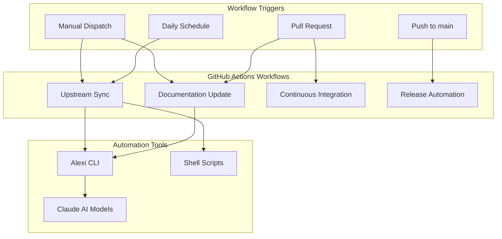
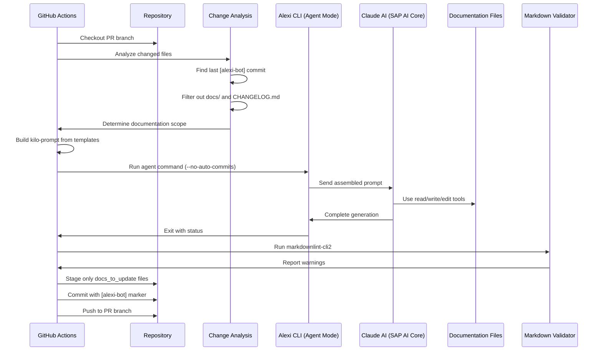
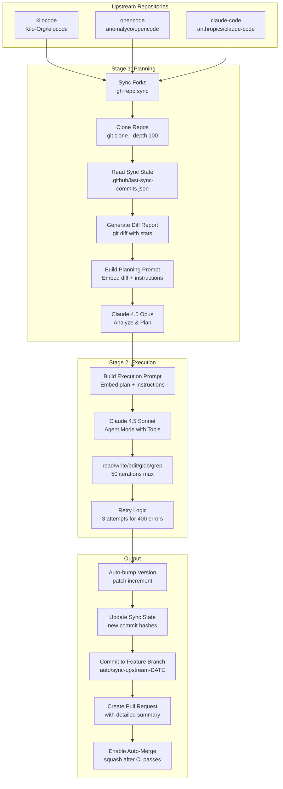

# Automation and CI/CD

This document describes the GitHub Actions workflows and automation systems in the Alexi project.

## Overview

Alexi uses GitHub Actions for continuous integration, automated documentation updates, and autonomous upstream synchronization. The automation system consists of multiple workflows that handle different aspects of the development lifecycle.

## Workflow Architecture



## Workflows

### 1. Documentation Update Workflow

**File**: `.github/workflows/documentation-update.yml`

**Triggers**:
- Pull request events (opened, synchronize, reopened) to main/master branches
- Manual workflow dispatch with options:
  - `pr_number`: Target PR number (required)
  - `force_full_regeneration`: Force regeneration of all documentation (optional, default: false)

**Purpose**: Automatically generates and updates documentation based on code changes in pull requests using AI-powered analysis.

#### Workflow Architecture



#### Key Features

1. **Intelligent Scope Detection**: Analyzes changed files to determine which documentation needs updating
   - Core/CLI changes trigger `ARCHITECTURE.md` and `API.md` updates
   - Routing changes (`src/core/router`, `src/config/routing`) trigger `ROUTING.md` updates
   - Provider changes trigger `PROVIDERS.md` updates
   - Workflow/script changes trigger `AUTOMATION.md` updates
   - Always updates `CHANGELOG.md` (repository root) and `docs/CONTRIBUTING.md`

2. **Smart Change Detection**: Avoids redundant documentation regeneration
   - Searches for last commit with `[alexi-bot]` marker using `git log --grep`
   - Compares changes since last documentation commit (not base branch)
   - Filters out documentation files from change analysis
   - Skips workflow if no code changes detected

3. **Modular Prompt Assembly**: Builds documentation prompt from template files
   - Base templates: `01-header.md` through `08-footer.md`
   - Conditional sections based on changed modules (e.g., `07-conditional/automation.md`)
   - Injects change analysis, commit history, and diff previews
   - Prevents truncation with 500-line limits and truncation warnings

4. **AI-Powered Generation**: Uses Claude AI models through Alexi CLI agent mode
   - Runs with `--auto-route` and `--effort high` for quality
   - Maximum 30 iterations for complex documentation tasks
   - Enabled tools: `read`, `write`, `edit`, `glob`, `grep`
   - Uses `--no-auto-commits` flag to let workflow handle git operations

5. **Validation and Quality Control**:
   - Runs `markdownlint-cli2` on generated documentation
   - Reports validation warnings in PR comments
   - Uploads full bot output and validation logs as artifacts

6. **Safe Git Operations**:
   - Stages only files listed in `docs_to_update` scope
   - Never stages unmanaged or unintended files
   - Commits with `[skip ci] [alexi-bot]` markers
   - Pushes only if local HEAD differs from remote

#### Workflow Steps

**Step 1: Determine PR Context**
- Extracts PR number from event or manual input
- Fetches PR branch name via GitHub API
- Checkouts PR branch with full history

**Step 2: Analyze Changed Files**
```bash
# Find last documentation commit
LAST_DOC_COMMIT=$(git log --oneline --grep="\\[alexi-bot\\]" -1 --format="%H")

# Get changes since last doc commit (or base branch if none)
CHANGED_FILES=$(git diff --name-only "$LAST_CODE_COMMIT"...HEAD -- ':!docs/' ':!CHANGELOG.md')

# Filter out documentation files
CHANGED_FILES=$(echo "$CHANGED_FILES" | grep -v -E '^(docs/|CHANGELOG\.md$)')
```

**Step 3: Determine Documentation Scope**
- Maps changed files to documentation targets
- Outputs full relative paths (e.g., `docs/ARCHITECTURE.md`)
- Clarifies `CHANGELOG.md` location (repository root, not `docs/`)
- Always includes `CHANGELOG.md` and `docs/CONTRIBUTING.md`

**Step 4: Build Kilo Prompt**
- Assembles modular templates from `.github/templates/`
- Injects change analysis, commits, and diffs
- Adds conditional sections based on changed modules
- Produces final prompt file: `kilo-prompt.md`

**Step 5: Run Alexi Agent**
```bash
node dist/cli/program.js agent \
  --message-file kilo-prompt.md \
  --auto-route \
  --effort high \
  --max-iterations 30 \
  --tools "read,write,edit,glob,grep" \
  --workdir "$(pwd)" \
  --verbose \
  --no-auto-commits \
  --system "$SYSTEM_PROMPT"
```

**Step 6: Validate Generated Documentation**
```bash
npx --yes markdownlint-cli2 $EXISTING_DOCS
```

**Step 7: Commit and Push**
```bash
# Stage only intended files
for f in $DOCS_TO_UPDATE; do
  [ -f "$f" ] && git add "$f"
done

# Commit if changes exist
git commit -m "docs: auto-generate documentation [skip ci] [alexi-bot]"

# Push if local differs from remote
git push origin "$BRANCH"
```

#### Environment Variables

```bash
AICORE_SERVICE_KEY      # SAP AI Core service credentials (JSON)
AICORE_RESOURCE_GROUP   # SAP AI Core resource group ID
GITHUB_TOKEN            # Automatically provided by GitHub Actions
```

#### Documentation Scope Mapping

| Changed Files Pattern | Documentation Updated |
|-----------------------|----------------------|
| `src/cli/`, `src/core/` | `docs/ARCHITECTURE.md`, `docs/API.md` |
| `src/core/router`, `src/config/routing` | `docs/ROUTING.md` |
| `src/providers/` | `docs/PROVIDERS.md` |
| `*.json`, `.env*` | `docs/CONFIGURATION.md` |
| `*.test.ts`, `*.spec.ts` | `docs/TESTING.md` |
| `.github/workflows/`, `scripts/` | `docs/AUTOMATION.md` |
| All changes | `CHANGELOG.md`, `docs/CONTRIBUTING.md` |

#### Template Structure

Templates are stored in `.github/templates/`:

```
.github/templates/
├── 01-header.md                    # Project overview and context
├── 02-changed-files-header.md      # Changed files section header
├── 03-commits-header.md            # Commit history section header
├── 04-diff-header.md               # Code diff section header
├── 05-scope-header.md              # Documentation scope header
├── 06-requirements.md              # General documentation requirements
├── 07-conditional/                 # Module-specific requirements
│   ├── architecture-api.md
│   ├── routing.md
│   ├── providers.md
│   ├── configuration.md
│   ├── testing.md
│   ├── automation.md
│   └── changelog-contributing.md
└── 08-footer.md                    # Output format instructions
```

#### Artifact Uploads

The workflow uploads the following artifacts (retained for 30 days):
- `analysis.md` - File change analysis
- `scope.md` - Documentation scope determination
- `commits.md` - Commit history
- `diff.md` - Code diff summary
- `kilo-prompt.md` - Assembled prompt sent to AI
- `bot-output.log` - Full agent execution log
- `validation.log` - Markdown validation results

#### PR Comments

The workflow posts status comments to the PR:

**Success Comment**:
- Documentation scope
- Changed files analysis
- Validation warnings (if any)
- Next steps checklist

**Skip Comment**:
- Posted when no code changes detected
- Indicates documentation is already up-to-date

**Failure Comment**:
- Error details from bot output
- Manual documentation checklist
- Retry instructions

### 2. Upstream Sync Workflow

**File**: `.github/workflows/sync-upstream.yml`

**Triggers**:
- Daily schedule at 06:00 UTC
- Manual workflow dispatch with options:
  - `dry_run`: Analyze changes without creating PR (default: false)
  - `force_sync`: Sync even if no changes detected (default: false)

**Purpose**: Automatically synchronizes changes from upstream AI coding assistant repositories (kilocode, opencode, claude-code) and applies relevant updates to Alexi.

#### Upstream Repositories

| Repository | Purpose | Sync Source |
|------------|---------|-------------|
| kilocode | AI coding assistant patterns | Kilo-Org/kilocode |
| opencode | Open source coding patterns | anomalyco/opencode |
| claude-code | Anthropic Claude patterns | anthropics/claude-code |

#### Workflow Architecture



#### Two-Stage Sync Process

**Stage 1: Planning with Claude 4.5 Opus**

1. **Fork Synchronization**: Uses `gh repo sync` to update ausard forks from upstream
2. **State Management**: Reads `.github/last-sync-commits.json` to get previous sync commits
3. **Diff Generation**: Creates comprehensive diff report with:
   - Commits since last sync
   - Changed files statistics
   - Detailed code diffs for TypeScript, JavaScript, JSON files
4. **AI Planning**: Claude 4.5 Opus analyzes changes and produces detailed update plan:
   ```markdown
   # Update Plan for Alexi
   
   ## Summary
   - Total changes planned: X
   - Critical: X | High: X | Medium: X | Low: X
   
   ## Changes
   
   ### 1. [Brief description]
   **File**: `src/path/to/file.ts`
   **Priority**: high
   **Type**: feature | bugfix | security | refactor
   **Reason**: [Why this change is needed]
   
   **Current code**:
   ```typescript
   // existing code
   ```
   
   **New code**:
   ```typescript
   // code to add or replace with
   ```
   ```

**Stage 2: Execution with Claude 4.5 Sonnet (Agent Mode)**

1. **Execution Prompt**: Embeds generated plan with execution instructions
2. **Agentic Mode**: Runs Alexi CLI with tool execution enabled:
   ```bash
   node dist/cli/program.js agent \
     --message-file .github/prompts/execution-prompt.md \
     --model "anthropic--claude-4.5-sonnet" \
     --max-iterations 50 \
     --tools "read,write,edit,glob,grep" \
     --workdir "$(pwd)" \
     --verbose \
     --no-auto-commits \
     --no-dirty-commits \
     --system "$SYSTEM_PROMPT"
   ```
3. **Retry Logic**: Attempts up to 3 times to handle transient SAP AI Core 400 errors
4. **Debug Mode**: Sets `ALEXI_DEBUG_MESSAGES=1` for diagnostic output
5. **Tool Operations**: AI uses tools to:
   - Read existing files before modifying
   - Write new files
   - Edit existing files with exact string replacement
   - Search for relevant code with glob/grep

**Stage 3: PR Creation and Version Bump**

1. **Version Increment**: Automatically bumps patch version (e.g., 0.1.8 → 0.1.9)
2. **Sync State Update**: Updates `.github/last-sync-commits.json` with new commit hashes
3. **Feature Branch**: Creates dated branch `auto/sync-upstream-YYYY-MM-DD-runN`
4. **Detailed PR**: Creates pull request with:
   - Version bump information
   - Diff statistics
   - AI execution summary
   - Repository comparison table
   - Link to generated plan file
5. **Auto-Merge**: Enables squash auto-merge (via separate workflow) after CI passes

#### Sync State Management

The workflow maintains sync state in `.github/last-sync-commits.json`:

```json
{
  "kilocode": {
    "last_synced_commit": "abc123...",
    "last_synced_at": "2024-01-15T06:00:00Z",
    "upstream": "Kilo-Org/kilocode",
    "fork": "ausard/kilocode"
  },
  "opencode": {
    "last_synced_commit": "def456...",
    "last_synced_at": "2024-01-15T06:00:00Z",
    "upstream": "anomalyco/opencode",
    "fork": "ausard/opencode"
  },
  "claude-code": {
    "last_synced_commit": "ghi789...",
    "last_synced_at": "2024-01-15T06:00:00Z",
    "upstream": "anthropics/claude-code",
    "fork": "direct-clone"
  },
  "metadata": {
    "version": "1.1.0",
    "workflow_run": "12345678",
    "description": "Tracks last synced commits from upstream repositories"
  }
}
```

#### File Mapping Strategy

The planning prompt instructs Opus to map upstream changes to Alexi structure:

| Upstream Change Type | Alexi Target |
|---------------------|--------------|
| Tool system changes | `src/tool/` |
| Agent system changes | `src/agent/` |
| Permission system changes | `src/permission/` |
| Event bus changes | `src/bus/` |
| Core orchestration changes | `src/core/` |
| Provider changes | `src/providers/` |
| Router changes | `src/router/` |
| CLI changes | `src/cli/` |

#### Safety Mechanisms

1. **SAP AI Core Compatibility**: Planning prompt explicitly requires maintaining SAP integration
2. **Existing Customizations**: Instructions to preserve SAP-specific code
3. **Priority-Based Execution**: Critical and high-priority changes executed first
4. **No Direct Master Push**: Always creates feature branch and PR
5. **CI Validation**: Auto-merge only after all checks pass
6. **Dry Run Mode**: Test sync process without making changes

#### Dry Run Mode

Manual trigger with `dry_run: true`:
- Analyzes all upstream changes
- Generates update plan
- Shows proposed changes in workflow logs
- Does NOT create pull request
- Does NOT commit any changes
- Useful for testing and validation

#### Environment Variables

```bash
AICORE_SERVICE_KEY      # SAP AI Core service credentials (JSON)
AICORE_RESOURCE_GROUP   # SAP AI Core resource group ID
GH_PAT                  # GitHub Personal Access Token (for cross-repo sync)
GITHUB_TOKEN            # Default token (automatically provided)
ALEXI_DEBUG_MESSAGES    # Set to 1 for debug output
```

#### Workflow Summary Output

The workflow generates a detailed summary with:
- Workflow parameters (dry run, force sync)
- Change detection status
- Version bump information
- PR URL and commit SHA
- Diff statistics
- Changed files list
- AI execution summary
- Two-stage process details
- Commit references table

### 3. Continuous Integration Workflow

**File**: `.github/workflows/ci.yml`

**Triggers**:
- Push to any branch
- Pull requests

**Purpose**: Runs tests, linting, and build verification.

**Steps**:
1. Checkout code
2. Set up Node.js 22
3. Install dependencies
4. Run TypeScript compiler
5. Run tests
6. Run linters

### 4. Release Workflows

**Files**: 
- `.github/workflows/release.yml`
- `.github/workflows/tag-release.yml`
- `.github/workflows/on-release-merge.yml`

**Purpose**: Automate version bumping, changelog generation, and release publishing.

## GitHub Secrets Required

The automation workflows require the following secrets to be configured in the repository settings:

| Secret | Purpose | Required For |
|--------|---------|--------------|
| `AICORE_SERVICE_KEY` | SAP AI Core authentication | Documentation Update, Upstream Sync |
| `AICORE_RESOURCE_GROUP` | SAP AI Core resource group | Documentation Update, Upstream Sync |
| `GH_PAT` | GitHub Personal Access Token | Upstream Sync (cross-repo operations) |
| `GITHUB_TOKEN` | Default GitHub token | All workflows (automatically provided) |

### Setting Up Secrets

1. Navigate to repository Settings > Secrets and variables > Actions
2. Click "New repository secret"
3. Add each required secret with appropriate values

#### AICORE_SERVICE_KEY Format

The service key should be a JSON string containing SAP AI Core credentials:

```json
{
  "clientid": "your-client-id",
  "clientsecret": "your-client-secret",
  "url": "https://your-auth-url",
  "serviceurls": {
    "AI_API_URL": "https://your-ai-api-url"
  }
}
```

#### GH_PAT Permissions

The Personal Access Token needs the following permissions:
- `repo` (full control of private repositories)
- `workflow` (update GitHub Actions workflows)

## Local Development Scripts

### Sync Upstream Script

**File**: `scripts/sync-upstream.sh`

Local version of the upstream sync workflow for development and testing.

**Usage**:
```bash
./scripts/sync-upstream.sh [OPTIONS]

Options:
  --dry-run           Analyze changes without applying
  --kilocode-dir DIR  Path to kilocode repository
  --opencode-dir DIR  Path to opencode repository
  --verbose           Enable verbose output
```

### Generate Diff Report Script

**File**: `scripts/generate-diff-report.sh`

Generates detailed diff reports comparing upstream repositories.

**Usage**:
```bash
./scripts/generate-diff-report.sh \
  --kilocode-dir ../kilocode \
  --opencode-dir ../opencode \
  --last-sync .github/last-sync-commits.json \
  --format markdown \
  --output diff-report.md
```

## Agentic File Operations

The automation system leverages Alexi's agentic capabilities with automatic permission management:

### Permission Configuration

In agentic mode, the tool system automatically configures high-priority permission rules:

```typescript
// Automatic write permissions for workdir
{
  id: 'agentic-allow-write',
  priority: 200,
  description: 'Allow writing files in workdir for agentic mode',
  actions: ['write'],
  paths: ['<workdir>/**'],
  decision: 'allow'
}

// Automatic execute permissions
{
  id: 'agentic-allow-execute',
  priority: 200,
  description: 'Allow executing commands for agentic mode',
  actions: ['execute'],
  decision: 'allow'
}
```

### Tool Context Resolution

The `write` and `edit` tools support relative path resolution:

```typescript
// tools/write.ts and tools/edit.ts
permission: {
  action: 'write',
  getResource: (params, context) => {
    // Resolve relative paths to absolute using workdir
    if (path.isAbsolute(params.filePath)) {
      return params.filePath;
    }
    return path.join(context?.workdir || process.cwd(), params.filePath);
  }
}
```

This enhancement allows the AI agent to:
- Work with relative file paths naturally
- Respect workdir boundaries for permission checks
- Operate autonomously within the project directory
- Support external directory operations when explicitly allowed

## Workflow Maintenance

### Updating Workflows

1. Edit workflow YAML files in `.github/workflows/`
2. Test changes using manual workflow dispatch
3. Commit and push changes
4. Workflow changes automatically trigger `AUTOMATION.md` update

### Debugging Workflows

1. Check workflow run logs in GitHub Actions tab
2. Use workflow dispatch with verbose flags
3. Review generated reports in `.github/reports/`
4. Check sync state in `.github/last-sync-commits.json`
5. Download artifacts for detailed analysis

### Common Issues

**Issue**: Documentation update fails with permission error  
**Solution**: Verify `AICORE_SERVICE_KEY` and `AICORE_RESOURCE_GROUP` secrets are set correctly

**Issue**: Upstream sync creates no PR  
**Solution**: Check if upstream repositories have new commits since last sync in `.github/last-sync-commits.json`

**Issue**: AI agent makes incorrect changes  
**Solution**: Review generated plan in `.github/reports/update-plan-*.md` and adjust prompts in `.github/templates/`

**Issue**: Workflow skips documentation generation  
**Solution**: Ensure code changes exist outside of `docs/` and `CHANGELOG.md` directories

**Issue**: SAP AI Core returns 400 errors  
**Solution**: Workflow retries up to 3 times automatically; check `ALEXI_DEBUG_MESSAGES` output in logs

## Best Practices

1. **Always test workflow changes**: Use manual dispatch with dry-run mode first
2. **Review AI-generated changes**: Check PR diffs before merging
3. **Keep secrets updated**: Rotate credentials regularly
4. **Monitor workflow costs**: Claude API usage is tracked in SAP AI Core
5. **Document workflow modifications**: Update this file when changing workflows
6. **Use artifacts for debugging**: Download workflow artifacts for detailed analysis
7. **Validate generated documentation**: Check markdown linting warnings in PR comments
8. **Maintain template consistency**: Keep `.github/templates/` files synchronized with requirements

## Future Enhancements

Planned improvements to the automation system:

- [ ] Support for additional upstream repositories
- [ ] Configurable sync schedules per repository
- [ ] Automated testing of synced changes before PR creation
- [ ] Slack/Teams notifications for sync results
- [ ] Rollback mechanism for failed syncs
- [ ] Metrics dashboard for sync success rates
- [ ] Parallel processing for multiple upstream sources
- [ ] Smart conflict resolution for overlapping changes
- [ ] Cost optimization for AI API usage
- [ ] Documentation quality scoring
