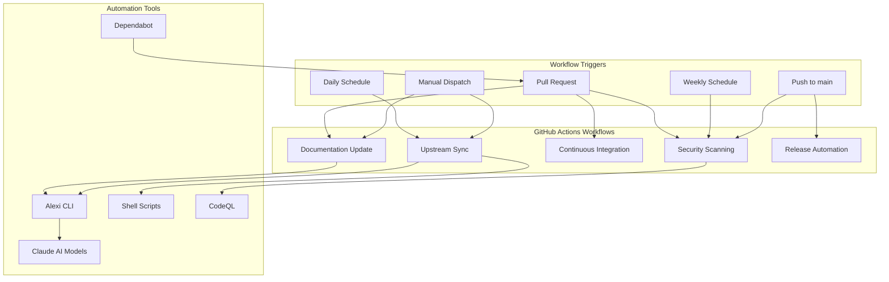
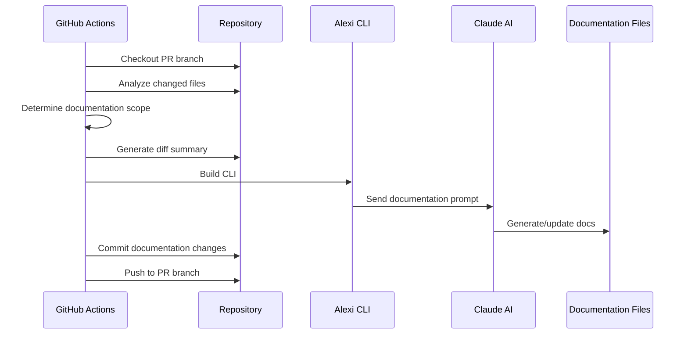
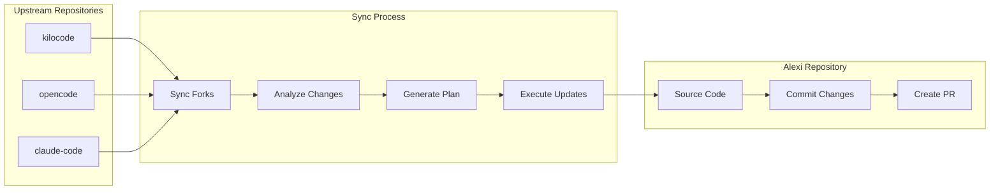
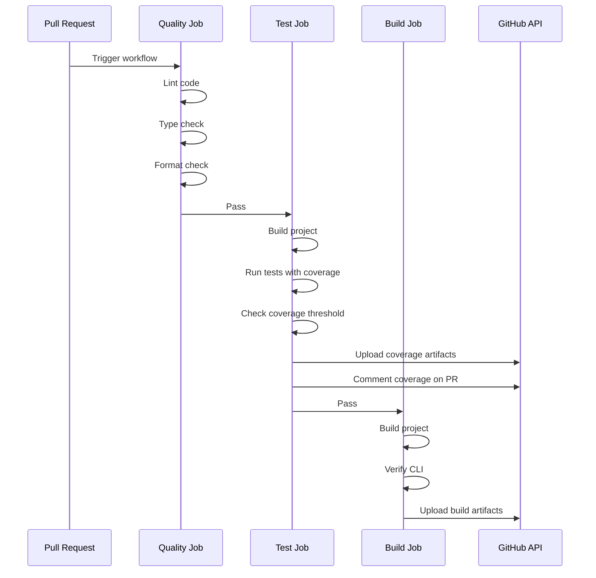
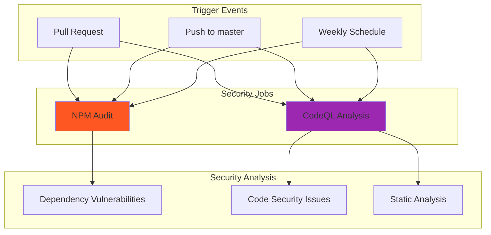
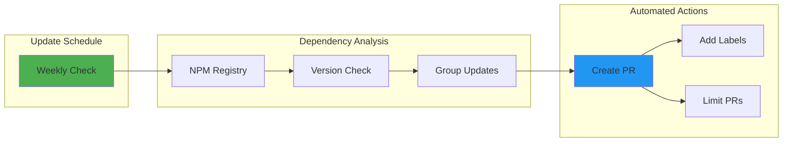

# Automation and CI/CD

This document describes the GitHub Actions workflows and automation systems in the Alexi project.

## Overview

Alexi uses GitHub Actions for continuous integration, automated documentation updates, and autonomous upstream synchronization. The automation system consists of multiple workflows that handle different aspects of the development lifecycle.

## Workflow Architecture



## Workflows

### 1. Documentation Update Workflow

**File**: `.github/workflows/documentation-update.yml`

**Triggers**:
- Pull request events (opened, synchronize, reopened)
- Manual workflow dispatch with PR number

**Purpose**: Automatically generates and updates documentation based on code changes in pull requests.

#### Workflow Steps



#### Key Features

1. **Intelligent Scope Detection**: Analyzes changed files to determine which documentation needs updating
   - Core/CLI changes trigger `ARCHITECTURE.md` and `API.md` updates
   - Routing changes trigger `ROUTING.md` updates
   - Provider changes trigger `PROVIDERS.md` updates
   - Workflow/script changes trigger `AUTOMATION.md` updates
   - Always updates `CHANGELOG.md` and `CONTRIBUTING.md`

2. **Code Analysis**: Generates detailed analysis including:
   - Changed file list with categorization
   - Commit history since last documentation update
   - Code diff statistics
   - TypeScript and configuration change previews

3. **AI-Powered Generation**: Uses Claude AI models through Alexi CLI to:
   - Analyze code changes
   - Update documentation with accurate technical details
   - Generate Mermaid diagrams
   - Maintain consistent documentation style

4. **Force Regeneration**: Manual trigger option to regenerate all documentation

#### Environment Variables

```bash
AICORE_SERVICE_KEY      # SAP AI Core service credentials
AICORE_RESOURCE_GROUP   # SAP AI Core resource group ID
```

#### Configuration

The workflow determines documentation scope based on file patterns:

| Pattern | Documentation Triggered |
|---------|------------------------|
| `src/cli/**`, `src/core/**` | ARCHITECTURE.md, API.md |
| `src/router/**`, `routing-config.json` | ROUTING.md |
| `src/providers/**` | PROVIDERS.md |
| `*.json`, `.env*` | CONFIGURATION.md |
| `*.test.ts`, `*.spec.ts` | TESTING.md |
| `.github/workflows/**`, `scripts/**` | AUTOMATION.md |
| All changes | CHANGELOG.md, CONTRIBUTING.md |

### 2. Upstream Sync Workflow

**File**: `.github/workflows/sync-upstream.yml`

**Triggers**:
- Daily schedule at 06:00 UTC
- Manual workflow dispatch with options:
  - `dry_run`: Analyze changes without creating PR
  - `force_sync`: Sync even if no changes detected

**Purpose**: Automatically synchronizes changes from upstream AI coding assistant repositories (kilocode, opencode, claude-code) and applies relevant updates to Alexi.

#### Upstream Repositories

| Repository | Purpose | Sync Source |
|------------|---------|-------------|
| kilocode | AI coding assistant patterns | Kilo-Org/kilocode |
| opencode | Open source coding patterns | anomalyco/opencode |
| claude-code | Anthropic Claude patterns | anthropics/claude-code |

#### Workflow Architecture



#### Sync Process

The upstream sync workflow follows a sophisticated two-stage AI-powered process:

**Stage 1: Planning (Claude 4.5 Opus)**
1. Clone upstream repositories
2. Read previous sync state from `.github/last-sync-commits.json`
3. Generate diff report comparing current vs last synced commits
4. Use Claude 4.5 Opus to analyze changes and create detailed update plan
5. Plan includes:
   - Critical, high, medium, and low priority changes
   - Exact code snippets and modifications
   - SAP AI Core compatibility considerations
   - File-by-file change instructions

**Stage 2: Execution (Claude 4.5 Sonnet with Tools)**
1. Read the generated update plan
2. Use agentic mode with enabled tools:
   - `read`: Examine existing files
   - `write`: Create new files
   - `edit`: Modify existing files with exact string replacement
   - `glob`: Find files by pattern
   - `grep`: Search file contents
3. Execute changes in priority order
4. Maximum 50 iterations for complex updates
5. Generate execution summary

**Stage 3: PR Creation**
1. Commit all changes made by the AI agent
2. Update `.github/last-sync-commits.json` with new commit hashes
3. Create pull request with:
   - Detailed description of upstream changes
   - Links to upstream commits
   - Diff report attachment
   - Auto-merge enabled for trusted updates

#### Sync State Management

The workflow maintains sync state in `.github/last-sync-commits.json`:

```json
{
  "kilocode": {
    "last_synced_commit": "abc123...",
    "last_sync_date": "2024-01-15T06:00:00Z"
  },
  "opencode": {
    "last_synced_commit": "def456...",
    "last_sync_date": "2024-01-15T06:00:00Z"
  },
  "claude-code": {
    "last_synced_commit": "ghi789...",
    "last_sync_date": "2024-01-15T06:00:00Z"
  }
}
```

#### Auto-Merge Behavior

The workflow automatically merges PRs when:
- All CI checks pass
- Changes are from trusted upstream sources
- No merge conflicts exist
- PR is properly labeled with `upstream-sync`

#### Dry Run Mode

Manual trigger with `dry_run: true` will:
- Analyze all upstream changes
- Generate update plan
- Show proposed changes in workflow logs
- NOT create a pull request
- NOT commit any changes

### 3. Continuous Integration Workflow

**File**: `.github/workflows/ci.yml`

**Triggers**:
- Push to main/master branches
- Pull requests to main/master branches

**Purpose**: Runs tests, linting, build verification, and coverage reporting.

#### CI Architecture



#### Jobs

**Quality Job**:
1. Checkout code
2. Setup Node.js 22
3. Install dependencies
4. Run ESLint
5. Run TypeScript type checking
6. Run Prettier format check

**Test Job** (depends on Quality):
1. Checkout code
2. Setup Node.js 22
3. Install dependencies
4. Build project
5. Run tests with coverage collection
6. Upload coverage report (14-day retention)
7. Check coverage threshold (40% minimum)
8. Comment coverage report on PR (updates existing comment)

**Build Job** (depends on Quality and Test):
1. Checkout code
2. Setup Node.js 22
3. Install dependencies
4. Build project
5. Verify CLI functionality
6. Upload build artifacts (7-day retention)

#### Coverage Reporting

The CI workflow includes intelligent coverage reporting:

```yaml
- name: Check coverage threshold
  run: |
    COVERAGE=$(cat coverage/coverage-summary.json | jq '.total.lines.pct')
    THRESHOLD=40
    echo "Current coverage: $COVERAGE%"
    echo "Threshold: $THRESHOLD%"
    if (( $(echo "$COVERAGE < $THRESHOLD" | bc -l) )); then
      echo "::error::Coverage ($COVERAGE%) is below threshold ($THRESHOLD%)"
      exit 1
    fi
    echo "Coverage check passed!"

- name: Comment coverage on PR
  if: github.event_name == 'pull_request' && always()
  uses: actions/github-script@v7
  continue-on-error: true
```

Features:
- Automatic threshold validation
- PR comment with coverage metrics
- Updates existing comments instead of creating duplicates
- Continues on error to prevent workflow failures
- Includes detailed coverage breakdown

### 4. Security Scanning Workflow

**File**: `.github/workflows/security.yml`

**Triggers**:
- Push to master branch
- Pull requests to master branch
- Weekly schedule (Sunday at 00:00 UTC)

**Purpose**: Automated security scanning for vulnerabilities and code quality issues.

#### Security Workflow Architecture



#### Jobs

**NPM Audit Job**:
1. Checkout code
2. Setup Node.js 22
3. Install dependencies
4. Run npm audit with high severity threshold
5. Continue on error (non-blocking)

```yaml
- name: Run npm audit
  run: npm audit --audit-level=high
  continue-on-error: true
```

**CodeQL Analysis Job**:
1. Checkout code
2. Initialize CodeQL for TypeScript
3. Autobuild project
4. Perform CodeQL analysis
5. Upload results to GitHub Security tab

```yaml
- name: Initialize CodeQL
  uses: github/codeql-action/init@v3
  with:
    languages: typescript

- name: Perform CodeQL Analysis
  uses: github/codeql-action/analyze@v3
```

#### Security Features

- **Dependency Scanning**: Identifies known vulnerabilities in npm packages
- **Code Analysis**: Detects security issues in TypeScript code
- **SAST**: Static application security testing for common vulnerabilities
- **Weekly Scans**: Automated scheduled scans for new vulnerabilities
- **Security Events**: Results visible in GitHub Security tab
- **Non-blocking**: Does not fail builds on security issues

### 5. Dependabot Configuration

**File**: `.github/dependabot.yml`

**Purpose**: Automated dependency updates with grouped pull requests.

#### Dependabot Architecture



#### Configuration

```yaml
version: 2
updates:
  - package-ecosystem: "npm"
    directory: "/"
    schedule:
      interval: "weekly"
    open-pull-requests-limit: 10
    labels:
      - "dependencies"
    groups:
      dev-dependencies:
        patterns:
          - "@types/*"
          - "eslint*"
          - "typescript*"
          - "vitest*"
```

#### Features

- **Weekly Updates**: Checks for dependency updates every week
- **Grouped Updates**: Combines related dependencies into single PRs
  - TypeScript types (`@types/*`)
  - ESLint packages (`eslint*`)
  - TypeScript compiler (`typescript*`)
  - Vitest testing framework (`vitest*`)
- **PR Limit**: Maximum 10 open PRs to avoid noise
- **Auto-labeling**: Adds `dependencies` label to all PRs
- **Smart Grouping**: Reduces PR overhead by grouping dev dependencies

#### Dependency Groups

**Dev Dependencies Group**:
- All TypeScript type definitions
- ESLint and related plugins
- TypeScript compiler updates
- Vitest testing framework updates

This grouping strategy:
- Reduces review overhead
- Ensures compatible versions
- Simplifies testing of related updates
- Maintains clean PR history

### 6. Release Workflows

**Files**: 
- `.github/workflows/release.yml`
- `.github/workflows/tag-release.yml`
- `.github/workflows/on-release-merge.yml`

**Purpose**: Automate version bumping, changelog generation, and release publishing.

## GitHub Secrets Required

The automation workflows require the following secrets to be configured in the repository settings:

| Secret | Purpose | Required For |
|--------|---------|--------------|
| `AICORE_SERVICE_KEY` | SAP AI Core authentication | Documentation Update, Upstream Sync |
| `AICORE_RESOURCE_GROUP` | SAP AI Core resource group | Documentation Update, Upstream Sync |
| `GH_PAT` | GitHub Personal Access Token | Upstream Sync (cross-repo operations) |
| `GITHUB_TOKEN` | Default GitHub token | All workflows (automatically provided) |

### Permissions Required

The workflows require specific GitHub permissions:

| Workflow | Permissions |
|----------|-------------|
| CI | `contents: read`, `pull-requests: write` |
| Security | `contents: read`, `security-events: write` |
| Documentation Update | `contents: write`, `pull-requests: write` |
| Upstream Sync | `contents: write`, `pull-requests: write` |

### Setting Up Secrets

1. Navigate to repository Settings > Secrets and variables > Actions
2. Click "New repository secret"
3. Add each required secret with appropriate values

#### AICORE_SERVICE_KEY Format

The service key should be a JSON string containing SAP AI Core credentials:

```json
{
  "clientid": "your-client-id",
  "clientsecret": "your-client-secret",
  "url": "https://your-auth-url",
  "serviceurls": {
    "AI_API_URL": "https://your-ai-api-url"
  }
}
```

#### GH_PAT Permissions

The Personal Access Token needs the following permissions:
- `repo` (full control of private repositories)
- `workflow` (update GitHub Actions workflows)

## Local Development Scripts

### Sync Upstream Script

**File**: `scripts/sync-upstream.sh`

Local version of the upstream sync workflow for development and testing.

**Usage**:
```bash
./scripts/sync-upstream.sh [OPTIONS]

Options:
  --dry-run           Analyze changes without applying
  --kilocode-dir DIR  Path to kilocode repository
  --opencode-dir DIR  Path to opencode repository
  --verbose           Enable verbose output
```

### Generate Diff Report Script

**File**: `scripts/generate-diff-report.sh`

Generates detailed diff reports comparing upstream repositories.

**Usage**:
```bash
./scripts/generate-diff-report.sh \
  --kilocode-dir ../kilocode \
  --opencode-dir ../opencode \
  --last-sync .github/last-sync-commits.json \
  --format markdown \
  --output diff-report.md
```

## Agentic File Operations

The automation system leverages Alexi's agentic capabilities with automatic permission management:

### Permission Configuration

In agentic mode, the tool system automatically configures high-priority permission rules:

```typescript
// Automatic write permissions for workdir
{
  id: 'agentic-allow-write',
  priority: 200,
  description: 'Allow writing files in workdir for agentic mode',
  actions: ['write'],
  paths: ['<workdir>/**'],
  decision: 'allow'
}

// Automatic execute permissions
{
  id: 'agentic-allow-execute',
  priority: 200,
  description: 'Allow executing commands for agentic mode',
  actions: ['execute'],
  decision: 'allow'
}
```

### Tool Context Resolution

The `write` and `edit` tools now support relative path resolution:

```typescript
// tools/write.ts and tools/edit.ts
permission: {
  action: 'write',
  getResource: (params, context) => {
    // Resolve relative paths to absolute using workdir
    if (path.isAbsolute(params.filePath)) {
      return params.filePath;
    }
    return path.join(context?.workdir || process.cwd(), params.filePath);
  }
}
```

This enhancement allows the AI agent to:
- Work with relative file paths naturally
- Respect workdir boundaries for permission checks
- Operate autonomously within the project directory
- Support external directory operations when explicitly allowed

## Workflow Maintenance

### Updating Workflows

1. Edit workflow YAML files in `.github/workflows/`
2. Test changes using manual workflow dispatch
3. Commit and push changes
4. Workflow changes automatically trigger `AUTOMATION.md` update

### Debugging Workflows

1. Check workflow run logs in GitHub Actions tab
2. Use workflow dispatch with verbose flags
3. Review generated reports in `.github/reports/`
4. Check sync state in `.github/last-sync-commits.json`

### Common Issues

**Issue**: Documentation update fails with permission error
**Solution**: Verify `AICORE_SERVICE_KEY` and `AICORE_RESOURCE_GROUP` secrets are set correctly

**Issue**: Upstream sync creates no PR
**Solution**: Check if upstream repositories have new commits since last sync

**Issue**: AI agent makes incorrect changes
**Solution**: Review generated plan in `.github/reports/update-plan-*.md` and adjust prompts

## Best Practices

1. **Always test workflow changes**: Use manual dispatch with dry-run mode first
2. **Review AI-generated changes**: Check PR diffs before merging
3. **Keep secrets updated**: Rotate credentials regularly
4. **Monitor workflow costs**: Claude API usage is tracked in SAP AI Core
5. **Document workflow modifications**: Update this file when changing workflows
6. **Review security scan results**: Check GitHub Security tab regularly
7. **Update dependencies promptly**: Review and merge Dependabot PRs weekly
8. **Monitor coverage trends**: Ensure test coverage does not decrease over time
9. **Validate CI changes locally**: Test build and test commands before pushing
10. **Use continue-on-error wisely**: Only for non-critical steps like coverage comments

## Future Enhancements

Planned improvements to the automation system:

- [ ] Support for additional upstream repositories
- [ ] Configurable sync schedules per repository
- [ ] Automated testing of synced changes before PR creation
- [ ] Slack/Teams notifications for sync results
- [ ] Rollback mechanism for failed syncs
- [ ] Metrics dashboard for sync success rates
- [ ] Advanced security scanning with custom rules
- [ ] Automated security patch application
- [ ] Coverage trend analysis and reporting
- [ ] Performance regression testing in CI
- [ ] Multi-architecture build testing
- [ ] Container image scanning for deployments
