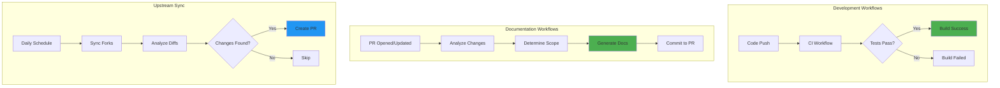
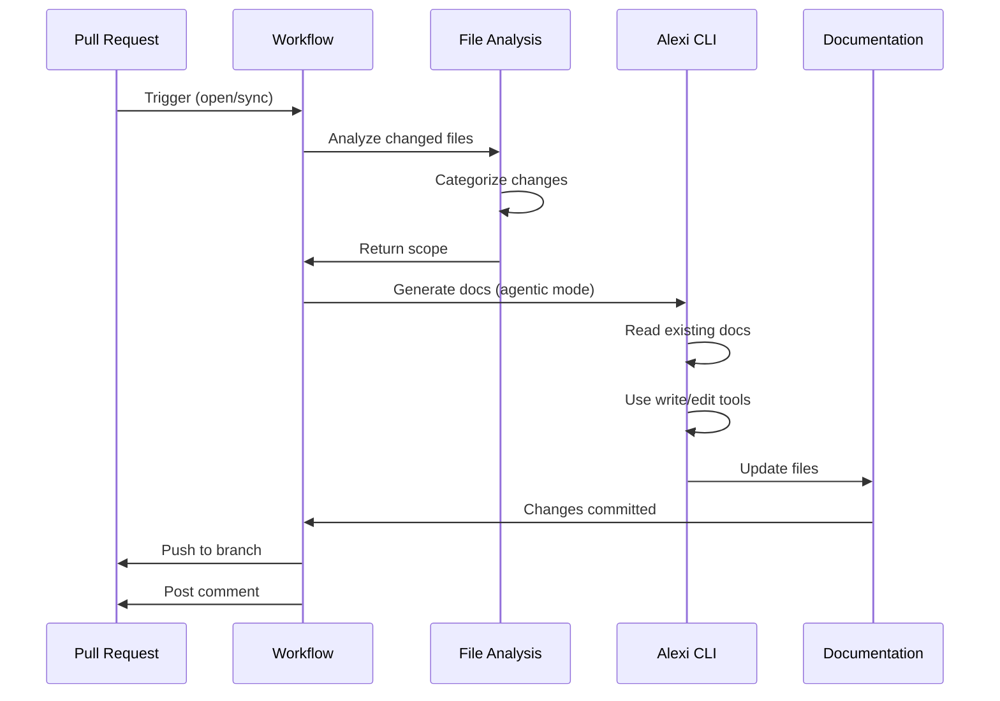
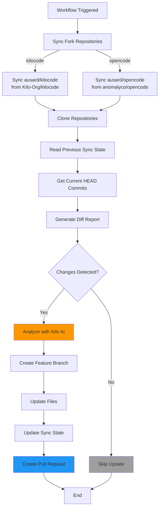

# Automation and Workflows

This document describes the automated workflows and processes in the Alexi project, including CI/CD pipelines, autonomous upstream synchronization, and automated documentation generation.

## Overview

Alexi uses GitHub Actions workflows to automate critical development and maintenance tasks. The automation system includes:

- Continuous Integration (CI) for code quality and testing
- Autonomous upstream synchronization with AI-powered analysis
- Automated documentation generation using Alexi's own CLI
- Release management and versioning
- Repository synchronization across forks

## Workflow Architecture



## GitHub Actions Workflows

### 1. Documentation Update Workflow

**File**: `.github/workflows/documentation-update.yml`

**Trigger**: 
- Pull request events (opened, synchronize, reopened)
- Manual workflow dispatch with PR number

**Purpose**: Automatically generates and updates documentation based on code changes in pull requests.

#### Workflow Steps



#### Key Features

**Intelligent Scope Detection**:
The workflow analyzes changed files and determines which documentation needs updating:

| Changed Files | Documentation Updated |
|--------------|----------------------|
| `src/cli/`, `src/core/` | `docs/ARCHITECTURE.md`, `docs/API.md` |
| `src/router/`, `src/routing/` | `docs/ROUTING.md` |
| `src/providers/` | `docs/PROVIDERS.md` |
| `package.json`, `tsconfig.json` | `docs/CONFIGURATION.md` |
| Test files | `docs/TESTING.md` |
| `.github/workflows/`, `scripts/` | `docs/AUTOMATION.md` |
| Always | `CHANGELOG.md`, `docs/CONTRIBUTING.md` |

**Agentic Documentation Generation**:
The workflow uses Alexi's own CLI in agentic mode with tool execution:

```bash
node dist/cli/program.js agent \
  --message-file kilo-prompt.md \
  --auto-route \
  --max-iterations 30 \
  --tools "read,write,edit,glob,grep" \
  --workdir "$(pwd)" \
  --verbose
```

**Skip Detection**:
The workflow intelligently skips documentation generation if:
- No code changes detected since last documentation commit
- Only documentation files were modified
- Previous documentation generation already covered the changes

#### Configuration

**Required Secrets**:
- `GITHUB_TOKEN`: Provided automatically by GitHub Actions
- `AICORE_SERVICE_KEY`: SAP AI Core service key for LLM access
- `AICORE_RESOURCE_GROUP`: SAP AI Core resource group

**Environment Variables**:
```yaml
env:
  AICORE_RESOURCE_GROUP: ${{ secrets.AICORE_RESOURCE_GROUP }}
  AICORE_SERVICE_KEY: ${{ secrets.AICORE_SERVICE_KEY }}
```

### 2. Upstream Sync Workflow

**File**: `.github/workflows/sync-upstream.yml`

**Trigger**:
- Daily schedule at 06:00 UTC
- Manual workflow dispatch with options:
  - `dry_run`: Analyze changes without creating PR
  - `force_sync`: Sync even if no changes detected

**Purpose**: Autonomously synchronizes with upstream AI coding assistant repositories (kilocode, opencode, claude-code) and creates PRs with AI-powered analysis.

#### Sync Process Flow



#### Synchronized Repositories

| Repository | Upstream | Purpose |
|-----------|----------|---------|
| `ausard/kilocode` | `Kilo-Org/kilocode` | Kilo AI coding assistant patterns |
| `ausard/opencode` | `anomalyco/opencode` | OpenCode AI patterns |
| `ausard/claude-code` | `anthropics/claude-code` | Claude Code patterns |

#### AI-Powered Analysis

The workflow uses Kilo AI to analyze upstream changes and generate integration recommendations:

**Analysis Prompt Structure**:
```markdown
# Upstream Changes Analysis

## Repository: [repo-name]
## Date Range: [last-sync] to [current-commit]

### Changed Files
[diff statistics]

### Detailed Changes
[git diff output]

### Task
Analyze these changes and provide:
1. Summary of key changes
2. Impact on Alexi orchestrator
3. Recommended integration steps
4. Potential breaking changes
```

#### Sync State Tracking

The workflow maintains sync state in `.github/last-sync-commits.json`:

```json
{
  "kilocode": {
    "last_synced_commit": "abc123...",
    "last_synced_date": "2024-01-15T06:00:00Z",
    "upstream_repo": "Kilo-Org/kilocode"
  },
  "opencode": {
    "last_synced_commit": "def456...",
    "last_synced_date": "2024-01-15T06:00:00Z",
    "upstream_repo": "anomalyco/opencode"
  },
  "claude-code": {
    "last_synced_commit": "ghi789...",
    "last_synced_date": "2024-01-15T06:00:00Z",
    "upstream_repo": "anthropics/claude-code"
  }
}
```

#### Auto-Merge Behavior

The workflow supports automatic merging of sync PRs:
- PRs are labeled with `auto-merge` if changes are low-risk
- Auto-merge is triggered only for non-breaking changes
- Breaking changes require manual review

### 3. CI Workflow

**File**: `.github/workflows/ci.yml`

**Trigger**: Push events, pull requests

**Purpose**: Validates code quality, runs tests, and ensures builds succeed.

#### CI Pipeline

- Install dependencies (`npm ci`)
- Lint TypeScript code
- Run unit tests
- Build project (`npm run build`)
- Verify CLI functionality

### 4. Release Workflows

**Files**: 
- `.github/workflows/release.yml`
- `.github/workflows/tag-release.yml`
- `.github/workflows/on-release-merge.yml`

**Purpose**: Automate version bumping, tagging, and release creation.

#### Release Process

1. **Version Bump**: Automatically increment version in `package.json`
2. **Tag Creation**: Create Git tag with version number
3. **Release Notes**: Generate release notes from commits
4. **Artifact Publishing**: Build and publish release artifacts

### 5. Repository Sync Workflow

**File**: `.github/workflows/repo-sync.yml`

**Purpose**: Synchronize repository settings and configurations across forks.

## Local Development Scripts

### Upstream Sync Script

**File**: `scripts/sync-upstream.sh`

Local script for manually syncing with upstream repositories:

```bash
#!/bin/bash
# Sync upstream changes locally

./scripts/sync-upstream.sh \
  --repo kilocode \
  --upstream Kilo-Org/kilocode \
  --branch main
```

**Usage**:
```bash
# Sync specific repository
./scripts/sync-upstream.sh --repo kilocode

# Dry run (no changes)
./scripts/sync-upstream.sh --dry-run

# Force sync even if up to date
./scripts/sync-upstream.sh --force
```

### Diff Report Generator

**File**: `scripts/generate-diff-report.sh`

Generates detailed diff reports comparing local and upstream changes:

```bash
./scripts/generate-diff-report.sh \
  --kilocode-dir ../kilocode \
  --opencode-dir ../opencode \
  --last-sync .github/last-sync-commits.json \
  --format markdown \
  --output diff-report.md
```

**Output Format**:
- Markdown report with statistics
- File-by-file change summary
- Commit history comparison
- Integration recommendations

## Kilo Prompt Templates

The documentation workflow uses modular prompt templates located in `.github/templates/`:

| Template | Purpose |
|----------|---------|
| `01-header.md` | Documentation generation task header |
| `02-changed-files-header.md` | Changed files section header |
| `03-commits-header.md` | Commit history section header |
| `04-diff-header.md` | Code diff section header |
| `05-scope-header.md` | Documentation scope header |
| `06-requirements.md` | General documentation requirements |
| `07-conditional/*.md` | Module-specific requirements |
| `08-footer.md` | Task completion instructions |

**Conditional Templates**:
- `architecture-api.md`: For CLI and core changes
- `routing.md`: For routing system changes
- `providers.md`: For provider changes
- `configuration.md`: For config changes
- `testing.md`: For test changes
- `automation.md`: For workflow changes
- `changelog-contributing.md`: Always included

## Workflow Permissions

All workflows require specific permissions configured in the workflow YAML:

```yaml
permissions:
  contents: write      # Create commits, tags
  pull-requests: write # Create and update PRs
```

## Monitoring and Debugging

### Workflow Artifacts

All workflows upload artifacts for debugging:

**Documentation Workflow Artifacts**:
- `analysis.md`: File change analysis
- `scope.md`: Documentation scope determination
- `commits.md`: Commit history
- `diff.md`: Code diff summary
- `kilo-prompt.md`: Full prompt sent to AI
- `bot-output.log`: AI generation output

**Retention**: 30 days

### Workflow Status Comments

Workflows post status comments to pull requests:

**Success Comment**:
- Documentation scope
- Changed files analysis
- Next steps for review

**Failure Comment**:
- Error details
- Manual documentation checklist
- Retry instructions

**Skip Comment**:
- Reason for skipping
- Last documentation update info

## Best Practices

### For Contributors

1. **Commit Messages**: Use conventional commit format for accurate CHANGELOG generation
2. **Documentation**: Update relevant docs when modifying code
3. **PR Description**: Provide context for AI analysis
4. **Review**: Check generated documentation for accuracy

### For Maintainers

1. **Workflow Updates**: Test workflow changes in feature branches
2. **Secret Management**: Rotate SAP AI Core credentials regularly
3. **Sync Monitoring**: Review sync PRs for breaking changes
4. **Template Updates**: Keep prompt templates in sync with documentation structure

## Troubleshooting

### Documentation Generation Fails

**Symptoms**: Workflow fails at "Run documentation generation" step

**Solutions**:
1. Check SAP AI Core credentials are valid
2. Verify model availability in resource group
3. Review bot output logs in artifacts
4. Manually trigger with `force_full_regeneration: true`

### Upstream Sync Fails

**Symptoms**: Sync workflow completes but no PR created

**Solutions**:
1. Check if upstream repositories have new commits
2. Verify GH_PAT secret has correct permissions
3. Review sync state in `.github/last-sync-commits.json`
4. Run with `force_sync: true` option

### Permission Errors

**Symptoms**: "Permission denied" errors in workflow logs

**Solutions**:
1. Verify workflow permissions in YAML
2. Check GITHUB_TOKEN has necessary scopes
3. Ensure secrets are correctly configured
4. Review repository settings for Actions permissions

## Future Enhancements

- **Multi-Model Analysis**: Use different models for different analysis tasks
- **Incremental Documentation**: Update only changed sections instead of full regeneration
- **Sync Conflict Resolution**: AI-powered merge conflict resolution
- **Performance Metrics**: Track documentation quality and sync success rates
- **Custom Workflow Triggers**: Allow documentation updates on specific file patterns
