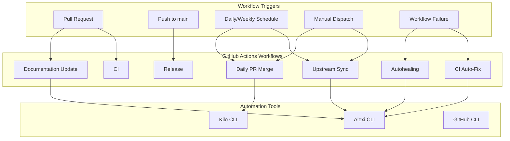
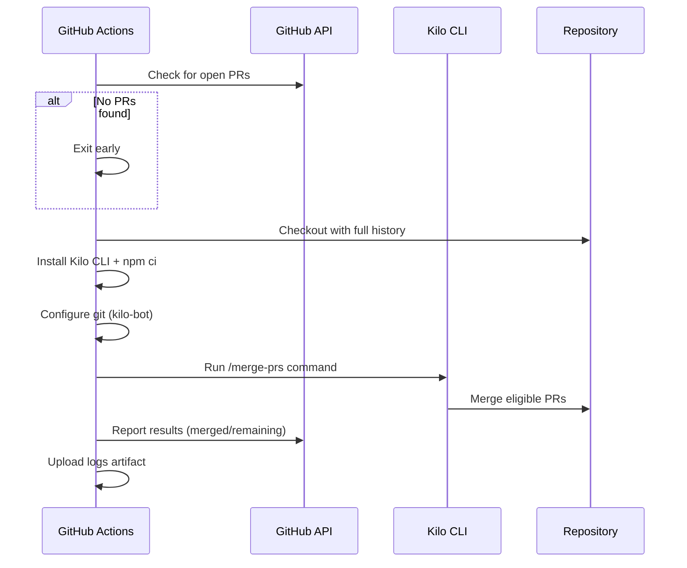
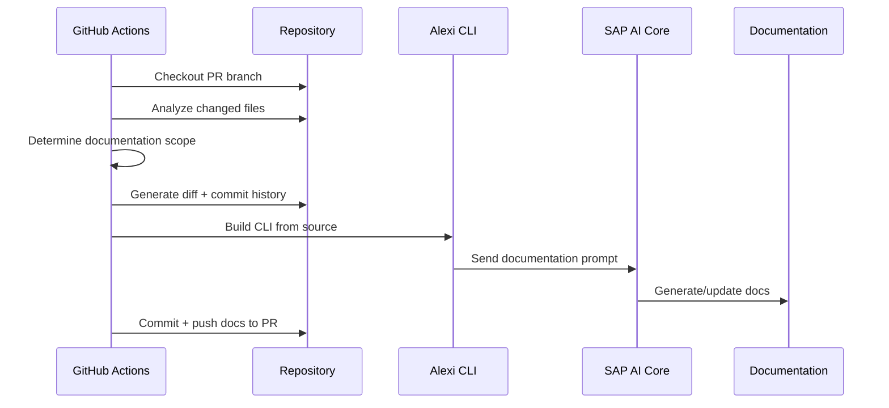
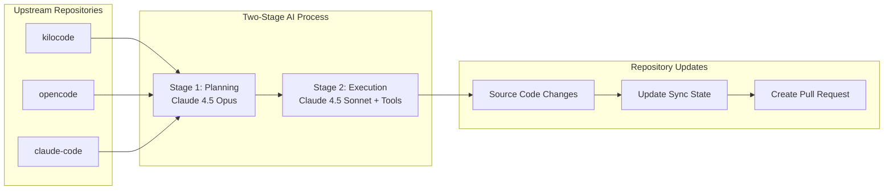
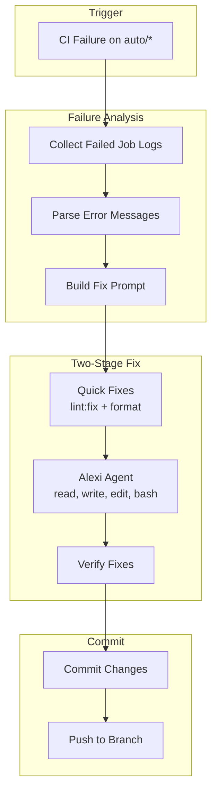

# Automation and CI/CD

This document describes the GitHub Actions workflows and automation systems in the Alexi project.

## Agent Factory (T-shape)

The agent fleet is organised as a **T-shape**: one shared baseline ("the
horizontal bar") + N role verticals + a single reusable workflow that runs
any role with consistent retry, commit, and artefact policies. Caller
workflows are thin (~30 lines of YAML each) and only carry their own
trigger + per-run context.

### Composition

```
                 ┌──────────────────────────────────────────┐
                 │   .github/prompts/baseline-system.md     │  shared by ALL agents
                 │   (tone, safety, output format)          │
                 └──────────────────────────────────────────┘
                                    +
   ┌──────────────────────────────────────────────────────────────────────┐
   │  .github/prompts/role-<vertical>.md                                  │
   │  one of: consulting | product | design | architecture | engineering  │
   │          quality    | data    | infrastructure | security | management│
   └──────────────────────────────────────────────────────────────────────┘
                                    +
                 ┌──────────────────────────────────────────┐
                 │   task_prompt   (inline string OR        │
                 │                  file:<path>)            │
                 └──────────────────────────────────────────┘
                                    │
                                    ▼
                 ┌──────────────────────────────────────────┐
                 │  .github/workflows/agent-factory.yml     │
                 │  workflow_call                           │
                 │  - validates role                        │
                 │  - composes baseline + role + task       │
                 │  - runs `kilo run` with retry budget     │
                 │  - optionally commits + pushes           │
                 │  - uploads prompt + log artefacts        │
                 └──────────────────────────────────────────┘
```

### Reusable workflow inputs

`.github/workflows/agent-factory.yml` is invoked via `workflow_call` and
accepts:

| Input              | Type    | Default  | Description                                                     |
| ------------------ | ------- | -------- | --------------------------------------------------------------- |
| `role`             | string  | required | One of the 10 role verticals (validated at runtime).            |
| `task_prompt`      | string  | required | Inline task text, or `file:<path>` to load from a repo file.    |
| `title`            | string  | required | Human-readable title displayed in the kilo run.                 |
| `timeout_minutes`  | number  | `15`     | Hard timeout for the `kilo run` step.                           |
| `commit_changes`   | boolean | `true`   | Whether the factory should `git add/commit/push` after the run. |
| `commit_scope`     | string  | `agent`  | commitlint scope for the auto-commit (must be in scope-enum).   |
| `branch`           | string  | `master` | Branch to checkout and push to. Set to a feature branch for     |
|                    |         |          | PR-style flows or to a PR head ref for review-only roles.       |

Secrets are passed via `secrets: inherit` from the caller — the factory
declares `AICORE_SERVICE_KEY` and `AICORE_RESOURCE_GROUP` as required, and
`GH_PAT` as optional (falls back to `GITHUB_TOKEN`).

### Agent ↔ role mapping

| Caller workflow                                | Role             | Trigger                       | Commits? |
| ---------------------------------------------- | ---------------- | ----------------------------- | -------- |
| `.github/workflows/agent1-research.yml`        | `consulting`     | cron 04:00 UTC + dispatch     | yes      |
| `.github/workflows/agent2-planning.yml`        | `product`        | workflow_run + cron 06:00 UTC | yes      |
| `.github/workflows/auto-implement.yml`         | `engineering`    | cron */30, matrix of 3        | yes (per feature branch) |
| `.github/workflows/agent4-review.yml`          | `quality`        | pull_request                  | **no** (review-only) |
| `.github/workflows/agent5-release.yml`         | `infrastructure` | cron Mon 10:00 UTC + dispatch | yes      |
| `.github/workflows/agent6-prompt-optimizer.yml`| `management`     | cron Wed 08:00 UTC + dispatch | yes (when not dry-run) |
| `.github/workflows/agent-architecture.yml`     | `architecture`   | cron Mon 05:00 + PR + manual  | only on cron |
| `.github/workflows/agent-design.yml`           | `design`         | manual / scheduled            | varies   |
| `.github/workflows/agent-data.yml`             | `data`           | manual / scheduled            | varies   |
| `.github/workflows/agent-security.yml`         | `security`       | manual / scheduled            | varies   |

### Caller workflow shape

A typical caller has three jobs:

1. **`prepare`** — gathers per-run context (latest research file, open issue
   count, PR number, today's date, etc.) and emits the fully-rendered task
   prompt as `outputs.task_prompt`. This is just bash + GitHub Actions
   outputs; no AI involved.
2. **factory call** — `uses: ./.github/workflows/agent-factory.yml` with
   `secrets: inherit`. Passes `role`, `task_prompt: ${{ needs.prepare.outputs.task_prompt }}`,
   `title`, and any non-default `commit_*` / `branch` / `timeout_minutes`.
3. **`followup`** (optional) — runs after the agent. Verifies CI, opens a
   PR, posts an issue comment, tags a release. Anything the agent
   shouldn't be doing itself.

The cleanest reference today is `.github/workflows/agent-architecture.yml`
(no prepare/followup; just two thin factory calls split by trigger). The
most complex is `auto-implement.yml` (matrix prepare → factory → followup
with PR creation).

### Manual invocation

Every caller workflow is `workflow_dispatch`-able. To run an architecture
review on demand:

```bash
gh workflow run agent-architecture.yml
gh run watch  # or: gh run list --workflow=agent-architecture.yml --limit 1
```

To run a specific implementation against an issue:

```bash
gh workflow run auto-implement.yml -f issue_number=123
```

To dry-run the prompt optimiser:

```bash
gh workflow run agent6-prompt-optimizer.yml -f dry_run=true
```

### Retries, secrets, artefacts

- **Retries**: the factory wraps `kilo run` in a bash loop with exponential
  backoff (`KILO_RETRIES`, default 1 additional attempt = 2 total). Total
  attempts and backoff happen *inside* the factory; callers must NOT
  re-implement retries.
- **Secrets**: `secrets: inherit` is mandatory. The factory expects
  `AICORE_SERVICE_KEY` (full SAP service-key JSON), `AICORE_RESOURCE_GROUP`,
  and optionally `GH_PAT` (used in preference to `GITHUB_TOKEN` when
  pushing, since the default token can't trigger downstream workflows).
- **Artefacts**: every factory run uploads `system-prompt.md`,
  `task-prompt.md`, `combined-prompt.md`, and `kilo-output.log` under
  `factory-<role>-<run_id>` (30-day retention). Caller `prepare` jobs
  upload their own check logs separately if needed.

### Adding a new agent (cookbook)

1. **Pick a role.** If an existing `role-*.md` covers your vertical
   (consulting / product / design / architecture / engineering / quality /
   data / infrastructure / security / management), reuse it. If not,
   write a new `role-<name>.md` (~80 lines max) following the same shape:
   identity → vertical knowledge → what you own → must NOT do → inputs →
   outputs → definition of done.
2. **Write the task prompt.** Either drop a static markdown under
   `.github/prompts/tasks/<task>.md`, or build it dynamically in a
   `prepare` job and pass it inline.
3. **Create the caller workflow.** Copy `agent-architecture.yml` as a
   template — strip the `pull_request` trigger if you don't need it,
   adjust `commit_changes`, set `branch`, give the role + task. Total
   YAML: ~30 lines.
4. **Commit.** No `kilo run`, no retry-with-backoff, no `npm install -g
   @kilocode/cli`, no checkout boilerplate. The factory owns all of that.

### Constitution-level reminders

- **Every** edit to `.github/prompts/baseline-system.md` affects ALL 10+
  agents simultaneously. Test against at least one cron and one
  pull_request workflow before merging.
- Model is pinned in **one place**: `env.AGENT_MODEL` inside
  `agent-factory.yml`. Do not re-declare it in caller workflows.
- The factory commits with `--no-verify` because husky's lint-staged
  hooks race with auto-pushed branches. The commitlint scope-enum
  (`cli, core, providers, config, server, agent, tools, ci, deps, tests`)
  still applies to anything the agent commits *itself* via tools.
- Review-only roles (e.g. `quality` in `agent4-review.yml`) MUST set
  `commit_changes: false`. The factory will skip the commit step.

## Overview

Alexi uses 19 GitHub Actions workflows for continuous integration, automated documentation, autonomous upstream synchronization, AI-powered autohealing, and daily PR management. The automation system leverages Kilo CLI and Alexi's agentic capabilities.

## Workflow Architecture



## Workflows

### 1. Continuous Integration (CI)

**File**: `.github/workflows/ci.yml`

**Triggers**: Push/PR to main/master

**Steps**:
1. Checkout code
2. Set up Node.js 22
3. Install dependencies (`npm ci`)
4. Run TypeScript compiler (`npm run build`)
5. Run linting (`npm run lint`)
6. Run tests (`npm test`)

### 2. Daily PR Merge

**File**: `.github/workflows/daily-merge-prs.yml`

**Triggers**:
- Daily schedule at 18:00 UTC (21:00 Minsk time)
- Manual workflow dispatch with optional `dry_run` flag

**Purpose**: Automatically processes and merges open pull requests using Kilo CLI with AI-powered conflict resolution.

#### Workflow Steps



#### Configuration

```yaml
concurrency:
  group: daily-merge-prs
  cancel-in-progress: false

permissions:
  contents: write
  pull-requests: write
  issues: write
```

#### Kilo CLI Invocation

```bash
kilo run "/merge-prs" --title "Daily PR Merge" \
  --auto \
  -m "sap-ai-core/anthropic--claude-4.7-opus" \
  --variant max
```

#### Dry Run Mode

Manual trigger with `dry_run: true` reports PR status without merging:

```
=== Open PRs Status ===
#123 | CLEAN | feat: add new feature
#456 | BLOCKED | fix: resolve conflict
```

### 3. Documentation Update

**File**: `.github/workflows/documentation-update.yml`

**Triggers**:
- Pull request events (opened, synchronize, reopened)
- Manual workflow dispatch with PR number and optional force regeneration

**Purpose**: AI-powered documentation generation based on code changes.

#### Workflow Steps



#### Scope Detection

| File Pattern | Documentation Updated |
|-------------|----------------------|
| `src/cli/**`, `src/core/**` | ARCHITECTURE.md, API.md |
| `src/providers/**` | PROVIDERS.md |
| `*.json`, `.env*` | CONFIGURATION.md |
| `*.test.ts`, `*.spec.ts` | TESTING.md |
| `.github/workflows/**` | AUTOMATION.md |
| All changes | CHANGELOG.md, CONTRIBUTING.md |

### 4. Upstream Sync

**File**: `.github/workflows/sync-upstream.yml`

**Triggers**:
- Daily at 06:00 UTC
- Manual dispatch with `dry_run` and `force_sync` options

**Purpose**: Synchronize changes from upstream repositories (kilocode, opencode, claude-code) and apply relevant updates.

#### Upstream Repositories

| Repository | Upstream | Purpose |
|------------|----------|---------|
| kilocode | Kilo-Org/kilocode | AI coding assistant patterns |
| opencode | anomalyco/opencode | Open source coding patterns |
| claude-code | anthropics/claude-code | Anthropic Claude patterns |

#### Sync Architecture



#### Sync State

Maintained in `.github/last-sync-commits.json`:

```json
{
  "kilocode": {
    "last_synced_commit": "a23fe160d66d7e95d8d7f38a45afe228736652bb",
    "last_synced_at": "2026-05-17T08:27:24Z",
    "upstream": "Kilo-Org/kilocode",
    "fork": "ausard/kilocode"
  },
  "opencode": {
    "last_synced_commit": "53e89f9d5242e95c2b03a732e8bec69e6b8ba470",
    "last_synced_at": "2026-05-17T08:27:24Z",
    "upstream": "anomalyco/opencode",
    "fork": "ausard/opencode"
  },
  "claude-code": {
    "last_synced_commit": "8bdbb7296d3fa2217283d3ef94452dd64097393b",
    "last_synced_at": "2026-05-17T08:27:24Z",
    "upstream": "anthropics/claude-code",
    "fork": "direct-clone"
  }
}
```

### 5. CI Auto-Fix

**File**: `.github/workflows/ci-auto-fix.yml`

**Triggers**:
- Workflow run completion (when CI/docs/security fails on auto/* branches)
- Manual dispatch with run ID and branch name

**Purpose**: Automatically diagnose and fix CI failures on auto/* branches.

#### Fix Process



#### Key Features

1. **Intelligent Failure Detection**: Collects logs from all failed jobs with file paths and line numbers
2. **Two-Stage Fix**: Quick deterministic fixes (lint, format) then AI agent for remaining issues
3. **Rate Limiting**: Maximum 2 auto-fix runs per branch per day
4. **Branch Filtering**: Only processes `auto/*` branches
5. **Targeted Verification**: Re-runs only the checks that originally failed

#### Alexi Agent Invocation

```bash
alexi agent \
  --system .github/prompts/ci-fix-system.md \
  -m "$(cat ci-fix-prompt.md)" \
  --tools read,write,edit,glob,grep,bash \
  --max-iterations 20 \
  --effort high \
  --auto-route
```

### 6. Autohealing

**File**: `.github/workflows/agent-autohealing.yml`

**Triggers**: After any workflow failure

**Purpose**: AI-powered automatic recovery from workflow failures.

### 7. Agent Workflows

| Workflow | File | Schedule | Purpose |
|----------|------|----------|---------|
| Agent 1: Research | `agent1-research.yml` | Daily 04:00 UTC | Research tasks and issue analysis |
| Agent 2: Planning | `agent2-planning.yml` | Daily 06:00 UTC + after Agent 1 | Development planning |
| Agent 4: Review | `agent4-review.yml` | PR events (src/tests) | Automated code review |
| Agent 5: Release | `agent5-release.yml` | Weekly Monday 10:00 UTC | Release management |
| Auto-Implement | `auto-implement.yml` | Every 30 minutes | Implement issues from backlog |

### 8. Release Workflows

| Workflow | File | Trigger | Purpose |
|----------|------|---------|---------|
| Release | `release.yml` | Tag push (v*) + manual | Publish release |
| Tag Release | `tag-release.yml` | Manual dispatch | Create version tag |
| On Release Merge | `on-release-merge.yml` | PR closed (release/*) | Post-release tasks |

### 9. Support Workflows

| Workflow | File | Purpose |
|----------|------|---------|
| Repository Sync | `repo-sync.yml` | Fork synchronization |
| Sync to Issues | `sync-to-issues.yml` | Convert sync results to issues |
| Auto Merge | `auto-merge.yml` | Auto-merge approved PRs |
| Security | `security.yml` | Security scanning |
| Update Homebrew | `update-homebrew.yml` | Update Homebrew formula |

## GitHub Secrets Required

| Secret | Purpose | Required For |
|--------|---------|--------------|
| `AICORE_SERVICE_KEY` | SAP AI Core authentication | Docs, Sync, CI Fix, Autohealing, Daily Merge |
| `AICORE_RESOURCE_GROUP` | SAP AI Core resource group | Docs, Sync, CI Fix, Autohealing, Daily Merge |
| `GH_PAT` | GitHub Personal Access Token | Sync (cross-repo), Daily Merge |
| `GITHUB_TOKEN` | Default GitHub token | All workflows (automatic) |

### Secret Configuration

#### AICORE_SERVICE_KEY

```json
{
  "clientid": "your-client-id",
  "clientsecret": "your-client-secret",
  "url": "https://your-auth-url",
  "serviceurls": {
    "AI_API_URL": "https://your-ai-api-url"
  }
}
```

#### GH_PAT Permissions

- `repo` (full control of private repositories)
- `workflow` (update GitHub Actions workflows)

## Agentic File Operations

Automation workflows leverage Alexi's agentic capabilities with automatic permission management.

### Permission Configuration in CI

```typescript
// Automatic high-priority rules in agentic mode
{
  id: 'agentic-allow-write',
  priority: 200,
  actions: ['write'],
  paths: ['<workdir>/**'],
  decision: 'allow'
}

{
  id: 'agentic-allow-execute',
  priority: 200,
  actions: ['execute'],
  decision: 'allow'
}
```

### Tool Context Resolution

Tools resolve relative paths using the workdir context:

```typescript
permission: {
  action: 'write',
  getResource: (params, context) => {
    if (path.isAbsolute(params.filePath)) {
      return params.filePath;
    }
    return path.join(context?.workdir || process.cwd(), params.filePath);
  }
}
```

## Workflow Maintenance

### Updating Workflows

1. Edit workflow YAML files in `.github/workflows/`
2. Test changes using manual workflow dispatch with dry-run
3. Commit and push changes
4. Changes to workflows automatically trigger `AUTOMATION.md` update

### Debugging Workflows

1. Check workflow run logs in GitHub Actions tab
2. Use dry-run mode for sync and merge workflows
3. Review generated artifacts (kilo-output.log, ci-failures.md)
4. Check sync state in `.github/last-sync-commits.json`

### Common Issues

| Issue | Solution |
|-------|----------|
| Documentation update fails | Verify `AICORE_SERVICE_KEY` and `AICORE_RESOURCE_GROUP` secrets |
| Upstream sync creates no PR | Check if upstreams have new commits since last sync |
| Daily merge skips PRs | Check PR merge state (CLEAN vs BLOCKED) |
| CI auto-fix loops | Rate limit (2/day) should prevent; check branch patterns |
| Autohealing not triggering | Verify workflow failure event propagation |

## Best Practices

1. **Test workflow changes with dry-run** before allowing actual execution
2. **Review AI-generated changes** in PR diffs before merging
3. **Keep secrets updated** and rotate credentials regularly
4. **Monitor API usage** via SAP AI Core cost tracking
5. **Document workflow modifications** by updating this file
6. **Use concurrency groups** to prevent parallel runs of the same workflow
7. **Set appropriate timeouts** (daily merge: 30min, sync: 45min, CI fix: 20min)
