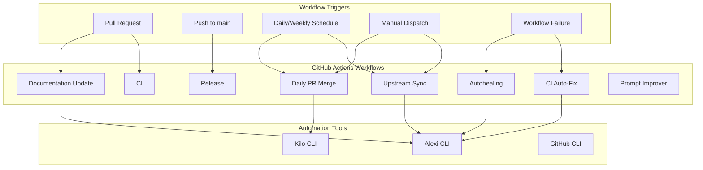
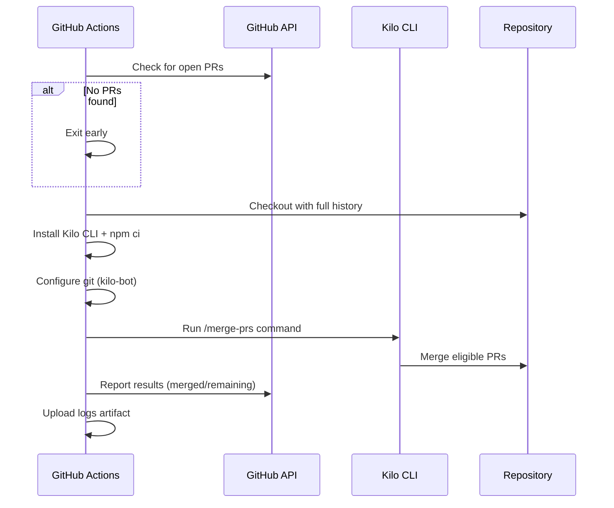
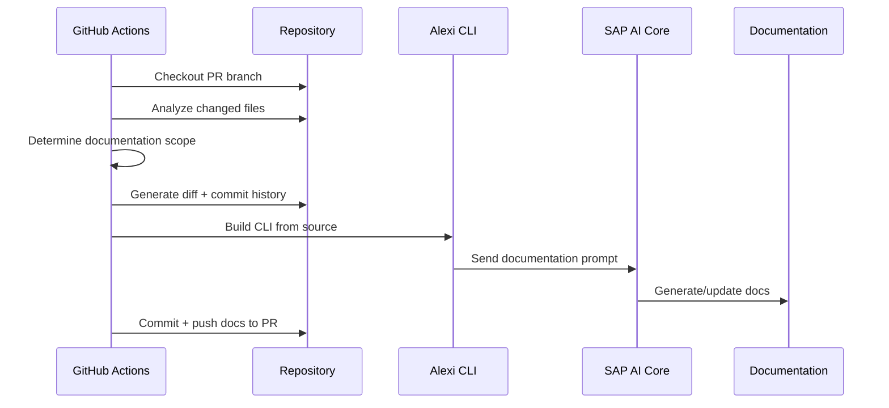
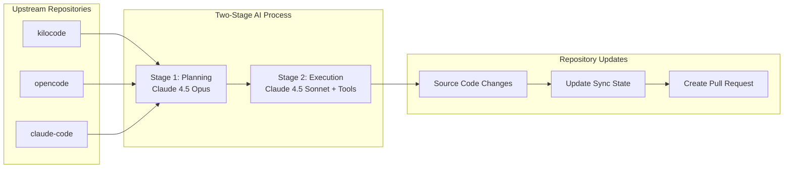
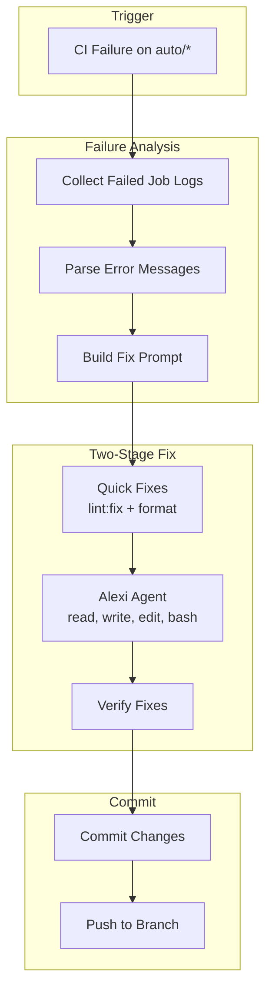
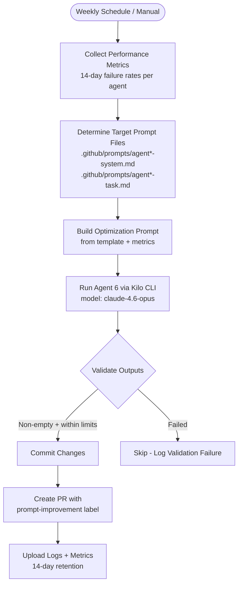

# Automation and CI/CD

This document describes the GitHub Actions workflows and automation systems in the Alexi project.

## Overview

Alexi uses 20 GitHub Actions workflows for continuous integration, automated documentation, autonomous upstream synchronization, AI-powered autohealing, prompt optimization, and daily PR management. The automation system leverages Kilo CLI and Alexi's agentic capabilities.

## Workflow Architecture



## Workflows

### 1. Continuous Integration (CI)

**File**: `.github/workflows/ci.yml`

**Triggers**: Push/PR to main/master

**Steps**:
1. Checkout code
2. Set up Node.js 22
3. Install dependencies (`npm ci`)
4. Run TypeScript compiler (`npm run build`)
5. Run linting (`npm run lint`)
6. Run tests (`npm test`)

### 2. Daily PR Merge

**File**: `.github/workflows/daily-merge-prs.yml`

**Triggers**:
- Daily schedule at 18:00 UTC (21:00 Minsk time)
- Manual workflow dispatch with optional `dry_run` flag

**Purpose**: Automatically processes and merges open pull requests using Kilo CLI with AI-powered conflict resolution.

#### Workflow Steps



#### Configuration

```yaml
concurrency:
  group: daily-merge-prs
  cancel-in-progress: false

permissions:
  contents: write
  pull-requests: write
  issues: write
```

#### Kilo CLI Invocation

```bash
kilo run "/merge-prs" --title "Daily PR Merge" \
  --auto \
  -m "sap-ai-core/anthropic--claude-4.6-opus" \
  --variant max
```

#### Dry Run Mode

Manual trigger with `dry_run: true` reports PR status without merging:

```
=== Open PRs Status ===
#123 | CLEAN | feat: add new feature
#456 | BLOCKED | fix: resolve conflict
```

### 3. Documentation Update

**File**: `.github/workflows/documentation-update.yml`

**Triggers**:
- Pull request events (opened, synchronize, reopened)
- Manual workflow dispatch with PR number and optional force regeneration

**Purpose**: AI-powered documentation generation based on code changes.

#### Workflow Steps



#### Scope Detection

| File Pattern | Documentation Updated |
|-------------|----------------------|
| `src/cli/**`, `src/core/**` | ARCHITECTURE.md, API.md |
| `src/providers/**` | PROVIDERS.md |
| `*.json`, `.env*` | CONFIGURATION.md |
| `*.test.ts`, `*.spec.ts` | TESTING.md |
| `.github/workflows/**` | AUTOMATION.md |
| All changes | CHANGELOG.md, CONTRIBUTING.md |

### 4. Upstream Sync

**File**: `.github/workflows/sync-upstream.yml`

**Triggers**:
- Daily at 06:00 UTC
- Manual dispatch with `dry_run` and `force_sync` options

**Purpose**: Synchronize changes from upstream repositories (kilocode, opencode, claude-code) and apply relevant updates.

#### Upstream Repositories

| Repository | Upstream | Purpose |
|------------|----------|---------|
| kilocode | Kilo-Org/kilocode | AI coding assistant patterns |
| opencode | anomalyco/opencode | Open source coding patterns |
| claude-code | anthropics/claude-code | Anthropic Claude patterns |

#### Sync Architecture



#### Sync State

Maintained in `.github/last-sync-commits.json`:

```json
{
  "kilocode": {
    "last_synced_commit": "39affcc140e4abc6486cc54d6b29c39f1a5b2285",
    "last_synced_at": "2026-05-20T09:41:51Z",
    "upstream": "Kilo-Org/kilocode",
    "fork": "ausard/kilocode"
  },
  "opencode": {
    "last_synced_commit": "13006d6d7c9c84e790c9ecc001e6b42b34c05b96",
    "last_synced_at": "2026-05-20T09:41:51Z",
    "upstream": "anomalyco/opencode",
    "fork": "ausard/opencode"
  },
  "claude-code": {
    "last_synced_commit": "cc898dc3692fb583f36ab327942aad20b7d3dbd0",
    "last_synced_at": "2026-05-20T09:41:51Z",
    "upstream": "anthropics/claude-code",
    "fork": "direct-clone"
  }
}
```

### 5. CI Auto-Fix

**File**: `.github/workflows/ci-auto-fix.yml`

**Triggers**:
- Workflow run completion (when CI/docs/security fails on auto/* branches)
- Manual dispatch with run ID and branch name

**Purpose**: Automatically diagnose and fix CI failures on auto/* branches.

#### Fix Process



#### Key Features

1. **Intelligent Failure Detection**: Collects logs from all failed jobs with file paths and line numbers
2. **Two-Stage Fix**: Quick deterministic fixes (lint, format) then AI agent for remaining issues
3. **Rate Limiting**: Maximum 2 auto-fix runs per branch per day
4. **Branch Filtering**: Only processes `auto/*` branches
5. **Targeted Verification**: Re-runs only the checks that originally failed

#### Alexi Agent Invocation

```bash
alexi agent \
  --system .github/prompts/ci-fix-system.md \
  -m "$(cat ci-fix-prompt.md)" \
  --tools read,write,edit,glob,grep,bash \
  --max-iterations 20 \
  --effort high \
  --auto-route
```

### 6. Autohealing

**File**: `.github/workflows/agent-autohealing.yml`

**Triggers**: After any workflow failure (including Agent 6: Prompt Improver)

**Purpose**: AI-powered automatic recovery from workflow failures. Uses external prompt template (`.github/prompts/agent-autohealing-task.md`) with variable substitution for the failure context.

### 7. Agent Workflows

| Workflow | File | Schedule | Purpose |
|----------|------|----------|---------|
| Agent 1: Research | `agent1-research.yml` | Daily 04:00 UTC | Research tasks and issue analysis |
| Agent 2: Planning | `agent2-planning.yml` | Daily 06:00 UTC + after Agent 1 | Development planning |
| Agent 3: Auto-Implement | `auto-implement.yml` | Every 30 minutes | Implement issues from backlog |
| Agent 4: Review | `agent4-review.yml` | PR events (src/tests) | Automated code review |
| Agent 5: Release | `agent5-release.yml` | Weekly Monday 10:00 UTC | Release management |
| Agent 6: Prompt Improver | `agent6-prompt-optimizer.yml` | Weekly Wednesday 08:00 UTC | Optimize agent prompt templates |

### 8. Agent 6: Prompt Improver

**File**: `.github/workflows/agent6-prompt-optimizer.yml`

**Triggers**:
- Weekly schedule: Wednesday at 08:00 UTC
- Manual dispatch with `target_agent` selection and `dry_run` option

**Purpose**: Analyzes agent workflow performance metrics (failure rates over 14 days) and optimizes agent prompt templates to improve reliability and output quality.

#### Prompt Optimization Flow



#### Configuration

```yaml
inputs:
  target_agent:
    type: choice
    options: [all, agent1-research, agent2-planning, agent3-implement,
              agent4-review, agent5-release, agent-autohealing]
  dry_run:
    type: boolean
    default: false
```

#### Validation Rules

- System prompts: must be non-empty, maximum 60 lines
- Task prompts: must be non-empty, maximum 100 lines

### 9. Template-Based Prompt Assembly

Agent workflows have been refactored to use external prompt templates in `.github/prompts/` instead of inline prompt construction. This separation enables:

1. **Agent 6 optimization**: Prompt files can be modified independently of workflow logic
2. **Cleaner workflows**: YAML files contain only orchestration logic
3. **Template variables**: Prompts use `{{VARIABLE}}` substitution with `sed` and `awk`
4. **Conditional sections**: `{{#CONDITION}}...{{/CONDITION}}` blocks for dynamic content

Template locations:
- `.github/prompts/agent1-research-task.md`
- `.github/prompts/agent2-planning-task.md`
- `.github/prompts/agent4-review-task.md`
- `.github/prompts/agent5-release-task.md`
- `.github/prompts/agent-autohealing-task.md`
- `.github/prompts/agent*-system.md` (system prompts for each agent)

### 10. Release Workflows

| Workflow | File | Trigger | Purpose |
|----------|------|---------|---------|
| Release | `release.yml` | Tag push (v*) + manual | Publish release |
| Tag Release | `tag-release.yml` | Manual dispatch | Create version tag |
| On Release Merge | `on-release-merge.yml` | PR closed (release/*) | Post-release tasks |

### 11. Support Workflows

| Workflow | File | Purpose |
|----------|------|---------|
| Repository Sync | `repo-sync.yml` | Fork synchronization |
| Sync to Issues | `sync-to-issues.yml` | Convert sync results to issues |
| Auto Merge | `auto-merge.yml` | Auto-merge approved PRs |
| Security | `security.yml` | Security scanning |
| Update Homebrew | `update-homebrew.yml` | Update Homebrew formula |

## GitHub Secrets Required

| Secret | Purpose | Required For |
|--------|---------|--------------|
| `AICORE_SERVICE_KEY` | SAP AI Core authentication | Docs, Sync, CI Fix, Autohealing, Daily Merge |
| `AICORE_RESOURCE_GROUP` | SAP AI Core resource group | Docs, Sync, CI Fix, Autohealing, Daily Merge |
| `GH_PAT` | GitHub Personal Access Token | Sync (cross-repo), Daily Merge |
| `GITHUB_TOKEN` | Default GitHub token | All workflows (automatic) |

### Secret Configuration

#### AICORE_SERVICE_KEY

```json
{
  "clientid": "your-client-id",
  "clientsecret": "your-client-secret",
  "url": "https://your-auth-url",
  "serviceurls": {
    "AI_API_URL": "https://your-ai-api-url"
  }
}
```

#### GH_PAT Permissions

- `repo` (full control of private repositories)
- `workflow` (update GitHub Actions workflows)

## Agentic File Operations

Automation workflows leverage Alexi's agentic capabilities with automatic permission management.

### Permission Configuration in CI

```typescript
// Automatic high-priority rules in agentic mode
{
  id: 'agentic-allow-write',
  priority: 200,
  actions: ['write'],
  paths: ['<workdir>/**'],
  decision: 'allow'
}

{
  id: 'agentic-allow-execute',
  priority: 200,
  actions: ['execute'],
  decision: 'allow'
}
```

### Tool Context Resolution

Tools resolve relative paths using the workdir context:

```typescript
permission: {
  action: 'write',
  getResource: (params, context) => {
    if (path.isAbsolute(params.filePath)) {
      return params.filePath;
    }
    return path.join(context?.workdir || process.cwd(), params.filePath);
  }
}
```

## Workflow Maintenance

### Updating Workflows

1. Edit workflow YAML files in `.github/workflows/`
2. Test changes using manual workflow dispatch with dry-run
3. Commit and push changes
4. Changes to workflows automatically trigger `AUTOMATION.md` update

### Debugging Workflows

1. Check workflow run logs in GitHub Actions tab
2. Use dry-run mode for sync and merge workflows
3. Review generated artifacts (kilo-output.log, ci-failures.md)
4. Check sync state in `.github/last-sync-commits.json`

### Common Issues

| Issue | Solution |
|-------|----------|
| Documentation update fails | Verify `AICORE_SERVICE_KEY` and `AICORE_RESOURCE_GROUP` secrets |
| Upstream sync creates no PR | Check if upstreams have new commits since last sync |
| Daily merge skips PRs | Check PR merge state (CLEAN vs BLOCKED) |
| CI auto-fix loops | Rate limit (2/day) should prevent; check branch patterns |
| Autohealing not triggering | Verify workflow failure event propagation |

## Best Practices

1. **Test workflow changes with dry-run** before allowing actual execution
2. **Review AI-generated changes** in PR diffs before merging
3. **Keep secrets updated** and rotate credentials regularly
4. **Monitor API usage** via SAP AI Core cost tracking
5. **Document workflow modifications** by updating this file
6. **Use concurrency groups** to prevent parallel runs of the same workflow
7. **Set appropriate timeouts** (daily merge: 30min, sync: 45min, CI fix: 20min)
