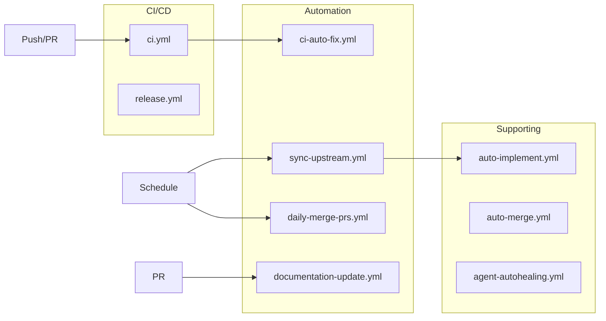
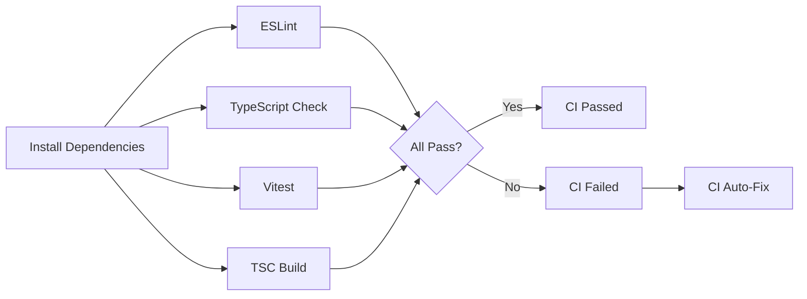
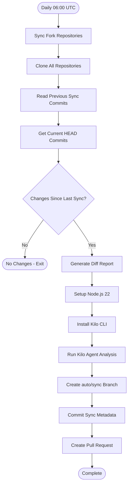
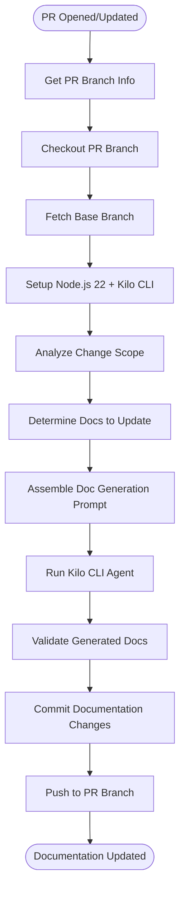
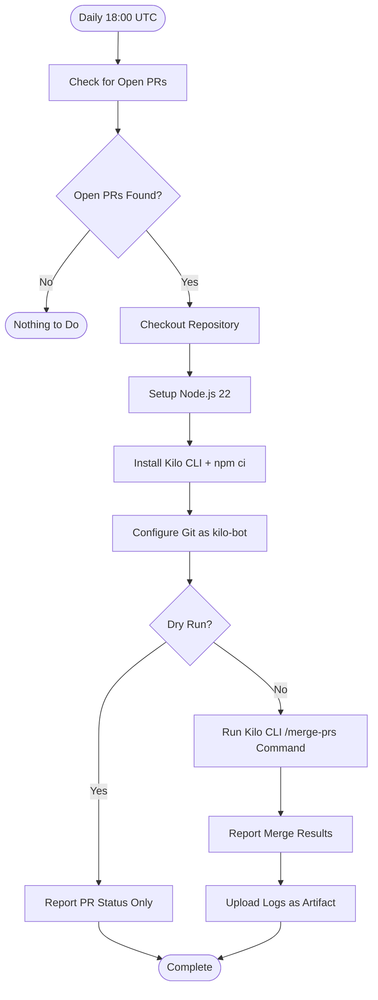
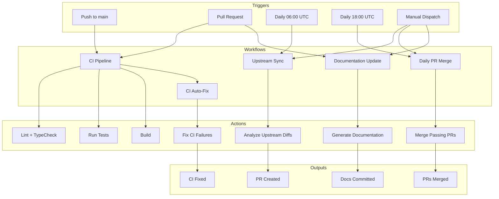
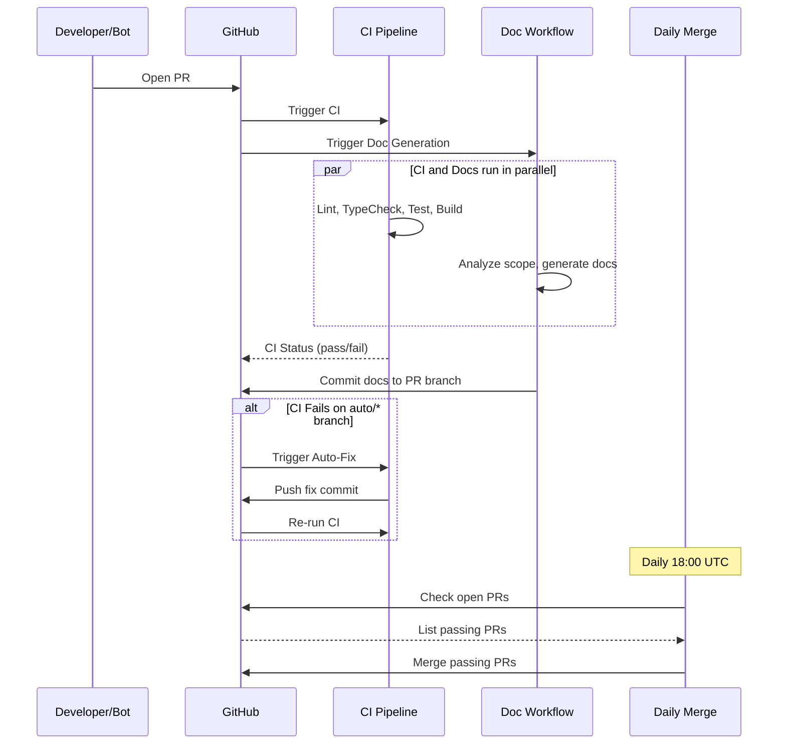

# Automation and Workflows

This document describes Alexi's GitHub Actions workflows, CI/CD pipeline, and autonomous automation systems.

## Table of Contents

- [Overview](#overview)
- [CI Pipeline](#ci-pipeline)
- [Upstream Sync Workflow](#upstream-sync-workflow)
- [Documentation Update Workflow](#documentation-update-workflow)
- [Daily PR Merge Workflow](#daily-pr-merge-workflow)
- [CI Auto-Fix Workflow](#ci-auto-fix-workflow)
- [Required GitHub Secrets](#required-github-secrets)
- [Workflow Diagrams](#workflow-diagrams)

## Overview

Alexi uses a suite of GitHub Actions workflows for continuous integration, autonomous upstream synchronization, documentation generation, and automated PR management.



## CI Pipeline

**File**: `.github/workflows/ci.yml`

The CI pipeline runs on every push to main/master and on pull requests.

### Triggers

- Push to `main` or `master`
- Pull requests targeting `main` or `master`

### Jobs

| Job | Description | Dependencies |
|-----|-------------|-------------|
| `install` | Install and cache `node_modules` | None |
| `lint` | Run ESLint on `src/` and `tests/` | install |
| `typecheck` | TypeScript type checking (`tsc --noEmit`) | install |
| `test` | Run Vitest test suite | install |
| `build` | Compile TypeScript to `dist/` | install |

### Pipeline Flow



### Configuration

- **Node.js**: v22
- **Package Manager**: npm with `npm ci` for reproducible installs
- **Caching**: `node_modules` cached by commit SHA

## Upstream Sync Workflow

**File**: `.github/workflows/sync-upstream.yml`

Automatically syncs changes from upstream repositories (Kilo Code, OpenCode, Claude Code) and creates PRs with analyzed changes.

### Triggers

| Trigger | Schedule | Description |
|---------|----------|-------------|
| Cron | `0 6 * * *` (06:00 UTC daily) | Automated daily sync |
| Manual | `workflow_dispatch` | On-demand with dry_run and force_sync options |

### Upstream Sources

| Repository | Fork | Branch |
|-----------|------|--------|
| `Kilo-Org/kilocode` | `ausard/kilocode` | main |
| `anomalyco/opencode` | `ausard/opencode` | dev |
| `anthropics/claude-code` | direct-clone | main |

### Workflow Steps



### Sync Metadata

The workflow maintains `.github/last-sync-commits.json` to track the last synced commit from each upstream:

```json
{
  "kilocode": {
    "last_synced_commit": "a23fe160d66d...",
    "last_synced_at": "2026-05-17T08:27:24Z",
    "upstream": "Kilo-Org/kilocode",
    "fork": "ausard/kilocode"
  },
  "opencode": {
    "last_synced_commit": "53e89f9d5242...",
    "last_synced_at": "2026-05-17T08:27:24Z",
    "upstream": "anomalyco/opencode",
    "fork": "ausard/opencode"
  },
  "claude-code": {
    "last_synced_commit": "8bdbb7296d3f...",
    "last_synced_at": "2026-05-17T08:27:24Z",
    "upstream": "anthropics/claude-code",
    "fork": "direct-clone"
  }
}
```

### Key Features

- **Delta detection**: Only processes changes since the last synced commit
- **AI-powered analysis**: Uses Kilo CLI agent to analyze diffs and apply relevant changes
- **Auto-PR creation**: Creates PRs with detailed diff reports
- **Graceful fallback**: Continues if fork sync fails (may already be up-to-date)

## Documentation Update Workflow

**File**: `.github/workflows/documentation-update.yml`

Automatically generates and updates documentation when PRs are opened or modified.

### Triggers

| Trigger | Condition | Description |
|---------|-----------|-------------|
| Pull Request | `opened`, `synchronize`, `reopened` | Auto-generate docs for PR changes |
| Manual | `workflow_dispatch` with PR number | Force full regeneration |

### Workflow Steps



### Scope Analysis

The workflow analyzes which files changed to determine which documentation files need updating:

| Change Type | Documentation Affected |
|------------|----------------------|
| `src/core/` changes | ARCHITECTURE.md, API.md |
| `src/tool/` changes | API.md |
| `src/config/` changes | CONFIGURATION.md |
| Test changes | TESTING.md |
| Workflow changes | AUTOMATION.md |
| Any code change | CHANGELOG.md |

### AI Agent Integration

The workflow uses the Kilo CLI in agent mode to:
1. Read the actual source code (not just diffs)
2. Generate accurate documentation with code examples
3. Create Mermaid diagrams for architecture visualization
4. Follow Keep a Changelog format for CHANGELOG.md

## Daily PR Merge Workflow

**File**: `.github/workflows/daily-merge-prs.yml`

Automatically merges open PRs that pass all checks, running daily at 18:00 UTC.

### Triggers

| Trigger | Schedule | Description |
|---------|----------|-------------|
| Cron | `0 18 * * *` (18:00 UTC daily) | Automated daily merge |
| Manual | `workflow_dispatch` | On-demand with dry_run option |

### Workflow Steps



### Key Features

- **Concurrency control**: Only one merge job at a time (`cancel-in-progress: false`)
- **Timeout**: 30-minute job timeout, 25-minute Kilo CLI timeout
- **Dry run mode**: Report PR status without merging
- **Result reporting**: Shows initial count, merged count, and remaining PRs
- **Log preservation**: Kilo output saved as GitHub artifact (7-day retention)

### Kilo CLI Invocation

```bash
kilo run "/merge-prs" --title "Daily PR Merge" \
  --auto \
  -m "sap-ai-core/anthropic--claude-4.6-opus" \
  --variant max
```

## CI Auto-Fix Workflow

**File**: `.github/workflows/ci-auto-fix.yml`

Automatically fixes failing CI checks on `auto/*` branches by:
1. Collecting failed job logs and error messages
2. Using Alexi agent mode to apply targeted fixes
3. Verifying fixes pass and committing changes
4. Rate-limited to max 2 runs per branch per day

## Required GitHub Secrets

| Secret | Used By | Description |
|--------|---------|-------------|
| `GITHUB_TOKEN` | All workflows | Default GitHub token for repository operations |
| `GH_PAT` | sync-upstream, daily-merge-prs | Personal Access Token for cross-repo operations |
| `AICORE_SERVICE_KEY` | daily-merge-prs, ci-auto-fix | SAP AI Core authentication |
| `AICORE_RESOURCE_GROUP` | daily-merge-prs, ci-auto-fix | SAP AI Core resource group |

### Token Requirements

- **`GITHUB_TOKEN`**: Sufficient for same-repo operations (CI, docs, PR comments)
- **`GH_PAT`**: Required for fork syncing across repositories (`repo` scope needed)
- **Fallback pattern**: Most workflows use `secrets.GH_PAT || secrets.GITHUB_TOKEN` to gracefully degrade when PAT is unavailable

## Workflow Diagrams

### Complete Automation Architecture



### PR Lifecycle with Automation


