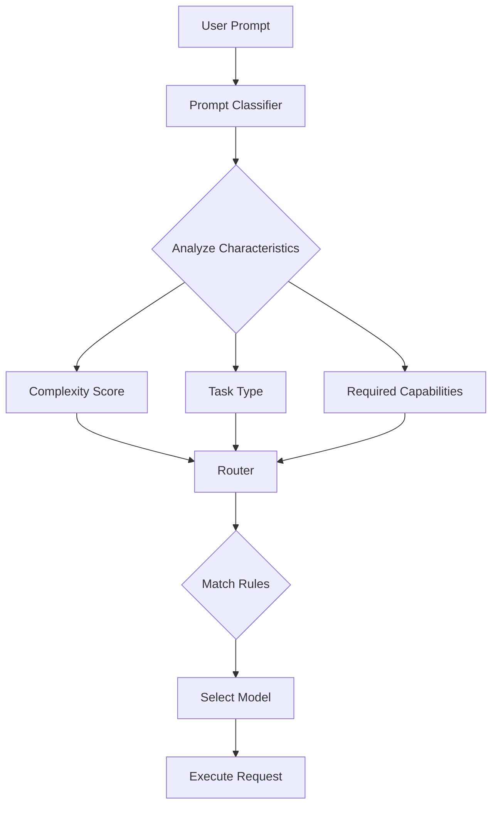
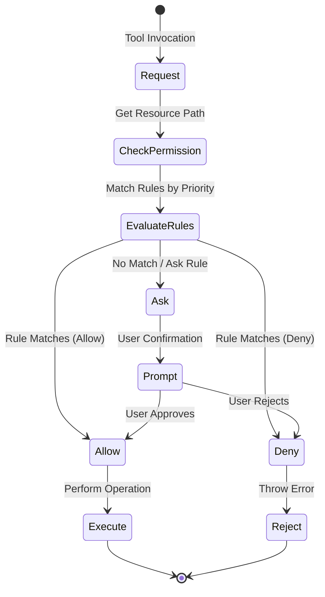
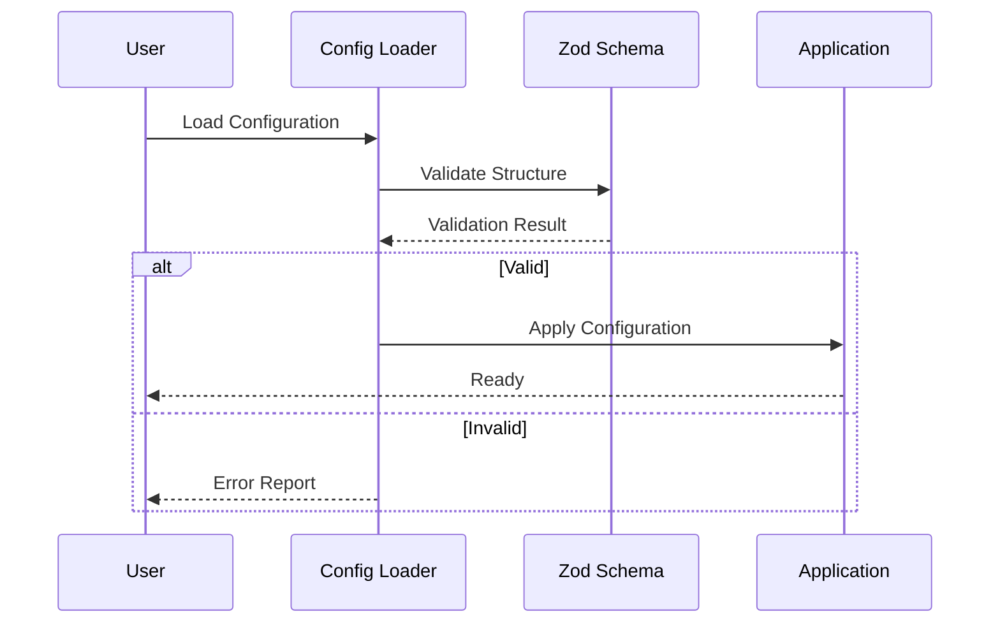

# Configuration Guide

This document describes all configuration options available in Alexi, including environment variables, configuration files, and runtime settings.

## Table of Contents

- [Environment Variables](#environment-variables)
- [Configuration Files](#configuration-files)
- [Routing Configuration](#routing-configuration)
- [Session Storage](#session-storage)
- [Update Management](#update-management)
- [Permission System](#permission-system)

## Environment Variables

Alexi uses environment variables for sensitive credentials and global configuration. These should be set in a `.env` file (never committed to version control) or exported in your shell environment.

### SAP AI Core Configuration

Configure SAP AI Core access for Claude and other models:

```bash
# SAP AI Core Service Key (JSON string)
AICORE_SERVICE_KEY='{"clientid":"...","clientsecret":"...","url":"...","serviceurls":{"AI_API_URL":"..."}}'

# SAP AI Core Resource Group
AICORE_RESOURCE_GROUP=your-resource-group-id
```

#### Service Key Structure

The `AICORE_SERVICE_KEY` must be a valid JSON string with the following structure:

```json
{
  "clientid": "your-client-id",
  "clientsecret": "your-client-secret",
  "url": "https://your-auth-url.authentication.sap.hana.ondemand.com",
  "serviceurls": {
    "AI_API_URL": "https://api.ai.prod.your-region.aws.ml.hana.ondemand.com"
  }
}
```

### OpenAI-Compatible Proxy Configuration

For models accessed through OpenAI-compatible proxies:

```bash
# Proxy endpoint base URL
SAP_PROXY_BASE_URL=http://127.0.0.1:3001/v1

# API key for proxy authentication
SAP_PROXY_API_KEY=your_secret_key

# Default model to use with proxy
SAP_PROXY_MODEL=gpt-4o
```

### GitHub Integration

For upstream sync and automation features:

```bash
# GitHub Personal Access Token
GITHUB_TOKEN=ghp_your_token_here
```

Required permissions:
- `repo`: Full control of repositories
- `workflow`: Update GitHub Actions workflows

### Complete Example

Create a `.env` file in your project root:

```bash
# SAP AI Core (for Claude models)
AICORE_SERVICE_KEY='{"clientid":"sb-xxxxx","clientsecret":"xxxxx","url":"https://xxxxx.authentication.sap.hana.ondemand.com","serviceurls":{"AI_API_URL":"https://api.ai.prod.eu-central-1.aws.ml.hana.ondemand.com"}}'
AICORE_RESOURCE_GROUP=default

# OpenAI-compatible proxy (for GPT models)
SAP_PROXY_BASE_URL=http://127.0.0.1:3001/v1
SAP_PROXY_API_KEY=your_secret_key
SAP_PROXY_MODEL=gpt-4o

# GitHub integration (optional)
GITHUB_TOKEN=ghp_your_token_here
```

## Configuration Files

### Package Configuration

Alexi's core configuration is in `package.json`:

```json
{
  "name": "alexi",
  "version": "0.1.3",
  "type": "module",
  "bin": {
    "alexi": "dist/cli/program.js",
    "ax": "dist/cli/program.js"
  },
  "engines": {
    "node": ">=22.12.0"
  }
}
```

### TypeScript Configuration

TypeScript compiler options in `tsconfig.json`:

```json
{
  "compilerOptions": {
    "target": "ES2022",
    "module": "ES2022",
    "moduleResolution": "node",
    "outDir": "./dist",
    "rootDir": "./src",
    "strict": true,
    "esModuleInterop": true,
    "skipLibCheck": true
  }
}
```

## Routing Configuration

### Overview

The routing system determines which model to use based on prompt characteristics. Configuration is stored in `routing-config.json`.



### Configuration Structure

```json
{
  "version": "1.0",
  "defaultModel": "claude-sonnet-4-5",
  "rules": [
    {
      "id": "rule-001",
      "priority": 100,
      "conditions": {
        "complexity": "high",
        "taskType": "code_generation"
      },
      "model": "claude-opus-4-5",
      "enabled": true
    }
  ],
  "models": {
    "claude-opus-4-5": {
      "provider": "bedrock",
      "maxTokens": 8192,
      "temperature": 0.7
    }
  }
}
```

### Rule Priority

Rules are evaluated in priority order (highest first):

| Priority Range | Use Case |
|----------------|----------|
| 200+ | Override rules (highest priority) |
| 100-199 | High-priority routing decisions |
| 50-99 | Standard routing rules |
| 1-49 | Fallback and default rules |

### Task Types

Supported task types for routing decisions:

- `code_generation`: Writing or modifying code
- `code_review`: Analyzing existing code
- `documentation`: Writing technical documentation
- `conversation`: General chat and Q&A
- `analysis`: Data or text analysis
- `creative`: Creative writing tasks

### Complexity Levels

Prompt complexity affects model selection:

- `high`: Complex tasks requiring advanced reasoning
- `medium`: Standard tasks with moderate complexity
- `low`: Simple queries and basic operations

### Example Configurations

#### Cost Optimization

Prioritize cheaper models for simple tasks:

```json
{
  "version": "1.0",
  "defaultModel": "claude-haiku-4-5",
  "rules": [
    {
      "id": "complex-tasks-only",
      "priority": 100,
      "conditions": {
        "complexity": "high"
      },
      "model": "claude-opus-4-5",
      "enabled": true
    },
    {
      "id": "medium-tasks",
      "priority": 50,
      "conditions": {
        "complexity": "medium"
      },
      "model": "claude-sonnet-4-5",
      "enabled": true
    }
  ]
}
```

#### Quality Optimization

Use the most capable model for all tasks:

```json
{
  "version": "1.0",
  "defaultModel": "claude-opus-4-5",
  "rules": []
}
```

#### Specialized Routing

Route specific task types to optimized models:

```json
{
  "version": "1.0",
  "defaultModel": "claude-sonnet-4-5",
  "rules": [
    {
      "id": "code-generation",
      "priority": 100,
      "conditions": {
        "taskType": "code_generation"
      },
      "model": "claude-opus-4-5",
      "enabled": true
    },
    {
      "id": "simple-chat",
      "priority": 50,
      "conditions": {
        "taskType": "conversation",
        "complexity": "low"
      },
      "model": "claude-haiku-4-5",
      "enabled": true
    }
  ]
}
```

## Session Storage

### Configuration

Sessions are stored in the user's home directory:

```
~/.alexi/
├── sessions/           # Session data
│   ├── session-abc123.json
│   └── session-def456.json
├── sync-state.json    # Upstream sync state
├── sync-reports/      # Sync operation reports
└── .update-check      # Version check cache
```

### Session File Format

```json
{
  "metadata": {
    "id": "session-abc123",
    "title": "Code Review Session",
    "modelId": "claude-sonnet-4-5",
    "createdAt": 1704067200000,
    "updatedAt": 1704070800000
  },
  "messages": [
    {
      "role": "user",
      "content": "Review this code...",
      "timestamp": 1704067200000
    },
    {
      "role": "assistant",
      "content": "The code looks good...",
      "timestamp": 1704067250000
    }
  ]
}
```

### Storage Limits

Default limits (configurable):

- Maximum sessions: 1000
- Maximum messages per session: 10000
- Maximum message size: 1 MB
- Session expiry: 30 days of inactivity

## Update Management

### Configuration

Update checks are cached to avoid excessive API calls:

```
~/.alexi/.update-check
```

### Update Check Interval

Default: 24 hours

Configure via `UpdateManager` options:

```typescript
const manager = new UpdateManager({
  checkIntervalMs: 12 * 60 * 60 * 1000 // 12 hours
});
```

### Version Detection

Alexi detects its version from:

1. `package.json` in the installation directory
2. `npm list` output (fallback)
3. Default to `0.0.0` if detection fails

### Update Sources

Updates are checked against:

- npm registry: `https://registry.npmjs.org/alexi/latest`
- Homebrew tap: `ausardcompany/tap` (for macOS users)

## Permission System

### Overview

The permission system controls file operations and command execution in agentic mode.



### Permission Rules

Rules are evaluated by priority (highest first):

```typescript
{
  id: 'agentic-allow-write',
  priority: 200,
  description: 'Allow writing files in workdir for agentic mode',
  actions: ['write'],
  paths: ['<workdir>/**'],
  decision: 'allow'
}
```

### Actions

Supported permission actions:

- `read`: Read files or directories
- `write`: Create or modify files
- `execute`: Execute shell commands
- `delete`: Delete files or directories

### Path Patterns

Path matching supports:

- Absolute paths: `/home/user/project/file.ts`
- Relative paths: `src/index.ts`
- Glob patterns: `**/*.ts`, `src/**`
- Special tokens: `<workdir>`, `<home>`, `<cwd>`

### Agentic Mode Configuration

In agentic mode, high-priority allow rules are automatically added:

```typescript
// Write operations in workdir
{
  id: 'agentic-allow-write',
  priority: 200,
  actions: ['write'],
  paths: ['<workdir>/**'],
  decision: 'allow'
}

// Execute operations
{
  id: 'agentic-allow-execute',
  priority: 200,
  actions: ['execute'],
  decision: 'allow'
}
```

### External Directory Access

To enable operations outside the workdir:

```typescript
const manager = getPermissionManager();
manager.addRule({
  id: 'allow-external',
  priority: 150,
  actions: ['read', 'write'],
  paths: ['/path/to/external/**'],
  decision: 'allow'
});
```

## Configuration Validation

### Validation Flow



### Schema Validation

All configuration files use Zod schemas for validation:

```typescript
const ConfigSchema = z.object({
  version: z.string(),
  defaultModel: z.string(),
  rules: z.array(RuleSchema),
  models: z.record(ModelSchema)
});
```

### Error Handling

Invalid configurations trigger detailed error messages:

```
Configuration Error: Invalid routing-config.json

Path: rules[0].priority
Expected: number >= 1
Received: 0

Please check your configuration and try again.
```

## Best Practices

### Security

1. Never commit `.env` files to version control
2. Use strong, unique API keys
3. Rotate credentials regularly
4. Limit permission scopes to minimum required

### Performance

1. Use appropriate check intervals for updates
2. Enable session expiry to manage storage
3. Configure routing rules to use cost-effective models
4. Cache frequently used configurations

### Maintenance

1. Review routing rules periodically
2. Monitor session storage usage
3. Keep dependencies updated
4. Test configuration changes in development first

### Development

1. Use `.env.example` as a template
2. Document custom configuration options
3. Validate configuration before deployment
4. Use environment-specific configuration files

## Troubleshooting

### Common Issues

**Issue**: SAP AI Core authentication fails

**Solution**: Verify service key format and credentials:
```bash
# Test service key parsing
node -e "console.log(JSON.parse(process.env.AICORE_SERVICE_KEY))"
```

**Issue**: Routing rules not applied

**Solution**: Check rule priority and conditions:
```bash
# Explain routing decision
alexi explain "your prompt here"
```

**Issue**: Permission denied in agentic mode

**Solution**: Verify workdir configuration and permission rules:
```bash
# Check current permissions
alexi permissions list
```

### Debug Mode

Enable verbose logging:

```bash
# Set debug environment variable
export DEBUG=alexi:*

# Run command with debug output
alexi chat "test message"
```

### Configuration Reset

Reset to default configuration:

```bash
# Backup current config
cp routing-config.json routing-config.backup.json

# Generate default config
alexi config reset

# Restore if needed
mv routing-config.backup.json routing-config.json
```

## Additional Resources

- [API Documentation](API.md)
- [Architecture Overview](architecture.md)
- [Contributing Guide](CONTRIBUTING.md)
- [Automation Workflows](AUTOMATION.md)
