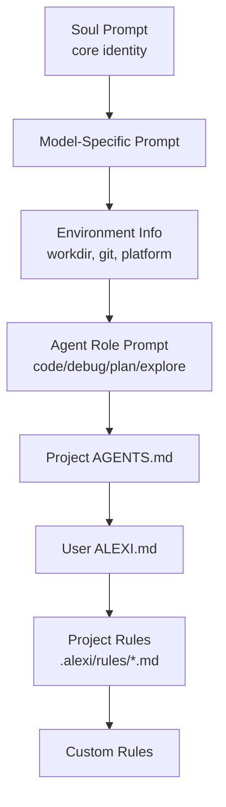

# Configuration

This document describes all configuration options available in Alexi, including environment variables, user configuration files, routing rules, compaction settings, hooks, and instruction files.

## Table of Contents

- [Environment Variables](#environment-variables)
- [User Configuration](#user-configuration)
- [Routing Configuration](#routing-configuration)
- [Compaction Configuration](#compaction-configuration)
- [Hooks Configuration](#hooks-configuration)
- [Instruction Files](#instruction-files)
- [Project Context](#project-context)
- [Session Storage](#session-storage)
- [Configuration Examples](#configuration-examples)

## Environment Variables

### Required Variables

#### AICORE_SERVICE_KEY

SAP AI Core service key in JSON format. Contains authentication credentials for SAP AI Core.

```bash
export AICORE_SERVICE_KEY='{
  "clientid": "your-client-id",
  "clientsecret": "your-client-secret",
  "url": "https://your-auth-url",
  "serviceurls": {
    "AI_API_URL": "https://your-ai-api-url"
  }
}'
```

### Optional Variables

#### AICORE_RESOURCE_GROUP

SAP AI Core resource group identifier. Defaults to `"default"` if not specified.

```bash
export AICORE_RESOURCE_GROUP=production
```

#### AICORE_MODEL

Default model to use when no model is specified. Can be overridden by user configuration.

```bash
export AICORE_MODEL=gpt-4o
```

#### ALEXI_MAX_IMAGE_SIZE_MB

Maximum size in megabytes for image attachments. Defaults to 20MB if not specified.

```bash
export ALEXI_MAX_IMAGE_SIZE_MB=20
```

#### SAP_PROXY_BASE_URL

Base URL for OpenAI-compatible proxy endpoint (for proxy mode).

```bash
export SAP_PROXY_BASE_URL=http://127.0.0.1:3001/v1
```

#### SAP_PROXY_API_KEY

API key for proxy endpoint authentication.

```bash
export SAP_PROXY_API_KEY=your_secret_key
```

#### MORPH_API_KEY

API key for WarpGrep semantic code search (optional during free period).

```bash
export MORPH_API_KEY=your_morph_api_key
```

#### ALEXI_EXPERIMENTAL_BACKGROUND_TASKS

Enable experimental background task execution in the task tool.

```bash
export ALEXI_EXPERIMENTAL_BACKGROUND_TASKS=true
```

#### ALEXI_PROJECT_DIR

Override the project directory for configuration resolution.

```bash
export ALEXI_PROJECT_DIR=/path/to/project
```

## User Configuration

User configuration is stored in `~/.alexi/config.json` and persists settings across sessions.

### Configuration File Location

```bash
~/.alexi/config.json
```

### Configuration Schema

```typescript
interface UserConfig {
  defaultModel?: string;          // Persistent default model
  agent?: string;                 // Default agent slug for `alexi agent` / `alexi chat`
                                  //   (overridden per-invocation by `--agent <name>`)
  soundEnabled?: boolean;         // Enable notification sounds
  autoRoute?: boolean;            // Auto-routing preference
  [key: string]: unknown;         // Extensible for custom settings
}
```

The `agent` field accepts any built-in agent slug (`code`, `debug`, `plan`,
`explore`, `orchestrator`) or a custom agent slug loaded from
`~/.alexi/agents/*.md` or `<project>/.alexi/agents/*.md`. Unknown slugs log
a warning and fall back to the default agent (no crash).

### Managing Configuration

#### Via CLI Commands

```bash
# Show current configuration
alexi config show

# Set a configuration value
alexi config set defaultModel gpt-4o

# Show configuration file path
alexi config path
```

#### Via Interactive Mode

```bash
# Switch model and save as default
/model gpt-4o

# Show configuration
/config show

# Set configuration value
/config set soundEnabled true
```

#### Programmatic Access

```typescript
import {
  loadFullConfig,
  saveFullConfig,
  getConfigValue,
  setConfigValue,
  getConfigDefaultModel,
  setConfigDefaultModel,
  updateGlobal,
} from './config/userConfig.js';

// Load entire config
const config = loadFullConfig();

// Get/set specific values
const model = getConfigDefaultModel();
setConfigDefaultModel('anthropic--claude-4-sonnet');

// Batch update (atomic)
updateGlobal({
  defaultModel: 'gpt-4o',
  soundEnabled: false,
  autoRoute: true,
});
```

## Routing Configuration

Routing configuration controls automatic model selection based on prompt analysis.

### Configuration Files

Alexi searches for routing configuration in order:

1. `routing-config.json` (project-level)
2. `~/.alexi/routing-config.json` (user-level)
3. Built-in default configuration

### Routing Configuration Schema

```typescript
interface RoutingConfig {
  rules: RoutingRule[];
  default: {
    model: string;
  };
}

interface RoutingRule {
  name: string;
  priority: number;      // Higher priority = evaluated first
  condition: {
    contains?: string[];          // Keywords in prompt
    regex?: string;               // Regex pattern match
    complexity?: 'simple' | 'medium' | 'complex';
    taskType?: string;            // Task classification
  };
  model: string;                  // Model ID to route to
  reason?: string;                // Human-readable explanation
}
```

### Prompt Classification

The router classifies prompts into:

**Task Types:**
- `simple-qa` -- Basic questions and lookups
- `coding` -- Code generation, modification, debugging
- `deep-reasoning` -- Complex analysis, math, logic
- `creative-writing` -- Creative content generation
- `general-qa` -- General knowledge questions

**Complexity Levels:**
- `simple` -- Short, straightforward prompts
- `medium` -- Moderate complexity
- `complex` -- Long, multi-step, or reasoning-heavy

### Model Capability Matching

```typescript
interface ModelCapability {
  id: string;
  type: 'openai' | 'claude' | 'gemini';
  costTier: 'cheap' | 'medium' | 'expensive';
  strengths: string[];   // Task types the model excels at
  maxTokens: number;
  reasoning: boolean;    // Has extended reasoning capability
}
```

### Example Routing Configuration

```json
{
  "rules": [
    {
      "name": "code-tasks",
      "priority": 100,
      "condition": {
        "contains": ["code", "implement", "refactor"]
      },
      "model": "anthropic--claude-4-sonnet",
      "reason": "Claude excels at code generation and refactoring"
    },
    {
      "name": "reasoning-tasks",
      "priority": 90,
      "condition": {
        "complexity": "complex",
        "contains": ["analyze", "explain", "reason"]
      },
      "model": "gpt-4.1",
      "reason": "GPT-4.1 has extended reasoning capabilities"
    },
    {
      "name": "simple-queries",
      "priority": 50,
      "condition": {
        "complexity": "simple"
      },
      "model": "gpt-4o-mini",
      "reason": "Cost-effective for simple queries"
    }
  ],
  "default": {
    "model": "anthropic--claude-4-sonnet"
  }
}
```

## Compaction Configuration

Context compaction manages conversation length when approaching token limits.

### Configuration Schema

```typescript
interface CompactionConfig {
  maxTokens?: number;            // Default: 100000
  warningThreshold?: number;     // Default: 0.8 (80% of maxTokens)
  strategy?: CompactionStrategy; // Default: 'sliding'
  preserveRecent?: number;       // Default: 4 (messages to always keep)
}

type CompactionStrategy = 'truncate' | 'summarize' | 'sliding' | 'smart';
```

### Strategies

| Strategy | Description | Use Case |
|----------|-------------|----------|
| `truncate` | Remove oldest messages beyond limit | Fast, minimal processing |
| `summarize` | AI-powered summarization of old messages | Best context retention |
| `sliding` | Sliding window, keeping N recent messages | Predictable behavior |
| `smart` | Hybrid: importance scoring + selective summarization | Long complex sessions |

### Reactive Overflow Seeding

When context overflow is detected during LLM calls, compaction is triggered with an `overflowTokens` parameter that seeds the target summary size:

```typescript
// Target calculation:
const targetSummaryTokens = Math.max(
  1,
  Math.floor(totalOldTokens - overflowTokens * 1.5)
);
// Instruction: "Keep your summary under approximately N tokens."
```

### Chunked Compaction

Large contexts are split into chunks at natural boundaries before compaction:

```typescript
import { compactInChunks } from '../core/compaction-chunks.js';

// Split at ~100K token boundaries (newline-aware)
const result = await compactInChunks(largeContent, summarizeFn, 100000);
```

## Hooks Configuration

Lifecycle hooks execute at specific events during tool execution and session management.

### Hook Definition

```typescript
interface HookDefinition {
  event: HookEvent;
  type: 'command' | 'http' | 'script';
  command?: string;            // Shell command (for type: 'command')
  url?: string;                // Endpoint URL (for type: 'http')
  method?: 'GET' | 'POST';
  headers?: Record<string, string>;
  script?: string;             // JS/TS file path (for type: 'script')
  timeout?: number;            // Default: 30000ms
  enabled?: boolean;           // Default: true
  description?: string;
  continueOnBlock?: boolean;   // Feed rejection to model instead of halting
}
```

### Hook Events

| Event | When Triggered |
|-------|---------------|
| `SessionStart` | Session begins or resumes |
| `SessionEnd` | Session terminates |
| `PreToolUse` | Before tool execution |
| `PostToolUse` | After successful tool execution |
| `PostToolUseFailure` | After failed tool execution |
| `PermissionRequest` | Permission dialog appears |
| `Stop` | Agent finishes responding |
| `Error` | Error occurred |

### Block Cap

Consecutive `Stop` hook rejections are capped to prevent infinite loops. When the cap is reached, the hook result includes `capped: true` and execution halts.

### continueOnBlock

When `continueOnBlock: true`, hook rejections feed the error message back to the model as context instead of halting execution. This allows the model to adapt its behavior.

## Instruction Files

Instruction files provide context and guidelines to AI agents via a multi-layer system.

### Instruction File Hierarchy



### 1. Project-Level Instructions (AGENTS.md)

**Path**: `./AGENTS.md`

Provides project-specific context, coding standards, and build instructions.

```markdown
# AGENTS.md

## Project Overview
Alexi is a TypeScript/Node.js CLI application.

## Build & Test Commands
npm run build
npm test

## Code Style
- Use 2 spaces for indentation
- Always use .js extension for local imports
```

### 2. User-Level Instructions (ALEXI.md)

**Path**: `~/.alexi/ALEXI.md`

Global user preferences applied to all projects.

### 3. Project-Level Rules

**Path**: `./.alexi/rules/*.md`

Scoped rules for specific aspects (API design, security, database patterns).

### 4. Custom Agents with File Inclusion

Agent prompt files support `{file:path/to/file}` inclusion syntax:

```markdown
---
slug: my-agent
name: My Custom Agent
---

{file:../shared/preamble.md}

You are a specialized agent for...

{file:./tools-reference.md}
```

Inclusions are recursive up to a depth of 3. Paths are resolved relative to the agent file's directory.

### Managing Instruction Files

```bash
# List all instruction files
/memory

# Edit project instructions
/memory edit project

# Edit user instructions
/memory edit user

# Create AGENTS.md from template
/memory init
```

## Project Context

### .alexi/context.json

Project-level context configuration:

```json
{
  "projectName": "alexi",
  "description": "Intelligent LLM orchestrator for SAP AI Core",
  "architecture": {
    "patterns": ["event-driven", "plugin-based"],
    "layers": ["cli", "core", "providers", "tools"]
  },
  "conventions": {
    "naming": "camelCase for files, PascalCase for classes",
    "imports": "Always use .js extension for local imports"
  }
}
```

### .alexi/invariants.md

Architectural invariants that should never be violated:

```markdown
# Architectural Invariants

1. All LLM calls must go through SAP AI Core Orchestration API
2. Tool execution requires permission checks
3. Session state must be persisted to disk
4. Error handling must use Result<T> pattern
```

## Session Storage

Sessions are stored as JSON files in `~/.alexi/sessions/`.

### Directory Structure

```
~/.alexi/
├── sessions/
│   ├── abc-123.json
│   ├── def-456.json
│   └── ghi-789.json
├── config.json
├── ALEXI.md
├── routing-config.json
├── mcp-servers.json
└── agents/
    └── custom-agent.md
```

### Session Schema

```typescript
interface Session {
  id: string;
  title: string;
  createdAt: string;
  updatedAt: string;
  messages: Message[];
  model: string;
  usage: TokenUsage;
  metadata: {
    agent?: string;
    stage?: string;
    workdir?: string;
  };
}
```

Session titles are auto-generated from the first user message. Sessions support auto-compaction when configurable `maxContextTokens` (default: 128K) is reached.

## Configuration Examples

### Cost Optimization

Prioritize cheaper models while maintaining quality for simple tasks.

```json
{
  "rules": [
    {
      "name": "prefer-mini",
      "priority": 100,
      "condition": {
        "complexity": "simple"
      },
      "model": "gpt-4o-mini"
    },
    {
      "name": "medium-sonnet",
      "priority": 80,
      "condition": {
        "complexity": "medium"
      },
      "model": "anthropic--claude-4-sonnet"
    }
  ],
  "default": {
    "model": "gpt-4o-mini"
  }
}
```

### Quality Optimization

Always use the most capable models regardless of cost.

```json
{
  "rules": [
    {
      "name": "always-opus",
      "priority": 100,
      "condition": {},
      "model": "anthropic--claude-4.5-opus"
    }
  ],
  "default": {
    "model": "anthropic--claude-4.5-opus"
  }
}
```

### Task-Specific Routing

Route different task types to specialized models.

```json
{
  "rules": [
    {
      "name": "code-generation",
      "priority": 100,
      "condition": {
        "contains": ["implement", "write code", "create function"]
      },
      "model": "anthropic--claude-4-sonnet"
    },
    {
      "name": "data-analysis",
      "priority": 90,
      "condition": {
        "contains": ["analyze data", "statistics", "visualize"]
      },
      "model": "gpt-4o"
    },
    {
      "name": "documentation",
      "priority": 80,
      "condition": {
        "contains": ["document", "explain", "describe"]
      },
      "model": "gpt-4o-mini"
    }
  ],
  "default": {
    "model": "anthropic--claude-4-sonnet"
  }
}
```

### Specific Model Preferences

Force a specific model for all interactions.

```json
{
  "rules": [],
  "default": {
    "model": "anthropic--claude-4-sonnet"
  }
}
```

Combined with user config:

```json
{
  "defaultModel": "anthropic--claude-4-sonnet",
  "autoRoute": false
}
```

## Network Configuration

Network reconnection behavior is managed by the `NetworkManager` class with configurable retry parameters:

### NetworkManager Options

```typescript
interface NetworkManagerOptions {
  maxRetries?: number;    // Maximum reconnection attempts (default: 5)
  baseDelayMs?: number;   // Initial backoff delay in ms (default: 1000)
  maxDelayMs?: number;    // Maximum backoff delay cap in ms (default: 30000)
}
```

### Exponential Backoff

The reconnection delay follows the formula:

```
delay = min(baseDelayMs * 2^(retryCount - 1), maxDelayMs)
```

For example, with default settings: 1s, 2s, 4s, 8s, 16s (capped at 30s).

### Events

| Event | Payload | Description |
|-------|---------|-------------|
| `reconnect:attempt` | `{ attempt, maxRetries }` | Reconnection attempt started |
| `reconnect:success` | `{}` | Successfully reconnected |
| `reconnect:failed` | `{ error }` | All retry attempts exhausted |

## Reference System Configuration

External repository references allow agents to access code from other repositories:

### Reference Configuration

```typescript
interface ReferenceConfig {
  type: 'local' | 'git';
  path?: string;           // For local references
  url?: string;            // For git references
  branch?: string;         // Git branch (default: main)
  sparse?: string[];       // Sparse checkout paths
}
```

### Repository Cache

The repository cache uses TTL-based expiration:

```typescript
interface RepositoryCacheOptions {
  capacity?: number;  // Max cache entries (default: 1000)
  ttlMs?: number;     // Time-to-live in ms (default: 3600000 = 1 hour)
}
```

Typed error classes for cache operations:
- `CacheMissError` -- Entry not found
- `CacheStaleError` -- Entry expired (includes age in ms)
- `CacheCapacityError` -- Cache at maximum capacity

## Configuration Validation

Alexi validates configuration on startup:

```bash
# Check routing config via explain
alexi explain -m "test prompt"

# Run health checks
alexi doctor

# Show resolved configuration
alexi config show
```

## Troubleshooting

### Configuration Not Loading

1. Check file exists: `ls ~/.alexi/config.json`
2. Validate JSON syntax: `cat ~/.alexi/config.json | jq`
3. Check file permissions: `ls -la ~/.alexi/config.json`

### Routing Not Working

1. Verify `routing-config.json` syntax
2. Check rule priorities (highest priority rule that matches wins)
3. Use `alexi explain -m "<prompt>"` to debug routing decisions
4. Verify model IDs match available SAP AI Core deployments

### Instruction Files Not Applied

1. Verify file paths: `ls AGENTS.md ~/.alexi/ALEXI.md`
2. Check file encoding (must be UTF-8)
3. Use `/memory` command to list loaded instruction files

### Hooks Not Executing

1. Verify `enabled: true` (or omitted, defaults to true)
2. Check timeout is sufficient for the operation
3. Verify script paths are correct and executable
4. Check hook event matches the desired trigger point

## Related Documentation

- [API Documentation](API.md) -- CLI commands and TypeScript APIs
- [Architecture](ARCHITECTURE.md) -- System architecture and design
- [Testing Guide](TESTING.md) -- Testing configuration and environment setup
- [Automation](AUTOMATION.md) -- CI/CD workflows and automation
