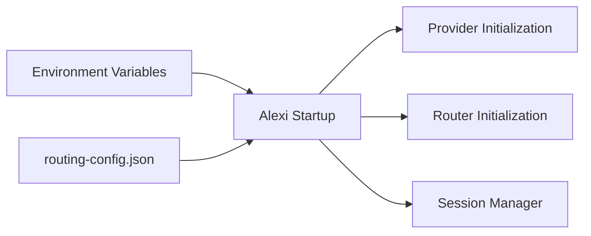
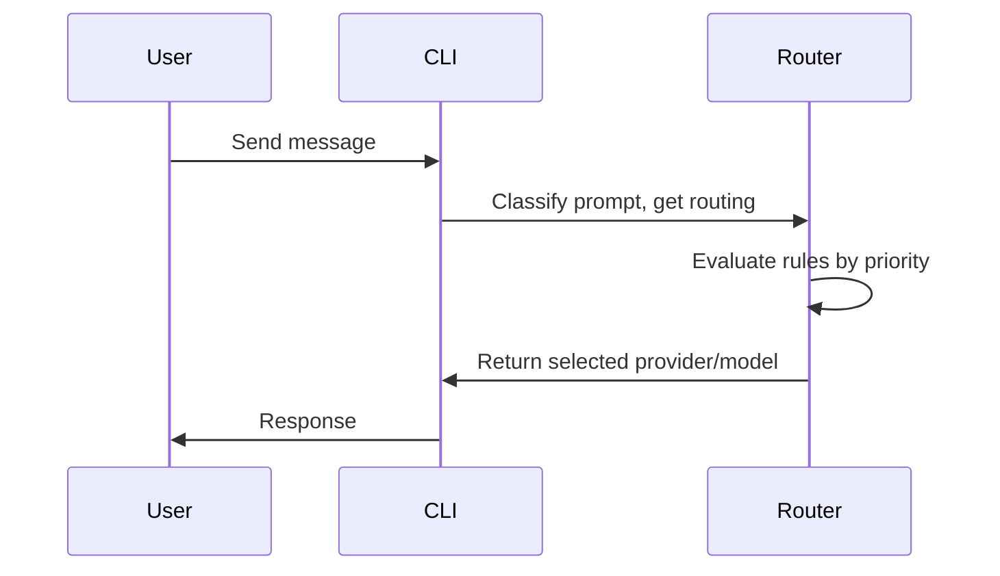
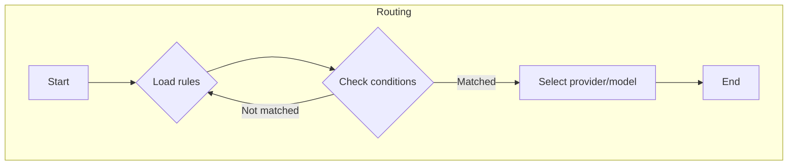
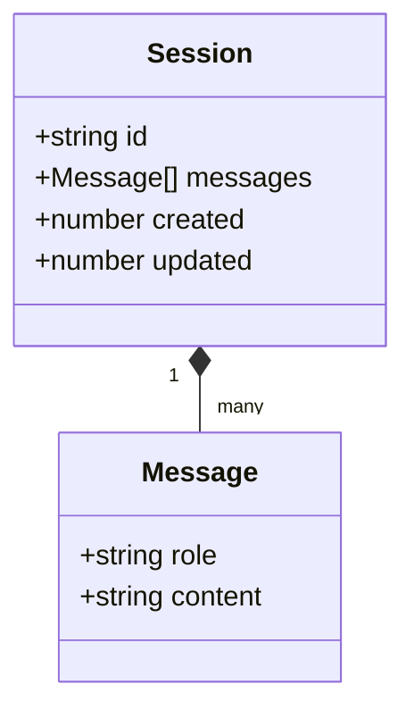
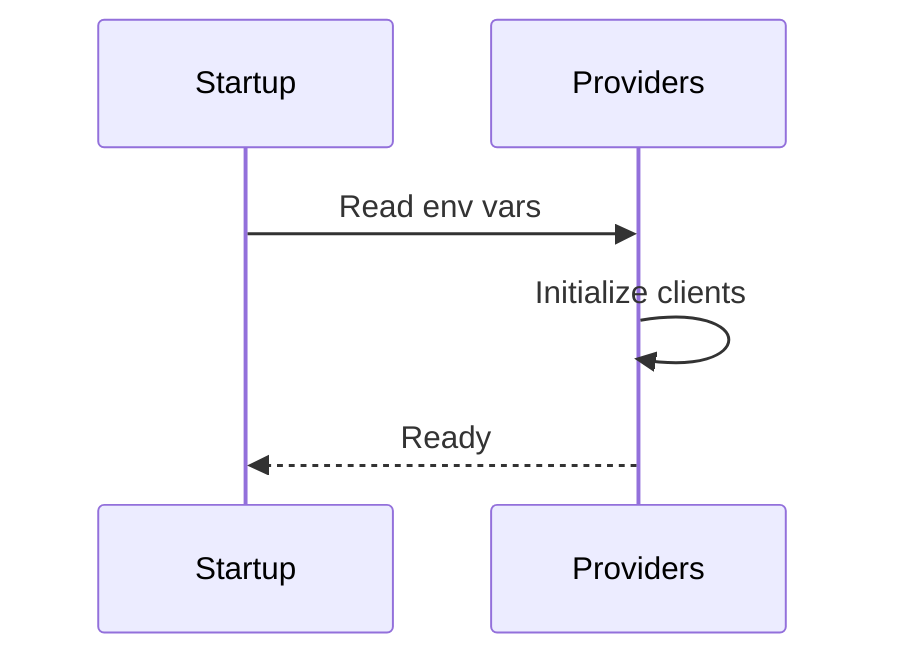

# Alexi Configuration Guide

This document provides comprehensive guidance on configuring Alexi, including routing rules, environment variables, and session storage. Example configurations for common optimization scenarios are included.

## Table of Contents

- [Configuration Overview](#configuration-overview)
- [Environment Variables](#environment-variables)
- [Routing Configuration (routing-config.json)](#routing-configuration-routing-configjson)
- [Session Storage](#session-storage)
- [Example Configuration Scenarios](#example-configuration-scenarios)
- [Mermaid Diagrams](#mermaid-diagrams)

---

## Configuration Overview

Alexi uses environment variables and a JSON-based routing rules file (`routing-config.json`) to control model selection, provider integration, and session storage.

### Configuration Layers



---

## Environment Variables

Environment variables configure base URLs, API keys, model defaults, and SAP AI Core access. These are usually set in a `.env` file (never commit secrets!).

| Variable                       | Description                                     | Example                                 |
|------------------------------- |-------------------------------------------------|-----------------------------------------|
| SAP_PROXY_BASE_URL             | OpenAI-compatible proxy endpoint base URL        | `http://127.0.0.1:3001/v1`             |
| SAP_PROXY_API_KEY              | Proxy API key                                   | `your_secret_key`                      |
| SAP_PROXY_MODEL                | Default proxy model name                        | `gpt-4o`                               |
| AICORE_SERVICE_KEY             | SAP AI Core service key JSON (stringified)      | `'{"clientid":"...","clientsecret":"...","url":"...","serviceurls":{"AI_API_URL":"..."}}'` |
| AICORE_RESOURCE_GROUP          | SAP AI Core resource group                      | `your-resource-group-id`               |
| SESSION_STORAGE_PATH           | (Optional) Path for session storage             | `sessions/`                            |
| ROUTING_CONFIG_PATH            | (Optional) Path to routing config file          | `routing-config.json`                  |

**Example `.env` file:**
```bash
SAP_PROXY_BASE_URL=http://127.0.0.1:3001/v1
SAP_PROXY_API_KEY=your_secret_key
SAP_PROXY_MODEL=gpt-4o
AICORE_SERVICE_KEY='{"clientid":"...","clientsecret":"...","url":"...","serviceurls":{"AI_API_URL":"..."}}'
AICORE_RESOURCE_GROUP=your-resource-group-id
SESSION_STORAGE_PATH=sessions/
ROUTING_CONFIG_PATH=routing-config.json
```

---

## Routing Configuration (`routing-config.json`)

Model selection and routing logic are defined in `routing-config.json`. The file is a list of rules, each with conditions, actions, and priorities.

### File Structure

```json
[
  {
    "id": "simple-gpt4o",
    "priority": 100,
    "if": {
      "prompt_complexity": "simple",
      "task": "chat"
    },
    "route": {
      "provider": "openai-proxy",
      "model": "gpt-4o"
    }
  },
  {
    "id": "complex-claude",
    "priority": 200,
    "if": {
      "prompt_complexity": "complex"
    },
    "route": {
      "provider": "bedrock-converse",
      "model": "claude-3-sonnet"
    }
  }
]
```

### Rule Fields

| Field        | Type     | Description                                              |
|------------- |----------|---------------------------------------------------------|
| id           | string   | Unique rule ID                                          |
| priority     | number   | Higher number = higher priority, evaluated first         |
| if           | object   | Matching conditions (e.g., prompt_complexity, task)      |
| route        | object   | Routing action (provider/model to use)                   |

#### Supported `if` Fields
- `prompt_complexity`: `simple` or `complex`
- `task`: `chat`, `code`, etc.
- `user`: user id/email (optional)
- `time`: time window (optional)

#### Supported Providers
- `openai-proxy`: OpenAI-compatible endpoints
- `bedrock-converse`: AWS Bedrock Converse API
- `anthropic-messages`: Anthropic Messages API

#### Supported Models
- See `alexi models` CLI command for available models

### Routing Evaluation Flow



---

## Session Storage

By default, session data is stored as JSON files in a directory (default: `sessions/`).

- Override storage path with `SESSION_STORAGE_PATH` environment variable.
- Sessions are keyed by session ID, with all turn history preserved.

### Session Storage Example
```json
{
  "id": "session-abc123",
  "messages": [
    { "role": "user", "content": "Hello" },
    { "role": "assistant", "content": "Hi! How can I help?" }
  ],
  "created": 1717778899,
  "updated": 1717778944
}
```

---

## Example Configuration Scenarios

### 1. Cost Optimization
Prioritize cost-efficient models for simple prompts, route complex prompts to premium models.
```json
[
  {
    "id": "cost-efficient-default",
    "priority": 100,
    "if": {
      "prompt_complexity": "simple"
    },
    "route": {
      "provider": "openai-proxy",
      "model": "gpt-3.5-turbo"
    }
  },
  {
    "id": "complex-quality",
    "priority": 200,
    "if": {
      "prompt_complexity": "complex"
    },
    "route": {
      "provider": "bedrock-converse",
      "model": "claude-3-sonnet"
    }
  }
]
```

### 2. Quality Optimization
Always prefer the highest quality model for all prompts.
```json
[
  {
    "id": "quality-preferred",
    "priority": 100,
    "if": {},
    "route": {
      "provider": "bedrock-converse",
      "model": "claude-3-opus"
    }
  }
]
```

### 3. Specific Model Preferences
Route code tasks to Claude, chat tasks to GPT-4o.
```json
[
  {
    "id": "code-to-claude",
    "priority": 200,
    "if": { "task": "code" },
    "route": { "provider": "bedrock-converse", "model": "claude-3-sonnet" }
  },
  {
    "id": "chat-to-gpt4o",
    "priority": 100,
    "if": { "task": "chat" },
    "route": { "provider": "openai-proxy", "model": "gpt-4o" }
  }
]
```

---

## Mermaid Diagrams

### Routing Rule Evaluation (Flowchart)


### Session Storage Structure (Class Diagram)


### Provider Initialization (Sequence Diagram)


---

## References

- See [README.md](../README.md) for CLI and quickstart
- See [docs/ARCHITECTURE.md](./ARCHITECTURE.md) for system diagrams
- See [docs/ROUTING.md](./ROUTING.md) for advanced routing
