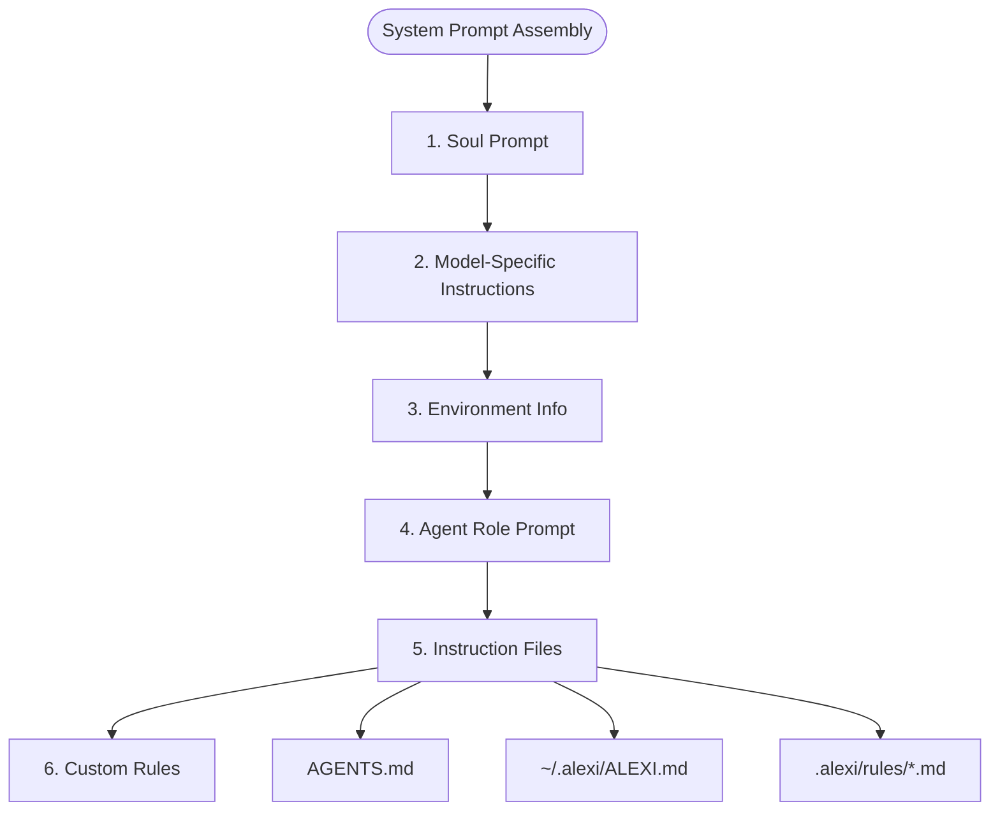

# Configuration Guide

This document describes all configuration options available in Alexi, including environment variables, routing rules, instruction files, and session settings.

## Table of Contents

- [Environment Variables](#environment-variables)
- [Instruction Files](#instruction-files)
- [Routing Configuration](#routing-configuration)
- [Session Configuration](#session-configuration)
- [Permission Configuration](#permission-configuration)

## Environment Variables

### Required Variables

#### AICORE_SERVICE_KEY

SAP AI Core service key in JSON format. Contains authentication credentials and service URLs.

```bash
AICORE_SERVICE_KEY='{
  "clientid": "your-client-id",
  "clientsecret": "your-client-secret",
  "url": "https://your-auth-url.com",
  "serviceurls": {
    "AI_API_URL": "https://api.ai.your-region.cloud.sap"
  }
}'
```

Obtain this from your SAP AI Core service instance in SAP BTP cockpit.

### Optional Variables

#### AICORE_RESOURCE_GROUP

SAP AI Core resource group identifier. Defaults to "default" if not specified.

```bash
AICORE_RESOURCE_GROUP=production
```

#### AICORE_MODEL

Default model to use when no model is explicitly specified.

```bash
AICORE_MODEL=gpt-4o
```

#### SAP_PROXY_BASE_URL

Base URL for OpenAI-compatible proxy endpoint (for proxy mode).

```bash
SAP_PROXY_BASE_URL=http://127.0.0.1:3001/v1
```

#### SAP_PROXY_API_KEY

API key for proxy endpoint authentication.

```bash
SAP_PROXY_API_KEY=your_secret_key
```

#### LOG_LEVEL

Logging verbosity level. Options: `debug`, `info`, `warn`, `error`.

```bash
LOG_LEVEL=info
```

## Instruction Files

Instruction files allow you to customize AI behavior without modifying code. They are automatically loaded and merged into system prompts for every LLM call.

### File Hierarchy

Instruction files are loaded in the following order:



### Project-Level AGENTS.md

**Location**: `<workdir>/AGENTS.md`

**Purpose**: Project-specific instructions for AI agents working in this codebase.

**Format**: Markdown file wrapped in `<agents-md>` tags when loaded.

**Example**:

```markdown
# AGENTS.md

## Project Overview

This is a TypeScript/Node.js CLI application using ES Modules.

## Build & Test Commands

```bash
npm run build
npm test
```

## Code Style

- Use 2-space indentation
- Always use semicolons
- Prefer `const` over `let`

## Important Notes

- Never modify files in `dist/` directory
- All imports must use `.js` extension
```

**Management Commands**:

```bash
# Create from template
/memory init

# Edit in $EDITOR
/memory edit project

# List status
/memory
```

### User-Level ALEXI.md

**Location**: `~/.alexi/ALEXI.md`

**Purpose**: User-wide instructions loaded into every Alexi session across all projects.

**Format**: Markdown file wrapped in `<user-instructions>` tags when loaded.

**Example**:

```markdown
# ALEXI.md

## Personal Coding Preferences

- I prefer descriptive variable names over abbreviations
- Always add JSDoc comments for public functions
- Use async/await instead of .then() chains

## Common Patterns

When implementing error handling, always:
1. Log the error with context
2. Return a structured error response
3. Never expose internal error details to users

## Reminders

- Always run tests before committing
- Update CHANGELOG.md for user-facing changes
```

**Management Commands**:

```bash
# Edit in $EDITOR
/memory edit user

# List status
/memory
```

### Project-Level Rule Files

**Location**: `<workdir>/.alexi/rules/*.md`

**Purpose**: Scoped rule files for specific contexts or features.

**Format**: Each file wrapped in `<rule file="filename.md">` tags when loaded. Files are sorted alphabetically.

**Example Structure**:

```
.alexi/
└── rules/
    ├── api-design.md
    ├── database.md
    └── security.md
```

**Example Rule File** (`.alexi/rules/api-design.md`):

```markdown
# API Design Rules

## RESTful Conventions

- Use plural nouns for resources: `/users`, `/posts`
- Use HTTP methods correctly: GET (read), POST (create), PUT (update), DELETE (remove)
- Return appropriate status codes: 200 (success), 201 (created), 400 (bad request), 404 (not found)

## Error Responses

Always return errors in this format:

```json
{
  "error": {
    "code": "VALIDATION_ERROR",
    "message": "User-friendly error message",
    "details": {}
  }
}
```
```

**Management Commands**:

```bash
# Edit specific rule file
/memory edit api-design.md

# List all rule files
/memory
```

### Instruction File Best Practices

1. **Keep files focused**: Each rule file should cover a specific domain
2. **Use clear headings**: Structure content with markdown headings
3. **Provide examples**: Include code examples for patterns you want followed
4. **Update regularly**: Keep instructions current with project evolution
5. **Version control**: Commit AGENTS.md and .alexi/rules/ to git
6. **User privacy**: Never commit ~/.alexi/ALEXI.md (user-specific)

## Routing Configuration

Routing rules determine which model is selected for each prompt. Rules are evaluated by priority (highest first), and the last matching rule wins.

### Configuration File Locations

Alexi searches for routing configuration in the following order:

1. `<workdir>/routing-config.json`
2. `~/.alexi/routing-config.json`
3. Built-in default rules

### Routing Configuration Format

```json
{
  "rules": [
    {
      "name": "reasoning-for-math",
      "priority": 80,
      "condition": {
        "contains": ["calculate", "math", "equation"]
      },
      "model": "gpt-4.1",
      "reason": "Use reasoning models for math problems"
    },
    {
      "name": "code-tasks",
      "priority": 50,
      "condition": {
        "contains": ["code", "implement", "fix"]
      },
      "model": "anthropic--claude-4.5-sonnet",
      "reason": "Claude excels at code generation"
    }
  ],
  "default": {
    "model": "gpt-4o-mini",
    "reason": "Default cheap model for general queries"
  }
}
```

### Rule Fields

| Field | Type | Required | Description |
|-------|------|----------|-------------|
| `name` | string | Yes | Unique identifier for the rule |
| `priority` | number | Yes | Rule priority (higher = evaluated first) |
| `condition` | object | Yes | Condition for matching prompts |
| `model` | string | Yes | Model ID to use if rule matches |
| `reason` | string | No | Human-readable explanation |

### Condition Types

#### contains

Match if prompt contains any of the specified keywords (case-insensitive).

```json
{
  "condition": {
    "contains": ["debug", "fix", "error"]
  }
}
```

#### regex

Match if prompt matches the regular expression.

```json
{
  "condition": {
    "regex": "\\b(create|implement|build)\\s+(function|class|component)"
  }
}
```

#### complexity

Match based on estimated prompt complexity.

```json
{
  "condition": {
    "complexity": "complex"
  }
}
```

Values: `simple`, `moderate`, `complex`

#### tokenCount

Match if prompt token count is within range.

```json
{
  "condition": {
    "tokenCount": {
      "min": 100,
      "max": 500
    }
  }
}
```

### Example Configurations

#### Cost Optimization

Prefer cheaper models for simple tasks:

```json
{
  "rules": [
    {
      "name": "complex-only",
      "priority": 100,
      "condition": { "complexity": "complex" },
      "model": "gpt-4o"
    }
  ],
  "default": {
    "model": "gpt-4o-mini"
  }
}
```

#### Quality Optimization

Always use the best available model:

```json
{
  "default": {
    "model": "anthropic--claude-4.5-opus"
  }
}
```

#### Task-Specific Routing

Route different task types to specialized models:

```json
{
  "rules": [
    {
      "name": "code-claude",
      "priority": 80,
      "condition": { "contains": ["code", "implement", "refactor"] },
      "model": "anthropic--claude-4.5-sonnet"
    },
    {
      "name": "writing-gpt",
      "priority": 80,
      "condition": { "contains": ["write", "documentation", "explain"] },
      "model": "gpt-4o"
    },
    {
      "name": "reasoning-o1",
      "priority": 90,
      "condition": { "contains": ["calculate", "analyze", "reason"] },
      "model": "gpt-4.1"
    }
  ],
  "default": {
    "model": "gpt-4o-mini"
  }
}
```

## Session Configuration

Sessions store conversation history and are persisted to disk.

### Session Storage Location

Sessions are stored in: `~/.alexi/sessions/`

Each session is a JSON file: `~/.alexi/sessions/<session-id>.json`

### Session Structure

```typescript
interface Session {
  metadata: {
    id: string;
    createdAt: number;
    updatedAt: number;
    title?: string;
    tags?: string[];
  };
  messages: Message[];
  modelUsed?: string;
  totalTokens?: number;
}
```

### Session Management Commands

```bash
# List all sessions
alexi sessions

# Continue a session
alexi chat -m "Follow-up question" --session <session-id>

# Export session to markdown
alexi session-export -s <session-id> -o output.md

# Delete a session
alexi session-delete -s <session-id>
```

## Permission Configuration

The permission system controls file access for tools.

### Permission Rules

Permission rules are evaluated by priority (highest first). The last matching rule determines the action.

```typescript
interface PermissionRule {
  pattern: string;        // Glob pattern or regex
  action: 'allow' | 'deny' | 'ask';
  priority: number;       // Higher = evaluated first
  reason?: string;
}
```

### Default Permission Behavior

In agentic mode (`alexi agent`), Alexi automatically configures permissions:

1. Project root set to `workdir`
2. External directories enabled
3. High-priority allow rules (priority 200) for:
   - Write actions in `workdir/**`
   - Execute actions in `workdir/**`

This enables autonomous file operations without interactive prompts.

### Interactive Mode Permissions

In interactive mode (`alexi interactive`), default behavior is to prompt for all file operations. Users can approve individual operations or create persistent rules.

### Permission Commands

```bash
# List permission rules
/permissions

# Reset session permission grants
/permissions reset
```

### Custom Permission Rules

You can define custom permission rules programmatically:

```typescript
import { getPermissionManager } from './permission/index.js';

const pm = getPermissionManager();

// Allow all reads in project
pm.addRule({
  pattern: '/path/to/project/**',
  action: 'allow',
  priority: 100,
  reason: 'Project files are safe to read'
});

// Deny writes to sensitive directories
pm.addRule({
  pattern: '/path/to/project/.git/**',
  action: 'deny',
  priority: 200,
  reason: 'Never modify .git directory'
});
```
