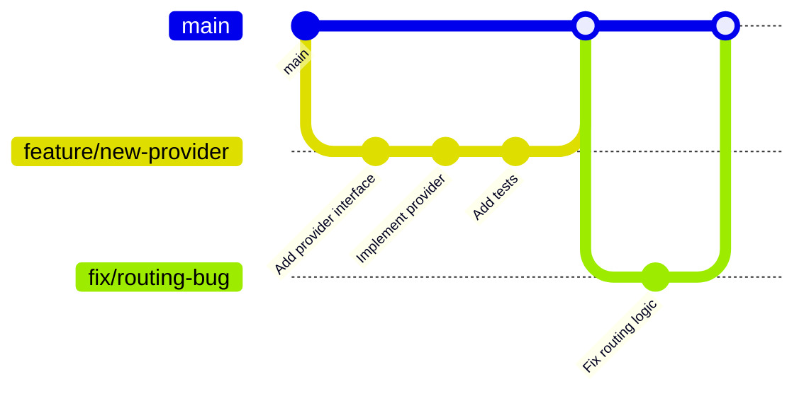
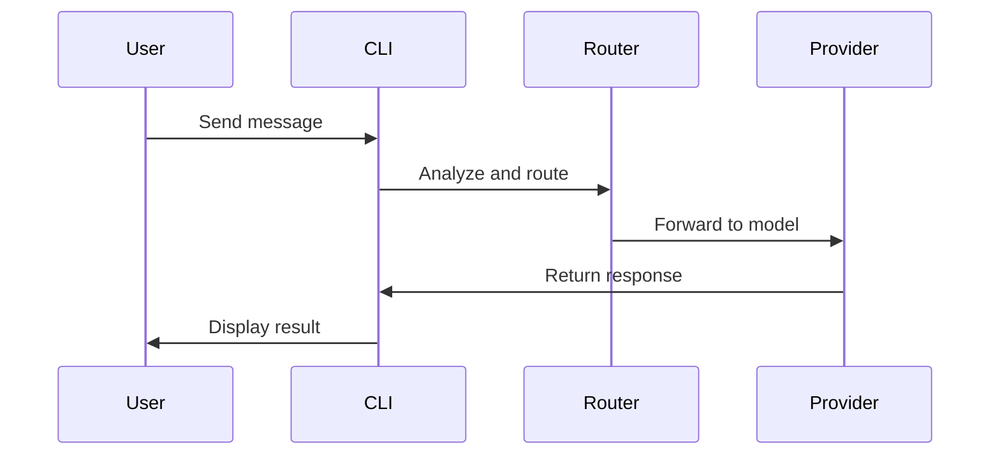
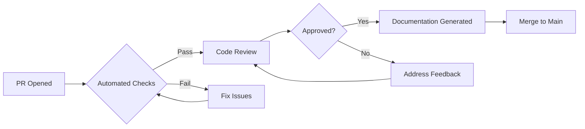

# Contributing to Alexi

Thank you for your interest in contributing to Alexi! This document provides guidelines and best practices for contributing to the project.

## Table of Contents

- [Code of Conduct](#code-of-conduct)
- [Getting Started](#getting-started)
- [Development Workflow](#development-workflow)
- [Coding Standards](#coding-standards)
- [Testing Guidelines](#testing-guidelines)
- [Documentation](#documentation)
- [Pull Request Process](#pull-request-process)
- [Autonomous Systems](#autonomous-systems)

## Code of Conduct

We are committed to providing a welcoming and inclusive environment. Please be respectful and professional in all interactions.

## Getting Started

### Prerequisites

- **Node.js**: Version 22 or higher
- **npm**: Version 10 or higher
- **Git**: Version 2.30 or higher
- **TypeScript**: 5.x (installed via npm)

### Initial Setup

1. **Fork the Repository**

   Fork the repository to your GitHub account.

2. **Clone Your Fork**

   ```bash
   git clone git@github.com:YOUR_USERNAME/alexi.git
   cd alexi
   ```

3. **Add Upstream Remote**

   ```bash
   git remote add upstream git@github.com:ausard/alexi.git
   ```

4. **Install Dependencies**

   ```bash
   npm install
   ```

5. **Configure Environment**

   Copy `.env.example` to `.env` and configure your SAP AI Core credentials:

   ```bash
   cp .env.example .env
   ```

   Edit `.env` with your credentials:
   ```bash
   # SAP AI Core Configuration
   AICORE_SERVICE_KEY='{"clientid":"...","clientsecret":"...","url":"...","serviceurls":{"AI_API_URL":"..."}}'
   AICORE_RESOURCE_GROUP=your-resource-group-id
   
   # Optional: Proxy Configuration
   SAP_PROXY_BASE_URL=http://127.0.0.1:3001/v1
   SAP_PROXY_API_KEY=your_secret_key
   SAP_PROXY_MODEL=gpt-4o
   ```

6. **Build the Project**

   ```bash
   npm run build
   ```

7. **Verify Installation**

   ```bash
   node dist/cli/program.js --version
   node dist/cli/program.js --help
   ```

## Development Workflow

### Branch Strategy



**Branch Naming Convention**:
- `feature/*`: New features (e.g., `feature/add-gemini-provider`)
- `fix/*`: Bug fixes (e.g., `fix/session-persistence`)
- `docs/*`: Documentation updates (e.g., `docs/update-api-guide`)
- `refactor/*`: Code refactoring (e.g., `refactor/router-architecture`)
- `test/*`: Test improvements (e.g., `test/add-provider-tests`)

### Development Process

1. **Create a Feature Branch**

   ```bash
   git checkout -b feature/your-feature-name
   ```

2. **Make Changes**

   Follow the coding standards and write tests for new functionality.

3. **Run Tests Locally**

   ```bash
   npm test
   ```

4. **Build and Verify**

   ```bash
   npm run build
   npm run lint
   ```

5. **Commit Changes**

   Use conventional commit format:

   ```bash
   git commit -m "feat: add new provider for Gemini models"
   git commit -m "fix: resolve session persistence issue"
   git commit -m "docs: update routing documentation"
   ```

   **Commit Types**:
   - `feat`: New feature
   - `fix`: Bug fix
   - `docs`: Documentation changes
   - `refactor`: Code refactoring
   - `test`: Test additions or modifications
   - `chore`: Build process or auxiliary tool changes
   - `style`: Code style changes (formatting, missing semicolons, etc.)
   - `perf`: Performance improvements

6. **Push to Your Fork**

   ```bash
   git push origin feature/your-feature-name
   ```

7. **Create Pull Request**

   Open a pull request from your fork to the main repository.

## Coding Standards

### TypeScript Style Guide

**File Organization**:
```typescript
// 1. Imports (external first, then internal)
import { z } from 'zod';
import * as fs from 'fs/promises';
import { defineTool, type ToolResult } from '../index.js';

// 2. Type definitions
interface MyResult {
  success: boolean;
  data?: string;
}

// 3. Constants
const MAX_RETRIES = 3;

// 4. Implementation
export function myFunction(): MyResult {
  // Implementation
}
```

**Naming Conventions**:
- **Files**: kebab-case (`my-provider.ts`, `session-manager.ts`)
- **Classes**: PascalCase (`SessionManager`, `RouterService`)
- **Interfaces**: PascalCase with descriptive names (`ToolResult`, `ProviderConfig`)
- **Functions**: camelCase (`getSession`, `routeToModel`)
- **Constants**: UPPER_SNAKE_CASE (`MAX_TOKENS`, `DEFAULT_MODEL`)
- **Type Parameters**: Single uppercase letter or PascalCase (`T`, `TParams`, `TResult`)

**Code Style**:
```typescript
// Good: Explicit types for function parameters and return values
export async function executeQuery(
  query: string,
  options: QueryOptions
): Promise<QueryResult> {
  // Implementation
}

// Good: Use const for immutable values
const config = loadConfig();

// Good: Destructuring with types
const { model, temperature }: ModelConfig = getConfig();

// Good: Early returns for error cases
function processData(data: string | null): Result {
  if (!data) {
    return { success: false, error: 'No data provided' };
  }
  
  // Process data
  return { success: true, data: processedData };
}

// Good: Use async/await instead of promises
async function fetchData(): Promise<Data> {
  try {
    const response = await fetch(url);
    return await response.json();
  } catch (error) {
    throw new Error(`Failed to fetch: ${error.message}`);
  }
}
```

**Error Handling**:
```typescript
// Good: Specific error types
class ProviderError extends Error {
  constructor(
    message: string,
    public readonly provider: string,
    public readonly statusCode?: number
  ) {
    super(message);
    this.name = 'ProviderError';
  }
}

// Good: Comprehensive error handling
async function callProvider(request: Request): Promise<Response> {
  try {
    return await provider.send(request);
  } catch (error) {
    if (error instanceof ProviderError) {
      logger.error('Provider error', { provider: error.provider });
      throw error;
    }
    throw new Error(`Unexpected error: ${error.message}`);
  }
}
```

### Tool System Patterns

When implementing new tools, follow the established pattern:

```typescript
import { z } from 'zod';
import { defineTool, type ToolResult } from '../index.js';

// 1. Define parameter schema with descriptions
const MyToolParamsSchema = z.object({
  param1: z.string().describe('Description of param1'),
  param2: z.number().optional().describe('Optional param2'),
});

// 2. Define result interface
interface MyToolResult {
  success: boolean;
  data?: string;
}

// 3. Define tool with permission requirements
export const myTool = defineTool<typeof MyToolParamsSchema, MyToolResult>({
  name: 'my_tool',
  description: 'Clear description of what the tool does',
  
  parameters: MyToolParamsSchema,
  
  permission: {
    action: 'read', // or 'write', 'execute'
    getResource: (params, context) => {
      // Resolve resource path, using context.workdir if needed
      return resolveResourcePath(params, context);
    },
  },
  
  async execute(params, context): Promise<ToolResult<MyToolResult>> {
    try {
      // Implementation
      return {
        success: true,
        data: { /* result data */ },
      };
    } catch (error) {
      return {
        success: false,
        error: error.message,
      };
    }
  },
});
```

**Key Requirements**:
- Always use Zod schemas for parameter validation
- Provide clear descriptions for all parameters
- Implement proper permission checks using context
- Handle relative and absolute paths correctly
- Return consistent `ToolResult` structure
- Include comprehensive error handling

### Permission System

When implementing tools that access resources, use the permission system:

```typescript
permission: {
  action: 'write',
  getResource: (params, context) => {
    // Resolve relative paths to absolute using workdir
    if (path.isAbsolute(params.filePath)) {
      return params.filePath;
    }
    return path.join(context?.workdir || process.cwd(), params.filePath);
  },
}
```

**Permission Actions**:
- `read`: Reading files or data
- `write`: Writing or modifying files
- `execute`: Executing commands or scripts

## Testing Guidelines

### Test Structure

```typescript
import { describe, it, expect, beforeEach, afterEach } from 'vitest';
import { myFunction } from '../src/my-module.js';

describe('MyModule', () => {
  beforeEach(() => {
    // Setup
  });

  afterEach(() => {
    // Cleanup
  });

  describe('myFunction', () => {
    it('should return expected result for valid input', () => {
      const result = myFunction('valid input');
      expect(result).toBe('expected output');
    });

    it('should handle edge cases', () => {
      const result = myFunction('');
      expect(result).toBe(null);
    });

    it('should throw error for invalid input', () => {
      expect(() => myFunction(null)).toThrow('Invalid input');
    });
  });
});
```

### Test Coverage

Aim for comprehensive test coverage:
- **Unit Tests**: Test individual functions and classes
- **Integration Tests**: Test interactions between modules
- **End-to-End Tests**: Test complete workflows

### Running Tests

```bash
# Run all tests
npm test

# Run tests in watch mode
npm run test:watch

# Run tests with coverage
npm run test:coverage
```

## Documentation

### Code Documentation

**Use JSDoc comments for public APIs**:

```typescript
/**
 * Routes a message to the appropriate model based on complexity analysis.
 * 
 * @param message - The user message to route
 * @param options - Routing options including cost preferences
 * @returns The selected model ID and routing confidence
 * 
 * @example
 * ```typescript
 * const result = await router.route('Explain quantum computing', {
 *   preferCheap: true
 * });
 * console.log(result.modelId); // 'claude-3-5-haiku'
 * ```
 */
export async function route(
  message: string,
  options: RoutingOptions
): Promise<RoutingResult> {
  // Implementation
}
```

### Documentation Files

When making changes, update relevant documentation:

| Change Type | Documentation to Update |
|------------|------------------------|
| CLI commands | `docs/API.md`, `README.md` |
| Architecture changes | `docs/ARCHITECTURE.md` |
| New provider | `docs/PROVIDERS.md` |
| Configuration options | `docs/CONFIGURATION.md` |
| Workflow changes | `docs/AUTOMATION.md` |
| All changes | `CHANGELOG.md` |

**Mermaid Diagrams**:

Include diagrams for complex workflows:

```markdown
## Process Flow


```

## Pull Request Process

### PR Checklist

Before submitting a pull request, ensure:

- [ ] Code follows TypeScript style guidelines
- [ ] All tests pass (`npm test`)
- [ ] Code builds successfully (`npm run build`)
- [ ] Linting passes (`npm run lint`)
- [ ] New features have tests
- [ ] Documentation is updated
- [ ] Commit messages follow conventional format
- [ ] PR description clearly explains changes

### PR Template

```markdown
## Description

Brief description of changes

## Type of Change

- [ ] Bug fix
- [ ] New feature
- [ ] Breaking change
- [ ] Documentation update

## Changes Made

- Change 1
- Change 2

## Testing

Describe how you tested the changes

## Related Issues

Closes #123
```

### Review Process



**Review Criteria**:
1. **Code Quality**: Follows standards, well-structured
2. **Functionality**: Works as intended, handles edge cases
3. **Tests**: Adequate test coverage, tests pass
4. **Documentation**: Clear, accurate, complete
5. **Performance**: No significant performance regressions

### Automated Documentation

The repository uses an automated documentation workflow that:
1. Analyzes code changes in your PR
2. Generates/updates relevant documentation
3. Commits documentation to your PR branch
4. Posts a summary comment

**What to Review**:
- Verify generated documentation is accurate
- Check that Mermaid diagrams render correctly
- Ensure CHANGELOG entries are appropriate
- Confirm all code examples work

## Autonomous Systems

### Upstream Sync System

Alexi automatically syncs with upstream AI coding assistant repositories:

**Repositories Monitored**:
- `Kilo-Org/kilocode`: Kilo AI patterns
- `anomalyco/opencode`: OpenCode patterns  
- `anthropics/claude-code`: Claude Code patterns

**How It Works**:
1. Daily sync at 06:00 UTC
2. Analyzes changes with AI
3. Creates PR with integration recommendations
4. Auto-merges low-risk changes

**Contributing to Sync Process**:
- Review sync PRs for breaking changes
- Test integrated patterns locally
- Provide feedback on AI analysis accuracy

### Documentation Bot

The documentation bot uses Alexi's own CLI to generate docs:

**Features**:
- Reads existing documentation
- Uses `write` and `edit` tools to update files
- Generates Mermaid diagrams
- Updates CHANGELOG with conventional commits

**Improving the Bot**:
- Update prompt templates in `.github/templates/`
- Enhance tool implementations for better file operations
- Improve scope detection logic in workflow

## Getting Help

- **Issues**: Open an issue for bugs or feature requests
- **Discussions**: Use GitHub Discussions for questions
- **Documentation**: Check existing docs in `docs/` directory
- **Code Examples**: Review existing code for patterns

## License

By contributing, you agree that your contributions will be licensed under the same license as the project.

---

Thank you for contributing to Alexi! Your contributions help make AI orchestration more accessible and powerful.
