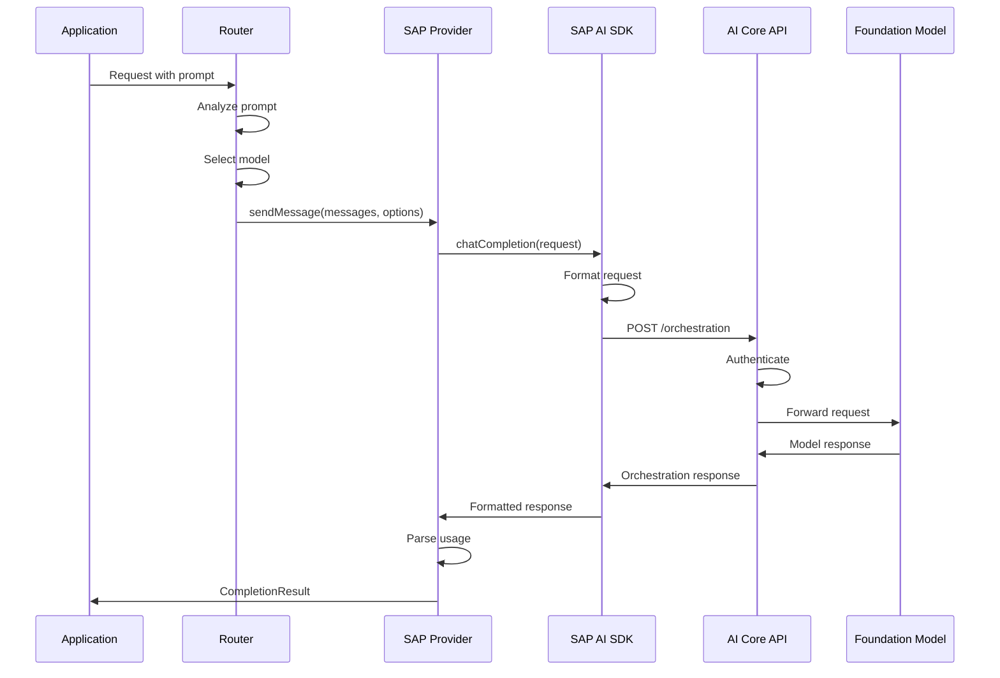
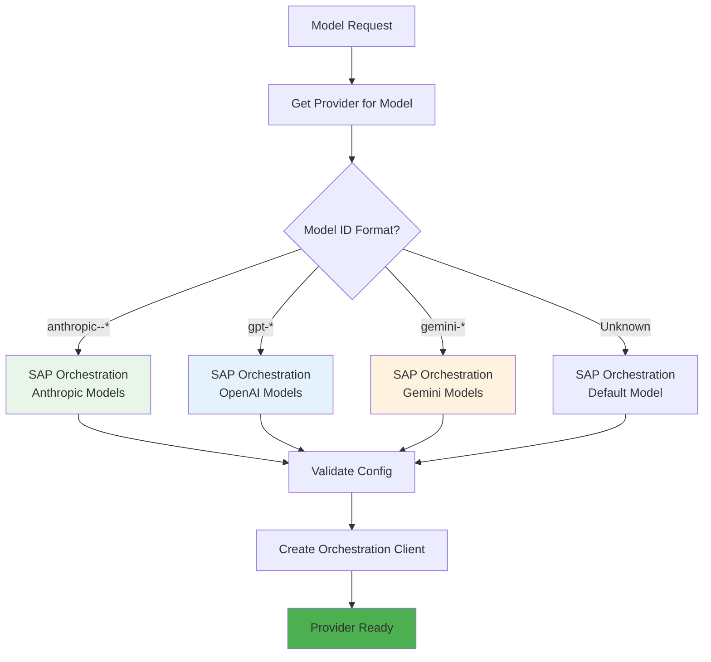

# Providers

This document describes the provider system in Alexi, focusing on the SAP AI Core Orchestration provider which is the exclusive LLM backend for the application.

## Table of Contents

- [Overview](#overview)
- [SAP AI Core Orchestration Provider](#sap-ai-core-orchestration-provider)
- [Provider Architecture](#provider-architecture)
- [Supported Models](#supported-models)
- [Configuration](#configuration)
- [Usage Examples](#usage-examples)

## Overview

Alexi uses a provider abstraction layer to communicate with LLM backends. Unlike multi-provider AI orchestrators, **Alexi exclusively uses SAP AI Core Orchestration API** as its LLM backend. This design decision ensures enterprise-grade security, compliance, and integration with SAP ecosystems.

### Provider Architecture

```mermaid
graph TB
    subgraph Application[\"Application Layer\"]
        CLI[CLI Commands]
        Core[Core Orchestrator]
        Agent[Agent System]
    end
    
    subgraph Provider[\"Provider Layer\"]
        Interface[Provider Interface]
        SAP[SAP Orchestration Provider]
    end
    
    subgraph Backend[\"SAP AI Core\"]
        Orch[Orchestration API]
        Models[Model Deployments]
        Auth[Authentication]
    end
    
    CLI --> Core
    Core --> Interface
    Agent --> Interface
    Interface --> SAP
    SAP --> Orch
    Orch --> Models
    SAP --> Auth
    
    style SAP fill:#4CAF50
    style Orch fill:#2196F3
    style Models fill:#FF9800
```

## SAP AI Core Orchestration Provider

The SAP Orchestration provider is implemented in `src/providers/sapOrchestration.ts` and uses the official `@sap-ai-sdk/orchestration` SDK.

### Features

- **Native Integration**: Direct integration with SAP AI Core using official SDK
- **Model Agnostic**: Supports multiple foundation models through unified API
- **Token Tracking**: Automatic usage tracking and cost estimation
- **Streaming Support**: Real-time streaming responses
- **Tool Calling**: Native function calling support for agentic workflows
- **Error Handling**: Comprehensive error handling with retry logic

### Provider Interface

```typescript
interface Provider {
  /**
   * Send a message to the LLM and get a response
   */
  sendMessage(
    messages: Message[],
    options: SendMessageOptions
  ): Promise<CompletionResult>;

  /**
   * Send a message with streaming response
   */
  sendMessageStream(
    messages: Message[],
    options: SendMessageOptions,
    onChunk: (chunk: string) => void
  ): Promise<CompletionResult>;

  /**
   * Get provider name
   */
  getName(): string;

  /**
   * Check if provider supports a model
   */
  supportsModel(modelId: string): boolean;
}
```

### Implementation Details

```typescript
// src/providers/sapOrchestration.ts
import { OrchestrationClient } from '@sap-ai-sdk/orchestration';

export class SAPOrchestrationProvider implements Provider {
  private client: OrchestrationClient;
  
  constructor(config: SAPOrchestrationConfig) {
    this.client = new OrchestrationClient({
      resourceGroup: config.resourceGroup,
      // Authentication handled by @sap-ai-sdk
    });
  }

  async sendMessage(
    messages: Message[],
    options: SendMessageOptions
  ): Promise<CompletionResult> {
    const response = await this.client.chatCompletion({
      messages: this.formatMessages(messages),
      model: options.model,
      temperature: options.temperature,
      maxTokens: options.maxTokens,
      tools: options.tools,
    });

    return {
      text: response.content,
      usage: response.usage,
      toolCalls: response.toolCalls,
      finishReason: response.finishReason,
    };
  }

  // ... streaming and other methods
}
```

## Provider Call Flow



## Supported Models

Alexi supports all foundation models available through SAP AI Core Orchestration API.

### Model Categories

#### Anthropic Claude Models

```typescript
const CLAUDE_MODELS = [
  'anthropic--claude-4.5-opus',
  'anthropic--claude-4.5-sonnet',
  'anthropic--claude-4-sonnet',
  'anthropic--claude-4-haiku',
];
```

**Characteristics**:
- Excellent code generation and analysis
- Strong reasoning capabilities
- Large context windows (200K+ tokens)
- Native tool calling support

#### OpenAI GPT Models

```typescript
const OPENAI_MODELS = [
  'gpt-4.1',
  'gpt-4o',
  'gpt-4o-mini',
  'gpt-4-turbo',
];
```

**Characteristics**:
- Extended reasoning with GPT-4.1
- Fast inference with GPT-4o
- Cost-effective with GPT-4o-mini
- Strong general-purpose capabilities

#### Google Gemini Models

```typescript
const GEMINI_MODELS = [
  'gemini-2.0-flash-thinking',
  'gemini-2.0-flash',
  'gemini-1.5-pro',
  'gemini-1.5-flash',
];
```

**Characteristics**:
- Multimodal capabilities
- Fast inference with Flash models
- Thinking mode for complex reasoning
- Large context windows

### Model Selection

Models are selected through:

1. **Explicit Override**: `--model` flag in CLI commands
2. **Auto-Routing**: Automatic selection based on prompt analysis
3. **User Default**: Persistent default model in ~/.alexi/config.json
4. **Environment Variable**: AICORE_MODEL environment variable
5. **System Default**: Fallback to anthropic--claude-4-sonnet

### Model Capabilities

```typescript
interface ModelCapability {
  id: string;
  name: string;
  provider: 'anthropic' | 'openai' | 'google';
  tier: 'cheap' | 'balanced' | 'expensive';
  strengths: string[];
  contextWindow: number;
  supportsTools: boolean;
  supportsStreaming: boolean;
  supportsReasoning: boolean;
}
```

## Configuration

### Environment Variables

#### Required

```bash
# SAP AI Core service key (JSON format)
export AICORE_SERVICE_KEY='{
  "clientid": "your-client-id",
  "clientsecret": "your-client-secret",
  "url": "https://your-auth-url",
  "serviceurls": {
    "AI_API_URL": "https://your-ai-api-url"
  }
}'
```

#### Optional

```bash
# Resource group (default: "default")
export AICORE_RESOURCE_GROUP=production

# Default model
export AICORE_MODEL=gpt-4o
```

### Service Key Format

The SAP AI Core service key contains:

- **clientid**: OAuth2 client ID
- **clientsecret**: OAuth2 client secret
- **url**: Authentication server URL
- **serviceurls.AI_API_URL**: AI Core API base URL

### Obtaining a Service Key

1. Log in to SAP BTP Cockpit
2. Navigate to your SAP AI Core instance
3. Create a new service key
4. Copy the JSON credentials
5. Set as AICORE_SERVICE_KEY environment variable

### Resource Groups

Resource groups organize AI Core resources:

```bash
# List deployments in a resource group
alexi models --resource-group production

# Use different resource group
export AICORE_RESOURCE_GROUP=development
alexi chat -m "Hello"
```

## Usage Examples

### Basic Chat

```typescript
import { getProviderForModel } from './providers/index.js';

const provider = getProviderForModel('anthropic--claude-4-sonnet');

const result = await provider.sendMessage(
  [{ role: 'user', content: 'Hello, world!' }],
  {
    model: 'anthropic--claude-4-sonnet',
    temperature: 0.7,
    maxTokens: 1000,
  }
);

console.log(result.text);
console.log(`Tokens used: ${result.usage.total_tokens}`);
```

### Streaming Response

```typescript
const provider = getProviderForModel('gpt-4o');

await provider.sendMessageStream(
  [{ role: 'user', content: 'Write a story' }],
  {
    model: 'gpt-4o',
    temperature: 0.8,
  },
  (chunk) => {
    process.stdout.write(chunk);
  }
);
```

### Model Parameters

The SAP orchestration provider plumbs the following sampling parameters
through `OrchestrationConfig` and per-call `CompletionOptions`. Per-call
options take precedence over config defaults.

| Parameter          | `modelParams` key   | Compatibility                                                                                  |
| ------------------ | ------------------- | ---------------------------------------------------------------------------------------------- |
| `temperature`      | `temperature`       | Universal.                                                                                     |
| `maxTokens`        | `max_tokens`        | Universal.                                                                                     |
| `topP`             | `top_p`             | Universal.                                                                                     |
| `topK`             | `top_k`             | Honored by Anthropic Claude family models; silently dropped by OpenAI-family deployments.      |
| `frequencyPenalty` | `frequency_penalty` | OpenAI-family models. Anthropic deployments ignore the field.                                  |
| `presencePenalty`  | `presence_penalty`  | OpenAI-family models. Anthropic deployments ignore the field.                                  |

```typescript
const provider = getProviderForModel('anthropic--claude-4.7-opus');

const result = await provider.complete(
  [{ role: 'user', content: 'Brainstorm 5 names' }],
  { temperature: 0.9, topK: 40 }
);
```

### Tool Calling

```typescript
const provider = getProviderForModel('anthropic--claude-4-sonnet');

const result = await provider.sendMessage(
  [{ role: 'user', content: 'Read the file README.md' }],
  {
    model: 'anthropic--claude-4-sonnet',
    tools: [
      {
        name: 'read',
        description: 'Read a file',
        parameters: {
          type: 'object',
          properties: {
            filePath: { type: 'string' },
          },
          required: ['filePath'],
        },
      },
    ],
  }
);

if (result.toolCalls && result.toolCalls.length > 0) {
  console.log('Tool calls requested:', result.toolCalls);
}
```

### List Available Models

```bash
# List all deployments
alexi models

# Filter by status
alexi models --status RUNNING

# JSON output
alexi models --json

# Specific resource group
alexi models --resource-group production
```

### Query Deployments Programmatically

```typescript
import { DeploymentApi } from '@sap-ai-sdk/ai-api';

const response = await DeploymentApi.deploymentQuery(
  {},
  { 'AI-Resource-Group': 'default' }
).execute();

const deployments = response.resources || [];
const running = deployments.filter(d => d.status === 'RUNNING');

console.log(`Found ${running.length} running deployments`);
```

## Provider Resolution

The provider resolution flow determines which provider to use for a given model:



### Provider Selection Logic

```typescript
// src/providers/index.ts
export function getProviderForModel(modelId: string): Provider {
  // All models use SAP Orchestration provider
  return new SAPOrchestrationProvider({
    resourceGroup: process.env.AICORE_RESOURCE_GROUP || 'default',
    model: modelId,
  });
}

export function getDefaultModel(): string {
  // Priority: user config > env var > system default
  return (
    getConfigDefaultModel() ||
    process.env.AICORE_MODEL ||
    'anthropic--claude-4-sonnet'
  );
}
```

## Error Handling

### Common Errors

#### Authentication Errors

```typescript
{
  success: false,
  error: 'Authentication failed: Invalid client credentials'
}
```

**Solution**: Verify AICORE_SERVICE_KEY is correctly formatted

#### Model Not Found

```typescript
{
  success: false,
  error: 'Model not found: invalid-model-id'
}
```

**Solution**: Use `alexi models` to list available models

#### Rate Limiting

```typescript
{
  success: false,
  error: 'Rate limit exceeded. Please try again later.'
}
```

**Solution**: Implement exponential backoff or reduce request frequency

#### Quota Exceeded

```typescript
{
  success: false,
  error: 'Resource quota exceeded for resource group'
}
```

**Solution**: Check SAP AI Core quotas or use different resource group

## Streaming Error Semantics

Every provider that implements `streamComplete(messages, options):
AsyncGenerator<StreamChunk>` MUST honor the following three rules. The
orchestrator at `src/core/streamingOrchestrator.ts` relies on them to
persist partial state on failure.

1. **Network and transport errors surface as a rejected promise on the
   generator.** Implementations MUST `throw` (or let the underlying
   fetch/SSE error propagate) when the upstream stream fails. Returning
   silently from the generator masks the failure and causes the
   orchestrator to record a successful but truncated assistant turn.

2. **Providers MAY yield a final `{ usage }` chunk before throwing.**
   If usage metadata is observed before the failure (for example, the
   prompt tokens were billed and emitted on the first SSE event), the
   provider SHOULD yield one last `StreamChunk` with the usage block
   populated so the orchestrator can record partial cost via
   `getCostTracker().recordUsage(...)`.

3. **Providers MUST NOT swallow errors and return early.** Catching a
   transport error to log and then `return`ing from the generator is
   forbidden; it breaks the settle path in the orchestrator. Use the
   standard JavaScript `throw` mechanism and let the orchestrator handle
   session persistence.

A shared conformance test helper is planned at
`src/providers/__tests__/streaming-contract.ts` (TODO). Until that
exists, each provider's test file should include at least one case
asserting rule 1: feed a mock transport that errors mid-stream, then
assert the generator rejects rather than returning.

The orchestrator's settle behaviour that depends on these rules is in
`src/core/streamingOrchestrator.ts` (around the for-await loop), with
the equivalent non-stream path in `src/core/agenticChat.ts`.

## Streaming Abort Semantics

User-initiated cancellation of an in-flight streaming turn (Ctrl+C in the
CLI, `abort()` in the TUI's `useStreamChat` hook) travels through the
pipeline as follows:

1. The caller supplies an `AbortSignal` in `StreamingOptions.signal`
   (`src/core/streamingOrchestrator.ts` line 27).
2. `streamChat` (line 174-181) merges the signal into the
   `CompletionOptions` bag it hands to
   `provider.streamComplete(messages, providerOpts)`.
3. `SapOrchestrationProvider.streamComplete`
   (`src/providers/sapOrchestration.ts` line 876-940) forwards the signal
   to the SDK as the *second* argument of `client.stream(request, signal,
   options, requestConfig)` (line 887-892).
4. The SAP SDK's `OrchestrationClient.stream()` creates its own
   `AbortController`, registers `signal.addEventListener('abort', () =>
   controller.abort())`, and hands the controller to the underlying
   `SseStream`. On abort, the SDK aborts the in-flight HTTP request and
   the `SseStream` `finally` block calls `controller.abort()` for
   defense-in-depth (see `node_modules/@sap-ai-sdk/core/dist/stream/`).

**Abort contract**: callers cancelling a stream MUST fire the
`AbortSignal`. Merely `break`-ing out of the outer `for await` loop is
*not* sufficient when the server has stopped sending SSE frames but has
not closed the connection: the underlying `for await (const chunk of
response.stream)` inside the provider is parked on
`await response.data.next()`, and Node's async generator semantics
cannot preempt a pending `await` via `return()` (this is the failure
mode captured by Cline PR #12249). In that state, aborting the signal
causes the HTTP request to reject, unwinding both the SDK's finally
block and the provider generator.

**Trap to avoid**: never write consumer code that relies on
`generator.return()` alone (or a bare `for await ... break`) to unstick
a stalled stream. Always couple it with `signal.abort()`. The tests in
`tests/providers/sapOrchestration-streamAbort.test.ts` document this
contract, including a minimal reproducer of the preemption trap.

**Current state (2026-07)**: All in-tree consumers of `streamChat`
(`useStreamChat`, `interactive.ts`, `server/index.ts`) already abort via
signal on cancellation, so no watchdog wrapper is needed today. If a
future consumer is added that cannot obtain an `AbortSignal` at the
edge, wrap `provider.streamComplete` in a hand-rolled AsyncIterator
whose `return()` fires the abort synchronously (the Cline #12249
pattern).

## Performance Considerations

### Token Optimization

- Use cheaper models for simple tasks (gpt-4o-mini)
- Implement context compaction for long conversations
- Monitor token usage with `/tokens` command

### Response Time

- Use streaming for better perceived performance
- Select geographically closer resource groups
- Consider model inference speed (Flash models are faster)

### Cost Management

- Enable auto-routing with `--prefer-cheap` flag
- Set up routing rules to prefer cost-effective models
- Monitor usage with `/cost` command

## Security

### Credential Management

- Never commit AICORE_SERVICE_KEY to version control
- Use environment variables or secure secret management
- Rotate credentials regularly
- Use separate service keys for different environments

### Network Security

- All communication uses HTTPS
- OAuth2 authentication with client credentials
- Support for corporate proxy configurations

### Auto-CA Harvesting

Corporate environments frequently front SAP AI Core (or any provider proxy) with an
internal TLS-terminating proxy that presents a certificate signed by an internal CA.
Without additional configuration, Node.js will reject those connections with
`UNABLE_TO_VERIFY_LEAF_SIGNATURE` because the corporate CA is not part of the
Mozilla root store baked into Node.

Alexi automatically discovers OS trust anchors at CLI startup and merges them into
the Node.js HTTPS agent, so those internal CAs are trusted without any per-user
setup. The mechanism lives in `src/providers/ca.ts` and runs as a side effect of
loading `src/providers/index.ts`.

**Discovery per platform**:

- **macOS** — runs
  `security find-certificate -a -p /System/Library/Keychains/SystemRootCertificates.keychain`
  and the same command against `/Library/Keychains/System.keychain`, then parses
  every PEM `CERTIFICATE` block from the combined output.
- **Linux** — reads the first existing file from this ordered list:
  1. `/etc/ssl/certs/ca-certificates.crt` (Debian / Ubuntu)
  2. `/etc/pki/tls/certs/ca-bundle.crt` (RHEL / CentOS / Fedora)
  3. `/etc/ssl/ca-bundle.pem` (openSUSE)
  4. `/etc/ssl/cert.pem` (Alpine / BSD-style)
- **Windows** — currently a TODO. Windows users should either set
  `NODE_EXTRA_CA_CERTS` manually or install the optional `win-ca` package into
  their local Node runtime. Contributions to add native Windows cert-store
  extraction are welcome — see `harvestCAs` in `src/providers/ca.ts`.

Harvested certificates are merged with:

- Node's built-in trust store (`tls.rootCertificates`) — public HTTPS endpoints
  keep working exactly as before.
- Anything already referenced by `NODE_EXTRA_CA_CERTS` — user-configured extras
  are preserved, not replaced.
- Any `ca` list already installed on `https.globalAgent` by earlier code.

The merged list is installed on `https.globalAgent.options.ca`, so all provider
HTTPS requests inherit it. The harvest runs at most once per process (the result
is cached in memory), so reading the macOS Keychain does not slow down every
request.

**Disabling the feature**:

Set `ALEXI_DISABLE_CA_HARVEST=1` (or `true`, `yes`) to skip the harvest entirely.
This is useful when:

- You want a strictly minimal trust store (only Node's built-in roots).
- The macOS `security` command is slow or blocked on your machine.
- You are debugging TLS validation issues and want to isolate the harvest from
  the equation.

`NODE_EXTRA_CA_CERTS` continues to work as it always has when the harvest is
disabled — Node applies it natively.

**Programmatic API (advanced consumers / diagnostics)**:

The re-exports from `src/providers/index.ts` expose the harvest surface for
diagnostics, custom trust-store composition, and tests:

```typescript
import {
  detectPlatform,
  isCaHarvestDisabled,
  harvestCAs,
  getHarvestedCAs,
  readNodeExtraCACerts,
  installHarvestedCAs,
  LINUX_CA_BUNDLE_PATHS,
  MACOS_KEYCHAINS,
  type CaPlatform,
  type InstallResult,
} from 'alexi/providers';

// Inspect what the harvester would trust on this machine.
const platform: CaPlatform = detectPlatform();
const pems: string[] = getHarvestedCAs();
console.log(`platform=${platform} harvested=${pems.length}`);

// Re-run the merge with an explicit agent (e.g. per-request https.Agent).
const result: InstallResult = installHarvestedCAs({ agent: myAgent });
// { disabled: false, harvestedCount: 174, extraCount: 0, totalCount: 288 }
```

Key contract points from `src/providers/ca.ts`:

- `installHarvestedCAs` is idempotent — subsequent calls dedupe against the
  agent's existing `options.ca` list and re-merge in the same order
  (Node defaults → existing → `NODE_EXTRA_CA_CERTS` → harvested).
- `getHarvestedCAs` caches the harvest for the process lifetime; the internal
  `_resetHarvestedCAsCache()` hook exists solely for unit tests and is not part
  of the public surface.
- `harvestLinuxCAs` accepts injectable `reader` / `exists` functions and
  `harvestMacosCAs` accepts an injectable `SecurityRunner`, so tests can
  exercise the harvester without touching real filesystem or subprocess I/O.

### Data Privacy

- All data processed through SAP AI Core
- Compliance with enterprise data governance
- No data sent to third-party services

## Troubleshooting

### Provider Initialization Fails

1. Check AICORE_SERVICE_KEY format (must be valid JSON)
2. Verify network connectivity to SAP AI Core
3. Confirm resource group exists
4. Check service key permissions

### Model Not Available

1. List available models: `alexi models`
2. Check deployment status
3. Verify resource group access
4. Confirm model is deployed in your region

### Slow Response Times

1. Check network latency to AI Core
2. Consider using faster models (Flash variants)
3. Reduce context window size
4. Enable streaming for better UX

### `UNABLE_TO_VERIFY_LEAF_SIGNATURE` / `SELF_SIGNED_CERT_IN_CHAIN`

Alexi auto-harvests OS trust anchors on macOS and Linux — see
[Auto-CA Harvesting](#auto-ca-harvesting). If you still see cert validation
errors:

1. Confirm the harvest is not disabled: check `env | grep ALEXI_DISABLE_CA_HARVEST`.
2. Verify the CA is installed in the OS trust store your platform reads from
   (the paths listed under Auto-CA Harvesting).
3. As a fallback, export `NODE_EXTRA_CA_CERTS=/path/to/corporate-bundle.pem` and
   re-run. Alexi will merge that bundle into its HTTPS agent alongside the
   harvested anchors.
4. On Windows, either install the optional `win-ca` package or set
   `NODE_EXTRA_CA_CERTS` — native Windows harvest is not yet implemented.

## Related Documentation

- [Architecture](ARCHITECTURE.md) - System architecture and design
- [Configuration](CONFIGURATION.md) - Configuration options
- [API Documentation](API.md) - CLI commands and TypeScript APIs
