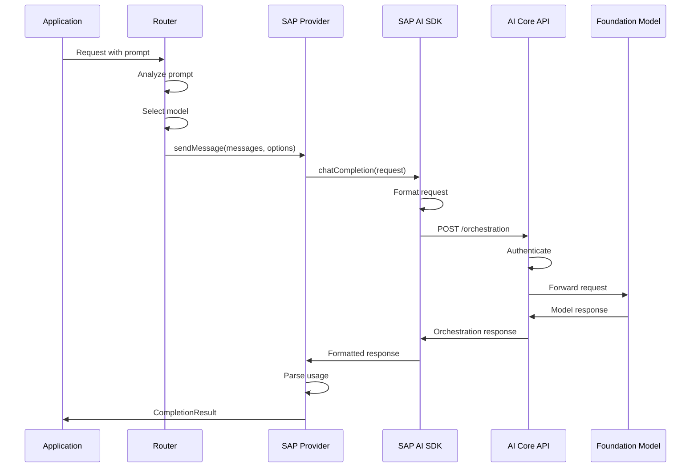
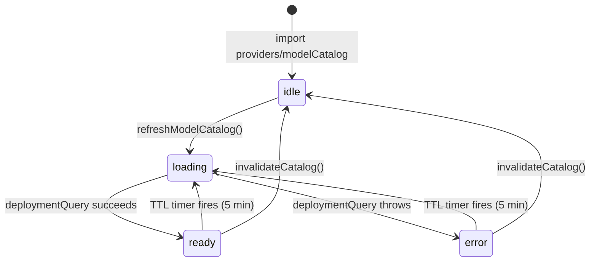
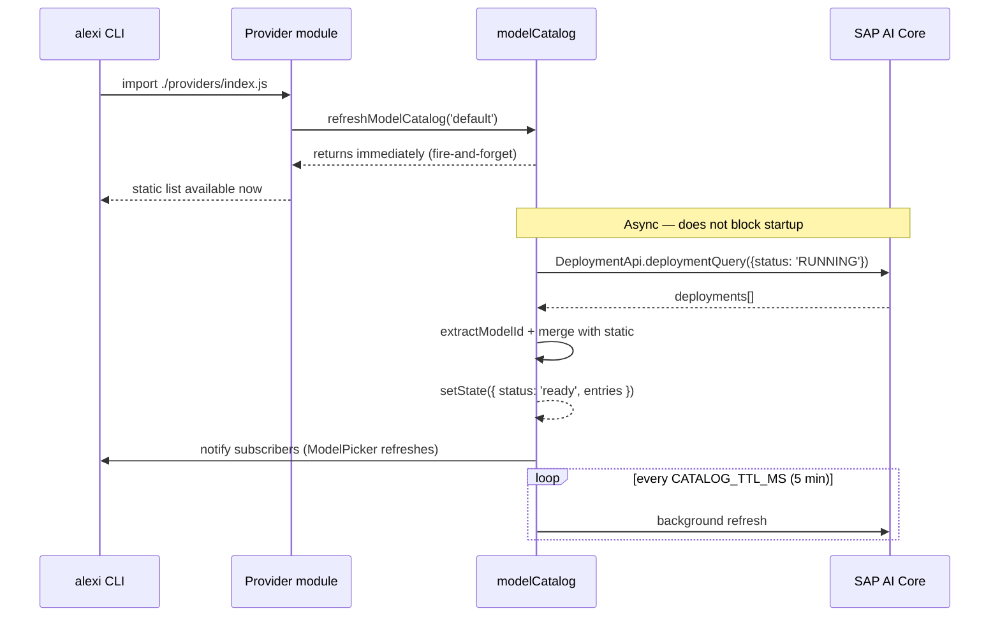
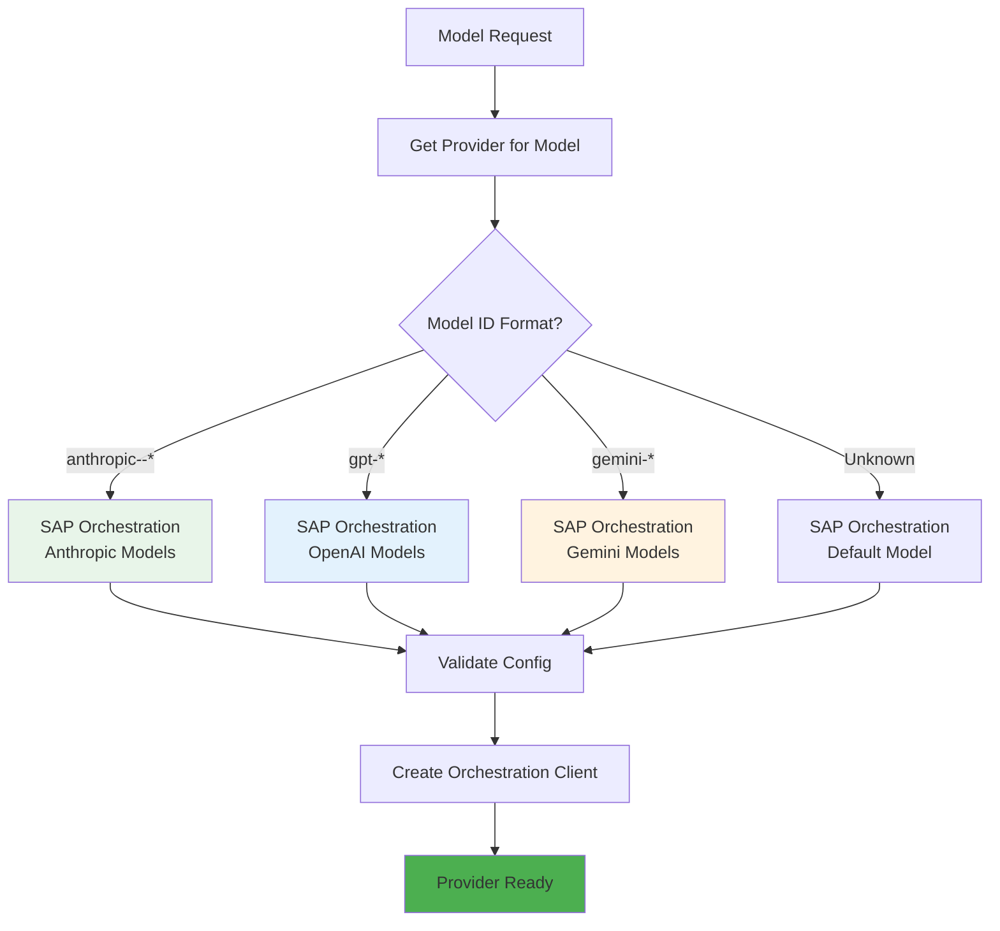
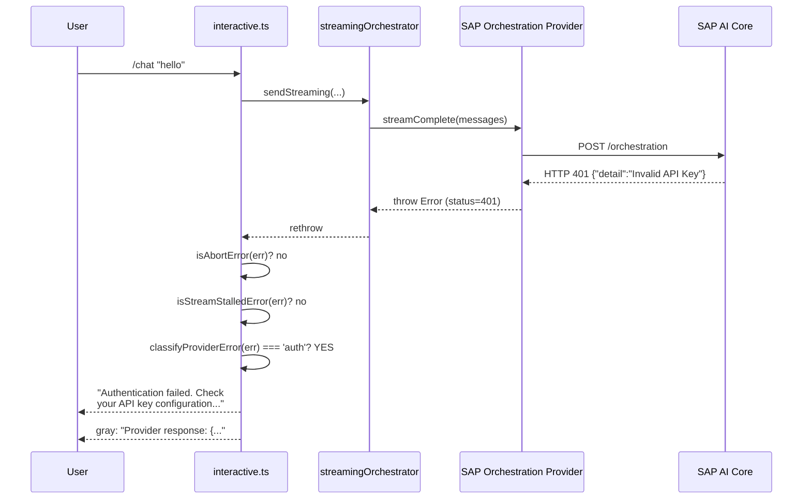

# Providers

This document describes the provider system in Alexi, focusing on the SAP AI Core Orchestration provider which is the exclusive LLM backend for the application.

## Table of Contents

- [Overview](#overview)
- [SAP AI Core Orchestration Provider](#sap-ai-core-orchestration-provider)
- [Provider Architecture](#provider-architecture)
- [Supported Models](#supported-models)
- [Configuration](#configuration)
- [Usage Examples](#usage-examples)

## Overview

Alexi uses a provider abstraction layer to communicate with LLM backends. Unlike multi-provider AI orchestrators, **Alexi exclusively uses SAP AI Core Orchestration API** as its LLM backend. This design decision ensures enterprise-grade security, compliance, and integration with SAP ecosystems.

> **On `src/providers/openai.ts` (2026-07-24 sync noise, not a provider):** the 2026-07-24 upstream sync (commit `530351f4`) emitted a 3-line stub at `src/providers/openai.ts` that imports from a nonexistent `packages/core/src/plugin/provider/openai` path. This file is **not** a provider — Alexi has no OpenAI-direct backend, no BYOK surface, and no OpenAI-compatible ingress. OpenAI-family models (`gpt-4.1`, `gpt-4o`, `gpt-4o-mini`, `gpt-4-turbo`) are routed via SAP AI Core Orchestration through `src/providers/sapOrchestration.ts` as documented in the [Supported Models](#supported-models) section. The `SAP_PROXY_BASE_URL` / `SAP_PROXY_API_KEY` variables route requests to a **local proxy fronting SAP AI Core**, not to `api.openai.com`. The orphan stub is pending autohealing deletion; see the CHANGELOG `### Removed` entry for 2026-07-24.

### Provider Architecture

```mermaid
graph TB
    subgraph Application[\"Application Layer\"]
        CLI[CLI Commands]
        Core[Core Orchestrator]
        Agent[Agent System]
    end
    
    subgraph Provider[\"Provider Layer\"]
        Interface[Provider Interface]
        SAP[SAP Orchestration Provider]
    end
    
    subgraph Backend[\"SAP AI Core\"]
        Orch[Orchestration API]
        Models[Model Deployments]
        Auth[Authentication]
    end
    
    CLI --> Core
    Core --> Interface
    Agent --> Interface
    Interface --> SAP
    SAP --> Orch
    Orch --> Models
    SAP --> Auth
    
    style SAP fill:#4CAF50
    style Orch fill:#2196F3
    style Models fill:#FF9800
```

## SAP AI Core Orchestration Provider

The SAP Orchestration provider is implemented in `src/providers/sapOrchestration.ts` and uses the official `@sap-ai-sdk/orchestration` SDK.

### Features

- **Native Integration**: Direct integration with SAP AI Core using official SDK
- **Model Agnostic**: Supports multiple foundation models through unified API
- **Token Tracking**: Automatic usage tracking and cost estimation
- **Streaming Support**: Real-time streaming responses
- **Tool Calling**: Native function calling support for agentic workflows
- **Error Handling**: Comprehensive error handling with retry logic

### Provider Interface

```typescript
interface Provider {
  /**
   * Send a message to the LLM and get a response
   */
  sendMessage(
    messages: Message[],
    options: SendMessageOptions
  ): Promise<CompletionResult>;

  /**
   * Send a message with streaming response
   */
  sendMessageStream(
    messages: Message[],
    options: SendMessageOptions,
    onChunk: (chunk: string) => void
  ): Promise<CompletionResult>;

  /**
   * Get provider name
   */
  getName(): string;

  /**
   * Check if provider supports a model
   */
  supportsModel(modelId: string): boolean;
}
```

### Implementation Details

```typescript
// src/providers/sapOrchestration.ts
import { OrchestrationClient } from '@sap-ai-sdk/orchestration';

export class SAPOrchestrationProvider implements Provider {
  private client: OrchestrationClient;
  
  constructor(config: SAPOrchestrationConfig) {
    this.client = new OrchestrationClient({
      resourceGroup: config.resourceGroup,
      // Authentication handled by @sap-ai-sdk
    });
  }

  async sendMessage(
    messages: Message[],
    options: SendMessageOptions
  ): Promise<CompletionResult> {
    const response = await this.client.chatCompletion({
      messages: this.formatMessages(messages),
      model: options.model,
      temperature: options.temperature,
      maxTokens: options.maxTokens,
      tools: options.tools,
    });

    return {
      text: response.content,
      usage: response.usage,
      toolCalls: response.toolCalls,
      finishReason: response.finishReason,
    };
  }

  // ... streaming and other methods
}
```

## Provider Call Flow


```mermaid
sequenceDiagram
    participant App as Application
    participant Router as Router
    participant Provider as SAP Provider
    participant SDK as SAP AI SDK
    participant API as AI Core API
    participant Model as Foundation Model

    App->>Router: Request with prompt
    Router->>Router: Analyze prompt
    Router->>Router: Select model
    Router->>Provider: sendMessage(messages, options)
    Provider->>SDK: chatCompletion(request)
    SDK->>SDK: Format request
    SDK->>API: POST /orchestration
    API->>API: Authenticate
    API->>Model: Forward request
    Model->>API: Model response
    API->>SDK: Orchestration response
    SDK->>Provider: Formatted response
    Provider->>Provider: Parse usage
    Provider->>App: CompletionResult
```

## Supported Models

Alexi supports all foundation models available through SAP AI Core Orchestration API. The catalog is discovered dynamically at startup — see [Dynamic Model Catalog](#dynamic-model-catalog) — and falls back to the static list below when credentials are absent or the AI Core API is unreachable.

### Dynamic Model Catalog

Since 2026-08-28 the provider layer maintains a live view of deployments running in SAP AI Core. `src/providers/modelCatalog.ts` fetches the deployment list at process start (fire-and-forget on module load from `src/providers/index.ts:30-33`) and re-fetches every `CATALOG_TTL_MS` (5 minutes). The static `ORCHESTRATION_MODELS` list is always available as the fallback, so callers are never blocked by network latency.

#### State machine


```mermaid
stateDiagram-v2
    [*] --> idle: import providers/modelCatalog
    idle --> loading: refreshModelCatalog()
    loading --> ready: deploymentQuery succeeds
    loading --> error: deploymentQuery throws
    ready --> loading: TTL timer fires (5 min)
    error --> loading: TTL timer fires (5 min)
    ready --> idle: invalidateCatalog()
    error --> idle: invalidateCatalog()
```

- `idle` — no fetch has ever completed. `getAvailableModels()` returns the static list.
- `loading` — a fetch is in flight. Concurrent calls to `refreshModelCatalog()` short-circuit.
- `ready` — the last fetch succeeded. `entries` reflects the merged static + live catalog.
- `error` — the last fetch failed. Existing entries are retained; `errorMessage` is populated. The next scheduled refresh may recover.

#### Public API

```typescript
// Kick off a refresh (idempotent, fire-and-forget)
refreshModelCatalog(resourceGroup?: string): Promise<void>;

// Sync accessors — safe from any code path
getAvailableModels(): readonly string[];             // static + live
getLiveModels(): readonly string[];                  // RUNNING only
getCatalogEntries(): readonly CatalogEntry[];        // full metadata
getCatalogStatus(): 'idle' | 'loading' | 'ready' | 'error';

// Validation helpers
isAvailableModel(id: string): boolean;
isModelLive(id: string): boolean;
getModelMetadata(id: string): OrchestrationModelMetadata | undefined;

// Reactive subscription (used by the Ink TUI)
subscribeCatalog(fn: () => void): () => void;

// Test-only cache-buster
invalidateCatalog(): void;
```

Each entry carries provenance:

```typescript
interface CatalogEntry {
  id: string;                  // model id used in OrchestrationConfig.modelName
  deploymentId?: string;       // concrete AI Core deployment binding
  source: 'static' | 'live' | 'both';
  live: boolean;               // true when deployment is RUNNING
  metadata?: OrchestrationModelMetadata; // capabilities, when known
}
```

Deployments are matched to model ids in two passes: (1) exact match against `ORCHESTRATION_MODELS`, (2) prefix heuristic (`gpt-`, `anthropic--`, `gemini-`, `amazon--`, `mistralai--`, `meta--`, `deepseek-`, `sap-`). Deployments whose `configurationName` does not match are ignored — Alexi assumes they are not LLM completions endpoints.

#### Circular-import break: catalog guard registry

`modelCatalog.ts` imports `ORCHESTRATION_MODELS`, `ORCHESTRATION_MODEL_METADATA`, and the `OrchestrationModelMetadata` type from `sapOrchestration.ts`. `sapOrchestration.ts`'s `isOrchestrationModel(modelId)` guard needs to consult the live catalog (`modelCatalog.isAvailableModel`) so that a newly deployed model id is accepted the moment the catalog transitions to `ready`. A direct top-level `import { isAvailableModel } from './modelCatalog.js'` would close a circular ESM import cycle — the two modules would reference each other's exports before either finished initializing, and depending on the load order one side would observe `undefined` for the imported symbol.

The previous fix relied on an inline `require('./modelCatalog.js')` inside `isOrchestrationModel` (a synchronous CJS interop lookup deferred until the guard was actually called). That approach broke the cycle at load time but has two problems in a strict ESM package (`"type": "module"`, `module: NodeNext`): (1) `require` is not part of the ESM globals, so ESLint's `no-require-imports`, `@typescript-eslint/no-require-imports`, and TypeScript's ESM checker all flag it, and (2) `require` behavior varies across Node ESM loaders and future strict-ESM releases may remove the interop entirely.

The current implementation replaces the `require` with an in-process global registry keyed by a unique property name on `globalThis`, wired up at module-load time by the importer (`modelCatalog.ts`) rather than pulled at call-time by the consumer (`sapOrchestration.ts`):

```typescript
// src/providers/sapOrchestration.ts (near ORCHESTRATION_MODELS)

type IsAvailableModelFn = (id: string) => boolean;
const _catalogRegistry = globalThis as unknown as {
  __alexiCatalogIsAvailable?: IsAvailableModelFn;
};

/**
 * Called by modelCatalog.ts at module load to register its guard function.
 * @internal
 */
export function _registerCatalogGuard(fn: IsAvailableModelFn): void {
  _catalogRegistry.__alexiCatalogIsAvailable = fn;
}

export function isOrchestrationModel(modelId: string): boolean {
  // Fast static check first (no I/O, no async, always safe)
  if (ORCHESTRATION_MODELS.includes(modelId as OrchestrationModel)) return true;
  // Delegate to the live catalog if it has registered itself
  return _catalogRegistry.__alexiCatalogIsAvailable?.(modelId) ?? false;
}
```

```typescript
// src/providers/modelCatalog.ts (last lines of module)

import { _registerCatalogGuard, /* ... */ } from './sapOrchestration.js';

// ... isAvailableModel(id) defined above ...

// Register isAvailableModel as the live-catalog guard in sapOrchestration.ts.
// This runs at module load time (after both modules have initialized), wiring
// up the reverse dependency without a circular import.
_registerCatalogGuard(isAvailableModel);
```

Contract:

- **Direction of dependency.** Only `modelCatalog.ts` imports from `sapOrchestration.ts`. `sapOrchestration.ts` never imports from `modelCatalog.ts`. The reverse edge (`sapOrchestration.ts` → live catalog) is expressed as a function-pointer lookup on `globalThis`, not as an `import` statement, so the ESM linker sees a strict DAG.
- **Registration timing.** `_registerCatalogGuard(isAvailableModel)` runs as a top-level side effect of importing `modelCatalog.ts`. Any code path that has caused `modelCatalog.ts` to load — for example, `src/providers/index.ts:30-33` calling `refreshModelCatalog()` on first use — has already registered the guard. Code paths that never load `modelCatalog.ts` (e.g. a unit test that mocks the provider layer wholesale) see the fallback `?? false`, which correctly reduces `isOrchestrationModel` to the static `ORCHESTRATION_MODELS.includes(...)` check.
- **Namespace hygiene.** The registry key `__alexiCatalogIsAvailable` is prefixed with `__alexi` and cast via `globalThis as unknown as { ... }` so a stray global write from a dependency cannot silently override it, and TypeScript still checks the function signature at the two use sites.
- **Test isolation.** Tests that need to unwire the guard call `invalidateCatalog()` (already documented above) and, in the rare case that they need to null the pointer as well, can assign `(globalThis as any).__alexiCatalogIsAvailable = undefined`. In practice the existing `invalidateCatalog()` is sufficient because it resets `entries` to `buildStaticEntries()`, which makes the guard behave the same as the static-only fallback.
- **Lint / typecheck.** No `require()` remains in `src/providers/sapOrchestration.ts`, so the file no longer needs an `// eslint-disable-next-line @typescript-eslint/no-var-requires` (or the successor `no-require-imports`) pragma above the guard. `tsc --noEmit` no longer needs `esModuleInterop`-shaped shims to type-check the module. Downstream: the ESLint auto-fix pass documented in `docs/CONTRIBUTING.md` no longer has to preserve the historical `require` line — it can now format-only pass over `sapOrchestration.ts`.

When adding future reverse dependencies between modules that already form an ESM DAG, prefer this "registry key on `globalThis`, wired by the downstream module at load time" pattern over lazy `require` or dynamic `import()`. Dynamic `import()` returns a Promise, which forces every caller of the guard onto an async path — that would be a strict regression for `isOrchestrationModel`, which is a synchronous predicate used inside the router's hot loop.

#### TUI integration

- **Status bar** (`src/cli/tui/components/StatusBar.tsx`) shows a small indicator that reflects `catalogStatus`:
  - `● N live` (green) — ready, N models confirmed running.
  - `⟳` — idle or loading.
  - `○ offline` (warning colour) — the last fetch failed; the static catalog is in use.
- **Model picker** (`src/cli/tui/dialogs/ModelPicker.tsx`) prefixes each entry with `● ` (live) or `○ ` (static-only), groups by provider, marks the current selection with `←`, and shows a badge at the top summarising `N live · M total` or `⚠ AI Core unreachable — showing static catalog`.
- **Slash completion** (`src/cli/utils/completer.ts:complete ModelName`) and the **inquirer picker** (`src/cli/utils/modelPicker.ts:getAvailableModels`) both call `getCatalogStatus()` and prefer the live list once it reaches `ready`. Non-live models remain selectable so unreleased deployments can be tested behind the scenes.

### Model Categories

#### Anthropic Claude Models

```typescript
const CLAUDE_MODELS = [
  'anthropic--claude-4.5-opus',
  'anthropic--claude-4.5-sonnet',
  'anthropic--claude-4-sonnet',
  'anthropic--claude-4-haiku',
];
```

**Characteristics**:
- Excellent code generation and analysis
- Strong reasoning capabilities
- Large context windows (200K+ tokens)
- Native tool calling support

#### OpenAI GPT Models

```typescript
const OPENAI_MODELS = [
  'gpt-4.1',
  'gpt-4o',
  'gpt-4o-mini',
  'gpt-4-turbo',
];
```

**Characteristics**:
- Extended reasoning with GPT-4.1
- Fast inference with GPT-4o
- Cost-effective with GPT-4o-mini
- Strong general-purpose capabilities

#### Google Gemini Models

```typescript
const GEMINI_MODELS = [
  'gemini-2.0-flash-thinking',
  'gemini-2.0-flash',
  'gemini-1.5-pro',
  'gemini-1.5-flash',
];
```

**Characteristics**:
- Multimodal capabilities
- Fast inference with Flash models
- Thinking mode for complex reasoning
- Large context windows

### Model Selection

Models are selected through:

1. **Explicit Override**: `--model` flag in CLI commands
2. **Auto-Routing**: Automatic selection based on prompt analysis
3. **User Default**: Persistent default model in ~/.alexi/config.json
4. **Environment Variable**: AICORE_MODEL environment variable
5. **System Default**: Fallback to anthropic--claude-4-sonnet

### Model Capabilities

```typescript
interface ModelCapability {
  id: string;
  name: string;
  provider: 'anthropic' | 'openai' | 'google';
  tier: 'cheap' | 'balanced' | 'expensive';
  strengths: string[];
  contextWindow: number;
  supportsTools: boolean;
  supportsStreaming: boolean;
  supportsReasoning: boolean;
}
```

### Provider-Layer Capability Validation (issue #1389)

In addition to the router-facing `ModelCapability` shape above, the
provider layer publishes a narrower capability tag set consumed by
feature gates (tool registration, image response handling, embeddings
dispatch). Ported from Cline PR #13025 and exported from
`src/providers/sapOrchestration.ts` (re-exported by
`src/providers/index.ts`).

```typescript
// From src/providers/sapOrchestration.ts
export type ModelCapability = 'image-generation' | 'tools' | 'embeddings';

export interface OrchestrationModelMetadata {
  capabilities?: ModelCapability[];
}

// Companion map keyed by OrchestrationModel id. Absence of an entry
// means "capability data not authored yet" (see `assumeWhenUnspecified`).
export const ORCHESTRATION_MODEL_METADATA: Readonly<
  Partial<Record<OrchestrationModel, OrchestrationModelMetadata>>
>;

export function modelHasCapability(
  modelId: string,
  capability: ModelCapability,
  options?: { assumeWhenUnspecified?: boolean }
): boolean;
```

Capability tags:

- **`image-generation`** — model can emit image content (URL or base64
  payload) as part of a streaming response. Consumers gate on this tag
  before invoking `extractImageChunk` / `extractImageChunks` from
  `src/providers/transform.ts`. No id in the current
  `ORCHESTRATION_MODELS` catalog advertises this — the tag is retained
  so a future SAP-hosted image model can be enabled by a single map edit.
- **`tools`** — model supports function / tool calling. Tagged on all
  current OpenAI GPT-\*, Anthropic Claude 3.5+, Gemini 2.5 family, and
  the Amazon Nova micro/lite/pro trio. NOT tagged on `deepseek-r1`,
  `meta--llama3.1-70b-instruct`, `mistralai--mistral-small-instruct`, or
  `sap-abap-1` — they do not advertise tool calling via SAP AI Core
  today.
- **`embeddings`** — model can be used with `SapOrchestrationEmbeddings`.
  No chat model in the current catalog doubles as an embeddings model;
  the dedicated `text-embedding-ada-002` deployment sits outside
  `ORCHESTRATION_MODELS`.

Validation semantics (`modelHasCapability`):

1. The id is normalised by stripping a leading `<provider>/` prefix, so
   `sap-ai-core/anthropic--claude-4.7-opus` and
   `anthropic--claude-4.7-opus` resolve identically.
2. When the normalised id exists in `ORCHESTRATION_MODEL_METADATA`, the
   answer is `capabilities?.includes(capability) ?? false`.
3. When the id is unknown, the answer is
   `options.assumeWhenUnspecified ?? false`. `assumeWhenUnspecified` is
   the escape hatch for legacy call sites that predate capability data
   and want "unknown-means-yes" behaviour; new call sites should default
   to `false` so a missing tag stays visible.

Streaming image payloads are surfaced by `extractImageChunk` /
`extractImageChunks` in `src/providers/transform.ts`, which normalise
both OpenAI-style URL payloads (`type: 'image_url'`,
`image_url.url`) and Anthropic / Gemini-style base64 payloads
(`type: 'image'`, `image.b64_json` or `image.data`) into a
discriminated union `NormalizedImageChunk` (`{ kind: 'url' | 'base64',
... }`). The extractors return `undefined` / `[]` for non-image or
malformed content, so consumers can invoke them unconditionally.

#### Which models advertise `image-generation` today

**None**, at the time of writing. Every entry in the current
`ORCHESTRATION_MODEL_METADATA` map declares either `['tools']` or
`[]`. The `image-generation` string is a valid `ModelCapability` and
the transform layer already understands the two SDK payload shapes,
but SAP AI Core does not yet expose a chat-completion model that emits
image payloads through `ORCHESTRATION_MODELS`.

The intended activation path is a single edit to the metadata map —
for example, adding `capabilities: ['image-generation']` (or
`['tools', 'image-generation']`) to whichever future model in the
catalog gains the capability. No changes to `modelHasCapability`,
`extractImageChunks`, or callers are required.

Candidate future models discussed in the research artefacts (all
subject to SAP AI Core exposing them via orchestration):

- Anthropic Claude with image output.
- Gemini Imagen.
- Stable Diffusion deployments.

Anticipated activation for one of these (hypothetical, do not copy
verbatim until the model actually ships):

```typescript
// src/providers/sapOrchestration.ts (illustrative future edit)
'anthropic--claude-image-experimental': {
  capabilities: ['image-generation'],
},
```

#### Example — capability-gated image chunk extraction

```typescript
import { modelHasCapability } from './providers/index.js';
import { extractImageChunks } from './providers/transform.js';

// Somewhere in a streaming consumer:
for await (const delta of stream) {
  if (modelHasCapability(modelId, 'image-generation')) {
    for (const chunk of extractImageChunks(delta.content)) {
      if (chunk.kind === 'url') {
        // Fetch chunk.url. `chunk.mimeType` may be undefined —
        // fall back to the Content-Type response header or sniff.
      } else {
        // Decode chunk.data (base64) using chunk.mimeType.
      }
    }
  }
}
```

If `modelHasCapability` returns `false`, the gate short-circuits and
`extractImageChunks` is never called. Passing
`{ assumeWhenUnspecified: true }` is **discouraged for image
generation** — the whole point of the tag is to fail closed on a text
model that happens to emit something image-shaped. `true` is only
appropriate for legacy paths that predate the capability data and
cannot yet be audited.

#### `assumeWhenUnspecified` — full behaviour matrix

| Model in `ORCHESTRATION_MODEL_METADATA`? | `capabilities` value                    | `assumeWhenUnspecified` | Result for the queried capability |
| ---------------------------------------- | --------------------------------------- | ----------------------- | --------------------------------- |
| Yes                                      | Includes the queried capability         | ignored                 | `true`                            |
| Yes                                      | Does NOT include the queried capability | ignored                 | `false`                           |
| Yes                                      | `[]` (explicit empty list)              | ignored                 | `false`                           |
| No entry at all                          | —                                       | `false` (default)       | `false`                           |
| No entry at all                          | —                                       | `true`                  | `true`                            |
| id is empty string / non-string          | —                                       | any                     | `assumeWhenUnspecified ?? false`  |

The subtle case is the third row: an entry with `capabilities: []`
reports `false` for every capability regardless of the option. This is
by design — an empty list is an explicit "does not support anything in
this dimension" signal, distinct from "not authored yet" (missing
entry). This lets contributors distinguish models the team has
audited (present in the map) from those that have not been reviewed
(absent from the map).

## Dynamic Model Catalog

Alexi ships with a static list of known SAP AI Core model ids
(`ORCHESTRATION_MODELS` in `src/providers/sapOrchestration.ts`) that the
CLI can always fall back to. On top of that, a background catalog module
(`src/providers/modelCatalog.ts`) queries the connected SAP AI Core
tenant on startup and merges the RUNNING deployments into the same
surface. Callers never block on the network — they see the static list
until the first refresh completes, then transparently pick up newly
discovered live models.

### Contract

```typescript
// src/providers/modelCatalog.ts

export type CatalogStatus = 'idle' | 'loading' | 'ready' | 'error';

export interface CatalogEntry {
  /** Model id as used in OrchestrationConfig.modelName */
  id: string;
  /** Deployment id in SAP AI Core (the concrete binding) */
  deploymentId?: string;
  /** Where this id came from */
  source: 'static' | 'live' | 'both';
  /** Whether the live deployment is currently RUNNING */
  live: boolean;
  /** Capabilities and metadata (from static catalog when known) */
  metadata?: OrchestrationModelMetadata;
}

export function refreshModelCatalog(resourceGroup?: string): Promise<void>;
export function subscribeCatalog(fn: () => void): () => void;
export function getCatalogStatus(): CatalogStatus;
export function getAvailableModels(): readonly string[];
export function getLiveModels(): readonly string[];
export function getCatalogEntries(): readonly CatalogEntry[];
export function isAvailableModel(modelId: string): boolean;
export function getModelMetadata(modelId: string): OrchestrationModelMetadata | undefined;
export function isModelLive(modelId: string): boolean;
export function invalidateCatalog(): void;
```

Key semantics:

- `refreshModelCatalog(resourceGroup)` — idempotent, fire-and-forget.
  A second invocation while a fetch is in flight is a no-op. On success
  the state transitions `idle` / `loading` -> `ready`; on failure it
  transitions to `error` while keeping the previous entries intact so
  callers keep a usable list.
- Refresh schedule — after every completed fetch, the module schedules
  the next refresh `CATALOG_TTL_MS` (5 minutes) later using `setTimeout`.
  The timer is `unref()`-ed so long-running sessions stay fresh without
  blocking process exit.
- `subscribeCatalog(fn)` — the TUI subscribes to catalog state changes
  so the ModelPicker (`src/cli/tui/dialogs/ModelPicker.tsx`) can rebuild
  its list without a full remount when the first live fetch completes.
- `isAvailableModel(id)` — accepts either a purely static id or a live
  id discovered on the tenant, so validation is never stricter than the
  hardcoded catalog. Used by the router and by `SapOrchestrationProvider`
  before instantiating a client.
- Deployment identification — `configurationName` values are matched
  either against `ORCHESTRATION_MODELS` exactly or against a fixed set of
  provider prefixes (`gpt-`, `anthropic--`, `gemini-`, `amazon--`,
  `mistralai--`, `meta--`, `deepseek-`, `sap-`). Deployments whose name
  matches none of these are ignored.

### Startup Flow


```mermaid
sequenceDiagram
    participant CLI as alexi CLI
    participant Prov as Provider module
    participant Cat as modelCatalog
    participant AICore as SAP AI Core

    CLI->>Prov: import ./providers/index.js
    Prov->>Cat: refreshModelCatalog('default')
    Cat-->>Prov: returns immediately (fire-and-forget)
    Prov-->>CLI: static list available now

    Note over Cat,AICore: Async — does not block startup
    Cat->>AICore: DeploymentApi.deploymentQuery({status: 'RUNNING'})
    AICore-->>Cat: deployments[]
    Cat->>Cat: extractModelId + merge with static
    Cat-->>Cat: setState({ status: 'ready', entries })
    Cat->>CLI: notify subscribers (ModelPicker refreshes)

    loop every CATALOG_TTL_MS (5 min)
        Cat->>AICore: background refresh
    end
```

### TUI Model Picker Wiring

The Ink model picker (`src/cli/tui/dialogs/ModelPicker.tsx`) reads the
catalog synchronously on mount and subscribes for updates:

```typescript
// src/cli/tui/dialogs/ModelPicker.tsx
const [catalogStatus, setCatalogStatus] = React.useState<CatalogStatus>(getCatalogStatus);
const [groups, setGroups] = React.useState<ModelGroup[]>(() => {
  const status = getCatalogStatus();
  return status === 'ready'
    ? buildGroupsFromEntries(getCatalogEntries())
    : buildGroupsFromStatic();
});

React.useEffect(() => {
  const unsub = subscribeCatalog(() => {
    const status = getCatalogStatus();
    setCatalogStatus(status);
    setGroups(
      status === 'ready' ? buildGroupsFromEntries(getCatalogEntries()) : buildGroupsFromStatic()
    );
  });
  return unsub;
}, []);
```

Each row is prefixed with `●` (live) or `○` (static) to make the
provenance visible. The header shows a spinner while the first refresh
is in flight, `⚠ AI Core unreachable — showing static catalog` on
error, and `● N live · M total` once ready.

### CLI Completion Wiring

`src/cli/utils/completer.ts` prefers live entries when tab-completing
model ids and falls back to the static list while the first refresh
has not yet completed:

```typescript
// src/cli/utils/completer.ts
export function completeModelName(partial: string): CompletionResult {
  const modelList =
    getCatalogStatus() === 'ready'
      ? getCatalogModels()
      : (ORCHESTRATION_MODELS as readonly string[]);
  // ...
}
```

### Router Guard Registration

`isOrchestrationModel(id)` in `src/providers/sapOrchestration.ts` is the
sync guard used by the router before dispatching a request. It performs
a fast static check first and then delegates to
`modelCatalog.isAvailableModel(id)` for live entries. Because
`modelCatalog.ts` imports from `sapOrchestration.ts` for the static
seed, the reverse dependency is wired lazily at module-load time and
does not create a circular import.

### Testing

`refreshModelCatalog` accepts an explicit `resourceGroup` argument so
tests can point it at a fixture without env-var manipulation.
`invalidateCatalog()` resets the module state to `idle` with the static
seed, which is the reset hook used in the `beforeEach` of catalog
tests. `CATALOG_TTL_MS` is re-exported so tests can assert the
schedule-next-refresh window without hard-coding the number.

## Configuration

### Environment Variables

#### Required

```bash
# SAP AI Core service key (JSON format)
export AICORE_SERVICE_KEY='{
  "clientid": "your-client-id",
  "clientsecret": "your-client-secret",
  "url": "https://your-auth-url",
  "serviceurls": {
    "AI_API_URL": "https://your-ai-api-url"
  }
}'
```

#### Optional

```bash
# Resource group (default: "default")
export AICORE_RESOURCE_GROUP=production

# Default model
export AICORE_MODEL=gpt-4o
```

### Service Key Format

The SAP AI Core service key contains:

- **clientid**: OAuth2 client ID
- **clientsecret**: OAuth2 client secret
- **url**: Authentication server URL
- **serviceurls.AI_API_URL**: AI Core API base URL

### Obtaining a Service Key

1. Log in to SAP BTP Cockpit
2. Navigate to your SAP AI Core instance
3. Create a new service key
4. Copy the JSON credentials
5. Set as AICORE_SERVICE_KEY environment variable

### Resource Groups

Resource groups organize AI Core resources:

```bash
# List deployments in a resource group
alexi models --resource-group production

# Use different resource group
export AICORE_RESOURCE_GROUP=development
alexi chat -m "Hello"
```

## Usage Examples

### Basic Chat

```typescript
import { getProviderForModel } from './providers/index.js';

const provider = getProviderForModel('anthropic--claude-4-sonnet');

const result = await provider.sendMessage(
  [{ role: 'user', content: 'Hello, world!' }],
  {
    model: 'anthropic--claude-4-sonnet',
    temperature: 0.7,
    maxTokens: 1000,
  }
);

console.log(result.text);
console.log(`Tokens used: ${result.usage.total_tokens}`);
```

### Streaming Response

```typescript
const provider = getProviderForModel('gpt-4o');

await provider.sendMessageStream(
  [{ role: 'user', content: 'Write a story' }],
  {
    model: 'gpt-4o',
    temperature: 0.8,
  },
  (chunk) => {
    process.stdout.write(chunk);
  }
);
```

### Model Parameters

The SAP orchestration provider plumbs the following sampling parameters
through `OrchestrationConfig` and per-call `CompletionOptions`. Per-call
options take precedence over config defaults.

| Parameter          | `modelParams` key   | Compatibility                                                                                  |
| ------------------ | ------------------- | ---------------------------------------------------------------------------------------------- |
| `temperature`      | `temperature`       | Universal.                                                                                     |
| `maxTokens`        | `max_tokens`        | Universal.                                                                                     |
| `topP`             | `top_p`             | Universal.                                                                                     |
| `topK`             | `top_k`             | Honored by Anthropic Claude family models; silently dropped by OpenAI-family deployments.      |
| `frequencyPenalty` | `frequency_penalty` | OpenAI-family models. Anthropic deployments ignore the field.                                  |
| `presencePenalty`  | `presence_penalty`  | OpenAI-family models. Anthropic deployments ignore the field.                                  |

```typescript
const provider = getProviderForModel('anthropic--claude-4.7-opus');

const result = await provider.complete(
  [{ role: 'user', content: 'Brainstorm 5 names' }],
  { temperature: 0.9, topK: 40 }
);
```

### Tool Calling

```typescript
const provider = getProviderForModel('anthropic--claude-4-sonnet');

const result = await provider.sendMessage(
  [{ role: 'user', content: 'Read the file README.md' }],
  {
    model: 'anthropic--claude-4-sonnet',
    tools: [
      {
        name: 'read',
        description: 'Read a file',
        parameters: {
          type: 'object',
          properties: {
            filePath: { type: 'string' },
          },
          required: ['filePath'],
        },
      },
    ],
  }
);

if (result.toolCalls && result.toolCalls.length > 0) {
  console.log('Tool calls requested:', result.toolCalls);
}
```

### List Available Models

```bash
# List all deployments
alexi models

# Filter by status
alexi models --status RUNNING

# JSON output
alexi models --json

# Specific resource group
alexi models --resource-group production
```

### Query Deployments Programmatically

```typescript
import { DeploymentApi } from '@sap-ai-sdk/ai-api';

const response = await DeploymentApi.deploymentQuery(
  {},
  { 'AI-Resource-Group': 'default' }
).execute();

const deployments = response.resources || [];
const running = deployments.filter(d => d.status === 'RUNNING');

console.log(`Found ${running.length} running deployments`);
```

## Provider Resolution

The provider resolution flow determines which provider to use for a given model:


```mermaid
flowchart TD
    Start[Model Request] --> GetProvider[Get Provider for Model]
    GetProvider --> CheckModel{Model ID Format?}
    
    CheckModel -->|anthropic--*| Anthropic[SAP Orchestration<br/>Anthropic Models]
    CheckModel -->|gpt-*| OpenAI[SAP Orchestration<br/>OpenAI Models]
    CheckModel -->|gemini-*| Gemini[SAP Orchestration<br/>Gemini Models]
    CheckModel -->|Unknown| Default[SAP Orchestration<br/>Default Model]
    
    Anthropic --> Validate[Validate Config]
    OpenAI --> Validate
    Gemini --> Validate
    Default --> Validate
    
    Validate --> CreateClient[Create Orchestration Client]
    CreateClient --> Ready[Provider Ready]
    
    style Anthropic fill:#E8F5E9
    style OpenAI fill:#E3F2FD
    style Gemini fill:#FFF3E0
    style Ready fill:#4CAF50
```

### Provider Selection Logic

```typescript
// src/providers/index.ts
export function getProviderForModel(modelId: string): Provider {
  // All models use SAP Orchestration provider
  return new SAPOrchestrationProvider({
    resourceGroup: process.env.AICORE_RESOURCE_GROUP || 'default',
    model: modelId,
  });
}

export function getDefaultModel(): string {
  // Priority: user config > env var > system default
  return (
    getConfigDefaultModel() ||
    process.env.AICORE_MODEL ||
    'anthropic--claude-4-sonnet'
  );
}
```

### Prompt Cache Breakpoint Preparation

The provider module exports a `prepareRequest<T>` helper (`src/providers/sapOrchestration.ts:395`) that is applied to outgoing OpenAI-family requests before they hit the Vercel AI SDK path. It applies explicit prompt-cache breakpoints when the provider/model combination supports them and the caller is not on a ChatGPT subscription (which caches implicitly).

```typescript
export function prepareRequest<T extends { prompt: LanguageModelV2Prompt }>(
  ctx: {
    providerId: string;
    modelId: string;
    auth: { type?: string; source?: string };
    prompt: LanguageModelV2Prompt;
  } & T
): T {
  const isChatGPT = isChatGPTSubscription(ctx.auth);
  if (
    supportsPromptCacheBreakpoint({
      providerId: ctx.providerId,
      modelId: ctx.modelId,
      isChatGPTSubscription: isChatGPT,
    })
  ) {
    return { ...ctx, prompt: applyCacheBreakpoint(ctx.prompt) };
  }
  return ctx;
}
```

**Behaviour**:

- Non-OpenAI models (Anthropic Claude, Google Gemini) are returned unchanged; those model families use their own native cache primitives (Anthropic `cache_control` blocks are applied elsewhere in the request assembly path).
- ChatGPT-subscription auth (`ctx.auth.type === 'oauth'` with an OpenAI subscription source) is detected via `isChatGPTSubscription(ctx.auth)`. When true, the helper skips explicit breakpoint insertion because the subscription tier caches implicitly on OpenAI's side.
- The model-id matcher and the actual breakpoint-application logic live in `src/providers/openai/prompt-cache.ts` (`supportsPromptCacheBreakpoint`, `applyCacheBreakpoint`). This split keeps the SAP AI Core wrapper thin and reuses the upstream opencode v1.17.13 caching contract.
- The intersection type `{ providerId; modelId; auth; prompt } & T` lets callers pass through additional per-request fields (temperature, max_tokens, tools, tool_choice) without losing type information — the returned object preserves the `T` extension while replacing only the `prompt` field when a breakpoint is applied.

Cache-token accounting on the response path is handled by the paired `extractCacheTokens(usage)` helper (`src/providers/sapOrchestration.ts:416`), which normalises both Anthropic-style top-level `cache_read_input_tokens` / `cache_creation_input_tokens` and OpenAI/SAP-Orchestration-style `prompt_tokens_details.cached_tokens` into a single shape consumed by `getCostTracker().recordUsage(...)`.

### Provider Completion-Token Hard Caps

Some providers routed through the SAP AI Core orchestration API hard-cap `max_completion_tokens` at a value BELOW the model's advertised context window. Alexi's generic normalization step recomputes `max_completion_tokens = contextWindow - promptTokens`, which silently overwrites that cap and causes the provider to reject the request with a 400 at its edge.

`preserveCompletionLimit(provider, computed)` in `src/providers/transform.ts` clamps the caller's computed limit to the provider-declared cap:

```typescript
// src/providers/transform.ts
export const PROVIDER_COMPLETION_LIMITS: Readonly<Record<string, number>> = {
  // Tightest per-model cap across the SAP AI Core catalog for Cerebras
  // (llama-3.1-70b: 8192).
  cerebras: 8192,
};

export function preserveCompletionLimit(provider: string, computed: number): number {
  const cap = PROVIDER_COMPLETION_LIMITS[provider];
  if (typeof cap !== 'number' || cap <= 0) {
    return Math.max(0, computed);
  }
  return Math.max(0, Math.min(computed, cap));
}
```

**Semantics**:

- Returns `Math.max(0, Math.min(computed, cap))` when the provider has a declared cap.
- Returns `Math.max(0, computed)` (no cap applied, but still floored at zero) when the provider is not in the table.
- Never raises `computed` above `cap`.
- Never returns a negative limit — an overshoot on a small budget is clamped to `0` so callers do not have to guard against negative values on their side.

**When to add an entry**: only when the provider's cap is BELOW its context window. Providers whose cap equals the context window fall through to the default assumption (unclamped) — adding them here would be a no-op that muddies the audit trail.

**Applicability to Alexi**: Alexi routes exclusively through SAP AI Core, so there is no direct Cerebras provider under normal operation. The clamp is retained because (1) SAP AI Core proxy deployments MAY expose a Cerebras-family model id (`cerebras-*`) which the guard catches, and (2) users running the fork behind a custom proxy that adds Cerebras get the cap for free. No-op for every non-Cerebras provider.

Test coverage (`tests/session/upstream-ports.test.ts`) pins down all four cases: cap enforced when `computed > cap`, `computed` returned when `computed <= cap`, unclamped pass-through for providers not in the table, and non-negative clamp on negative input. Ports opencode `da4a91b36 fix(opencode): preserve Cerebras completion limit`.

## Error Handling

### Common Errors

#### Authentication Errors

The provider layer returns a structured failure when SAP AI Core (or an
upstream proxy / MCP server) rejects credentials:

```typescript
{
  success: false,
  error: 'Authentication failed: Invalid client credentials'
}
```

**Solution**: Verify `AICORE_SERVICE_KEY` is correctly formatted (see
[Service Key Format](#service-key-format)); check that the `clientid` /
`clientsecret` pair is still valid; confirm that the target resource
group exists and is reachable.

##### Interactive REPL rewrite (issue #1625, mirrors Cline PR #13549)

By default, an HTTP 401 or 403 from SAP AI Core or an MCP-fronted BYOK
provider surfaces the raw upstream body, which for many providers reads
just `{"detail":"Invalid API Key"}` — technically accurate but useless
for a user who cannot tell whether the key is wrong, the environment
variable is unset, the MCP `apiKey` field on the wrong server was
updated, or a clipboard artefact corrupted the stored value.

`src/cli/interactive.ts:handleStreamingError` intercepts the class of
errors that `classifyProviderError` labels as `'auth'` (structural check
on HTTP status 401 or 403 — see `src/providers/format.ts:411`) and
rewrites them into actionable guidance while preserving the raw provider
response as a diagnostic tail:

```
  Authentication failed. Check your API key configuration
  (AICORE_SERVICE_KEY / SAP_PROXY_API_KEY in .env, or the
  `apiKey` field of the relevant server in mcp-servers.json).

  Provider response: {"detail":"Invalid API Key"}
```

Classification is **status-based, not string-based**. A plain `Error`
whose message merely quotes the word "unauthorized" in prose without an
attached `status` / `statusCode` does NOT trigger the auth rewrite — it
falls through to the generic `Error: <message>` path. HTTP 500 and other
non-auth failures are also unchanged.

##### `sanitizeApiKey` — config write-boundary hygiene

Users routinely paste API keys copied from a browser, a password
manager, or another terminal into masked TUI inputs. Those clipboard
sources frequently smuggle in additional characters that the masked
field hides:

- Trailing `\n` or `\r\n` (LF / CRLF)
- U+FEFF byte-order mark
- U+200B / U+200C / U+200D zero-width spaces and joiners
- U+202A / U+202C bidirectional formatting marks
- NUL bytes and other C0/C1 control code points
- Leading / trailing whitespace

A key contaminated by any of these will be rejected by the provider
with a 401 that is indistinguishable from a genuinely wrong key. Alexi
sanitizes at the config write boundary so the on-disk config is always
canonical. The helper lives in `src/providers/auth.ts`:

```typescript
/**
 * Sanitize an API key value at the config write boundary.
 * Non-string inputs yield ''. Whitespace-only input yields '' so the
 * caller can treat the field as "cleared". Idempotent.
 */
export function sanitizeApiKey(value: unknown): string {
  if (typeof value !== 'string') {
    return '';
  }
  // \p{Cc} strips C0/C1 controls (NUL, CR, LF, TAB, ...)
  // \p{Cf} strips zero-width spaces, joiners, BOM, bidi marks
  const stripped = value.replace(/[\p{Cc}\p{Cf}]/gu, '');
  return stripped.trim();
}
```

Contract:

1. **Non-string** (`null`, `undefined`, numbers, arrays, objects) → `''`
2. **Whitespace-only or invisibles-only** input → `''` (the caller
   MUST treat this as "clear the field")
3. **Idempotent** — sanitizing a sanitized key returns the same value
4. **Preserves Unicode letters** (`\p{L}`) so international keys like
   `sk-éclair-42` survive

Call site: `addMcpServer` in `src/mcp/config.ts` routes every
`apiKey` write through `sanitizeApiKey`. When the sanitized value is
empty, the `apiKey` field is `delete`d from the persisted server record
entirely, so a whitespace-only paste clears the field rather than
silently leaving a zero-length key on disk. Both the insert path (new
server name) and the update path (existing server name) share the
normalization step.

> **Security note**: never log the input or the return value of
> `sanitizeApiKey`. API keys are secrets, and the docblock in
> `src/providers/auth.ts:38-67` explicitly forbids it.

##### Auth error handling flow


```mermaid
sequenceDiagram
    participant U as User
    participant REPL as interactive.ts
    participant Stream as streamingOrchestrator
    participant Prov as SAP Orchestration Provider
    participant SAP as SAP AI Core

    U->>REPL: /chat "hello"
    REPL->>Stream: sendStreaming(...)
    Stream->>Prov: streamComplete(messages)
    Prov->>SAP: POST /orchestration
    SAP-->>Prov: HTTP 401 {"detail":"Invalid API Key"}
    Prov-->>Stream: throw Error (status=401)
    Stream-->>REPL: rethrow

    REPL->>REPL: isAbortError(err)? no
    REPL->>REPL: isStreamStalledError(err)? no
    REPL->>REPL: classifyProviderError(err) === 'auth'? YES

    REPL-->>U: "Authentication failed. Check<br/>your API key configuration..."
    REPL-->>U: gray: "Provider response: {..."
```

#### Model Not Found

```typescript
{
  success: false,
  error: 'Model not found: invalid-model-id'
}
```

**Solution**: Use `alexi models` to list available models

#### Rate Limiting

Alexi detects HTTP 429 responses from SAP AI Core and wraps them in a
user-friendly error class with actionable guidance instead of surfacing a
raw "HTTP 429" / "Too Many Requests" string. Two variants exist depending
on whether the model targets a free-tier or paid-tier deployment.

**Paid-tier throttling (`ProviderRateLimitError`, code `provider_rate_limit`)**

Transient failure. `ErrorBackoff` will retry after the wait window; the
`Retry-After` header from the response (when present) overrides the
default exponential-backoff schedule so we honour the exact time the
server advertised.

```
Rate limit reached for model 'anthropic--claude-4.7-opus'. The provider
is throttling requests (HTTP 429).

Options:
  - Wait 60 seconds and try again
  - Switch to a smaller model (e.g. haiku instead of opus)
  - Upgrade your SAP AI Core plan for higher limits

See: https://help.sap.com/docs/ai-core/generative-ai-hub/rate-limits
```

The specific wait time ("Wait 60 seconds") is taken from the
`Retry-After` header when the response supplied one; otherwise the
message shows a conservative default of 60 seconds so the user is not
staring at a bare "later".

**Free-tier quota exhaustion (`FreeTierRateLimitError`, code
`free_tier_rate_limit`)**

Permanent failure per the error contract in `AGENTS.md`. Retrying the
same call at the same rate will hit the same limit — the operator must
either wait for the quota window to reset or upgrade to a paid SAP AI
Core deployment. `ErrorBackoff.isFatal()` returns `true` for this
variant, which short-circuits the retry loop and prevents wasted budget.

```
Free-tier model rate limit exceeded for 'anthropic--claude-4.7-haiku-free'.
SAP AI Core free-tier deployments enforce strict per-minute request
quotas; retrying now will hit the same limit. Retry after 30 seconds.
Wait for the quota window to reset or upgrade to a paid SAP AI Core
deployment. See: https://help.sap.com/docs/ai-core/generative-ai-hub/rate-limits
```

Free-tier detection uses a narrow heuristic: model ids whose trailing
hyphen-delimited segment is `free` (case-insensitive), e.g.
`anthropic--claude-4.7-haiku-free`. Ids with `free` embedded elsewhere
(`some-freerider-model`) are treated as paid.

**Retry-After header handling.** Both classes carry an optional
`retryAfterSeconds` field populated from the `Retry-After` response
header. Both the integer-seconds (`Retry-After: 60`) and HTTP-date
(`Retry-After: Wed, 21 Oct 2015 07:28:00 GMT`) shapes are supported. When
present, `ErrorBackoff.recordError` schedules the next retry attempt at
the header-provided time (capped at the configured `maxDelayMs` so a
misconfigured server cannot pin the client into an unbounded wait).

**Programmatic detection.** Two helpers in `src/core/error-backoff.ts`
expose the classification structurally so callers do not need
`instanceof` (which is fragile across module boundaries in tests):

- `isRateLimitError(err)` — returns `true` for either variant, and also
  for any raw error carrying `statusCode === 429`.
- `getRetryAfterMs(err)` — returns the retry-after window in
  milliseconds, or `undefined` when the header was absent.

**Solution**: For paid-tier throttles, wait the advertised window,
switch to a smaller model, or upgrade the deployment plan. For
free-tier limits, either wait for the quota window to reset or upgrade
to a paid SAP AI Core deployment.

#### Quota Exceeded

```typescript
{
  success: false,
  error: 'Resource quota exceeded for resource group'
}
```

**Solution**: Check SAP AI Core quotas or use different resource group

## Streaming Error Semantics

Every provider that implements `streamComplete(messages, options):
AsyncGenerator<StreamChunk>` MUST honor the following three rules. The
orchestrator at `src/core/streamingOrchestrator.ts` relies on them to
persist partial state on failure.

1. **Network and transport errors surface as a rejected promise on the
   generator.** Implementations MUST `throw` (or let the underlying
   fetch/SSE error propagate) when the upstream stream fails. Returning
   silently from the generator masks the failure and causes the
   orchestrator to record a successful but truncated assistant turn.

2. **Providers MAY yield a final `{ usage }` chunk before throwing.**
   If usage metadata is observed before the failure (for example, the
   prompt tokens were billed and emitted on the first SSE event), the
   provider SHOULD yield one last `StreamChunk` with the usage block
   populated so the orchestrator can record partial cost via
   `getCostTracker().recordUsage(...)`.

3. **Providers MUST NOT swallow errors and return early.** Catching a
   transport error to log and then `return`ing from the generator is
   forbidden; it breaks the settle path in the orchestrator. Use the
   standard JavaScript `throw` mechanism and let the orchestrator handle
   session persistence.

A shared conformance test helper is planned at
`src/providers/__tests__/streaming-contract.ts` (TODO). Until that
exists, each provider's test file should include at least one case
asserting rule 1: feed a mock transport that errors mid-stream, then
assert the generator rejects rather than returning.

The orchestrator's settle behaviour that depends on these rules is in
`src/core/streamingOrchestrator.ts` (around the for-await loop), with
the equivalent non-stream path in `src/core/agenticChat.ts`.

## Streaming Abort Semantics

User-initiated cancellation of an in-flight streaming turn (Ctrl+C in the
CLI, `abort()` in the TUI's `useStreamChat` hook) travels through the
pipeline as follows:

1. The caller supplies an `AbortSignal` in `StreamingOptions.signal`
   (`src/core/streamingOrchestrator.ts` line 27).
2. `streamChat` (line 174-181) merges the signal into the
   `CompletionOptions` bag it hands to
   `provider.streamComplete(messages, providerOpts)`.
3. `SapOrchestrationProvider.streamComplete`
   (`src/providers/sapOrchestration.ts` line 876-940) forwards the signal
   to the SDK as the *second* argument of `client.stream(request, signal,
   options, requestConfig)` (line 887-892).
4. The SAP SDK's `OrchestrationClient.stream()` creates its own
   `AbortController`, registers `signal.addEventListener('abort', () =>
   controller.abort())`, and hands the controller to the underlying
   `SseStream`. On abort, the SDK aborts the in-flight HTTP request and
   the `SseStream` `finally` block calls `controller.abort()` for
   defense-in-depth (see `node_modules/@sap-ai-sdk/core/dist/stream/`).

**Abort contract**: callers cancelling a stream MUST fire the
`AbortSignal`. Merely `break`-ing out of the outer `for await` loop is
*not* sufficient when the server has stopped sending SSE frames but has
not closed the connection: the underlying `for await (const chunk of
response.stream)` inside the provider is parked on
`await response.data.next()`, and Node's async generator semantics
cannot preempt a pending `await` via `return()` (this is the failure
mode captured by Cline PR #12249). In that state, aborting the signal
causes the HTTP request to reject, unwinding both the SDK's finally
block and the provider generator.

**Trap to avoid**: never write consumer code that relies on
`generator.return()` alone (or a bare `for await ... break`) to unstick
a stalled stream. Always couple it with `signal.abort()`. The tests in
`tests/providers/sapOrchestration-streamAbort.test.ts` document this
contract, including a minimal reproducer of the preemption trap.

**Current state (2026-07)**: All in-tree consumers of `streamChat`
(`useStreamChat`, `interactive.ts`, `server/index.ts`) already abort via
signal on cancellation, so no watchdog wrapper is needed today. If a
future consumer is added that cannot obtain an `AbortSignal` at the
edge, wrap `provider.streamComplete` in a hand-rolled AsyncIterator
whose `return()` fires the abort synchronously (the Cline #12249
pattern).

## Performance Considerations

### Token Optimization

- Use cheaper models for simple tasks (gpt-4o-mini)
- Implement context compaction for long conversations
- Monitor token usage with `/tokens` command

### Response Time

- Use streaming for better perceived performance
- Select geographically closer resource groups
- Consider model inference speed (Flash models are faster)

### Cost Management

- Enable auto-routing with `--prefer-cheap` flag
- Set up routing rules to prefer cost-effective models
- Monitor usage with `/cost` command

### Prompt Cache Breakpoints (OpenAI GPT-5.6+ family)

The SAP orchestration provider applies explicit prompt-cache breakpoints on outgoing
requests for OpenAI-family models routed through the Vercel AI SDK path. This is
scoped to the GPT-5.6+ family (`gpt-5.6`, `gpt-5.7`, `gpt-5.8`, `gpt-5.9`, `gpt-6`,
`gpt-7`, `gpt-8`, `gpt-9`) and only when the caller is **not** on a ChatGPT
subscription account (which caches implicitly on the provider side, making an
explicit breakpoint redundant at best and confusing to provider-side accounting
at worst). Non-OpenAI models (Anthropic Claude, Google Gemini) are returned
unchanged.

The breakpoint marks a stable prefix boundary — everything up to and including
the marked message is treated as cacheable across calls. Trailing user turns
that typically carry per-call environment details (working directory, git
status, current time) intentionally sit outside the breakpoint so the prefix
cache stays stable.

**Public surface** (`src/providers/sapOrchestration.ts` and
`src/providers/openai/prompt-cache.ts`):

```typescript
import { prepareRequest } from './providers/sapOrchestration.js';

const outgoing = prepareRequest({
  providerId: 'sap-ai-core',
  modelId: 'gpt-5.6-turbo',
  auth: { type: 'oauth', source: 'sap-ai-core' }, // NOT chatgpt subscription
  prompt: [
    { role: 'system', content: 'You are a helpful assistant.' },
    { role: 'user', content: 'Explain caching.' },
  ],
});
// outgoing.prompt now has providerOptions.openai.cacheBreakpoint = true
// on the last system/assistant message.
```

Under the hood, `applyCacheBreakpoint(prompt)` walks the prompt array from the
tail in two passes:

1. **First pass (preferred).** Mark the last `system` or `assistant` message whose text-view content does NOT contain an `<environment_details>` fence. This maximises the cacheable prefix — a stable soul-plus-rules system message can be cached across turns, and the volatile env-details wrapper that typically sits below it stays outside the breakpoint so per-call variation (working directory, git status, current timestamp) never poisons the prefix.
2. **Fallback.** If every stable-role message carries an env block (degenerate case — no clean stable prefix), mark the last stable-role message anyway so the caller still gets partial caching benefit rather than none.

The marker is written to `providerOptions.openai.cacheBreakpoint`. The `LanguageModelV2Prompt`
structural type is kept local (not pulled in from `@ai-sdk/provider`) so the
runtime dependency footprint stays minimal — the SAP AI SDK re-exports
compatible shapes at runtime and callers can pass plain objects.

The env-block detector normalises both content shapes the Vercel AI SDK v2 supports — a plain string OR an array of `{ type: 'text', text: string }` parts — before checking for the `<environment_details>` fence. Non-text parts (image, tool_call, tool_result) are ignored because they cannot carry an env-details fence. Without the parts-array normalisation, a content-as-parts message carrying an env block would be misclassified as opaque and the boundary would incorrectly fall through to the degenerate fallback path (kilocode #13190 companion fix, 2026-09-05).

**Detection helpers** exported from `src/providers/openai/prompt-cache.ts`:

- `supportsPromptCacheBreakpoint({ providerId, modelId, isChatGPTSubscription })`
  — pure predicate returning `true` when the model is GPT-5.6+ and the caller is not a ChatGPT subscriber. Delegates model-version parsing to `isGpt5_6OrLater`.
- `isGpt5_6OrLater(modelId: string): boolean` — robust `(major, minor)` tuple comparator (opencode PRs #47384, #47385). Parses `/^gpt-(\d+)(?:\.(\d+))?/i`; the minor group is optional and defaults to `0`. Returns `true` when the parsed version is `>= (5, 6)`. Accepts `'gpt-6'`, `'gpt-7'`, `'gpt-5.6'`, `'gpt-5.7'`, and is case-insensitive on the `gpt-` prefix. Rejects `'gpt-5'` (parses as `(5, 0)`), `'gpt-5.4'`, `'gpt-4o'`, `'claude-3-opus'`, `''`, `'gpt-'`. Replaces the inline `/gpt-5\.[6-9]|gpt-[6-9]/i` regex that previously handled these cases by accident.
- `isChatGPTSubscription(auth)` — zero-cost heuristic returning `true` when
  `auth.type === 'oauth' && auth.source === 'chatgpt'`.
- `applyCacheBreakpoint(prompt)` — the pure array transform.
- `isGpt5_6OrLater(modelId)` — robust GPT version comparator that parses
  `gpt-<major>[.<minor>]` and returns `true` for tuple `(major, minor) >= (5, 6)`.
  Accepts integer-only versions (`gpt-6`) by defaulting the missing minor to
  `0`, and rejects unparseable ids with `false`.

**Strict equality on the parsed minor version.** The minor-group presence
check uses `match[2] !== undefined` rather than the looser `match[2] != null`.
The two expressions are behaviourally equivalent on the output of
`RegExp.exec` (an unmatched optional group is always `undefined`, never
`null`), but the strict form satisfies ESLint's `eqeqeq` rule without
requiring a local `no-eq-null` disable pragma and communicates the exact
contract: the branch fires only when the regex captured an explicit minor
component. This matches the project-wide convention for narrowing on
`RegExpExecArray` optional groups.

```typescript
// src/providers/openai/prompt-cache.ts
const match = /^gpt-(\d+)(?:\.(\d+))?/i.exec(modelId);
if (!match) {
  return false;
}
const major = Number(match[1]);
const minor = match[2] !== undefined ? Number(match[2]) : 0;
```

Aligns with upstream kilocode `c554409080..a5aaef74a` (opencode v1.17.13 parity) plus opencode PRs #47384 / #47385 (GPT version comparator) and kilocode #13190 (env-block detection hardening).

## Security

### Credential Management

- Never commit AICORE_SERVICE_KEY to version control
- Use environment variables or secure secret management
- Rotate credentials regularly
- Use separate service keys for different environments

### Network Security

- All communication uses HTTPS
- OAuth2 authentication with client credentials
- Support for corporate proxy configurations

### Auth Token Persistence

Alexi caches SAP AI Core OAuth access tokens between CLI invocations to cut ~500ms-2s of latency off each session start. Without caching, every `alexi` / `ax` invocation performs a fresh `grant_type=client_credentials` (or `refresh_token`) exchange with the SAP AI Core token endpoint before it can issue the first chat request.

**Storage location**: `~/.alexi/tokens.json`. The file is written atomically (temp file + rename) with `0o600` permissions so only the current user can read it.

**Contents**: a JSON map keyed by provider id. Each entry stores just the bearer `token` and its `expiresAt` (Unix epoch milliseconds).

```json
{
  "sap-ai-core": {
    "token": "eyJhbGciOi...",
    "expiresAt": 1786000000000
  }
}
```

**Lifecycle**:

1. On the first API call in a session, `SapOrchestrationProvider.primeAuthTokenCache()` loads the cached entry for `sap-ai-core`. If it exists and is not within 30 seconds of expiring, its `accessToken` and `expiry` are seeded into the in-memory connector store — the SAP SDK then reuses the token without a fresh exchange.
2. When `refreshAccessToken` (in `src/providers/auth.ts`) successfully rotates a token, the new bearer is written back to the cache so the next CLI invocation picks it up.
3. Expired or malformed entries are silently cleared on load. A corrupt file never blocks the first API call.

**Opt-out**: set `persistAuthTokens: false` in `~/.alexi/config.json`. Every session will then perform a fresh authentication and no bearers will be written to disk. Use this in security-sensitive environments where any on-disk credential material is unacceptable.

```json
{
  "persistAuthTokens": false
}
```

The default (`persistAuthTokens: true`) is the right choice for developer workstations. On disk failure (permissions, ENOSPC), the current request still succeeds — only cross-process reuse is lost, which is a soft-fail Alexi accepts silently.

### Auto-CA Harvesting

Corporate environments frequently front SAP AI Core (or any provider proxy) with an
internal TLS-terminating proxy that presents a certificate signed by an internal CA.
Without additional configuration, Node.js will reject those connections with
`UNABLE_TO_VERIFY_LEAF_SIGNATURE` because the corporate CA is not part of the
Mozilla root store baked into Node.

Alexi automatically discovers OS trust anchors at CLI startup and merges them into
the Node.js HTTPS agent, so those internal CAs are trusted without any per-user
setup. The mechanism lives in `src/providers/ca.ts` and runs as a side effect of
loading `src/providers/index.ts`.

**Discovery per platform**:

- **macOS** — runs
  `security find-certificate -a -p /System/Library/Keychains/SystemRootCertificates.keychain`
  and the same command against `/Library/Keychains/System.keychain`, then parses
  every PEM `CERTIFICATE` block from the combined output.
- **Linux** — reads the first existing file from this ordered list:
  1. `/etc/ssl/certs/ca-certificates.crt` (Debian / Ubuntu)
  2. `/etc/pki/tls/certs/ca-bundle.crt` (RHEL / CentOS / Fedora)
  3. `/etc/ssl/ca-bundle.pem` (openSUSE)
  4. `/etc/ssl/cert.pem` (Alpine / BSD-style)
- **Windows** — currently a TODO. Windows users should either set
  `NODE_EXTRA_CA_CERTS` manually or install the optional `win-ca` package into
  their local Node runtime. Contributions to add native Windows cert-store
  extraction are welcome — see `harvestCAs` in `src/providers/ca.ts`.

Harvested certificates are merged with:

- Node's built-in trust store (`tls.rootCertificates`) — public HTTPS endpoints
  keep working exactly as before.
- Anything already referenced by `NODE_EXTRA_CA_CERTS` — user-configured extras
  are preserved, not replaced.
- Any `ca` list already installed on `https.globalAgent` by earlier code.

The merged list is installed on `https.globalAgent.options.ca`, so all provider
HTTPS requests inherit it. The harvest runs at most once per process (the result
is cached in memory), so reading the macOS Keychain does not slow down every
request.

**Disabling the feature**:

Set `ALEXI_DISABLE_CA_HARVEST=1` (or `true`, `yes`) to skip the harvest entirely.
This is useful when:

- You want a strictly minimal trust store (only Node's built-in roots).
- The macOS `security` command is slow or blocked on your machine.
- You are debugging TLS validation issues and want to isolate the harvest from
  the equation.

`NODE_EXTRA_CA_CERTS` continues to work as it always has when the harvest is
disabled — Node applies it natively.

**Programmatic API (advanced consumers / diagnostics)**:

The re-exports from `src/providers/index.ts` expose the harvest surface for
diagnostics, custom trust-store composition, and tests:

```typescript
import {
  detectPlatform,
  isCaHarvestDisabled,
  harvestCAs,
  getHarvestedCAs,
  readNodeExtraCACerts,
  installHarvestedCAs,
  LINUX_CA_BUNDLE_PATHS,
  MACOS_KEYCHAINS,
  type CaPlatform,
  type InstallResult,
} from 'alexi/providers';

// Inspect what the harvester would trust on this machine.
const platform: CaPlatform = detectPlatform();
const pems: string[] = getHarvestedCAs();
console.log(`platform=${platform} harvested=${pems.length}`);

// Re-run the merge with an explicit agent (e.g. per-request https.Agent).
const result: InstallResult = installHarvestedCAs({ agent: myAgent });
// { disabled: false, harvestedCount: 174, extraCount: 0, totalCount: 288 }
```

Key contract points from `src/providers/ca.ts`:

- `installHarvestedCAs` is idempotent — subsequent calls dedupe against the
  agent's existing `options.ca` list and re-merge in the same order
  (Node defaults → existing → `NODE_EXTRA_CA_CERTS` → harvested).
- `getHarvestedCAs` caches the harvest for the process lifetime; the internal
  `_resetHarvestedCAsCache()` hook exists solely for unit tests and is not part
  of the public surface.
- `harvestLinuxCAs` accepts injectable `reader` / `exists` functions and
  `harvestMacosCAs` accepts an injectable `SecurityRunner`, so tests can
  exercise the harvester without touching real filesystem or subprocess I/O.

### Data Privacy

- All data processed through SAP AI Core
- Compliance with enterprise data governance
- No data sent to third-party services

## Troubleshooting

### Provider Initialization Fails

1. Check AICORE_SERVICE_KEY format (must be valid JSON)
2. Verify network connectivity to SAP AI Core
3. Confirm resource group exists
4. Check service key permissions

### Model Not Available

1. List available models: `alexi models`
2. Check deployment status
3. Verify resource group access
4. Confirm model is deployed in your region

### Slow Response Times

1. Check network latency to AI Core
2. Consider using faster models (Flash variants)
3. Reduce context window size
4. Enable streaming for better UX

### `UNABLE_TO_VERIFY_LEAF_SIGNATURE` / `SELF_SIGNED_CERT_IN_CHAIN`

Alexi auto-harvests OS trust anchors on macOS and Linux — see
[Auto-CA Harvesting](#auto-ca-harvesting). If you still see cert validation
errors:

1. Confirm the harvest is not disabled: check `env | grep ALEXI_DISABLE_CA_HARVEST`.
2. Verify the CA is installed in the OS trust store your platform reads from
   (the paths listed under Auto-CA Harvesting).
3. As a fallback, export `NODE_EXTRA_CA_CERTS=/path/to/corporate-bundle.pem` and
   re-run. Alexi will merge that bundle into its HTTPS agent alongside the
   harvested anchors.
4. On Windows, either install the optional `win-ca` package or set
   `NODE_EXTRA_CA_CERTS` — native Windows harvest is not yet implemented.

## Reasoning-Variant Derivation and Base/Custom Model Merge

Introduced in 1.20.2 (ports kilocode `031ea2feb`). Lives in `src/providers/transform.ts` alongside the pre-existing `sanitizeOpenAISchema` / `enforceStrictSchema` helpers.

### Why this exists

Reasoning-enabled models (Grok reasoning, Kimi adaptive effort, GPT-5.x reasoning modes) declare a set of reasoning efforts on their base descriptor:

```ts
{
  id: 'gpt-5',
  reasoning: { efforts: ['low', 'medium', 'high'], defaultEffort: 'medium' }
}
```

Previously, when a custom provider (e.g. a SAP AI Core deployment that wraps a base model) overrode the base model's map, reasoning variants were dropped. The custom map replaced the base map wholesale.

### `deriveReasoningVariants`

Returns the base model followed by one variant per available effort (id suffixed with `-<effort>`). When the model has no `reasoning.efforts`, the base is returned unchanged. Never mutates its input.

```ts
export interface ModelInfoLike {
  id: string;
  variant?: string;
  reasoning?: {
    efforts?: readonly string[];
    defaultEffort?: string;
    [key: string]: unknown;
  };
  [key: string]: unknown;
}

export function deriveReasoningVariants<T extends ModelInfoLike>(model: T): T[];
```

Example:

```ts
const base = {
  id: 'gpt-5',
  reasoning: { efforts: ['low', 'medium', 'high'] as const },
};
deriveReasoningVariants(base);
// [
//   { id: 'gpt-5', reasoning: { efforts: [...] } },
//   { id: 'gpt-5-low',    variant: 'low',    reasoning: { efforts: [...], defaultEffort: 'low' } },
//   { id: 'gpt-5-medium', variant: 'medium', reasoning: { efforts: [...], defaultEffort: 'medium' } },
//   { id: 'gpt-5-high',   variant: 'high',   reasoning: { efforts: [...], defaultEffort: 'high' } },
// ]
```

### `mergeProviderModels`

Merges a custom provider's model map on top of a base provider's model map without wiping base variants. Custom entries win per-id; base variants survive when the custom map does not redefine the same id.

```ts
export function mergeProviderModels<T>(
  base: Readonly<Record<string, T>> | undefined,
  custom: Readonly<Record<string, T>> | undefined
): Record<string, T>;
```

The structural `ModelInfoLike` type is deliberately loose so callers using either the SAP orchestration model records or a custom `ModelInfo` shape can both use these helpers without a coercion.

## Related Documentation

- [Architecture](ARCHITECTURE.md) - System architecture and design
- [Configuration](CONFIGURATION.md) - Configuration options
- [API Documentation](API.md) - CLI commands and TypeScript APIs
