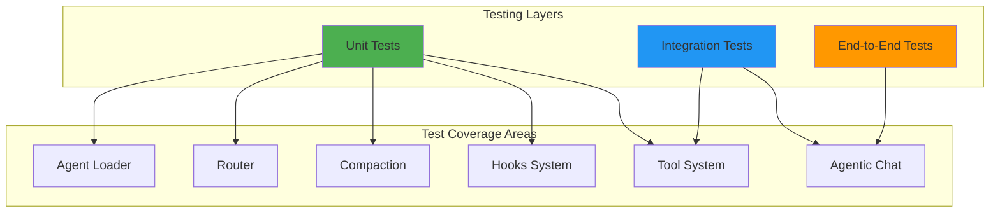

# Testing Guide

This document provides comprehensive testing guidelines for Alexi, including testing strategies, test commands, coverage expectations, and best practices.

## Table of Contents

- [Testing Strategy](#testing-strategy)
- [Test Commands](#test-commands)
- [Test Structure](#test-structure)
- [Testing Tool System](#testing-tool-system)
- [Testing Hooks](#testing-hooks)
- [Testing Compaction](#testing-compaction)
- [Testing Routing](#testing-routing)
- [Testing Custom Agents](#testing-custom-agents)
- [Integration Testing with SAP AI Core](#integration-testing-with-sap-ai-core)
- [Best Practices](#best-practices)

## Testing Strategy

Alexi employs a multi-layered testing strategy using Vitest:



### Testing Layers

1. **Unit Tests**: Test individual functions and modules in isolation
   - Tool implementations (read, write, edit, glob, grep, bash)
   - Routing logic and prompt classification
   - Compaction strategies
   - Hook execution
   - Custom agent loading and file inclusions
   - Background task management

2. **Integration Tests**: Test module interactions
   - Agentic chat loop with mocked provider
   - MCP client connections
   - Hook execution within tool calls
   - Session management with compaction

3. **End-to-End Tests**: Test full workflow paths
   - CLI command execution
   - Provider integration (requires SAP AI Core credentials)

## Test Commands

```bash
# Run all tests once
npm test

# Run tests in watch mode
npm run test:watch

# Run tests with coverage report
npm run test:coverage

# Run a single test file
npm test -- tests/orchestrator.test.ts
npm test -- tests/tool/tools/write.test.ts

# Run tests matching a pattern
npm test -- --grep "write tool"

# Run tests in a directory
npm test -- tests/tool/tools/
npm test -- tests/hooks/
npm test -- tests/compaction/

# Run with verbose output
npm test -- --reporter=verbose
```

## Test Structure

### Directory Layout

```
tests/
├── agent/
│   ├── customAgentLoader.test.ts    # Agent loading from files
│   └── fileInclusion.test.ts        # {file:path} inclusion resolution
├── compaction/
│   └── reactive-seeding.test.ts     # Overflow detection and reactive compaction
├── core/
│   └── compaction-chunked.test.ts   # Chunked compaction logic
├── hooks/
│   ├── blockCap.test.ts             # Stop hook block cap enforcement
│   ├── continueOnBlock.test.ts      # Rejection feedback loop
│   └── preToolUse.test.ts           # PreToolUse hook execution
├── mcp/
│   └── client.test.ts               # MCP client connection management
├── tool/
│   └── tools/
│       ├── bash.test.ts             # Bash tool execution
│       ├── background-tasks.test.ts # Background task lifecycle
│       └── ...
└── ...
```

### Standard Test Pattern

```typescript
import { describe, it, expect, vi, beforeEach, afterEach } from 'vitest';
import * as fs from 'fs/promises';
import * as path from 'path';
import * as os from 'os';

describe('Component Name', () => {
  let tempDir: string;
  let context: ToolContext;

  beforeEach(async () => {
    tempDir = await fs.mkdtemp(path.join(os.tmpdir(), 'alexi-test-'));
    context = { workdir: tempDir };
  });

  afterEach(async () => {
    await fs.rm(tempDir, { recursive: true, force: true });
  });

  describe('feature', () => {
    it('should do something specific', async () => {
      // Arrange
      const input = { path: path.join(tempDir, 'test.txt') };

      // Act
      const result = await myFunction(input, context);

      // Assert
      expect(result.success).toBe(true);
      expect(result.data).toBeDefined();
    });
  });
});
```

## Testing Tool System

### Mocking Dependencies

```typescript
import { vi } from 'vitest';

// Mock the permission system to bypass checks during testing
vi.mock('../src/permission/index.js', () => ({
  getPermissionManager: () => ({
    check: vi.fn().mockResolvedValue({ granted: true }),
    addRule: vi.fn(),
  }),
}));
```

### Testing File Operations

```typescript
describe('Read Tool', () => {
  let tempDir: string;

  beforeEach(async () => {
    tempDir = await fs.mkdtemp(path.join(os.tmpdir(), 'read-test-'));
    // Create test fixtures
    await fs.writeFile(path.join(tempDir, 'test.txt'), 'line1\nline2\nline3\n');
  });

  afterEach(async () => {
    await fs.rm(tempDir, { recursive: true, force: true });
  });

  it('should read file with offset and limit', async () => {
    const result = await readTool.executeUnsafe(
      { filePath: path.join(tempDir, 'test.txt'), offset: 2, limit: 1 },
      { workdir: tempDir }
    );

    expect(result.success).toBe(true);
    expect(result.data).toContain('line2');
  });
});
```

### Testing Background Tasks

```typescript
describe('Background Tasks', () => {
  it('should queue and complete a background task', async () => {
    const result = await taskTool.executeUnsafe(
      {
        prompt: 'Test task',
        description: 'Test',
        subagent_type: 'explore',
        background: true,
      },
      { workdir: tempDir }
    );

    expect(result.success).toBe(true);
    expect(result.data!.taskId).toBeDefined();
    expect(result.data!.background).toBe(true);

    // Query status
    const status = await taskStatusTool.executeUnsafe(
      { taskId: result.data!.taskId },
      { workdir: tempDir }
    );

    expect(status.data!.found).toBe(true);
  });
});
```

## Testing Hooks

### PreToolUse Hook Testing

```typescript
import { HookManagerImpl, createHookContext } from '../../src/hooks/index.js';

describe('PreToolUse Hooks', () => {
  let hookManager: HookManagerImpl;

  beforeEach(() => {
    hookManager = new HookManagerImpl();
  });

  it('should block tool execution when hook fails', async () => {
    hookManager.register({
      event: 'PreToolUse',
      type: 'command',
      command: 'exit 1', // Non-zero exit = failure
    });

    const context = createHookContext('PreToolUse', {
      toolName: 'write',
      toolParams: { path: '/forbidden/file.txt' },
    });

    const results = await hookManager.execute('PreToolUse', context);
    expect(results[0].success).toBe(false);
  });

  it('should propagate continueOnBlock to result', async () => {
    hookManager.register({
      event: 'PreToolUse',
      type: 'command',
      command: 'exit 1',
      continueOnBlock: true,
    });

    const context = createHookContext('PreToolUse', { toolName: 'write' });
    const results = await hookManager.execute('PreToolUse', context);

    expect(results[0].success).toBe(false);
    expect(results[0].continueOnBlock).toBe(true);
  });
});
```

### Block Cap Testing

```typescript
describe('Stop Hook Block Cap', () => {
  it('should cap after N consecutive blocks', async () => {
    const hookManager = new HookManagerImpl();
    hookManager.register({
      event: 'Stop',
      type: 'command',
      command: 'exit 1', // Always fails
    });

    const context = createHookContext('Stop', { toolName: 'bash' });

    // Execute 8 times (default cap)
    for (let i = 0; i < 8; i++) {
      await hookManager.execute('Stop', context);
    }

    // 9th execution should be capped
    const results = await hookManager.execute('Stop', context);
    expect(results[0].capped).toBe(true);
  });
});
```

## Testing Compaction

### Reactive Seeding Tests

```typescript
import { checkAndCompact, estimateConversationTokens } from '../../src/compaction/index.js';

describe('Reactive Seeding', () => {
  it('should compact with overflow token budget', async () => {
    const messages = [
      { role: 'system' as const, content: 'System prompt' },
      { role: 'user' as const, content: 'A'.repeat(10000) },
      { role: 'assistant' as const, content: 'B'.repeat(10000) },
      { role: 'user' as const, content: 'Recent message' },
    ];

    const { messages: compacted, wasCompacted } = await checkAndCompact(messages, {
      strategy: 'summarize',
      overflowTokens: 5000,
    });

    expect(wasCompacted).toBe(true);
    expect(compacted.length).toBeLessThan(messages.length);
  });
});
```

### Chunked Compaction Tests

```typescript
import { splitForCompaction, compactInChunks } from '../../src/core/compaction-chunks.js';

describe('Chunked Compaction', () => {
  it('should split content at natural boundaries', () => {
    const content = 'line1\n'.repeat(200000);
    const result = splitForCompaction(content, 100000);

    expect(result.chunks.length).toBeGreaterThan(1);
    // Each chunk should end at a newline
    for (const chunk of result.chunks.slice(0, -1)) {
      expect(chunk.endsWith('\n')).toBe(true);
    }
  });

  it('should compact chunks in parallel', async () => {
    const content = 'data\n'.repeat(200000);
    const compactFn = async (chunk: string) => `[summary of ${chunk.length} chars]`;

    const result = await compactInChunks(content, compactFn, 100000);
    expect(result).toContain('[summary of');
    expect(result).toContain('---'); // Chunk separator
  });
});
```

## Testing Routing

```typescript
import { routePrompt } from '../src/core/router.js';

describe('Router', () => {
  it('should route simple prompts to cheap models', () => {
    const decision = routePrompt('What is TypeScript?', { preferCheap: true });

    expect(decision.modelId).toMatch(/mini|haiku/);
    expect(decision.confidence).toBeGreaterThan(0.5);
  });

  it('should route coding prompts to capable models', () => {
    const decision = routePrompt(
      'Implement a binary search tree in TypeScript with generics'
    );

    expect(decision.modelId).toMatch(/claude|gpt-4o/);
    expect(decision.reason).toContain('coding');
  });
});
```

## Testing Custom Agents

### File Inclusion Tests

```typescript
import { resolveFileInclusions } from '../../src/agent/customAgentLoader.js';

describe('File Inclusions', () => {
  let tempDir: string;

  beforeEach(async () => {
    tempDir = await fs.mkdtemp(path.join(os.tmpdir(), 'agent-test-'));
    await fs.writeFile(path.join(tempDir, 'include.md'), 'included content');
  });

  it('should resolve {file:path} tags', async () => {
    const content = 'Before {file:include.md} after';
    const result = await resolveFileInclusions(content, tempDir);

    expect(result).toBe('Before included content after');
  });

  it('should handle missing files gracefully', async () => {
    const content = '{file:missing.md}';
    const result = await resolveFileInclusions(content, tempDir);

    expect(result).toContain('not found');
  });

  it('should respect max inclusion depth', async () => {
    // Create recursive includes
    await fs.writeFile(path.join(tempDir, 'a.md'), '{file:b.md}');
    await fs.writeFile(path.join(tempDir, 'b.md'), '{file:c.md}');
    await fs.writeFile(path.join(tempDir, 'c.md'), '{file:d.md}');
    await fs.writeFile(path.join(tempDir, 'd.md'), 'deep content');

    const result = await resolveFileInclusions('{file:a.md}', tempDir);

    expect(result).toContain('max inclusion depth reached');
  });
});
```

## Integration Testing with SAP AI Core

Integration tests require SAP AI Core credentials and are typically run in CI or manually:

```typescript
describe.skip('SAP AI Core Integration', () => {
  // Skip in CI unless credentials are available
  const hasCredentials = !!process.env.AICORE_SERVICE_KEY;

  it.skipIf(!hasCredentials)('should complete a chat request', async () => {
    const result = await sendChat('Hello, respond with just "Hi"', {
      modelOverride: 'gpt-4o-mini',
    });

    expect(result.text).toBeTruthy();
    expect(result.usage.total_tokens).toBeGreaterThan(0);
  });
});
```

### Mocking the Provider

For unit tests that don't need real API calls:

```typescript
vi.mock('../src/providers/index.js', () => ({
  getProviderForModel: vi.fn().mockReturnValue({
    complete: vi.fn().mockResolvedValue({
      text: 'Mocked response',
      toolCalls: [],
      usage: { prompt_tokens: 10, completion_tokens: 5, total_tokens: 15 },
    }),
  }),
  getDefaultModel: vi.fn().mockReturnValue('gpt-4o'),
}));
```

## Best Practices

### 1. Use Temporary Directories

Always use `fs.mkdtemp()` for file-based tests and clean up in `afterEach`:

```typescript
let tempDir: string;

beforeEach(async () => {
  tempDir = await fs.mkdtemp(path.join(os.tmpdir(), 'alexi-test-'));
});

afterEach(async () => {
  await fs.rm(tempDir, { recursive: true, force: true });
});
```

### 2. Mock External Dependencies

Never make real API calls in unit tests. Mock providers and external services:

```typescript
vi.mock('@modelcontextprotocol/sdk/client/index.js', () => ({
  Client: vi.fn().mockImplementation(() => ({
    connect: vi.fn(),
    listTools: vi.fn().mockResolvedValue({ tools: [] }),
    close: vi.fn(),
  })),
}));
```

### 3. Test Error Paths

Always test failure scenarios:

```typescript
it('should handle permission denied gracefully', async () => {
  const result = await writeTool.execute(
    { filePath: '/root/forbidden.txt', content: 'test' },
    { workdir: tempDir }
  );

  expect(result.success).toBe(false);
  expect(result.error).toBeDefined();
});
```

### 4. Set Appropriate Timeouts

For tests involving async operations or spawned processes, set explicit timeouts:

```typescript
it('should complete within timeout', async () => {
  // Background tasks need longer timeouts in CI
  const result = await taskTool.executeUnsafe(params, context);
  expect(result.success).toBe(true);
}, 5000); // 5 second timeout
```

### 5. Avoid Test Interdependence

Each test should be independent. Use `beforeEach` to reset state:

```typescript
beforeEach(() => {
  // Reset global state
  resetHookManager();
  vi.clearAllMocks();
});
```

### 6. Use Descriptive Test Names

Follow the pattern `should [expected behavior] when [condition]`:

```typescript
it('should return capped=true when Stop hook blocks 8 consecutive times', ...);
it('should feed rejection reason to model when continueOnBlock is true', ...);
it('should resolve nested file inclusions up to depth 3', ...);
```

### 7. Test Coverage Expectations

| Module | Target Coverage | Notes |
|--------|----------------|-------|
| Tool implementations | > 80% | Core functionality + error paths |
| Routing logic | > 90% | Critical for correct model selection |
| Hooks system | > 85% | All event types and hook types |
| Compaction | > 80% | All strategies + edge cases |
| Agent loader | > 85% | File resolution + error handling |
| CLI commands | > 60% | Basic option parsing + execution |

Run coverage report:
```bash
npm run test:coverage
```
