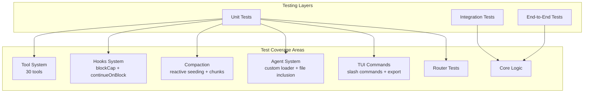
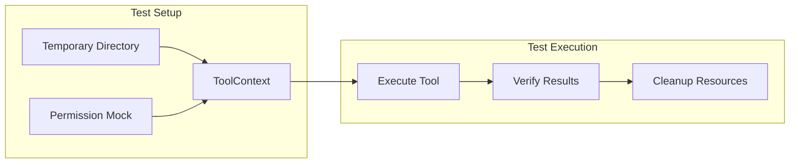
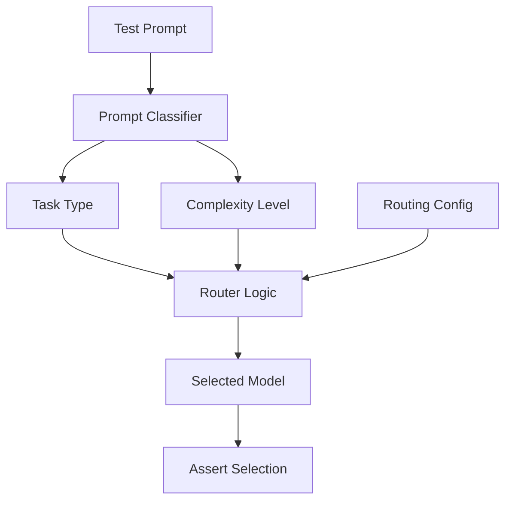

# Testing Guide

This document provides comprehensive testing guidelines for Alexi, including testing strategies, test commands, coverage expectations, and best practices.

## Table of Contents

- [Testing Strategy](#testing-strategy)
- [Test Commands](#test-commands)
- [Test Configuration](#test-configuration)
- [Test Coverage](#test-coverage)
- [Testing Tool System](#testing-tool-system)
- [Testing Hooks](#testing-hooks)
- [Testing Compaction](#testing-compaction)
- [Testing TUI Commands](#testing-tui-commands)
- [Testing Background Tasks](#testing-background-tasks)
- [Testing Routing](#testing-routing)
- [Testing Rewind Command](#testing-rewind-command)
- [Testing with SAP AI Core](#testing-with-sap-ai-core)
- [Best Practices](#best-practices)

## Testing Strategy

Alexi employs a multi-layered testing strategy:



### Testing Layers

1. **Unit Tests**: Test individual functions and modules in isolation
   - Tool implementations (30 tools)
   - Routing logic and prompt classification
   - Compaction strategies (truncate, summarize, sliding, smart)
   - Hook execution (command, HTTP, script types)
   - Agent loader with file inclusions
   - Permission management and doom loop detection

2. **Integration Tests**: Test interactions between components
   - Agentic chat with tool execution loop
   - Context overflow detection and reactive compaction
   - Hook integration in agentic execution
   - MCP client/server connections

3. **End-to-End Tests**: Test complete user workflows
   - CLI command execution
   - Multi-turn conversations with session persistence
   - Auto-routing decisions

## Test Commands

### Run All Tests

```bash
npm test
```

### Run Tests in Watch Mode

```bash
npm run test:watch
```

### Run Tests with Coverage

```bash
npm run test:coverage
```

### Run Specific Test Files

```bash
# Run a single test file
npm test -- tests/tool/tools/write.test.ts

# Run tests in a directory
npm test -- tests/tool/tools/

# Run tests matching a pattern
npm test -- --grep "write tool"

# Run hook tests
npm test -- tests/hooks/

# Run compaction tests
npm test -- tests/compaction/

# Run agent tests
npm test -- tests/agent/
```

## Test Configuration

Alexi uses **Vitest** with the following configuration (`vitest.config.ts`):

```typescript
import { defineConfig } from 'vitest/config';
import react from '@vitejs/plugin-react';

export default defineConfig({
  plugins: [react()],
  test: {
    environment: 'node',
    coverage: {
      provider: 'v8',
      reporter: ['text', 'html', 'lcov'],
      thresholds: {
        lines: 15,
        functions: 15,
        branches: 15,
        statements: 15,
      },
    },
  },
});
```

Key configuration:
- **Environment**: Node.js (not jsdom)
- **React Plugin**: Enabled for Ink TUI component testing
- **Coverage Provider**: V8
- **Coverage Threshold**: 15% minimum (increasing as coverage improves)

## Test Coverage

### Coverage Expectations

| Component | Target | Description |
|-----------|--------|-------------|
| Tool System | 90%+ | File operations, permissions, error handling |
| Hooks | 85%+ | blockCap, continueOnBlock, execution types |
| Compaction | 85%+ | All strategies, reactive seeding, chunked |
| Agent Loader | 80%+ | Custom agents, file inclusions |
| Core Logic | 85%+ | Orchestrator, router, session |
| TUI | 70%+ | Slash commands, context hooks |

### Generating Coverage Reports

```bash
npm run test:coverage

# View HTML report
open coverage/index.html
```

## Testing Tool System

### Tool Test Architecture



### Standard Tool Test Pattern

```typescript
import { describe, it, expect, vi, beforeEach, afterEach } from 'vitest';
import * as fs from 'fs/promises';
import * as path from 'path';
import os from 'os';

// Mock tool index to bypass permission checks
vi.mock('../../../src/tool/index.js', async () => {
  const actual = await vi.importActual('../../../src/tool/index.js');
  return {
    ...actual,
    defineTool: (def: any) => ({
      ...def,
      execute: def.execute,
      executeUnsafe: def.execute,
      toFunctionSchema: () => ({
        name: def.name,
        description: def.description,
        parameters: {},
      }),
    }),
  };
});

import { writeTool } from '../../../src/tool/tools/write.js';
import type { ToolContext } from '../../../src/tool/index.js';

describe('Write Tool', () => {
  let tempDir: string;
  let context: ToolContext;

  beforeEach(async () => {
    tempDir = await fs.mkdtemp(path.join(os.tmpdir(), 'write-tool-test-'));
    context = { workdir: tempDir };
  });

  afterEach(async () => {
    await fs.rm(tempDir, { recursive: true, force: true });
  });

  it('should create a new file with content', async () => {
    const filePath = path.join(tempDir, 'new-file.txt');
    const content = 'Hello, World!';

    const result = await writeTool.execute({ filePath, content }, context);

    expect(result.success).toBe(true);
    expect(result.data?.created).toBe(true);

    // Verify actual file system change
    const actualContent = await fs.readFile(filePath, 'utf-8');
    expect(actualContent).toBe(content);
  });
});
```

### Tool Test Coverage

| Tool | Test File | Test Cases |
|------|-----------|------------|
| `read` | `tests/tool/tools/read.test.ts` | 20+ cases |
| `write` | `tests/tool/tools/write.test.ts` | 18+ cases |
| `edit` | `tests/tool/tools/edit.test.ts` | 15+ cases |
| `glob` | `tests/tool/tools/glob.test.ts` | 16+ cases |
| `grep` | `tests/tool/tools/grep.test.ts` | 20+ cases |
| `bash` | `tests/tool/tools/bash.test.ts` | 10+ cases |
| `task` | `tests/tool/tools/background-tasks.test.ts` | 8+ cases |
| `task_status` | `tests/tool/tools/background-tasks.test.ts` | 3+ cases |
| `skill` (description guard) | `src/tool/skill.test.ts` | 1 case |

### Skill Tool Description Guard

The skill tool exposes a description string to the LLM that is rendered into the
agentic system prompt. To prevent an upstream-sync placeholder description from
leaking into the production tool catalogue, a single regression test asserts
that the registered skill tool description does not contain the placeholder
phrases `tool-skill` or `Skill for tool tests.`:

```ts
// src/tool/skill.test.ts
import { describe, expect, it } from 'vitest';
import { tool } from './registry';

describe('Skill Tool Test', () => {
  it('should not contain deprecated descriptions', () => {
    expect(tool.description).not.toContain('tool-skill');
    expect(tool.description).not.toContain('Skill for tool tests.');
  });
});
```

The canonical skill tool implementation is in `src/tool/tools/skill.ts`, which
exports `skillTool` (registered under the name `'skill'`). When extending or
maintaining the skill tool's description, run `npm test -- src/tool/skill.test.ts`
to verify the placeholder strings are not reintroduced.

> **Maintainer note**: As of version `0.5.13`, this test imports a `tool`
> binding from `./registry` that is not currently exported by `src/tool/registry.ts`.
> The test will fail at import-time with a `TypeError` until either the import
> is changed to `import { skillTool } from './tools/skill.js'` (and the
> assertions adjusted accordingly) or `registry.ts` is updated to re-export a
> `tool` symbol pointing at the registered skill tool. See the `Known issues`
> section in `CHANGELOG.md` for the autohealing follow-up.

## Testing Hooks

### Hook Test Files

- `tests/hooks/blockCap.test.ts` -- Tests consecutive Stop hook rejection cap
- `tests/hooks/continueOnBlock.test.ts` -- Tests rejection feedback to model

### Testing Block Cap

```typescript
import { describe, it, expect, beforeEach, afterEach } from 'vitest';
import { executeHooks, createHookContext, getBlockCap } from '../../src/hooks/index.js';

describe('Hook Block Cap', () => {
  it('should cap consecutive Stop rejections', async () => {
    const hooks = [
      {
        event: 'Stop' as const,
        type: 'command' as const,
        command: 'exit 1', // Always rejects
        timeout: 5000,
      },
    ];

    const blockCap = getBlockCap();  // Default cap value
    let blocked = 0;

    for (let i = 0; i < blockCap + 5; i++) {
      const ctx = createHookContext({ event: 'Stop' });
      const results = await executeHooks(hooks, ctx);
      if (results[0]?.capped) {
        break;
      }
      if (!results[0]?.success) {
        blocked++;
      }
    }

    expect(blocked).toBeLessThanOrEqual(blockCap);
  });
});
```

### Testing continueOnBlock

```typescript
describe('continueOnBlock', () => {
  it('should feed rejection back to model', async () => {
    const hooks = [
      {
        event: 'PostToolUse' as const,
        type: 'command' as const,
        command: 'echo "BLOCKED: unsafe operation" && exit 1',
        continueOnBlock: true,
      },
    ];

    const ctx = createHookContext({
      event: 'PostToolUse',
      toolName: 'write',
    });

    const results = await executeHooks(hooks, ctx);

    expect(results[0]?.success).toBe(false);
    expect(results[0]?.continueOnBlock).toBe(true);
    expect(results[0]?.output).toContain('BLOCKED');
  });
});
```

## Testing Compaction

### Compaction Test Files

- `tests/compaction/reactive-seeding.test.ts` -- Tests overflow-triggered compaction with target sizing
- `tests/core/compaction-chunked.test.ts` -- Tests chunked compaction for large contexts

### Testing Reactive Seeding

```typescript
import { describe, it, expect } from 'vitest';
import { CompactionManager, type Message } from '../../src/compaction/index.js';

describe('Reactive Seeding', () => {
  it('should include target instruction when overflowTokens provided', async () => {
    let capturedPrompt = '';
    const manager = new CompactionManager({
      summarizeFn: async (prompt: string) => {
        capturedPrompt = prompt;
        return 'Summary of conversation';
      },
    });

    const messages: Message[] = [
      { role: 'user', content: 'Long message '.repeat(500) },
      { role: 'assistant', content: 'Long response '.repeat(500) },
      { role: 'user', content: 'Recent message' },
    ];

    await manager.compact(messages, {
      strategy: 'summarize',
      preserveRecent: 1,
      overflowTokens: 5000,
    });

    expect(capturedPrompt).toContain('Keep your summary under approximately');
    expect(capturedPrompt).toContain('tokens');
  });
});
```

### Testing Chunked Compaction

```typescript
import { describe, it, expect } from 'vitest';
import { splitForCompaction, compactInChunks } from '../../src/core/compaction-chunks.js';

describe('Chunked Compaction', () => {
  it('should split large content at natural boundaries', () => {
    const content = 'Line 1\nLine 2\nLine 3\n'.repeat(10000);
    const { chunks, totalSize } = splitForCompaction(content, 1000);

    expect(chunks.length).toBeGreaterThan(1);
    expect(totalSize).toBe(content.length);
    // Each chunk should end at a newline
    for (const chunk of chunks.slice(0, -1)) {
      expect(chunk.endsWith('\n')).toBe(true);
    }
  });

  it('should compact and merge chunks', async () => {
    const content = 'Content block.\n'.repeat(5000);
    const result = await compactInChunks(
      content,
      async (chunk) => `Summary of ${chunk.length} chars`,
      500
    );

    expect(result).toContain('Summary of');
    expect(result).toContain('---'); // Chunk separator
  });
});
```

## Testing TUI Commands

TUI slash commands are tested via the `useCommands` hook with React context mocking.

### Test File

- `tests/cli/tui/useCommands.test.tsx`

### Testing Pattern

```typescript
import { describe, it, expect, vi, beforeEach } from 'vitest';
import React from 'react';
import { render } from 'ink-testing-library';
import { Text } from 'ink';

// Mock contexts before importing hooks
const mockAddSystemMessage = vi.fn();

vi.mock('../../../src/cli/tui/context/AttachmentContext.js', () => ({
  useAttachments: () => ({
    pending: [],
    pasteFromClipboard: vi.fn().mockResolvedValue(undefined),
    addFromFile: vi.fn().mockResolvedValue(undefined),
    clearAll: vi.fn(),
  }),
}));

import { useCommands } from '../../../src/cli/tui/hooks/useCommands.js';

describe('/export command', () => {
  beforeEach(() => {
    vi.clearAllMocks();
  });

  it('should export session and show system message', async () => {
    let captured: any;
    function CommandCapture() {
      captured = useCommands({ addSystemMessage: mockAddSystemMessage });
      return <Text>ready</Text>;
    }

    render(<CommandCapture />);

    const handled = await captured.handleCommand('/export /tmp/test.json');
    expect(handled).toBe(true);
    expect(mockAddSystemMessage).toHaveBeenCalled();
  });
});
```

Key patterns:
1. **Mock Before Import**: All `vi.mock()` calls before hook imports
2. **addSystemMessage Callback**: The `useCommands` hook now accepts an `addSystemMessage` option
3. **Capture Hook Return**: Render a component that captures the hook value
4. **Test Command Dispatch**: Call `handleCommand()` and verify side effects

## Testing Background Tasks

Background tasks are gated behind the `ALEXI_EXPERIMENTAL_BACKGROUND_TASKS` feature flag.

### Test File

- `tests/tool/tools/background-tasks.test.ts`

### Pattern

```typescript
import { describe, it, expect, beforeEach, afterEach } from 'vitest';
import { taskTool, getTaskStore } from '../../../src/tool/tools/task.js';
import { taskStatusTool } from '../../../src/tool/tools/task_status.js';
import type { ToolContext } from '../../../src/tool/index.js';

describe('Background Tasks', () => {
  let context: ToolContext;
  let originalEnv: string | undefined;

  beforeEach(() => {
    context = { workdir: '/tmp/test', sessionId: 'test-session' };
    originalEnv = process.env.ALEXI_EXPERIMENTAL_BACKGROUND_TASKS;
  });

  afterEach(() => {
    if (originalEnv === undefined) {
      delete process.env.ALEXI_EXPERIMENTAL_BACKGROUND_TASKS;
    } else {
      process.env.ALEXI_EXPERIMENTAL_BACKGROUND_TASKS = originalEnv;
    }
    getTaskStore().clear();
  });

  it('should create background task when feature enabled', async () => {
    process.env.ALEXI_EXPERIMENTAL_BACKGROUND_TASKS = 'true';

    const result = await taskTool.execute({
      prompt: 'Test background task',
      description: 'Background test',
      subagent_type: 'explore',
      background: true,
    }, context);

    expect(result.success).toBe(true);
    expect(result.data?.status).toBe('queued');
    expect(result.data?.background).toBe(true);
  });

  it('should track task completion', async () => {
    process.env.ALEXI_EXPERIMENTAL_BACKGROUND_TASKS = 'true';

    const taskResult = await taskTool.execute(
      { prompt: 'Test', description: 'Test', background: true },
      context
    );

    const taskId = taskResult.data!.taskId;

    // Wait with generous margin for CI (stub: 100ms + 1000ms = ~1100ms)
    await new Promise((resolve) => setTimeout(resolve, 2000));

    const statusResult = await taskStatusTool.execute({ taskId }, context);
    expect(statusResult.data?.status).toBe('completed');
  });
});
```

Key testing patterns:
1. **Environment Variable Control**: Enable/disable via `ALEXI_EXPERIMENTAL_BACKGROUND_TASKS`
2. **Task Store Cleanup**: Always call `getTaskStore().clear()` in `afterEach`
3. **Generous Timeouts**: Use ~2x the expected duration for CI scheduling variability
4. **Non-null Assertions**: Use `taskResult.data!.taskId` (correct precedence)

## Testing Rewind Command

### Test File

- `tests/command/rewind.test.ts` -- Tests the `/rewind` command implementation

### Testing Pattern

The rewind command tests verify turn boundary detection, argument parsing, discard mode, and summarize mode:

```typescript
import { describe, it, expect, vi, beforeEach, afterEach } from 'vitest';
import type { Message } from '../../src/core/sessionManager.js';
import { setLLMSummarizeFn, type LLMSummarizeFn } from '../../src/core/compaction.js';
import {
  getTurnBoundaries,
  parseRewindArgs,
  validateTurnNumber,
  rewindDiscard,
  rewindSummarize,
  rewindList,
  executeRewind,
} from '../../src/command/rewind.js';

describe('Rewind Command', () => {
  let mockSummarizeFn: LLMSummarizeFn;

  beforeEach(() => {
    mockSummarizeFn = vi.fn().mockResolvedValue('Summary of earlier conversation');
    setLLMSummarizeFn(mockSummarizeFn);
  });

  afterEach(() => {
    setLLMSummarizeFn((() => Promise.resolve('')) as LLMSummarizeFn);
  });

  describe('getTurnBoundaries', () => {
    it('should identify user messages as turn boundaries', () => {
      const messages = createConversation();
      const boundaries = getTurnBoundaries(messages);
      expect(boundaries).toHaveLength(4);
    });

    it('should skip system messages when counting turns', () => {
      const messages = [
        createMessage('system', 'System prompt'),
        createMessage('user', 'First user message'),
        createMessage('assistant', 'Response'),
      ];
      const boundaries = getTurnBoundaries(messages);
      expect(boundaries).toHaveLength(1);
      expect(boundaries[0].turnNumber).toBe(1);
    });

    it('should truncate preview to 50 characters', () => {
      const longContent = 'a'.repeat(100);
      const messages = [createMessage('user', longContent)];
      const boundaries = getTurnBoundaries(messages);
      expect(boundaries[0].preview).toContain('...');
    });
  });

  describe('rewindDiscard', () => {
    it('should discard messages after specified turn', () => {
      const messages = createConversation();
      const result = rewindDiscard(messages, 2);
      expect(result.success).toBe(true);
      expect(result.discardedCount).toBeGreaterThan(0);
    });
  });

  describe('rewindSummarize', () => {
    it('should summarize messages before specified turn', async () => {
      const messages = createConversation();
      const result = await rewindSummarize(messages, 3);
      expect(result.success).toBe(true);
      expect(result.summarizedCount).toBeGreaterThan(0);
      expect(mockSummarizeFn).toHaveBeenCalled();
    });
  });
});
```

### Key Testing Patterns

1. **Mock LLM Summarize**: Use `setLLMSummarizeFn()` to inject a mock summarize function
2. **Reset After Each Test**: Always restore the summarize function in `afterEach`
3. **Helper Functions**: Use `createMessage()` and `createConversation()` helpers for test data
4. **Boundary Validation**: Test edge cases like empty messages, system-only messages, and out-of-range turns

### Test Coverage

| Function | Test Cases |
|----------|------------|
| `getTurnBoundaries` | 6 cases (empty, system-only, truncation, standard) |
| `parseRewindArgs` | 5 cases (number, flag, both, empty, non-numeric) |
| `validateTurnNumber` | 5 cases (zero, negative, out-of-range, valid, empty) |
| `rewindDiscard` | 5 cases (middle turn, first turn, last turn, invalid) |
| `rewindSummarize` | 6 cases (middle, preserve recent, summary message, first turn, invalid, LLM called) |
| `rewindList` | 3 cases (standard, empty, previews) |
| `executeRewind` | 4 cases (no args, turn only, summarize flag, flag ordering) |

## Testing Code Review Command

### Test Files

- `tests/command/codeReview.test.ts` -- Core executor tests (`executeCodeReview`, `pickModelForEffort`, `buildSystemPrompt`)
- `src/cli/commands/__tests__/codeReview.test.ts` -- Commander wiring smoke test for `alexi code-review`

### Testing the Core Executor

The core executor reads `git diff` via `child_process.execFile` and calls `sendChat`. Both must
be mocked to keep tests hermetic and parallel-safe. Order matters: `vi.mock` calls are hoisted
above imports, but stating the imports explicitly after the mocks keeps the file readable.

```typescript
import { describe, it, expect, vi, beforeEach } from 'vitest';

vi.mock('child_process', () => ({
  execFile: vi.fn(),
}));
vi.mock('../../src/core/orchestrator.js', () => ({
  sendChat: vi.fn(),
}));
vi.mock('../../src/providers/index.js', () => ({
  getDefaultModel: vi.fn(() => 'sap-ai-core/default'),
}));
vi.mock('../../src/config/routingConfig.js', () => ({
  loadRoutingConfig: vi.fn(),
}));

import { executeCodeReview, pickModelForEffort } from '../../src/command/codeReview.js';
import { execFile } from 'child_process';
import { sendChat } from '../../src/core/orchestrator.js';

describe('executeCodeReview', () => {
  beforeEach(() => {
    vi.clearAllMocks();
    vi.mocked(execFile).mockImplementation((_file, _args, _opts, cb: any) => {
      cb(null, 'diff --git a/x.ts b/x.ts\n', '');
      return {} as any;
    });
    vi.mocked(sendChat).mockResolvedValue({
      text: 'MUST FIX\n- nothing\n',
      modelUsed: 'sap-ai-core/default',
      usage: { total_tokens: 42 },
    } as any);
  });

  it('returns the empty-diff fast path without calling sendChat', async () => {
    vi.mocked(execFile).mockImplementation((_f, _a, _o, cb: any) => {
      cb(null, '', '');
      return {} as any;
    });
    const result = await executeCodeReview({ effort: 'medium' });
    expect(result.review).toBe('No changes to review.');
    expect(result.modelUsed).toBe('');
    expect(sendChat).not.toHaveBeenCalled();
  });

  it('respects --base by invoking git diff <base>...HEAD', async () => {
    await executeCodeReview({ target: { base: 'main' } });
    const args = vi.mocked(execFile).mock.calls[0][1];
    expect(args).toEqual(['diff', 'main...HEAD']);
  });

  it('aborts before invoking the model when signal is already aborted', async () => {
    const ctrl = new AbortController();
    ctrl.abort();
    await expect(executeCodeReview({ signal: ctrl.signal })).rejects.toThrow(/cancelled/);
  });
});
```

### Testing Commander Wiring

The `alexi code-review` subcommand is wired through `registerCodeReviewCommand`. The smoke test
mocks the core executor and uses `Command.exitOverride()` so Commander throws instead of calling
`process.exit`:

```typescript
import { Command } from 'commander';
import { registerCodeReviewCommand } from '../codeReview.js';
import { executeCodeReview } from '../../../command/codeReview.js';

vi.mock('../../../command/codeReview.js', () => ({
  executeCodeReview: vi.fn(),
}));

it('forwards --effort high and --base main', async () => {
  const program = new Command();
  program.exitOverride();
  registerCodeReviewCommand(program);

  await program.parseAsync([
    'node', 'alexi', 'code-review', '--effort', 'high', '--base', 'main',
  ]);

  const opts = vi.mocked(executeCodeReview).mock.calls[0][0];
  expect(opts?.effort).toBe('high');
  expect(opts?.target).toEqual({ base: 'main' });
});
```

### Testing Effort-Based Model Routing

`pickModelForEffort` is pure and easy to test by stubbing `loadRoutingConfig`:

```typescript
import { loadRoutingConfig } from '../../src/config/routingConfig.js';

it('picks a reasoning + expensive model for high effort', () => {
  vi.mocked(loadRoutingConfig).mockReturnValue({
    models: [
      { id: 'cheap', costTier: 'cheap', enabled: true },
      { id: 'expensive', costTier: 'expensive', enabled: true },
      { id: 'reasoning', costTier: 'expensive', reasoning: true, enabled: true },
    ],
  } as any);
  expect(pickModelForEffort('high')).toBe('reasoning');
});

it('picks a cheap model for low effort', () => {
  vi.mocked(loadRoutingConfig).mockReturnValue({
    models: [{ id: 'cheap', costTier: 'cheap', enabled: true }],
  } as any);
  expect(pickModelForEffort('low')).toBe('cheap');
});
```

### Key Testing Patterns

1. **Mock `child_process.execFile` directly**, not `util.promisify`. The executor wraps the
   raw callback signature so tests can stub the module without attaching a custom promisify symbol.
2. **Mock `sendChat` and `getDefaultModel`** to avoid network calls and keep tests deterministic.
3. **Use `Command.exitOverride()`** in Commander wiring tests so failures throw instead of
   killing the test process.
4. **Test the empty-diff fast path** explicitly -- it short-circuits before the LLM call and
   returns `modelUsed: ''`.
5. **Test cancellation** by aborting the `AbortSignal` before calling `executeCodeReview`; the
   executor checks the signal both before reading the diff and before invoking the model.

## Testing Routing

### Router Test Flow



### Example

```typescript
describe('Auto Router', () => {
  it('should select cheap model for simple prompts', async () => {
    const result = await router.selectModel({
      prompt: 'What is 2+2?',
      preferCheap: true
    });
    
    expect(result.model).toBe('gpt-4o-mini');
    expect(result.confidence).toBeGreaterThan(80);
  });
  
  it('should select reasoning model for complex tasks', async () => {
    const result = await router.selectModel({
      prompt: 'Analyze this distributed systems architecture...',
      preferCheap: false
    });
    
    expect(result.model).toMatch(/gpt-4|claude/);
  });
});
```

## Testing with SAP AI Core

### Local Development Testing

For local testing without SAP AI Core connectivity:

```bash
# Mock provider mode
export ALEXI_MOCK_PROVIDER=true
npm test
```

### Integration Testing

For real SAP AI Core integration tests:

```bash
export AICORE_SERVICE_KEY='{...}'
export AICORE_RESOURCE_GROUP='default'
npm run test:integration
```

### CI/CD Testing

GitHub Actions uses repository secrets:

```yaml
- name: Run Tests
  env:
    AICORE_SERVICE_KEY: ${​{ secrets.AICORE_SERVICE_KEY }}
    AICORE_RESOURCE_GROUP: ${​{ secrets.AICORE_RESOURCE_GROUP }}
  run: npm test
```

## Testing the Auto-CA Harvester

The `src/providers/ca.ts` harvester touches platform-specific I/O
(macOS `security` subprocess, Linux CA bundle files, `https.globalAgent`
mutation). Tests must never touch real system state, so every entry point
accepts injectable overrides. The canonical suite is
`tests/providers/ca.test.ts` — mirror its patterns when extending coverage.

### Test file

- `tests/providers/ca.test.ts` — Covers platform detection, PEM extraction,
  Linux / macOS harvesters, `NODE_EXTRA_CA_CERTS` reader, cache lifecycle, and
  the `installHarvestedCAs` merge contract.

### Injecting the fake filesystem and subprocess runner

Every harvester function has a matching parameter for its I/O boundary. Wire
the fakes explicitly instead of relying on `vi.mock` of `node:fs` /
`node:child_process`:

```typescript
import { describe, it, expect, beforeEach } from 'vitest';
import {
  harvestLinuxCAs,
  harvestMacosCAs,
  installHarvestedCAs,
  _resetHarvestedCAsCache,
} from '../../src/providers/ca.js';

beforeEach(() => {
  _resetHarvestedCAsCache();
});

it('reads the first existing Linux bundle path', () => {
  const files = new Map<string, string>([
    ['/etc/ssl/certs/ca-certificates.crt', CERT_A_PEM + '\n' + CERT_B_PEM],
  ]);
  const blocks = harvestLinuxCAs(
    ['/etc/ssl/certs/ca-certificates.crt', '/etc/ssl/cert.pem'],
    (p) => files.get(p) ?? '',
    (p) => files.has(p)
  );
  expect(blocks).toEqual([CERT_A_PEM, CERT_B_PEM]);
});

it('dedupes across macOS keychains', () => {
  const runner = (keychain: string): string =>
    keychain.endsWith('SystemRootCertificates.keychain') ? CERT_A_PEM : CERT_A_PEM;
  const blocks = harvestMacosCAs(
    ['/System/Library/Keychains/SystemRootCertificates.keychain', '/Library/Keychains/System.keychain'],
    runner
  );
  expect(blocks).toEqual([CERT_A_PEM]);
});
```

### Testing `installHarvestedCAs` without mutating `https.globalAgent`

Pass a throw-away `https.Agent` and inspect its `options.ca` list after the
call. The install merges Node defaults (`tls.rootCertificates`), any existing
`agent.options.ca`, extras from `NODE_EXTRA_CA_CERTS`, and harvested PEMs — in
that order, deduplicated by string identity:

```typescript
import * as https from 'node:https';
import * as tls from 'node:tls';

it('merges (rather than replaces) an existing ca list', () => {
  const agent = new https.Agent({ ca: [EXISTING_PEM] });
  const result = installHarvestedCAs({
    agent,
    platform: 'linux',
    linuxPaths: ['/fake/bundle.pem'],
    reader: () => HARVESTED_PEM,
    exists: () => true,
    env: {}, // no NODE_EXTRA_CA_CERTS
  });
  expect(result.disabled).toBe(false);
  expect(result.harvestedCount).toBe(1);
  const ca = (agent.options.ca as string[]) ?? [];
  expect(ca).toContain(EXISTING_PEM);
  expect(ca).toContain(HARVESTED_PEM);
  expect(ca.length).toBeGreaterThanOrEqual(tls.rootCertificates.length + 2);
});

it('is a no-op when ALEXI_DISABLE_CA_HARVEST is set', () => {
  const agent = new https.Agent();
  const result = installHarvestedCAs({
    agent,
    env: { ALEXI_DISABLE_CA_HARVEST: '1' },
  });
  expect(result).toEqual({
    disabled: true,
    harvestedCount: 0,
    extraCount: 0,
    totalCount: 0,
  });
});
```

### Cache-lifecycle pitfalls

`getHarvestedCAs` caches its result for the process lifetime. Any test that
mutates the harvest inputs mid-run must call `_resetHarvestedCAsCache()` in
`beforeEach` — otherwise the second test observes the first test's harvest
regardless of the injected overrides. The reset hook is `@internal` and only
exists to unblock unit tests; do not use it in production code.

## Testing Agent Custom Loader

### Test Files

- `tests/agent/customAgentLoader.test.ts` -- Tests loading agents from markdown files
- `tests/agent/fileInclusion.test.ts` -- Tests `{file:path}` recursive inclusions

### Testing File Inclusions

```typescript
import { describe, it, expect } from 'vitest';
import { resolveFileInclusions } from '../../src/agent/customAgentLoader.js';
import * as fs from 'fs/promises';
import * as path from 'path';
import os from 'os';

describe('resolveFileInclusions', () => {
  let tempDir: string;

  beforeEach(async () => {
    tempDir = await fs.mkdtemp(path.join(os.tmpdir(), 'inclusion-test-'));
  });

  afterEach(async () => {
    await fs.rm(tempDir, { recursive: true, force: true });
  });

  it('should resolve file inclusions', async () => {
    await fs.writeFile(path.join(tempDir, 'preamble.md'), 'Preamble content');
    const content = 'Before {file:preamble.md} After';

    const result = await resolveFileInclusions(content, tempDir);

    expect(result).toBe('Before Preamble content After');
  });

  it('should cap recursion at MAX_INCLUSION_DEPTH (3)', async () => {
    // Create recursive chain
    await fs.writeFile(path.join(tempDir, 'a.md'), '{file:b.md}');
    await fs.writeFile(path.join(tempDir, 'b.md'), '{file:c.md}');
    await fs.writeFile(path.join(tempDir, 'c.md'), '{file:d.md}');
    await fs.writeFile(path.join(tempDir, 'd.md'), 'deep content');

    const result = await resolveFileInclusions('{file:a.md}', tempDir);

    expect(result).toContain('max inclusion depth reached');
  });

  it('should handle missing files gracefully', async () => {
    const content = 'Before {file:nonexistent.md} After';
    const result = await resolveFileInclusions(content, tempDir);

    expect(result).toContain('not found');
  });
});
```

## Testing MCP Client

### Test File

- `tests/mcp/client.test.ts`

The MCP client tests verify connection management, tool discovery, and reconnection behavior.

## Best Practices

### 1. Test Isolation

Always use temporary directories and clean up:

```typescript
beforeEach(async () => {
  tempDir = await fs.mkdtemp(path.join(os.tmpdir(), 'test-'));
  context = { workdir: tempDir };
});

afterEach(async () => {
  await fs.rm(tempDir, { recursive: true, force: true });
});
```

### 2. Mock External Dependencies

```typescript
vi.mock('../../../src/tool/index.js', async () => {
  const actual = await vi.importActual('../../../src/tool/index.js');
  return {
    ...actual,
    defineTool: (def: any) => ({
      ...def,
      execute: def.execute,
      executeUnsafe: def.execute,
    }),
  };
});
```

### 3. Test Both Success and Failure Cases

```typescript
it('should handle non-existent file', async () => {
  const result = await readTool.execute(
    { filePath: '/nonexistent.txt' },
    context
  );
  expect(result.success).toBe(false);
  expect(result.error).toContain('not found');
});
```

### 4. Verify Actual File System Changes

```typescript
it('should create file on disk', async () => {
  const result = await writeTool.execute({ filePath, content }, context);
  expect(result.success).toBe(true);

  // Verify file exists
  const actual = await fs.readFile(filePath, 'utf-8');
  expect(actual).toBe(content);
});
```

### 5. Test Edge Cases

```typescript
describe('edge cases', () => {
  it('should handle empty files', async () => { /* ... */ });
  it('should handle unicode content', async () => { /* ... */ });
  it('should handle files with spaces in name', async () => { /* ... */ });
  it('should handle deeply nested directories', async () => { /* ... */ });
  it('should handle line ending preservation (CRLF/LF)', async () => { /* ... */ });
});
```

### 6. Use Descriptive Test Names

```typescript
// Good
it('should create parent directories if they do not exist', async () => { });
it('should cap consecutive Stop rejections at blockCap limit', async () => { });

// Bad
it('test write', async () => { });
```

### 7. Feature-Flagged Tests

```typescript
let originalEnv: string | undefined;

beforeEach(() => {
  originalEnv = process.env.FEATURE_FLAG;
});

afterEach(() => {
  if (originalEnv === undefined) {
    delete process.env.FEATURE_FLAG;
  } else {
    process.env.FEATURE_FLAG = originalEnv;
  }
});
```

### 8. Async Timing in CI

When testing background operations, use generous margins:

```typescript
// Theoretical minimum: 1100ms (100ms + 1000ms)
// CI buffer: 2000ms (accounts for scheduling variability)
await new Promise((resolve) => setTimeout(resolve, 2000));
```

## Continuous Integration

Tests run automatically on:
- Pull requests to main/master
- Push to main/master
- Manual workflow dispatch


## Troubleshooting

### Common Test Issues

1. **"File not found" errors**: Ensure temp dirs created in `beforeEach`
2. **Permission errors**: Verify `defineTool` mock bypasses permission checks
3. **Timeout errors**: Increase timeout or use generous margins for async ops
4. **Flaky tests**: Use proper cleanup, unique temp dirs, and sufficient wait times
5. **React rendering errors**: Ensure `@vitejs/plugin-react` is configured in vitest.config.ts
6. **Module mock ordering**: `vi.mock()` must appear before module imports

## Contributing Tests

When contributing new features:

1. Write tests first (TDD approach)
2. Target 80%+ coverage for new code
3. Test both success and failure paths
4. Include edge cases
5. Follow the patterns documented above
6. Run full test suite before submitting: `npm test && npm run lint`
