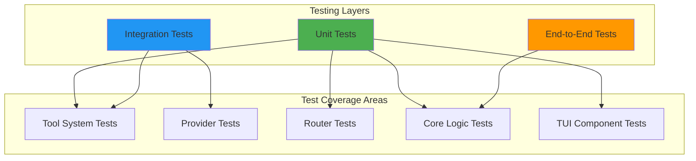
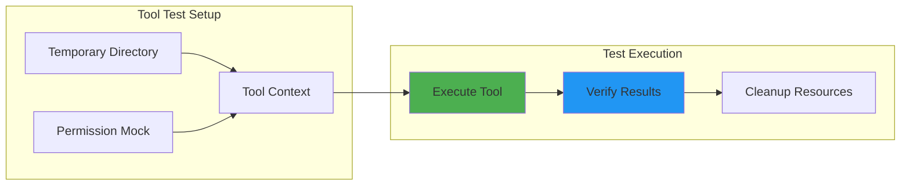
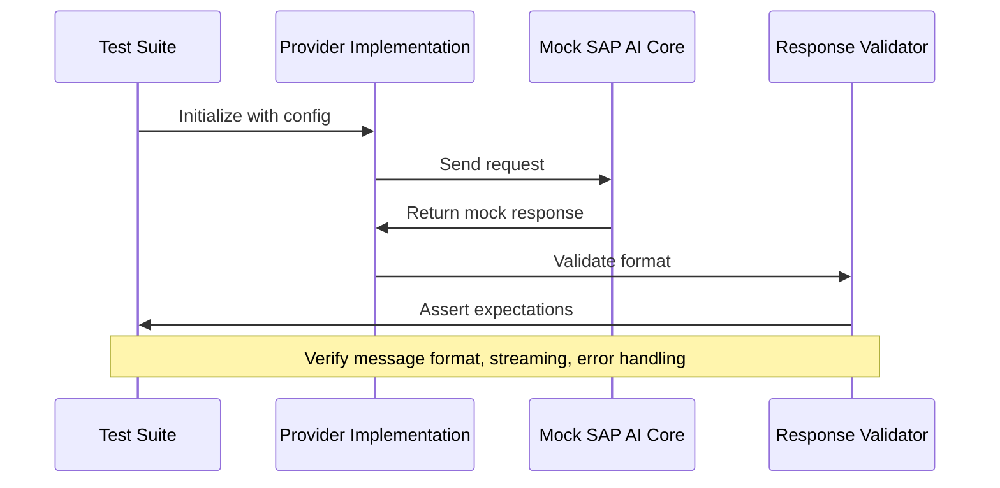
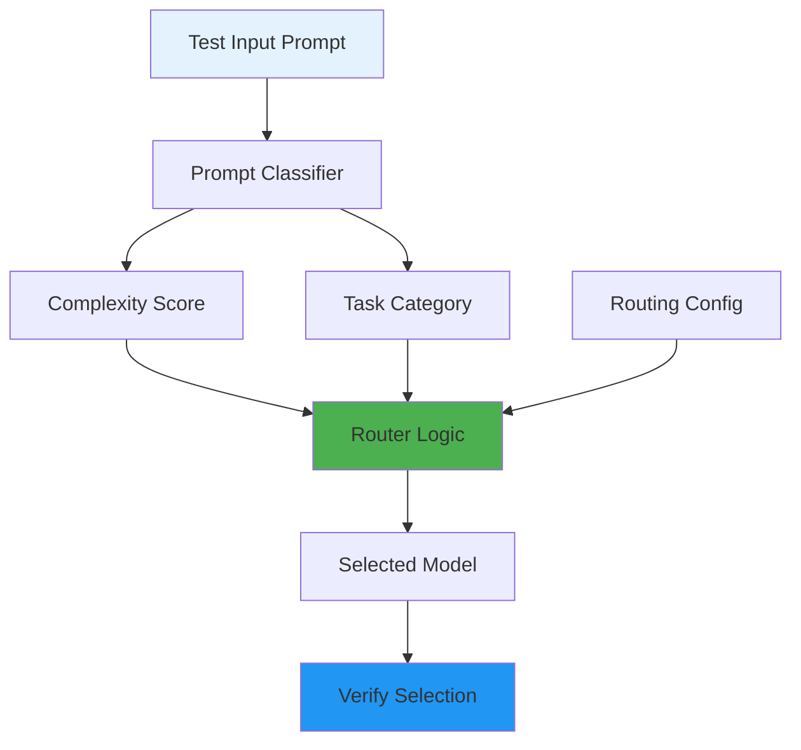
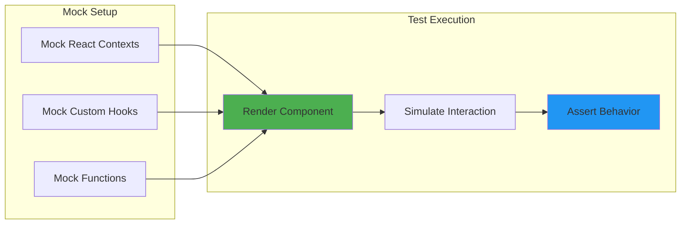

# Testing Guide

This document provides comprehensive testing guidelines for Alexi, including testing strategies, test commands, coverage expectations, and best practices.

## Table of Contents

- [Testing Strategy](#testing-strategy)
- [Test Commands](#test-commands)
- [Test Coverage](#test-coverage)
- [Testing Tool System](#testing-tool-system)
- [Testing Providers](#testing-providers)
- [Testing Routing](#testing-routing)
- [Testing TUI Components](#testing-tui-components)
- [Best Practices](#best-practices)

## Testing Strategy

Alexi employs a multi-layered testing strategy to ensure reliability and maintainability:



### Testing Layers

1. **Unit Tests**: Test individual functions and modules in isolation
   - Tool implementations
   - Routing logic
   - Utility functions
   - Permission management
   - TUI hooks and components

2. **Integration Tests**: Test interactions between components
   - Provider integrations with SAP AI Core
   - Tool execution with permission system
   - Session management with persistence

3. **End-to-End Tests**: Test complete user workflows
   - CLI command execution
   - Multi-turn conversations
   - Auto-routing decisions

## Test Commands

### Run All Tests

```bash
npm test
```

### Run Tests in Watch Mode

```bash
npm run test:watch
```

### Run Tests with Coverage

```bash
npm run test:coverage
```

### Run Specific Test Files

```bash
# Run tool tests
npm test -- tests/tool/tools/

# Run specific test file
npm test -- tests/tool/tools/write.test.ts

# Run TUI command tests
npm test -- tests/commands-image.test.tsx

# Run tests matching pattern
npm test -- --grep "write tool"
```

### Test Framework

Alexi uses **Vitest** as its testing framework, chosen for:
- Native TypeScript support
- Fast execution with ESM support
- Compatible with Node.js 22
- Built-in mocking capabilities

## Test Coverage

### Coverage Expectations

| Component | Target Coverage | Current Status |
|-----------|----------------|----------------|
| Tool System | 90%+ | ✅ Achieved |
| Core Logic | 85%+ | 🔄 In Progress |
| Providers | 80%+ | 🔄 In Progress |
| Router | 90%+ | 🔄 In Progress |
| CLI | 70%+ | 🔄 In Progress |
| TUI Components | 75%+ | 🔄 In Progress |

### Coverage Reports

Coverage reports are generated in the `coverage/` directory:

```bash
# Generate coverage report
npm run test:coverage

# View HTML report
open coverage/index.html
```

## Testing Tool System

The tool system has comprehensive unit tests covering file operations, permissions, and error handling.

### Tool Test Architecture



### Example: Testing Write Tool

```typescript
import { describe, it, expect, vi, beforeEach, afterEach } from 'vitest';
import * as fs from 'fs/promises';
import * as path from 'path';
import os from 'os';

// Mock the tool index module to bypass permission checks
vi.mock('../../../src/tool/index.js', async () => {
  const actual = await vi.importActual('../../../src/tool/index.js');
  return {
    ...actual,
    defineTool: (def: any) => ({
      ...def,
      execute: def.execute,
      executeUnsafe: def.execute,
      toFunctionSchema: () => ({
        name: def.name,
        description: def.description,
        parameters: {},
      }),
    }),
  };
});

import { writeTool } from '../../../src/tool/tools/write.js';
import type { ToolContext } from '../../../src/tool/index.js';

describe('Write Tool', () => {
  let tempDir: string;
  let context: ToolContext;

  beforeEach(async () => {
    // Create a temporary directory for tests
    tempDir = await fs.mkdtemp(path.join(os.tmpdir(), 'write-tool-test-'));
    context = { workdir: tempDir };
  });

  afterEach(async () => {
    // Clean up temp directory
    await fs.rm(tempDir, { recursive: true, force: true });
  });

  it('should create a new file with content', async () => {
    const filePath = path.join(tempDir, 'new-file.txt');
    const content = 'Hello, World!';

    const result = await writeTool.execute({ filePath, content }, context);

    expect(result.success).toBe(true);
    expect(result.data?.created).toBe(true);
    expect(result.data?.path).toBe(filePath);
    expect(result.data?.bytesWritten).toBe(Buffer.byteLength(content, 'utf-8'));

    // Verify file was actually created
    const actualContent = await fs.readFile(filePath, 'utf-8');
    expect(actualContent).toBe(content);
  });
});
```

### Tool Test Coverage

All file operation tools have comprehensive test coverage:

| Tool | Test File | Test Cases |
|------|-----------|------------|
| `read` | `tests/tool/tools/read.test.ts` | 20+ cases |
| `write` | `tests/tool/tools/write.test.ts` | 18+ cases |
| `edit` | `tests/tool/tools/edit.test.ts` | 15+ cases |
| `glob` | `tests/tool/tools/glob.test.ts` | 16+ cases |
| `grep` | `tests/tool/tools/grep.test.ts` | 20+ cases |

### Test Categories

Each tool is tested across multiple categories:

1. **Basic Operations**
   - Normal usage scenarios
   - Edge cases (empty files, large files)
   - Special characters and unicode

2. **Path Handling**
   - Absolute paths
   - Relative paths with workdir
   - Nested directory creation
   - Path normalization

3. **Error Handling**
   - Non-existent files/directories
   - Permission errors
   - Invalid parameters
   - Malformed patterns (glob/grep)

4. **Tool Metadata**
   - Correct tool names
   - Description presence
   - Schema generation

### Testing Edit Tool Line Endings

The edit tool now handles line endings correctly across platforms:

```typescript
describe('Edit Tool - Line Endings', () => {
  it('should preserve Windows line endings (CRLF)', async () => {
    const content = 'line1\r\nline2\r\nline3\r\n';
    const filePath = path.join(tempDir, 'windows.txt');
    await fs.writeFile(filePath, content, 'utf-8');

    const result = await editTool.execute({
      filePath,
      oldString: 'line2',
      newString: 'modified'
    }, context);

    expect(result.success).toBe(true);
    
    const newContent = await fs.readFile(filePath, 'utf-8');
    expect(newContent).toBe('line1\r\nmodified\r\nline3\r\n');
    expect(newContent.includes('\r\n')).toBe(true);
  });

  it('should preserve Unix line endings (LF)', async () => {
    const content = 'line1\nline2\nline3\n';
    const filePath = path.join(tempDir, 'unix.txt');
    await fs.writeFile(filePath, content, 'utf-8');

    const result = await editTool.execute({
      filePath,
      oldString: 'line2',
      newString: 'modified'
    }, context);

    expect(result.success).toBe(true);
    
    const newContent = await fs.readFile(filePath, 'utf-8');
    expect(newContent).toBe('line1\nmodified\nline3\n');
    expect(newContent.includes('\r\n')).toBe(false);
  });
});
```

## Testing Providers

Provider tests verify integration with SAP AI Core and proper message formatting.

### Provider Test Strategy



### Example: Testing Provider Integration

```typescript
describe('OpenAI Compatible Provider', () => {
  it('should format messages correctly', async () => {
    const provider = new OpenAICompatibleProvider(config);
    
    const messages = [
      { role: 'user', content: 'Hello' }
    ];
    
    const result = await provider.sendMessage(messages, {
      model: 'gpt-4o',
      temperature: 0.7
    });
    
    expect(result.content).toBeDefined();
    expect(result.role).toBe('assistant');
  });
  
  it('should handle streaming responses', async () => {
    // Test streaming implementation
  });
  
  it('should handle API errors gracefully', async () => {
    // Test error handling
  });
});
```

## Testing Routing

Router tests verify automatic model selection based on prompt analysis.

### Router Test Flow



### Example: Testing Routing Decisions

```typescript
describe('Auto Router', () => {
  it('should select cheap model for simple prompts', async () => {
    const router = new AutoRouter(config);
    
    const result = await router.selectModel({
      prompt: 'What is 2+2?',
      preferCheap: true
    });
    
    expect(result.model).toBe('gpt-4o-mini');
    expect(result.confidence).toBeGreaterThan(0.8);
  });
  
  it('should select powerful model for complex tasks', async () => {
    const router = new AutoRouter(config);
    
    const result = await router.selectModel({
      prompt: 'Analyze this codebase and suggest architectural improvements...',
      preferCheap: false
    });
    
    expect(result.model).toBe('claude-4-sonnet');
  });
  
  it('should respect routing rules', async () => {
    // Test rule-based routing
  });
});
```

## Testing TUI Components

TUI components are tested using Ink's testing library with mocked React contexts.

### TUI Test Architecture



### Example: Testing Image Commands

```typescript
import { describe, it, expect, vi, beforeEach } from 'vitest';
import React from 'react';
import { render } from 'ink-testing-library';
import { Text } from 'ink';

// Mock React contexts before importing component
const mockPasteFromClipboard = vi.fn().mockResolvedValue(undefined);
const mockAddFromFile = vi.fn().mockResolvedValue(undefined);
const mockClearAll = vi.fn();

vi.mock('../src/cli/tui/context/AttachmentContext.js', () => ({
  useAttachments: () => ({
    pending: [],
    reading: false,
    error: null,
    pasteFromClipboard: mockPasteFromClipboard,
    addFromFile: mockAddFromFile,
    remove: vi.fn(),
    clearAll: mockClearAll,
    consumeAll: vi.fn().mockReturnValue([]),
  }),
}));

// Import after mocks
import { useCommands } from '../src/cli/tui/hooks/useCommands.js';

describe('/image command', () => {
  beforeEach(() => {
    vi.clearAllMocks();
  });

  it('should call pasteFromClipboard when no args given', async () => {
    let captured: any = null;
    
    function CommandCapture() {
      captured = useCommands();
      return <Text>ready</Text>;
    }
    
    render(<CommandCapture />);
    
    const handled = await captured.handleCommand('/image');
    expect(handled).toBe(true);
    expect(mockPasteFromClipboard).toHaveBeenCalledOnce();
    expect(mockAddFromFile).not.toHaveBeenCalled();
  });

  it('should call addFromFile when path is provided', async () => {
    let captured: any = null;
    
    function CommandCapture() {
      captured = useCommands();
      return <Text>ready</Text>;
    }
    
    render(<CommandCapture />);
    
    const handled = await captured.handleCommand('/image ./screenshot.png');
    expect(handled).toBe(true);
    expect(mockAddFromFile).toHaveBeenCalledOnce();
    expect(mockAddFromFile).toHaveBeenCalledWith('./screenshot.png');
  });
});
```

### TUI Testing Best Practices

1. **Mock All React Contexts**: Mock SessionContext, DialogContext, ThemeContext, AttachmentContext
2. **Mock Before Import**: Define mocks before importing components that use them
3. **Use Ink Testing Library**: Use `render` from `ink-testing-library` for component rendering
4. **Test Command Dispatch**: Verify commands are handled correctly with proper arguments
5. **Test Aliases**: Verify command aliases work as expected

## Best Practices

### 1. Test Isolation

Always use temporary directories and clean up after tests:

```typescript
beforeEach(async () => {
  tempDir = await fs.mkdtemp(path.join(os.tmpdir(), 'test-'));
  context = { workdir: tempDir };
});

afterEach(async () => {
  await fs.rm(tempDir, { recursive: true, force: true });
});
```

### 2. Mock External Dependencies

Mock SAP AI Core API calls and file system operations when appropriate:

```typescript
vi.mock('../../../src/tool/index.js', async () => {
  const actual = await vi.importActual('../../../src/tool/index.js');
  return {
    ...actual,
    defineTool: (def: any) => ({
      ...def,
      execute: def.execute,
      executeUnsafe: def.execute,
    }),
  };
});
```

### 3. Test Both Success and Failure Cases

```typescript
describe('error handling', () => {
  it('should handle non-existent file', async () => {
    const result = await readTool.execute(
      { filePath: '/nonexistent.txt' },
      context
    );
    
    expect(result.success).toBe(false);
    expect(result.error).toContain('File not found');
  });
});
```

### 4. Verify Actual File System Changes

Don't just check return values - verify actual changes:

```typescript
it('should create file on disk', async () => {
  const result = await writeTool.execute({ filePath, content }, context);
  
  expect(result.success).toBe(true);
  
  // Verify file actually exists
  const actualContent = await fs.readFile(filePath, 'utf-8');
  expect(actualContent).toBe(content);
});
```

### 5. Test Edge Cases

```typescript
describe('edge cases', () => {
  it('should handle empty files', async () => { /* ... */ });
  it('should handle unicode content', async () => { /* ... */ });
  it('should handle files with spaces in name', async () => { /* ... */ });
  it('should handle deeply nested directories', async () => { /* ... */ });
  it('should preserve line endings', async () => { /* ... */ });
});
```

### 6. Use Descriptive Test Names

```typescript
// Good
it('should create parent directories if they do not exist', async () => {
  // ...
});

// Bad
it('test write', async () => {
  // ...
});
```

### 7. Test Tool Metadata

Verify tool definitions are correct:

```typescript
describe('tool metadata', () => {
  it('should have correct name', () => {
    expect(writeTool.name).toBe('write');
  });

  it('should have a description', () => {
    expect(writeTool.description).toBeDefined();
    expect(writeTool.description.length).toBeGreaterThan(0);
  });
});
```

## Testing with SAP AI Core

### Local Development Testing

For local testing without SAP AI Core:

```bash
# Use mock provider
export ALEXI_MOCK_PROVIDER=true
npm test
```

### Integration Testing

For integration tests with real SAP AI Core:

```bash
# Set required environment variables
export AICORE_SERVICE_KEY='{"clientid":"...","clientsecret":"...",...}'
export AICORE_RESOURCE_GROUP='default'

# Run integration tests
npm run test:integration
```

### CI/CD Testing

GitHub Actions workflows use secrets for SAP AI Core credentials:

```yaml
- name: Run Tests
  env:
    AICORE_SERVICE_KEY: ${{ secrets.AICORE_SERVICE_KEY }}
    AICORE_RESOURCE_GROUP: ${{ secrets.AICORE_RESOURCE_GROUP }}
  run: npm test
```

## Continuous Integration

Tests run automatically on:
- Pull requests to main/master
- Push to main/master
- Manual workflow dispatch

### Test Workflow


## Troubleshooting

### Common Test Issues

1. **Tests fail with "File not found"**
   - Ensure temporary directories are created in `beforeEach`
   - Check that file paths use `path.join(tempDir, ...)`

2. **Permission errors in CI**
   - Verify tool mocking is configured correctly
   - Check that `defineTool` mock bypasses permission checks

3. **Timeout errors**
   - Increase timeout for slow operations: `it('test', { timeout: 10000 }, async () => {})`
   - Check for hanging async operations

4. **Flaky tests**
   - Use proper cleanup in `afterEach`
   - Avoid shared state between tests
   - Use unique temporary directories per test

5. **React context mocking errors**
   - Ensure mocks are defined before importing components
   - Mock all required contexts used by the component
   - Use `vi.clearAllMocks()` in `beforeEach`

## Contributing Tests

When contributing new features:

1. Write tests first (TDD approach)
2. Ensure coverage for new code is above 80%
3. Test both success and failure paths
4. Include edge cases
5. Update this documentation with new testing patterns

For more information on contributing, see [CONTRIBUTING.md](CONTRIBUTING.md).
