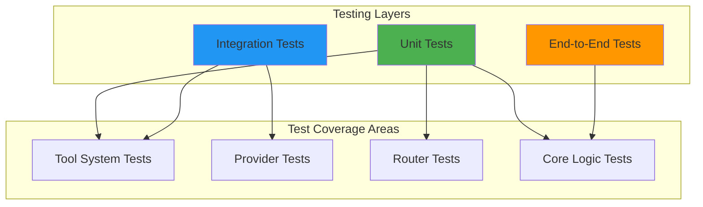
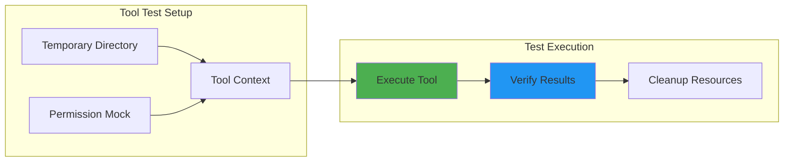
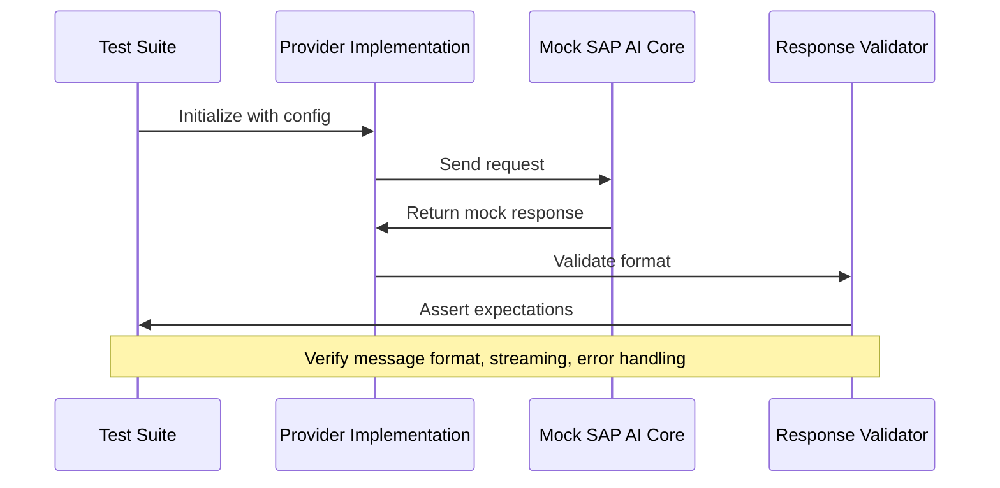
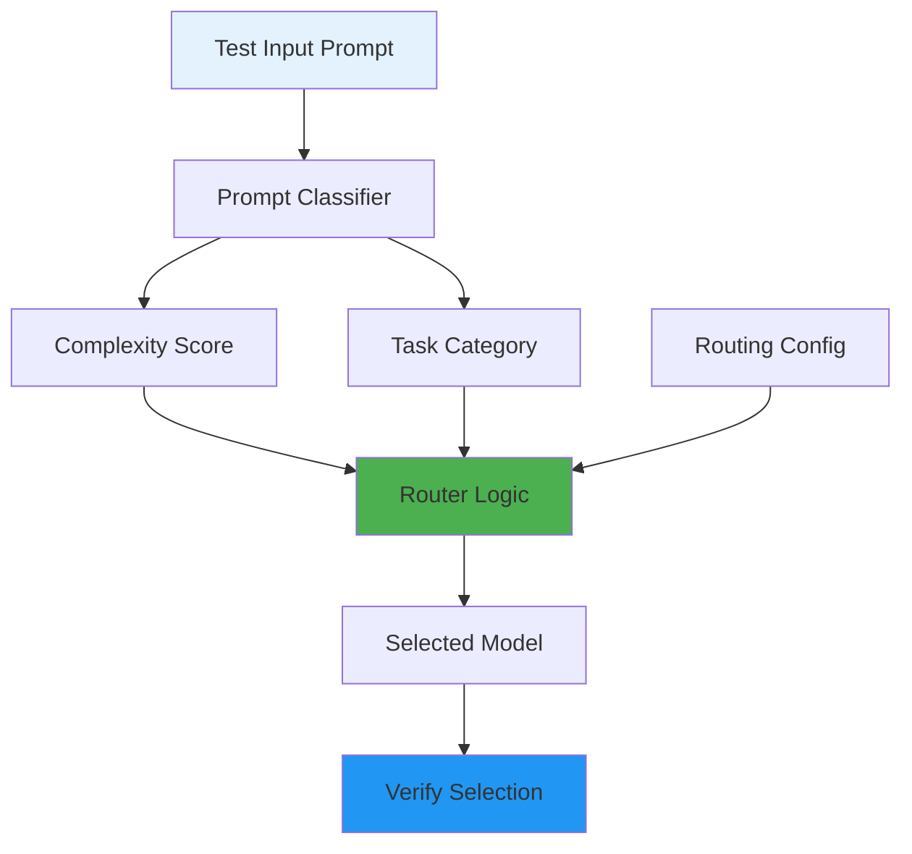
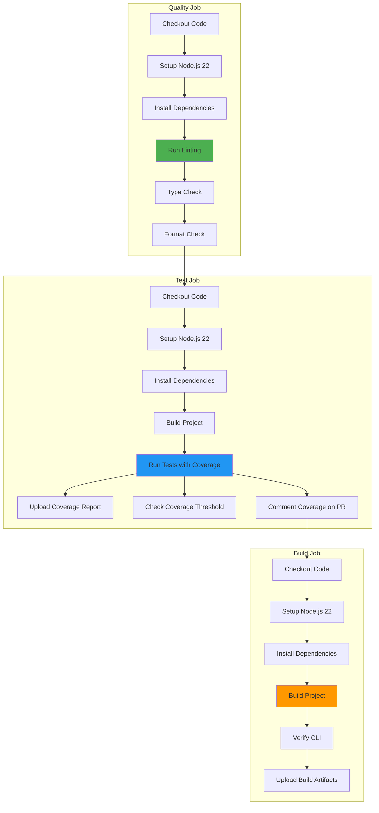

# Testing Guide

This document provides comprehensive testing guidelines for Alexi, including testing strategies, test commands, coverage expectations, and best practices.

## Table of Contents

- [Testing Strategy](#testing-strategy)
- [Test Commands](#test-commands)
- [Test Coverage](#test-coverage)
- [Testing Tool System](#testing-tool-system)
- [Testing Providers](#testing-providers)
- [Testing Routing](#testing-routing)
- [Best Practices](#best-practices)

## Testing Strategy

Alexi employs a multi-layered testing strategy to ensure reliability and maintainability:



### Testing Layers

1. **Unit Tests**: Test individual functions and modules in isolation
   - Tool implementations
   - Routing logic
   - Utility functions
   - Permission management

2. **Integration Tests**: Test interactions between components
   - Provider integrations with SAP AI Core
   - Tool execution with permission system
   - Session management with persistence

3. **End-to-End Tests**: Test complete user workflows
   - CLI command execution
   - Multi-turn conversations
   - Auto-routing decisions

## Test Commands

### Run All Tests

```bash
npm test
```

### Run Tests in Watch Mode

```bash
npm run test:watch
```

### Run Tests with Coverage

```bash
npm run test:coverage
```

### Run Specific Test Files

```bash
# Run tool tests
npm test -- tests/tool/tools/

# Run specific test file
npm test -- tests/tool/tools/write.test.ts

# Run tests matching pattern
npm test -- --grep "write tool"
```

### Test Framework

Alexi uses **Vitest** as its testing framework, chosen for:
- Native TypeScript support
- Fast execution with ESM support
- Compatible with Node.js 22
- Built-in mocking capabilities

## Test Coverage

### Coverage Expectations

| Component | Target Coverage | Current Status |
|-----------|----------------|----------------|
| Tool System | 90%+ | ✅ Achieved |
| Core Logic | 85%+ | 🔄 In Progress |
| Providers | 80%+ | 🔄 In Progress |
| Router | 90%+ | 🔄 In Progress |
| CLI | 70%+ | 🔄 In Progress |

### Coverage Thresholds

The project enforces minimum coverage thresholds in CI:

| Metric | Minimum Threshold |
|--------|-------------------|
| Lines | 40% |
| Statements | 15% |
| Branches | 15% |
| Functions | 20% |

These thresholds are enforced in:
- CI workflow (`.github/workflows/ci.yml`)
- Vitest configuration (`vitest.config.ts`)

### Coverage Reports

Coverage reports are generated in multiple formats:

```bash
# Generate coverage report
npm run test:coverage

# View HTML report
open coverage/index.html

# View text summary in terminal
cat coverage/coverage-summary.json | jq
```

Coverage reports include:
- **Text**: Console output during test runs
- **JSON**: Machine-readable full coverage data
- **JSON Summary**: Compact coverage metrics for CI
- **HTML**: Interactive browser-based report
- **LCOV**: Standard format for third-party tools

### CI Coverage Reporting

On pull requests, the CI workflow automatically:

1. Runs tests with coverage collection
2. Validates coverage meets minimum thresholds
3. Posts coverage report as PR comment
4. Updates existing coverage comment if present
5. Uploads coverage artifacts for 14 days

Coverage comment format:

```markdown
## Coverage Report

| Metric | Coverage |
|--------|----------|
| Lines | 45.2% |
| Statements | 44.8% |
| Functions | 38.5% |
| Branches | 35.7% |

<details>
<summary>Coverage Details</summary>

- Lines: 1234/2730
- Statements: 1456/3250
- Functions: 385/1000
- Branches: 357/1000

</details>
```

## Testing Tool System

The tool system has comprehensive unit tests covering file operations, permissions, and error handling.

### Tool Test Architecture



### Example: Testing Write Tool

```typescript
import { describe, it, expect, vi, beforeEach, afterEach } from 'vitest';
import * as fs from 'fs/promises';
import * as path from 'path';
import os from 'os';

// Mock the tool index module to bypass permission checks
vi.mock('../../../src/tool/index.js', async () => {
  const actual = await vi.importActual('../../../src/tool/index.js');
  return {
    ...actual,
    defineTool: (def: any) => ({
      ...def,
      execute: def.execute,
      executeUnsafe: def.execute,
      toFunctionSchema: () => ({
        name: def.name,
        description: def.description,
        parameters: {},
      }),
    }),
  };
});

import { writeTool } from '../../../src/tool/tools/write.js';
import type { ToolContext } from '../../../src/tool/index.js';

describe('Write Tool', () => {
  let tempDir: string;
  let context: ToolContext;

  beforeEach(async () => {
    // Create a temporary directory for tests
    tempDir = await fs.mkdtemp(path.join(os.tmpdir(), 'write-tool-test-'));
    context = { workdir: tempDir };
  });

  afterEach(async () => {
    // Clean up temp directory
    await fs.rm(tempDir, { recursive: true, force: true });
  });

  it('should create a new file with content', async () => {
    const filePath = path.join(tempDir, 'new-file.txt');
    const content = 'Hello, World!';

    const result = await writeTool.execute({ filePath, content }, context);

    expect(result.success).toBe(true);
    expect(result.data?.created).toBe(true);
    expect(result.data?.path).toBe(filePath);
    expect(result.data?.bytesWritten).toBe(Buffer.byteLength(content, 'utf-8'));

    // Verify file was actually created
    const actualContent = await fs.readFile(filePath, 'utf-8');
    expect(actualContent).toBe(content);
  });
});
```

### Tool Test Coverage

All file operation tools have comprehensive test coverage:

| Tool | Test File | Test Cases |
|------|-----------|------------|
| `read` | `tests/tool/tools/read.test.ts` | 20+ cases |
| `write` | `tests/tool/tools/write.test.ts` | 18+ cases |
| `edit` | `tests/tool/tools/edit.test.ts` | 15+ cases |
| `glob` | `tests/tool/tools/glob.test.ts` | 16+ cases |
| `grep` | `tests/tool/tools/grep.test.ts` | 20+ cases |

### Test Categories

Each tool is tested across multiple categories:

1. **Basic Operations**
   - Normal usage scenarios
   - Edge cases (empty files, large files)
   - Special characters and unicode

2. **Path Handling**
   - Absolute paths
   - Relative paths with workdir
   - Nested directory creation
   - Path normalization

3. **Error Handling**
   - Non-existent files/directories
   - Permission errors
   - Invalid parameters
   - Malformed patterns (glob/grep)

4. **Tool Metadata**
   - Correct tool names
   - Description presence
   - Schema generation

## Testing Providers

Provider tests verify integration with SAP AI Core and proper message formatting.

### Provider Test Strategy



### Example: Testing Provider Integration

```typescript
describe('OpenAI Compatible Provider', () => {
  it('should format messages correctly', async () => {
    const provider = new OpenAICompatibleProvider(config);
    
    const messages = [
      { role: 'user', content: 'Hello' }
    ];
    
    const result = await provider.sendMessage(messages, {
      model: 'gpt-4o',
      temperature: 0.7
    });
    
    expect(result.content).toBeDefined();
    expect(result.role).toBe('assistant');
  });
  
  it('should handle streaming responses', async () => {
    // Test streaming implementation
  });
  
  it('should handle API errors gracefully', async () => {
    // Test error handling
  });
});
```

## Testing Routing

Router tests verify automatic model selection based on prompt analysis.

### Router Test Flow



### Example: Testing Routing Decisions

```typescript
describe('Auto Router', () => {
  it('should select cheap model for simple prompts', async () => {
    const router = new AutoRouter(config);
    
    const result = await router.selectModel({
      prompt: 'What is 2+2?',
      preferCheap: true
    });
    
    expect(result.model).toBe('gpt-4o-mini');
    expect(result.confidence).toBeGreaterThan(0.8);
  });
  
  it('should select powerful model for complex tasks', async () => {
    const router = new AutoRouter(config);
    
    const result = await router.selectModel({
      prompt: 'Analyze this codebase and suggest architectural improvements...',
      preferCheap: false
    });
    
    expect(result.model).toBe('claude-4-sonnet');
  });
  
  it('should respect routing rules', async () => {
    // Test rule-based routing
  });
});
```

## Best Practices

### 1. Test Isolation

Always use temporary directories and clean up after tests:

```typescript
beforeEach(async () => {
  tempDir = await fs.mkdtemp(path.join(os.tmpdir(), 'test-'));
  context = { workdir: tempDir };
});

afterEach(async () => {
  await fs.rm(tempDir, { recursive: true, force: true });
});
```

### 2. Mock External Dependencies

Mock SAP AI Core API calls and file system operations when appropriate:

```typescript
vi.mock('../../../src/tool/index.js', async () => {
  const actual = await vi.importActual('../../../src/tool/index.js');
  return {
    ...actual,
    defineTool: (def: any) => ({
      ...def,
      execute: def.execute,
      executeUnsafe: def.execute,
    }),
  };
});
```

### 3. Test Both Success and Failure Cases

```typescript
describe('error handling', () => {
  it('should handle non-existent file', async () => {
    const result = await readTool.execute(
      { filePath: '/nonexistent.txt' },
      context
    );
    
    expect(result.success).toBe(false);
    expect(result.error).toContain('File not found');
  });
});
```

### 4. Verify Actual File System Changes

Don't just check return values - verify actual changes:

```typescript
it('should create file on disk', async () => {
  const result = await writeTool.execute({ filePath, content }, context);
  
  expect(result.success).toBe(true);
  
  // Verify file actually exists
  const actualContent = await fs.readFile(filePath, 'utf-8');
  expect(actualContent).toBe(content);
});
```

### 5. Test Edge Cases

```typescript
describe('edge cases', () => {
  it('should handle empty files', async () => { /* ... */ });
  it('should handle unicode content', async () => { /* ... */ });
  it('should handle files with spaces in name', async () => { /* ... */ });
  it('should handle deeply nested directories', async () => { /* ... */ });
});
```

### 6. Use Descriptive Test Names

```typescript
// Good
it('should create parent directories if they do not exist', async () => {
  // ...
});

// Bad
it('test write', async () => {
  // ...
});
```

### 7. Test Tool Metadata

Verify tool definitions are correct:

```typescript
describe('tool metadata', () => {
  it('should have correct name', () => {
    expect(writeTool.name).toBe('write');
  });

  it('should have a description', () => {
    expect(writeTool.description).toBeDefined();
    expect(writeTool.description.length).toBeGreaterThan(0);
  });
});
```

## Testing with SAP AI Core

### Local Development Testing

For local testing without SAP AI Core:

```bash
# Use mock provider
export ALEXI_MOCK_PROVIDER=true
npm test
```

### Integration Testing

For integration tests with real SAP AI Core:

```bash
# Set required environment variables
export AICORE_SERVICE_KEY='{"clientid":"...","clientsecret":"...",...}'
export AICORE_RESOURCE_GROUP='default'

# Run integration tests
npm run test:integration
```

### CI/CD Testing

GitHub Actions workflows use secrets for SAP AI Core credentials:

```yaml
- name: Run Tests
  env:
    AICORE_SERVICE_KEY: ${{ secrets.AICORE_SERVICE_KEY }}
    AICORE_RESOURCE_GROUP: ${{ secrets.AICORE_RESOURCE_GROUP }}
  run: npm test
```

## Continuous Integration

Tests run automatically on:
- Pull requests to main/master
- Push to main/master
- Manual workflow dispatch

### CI Workflow Architecture



### Test Workflow

```mermaid
graph LR
    PR[Pull Request] --> Install[Install Dependencies]
    Install --> Build[Build Project]
    Build --> Lint[Run Linting]
    Lint --> Test[Run Tests]
    Test --> Coverage[Generate Coverage]
    Coverage --> Threshold[Check Threshold]
    Threshold --> Report[Comment on PR]
    Report --> Artifacts[Upload Artifacts]
    
    style Test fill:#4CAF50
    style Coverage fill:#2196F3
    style Threshold fill:#FF9800
```



### CI Jobs

The CI workflow consists of three sequential jobs:

#### 1. Quality Job

Validates code quality and formatting:

```yaml
- Lint: npm run lint
- Type check: npm run typecheck
- Format check: npm run format:check
```

#### 2. Test Job

Runs tests and generates coverage:

```yaml
- Build project: npm run build
- Run tests: npm run test:coverage
- Upload coverage artifacts (14-day retention)
- Check coverage threshold (40% minimum)
- Comment coverage report on PR
```

Coverage threshold check:
```bash
COVERAGE=$(cat coverage/coverage-summary.json | jq '.total.lines.pct')
THRESHOLD=40
if (( $(echo "$COVERAGE < $THRESHOLD" | bc -l) )); then
  echo "::error::Coverage ($COVERAGE%) is below threshold ($THRESHOLD%)"
  exit 1
fi
```

#### 3. Build Job

Verifies build artifacts:

```yaml
- Build project: npm run build
- Verify CLI: node dist/cli/program.js --help
- Upload build artifacts (7-day retention)
```

## Troubleshooting

### Common Test Issues

1. **Tests fail with "File not found"**
   - Ensure temporary directories are created in `beforeEach`
   - Check that file paths use `path.join(tempDir, ...)`

2. **Permission errors in CI**
   - Verify tool mocking is configured correctly
   - Check that `defineTool` mock bypasses permission checks

3. **Timeout errors**
   - Increase timeout for slow operations: `it('test', { timeout: 10000 }, async () => {})`
   - Check for hanging async operations

4. **Flaky tests**
   - Use proper cleanup in `afterEach`
   - Avoid shared state between tests
   - Use unique temporary directories per test

## Contributing Tests

When contributing new features:

1. Write tests first (TDD approach)
2. Ensure coverage for new code is above 80%
3. Test both success and failure paths
4. Include edge cases
5. Update this documentation with new testing patterns

For more information on contributing, see [CONTRIBUTING.md](CONTRIBUTING.md).
