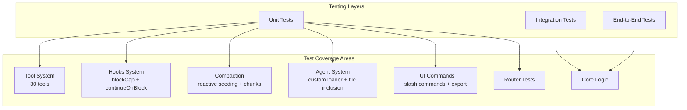
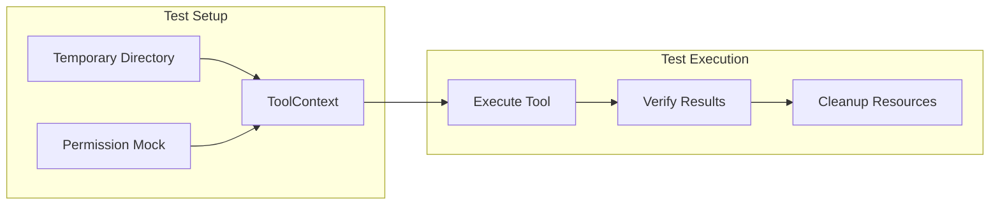
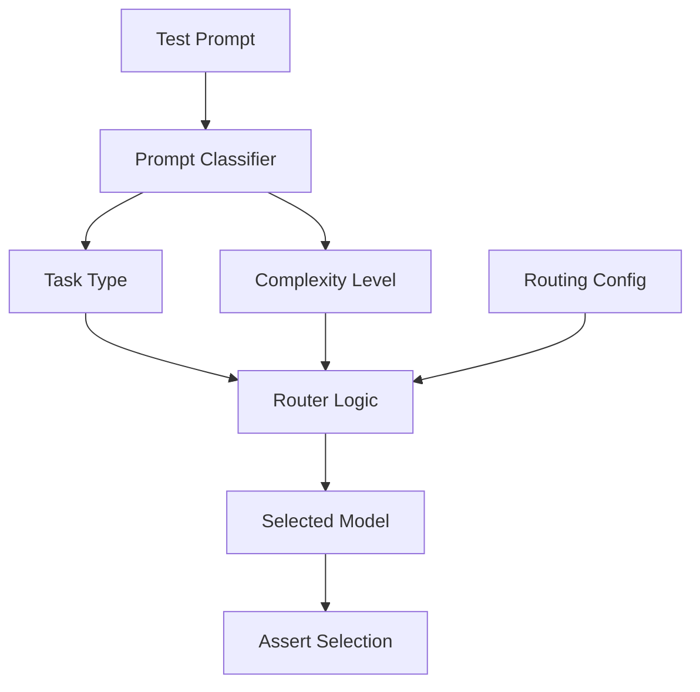

# Testing Guide

This document provides comprehensive testing guidelines for Alexi, including testing strategies, test commands, coverage expectations, and best practices.

## Table of Contents

- [Testing Strategy](#testing-strategy)
- [Test Commands](#test-commands)
- [Test Configuration](#test-configuration)
- [Test Coverage](#test-coverage)
- [Testing Tool System](#testing-tool-system)
- [Testing Hooks](#testing-hooks)
- [Testing Compaction](#testing-compaction)
- [Testing TUI Commands](#testing-tui-commands)
- [Testing Background Tasks](#testing-background-tasks)
- [Testing Routing](#testing-routing)
- [Testing Rewind Command](#testing-rewind-command)
- [Testing with SAP AI Core](#testing-with-sap-ai-core)
- [Best Practices](#best-practices)

## Testing Strategy

Alexi employs a multi-layered testing strategy:


```mermaid
graph TB
    subgraph "Testing Layers"
        Unit[Unit Tests]
        Integration[Integration Tests]
        E2E[End-to-End Tests]
    end
    
    subgraph "Test Coverage Areas"
        Tools[Tool System<br/>30 tools]
        Hooks[Hooks System<br/>blockCap + continueOnBlock]
        Compaction[Compaction<br/>reactive seeding + chunks]
        Agents[Agent System<br/>custom loader + file inclusion]
        TUI[TUI Commands<br/>slash commands + export]
        Router[Router Tests]
        Core[Core Logic]
    end
    
    Unit --> Tools
    Unit --> Hooks
    Unit --> Compaction
    Unit --> Agents
    Unit --> TUI
    Unit --> Router
    Integration --> Core
    E2E --> Core
```

### Testing Layers

1. **Unit Tests**: Test individual functions and modules in isolation
   - Tool implementations (30 tools)
   - Routing logic and prompt classification
   - Compaction strategies (truncate, summarize, sliding, smart)
   - Hook execution (command, HTTP, script types)
   - Agent loader with file inclusions
   - Permission management and doom loop detection

2. **Integration Tests**: Test interactions between components
   - Agentic chat with tool execution loop
   - Context overflow detection and reactive compaction
   - Hook integration in agentic execution
   - MCP client/server connections

3. **End-to-End Tests**: Test complete user workflows
   - CLI command execution
   - Multi-turn conversations with session persistence
   - Auto-routing decisions

## Test Commands

### Run All Tests

```bash
npm test
```

### Run Tests in Watch Mode

```bash
npm run test:watch
```

### Run Tests with Coverage

```bash
npm run test:coverage
```

### Run Specific Test Files

```bash
# Run a single test file
npm test -- tests/tool/tools/write.test.ts

# Run tests in a directory
npm test -- tests/tool/tools/

# Run tests matching a pattern
npm test -- --grep "write tool"

# Run hook tests
npm test -- tests/hooks/

# Run compaction tests
npm test -- tests/compaction/

# Run agent tests
npm test -- tests/agent/
```

## Test Configuration

Alexi uses **Vitest** with the following configuration (`vitest.config.ts`):

```typescript
import { defineConfig } from 'vitest/config';
import react from '@vitejs/plugin-react';

export default defineConfig({
  plugins: [react()],
  test: {
    environment: 'node',
    coverage: {
      provider: 'v8',
      reporter: ['text', 'html', 'lcov'],
      thresholds: {
        lines: 15,
        functions: 15,
        branches: 15,
        statements: 15,
      },
    },
  },
});
```

Key configuration:
- **Environment**: Node.js (not jsdom)
- **React Plugin**: Enabled for Ink TUI component testing
- **Coverage Provider**: V8
- **Coverage Threshold**: 15% minimum (increasing as coverage improves)

## Test Coverage

### Coverage Expectations

| Component | Target | Description |
|-----------|--------|-------------|
| Tool System | 90%+ | File operations, permissions, error handling |
| Hooks | 85%+ | blockCap, continueOnBlock, execution types |
| Compaction | 85%+ | All strategies, reactive seeding, chunked |
| Agent Loader | 80%+ | Custom agents, file inclusions |
| Core Logic | 85%+ | Orchestrator, router, session |
| TUI | 70%+ | Slash commands, context hooks |

### Generating Coverage Reports

```bash
npm run test:coverage

# View HTML report
open coverage/index.html
```

## Testing Tool System

### Tool Test Architecture


```mermaid
graph LR
    subgraph "Test Setup"
        TempDir[Temporary Directory]
        Context[ToolContext]
        Mock[Permission Mock]
    end
    
    subgraph "Test Execution"
        Execute[Execute Tool]
        Verify[Verify Results]
        Cleanup[Cleanup Resources]
    end
    
    TempDir --> Context
    Mock --> Context
    Context --> Execute
    Execute --> Verify
    Verify --> Cleanup
```

### Standard Tool Test Pattern

```typescript
import { describe, it, expect, vi, beforeEach, afterEach } from 'vitest';
import * as fs from 'fs/promises';
import * as path from 'path';
import os from 'os';

// Mock tool index to bypass permission checks
vi.mock('../../../src/tool/index.js', async () => {
  const actual = await vi.importActual('../../../src/tool/index.js');
  return {
    ...actual,
    defineTool: (def: any) => ({
      ...def,
      execute: def.execute,
      executeUnsafe: def.execute,
      toFunctionSchema: () => ({
        name: def.name,
        description: def.description,
        parameters: {},
      }),
    }),
  };
});

import { writeTool } from '../../../src/tool/tools/write.js';
import type { ToolContext } from '../../../src/tool/index.js';

describe('Write Tool', () => {
  let tempDir: string;
  let context: ToolContext;

  beforeEach(async () => {
    tempDir = await fs.mkdtemp(path.join(os.tmpdir(), 'write-tool-test-'));
    context = { workdir: tempDir };
  });

  afterEach(async () => {
    await fs.rm(tempDir, { recursive: true, force: true });
  });

  it('should create a new file with content', async () => {
    const filePath = path.join(tempDir, 'new-file.txt');
    const content = 'Hello, World!';

    const result = await writeTool.execute({ filePath, content }, context);

    expect(result.success).toBe(true);
    expect(result.data?.created).toBe(true);

    // Verify actual file system change
    const actualContent = await fs.readFile(filePath, 'utf-8');
    expect(actualContent).toBe(content);
  });
});
```

### Tool Test Coverage

| Tool | Test File | Test Cases |
|------|-----------|------------|
| `read` | `tests/tool/tools/read.test.ts` | 20+ cases |
| `write` | `tests/tool/tools/write.test.ts` | 18+ cases |
| `edit` | `tests/tool/tools/edit.test.ts` | 15+ cases |
| `glob` | `tests/tool/tools/glob.test.ts` | 16+ cases |
| `grep` | `tests/tool/tools/grep.test.ts` | 20+ cases |
| `bash` | `tests/tool/tools/bash.test.ts` | 13+ cases (includes shell-type reporting) |
| `task` | `tests/tool/tools/background-tasks.test.ts` | 8+ cases |
| `task_status` | `tests/tool/tools/background-tasks.test.ts` | 3+ cases |
| `skill` (description guard) | `src/tool/skill.test.ts` | 1 case |

### Testing Bash Tool Shell-Type Reporting

The `bash` tool records the detected shell type on every result via
`ShellInfo.type` produced by `src/tool/tools/shell/id.ts`. Detection reads
`process.env.SHELL` on POSIX and `process.env.COMSPEC` on Windows, mapping the
resolved binary name to one of `'bash' | 'zsh' | 'fish' | 'powershell' | 'cmd' | 'unknown'`.
The result field is optional (`shellType?: string` on `BashResult` in
`src/tool/tools/bash.ts:54`) and is emitted from the success path, the
detach-timeout path, and the spawn-error path so debuggers always know which
shell interpreted the command.

The suite in `tests/tool/tools/bash.test.ts:41` is gated with
`describe.skipIf(isWindows)` because `process.env.SHELL` is a POSIX convention;
Windows detection is exercised indirectly through the shared `inferType`
matcher. Each test mutates `process.env.SHELL`, executes a trivial `echo hi`
command through `bashTool.executeUnsafe`, and asserts on
`result.data?.shellType`. The `afterEach` hook restores the original `SHELL`
value (deleting it when it was previously unset) so tests remain parallel-safe
and do not leak process state.

```typescript
import { describe, it, expect, afterEach } from 'vitest';
import { bashTool } from '../../../src/tool/tools/bash.js';
import type { ToolContext } from '../../../src/tool/index.js';

const isWindows = process.platform === 'win32';

describe.skipIf(isWindows)('bash tool - shell type reporting', () => {
  const context: ToolContext = {
    workdir: process.cwd(),
    sessionId: 'shell-type-test-session',
  };

  const originalShell = process.env.SHELL;

  afterEach(() => {
    if (originalShell === undefined) {
      delete process.env.SHELL;
    } else {
      process.env.SHELL = originalShell;
    }
  });

  it('reports the detected shell type in the result', async () => {
    process.env.SHELL = '/bin/bash';
    const result = await bashTool.executeUnsafe({ command: 'echo hi' }, context);
    expect(result.success).toBe(true);
    expect(result.data?.shellType).toBe('bash');
  });

  it('detects zsh when SHELL points at zsh', async () => {
    process.env.SHELL = '/bin/zsh';
    const result = await bashTool.executeUnsafe({ command: 'echo hi' }, context);
    expect(result.data?.shellType).toBe('zsh');
  });

  it('falls back to unknown for unrecognised shells', async () => {
    process.env.SHELL = '/opt/weird/mystery';
    const result = await bashTool.executeUnsafe({ command: 'echo hi' }, context);
    expect(result.data?.shellType).toBe('unknown');
  });
});
```

Key patterns:

1. **Use `executeUnsafe`** rather than `execute` — the shell-type field is
   populated regardless of permission gating, and `executeUnsafe` bypasses the
   permission audit so tests do not need to stub the permission layer.
2. **Snapshot `process.env.SHELL` in the closure**, not in `beforeEach`. The
   value is captured once at `describe` scope so a test that reassigns it
   mid-run still sees the original in `afterEach`.
3. **Assert on `result.data?.shellType`, not `result.data.shellType`**. The
   field is declared optional on `BashResult` and TypeScript will require the
   optional-chain form under strict mode.
4. **Do not assert the exact resolved path**. The `path` field on `ShellInfo`
   reflects the raw environment value and is stable across platforms, but the
   `type` classification is the invariant the tool guarantees to callers.

### Testing Bash Streaming Output

The bash tool publishes `BashOutputChunk` events on the event bus as `stdout` / `stderr` chunks arrive from the underlying process. Test suites at `tests/tool/tools/bash-streaming.test.ts` cover the command-log registry contract (PID-reuse defence, retention window, byte-cap eviction, chunk correlation) without spawning real long-running commands.

```typescript
import { describe, it, expect, beforeEach, afterEach } from 'vitest';
import {
  registerCommandLog,
  appendCommandLog,
  markCommandLogFinished,
  getCommandLog,
  getCommandLogByPid,
  cleanupCommandLog,
  cleanupCompletedLogs,
  _resetStreamingStateForTests,
  MAX_LOG_BYTES,
  COMPLETED_LOG_RETENTION_MS,
} from '../../../src/tool/tools/bash-streaming.js';

describe('bash-streaming', () => {
  beforeEach(() => {
    _resetStreamingStateForTests();
  });

  it('correlates chunks by logId, not PID', () => {
    const id = registerCommandLog({ pid: 42, command: 'npm test', startedAt: 100 });
    appendCommandLog(id, 'hello');
    expect(getCommandLog(id)?.buffer).toBe('hello');

    // A later process reusing PID 42 has a different startedAt.
    expect(getCommandLogByPid(42, 999)).toBeUndefined();
    expect(getCommandLogByPid(42, 100)?.id).toBe(id);
  });

  it('retains finished logs for COMPLETED_LOG_RETENTION_MS', () => {
    const id = registerCommandLog({ pid: 1, command: 'ls', startedAt: 0 });
    appendCommandLog(id, 'output');
    markCommandLogFinished(id);
    expect(getCommandLog(id)?.buffer).toBe('output');

    // Simulate retention window expiry.
    const now = Date.now() + COMPLETED_LOG_RETENTION_MS + 1;
    cleanupCompletedLogs(now);
    expect(getCommandLog(id)).toBeUndefined();
  });

  it('evicts oldest bytes past MAX_LOG_BYTES and inserts a truncation marker', () => {
    const id = registerCommandLog({ pid: 2, command: 'stream', startedAt: 0 });
    // Push over the cap in one shot.
    appendCommandLog(id, 'x'.repeat(MAX_LOG_BYTES + 1024) + '\nDONE\n');
    const snap = getCommandLog(id);
    expect(snap?.truncated).toBe(true);
    expect(snap?.buffer.startsWith('\n[... older output evicted')).toBe(true);
    expect(snap?.buffer.endsWith('DONE\n')).toBe(true);
  });

  it('cleanupCommandLog reaps unconditionally', () => {
    const id = registerCommandLog({ pid: 3, command: 'x', startedAt: 0 });
    cleanupCommandLog(id);
    expect(getCommandLog(id)).toBeUndefined();
  });
});
```

Key patterns:

1. **Call `_resetStreamingStateForTests()` in `beforeEach`.** The registry is process-local and survives across bash invocations by design; without this reset, tests interfere with each other.
2. **PID-reuse assertions.** Always vary `startedAt` when testing PID-reuse defence — a matching PID alone must NOT surface the earlier entry.
3. **Retention window.** Pass an explicit `now` to `cleanupCompletedLogs(now)` rather than using `vi.useFakeTimers()`; the helper accepts a timestamp so tests can be deterministic without touching the global clock.
4. **Byte cap eviction.** Assert on the `[... older output evicted from streaming buffer ...]` marker literally — that string is part of the observable contract for reconnecting TUI clients.

### Testing Native Notifications

Tests at `tests/core/notifications.test.ts` and `tests/core/streamingOrchestrator.notifications.test.ts` cover the notification dispatch and its integration with the streaming orchestrator. `tests/tool/tools/bash-notifications.test.ts` covers the bash-tool completion trigger.

Three concerns dominate the notification test suite: (1) never touch the real user `~/.alexi/config.json`, (2) never dispatch to a real desktop notifier, and (3) exercise the interactive / non-interactive branches deterministically.

```typescript
import { describe, it, expect, beforeEach, afterEach, vi } from 'vitest';
import fs from 'node:fs';
import os from 'node:os';
import path from 'node:path';

let tmpHome: string;
let originalHome: string | undefined;
let originalCi: string | undefined;
let originalDisable: string | undefined;

beforeEach(() => {
  // Redirect HOME to a temp dir so tests never touch a real user config.
  tmpHome = fs.mkdtempSync(path.join(os.tmpdir(), 'alexi-notifications-'));
  originalHome = process.env.HOME;
  originalCi = process.env.CI;
  originalDisable = process.env.ALEXI_NO_NOTIFICATIONS;
  process.env.HOME = tmpHome;
  delete process.env.CI;
  delete process.env.ALEXI_NO_NOTIFICATIONS;
});

afterEach(() => {
  // Restore every mutated env var (delete when it was previously unset).
  if (originalHome === undefined) delete process.env.HOME;
  else process.env.HOME = originalHome;
  // ...same pattern for CI and ALEXI_NO_NOTIFICATIONS...
  fs.rmSync(tmpHome, { recursive: true, force: true });
  vi.restoreAllMocks();
});

async function freshImport() {
  vi.resetModules();
  return import('../../src/core/notifications.js');
}

describe('notifications', () => {
  it('exports the documented 30s long-running threshold', async () => {
    const mod = await freshImport();
    expect(mod.LONG_RUNNING_THRESHOLD_MS).toBe(30_000);
  });

  it('dispatches to the injected notifier on allow', async () => {
    const mod = await freshImport();
    mod.setNotificationDecision('allow');
    const notifier = { notify: vi.fn((_opts, cb) => cb?.(null)) };
    const ok = await mod.sendNotification('t', 'm', { __notifierOverride: notifier });
    expect(ok).toBe(true);
    expect(notifier.notify).toHaveBeenCalledWith(
      expect.objectContaining({ title: 't', message: 'm' }),
      expect.any(Function)
    );
  });

  it('resolves false without throwing when the notifier throws synchronously', async () => {
    const mod = await freshImport();
    mod.setNotificationDecision('allow');
    const notifier = { notify: vi.fn(() => { throw new Error('boom'); }) };
    const ok = await mod.sendNotification('t', 'm', { __notifierOverride: notifier });
    expect(ok).toBe(false);
  });
});
```

Key patterns:

1. **Redirect `HOME` per-test.** `~/.alexi/config.json` lives under `HOME` and the notifications module reads it on every call. Redirect via `process.env.HOME = tmpHome` in `beforeEach` and restore in `afterEach` (delete if previously unset) so parallel tests do not race on the real user config.
2. **`vi.resetModules()` + dynamic import.** The notifications module caches the loaded `node-notifier` handle across calls. `resetModules()` + `await import(...)` gives every test a fresh cache so ordering is not observable.
3. **Use `__notifierOverride` / `__askOverride`.** These test-only escape hatches are the supported API for driving dispatch without touching a real desktop or a real inquirer prompt. Never stub `@inquirer/prompts` or `node-notifier` directly.
4. **Test the `ask -> interactive` gate with `process.stdin.isTTY` mocks.** `isInteractiveEnv()` inspects `process.stdin.isTTY` and `process.stdout.isTTY`; use `Object.defineProperty(process.stdin, 'isTTY', { value: true, configurable: true })` inside the test and restore in `afterEach`.
5. **Assert `false` for every non-interactive short-circuit.** `CI=1`, `ALEXI_NO_NOTIFICATIONS=1`, and TTY-absent must all resolve `false` without persisting a decision — a subsequent interactive run must still see `'ask'`.
6. **Assert the orchestrator gate.** `tests/core/streamingOrchestrator.notifications.test.ts` asserts that `streamChat` fires `notifyInBackground` only on `completedCleanly`, not on abort or provider error. Use a fake provider that yields chunks and then either resolves (clean) or rejects (error).
7. **Assert the bash gate.** `tests/tool/tools/bash-notifications.test.ts` uses a fake clock (`vi.useFakeTimers()` with `vi.advanceTimersByTime`) to push a foreground command's elapsed time past `LONG_RUNNING_THRESHOLD_MS` and assert on the resulting notification. Short commands (< 30 s) must NOT fire.

### Testing PowerShell fail-fast bootstrap

`tests/tool/tools/shell/powershell-fail-fast.test.ts` end-to-end drives a real `pwsh` (or `powershell.exe` on Windows) to regression-guard the `shellSpawnArgs` PowerShell branch. The suite self-skips when no PowerShell binary is on PATH, so POSIX CI runners without pwsh installed stay green.

```typescript
import { describe, it, expect } from 'vitest';
import { spawnSync } from 'node:child_process';
import { shellSpawnArgs } from '../../../../src/tool/tools/shell/id.js';

function findPowerShell(): string | undefined {
  for (const cmd of ['pwsh', 'powershell.exe', 'powershell']) {
    const probe = spawnSync(cmd, ['-NoProfile', '-Command', 'Write-Output ok'], {
      encoding: 'utf8',
    });
    if (probe.status === 0 && probe.stdout.trim() === 'ok') return cmd;
  }
  return undefined;
}

const pwshCmd = findPowerShell();
const describePwsh = pwshCmd ? describe : describe.skip;

function runViaShellSpawnArgs(userCommand: string) {
  const { prefixArgs, suffixArgs = [] } = shellSpawnArgs({
    type: 'powershell',
    path: pwshCmd as string,
  });
  return spawnSync(pwshCmd as string, [...prefixArgs, userCommand, ...suffixArgs], {
    encoding: 'utf8',
  });
}

describePwsh('shellSpawnArgs powershell fail-fast', () => {
  it('exits non-zero on the FIRST non-terminating error', () => {
    const result = runViaShellSpawnArgs('Get-Item /nonexistent/path/xyzzy');
    expect(result.status).not.toBe(0);
  });

  it('opt-out with -ErrorAction Continue restores partial-result behaviour', () => {
    const result = runViaShellSpawnArgs(
      'Get-Item /nonexistent/xyzzy -ErrorAction Continue; Write-Output done'
    );
    expect(result.status).toBe(0);
    expect(result.stdout).toContain('done');
  });

  it('scripts starting with param(...) still work', () => {
    const result = runViaShellSpawnArgs('param($x = 5) Write-Output "x=$x"');
    expect(result.status).toBe(0);
    expect(result.stdout.trim()).toBe('x=5');
  });
});
```

Key patterns:

1. **Self-skip when pwsh is unavailable.** Use `describePwsh = pwshCmd ? describe : describe.skip` so the file compiles and imports on every platform but only asserts when there is a real shell to drive.
2. **Reuse `shellSpawnArgs` exactly as bash.ts does.** Destructure `prefixArgs` and `suffixArgs = []` and spawn `[...prefixArgs, userCommand, ...suffixArgs]` — asserting on the return value directly guarantees the tests catch any drift between the tool code and the shell binding.
3. **Assert the four contract properties.** Fail-fast exit code, bounded stderr (single error record), successful commands still succeed, per-cmdlet `-ErrorAction` opt-out, and `param(...)` compatibility. The shape-only assertions on `shellSpawnArgs` (no shell spawn required) live in `tests/tool/tools/shell-detect.test.ts`.

### Testing TUI Chat Reducer for Streaming

The `ChatContext` reducer (`src/cli/tui/context/ChatContext.tsx`) exposes `APPEND_TOOL_CALL_OUTPUT` for live-appending bash / shell chunks to active tool rows. Tests at `tests/cli/tui/ChatContext.test.tsx` cover the reducer branches and the `useToolEvents` wiring at `tests/cli/tui/useToolEvents.test.tsx` covers the bus-to-reducer dispatch:

```typescript
import { render } from 'ink-testing-library';
import { ChatProvider, useChat } from '../../../src/cli/tui/context/ChatContext.js';
import { BashOutputChunk, ToolExecutionStarted } from '../../../src/bus/index.js';

it('appends BashOutputChunk chunks to the active row', () => {
  // ...render ChatProvider + a test consumer that reads activeToolCalls
  ToolExecutionStarted.publish({ toolId: 't1', toolName: 'bash', /* ... */ });
  BashOutputChunk.publish({ toolId: 't1', logId: 'l1', stream: 'stdout', chunk: 'hello', timestamp: 0 });
  BashOutputChunk.publish({ toolId: 't1', logId: 'l1', stream: 'stdout', chunk: ' world', timestamp: 1 });
  // Assert row.output === 'hello world'
});

it('drops chunks for tools that already completed', () => {
  // Publish ToolExecutionCompleted before the chunk; assert the chunk is silently dropped.
});
```

Assertion invariants:

1. Empty chunks (`chunk === ''`) are no-ops at the reducer level and MUST NOT create an `output` property on the row.
2. `APPEND_TOOL_CALL_OUTPUT` only touches `activeToolCalls`; a chunk for a completed row is silently dropped.
3. On `ToolExecutionCompleted`, the aggregated `result.data.stdout` / `result.data.stderr` replaces the streamed `output` — this is expected because the final payload may be truncated / normalised (carriage-return collapsing, head-and-tail elision) differently from raw chunks.

### Skill Tool Description Guard

The skill tool exposes a description string to the LLM that is rendered into the
agentic system prompt. To prevent an upstream-sync placeholder description from
leaking into the production tool catalogue, a single regression test asserts
that the registered skill tool description does not contain the placeholder
phrases `tool-skill` or `Skill for tool tests.`:

```ts
// src/tool/skill.test.ts
import { describe, expect, it } from 'vitest';
import { tool } from './registry';

describe('Skill Tool Test', () => {
  it('should not contain deprecated descriptions', () => {
    expect(tool.description).not.toContain('tool-skill');
    expect(tool.description).not.toContain('Skill for tool tests.');
  });
});
```

The canonical skill tool implementation is in `src/tool/tools/skill.ts`, which
exports `skillTool` (registered under the name `'skill'`). When extending or
maintaining the skill tool's description, run `npm test -- src/tool/skill.test.ts`
to verify the placeholder strings are not reintroduced.

> **Maintainer note**: As of version `0.5.13`, this test imports a `tool`
> binding from `./registry` that is not currently exported by `src/tool/registry.ts`.
> The test will fail at import-time with a `TypeError` until either the import
> is changed to `import { skillTool } from './tools/skill.js'` (and the
> assertions adjusted accordingly) or `registry.ts` is updated to re-export a
> `tool` symbol pointing at the registered skill tool. See the `Known issues`
> section in `CHANGELOG.md` for the autohealing follow-up.

## Testing Hooks

### Hook Test Files

- `tests/hooks/blockCap.test.ts` -- Tests consecutive Stop hook rejection cap
- `tests/hooks/continueOnBlock.test.ts` -- Tests rejection feedback to model

### Testing Block Cap

```typescript
import { describe, it, expect, beforeEach, afterEach } from 'vitest';
import { executeHooks, createHookContext, getBlockCap } from '../../src/hooks/index.js';

describe('Hook Block Cap', () => {
  it('should cap consecutive Stop rejections', async () => {
    const hooks = [
      {
        event: 'Stop' as const,
        type: 'command' as const,
        command: 'exit 1', // Always rejects
        timeout: 5000,
      },
    ];

    const blockCap = getBlockCap();  // Default cap value
    let blocked = 0;

    for (let i = 0; i < blockCap + 5; i++) {
      const ctx = createHookContext({ event: 'Stop' });
      const results = await executeHooks(hooks, ctx);
      if (results[0]?.capped) {
        break;
      }
      if (!results[0]?.success) {
        blocked++;
      }
    }

    expect(blocked).toBeLessThanOrEqual(blockCap);
  });
});
```

### Testing continueOnBlock

```typescript
describe('continueOnBlock', () => {
  it('should feed rejection back to model', async () => {
    const hooks = [
      {
        event: 'PostToolUse' as const,
        type: 'command' as const,
        command: 'echo "BLOCKED: unsafe operation" && exit 1',
        continueOnBlock: true,
      },
    ];

    const ctx = createHookContext({
      event: 'PostToolUse',
      toolName: 'write',
    });

    const results = await executeHooks(hooks, ctx);

    expect(results[0]?.success).toBe(false);
    expect(results[0]?.continueOnBlock).toBe(true);
    expect(results[0]?.output).toContain('BLOCKED');
  });
});
```

## Testing Compaction

### Compaction Test Files

- `tests/compaction/reactive-seeding.test.ts` -- Tests overflow-triggered compaction with target sizing
- `tests/core/compaction-chunked.test.ts` -- Tests chunked compaction for large contexts

### Testing Reactive Seeding

```typescript
import { describe, it, expect } from 'vitest';
import { CompactionManager, type Message } from '../../src/compaction/index.js';

describe('Reactive Seeding', () => {
  it('should include target instruction when overflowTokens provided', async () => {
    let capturedPrompt = '';
    const manager = new CompactionManager({
      summarizeFn: async (prompt: string) => {
        capturedPrompt = prompt;
        return 'Summary of conversation';
      },
    });

    const messages: Message[] = [
      { role: 'user', content: 'Long message '.repeat(500) },
      { role: 'assistant', content: 'Long response '.repeat(500) },
      { role: 'user', content: 'Recent message' },
    ];

    await manager.compact(messages, {
      strategy: 'summarize',
      preserveRecent: 1,
      overflowTokens: 5000,
    });

    expect(capturedPrompt).toContain('Keep your summary under approximately');
    expect(capturedPrompt).toContain('tokens');
  });
});
```

### Testing Chunked Compaction

```typescript
import { describe, it, expect } from 'vitest';
import { splitForCompaction, compactInChunks } from '../../src/core/compaction-chunks.js';

describe('Chunked Compaction', () => {
  it('should split large content at natural boundaries', () => {
    const content = 'Line 1\nLine 2\nLine 3\n'.repeat(10000);
    const { chunks, totalSize } = splitForCompaction(content, 1000);

    expect(chunks.length).toBeGreaterThan(1);
    expect(totalSize).toBe(content.length);
    // Each chunk should end at a newline
    for (const chunk of chunks.slice(0, -1)) {
      expect(chunk.endsWith('\n')).toBe(true);
    }
  });

  it('should compact and merge chunks', async () => {
    const content = 'Content block.\n'.repeat(5000);
    const result = await compactInChunks(
      content,
      async (chunk) => `Summary of ${chunk.length} chars`,
      500
    );

    expect(result).toContain('Summary of');
    expect(result).toContain('---'); // Chunk separator
  });
});
```

## Testing TUI Commands

TUI slash commands are tested via the `useCommands` hook with React context mocking.

### Test File

- `tests/cli/tui/useCommands.test.tsx`

### Testing Pattern

```typescript
import { describe, it, expect, vi, beforeEach } from 'vitest';
import React from 'react';
import { render } from 'ink-testing-library';
import { Text } from 'ink';

// Mock contexts before importing hooks
const mockAddSystemMessage = vi.fn();

vi.mock('../../../src/cli/tui/context/AttachmentContext.js', () => ({
  useAttachments: () => ({
    pending: [],
    pasteFromClipboard: vi.fn().mockResolvedValue(undefined),
    addFromFile: vi.fn().mockResolvedValue(undefined),
    clearAll: vi.fn(),
  }),
}));

import { useCommands } from '../../../src/cli/tui/hooks/useCommands.js';

describe('/export command', () => {
  beforeEach(() => {
    vi.clearAllMocks();
  });

  it('should export session and show system message', async () => {
    let captured: any;
    function CommandCapture() {
      captured = useCommands({ addSystemMessage: mockAddSystemMessage });
      return <Text>ready</Text>;
    }

    render(<CommandCapture />);

    const handled = await captured.handleCommand('/export /tmp/test.json');
    expect(handled).toBe(true);
    expect(mockAddSystemMessage).toHaveBeenCalled();
  });
});
```

Key patterns:
1. **Mock Before Import**: All `vi.mock()` calls before hook imports
2. **addSystemMessage Callback**: The `useCommands` hook now accepts an `addSystemMessage` option
3. **Capture Hook Return**: Render a component that captures the hook value
4. **Test Command Dispatch**: Call `handleCommand()` and verify side effects

## Testing Background Tasks

Background tasks are gated behind the `ALEXI_EXPERIMENTAL_BACKGROUND_TASKS` feature flag.

### Test File

- `tests/tool/tools/background-tasks.test.ts`

### Pattern

```typescript
import { describe, it, expect, beforeEach, afterEach } from 'vitest';
import { taskTool, getTaskStore } from '../../../src/tool/tools/task.js';
import { taskStatusTool } from '../../../src/tool/tools/task_status.js';
import type { ToolContext } from '../../../src/tool/index.js';

describe('Background Tasks', () => {
  let context: ToolContext;
  let originalEnv: string | undefined;

  beforeEach(() => {
    context = { workdir: '/tmp/test', sessionId: 'test-session' };
    originalEnv = process.env.ALEXI_EXPERIMENTAL_BACKGROUND_TASKS;
  });

  afterEach(() => {
    if (originalEnv === undefined) {
      delete process.env.ALEXI_EXPERIMENTAL_BACKGROUND_TASKS;
    } else {
      process.env.ALEXI_EXPERIMENTAL_BACKGROUND_TASKS = originalEnv;
    }
    getTaskStore().clear();
  });

  it('should create background task when feature enabled', async () => {
    process.env.ALEXI_EXPERIMENTAL_BACKGROUND_TASKS = 'true';

    const result = await taskTool.execute({
      prompt: 'Test background task',
      description: 'Background test',
      subagent_type: 'explore',
      background: true,
    }, context);

    expect(result.success).toBe(true);
    expect(result.data?.status).toBe('queued');
    expect(result.data?.background).toBe(true);
  });

  it('should track task completion', async () => {
    process.env.ALEXI_EXPERIMENTAL_BACKGROUND_TASKS = 'true';

    const taskResult = await taskTool.execute(
      { prompt: 'Test', description: 'Test', background: true },
      context
    );

    const taskId = taskResult.data!.taskId;

    // Wait with generous margin for CI (stub: 100ms + 1000ms = ~1100ms)
    await new Promise((resolve) => setTimeout(resolve, 2000));

    const statusResult = await taskStatusTool.execute({ taskId }, context);
    expect(statusResult.data?.status).toBe('completed');
  });
});
```

Key testing patterns:
1. **Environment Variable Control**: Enable/disable via `ALEXI_EXPERIMENTAL_BACKGROUND_TASKS`
2. **Task Store Cleanup**: Always call `getTaskStore().clear()` in `afterEach`
3. **Generous Timeouts**: Use ~2x the expected duration for CI scheduling variability
4. **Non-null Assertions**: Use `taskResult.data!.taskId` (correct precedence)

## Testing Rewind Command

### Test File

- `tests/command/rewind.test.ts` -- Tests the `/rewind` command implementation

### Testing Pattern

The rewind command tests verify turn boundary detection, argument parsing, discard mode, and summarize mode:

```typescript
import { describe, it, expect, vi, beforeEach, afterEach } from 'vitest';
import type { Message } from '../../src/core/sessionManager.js';
import { setLLMSummarizeFn, type LLMSummarizeFn } from '../../src/core/compaction.js';
import {
  getTurnBoundaries,
  parseRewindArgs,
  validateTurnNumber,
  rewindDiscard,
  rewindSummarize,
  rewindList,
  executeRewind,
} from '../../src/command/rewind.js';

describe('Rewind Command', () => {
  let mockSummarizeFn: LLMSummarizeFn;

  beforeEach(() => {
    mockSummarizeFn = vi.fn().mockResolvedValue('Summary of earlier conversation');
    setLLMSummarizeFn(mockSummarizeFn);
  });

  afterEach(() => {
    setLLMSummarizeFn((() => Promise.resolve('')) as LLMSummarizeFn);
  });

  describe('getTurnBoundaries', () => {
    it('should identify user messages as turn boundaries', () => {
      const messages = createConversation();
      const boundaries = getTurnBoundaries(messages);
      expect(boundaries).toHaveLength(4);
    });

    it('should skip system messages when counting turns', () => {
      const messages = [
        createMessage('system', 'System prompt'),
        createMessage('user', 'First user message'),
        createMessage('assistant', 'Response'),
      ];
      const boundaries = getTurnBoundaries(messages);
      expect(boundaries).toHaveLength(1);
      expect(boundaries[0].turnNumber).toBe(1);
    });

    it('should truncate preview to 50 characters', () => {
      const longContent = 'a'.repeat(100);
      const messages = [createMessage('user', longContent)];
      const boundaries = getTurnBoundaries(messages);
      expect(boundaries[0].preview).toContain('...');
    });
  });

  describe('rewindDiscard', () => {
    it('should discard messages after specified turn', () => {
      const messages = createConversation();
      const result = rewindDiscard(messages, 2);
      expect(result.success).toBe(true);
      expect(result.discardedCount).toBeGreaterThan(0);
    });
  });

  describe('rewindSummarize', () => {
    it('should summarize messages before specified turn', async () => {
      const messages = createConversation();
      const result = await rewindSummarize(messages, 3);
      expect(result.success).toBe(true);
      expect(result.summarizedCount).toBeGreaterThan(0);
      expect(mockSummarizeFn).toHaveBeenCalled();
    });
  });
});
```

### Key Testing Patterns

1. **Mock LLM Summarize**: Use `setLLMSummarizeFn()` to inject a mock summarize function
2. **Reset After Each Test**: Always restore the summarize function in `afterEach`
3. **Helper Functions**: Use `createMessage()` and `createConversation()` helpers for test data
4. **Boundary Validation**: Test edge cases like empty messages, system-only messages, and out-of-range turns

### Test Coverage

| Function | Test Cases |
|----------|------------|
| `getTurnBoundaries` | 6 cases (empty, system-only, truncation, standard) |
| `parseRewindArgs` | 5 cases (number, flag, both, empty, non-numeric) |
| `validateTurnNumber` | 5 cases (zero, negative, out-of-range, valid, empty) |
| `rewindDiscard` | 5 cases (middle turn, first turn, last turn, invalid) |
| `rewindSummarize` | 6 cases (middle, preserve recent, summary message, first turn, invalid, LLM called) |
| `rewindList` | 3 cases (standard, empty, previews) |
| `executeRewind` | 4 cases (no args, turn only, summarize flag, flag ordering) |

## Testing Code Review Command

### Test Files

- `tests/command/codeReview.test.ts` -- Core executor tests (`executeCodeReview`, `pickModelForEffort`, `buildSystemPrompt`)
- `src/cli/commands/__tests__/codeReview.test.ts` -- Commander wiring smoke test for `alexi code-review`

### Testing the Core Executor

The core executor reads `git diff` via `child_process.execFile` and calls `sendChat`. Both must
be mocked to keep tests hermetic and parallel-safe. Order matters: `vi.mock` calls are hoisted
above imports, but stating the imports explicitly after the mocks keeps the file readable.

```typescript
import { describe, it, expect, vi, beforeEach } from 'vitest';

vi.mock('child_process', () => ({
  execFile: vi.fn(),
}));
vi.mock('../../src/core/orchestrator.js', () => ({
  sendChat: vi.fn(),
}));
vi.mock('../../src/providers/index.js', () => ({
  getDefaultModel: vi.fn(() => 'sap-ai-core/default'),
}));
vi.mock('../../src/config/routingConfig.js', () => ({
  loadRoutingConfig: vi.fn(),
}));

import { executeCodeReview, pickModelForEffort } from '../../src/command/codeReview.js';
import { execFile } from 'child_process';
import { sendChat } from '../../src/core/orchestrator.js';

describe('executeCodeReview', () => {
  beforeEach(() => {
    vi.clearAllMocks();
    vi.mocked(execFile).mockImplementation((_file, _args, _opts, cb: any) => {
      cb(null, 'diff --git a/x.ts b/x.ts\n', '');
      return {} as any;
    });
    vi.mocked(sendChat).mockResolvedValue({
      text: 'MUST FIX\n- nothing\n',
      modelUsed: 'sap-ai-core/default',
      usage: { total_tokens: 42 },
    } as any);
  });

  it('returns the empty-diff fast path without calling sendChat', async () => {
    vi.mocked(execFile).mockImplementation((_f, _a, _o, cb: any) => {
      cb(null, '', '');
      return {} as any;
    });
    const result = await executeCodeReview({ effort: 'medium' });
    expect(result.review).toBe('No changes to review.');
    expect(result.modelUsed).toBe('');
    expect(sendChat).not.toHaveBeenCalled();
  });

  it('respects --base by invoking git diff <base>...HEAD', async () => {
    await executeCodeReview({ target: { base: 'main' } });
    const args = vi.mocked(execFile).mock.calls[0][1];
    expect(args).toEqual(['diff', 'main...HEAD']);
  });

  it('aborts before invoking the model when signal is already aborted', async () => {
    const ctrl = new AbortController();
    ctrl.abort();
    await expect(executeCodeReview({ signal: ctrl.signal })).rejects.toThrow(/cancelled/);
  });
});
```

### Testing Commander Wiring

The `alexi code-review` subcommand is wired through `registerCodeReviewCommand`. The smoke test
mocks the core executor and uses `Command.exitOverride()` so Commander throws instead of calling
`process.exit`:

```typescript
import { Command } from 'commander';
import { registerCodeReviewCommand } from '../codeReview.js';
import { executeCodeReview } from '../../../command/codeReview.js';

vi.mock('../../../command/codeReview.js', () => ({
  executeCodeReview: vi.fn(),
}));

it('forwards --effort high and --base main', async () => {
  const program = new Command();
  program.exitOverride();
  registerCodeReviewCommand(program);

  await program.parseAsync([
    'node', 'alexi', 'code-review', '--effort', 'high', '--base', 'main',
  ]);

  const opts = vi.mocked(executeCodeReview).mock.calls[0][0];
  expect(opts?.effort).toBe('high');
  expect(opts?.target).toEqual({ base: 'main' });
});
```

### Testing Effort-Based Model Routing

`pickModelForEffort` is pure and easy to test by stubbing `loadRoutingConfig`:

```typescript
import { loadRoutingConfig } from '../../src/config/routingConfig.js';

it('picks a reasoning + expensive model for high effort', () => {
  vi.mocked(loadRoutingConfig).mockReturnValue({
    models: [
      { id: 'cheap', costTier: 'cheap', enabled: true },
      { id: 'expensive', costTier: 'expensive', enabled: true },
      { id: 'reasoning', costTier: 'expensive', reasoning: true, enabled: true },
    ],
  } as any);
  expect(pickModelForEffort('high')).toBe('reasoning');
});

it('picks a cheap model for low effort', () => {
  vi.mocked(loadRoutingConfig).mockReturnValue({
    models: [{ id: 'cheap', costTier: 'cheap', enabled: true }],
  } as any);
  expect(pickModelForEffort('low')).toBe('cheap');
});
```

### Key Testing Patterns

1. **Mock `child_process.execFile` directly**, not `util.promisify`. The executor wraps the
   raw callback signature so tests can stub the module without attaching a custom promisify symbol.
2. **Mock `sendChat` and `getDefaultModel`** to avoid network calls and keep tests deterministic.
3. **Use `Command.exitOverride()`** in Commander wiring tests so failures throw instead of
   killing the test process.
4. **Test the empty-diff fast path** explicitly -- it short-circuits before the LLM call and
   returns `modelUsed: ''`.
5. **Test cancellation** by aborting the `AbortSignal` before calling `executeCodeReview`; the
   executor checks the signal both before reading the diff and before invoking the model.

## Testing Routing

### Router Test Flow


```mermaid
graph TD
    Input[Test Prompt] --> Classifier[Prompt Classifier]
    Classifier --> TaskType[Task Type]
    Classifier --> Complexity[Complexity Level]
    
    TaskType --> Router[Router Logic]
    Complexity --> Router
    Config[Routing Config] --> Router
    
    Router --> Model[Selected Model]
    Model --> Verify[Assert Selection]
```

### Example

```typescript
describe('Auto Router', () => {
  it('should select cheap model for simple prompts', async () => {
    const result = await router.selectModel({
      prompt: 'What is 2+2?',
      preferCheap: true
    });
    
    expect(result.model).toBe('gpt-4o-mini');
    expect(result.confidence).toBeGreaterThan(80);
  });
  
  it('should select reasoning model for complex tasks', async () => {
    const result = await router.selectModel({
      prompt: 'Analyze this distributed systems architecture...',
      preferCheap: false
    });
    
    expect(result.model).toMatch(/gpt-4|claude/);
  });
});
```

## Testing with SAP AI Core

### Local Development Testing

For local testing without SAP AI Core connectivity:

```bash
# Mock provider mode
export ALEXI_MOCK_PROVIDER=true
npm test
```

### Integration Testing

For real SAP AI Core integration tests:

```bash
export AICORE_SERVICE_KEY='{...}'
export AICORE_RESOURCE_GROUP='default'
npm run test:integration
```

### CI/CD Testing

GitHub Actions uses repository secrets:

```yaml
- name: Run Tests
  env:
    AICORE_SERVICE_KEY: ${​{ secrets.AICORE_SERVICE_KEY }}
    AICORE_RESOURCE_GROUP: ${​{ secrets.AICORE_RESOURCE_GROUP }}
  run: npm test
```

## Testing the Auto-CA Harvester

The `src/providers/ca.ts` harvester touches platform-specific I/O
(macOS `security` subprocess, Linux CA bundle files, `https.globalAgent`
mutation). Tests must never touch real system state, so every entry point
accepts injectable overrides. The canonical suite is
`tests/providers/ca.test.ts` — mirror its patterns when extending coverage.

### Test file

- `tests/providers/ca.test.ts` — Covers platform detection, PEM extraction,
  Linux / macOS harvesters, `NODE_EXTRA_CA_CERTS` reader, cache lifecycle, and
  the `installHarvestedCAs` merge contract.

### Injecting the fake filesystem and subprocess runner

Every harvester function has a matching parameter for its I/O boundary. Wire
the fakes explicitly instead of relying on `vi.mock` of `node:fs` /
`node:child_process`:

```typescript
import { describe, it, expect, beforeEach } from 'vitest';
import {
  harvestLinuxCAs,
  harvestMacosCAs,
  installHarvestedCAs,
  _resetHarvestedCAsCache,
} from '../../src/providers/ca.js';

beforeEach(() => {
  _resetHarvestedCAsCache();
});

it('reads the first existing Linux bundle path', () => {
  const files = new Map<string, string>([
    ['/etc/ssl/certs/ca-certificates.crt', CERT_A_PEM + '\n' + CERT_B_PEM],
  ]);
  const blocks = harvestLinuxCAs(
    ['/etc/ssl/certs/ca-certificates.crt', '/etc/ssl/cert.pem'],
    (p) => files.get(p) ?? '',
    (p) => files.has(p)
  );
  expect(blocks).toEqual([CERT_A_PEM, CERT_B_PEM]);
});

it('dedupes across macOS keychains', () => {
  const runner = (keychain: string): string =>
    keychain.endsWith('SystemRootCertificates.keychain') ? CERT_A_PEM : CERT_A_PEM;
  const blocks = harvestMacosCAs(
    ['/System/Library/Keychains/SystemRootCertificates.keychain', '/Library/Keychains/System.keychain'],
    runner
  );
  expect(blocks).toEqual([CERT_A_PEM]);
});
```

### Testing `installHarvestedCAs` without mutating `https.globalAgent`

Pass a throw-away `https.Agent` and inspect its `options.ca` list after the
call. The install merges Node defaults (`tls.rootCertificates`), any existing
`agent.options.ca`, extras from `NODE_EXTRA_CA_CERTS`, and harvested PEMs — in
that order, deduplicated by string identity:

```typescript
import * as https from 'node:https';
import * as tls from 'node:tls';

it('merges (rather than replaces) an existing ca list', () => {
  const agent = new https.Agent({ ca: [EXISTING_PEM] });
  const result = installHarvestedCAs({
    agent,
    platform: 'linux',
    linuxPaths: ['/fake/bundle.pem'],
    reader: () => HARVESTED_PEM,
    exists: () => true,
    env: {}, // no NODE_EXTRA_CA_CERTS
  });
  expect(result.disabled).toBe(false);
  expect(result.harvestedCount).toBe(1);
  const ca = (agent.options.ca as string[]) ?? [];
  expect(ca).toContain(EXISTING_PEM);
  expect(ca).toContain(HARVESTED_PEM);
  expect(ca.length).toBeGreaterThanOrEqual(tls.rootCertificates.length + 2);
});

it('is a no-op when ALEXI_DISABLE_CA_HARVEST is set', () => {
  const agent = new https.Agent();
  const result = installHarvestedCAs({
    agent,
    env: { ALEXI_DISABLE_CA_HARVEST: '1' },
  });
  expect(result).toEqual({
    disabled: true,
    harvestedCount: 0,
    extraCount: 0,
    totalCount: 0,
  });
});
```

### Cache-lifecycle pitfalls

`getHarvestedCAs` caches its result for the process lifetime. Any test that
mutates the harvest inputs mid-run must call `_resetHarvestedCAsCache()` in
`beforeEach` — otherwise the second test observes the first test's harvest
regardless of the injected overrides. The reset hook is `@internal` and only
exists to unblock unit tests; do not use it in production code.

## Testing InstanceWatcher and Debounce-Timer Cleanup

The `InstanceWatcher` class in `src/core/filesystem/watcher.ts` scopes filesystem watches to a single instance so two concurrent Alexi sessions (CLI plus daemon, or two side-by-side worktrees) cannot tear down each other's watches when one of them calls `dispose()`. Its regression suite at `tests/core/filesystem/instance-watcher.test.ts` locks in ten invariants; the ones most likely to break when refactoring the watcher module are:

1. **Two-instance state isolation** (`kilocode b8984e468`). Disposing instance `b` must not affect instance `a`'s watches or `size()`.
2. **Idempotent registration.** Calling `start(location, subscribe)` twice for the same `directory` must return the same disposer and invoke `subscribe` only once.
3. **`stop(directory)` returns `false` for unknown directories** and only tears down the requested entry, leaving every other watch on the instance intact.
4. **VCS guard.** `start({ vcs: false, ... })` returns `null` and does not increment `size()` — the watcher refuses to attach to non-VCS locations.
5. **Experimental flag gate.** With `ALEXI_EXPERIMENTAL_FILEWATCHER=0` or unset, `start()` returns `null` regardless of VCS status.
6. **`setDebounceTimer` clears the previous timer for the same directory** — and `dispose()` clears every remaining timer alongside the `watchers` map, so `size()` returns `0` after `dispose()`.

The last case (`tests/core/filesystem/instance-watcher.test.ts:137`) is worth calling out separately because it exercises two properties at once with a single 60-second timer. If the watcher stopped clearing debounce timers, the test would keep the Node event loop alive for a minute and time out; but the test _also_ asserts `expect(w.size()).toBe(0)` after `dispose()` so a regression that clears the timer but not the underlying `watchers` map is caught explicitly rather than silently:

```typescript
import { describe, it, expect, beforeEach, afterEach } from 'vitest';
import {
  InstanceWatcher,
  getDefaultWatcherInstance,
} from '../../core/filesystem/watcher.js';

describe('InstanceWatcher', () => {
  beforeEach(() => {
    process.env.ALEXI_EXPERIMENTAL_FILEWATCHER = '1';
    getDefaultWatcherInstance().dispose();
  });

  afterEach(() => {
    getDefaultWatcherInstance().dispose();
  });

  it('setDebounceTimer clears the previous timer for the same directory', () => {
    const w = new InstanceWatcher();
    const first = setTimeout(() => {}, 60_000) as ReturnType<typeof setTimeout>;
    // Replace clearTimeout would be racy; instead observe indirectly by
    // scheduling two timers and calling dispose (which must clear them
    // without hanging the test).
    w.setDebounceTimer('/tmp/x', first);
    w.setDebounceTimer(
      '/tmp/x',
      setTimeout(() => {}, 60_000)
    );
    // If the previous timer weren't cleared, this test would keep the event
    // loop alive for 60s. dispose() must also clear the current timer.
    w.dispose();
    expect(w.size()).toBe(0);
  });
});
```

Key patterns to reuse when extending the suite:

1. **Reset the default instance in both `beforeEach` and `afterEach`.** The `getDefaultWatcherInstance()` singleton survives across cases and will leak watches from an earlier test into a later one. Always dispose it symmetrically, and restore `process.env.ALEXI_EXPERIMENTAL_FILEWATCHER` to its original value (delete when it was previously unset) so tests are parallel-safe.
2. **Prefer post-dispose observable assertions over "test does not hang" as the sole signal.** Asserting `w.size() === 0` after `w.dispose()` is cheap and catches the class of regressions where dispose clears the visible collection but leaves a hidden resource (a debounce timer, a subscriber ref) alive. A hang-based assertion alone would still pass a test that had the opposite regression — cleared the map but leaked the timer, or vice versa.
3. **Do not introduce tautological locals like `let flag = false; flag = true; expect(flag).toBe(true)`.** ESLint (`no-unused-vars` after the assignment) and the autohealing workflow will strip them, and they add no signal beyond what a direct assertion on the object under test already provides. See the 2026-08-21 fix logged in `CHANGELOG.md` for the concrete example.
4. **Never call `clearTimeout` directly to spy on cleanup.** The test above documents this: overriding `clearTimeout` at module scope is racy across Vitest workers. Observe cleanup indirectly through the object under test's own accessors (`size()`, `has(directory)`) or through the event-loop-liveness signal that a leaked 60s timer would produce.
5. **Use synthetic 60s timers rather than short ones.** A leaked short timer might fire between the `dispose()` call and the assertion; a leaked 60s timer is guaranteed to still be pending, so the assertion executes in a well-defined state.

The paired module-level shims — `startWatcher(location, subscribe)` and `getDefaultWatcherInstance()` — are covered by their own case (`'backwards-compatible startWatcher shim delegates to the default instance'`); when adding shims to the module, add a matching case there to lock in the delegation contract.

## Testing Agent Custom Loader

### Test Files

- `tests/agent/customAgentLoader.test.ts` -- Tests loading agents from markdown files
- `tests/agent/fileInclusion.test.ts` -- Tests `{file:path}` recursive inclusions

### Testing File Inclusions

```typescript
import { describe, it, expect } from 'vitest';
import { resolveFileInclusions } from '../../src/agent/customAgentLoader.js';
import * as fs from 'fs/promises';
import * as path from 'path';
import os from 'os';

describe('resolveFileInclusions', () => {
  let tempDir: string;

  beforeEach(async () => {
    tempDir = await fs.mkdtemp(path.join(os.tmpdir(), 'inclusion-test-'));
  });

  afterEach(async () => {
    await fs.rm(tempDir, { recursive: true, force: true });
  });

  it('should resolve file inclusions', async () => {
    await fs.writeFile(path.join(tempDir, 'preamble.md'), 'Preamble content');
    const content = 'Before {file:preamble.md} After';

    const result = await resolveFileInclusions(content, tempDir);

    expect(result).toBe('Before Preamble content After');
  });

  it('should cap recursion at MAX_INCLUSION_DEPTH (3)', async () => {
    // Create recursive chain
    await fs.writeFile(path.join(tempDir, 'a.md'), '{file:b.md}');
    await fs.writeFile(path.join(tempDir, 'b.md'), '{file:c.md}');
    await fs.writeFile(path.join(tempDir, 'c.md'), '{file:d.md}');
    await fs.writeFile(path.join(tempDir, 'd.md'), 'deep content');

    const result = await resolveFileInclusions('{file:a.md}', tempDir);

    expect(result).toContain('max inclusion depth reached');
  });

  it('should handle missing files gracefully', async () => {
    const content = 'Before {file:nonexistent.md} After';
    const result = await resolveFileInclusions(content, tempDir);

    expect(result).toContain('not found');
  });
});
```

## Testing MCP Client

### Test File

- `tests/mcp/client.test.ts`

The MCP client tests verify connection management, tool discovery, and reconnection behavior.

## Test File Formatting

Test files under `tests/` and co-located `src/**/*.test.ts` files are subject to
the same Prettier and ESLint policies as runtime source (see
`docs/CONTRIBUTING.md` under **Style Auto-Fix**). Two patterns recur in
CI-driven auto-fix passes on the test tree and are worth calling out so
contributors do not re-introduce them by hand:

1. **Do not add `// eslint-disable-next-line no-console` above `vi.spyOn(console, ...)`.**
   The `no-console` ESLint rule targets the `console.*` call surface, not
   `vi.spyOn(console, 'warn').mockImplementation(...)` which manipulates the
   `console` object via property reference. Spy-and-silence patterns like this
   need no eslint-disable pragma and Prettier's auto-fix pass will strip such
   comments. Canonical example in `tests/config/global-invalidation.test.ts:56`:

   ```typescript
   // Silence the console.warn emitted by the swallowed error.
   const warn = vi.spyOn(console, 'warn').mockImplementation(() => {});
   expect(() => invalidateGlobalConfig()).not.toThrow();
   ```

2. **Prefer single-line imports and single-line `await expect(...)` chains when
   the line fits within the 100-column `printWidth`.** Prettier will reflow
   multi-line imports and multi-line chained expressions to a single line
   whenever they fit; hand-authored multi-line breaks that could fit on one line
   are removed by the auto-fix. Two canonical worked examples:

   ```typescript
   // tests/providers/reasoning-variants.test.ts:9
   import { deriveReasoningVariants, mergeProviderModels } from '../../src/providers/transform.js';

   // tests/session/retry.test.ts:56
   await expect(withRetry(fn, () => true, { maxAttempts: 3, baseMs: 1 })).rejects.toBe(err);
   ```

   Only break these onto multiple lines when the resulting single line would
   exceed 100 columns. Running `npm run format` before committing avoids the
   `style(ci): auto-fix lint/format issues [alexi-bot]` follow-up commit.

3. **Keep the generic type argument of `vi.importActual<T>()` on the same line
   as the call.** Prettier's reflow policy applies to generic type-argument
   lists too. A hand-authored three-line break of the form

   ```typescript
   // Anti-pattern — will be reformatted by auto-fix
   const actual = await vi.importActual<
     typeof import('../../../src/tool/tools/warpgrep.js')
   >('../../../src/tool/tools/warpgrep.js');
   ```

   is collapsed by the CI auto-fix pass into the canonical two-line form the
   moment the resulting line fits under `printWidth: 100`. The canonical form
   keeps the `<...>` type argument on the same line as the identifier and only
   breaks after the `(` for the runtime argument:

   ```typescript
   // tests/tool/tools/warpgrep.test.ts:50 (canonical form after the
   // 2026-08-13 auto-fix pass in commit 2b2e5830)
   const actual = await vi.importActual<typeof import('../../../src/tool/tools/warpgrep.js')>(
     '../../../src/tool/tools/warpgrep.js'
   );
   ```

   The `typeof import('...')` type argument is preserved verbatim; only the
   line breaks around the `<>` delimiters change. Assertion semantics, mock
   scope, and the resolved type of `actual` are all identical.

### Registry-contract pinning tests

Some tests exist solely to pin a public-surface contract that the codebase has
deliberately broken with an upstream migration and must NOT regress. The
canonical worked example is `tests/tool/tools/warpgrep.test.ts` (63 lines),
which pins the following three-part contract for the retired
`codebase_search` (WarpGrep) built-in tool:

1. `builtInTools` (from `src/tool/tools/index.js`) must NOT contain a tool
   named `'codebase_search'` when `@morphllm/morphsdk` is unavailable.
2. The `grep` tool description (both the static string and the dynamic
   `toFunctionSchema()` output) must still include the install hint
   `'Note: For semantic code search, install @morphllm/morphsdk'` so the
   agent can discover the migration path to the standalone
   `alexi-mcp-warpgrep` MCP server.
3. `builtInTools` must ALSO NOT contain `'codebase_search'` when the SDK is
   present — semantic search is deliberately migrated to
   `alexi-mcp-warpgrep` regardless of SDK availability.

The third assertion is the interesting one because it requires a partial mock
of the `isWarpgrepAvailable` predicate. The canonical pattern uses
`vi.doMock` inside the test body (not `vi.mock` at the top level) so it only
affects the fresh `await import(...)` that follows, and spreads the actual
module to preserve `WARPGREP_DESCRIPTION`, `warpgrepTool`, and other exports
verbatim:

```typescript
// tests/tool/tools/warpgrep.test.ts:49-57 (canonical form)
vi.doMock('../../../src/tool/tools/warpgrep.js', async () => {
  const actual = await vi.importActual<typeof import('../../../src/tool/tools/warpgrep.js')>(
    '../../../src/tool/tools/warpgrep.js'
  );
  return {
    ...actual,
    isWarpgrepAvailable: () => true,
  };
});

const { builtInTools } = await import('../../../src/tool/tools/index.js');
const toolNames = builtInTools.map((t) => t.name);
expect(toolNames).not.toContain('codebase_search');
```

Key patterns for this class of test:

1. **Use `vi.doMock` inside the test body**, paired with `vi.resetModules()`
   in `beforeEach` and `vi.restoreAllMocks()` in `afterEach`. `vi.mock` at the
   top level hoists above the imports and cannot be scoped to individual
   `it()` blocks — `vi.doMock` is the correct primitive for per-test module
   overrides.
2. **Spread `...actual` when overriding a single export** so the rest of the
   module surface (types, other functions, constants) is preserved verbatim.
   The `vi.importActual<typeof import(...)>()` form gives the returned object
   the exact type of the real module, so TypeScript still checks that the
   override key (`isWarpgrepAvailable`) exists on the module.
3. **Assert on tool NAMES, not tool objects**. The registry surface
   (`builtInTools`) is an array of tool objects that would produce noisy diffs
   on failure; mapping to `t.name` gives a small, readable failure message
   (`expected ["read", "write", ...] not to contain "codebase_search"`).
4. **Cover both branches of the SDK availability check** (`() => false`
   implicit via missing package, `() => true` via `vi.doMock`). A migration
   contract is only really pinned when the negative case fires under both
   conditions.

## Best Practices

### 1. Test Isolation

Always use temporary directories and clean up:

```typescript
beforeEach(async () => {
  tempDir = await fs.mkdtemp(path.join(os.tmpdir(), 'test-'));
  context = { workdir: tempDir };
});

afterEach(async () => {
  await fs.rm(tempDir, { recursive: true, force: true });
});
```

### 2. Mock External Dependencies

```typescript
vi.mock('../../../src/tool/index.js', async () => {
  const actual = await vi.importActual('../../../src/tool/index.js');
  return {
    ...actual,
    defineTool: (def: any) => ({
      ...def,
      execute: def.execute,
      executeUnsafe: def.execute,
    }),
  };
});
```

### 3. Test Both Success and Failure Cases

```typescript
it('should handle non-existent file', async () => {
  const result = await readTool.execute(
    { filePath: '/nonexistent.txt' },
    context
  );
  expect(result.success).toBe(false);
  expect(result.error).toContain('not found');
});
```

### 4. Verify Actual File System Changes

```typescript
it('should create file on disk', async () => {
  const result = await writeTool.execute({ filePath, content }, context);
  expect(result.success).toBe(true);

  // Verify file exists
  const actual = await fs.readFile(filePath, 'utf-8');
  expect(actual).toBe(content);
});
```

### 5. Test Edge Cases

```typescript
describe('edge cases', () => {
  it('should handle empty files', async () => { /* ... */ });
  it('should handle unicode content', async () => { /* ... */ });
  it('should handle files with spaces in name', async () => { /* ... */ });
  it('should handle deeply nested directories', async () => { /* ... */ });
  it('should handle line ending preservation (CRLF/LF)', async () => { /* ... */ });
});
```

### 6. Use Descriptive Test Names

```typescript
// Good
it('should create parent directories if they do not exist', async () => { });
it('should cap consecutive Stop rejections at blockCap limit', async () => { });

// Bad
it('test write', async () => { });
```

### 7. Feature-Flagged Tests

```typescript
let originalEnv: string | undefined;

beforeEach(() => {
  originalEnv = process.env.FEATURE_FLAG;
});

afterEach(() => {
  if (originalEnv === undefined) {
    delete process.env.FEATURE_FLAG;
  } else {
    process.env.FEATURE_FLAG = originalEnv;
  }
});
```

### 8. Async Timing in CI

When testing background operations, use generous margins:

```typescript
// Theoretical minimum: 1100ms (100ms + 1000ms)
// CI buffer: 2000ms (accounts for scheduling variability)
await new Promise((resolve) => setTimeout(resolve, 2000));
```

## Continuous Integration

Tests run automatically on:
- Pull requests to main/master
- Push to main/master
- Manual workflow dispatch


```mermaid
graph LR
    PR[Pull Request] --> Install[Install Dependencies]
    Install --> Build[Build Project]
    Build --> Lint[Run Linting]
    Lint --> Test[Run Tests]
    Test --> Coverage[Generate Coverage]
    Coverage --> Report[Upload Report]
```

## Troubleshooting

### Common Test Issues

1. **"File not found" errors**: Ensure temp dirs created in `beforeEach`
2. **Permission errors**: Verify `defineTool` mock bypasses permission checks
3. **Timeout errors**: Increase timeout or use generous margins for async ops
4. **Flaky tests**: Use proper cleanup, unique temp dirs, and sufficient wait times
5. **React rendering errors**: Ensure `@vitejs/plugin-react` is configured in vitest.config.ts
6. **Module mock ordering**: `vi.mock()` must appear before module imports

## Contributing Tests

When contributing new features:

1. Write tests first (TDD approach)
2. Target 80%+ coverage for new code
3. Test both success and failure paths
4. Include edge cases
5. Follow the patterns documented above
6. Run full test suite before submitting: `npm test && npm run lint`

## Testing Patterns Added in 1.20.2

The 2026-08-12 sync introduces several new pure modules with unit-testable APIs. The tests added in this pass are worth calling out as reference patterns.

### Pure string helpers testable without Ink

`src/cli/tui/utils/formatToolOutput.ts` deliberately separates string transformation from React rendering so the helpers can be tested against `vitest` directly without booting an Ink render harness. See `tests/cli/tui/formatToolOutput.test.ts`:

```typescript
import {
  formatBashCommand,
  formatDuration,
  formatParamsPreview,
  guessLanguageFromPath,
  truncateOutput,
} from '../../../src/cli/tui/utils/formatToolOutput.js';
import { describe, it, expect } from 'vitest';

describe('formatBashCommand', () => {
  it('prefixes command with $ ', () => {
    expect(formatBashCommand('npm test')).toBe('$ npm test');
  });

  it('trims trailing whitespace', () => {
    expect(formatBashCommand('ls -la   ')).toBe('$ ls -la');
  });
});
```

Rule of thumb: any time you have logic in a TUI component that does not consume Ink primitives, factor it out into `src/cli/tui/utils/*.ts` and test it there. Reserve the ink-testing-library / render-tree tests for component-level assertions only.

### Component-level tests with `ink-testing-library`

`tests/cli/tui/ToolRow.test.tsx` renders `ToolRow` under `ink-testing-library` and asserts on the frame contents. This is the correct place to test row-level concerns:

- Auto-expansion on `failed` status
- Terminal-style `$ command` prefix for bash output
- Diff rendering with syntax highlighting
- Status-driven colors

### `withRetry` backoff assertions

`tests/session/retry.test.ts` covers `withRetry` from `src/core/session/retry.ts`. Prefer `jitter: false` in tests so the exponential curve is deterministic:

```typescript
import { computeDelay, withRetry } from '../../src/core/session/retry.js';

it('doubles the delay each attempt without jitter', () => {
  expect(computeDelay(0, { baseMs: 500, maxMs: 30_000, jitter: false })).toBe(500);
  expect(computeDelay(1, { baseMs: 500, maxMs: 30_000, jitter: false })).toBe(1_000);
  expect(computeDelay(2, { baseMs: 500, maxMs: 30_000, jitter: false })).toBe(2_000);
});
```

For assertions on the retry loop itself, provide a `shouldRetry` predicate and a `fn` that throws N transient errors before returning a value.

### Concurrent migration tests

`tests/core/database/migration-concurrent.test.ts` covers the primary-key-safe re-check inside the IMMEDIATE transaction. Build a minimal in-memory `MigrationDb` / `MigrationTx` mock that mirrors real SQL adapter semantics (the write lock is what makes the fix testable). Do not depend on `better-sqlite3` in unit tests — the interface is intentionally narrow so a plain JavaScript mock suffices.

### Config invalidation tests

`tests/config/global-invalidation.test.ts` covers `registerInstanceCache` / `invalidateGlobalConfig`. Use `_instanceCacheCount()` to assert on the registry size; cover the case where a disposer throws (the flush must continue for the remaining disposers, and `console.warn` should be invoked).

### Image-generation tool tests

`src/tool/tools/__tests__/image-gen.test.ts` covers the `image_gen` tool
(`src/tool/tools/image-gen.ts`) including its streaming, error-classification,
and inline base64 modes. Three patterns are worth calling out because they
repeat across any new streaming tool test:

1. **Fake provider stubs.** The provider is mocked at
   `src/providers/index.js` with two shapes: `makeProviderStub(chunks)` yields
   the given chunks and completes, while `makeThrowingProviderStub(chunks, err)`
   yields the chunks and then throws — the second shape drives the partial-
   success path where some images have already been persisted before the
   stream fails. Both return an object satisfying
   `ReturnType<typeof getProviderForModel>` with only the `streamComplete`
   async-generator method the tool actually calls, avoiding the need to
   construct a full provider implementation:

   ```typescript
   function makeThrowingProviderStub(chunks: FakeChunk[], err: Error) {
     return {
       streamComplete: async function* () {
         for (const c of chunks) {
           yield c;
         }
         throw err;
       },
     } as unknown as ReturnType<typeof getProviderForModel>;
   }
   ```

2. **Bus-event subscription is scoped per test.** `ImageGenerationChunk` is a
   process-global event, so tests that assert on delivery must
   `subscribe(...)` inside the test body and `unsub()` in a `finally` block.
   The pattern is the standard one for any `defineEvent`-produced surface:

   ```typescript
   const events: Array<{ index: number; kind: string; sizeBytes?: number }> = [];
   const unsub = ImageGenerationChunk.subscribe((payload) => {
     events.push({ index: payload.index, kind: payload.kind, sizeBytes: payload.sizeBytes });
   });
   try {
     await imageGenTool.executeUnsafe(/* ... */);
     expect(events).toHaveLength(2);
     expect(events[0]).toMatchObject({ index: 0, kind: 'url' });
   } finally {
     unsub();
   }
   ```

3. **Error classification is table-driven.** `classifyImageGenError` is a
   pure function exported for test use; cover the four buckets
   (`rate-limit` / `quota` / `model-unavailable` / `other`) with a
   `it.each` matrix rather than one test per case:

   ```typescript
   it.each([
     ['rate limit exceeded', 'rate-limit'],
     ['HTTP 429 Too Many Requests', 'rate-limit'],
     ['insufficient_quota', 'quota'],
     ['402 payment required', 'quota'],
     ['deployment_not_found', 'model-unavailable'],
     ['HTTP 404 not found', 'model-unavailable'],
     ['random weird thing', 'other'],
   ] as const)('classifies %s -> %s', (message, expected) => {
     expect(classifyImageGenError(message)).toBe(expected);
   });
   ```

Additional coverage worth mirroring in future streaming-tool tests:

- **Partial success on mid-stream failure.** After a throwing stub yields one
  image and then throws, assert `result.success === true`, `result.truncated
  === true`, `result.data?.images` has length 1, and `result.hint` matches
  both `/rate limit/i` and `/Partial result: 1 image/`. Callers that treat
  any error as fatal must inspect `truncated`; a test that only asserts on
  `success` will silently accept a regression that drops partial results.
- **Abort mid-stream.** Wire an `AbortController` through the tool context
  (`{ ...context, signal: abort.signal }`), call `abort.abort()` between two
  yielded chunks in the stub, and assert `success: false`, `error: /aborted/i`,
  and `data?.images` contains only the chunk delivered before the abort
  landed.
- **Inline base64 mode.** With `returnBase64: true`, assert that the entry
  carries `kind: 'base64'`, `data` equal to the base64 string, `path`
  undefined, and — most importantly — that the output directory contains
  zero files after the call (`fs.readdir(tmpDir)` returns `[]`).
- **Every branch of `extensionForMimeType`.** Loop the six real MIME types
  (`image/png` -> `.png`, `image/jpg` -> `.jpg`, `image/gif` -> `.gif`,
  `image/webp` -> `.webp`, `image/svg+xml` -> `.svg`, and both `undefined`
  and unknown MIME -> `.bin`) so the fall-through arm does not silently
  regress.

### Reasoning-variant tests

`tests/providers/reasoning-variants.test.ts` covers `deriveReasoningVariants` and `mergeProviderModels`. Key cases:

- Model with no `reasoning.efforts` returns the base unchanged (single-element array).
- Model with efforts returns `1 + efforts.length` variants; each variant's id is suffixed with `-<effort>` and its `reasoning.defaultEffort` equals the effort.
- `mergeProviderModels(base, custom)` returns a shallow merge with custom entries winning per-id; base entries that are not redefined must survive.

### Windows path canonicalization tests

`tests/reference/canonicalize-repo-path.test.ts` covers `canonicalizeRepoPath` from `src/reference/repository-cache.ts` (re-exported through `src/reference/index.ts` as of 1.20.2). Cross-platform tests should conditionally skip Windows-specific assertions when `process.platform !== 'win32'`.

## Testing Patterns Added in 1.21.4

### `displayRole` transcript filtering

`tests/cli/tui/transcript-display-role.test.tsx` covers the UI-side hard-hide of messages carrying `displayRole: 'system'` (issue #1466). It combines two harnesses in one file: `ink-testing-library` for the `MessageArea` component and a direct `SessionReplay` instance for the CLI replay path.

Reference patterns:

- **`MessageArea` frame snapshotting.** Render the component wrapped in the real `ThemeProvider`, capture `lastFrame()`, and assert on substring presence:

  ```tsx
  const { lastFrame } = render(
    <ThemeProvider>
      <MessageArea {...defaultAreaProps} messages={messages} />
    </ThemeProvider>
  );
  const frame = lastFrame() ?? '';
  expect(frame).toContain('VISIBLE_USER_MESSAGE');
  expect(frame).not.toContain('HIDDEN_HOOK_CONTEXT_PAYLOAD');
  ```

- **Empty-state assertion when every message is filtered.** When only `displayRole: 'system'` messages exist, the empty-state placeholder (`Start a conversation…`) is expected to render. The test asserts on the ellipsis character (`…`) so it does not couple to the exact placeholder wording.

- **`SessionReplay` hard-hide takes precedence over `showSystemMessages: true`.** Real `role: 'system'` messages remain visible when `showSystemMessages: true`, but `displayRole: 'system'` messages MUST NOT render. Cover both in one test using `onMessage` callback capture and inspecting `result.skippedMessages`.

### `InstanceWatcher` isolation tests

`tests/core/filesystem/instance-watcher.test.ts` covers the per-instance filesystem watcher (kilocode `b8984e468`). Patterns worth mirroring for future per-instance state:

- **Isolation between two instances.** Start watches on two `InstanceWatcher` objects for different directories, dispose one, and assert the other's disposer was NOT invoked. This is the cross-talk regression the refactor exists to prevent.
- **Idempotency assertions.** Call `start(location, subscribe)` twice for the same directory and assert `subscribe` was called exactly once (`subscribeCalls === 1`), and that both `start` calls returned the same disposer instance.
- **Flag toggling.** Save `process.env.ALEXI_EXPERIMENTAL_FILEWATCHER` in a `beforeEach` and restore it in `afterEach`. Between tests, call `getDefaultWatcherInstance().dispose()` to guarantee a clean default instance — the module-level shim would otherwise leak state across the file.
- **Debounce timer replacement without hanging the event loop.** `setDebounceTimer` MUST clear the previous timer for the same directory. To assert this without observing internal state, schedule two 60-second timers on the same directory and rely on `dispose()` cleaning them up; if the previous timer was NOT cleared, the test would keep the event loop alive for a minute.

### `isXAICapacityError` / `isRetryableError` classifier tests

`src/core/__tests__/error-backoff.test.ts` covers the two new transient-error classifiers (port of opencode `71d08e9`). Reference patterns:

- **Regex coverage matrix.** Assert canonical (`'xAI capacity exceeded, please retry'`), generic (`'capacity exceeded for grok-2'`), and case-insensitive (`'XAI CAPACITY overloaded'`) forms all return `true`. Negative cases: unrelated messages, HTTP 429 alone (goes through `isRateLimitError`), and non-object inputs (`null`, `undefined`, plain strings) return `false`.
- **`isRetryableError` composition.** True for rate limits (`{ code: 'free_tier_rate_limit' }`, `{ statusCode: 429 }`) and xAI capacity errors. False for permanent auth failures (`{ name: 'NoRefreshTokenError' }`) and `null` / `undefined`. Cover both branches so a future regression that inverts the OR is caught.

### Hook `contextModification` persistence tests

`tests/orchestrator-hooks.test.ts` gained a persistence test asserting that hook `contextModification` payloads are written to the session with `displayRole: 'system'`. The pattern:

1. Mock `sessionManager.addMessage` with `vi.fn()`.
2. Drive `agenticChat('go', { sessionManager })` through a full iteration where a `PostToolUse` hook returns `contextModification: '...'`.
3. Filter the recorded `addMessage.mock.calls` for the ones whose second argument contains `<hook_context`.
4. Assert the persisted call carries `role: 'user'`, the raw payload, and `opts: { displayRole: 'system' }`.

The test complements — does not replace — the existing "model receives the payload verbatim" tests earlier in the file. Both paths must pass: the model still sees the payload via the in-memory `messages` array, and the session file records it with the display-role override.

### Headless permission auto-responder tests

The `--yolo` / default-deny path in `src/cli/commands/agent.ts` can be exercised without spinning up a real provider: publish a synthetic `PermissionRequested` event on the bus and assert a `PermissionResponse` is published with the expected `granted` value. Unsubscribe on `process.once('exit', ...)` is the leak-prevention contract — a test that spawns two `agent` invocations back-to-back would otherwise see the earlier subscription answer the later invocation's request.
