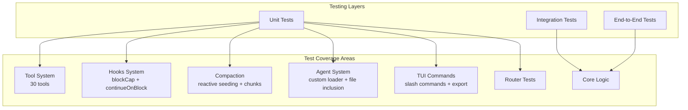
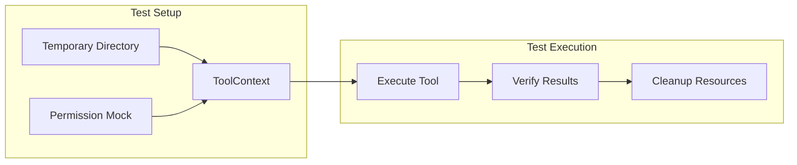
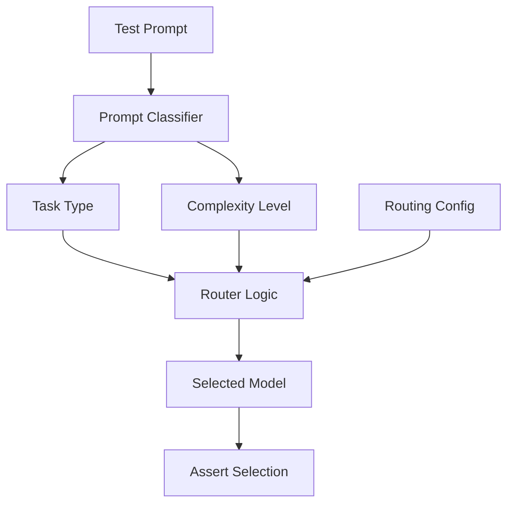

# Testing Guide

This document provides comprehensive testing guidelines for Alexi, including testing strategies, test commands, coverage expectations, and best practices.

## Table of Contents

- [Testing Strategy](#testing-strategy)
- [Test Commands](#test-commands)
- [Test Configuration](#test-configuration)
- [Test Coverage](#test-coverage)
- [Testing Tool System](#testing-tool-system)
  - [Testing the `link_pr` Tool](#testing-the-link_pr-tool)
  - [Testing gray-matter Cache Poisoning Regression (issue #1945)](#testing-gray-matter-cache-poisoning-regression-issue-1945)
- [Testing Minify-Safe Telemetry Detection](#testing-minify-safe-telemetry-detection)
- [Testing Hooks](#testing-hooks)
- [Testing hook dispatcher coverage per `HookEvent`](#testing-hook-dispatcher-coverage-per-hookevent-testshooksdispatcher-coveragetestts)
- [Testing Compaction](#testing-compaction)
- [Testing TUI Commands](#testing-tui-commands)
- [Testing Background Tasks](#testing-background-tasks)
- [Testing Routing](#testing-routing)
- [Testing Rewind Command](#testing-rewind-command)
- [Testing with SAP AI Core](#testing-with-sap-ai-core)
- [Testing MCP Capability Validation (CIMD, issue #1877)](#testing-mcp-capability-validation-cimd-issue-1877)
- [Testing the Automated Retention Lifecycle Runner](#testing-the-automated-retention-lifecycle-runner)
- [Testing the commit-message rules wiring (issue #1953)](#testing-the-commit-message-rules-wiring-issue-1953)
- [Best Practices](#best-practices)

## Testing Strategy

Alexi employs a multi-layered testing strategy:


```mermaid
graph TB
    subgraph "Testing Layers"
        Unit[Unit Tests]
        Integration[Integration Tests]
        E2E[End-to-End Tests]
    end
    
    subgraph "Test Coverage Areas"
        Tools[Tool System<br/>30 tools]
        Hooks[Hooks System<br/>blockCap + continueOnBlock]
        Compaction[Compaction<br/>reactive seeding + chunks]
        Agents[Agent System<br/>custom loader + file inclusion]
        TUI[TUI Commands<br/>slash commands + export]
        Router[Router Tests]
        Core[Core Logic]
    end
    
    Unit --> Tools
    Unit --> Hooks
    Unit --> Compaction
    Unit --> Agents
    Unit --> TUI
    Unit --> Router
    Integration --> Core
    E2E --> Core
```

### Testing Layers

1. **Unit Tests**: Test individual functions and modules in isolation
   - Tool implementations (30 tools)
   - Routing logic and prompt classification
   - Compaction strategies (truncate, summarize, sliding, smart)
   - Hook execution (command, HTTP, script types)
   - Agent loader with file inclusions
   - Permission management and doom loop detection

2. **Integration Tests**: Test interactions between components
   - Agentic chat with tool execution loop
   - Context overflow detection and reactive compaction
   - Hook integration in agentic execution
   - MCP client/server connections

3. **End-to-End Tests**: Test complete user workflows
   - CLI command execution
   - Multi-turn conversations with session persistence
   - Auto-routing decisions

## Test Commands

### Run All Tests

```bash
npm test
```

### Run Tests in Watch Mode

```bash
npm run test:watch
```

### Run Tests with Coverage

```bash
npm run test:coverage
```

### Run Specific Test Files

```bash
# Run a single test file
npm test -- tests/tool/tools/write.test.ts

# Run tests in a directory
npm test -- tests/tool/tools/

# Run tests matching a pattern
npm test -- --grep "write tool"

# Run hook tests
npm test -- tests/hooks/

# Run compaction tests
npm test -- tests/compaction/

# Run agent tests
npm test -- tests/agent/
```

## Test Configuration

Alexi uses **Vitest** with the following configuration (`vitest.config.ts`):

```typescript
import { defineConfig } from 'vitest/config';
import react from '@vitejs/plugin-react';

export default defineConfig({
  plugins: [react()],
  test: {
    environment: 'node',
    coverage: {
      provider: 'v8',
      reporter: ['text', 'html', 'lcov'],
      thresholds: {
        lines: 15,
        functions: 15,
        branches: 15,
        statements: 15,
      },
    },
  },
});
```

Key configuration:
- **Environment**: Node.js (not jsdom)
- **React Plugin**: Enabled for Ink TUI component testing
- **Coverage Provider**: V8
- **Coverage Threshold**: 15% minimum (increasing as coverage improves)

## Test Coverage

### Coverage Expectations

| Component | Target | Description |
|-----------|--------|-------------|
| Tool System | 90%+ | File operations, permissions, error handling |
| Hooks | 85%+ | blockCap, continueOnBlock, execution types |
| Compaction | 85%+ | All strategies, reactive seeding, chunked |
| Agent Loader | 80%+ | Custom agents, file inclusions |
| Core Logic | 85%+ | Orchestrator, router, session |
| TUI | 70%+ | Slash commands, context hooks |

### Generating Coverage Reports

```bash
npm run test:coverage

# View HTML report
open coverage/index.html
```

### Testing the dynamic model catalog

`src/providers/modelCatalog.ts` maintains a module-level cache and a background refresh timer. Tests MUST reset that state in `beforeEach` / `afterEach` to stay parallel-safe:

```typescript
import { invalidateCatalog, refreshModelCatalog, getCatalogStatus } from '../../src/providers/modelCatalog.js';
import { vi, beforeEach, afterEach } from 'vitest';

vi.mock('@sap-ai-sdk/ai-api', () => ({
  DeploymentApi: {
    deploymentQuery: vi.fn(() => ({
      execute: vi.fn().mockResolvedValue({
        resources: [{ id: 'dep-1', configurationName: 'gpt-4o' }],
      }),
    })),
  },
}));

beforeEach(() => invalidateCatalog());
afterEach(() => invalidateCatalog());

it('transitions idle → loading → ready', async () => {
  expect(getCatalogStatus()).toBe('idle');
  await refreshModelCatalog();
  expect(getCatalogStatus()).toBe('ready');
});
```

`invalidateCatalog()` clears the pending refresh timer, aborts any in-flight fetch tracking flag, and resets `entries` to the static seed. Without it a test that flips the catalog to `ready` leaks state into subsequent tests via the module singleton. The refresh timer uses `.unref()` so Node exits cleanly even if a test forgets to call `invalidateCatalog()`, but the cache pollution will still cause assertion drift.

#### Testing static-catalog membership contracts (`src/providers/__tests__/modelCatalog.test.ts`)

New entries to `ORCHESTRATION_MODELS` in `src/providers/sapOrchestration.ts` should ship with a small contract-pinning test that walks the id through every string-based matcher a caller might reach. The canonical example is `src/providers/__tests__/modelCatalog.test.ts` (added with `deepseek-v4.1-flash` in commit `531a15c1`, `feat(providers): add deepseek-v4.1-flash to model catalog`):

```typescript
import { describe, expect, it } from 'vitest';
import {
  getAvailableModels,
  isAvailableModel,
  getModelMetadata,
} from '../modelCatalog.js';
import {
  ORCHESTRATION_MODELS,
  ORCHESTRATION_MODEL_METADATA,
  isOrchestrationModel,
  modelHasCapability,
} from '../sapOrchestration.js';
import { modelSupportsReasoningEffort } from '../model-match.js';

describe('modelCatalog: deepseek-v4.1-flash entry', () => {
  it('is present in the static ORCHESTRATION_MODELS list', () => {
    expect((ORCHESTRATION_MODELS as readonly string[]).includes('deepseek-v4.1-flash')).toBe(true);
  });

  it('is accepted by isOrchestrationModel()', () => {
    expect(isOrchestrationModel('deepseek-v4.1-flash')).toBe(true);
  });

  it('is exposed via getAvailableModels()', () => {
    expect(getAvailableModels()).toContain('deepseek-v4.1-flash');
  });

  it('is accepted by isAvailableModel()', () => {
    expect(isAvailableModel('deepseek-v4.1-flash')).toBe(true);
  });

  it('has a metadata entry matching the deepseek-r1 capability profile', () => {
    const flashMeta = ORCHESTRATION_MODEL_METADATA['deepseek-v4.1-flash'];
    const r1Meta = ORCHESTRATION_MODEL_METADATA['deepseek-ai--deepseek-r1'];
    expect(flashMeta).toBeDefined();
    expect(r1Meta).toBeDefined();
    expect(flashMeta?.capabilities).toEqual(r1Meta?.capabilities);
  });

  it('does not advertise tool-calling (matches deepseek family profile)', () => {
    expect(modelHasCapability('deepseek-v4.1-flash', 'tools')).toBe(false);
  });

  it('supports reasoning_effort at "levels" (low/medium/high) like deepseek-v4-chat', () => {
    expect(modelSupportsReasoningEffort('deepseek-v4.1-flash')).toBe('levels');
    expect(modelSupportsReasoningEffort('DEEPSEEK-V4.1-FLASH')).toBe('levels');
    expect(modelSupportsReasoningEffort('sap-ai-core/deepseek-v4.1-flash')).toBe('levels');
  });
});
```

Key patterns for follow-on entries:

1. **Cover both the `ORCHESTRATION_MODELS` list AND the `ORCHESTRATION_MODEL_METADATA` map.** A regression that adds the id to the string list but forgets the metadata entry (or vice versa) is invisible to a happy-path e2e test — the metadata absence only surfaces on `modelHasCapability(...)` calls, and the string absence only surfaces on `isAvailableModel(...)` / router dispatch. Assert both explicitly.
2. **Cross-check against a sibling id in the same family.** When a new id is intended to inherit an existing family's capability profile (as `deepseek-v4.1-flash` inherits `deepseek-ai--deepseek-r1`'s `capabilities: []`), assert `.toEqual(siblingMeta?.capabilities)` rather than duplicating the literal. Duplicating the literal makes future family-wide updates a search-and-replace exercise; the `.toEqual` shape lets a single family-level change propagate to every sibling test with no edits.
3. **Exercise the case-insensitive and provider-prefixed forms of the reasoning-effort guard.** `modelSupportsReasoningEffort` normalises via `toLowerCase()` and matches on the `deepseek` substring, so `DEEPSEEK-V4.1-FLASH` and `sap-ai-core/deepseek-v4.1-flash` must both classify as `'levels'`. A regression that tightened the guard to an exact-id lookup would silently drop reasoning-effort on any envelope with a `sap-ai-core/` prefix — pin the two variants so the regression trips loudly.
4. **Do NOT mock `modelCatalog.ts` in this suite.** Unlike the router / inline-override tests that need a controlled `isAvailableModel` return, this suite is validating the real module wiring (static list ↔ metadata map ↔ family guards) and MUST use the real exports so a broken export chain fails the suite. If the catalog's `refreshModelCatalog()` fetches something in a `beforeAll` hook, the suite is still correct because the static seed already contains the id — the assertion `getAvailableModels().includes('deepseek-v4.1-flash')` passes regardless of whether the live fetch has completed.

##### Parametrised coverage for id families (Anthropic dated snapshots, Aider #5173)

When a single feed adds several sibling ids at once — for example, the Aider PR #5173 port that added the five `anthropic--claude-*-YYYYMMDD` dated snapshots on 2026-09-21 — prefer a `describe` block that drives the same assertions across every id via `it.each` instead of duplicating the seven contract checks per id. The pattern in `src/providers/__tests__/modelCatalog.test.ts` for the Claude dated snapshots is the reference shape:

```typescript
describe('modelCatalog: recent Claude dated snapshots (Aider #5173)', () => {
  const claudeSnapshots = [
    'anthropic--claude-3-7-sonnet-20250219',
    'anthropic--claude-opus-4-1-20250805',
    'anthropic--claude-opus-4-5-20251101',
    'anthropic--claude-opus-4-6-20260205',
    'anthropic--claude-opus-4-7-20260416',
  ] as const;

  it.each(claudeSnapshots)('%s is present in the static ORCHESTRATION_MODELS list', (id) => {
    expect((ORCHESTRATION_MODELS as readonly string[]).includes(id)).toBe(true);
  });

  it.each(claudeSnapshots)('%s is accepted by isOrchestrationModel()', (id) => {
    expect(isOrchestrationModel(id)).toBe(true);
  });

  it.each(claudeSnapshots)('%s is exposed via getAvailableModels()', (id) => {
    expect(getAvailableModels()).toContain(id);
  });

  it.each(claudeSnapshots)('%s is accepted by isAvailableModel()', (id) => {
    expect(isAvailableModel(id)).toBe(true);
  });

  it.each(claudeSnapshots)('%s has a tool-calling metadata entry', (id) => {
    const meta = ORCHESTRATION_MODEL_METADATA[id];
    expect(meta).toBeDefined();
    expect(meta?.capabilities).toEqual(['tools']);
  });

  it.each(claudeSnapshots)('%s exposes metadata through getModelMetadata()', (id) => {
    const meta = getModelMetadata(id);
    expect(meta).toBeDefined();
    expect(meta?.capabilities).toContain('tools');
  });

  it.each(claudeSnapshots)('%s advertises the tools capability', (id) => {
    expect(modelHasCapability(id, 'tools')).toBe(true);
  });

  it.each(claudeSnapshots)(
    '%s advertises tools even when queried through the sap-ai-core/ prefix',
    (id) => {
      expect(modelHasCapability(`sap-ai-core/${id}`, 'tools')).toBe(true);
    }
  );
});
```

Additional patterns worth internalising from this suite:

1. **Group by feed / port, not by id.** The `describe` header cites the upstream source (Aider #5173) and the port date. When a future family-level regression fires, the failing suite name is enough to locate the originating change in the git log — no bisecting needed.
2. **Freeze the id list with `as const`.** The tuple typing keeps the `it.each` callback parameters narrowed to the literal string union, so a typo in a later assertion (`expect(modelHasCapability('anthropic--claude-3-7-sonnet-2025021', 'tools'))` — trailing digit dropped) fails at typecheck instead of silently short-circuiting to `false`.
3. **Pin the `sap-ai-core/` prefix form in the SAME suite.** The provider-prefix stripping in `modelHasCapability` is a separate code path from the raw-id lookup. A regression that tightened the guard to an exact match would pass every non-prefixed assertion and fail only the prefixed variants — asserting both shapes for every id catches the regression on the first sibling instead of after the router hot loop degrades in production.
4. **Assert the exact `capabilities` array, not a superset.** `expect(meta?.capabilities).toEqual(['tools'])` fails if the metadata entry was accidentally seeded with extra tags (`['tools', 'image-generation']`). If the port ever legitimately adds a second capability to these ids, the intent-preserving update is to change the expected array in ONE place — the `it.each` factors the assertion out of the per-id loop for free.

### Testing model-fetch error classification (`tests/providers/modelFetchErrors.test.ts`)

`src/providers/modelFetchErrors.ts` is a pure module — no SAP SDK, no
environment, no network — so its tests are straight unit tests with
synthetic errors. The suite pins two contracts:

1. **`classifyFetchError` precedence.** For every status code Alexi
   knows how to classify, assert both `transient` and the `reason`
   substring so a regression that flipped the transient flag OR
   silently changed the actionable text (e.g. dropped the
   `AICORE_SERVICE_KEY` hint from the 401 reason) trips loudly.
2. **`fetchWithRetry` control flow.** Drive the retry loop with the
   injectable `sleep` seam instead of `vi.useFakeTimers()` so the test
   run stays parallel-safe and does not perturb Node's timer queue.

```typescript
import { describe, expect, it, vi } from 'vitest';
import {
  ModelFetchError,
  classifyFetchError,
  fetchWithRetry,
} from '../../src/providers/modelFetchErrors.js';

describe('classifyFetchError', () => {
  it('classifies 401 as permanent with an actionable reason', () => {
    const err = Object.assign(new Error('boom'), { status: 401 });
    const cls = classifyFetchError(err);
    expect(cls.transient).toBe(false);
    expect(cls.statusCode).toBe(401);
    expect(cls.reason).toMatch(/unauthorized/i);
    expect(cls.reason).toMatch(/AICORE_SERVICE_KEY/);
  });

  it('classifies 429 as transient with a rate-limit reason', () => {
    const err = Object.assign(new Error('too many'), { status: 429 });
    const cls = classifyFetchError(err);
    expect(cls.transient).toBe(true);
    expect(cls.reason).toMatch(/rate limit/i);
  });

  it('reads nested response.status (axios / http-client shape)', () => {
    const err = Object.assign(new Error('wrapped'), { response: { status: 503 } });
    expect(classifyFetchError(err).transient).toBe(true);
    expect(classifyFetchError(err).statusCode).toBe(503);
  });
});

describe('fetchWithRetry', () => {
  it('retries transient failures and eventually succeeds', async () => {
    let attempts = 0;
    const op = vi.fn(async () => {
      attempts += 1;
      if (attempts < 3) {
        throw Object.assign(new Error('flaky'), { status: 503 });
      }
      return 'ok';
    });
    const sleep = vi.fn(async () => {}); // instant

    const result = await fetchWithRetry(op, { sleep });
    expect(result).toBe('ok');
    expect(op).toHaveBeenCalledTimes(3);
    // Two sleeps (before attempts 2 and 3), 1000ms then 2000ms.
    expect(sleep).toHaveBeenNthCalledWith(1, 1000);
    expect(sleep).toHaveBeenNthCalledWith(2, 2000);
  });

  it('throws ModelFetchError on the first attempt for permanent failures', async () => {
    const op = vi.fn(async () => {
      throw Object.assign(new Error('bad key'), { status: 401 });
    });
    await expect(fetchWithRetry(op)).rejects.toBeInstanceOf(ModelFetchError);
    expect(op).toHaveBeenCalledTimes(1);
  });
});
```

Patterns worth internalising:

1. **Assert both `transient` AND `reason` for every classified status.**
   The `reason` field is user-facing — a regression that flipped a
   status from permanent to transient often preserves the numeric
   status but silently drops the actionable text. Pinning both catches
   the regression before it reaches operators.
2. **Cover every status-code lookup shape.** `extractStatus` walks
   `err.status`, `err.statusCode`, `err.response.status`,
   `err.cause.status`, `err.rootCause.status`, and a message-regex
   fallback. Include at least one case per shape so a refactor that
   silently drops one path (say, breaks the `err.cause.status` walk)
   trips a specific test rather than every downstream integration test
   that happens to route through that shape.
3. **Use the `sleep` seam, not `vi.useFakeTimers()`.** `fetchWithRetry`
   deliberately accepts an injectable `sleep` so the retry loop is
   testable without perturbing Node's global timer queue. `vi.fn(async () => {})`
   makes the retries effectively instant and lets you assert the
   requested delay values directly (`toHaveBeenNthCalledWith(2, 2000)`)
   rather than measuring elapsed wall-clock time.
4. **Distinguish `ModelFetchError` structurally.** In tests that cross
   a module boundary (e.g. mocking `src/providers/index.ts` and then
   asserting the error surfaced by `src/cli/commands/models.ts`), match
   on `err.name === 'ModelFetchError'` rather than `instanceof
   ModelFetchError` — the CLI code path uses the structural check for
   the same reason and the tests should match the runtime contract.
5. **Do NOT hit the real SAP SDK from this suite.** The classifier
   and retry helpers must be provable in isolation. Integration between
   `fetchWithRetry` and `DeploymentApi.deploymentQuery` is covered in
   `tests/providers/modelCatalog.test.ts` where `@sap-ai-sdk/ai-api` is
   mocked via `vi.mock` at the module level.

#### Testing hint helpers (issue #1851)

`formatCatalogErrorHint` and `hintForErrorMessage` are pure functions
and live in the same suite as `classifyFetchError`. Pin one case per
branch so a refactor that reorders the guard ladder (e.g. moves the
`404` branch below the generic 4xx branch, or drops the message-based
fallback) trips a specific test rather than an incidental one.

```typescript
import { formatCatalogErrorHint, hintForErrorMessage } from '../../src/providers/modelFetchErrors.js';

describe('formatCatalogErrorHint', () => {
  it('returns the AICORE_SERVICE_KEY hint on 401', () => {
    expect(formatCatalogErrorHint({ statusCode: 401, reason: '' })).toMatch(/AICORE_SERVICE_KEY/);
  });
  it('returns the AI_API_URL / -m fallback hint on 404', () => {
    const hint = formatCatalogErrorHint({ statusCode: 404, reason: '' });
    expect(hint).toMatch(/AI_API_URL/);
    expect(hint).toMatch(/-m/);
  });
  it('returns the network hint on ECONNRESET', () => {
    expect(formatCatalogErrorHint({ code: 'ECONNRESET', reason: '' })).toMatch(/network|proxy|VPN/);
  });
  it('returns undefined for an unclassified failure', () => {
    expect(formatCatalogErrorHint({ reason: 'weird upstream thing' })).toBeUndefined();
  });
});

describe('hintForErrorMessage', () => {
  it('recovers the 401 hint from a stringified reason', () => {
    expect(hintForErrorMessage('unauthorized (401) — check AICORE_SERVICE_KEY / credentials'))
      .toMatch(/AICORE_SERVICE_KEY/);
  });
  it('falls back to a generic pointer when no status or code was captured', () => {
    expect(hintForErrorMessage('mystery failure')).toMatch(/AICORE_SERVICE_KEY|network|provider config/);
  });
  it('returns undefined for an empty message', () => {
    expect(hintForErrorMessage(undefined)).toBeUndefined();
  });
});
```

Patterns worth internalising:

1. **Pin the hint by regex, not by full-string equality.** Every hint
   is user-visible copy; a future editorial tweak to the wording should
   NOT force a test churn as long as the actionable keyword
   (`AICORE_SERVICE_KEY`, `AI_API_URL`, `network`, `proxy`, `VPN`, `-m`)
   still lands in the string. `toMatch(/AICORE_SERVICE_KEY/)` catches
   the regression that matters — "does the operator still see WHICH
   env var to fix?" — without pinning prose.
2. **Assert the fallback branch of `hintForErrorMessage`.** The final
   generic pointer exists so the operator always gets some guidance
   even when the classifier had no status or code to work with. A
   regression that returned `undefined` from the fallback would
   silently degrade the CLI to the pre-#1851 behaviour with no compile
   error, so pin the branch explicitly.
3. **Do not fake `errorClass` shape in catalog tests.** The catalog
   test suite (`tests/providers/modelCatalog.test.ts`) drives
   `refreshModelCatalog` end-to-end and asserts `getCatalogState().errorClass`
   against the real classifier output so a divergence between the
   thrown `ModelFetchError` and the persisted state is caught on the
   spot.

#### Testing the TUI model picker error path (`tests/cli/tui/ModelPicker.test.tsx`)

The Ink `ModelPicker` renders a two-line error badge (reason + hint)
when the live catalog is in `status === 'error'`. Drive the catalog
into an error state by mocking `@sap-ai-sdk/ai-api` and rejecting the
`DeploymentApi.deploymentQuery` promise, then render the picker under
the same `DialogProvider` / `ThemeProvider` context wrapper the app
uses:

```tsx
const { executeMock, deploymentQueryMock } = vi.hoisted(() => {
  const executeMock = vi.fn();
  const deploymentQueryMock = vi.fn(() => ({ execute: executeMock }));
  return { executeMock, deploymentQueryMock };
});

vi.mock('@sap-ai-sdk/ai-api', () => ({
  DeploymentApi: { deploymentQuery: deploymentQueryMock },
}));

const noSleep = (): Promise<void> => Promise.resolve();

beforeEach(() => {
  executeMock.mockReset();
  deploymentQueryMock.mockClear();
  invalidateCatalog();
});
afterEach(() => {
  invalidateCatalog();
});

it('renders the classified reason and actionable hint on a 401 failure', async () => {
  executeMock.mockRejectedValue(Object.assign(new Error('boom'), { status: 401 }));
  await refreshModelCatalog('default', { retry: { sleep: noSleep } });

  const { lastFrame } = render(
    <Wrapper>
      <ModelPicker currentModel="claude-sonnet-id" />
    </Wrapper>
  );
  const frame = lastFrame() ?? '';
  expect(frame).toContain('Model list unavailable');
  expect(frame).toMatch(/unauthorized/i);
  expect(frame).toMatch(/AICORE_SERVICE_KEY/);
});
```

Patterns worth internalising:

1. **`invalidateCatalog()` in both `beforeEach` and `afterEach`.** The
   catalog is module-level singleton state; without the reset the
   error state from one test leaks into the next `ready` assertion and
   the tests only fail when the file order changes.
2. **Inject `retry: { sleep: noSleep }` on `refreshModelCatalog`.** The
   default retry loop sleeps for `1000ms` / `2000ms` between attempts,
   which would balloon the picker test file into multi-second runs.
   `sleep: () => Promise.resolve()` makes the retries effectively
   instant. For the `ECONNRESET` case set `maxAttempts: 1` too so the
   test does not exercise the exponential backoff at all.
3. **Assert both lines of the two-line badge.** Line 1 (`Model list
   unavailable`) proves the picker read the classified reason from
   `getCatalogState().errorMessage`; line 2 (the hint regex, e.g.
   `AICORE_SERVICE_KEY`, `AI_API_URL|-m`, or `network|proxy|VPN`)
   proves the picker also called `hintForErrorMessage` and rendered
   the result. A regression that dropped the hint line would still pass
   a line-1-only assertion.
4. **Pin the ready-state as a control.** The suite also asserts the
   success path (`executeMock.mockResolvedValueOnce({ resources: [...] })`)
   renders the `live` count and does NOT contain `Model list
   unavailable`. Without the control, a regression that hard-coded the
   error badge into every render would only fail one direction.

#### Testing the `alexi models` command error surface (`tests/cli/commands/models.test.ts`, issue #1886)

`tests/cli/commands/models.test.ts` (130 lines) drives the full
`registerModelsCommand(program)` surface through Commander's async
parse path, spies on `process.exit`, `console.error`, and
`console.log`, and pins the classified-reason-plus-hint output for the
three top failure modes:

- 401 from `DeploymentApi.deploymentQuery` (`AICORE_SERVICE_KEY` reset)
- 404 from the same call (`AI_API_URL` / `-m` fallback guidance)
- missing `AICORE_SERVICE_KEY` in the environment

Patterns to internalise from this suite:

1. **Hoist the SAP SDK mock.** `vi.hoisted` guarantees the mock is
   installed before `registerModelsCommand` transitively imports
   `@sap-ai-sdk/ai-api`. Missing the hoist means the real SDK is
   loaded and every test either hits the network or throws on module
   evaluation:

   ```ts
   const { executeMock, deploymentQueryMock } = vi.hoisted(() => {
     const executeMock = vi.fn();
     const deploymentQueryMock = vi.fn(() => ({ execute: executeMock }));
     return { executeMock, deploymentQueryMock };
   });

   vi.mock('@sap-ai-sdk/ai-api', () => ({
     DeploymentApi: { deploymentQuery: deploymentQueryMock },
   }));
   ```

2. **Stub `env` deterministically.** The command reads
   `AICORE_SERVICE_KEY` via `env('AICORE_SERVICE_KEY')` — stub the
   whole module so `process.env` is irrelevant:

   ```ts
   const { envMock } = vi.hoisted(() => ({ envMock: vi.fn() }));
   vi.mock('../../../src/config/env.js', () => ({ env: envMock }));
   // In a test that wants the key present:
   envMock.mockImplementation((key: string) => (key === 'AICORE_SERVICE_KEY' ? '{}' : undefined));
   ```

3. **Trap `process.exit` with a synthetic throw.** The command calls
   `process.exit(1)` on failure. Spy it as an implementation that
   captures the code and throws `Error('__exit__:1')` so control
   returns to the test:

   ```ts
   const exitSpy = vi.spyOn(process, 'exit').mockImplementation(((code?: number) => {
     exitCode = code ?? 0;
     throw new Error(`__exit__:${exitCode}`);
   }) as never);
   ```

4. **Use `program.exitOverride()`.** Commander itself will call
   `process.exit` on parse errors unless `exitOverride()` is set — turn
   it on so only the command's own `process.exit` is captured by the
   spy.

5. **Assert BOTH the reason and the hint.** `Error:` on one line and
   `Hint:` on the next are two separate `console.error` calls; a
   regression that dropped the hint would still pass a reason-only
   assertion. Use two independent `expect(stderr).toMatch(...)` checks.

#### Testing the inquirer picker proxy fallback (`tests/cli/utils/modelPicker.test.ts`, issue #1886)

`tests/cli/utils/modelPicker.test.ts` (145 lines) exercises the legacy
`getAvailableModels()` used by `alexi interactive` when the Ink TUI is
not active. When `SAP_PROXY_BASE_URL` / `SAP_PROXY_API_KEY` are set
but the `/models` call returns 401, the picker MUST log the
classified reason plus hint via `logger.warn` before falling back to
`ORCHESTRATION_MODELS`. Test scaffolding:

```ts
const { executeMock, deploymentQueryMock } = vi.hoisted(() => {
  const executeMock = vi.fn();
  const deploymentQueryMock = vi.fn(() => ({ execute: executeMock }));
  return { executeMock, deploymentQueryMock };
});
vi.mock('@sap-ai-sdk/ai-api', () => ({
  DeploymentApi: { deploymentQuery: deploymentQueryMock },
}));

const { envMock } = vi.hoisted(() => ({ envMock: vi.fn() }));
vi.mock('../../../src/config/env.js', () => ({ env: envMock }));

// Force the proxy branch of getAvailableModels:
envMock.mockImplementation((key: string) => {
  if (key === 'SAP_PROXY_BASE_URL') return 'https://example.invalid';
  if (key === 'SAP_PROXY_API_KEY') return 'secret';
  return undefined;
});
const warnSpy = vi.spyOn(logger, 'warn').mockImplementation(() => {});
vi.spyOn(globalThis, 'fetch').mockResolvedValue(
  new Response(null, { status: 401, statusText: 'Unauthorized' })
);

const models = await getAvailableModels();
expect(models.every((m) => m.source === 'local')).toBe(true); // static fallback
const warnCalls = warnSpy.mock.calls.map((c) => String(c[0]));
expect(warnCalls.some((m) => /proxy model list/i.test(m))).toBe(true);
expect(warnCalls.some((m) => /Hint:/i.test(m))).toBe(true);
```

`invalidateCatalog()` in both `beforeEach` and `afterEach` is
mandatory: without it a `ready` state from an earlier suite short-circuits
`getAvailableModels()` and the proxy branch never runs.

#### Testing the `/model` slash command's picker prop (`tests/cli/tui/useCommands.test.tsx`, issue #1886)

The `useCommands` hook was previously passing a hardcoded six-model
`STATIC_MODEL_GROUPS` constant to `openDialog('model-picker', ...)`,
which suppressed the picker's live-catalog error branch. The new
assertion pins that the `/model` slash command (no args) opens the
picker WITHOUT `modelGroups` so the live catalog is consulted:

```tsx
mockOpen.mockResolvedValueOnce('gpt-4o');
render(<InnerComponent />);
await capturedHandleCommand!('/model');

expect(mockOpen).toHaveBeenCalledWith(
  'model-picker',
  expect.not.objectContaining({ modelGroups: expect.anything() })
);
expect(mockSetModel).toHaveBeenCalledWith('gpt-4o');
```

`expect.not.objectContaining({ modelGroups: expect.anything() })` is
the precise negation — a regression that reintroduced a
`modelGroups: []` empty-array override would still trip this
assertion because the picker's live-catalog branch is gated on
`propGroupsProvided = modelGroups !== undefined && modelGroups.length > 0`.

#### Testing catalog refresh log severity (`tests/providers/modelCatalog.test.ts`, issue #1886)

`refreshModelCatalog` picks the log severity from the classification's
`transient` flag — `logger.debug` for retryable failures so the
periodic 5-minute background refresh does not spam the console at
`info`, `logger.error` for permanent failures (credential / URL /
resource group) that require operator action. Pin both branches with
`vi.spyOn(logger, ...)`:

```ts
// Permanent — expect logger.error
const errSpy = vi.spyOn(logger, 'error').mockImplementation(() => {});
executeMock.mockRejectedValue(Object.assign(new Error('boom'), { status: 401 }));
await refreshModelCatalog('default', { retry: { maxAttempts: 1, sleep: noSleep } });
expect(errSpy).toHaveBeenCalledWith(expect.stringContaining('Model catalog refresh failed'));

// Transient — expect logger.debug, NOT logger.error
const dbgSpy = vi.spyOn(logger, 'debug').mockImplementation(() => {});
executeMock.mockRejectedValue(Object.assign(new Error('boom'), { code: 'ECONNRESET' }));
await refreshModelCatalog('default', { retry: { maxAttempts: 1, sleep: noSleep } });
expect(dbgSpy).toHaveBeenCalledWith(expect.stringContaining('transient'));
```

`maxAttempts: 1` on the transient case is intentional — the default
`3` retries would emit two `onRetry` intermediates BEFORE the final
throw and pollute the assertion, and the log-severity contract is
about the final classified reason, not the retry chatter.

### Testing reasoning-token accounting (`tests/providers/sapOrchestration-reasoningTokens.test.ts`)

`extractReasoningTokens` and `normalizeTokenUsage` in `src/providers/sapOrchestration.ts` are pure classifiers — no SAP SDK, no network — so their tests are direct unit tests over synthetic payloads. The `SapOrchestrationProvider.complete()` / `.stream()` end-to-end assertions mock the SAP SDK at the module boundary so the reasoning-token plumbing can be exercised without live credentials.

Three contracts are pinned by the suite:

1. **Extraction precedence.** OpenAI shape (`completion_tokens_details.reasoning_tokens`) wins over Anthropic top-level fields (`thinking_tokens`, `reasoning_tokens`), which win over AI SDK v4 (`outputTokens.reasoning`). Within the Anthropic pair, `thinking_tokens` wins over `reasoning_tokens`. A regression that reordered the guards would flip the extracted count on payloads that carry more than one shape.
2. **`0` is meaningful, `undefined` is "no data".** `expect(extractReasoningTokens({ completion_tokens_details: { reasoning_tokens: 0 } })).toBe(0)` catches a regression that collapses both cases to `undefined` (or, worse, `0`).
3. **`normalizeTokenUsage` subtracts and clamps.** `completion_tokens = max(0, raw.completion_tokens - reasoning)`. The clamp is asserted with a `reasoning > completion` payload so a regression that removed the `Math.max(0, ...)` guard would trip.

```typescript
// tests/providers/sapOrchestration-reasoningTokens.test.ts (excerpt)
import { describe, it, expect } from 'vitest';
import {
  extractReasoningTokens,
  normalizeTokenUsage,
} from '../../src/providers/sapOrchestration.js';

describe('extractReasoningTokens', () => {
  it('prefers OpenAI shape when multiple shapes are present', () => {
    expect(
      extractReasoningTokens({
        completion_tokens_details: { reasoning_tokens: 10 },
        thinking_tokens: 99,
        reasoning_tokens: 88,
      })
    ).toBe(10);
  });

  it('preserves 0 as a meaningful value (no thinking this turn)', () => {
    expect(
      extractReasoningTokens({
        completion_tokens_details: { reasoning_tokens: 0 },
      })
    ).toBe(0);
  });

  it('ignores non-numeric reasoning fields', () => {
    expect(
      extractReasoningTokens({
        thinking_tokens: '50',
        reasoning_tokens: null,
      })
    ).toBeUndefined();
  });
});

describe('normalizeTokenUsage', () => {
  it('subtracts reasoning tokens from completion_tokens', () => {
    const usage = normalizeTokenUsage({
      prompt_tokens: 100,
      completion_tokens: 200,
      total_tokens: 300,
      completion_tokens_details: { reasoning_tokens: 75 },
    });
    expect(usage!.completion_tokens).toBe(125);
    expect(usage!.reasoningTokenCount).toBe(75);
    // total_tokens is passed through unchanged.
    expect(usage!.total_tokens).toBe(300);
  });

  it('clamps completion_tokens at 0 when reasoning exceeds completion', () => {
    const usage = normalizeTokenUsage({
      prompt_tokens: 100,
      completion_tokens: 10,
      thinking_tokens: 999,
    });
    expect(usage!.completion_tokens).toBe(0);
    expect(usage!.reasoningTokenCount).toBe(999);
  });
});
```

The end-to-end provider assertions mock `@sap-ai-sdk/orchestration` at the module boundary so the mocked `getTokenUsage()` can return each of the four SDK shapes in turn:

```typescript
let mockUsage: Record<string, unknown> | undefined = {};

vi.mock('@sap-ai-sdk/orchestration', () => {
  class MockOrchestrationClient {
    async chatCompletion() {
      return {
        getContent: () => 'ok',
        getFinishReason: () => 'stop',
        getTokenUsage: () => mockUsage,
        getToolCalls: () => [],
        getAllMessages: () => [],
      };
    }
    // stream() is mocked similarly with an async generator.
  }
  return { OrchestrationClient: MockOrchestrationClient, /* ... */ };
});

import { SapOrchestrationProvider } from '../../src/providers/sapOrchestration.js';

it('complete() surfaces reasoningTokenCount and subtracts from completion (OpenAI shape)', async () => {
  mockUsage = {
    prompt_tokens: 100,
    completion_tokens: 200,
    total_tokens: 300,
    completion_tokens_details: { reasoning_tokens: 75 },
  };
  const provider = new SapOrchestrationProvider({
    modelName: 'gpt-5',
    deploymentId: 'test-deployment',
  });
  const result = await provider.complete([{ role: 'user', content: 'hi' }]);
  expect(result.usage?.reasoningTokenCount).toBe(75);
  expect(result.usage?.completion_tokens).toBe(125);
});
```

Patterns worth internalising:

1. **Assert both `reasoningTokenCount` AND the reduced `completion_tokens` on every end-to-end case.** A regression that stopped subtracting would leave `reasoningTokenCount` correct but overreport `completion_tokens` — pinning both catches the exact class of bug this feature exists to prevent.
2. **Mock at the SDK boundary, not at `normalizeTokenUsage`.** The point of the end-to-end assertions is to prove that both the streaming and non-streaming call sites route through `normalizeTokenUsage`. Mocking the helper itself would pass even after a regression that reverted `complete()` to the pre-2026-09-26 inline shape.
3. **Test `mergeUsage` sums reasoning tokens** when validating the empty-response retry loop (issue #1279) so cumulative attempts stay correct.
4. **Do NOT set `AICORE_SERVICE_KEY` in these tests.** The provider constructor accepts an explicit `deploymentId`; `env('AICORE_RESOURCE_GROUP')` is mocked via `vi.mock('../../src/config/env.js', ...)` so the suite runs identically on a laptop with no credentials and in CI.

### Testing content-filter short-circuit (issue #1888)

The two-layer content-filter short-circuit (`retryEmptyResponse` in `src/providers/sapOrchestration.ts` and `agenticChat` in `src/core/agenticChat.ts`) is covered by two dependency-light unit suites — no live SAP AI Core call, no real timers.

`tests/providers/sapOrchestration-emptyResponseRetry.test.ts` pins the wrapper contract. Two cases were added for #1888 alongside the existing empty-response cases:

```typescript
it('skips retries when the empty attempt reports a content-filter finish', async () => {
  let callCount = 0;
  const factory = (): AsyncIterable<StreamChunk> => {
    callCount++;
    async function* gen(): AsyncGenerator<StreamChunk> {
      yield {
        text: '',
        finishReason: 'content-filter',
        usage: { prompt_tokens: 12, completion_tokens: 0, total_tokens: 12 },
      };
    }
    return gen();
  };
  const onEmpty = vi.fn();
  const result = await collect(
    retryEmptyResponse(factory, { maxAttempts: 3, onEmptyAttempt: onEmpty })
  );
  expect(callCount).toBe(1);                              // NOT 3 — permanent block
  expect(onEmpty).toHaveBeenCalledTimes(1);
  expect(result[0]?.finishReason).toBe('content-filter'); // preserved verbatim
});
```

The companion guardrail case (a committed attempt that reports `content-filter` after producing output) MUST pass everything through unchanged — the wrapper commits on the first `output` chunk, and any accidental shortcut would drop partial text.

`tests/core/agenticChat.contentFilter.test.ts` (158 lines, 3 cases) pins the higher-level tool-loop short-circuit. It mocks `getProviderForModel` / `getProviderForModelWithFallback`, `routePrompt`, `getCostTracker`, and the tool registry so the case exercises only the finish-reason branch:

```typescript
mockProvider.complete.mockResolvedValue({
  text: '',
  finishReason: 'content-filter',
  usage: { prompt_tokens: 20, completion_tokens: 0, total_tokens: 20 },
  toolCalls: undefined,
} satisfies CompletionResult);

const progressEvents: Array<{ type: string; message?: string }> = [];
await agenticChat('please generate disallowed content', {
  workdir: process.cwd(),
  onProgress: (evt) => progressEvents.push(evt as { type: string; message?: string }),
});

expect(mockProvider.complete).toHaveBeenCalledTimes(1);   // no further iteration
const filterMessages = progressEvents.filter(
  (e) => typeof e.message === 'string' && /content filter/i.test(e.message)
);
expect(filterMessages[0]?.message).toMatch(/retry will not succeed/i);
```

Three properties the suite pins for future maintainers:

1. **The specific "content filter" progress message MUST be emitted.** A regression that folded the branch into the generic empty-response / unknown-finish warning would strip the actionable text; the assertion `/content filter/i` catches it.
2. **Exactly one provider call.** The block is permanent, so the loop must not iterate again. `expect(mockProvider.complete).toHaveBeenCalledTimes(1)` locks the contract.
3. **Partial text survives verbatim.** When the model produced any assistant text before the filter fired (`text: 'partial before block'`), `finalText` MUST be that partial text, not the canned warning — the warning goes out on the progress channel only.

### Testing `sendChat` content-filter rejection (issue #1903)

The non-streaming orchestrator path (`src/core/orchestrator.ts:330-348`) throws a dedicated `ContentFilterError` when the provider returns `finishReason === 'content-filter'`. Covered by `tests/core/orchestrator.contentFilter.test.ts` (230 lines, 13 cases across two describe blocks). The suite is dependency-light — no live SAP AI Core call, no real timers, no filesystem — because every surface the orchestrator touches is mocked at the module boundary.

Mock providers, router, and telemetry BEFORE importing the SUT (vitest hoists `vi.mock`, but explicit ordering keeps the dependency direction readable). The key fixture is `getProviderForModelWithFallback` returning `{ provider, effectiveModelId, usedFallback }` so the control-flow path through `sendChat` sees the mock provider:

```typescript
import { describe, it, expect, vi, beforeEach, afterEach } from 'vitest';

vi.mock('../../src/providers/index.js', () => {
  const getProviderForModel = vi.fn();
  return {
    getProviderForModel,
    getProviderForModelWithFallback: vi.fn((modelId: string) => ({
      provider: getProviderForModel(modelId),
      effectiveModelId: modelId,
      usedFallback: false,
    })),
    getDefaultModel: vi.fn(),
    modelHasCapability: vi.fn(() => false),
  };
});

vi.mock('../../src/core/router.js', () => ({
  routePrompt: vi.fn(),
  recordRouteOutcome: vi.fn(),
  classifyRouteError: vi.fn(() => ({ kind: 'unknown' })),
}));

import { sendChat } from '../../src/core/orchestrator.js';
import { getProviderForModel, getDefaultModel } from '../../src/providers/index.js';
import { recordRouteOutcome } from '../../src/core/router.js';
import {
  ContentFilterError,
  CONTENT_FILTER_ERROR_CODE,
  isContentFilterError,
} from '../../src/providers/sapOrchestration.js';
import {
  ErrorBackoff,
  isContentFilterError as isContentFilterErrorBackoff,
} from '../../src/core/error-backoff.js';
import { Telemetry } from '../../src/utils/telemetry.js';
```

The telemetry assertion requires `Telemetry.setEnabled(true)` + `Telemetry.clear()` in `beforeEach`/`afterEach` so each case sees exactly one `provider.content_filter` event:

```typescript
beforeEach(() => {
  vi.clearAllMocks();
  vi.mocked(getDefaultModel).mockReturnValue('gpt-4o');
  Telemetry.setEnabled(true);
  Telemetry.clear();
});

afterEach(() => {
  Telemetry.setEnabled(false);
  Telemetry.clear();
  vi.resetAllMocks();
});
```

The happy-path content-filter case drives the whole orchestrator contract through one `complete()` call:

```typescript
it('throws ContentFilterError when the provider reports finishReason=content-filter', async () => {
  const mockProvider = {
    complete: vi.fn().mockResolvedValue({
      text: '',
      finishReason: 'content-filter',
      usage: { prompt_tokens: 10, completion_tokens: 0, total_tokens: 10 },
    }),
  };
  vi.mocked(getProviderForModel).mockReturnValue(mockProvider as never);

  await expect(sendChat('disallowed prompt')).rejects.toBeInstanceOf(ContentFilterError);
});
```

Five properties the suite pins for future maintainers:

1. **The thrown error MUST be a `ContentFilterError`, not a generic `Error`.** Downstream renderers key off `err instanceof ContentFilterError` to decide whether to show the policy-rejection message or a generic failure. `rejects.toBeInstanceOf(ContentFilterError)` catches a regression that folded the branch into a plain `throw new Error(...)`.
2. **Exactly one provider call.** `expect(mockProvider.complete).toHaveBeenCalledTimes(1)` locks the no-retry contract. A regression that added a retry inside `sendChat` on `content-filter` would burn the transient-blip budget on a prompt the provider will keep rejecting.
3. **User-facing message names the policy block.** `expect(err.message.toLowerCase()).toContain('content policy')` plus `'permanent'` and `'retry'` catch a regression that stripped the actionable guidance.
4. **Telemetry event fires once with model id and partial-text flag.** `expect(filterEvents[0].properties?.hasPartialText).toBe(true)` on a case where the model emitted partial text catches a regression that stopped forwarding the partial-text flag — operators need the signal to decide whether to inspect `partialText` on the error.
5. **No route-success recording.** `expect(recordRouteOutcome).not.toHaveBeenCalledWith('gpt-4o', { kind: 'success' })` catches a regression that moved the content-filter check after `recordRouteOutcome`, which would spuriously reset the route failure counter on a filtered response.

The `ContentFilterError classification helpers` describe block covers the pure-function surface — no provider mock needed. Two kinds of assertions:

```typescript
// Structural matcher: match on `code` OR class `name`, so detection survives
// cross-module re-imports (vitest workers can load the providers module twice).
expect(isContentFilterError({ code: 'content_filter' })).toBe(true);
expect(isContentFilterError({ name: 'ContentFilterError' })).toBe(true);

// ErrorBackoff integration: isFatal returns true WITHOUT a prior recordError
// call, so CLI renderers can decide synchronously.
const b = new ErrorBackoff();
const err = new ContentFilterError('gpt-4o');
expect(b.isFatal(err)).toBe(true);
```

Guardrails for these helper cases:

- Pass `null`, `undefined`, strings, and numbers to `isContentFilterError` to pin the "non-object → false" branch. A regression that forgot the `typeof err !== 'object'` guard would throw on `isContentFilterError(null)`.
- Instantiate `new ContentFilterError('gpt-4o', 'partial response')` and assert `(err as ContentFilterError & { partialText?: string }).partialText === 'partial response'`. The partial-text attachment is optional and only fires when the constructor receives a non-empty second argument — assert both the "attached" and "omitted" branches.

### Testing quoted `@file` mentions

`src/utils/file-mention.ts:parseFileMentions` is a pure function — no mocking needed. Test both parser cases and the command-template integration in `src/command/index.ts` (which wraps `@$N` positional args in quotes when the argument contains whitespace):

```typescript
import { parseFileMentions, quoteFilePath } from '../../src/utils/file-mention.js';

it('parses double-quoted paths with spaces', () => {
  const mentions = parseFileMentions('See @"My Documents/report.txt" for details');
  expect(mentions).toEqual([
    { fullMatch: '@"My Documents/report.txt"', path: 'My Documents/report.txt', index: 4 },
  ]);
});

it('quotes shell-special paths for downstream parsers', () => {
  expect(quoteFilePath('src/foo.ts')).toBe('src/foo.ts');
  expect(quoteFilePath('docs/user guide.md')).toBe('"docs/user guide.md"');
  expect(quoteFilePath('path with "quote".ts')).toBe('"path with \\"quote\\".ts"');
});
```

Reference tests: `tests/utils/file-mention.test.ts` and `tests/command/fileMention.test.ts`.

## Testing Tool System

### Tool Test Architecture


```mermaid
graph LR
    subgraph "Test Setup"
        TempDir[Temporary Directory]
        Context[ToolContext]
        Mock[Permission Mock]
    end
    
    subgraph "Test Execution"
        Execute[Execute Tool]
        Verify[Verify Results]
        Cleanup[Cleanup Resources]
    end
    
    TempDir --> Context
    Mock --> Context
    Context --> Execute
    Execute --> Verify
    Verify --> Cleanup
```

### Standard Tool Test Pattern

```typescript
import { describe, it, expect, vi, beforeEach, afterEach } from 'vitest';
import * as fs from 'fs/promises';
import * as path from 'path';
import os from 'os';

// Mock tool index to bypass permission checks
vi.mock('../../../src/tool/index.js', async () => {
  const actual = await vi.importActual('../../../src/tool/index.js');
  return {
    ...actual,
    defineTool: (def: any) => ({
      ...def,
      execute: def.execute,
      executeUnsafe: def.execute,
      toFunctionSchema: () => ({
        name: def.name,
        description: def.description,
        parameters: {},
      }),
    }),
  };
});

import { writeTool } from '../../../src/tool/tools/write.js';
import type { ToolContext } from '../../../src/tool/index.js';

describe('Write Tool', () => {
  let tempDir: string;
  let context: ToolContext;

  beforeEach(async () => {
    tempDir = await fs.mkdtemp(path.join(os.tmpdir(), 'write-tool-test-'));
    context = { workdir: tempDir };
  });

  afterEach(async () => {
    await fs.rm(tempDir, { recursive: true, force: true });
  });

  it('should create a new file with content', async () => {
    const filePath = path.join(tempDir, 'new-file.txt');
    const content = 'Hello, World!';

    const result = await writeTool.execute({ filePath, content }, context);

    expect(result.success).toBe(true);
    expect(result.data?.created).toBe(true);

    // Verify actual file system change
    const actualContent = await fs.readFile(filePath, 'utf-8');
    expect(actualContent).toBe(content);
  });
});
```

### Tool Test Coverage

| Tool | Test File | Test Cases |
|------|-----------|------------|
| `read` | `tests/tool/tools/read.test.ts` | 20+ cases |
| `write` | `tests/tool/tools/write.test.ts` | 18+ cases |
| `edit` | `tests/tool/tools/edit.test.ts` | 15+ cases |
| `glob` | `tests/tool/tools/glob.test.ts`, `tests/tool/tools/glob-timeout.test.ts` | 16+ cases + bounded-deadline regression suite |
| `grep` | `tests/tool/tools/grep.test.ts` | 20+ cases |
| `bash` | `tests/tool/tools/bash.test.ts` | 13+ cases (includes shell-type reporting) |
| `task` | `tests/tool/tools/background-tasks.test.ts` | 8+ cases |
| `task_status` | `tests/tool/tools/background-tasks.test.ts` | 3+ cases |
| `skill` (description guard) | `src/tool/skill.test.ts` | 1 case |

### Testing the home / filesystem-root indexing guard

The `glob` and `codesearch` tools refuse to enumerate the user's home directory or a filesystem root (`/`, `C:\`, UNC share roots) — walking those roots is a documented OOM trigger (kilocode `#13960` / `#13930` / `#13905`). The guard lives in `src/utils/filesystem.ts` as `isUnsafeWorkspaceRoot(workdir, home?)` and shares the canonical error `UNSAFE_WORKSPACE_ROOT_MESSAGE`. Tests exercise the guard at three layers.

#### 1. Predicate tests (`tests/utils/filesystem.test.ts`)

Pure-function tests against `isUnsafeWorkspaceRoot`. The load-bearing invariant is that tests MUST pin the home anchor with the `ALEXI_TEST_HOME` env var (or the explicit `home` argument) rather than mutating `process.env.HOME`, because `HOME` is shared with unrelated modules (`notifications`, `rulesDiscovery`) and parallel workers.

```typescript
import { describe, it, expect, beforeEach, afterEach } from 'vitest';
import * as fs from 'fs/promises';
import * as path from 'path';
import os from 'os';

import {
  isUnsafeWorkspaceRoot,
  UNSAFE_WORKSPACE_ROOT_MESSAGE,
} from '../../src/utils/filesystem.js';

describe('isUnsafeWorkspaceRoot', () => {
  let tempDir: string;
  let fakeHome: string;
  const originalTestHome = process.env.ALEXI_TEST_HOME;

  beforeEach(async () => {
    tempDir = await fs.mkdtemp(path.join(os.tmpdir(), 'fs-guard-test-'));
    fakeHome = await fs.mkdtemp(path.join(os.tmpdir(), 'fs-guard-home-'));
    // Pin the home anchor via ALEXI_TEST_HOME so the guard's underlying
    // `allowed()` predicate in src/core/kilocode/fff.ts sees our fake
    // home without touching the real HOME.
    process.env.ALEXI_TEST_HOME = fakeHome;
  });

  afterEach(async () => {
    if (originalTestHome === undefined) {
      delete process.env.ALEXI_TEST_HOME;
    } else {
      process.env.ALEXI_TEST_HOME = originalTestHome;
    }
    await fs.rm(tempDir, { recursive: true, force: true });
    await fs.rm(fakeHome, { recursive: true, force: true });
  });

  it('refuses the user home directory', () => {
    expect(isUnsafeWorkspaceRoot(fakeHome)).toBe(true);
  });

  it('refuses the POSIX filesystem root', () => {
    // Skip on Windows; the check is platform-aware and Windows roots use
    // a different shape (`C:\`, `\\?\UNC\...`).
    if (process.platform !== 'win32') {
      expect(isUnsafeWorkspaceRoot('/')).toBe(true);
    }
  });

  it('allows a subdirectory of the home directory', async () => {
    const projectInsideHome = path.join(fakeHome, 'my-project');
    await fs.mkdir(projectInsideHome);
    expect(isUnsafeWorkspaceRoot(projectInsideHome)).toBe(false);
  });

  it('respects the explicit home override argument', () => {
    expect(isUnsafeWorkspaceRoot(tempDir, tempDir)).toBe(true);
    expect(isUnsafeWorkspaceRoot(tempDir, fakeHome)).toBe(false);
  });

  it('exposes a canonical, user-facing error message', () => {
    expect(UNSAFE_WORKSPACE_ROOT_MESSAGE).toContain('home directory');
    expect(UNSAFE_WORKSPACE_ROOT_MESSAGE).toContain('filesystem root');
    expect(UNSAFE_WORKSPACE_ROOT_MESSAGE).toContain('OOM');
    expect(UNSAFE_WORKSPACE_ROOT_MESSAGE).toContain('cd into a project directory');
  });
});
```

#### 2. Tool guard tests (`tests/tool/tools/glob.test.ts`, `tests/tool/tools/codesearch.guard.test.ts`)

End-to-end tests that drive `globTool.execute` / `codesearchTool.execute` and assert on `result.error`. The suite must cover four cases per tool:

1. **`workdir` is `fakeHome`** — refuses with an error containing `home directory` and `OOM`.
2. **`workdir` is `/`** — refuses with an error containing `filesystem root` (skip on Windows).
3. **Explicit `path:` argument resolves to `fakeHome` even from a safe `workdir`** — the guard runs on the resolved `searchPath`, not on `context.workdir`, so an LLM cannot bypass by cd'ing out and passing home back through `path:`.
4. **Normal project directory** — returns `success: true` and finds fixture files.

```typescript
import { describe, it, expect, beforeEach, afterEach } from 'vitest';
import * as fs from 'fs/promises';
import * as path from 'path';
import os from 'os';
import { globTool } from '../../../src/tool/tools/glob.js';

describe('home-directory / filesystem-root guard', () => {
  let fakeHome: string;
  let tempDir: string;
  const originalTestHome = process.env.ALEXI_TEST_HOME;

  beforeEach(async () => {
    fakeHome = await fs.mkdtemp(path.join(os.tmpdir(), 'glob-home-guard-'));
    tempDir = await fs.mkdtemp(path.join(os.tmpdir(), 'glob-workdir-'));
    process.env.ALEXI_TEST_HOME = fakeHome;
  });

  afterEach(async () => {
    if (originalTestHome === undefined) {
      delete process.env.ALEXI_TEST_HOME;
    } else {
      process.env.ALEXI_TEST_HOME = originalTestHome;
    }
    await fs.rm(fakeHome, { recursive: true, force: true });
    await fs.rm(tempDir, { recursive: true, force: true });
  });

  it('refuses to enumerate when workdir is the user home directory', async () => {
    const result = await globTool.execute({ pattern: '*.ts' }, { workdir: fakeHome });
    expect(result.success).toBe(false);
    expect(result.error).toContain('home directory');
    expect(result.error).toContain('OOM');
  });

  it('refuses when an explicit `path:` argument resolves to home', async () => {
    const result = await globTool.execute(
      { pattern: '*.ts', path: fakeHome },
      { workdir: tempDir }
    );
    expect(result.success).toBe(false);
    expect(result.error).toContain('home directory');
  });
});
```

Key patterns:

1. **Fake home via `fs.mkdtemp`, not `process.env.HOME`.** Mutating `HOME` leaks to every other module that reads it (`~/.alexi/config.json`, rules discovery, notifications). `ALEXI_TEST_HOME` is a dedicated escape hatch checked only by `src/core/kilocode/fff.ts:allowed()`, so it isolates the guard's home anchor.
2. **Always snapshot AND restore `ALEXI_TEST_HOME`.** The variable is normally unset in production; a test that assigns it without restoring will make every subsequent test in the same worker see the fake path. Delete when previously unset, otherwise reassign the original.
3. **Assert on substrings from `UNSAFE_WORKSPACE_ROOT_MESSAGE`, not the exact string.** The canonical message may gain platform-specific hints over time; asserting on `home directory` / `filesystem root` / `OOM` pins the classification without coupling to the exact copy.
4. **Skip the POSIX-root case on Windows.** The filesystem-root check is platform-aware — `/` is not a Windows root — so gate the `workdir: '/'` case with `if (process.platform === 'win32') { return; }`.
5. **Cover the `path:` override, not just `workdir`.** The guard is applied to the *resolved* `searchPath` inside each tool, so a test that only exercises `context.workdir` will miss a regression where the guard is moved earlier in the pipeline and the `path:` override bypass reappears.

### Testing the `link_pr` Tool

Introduced 2026-09-30 (`1.22.34`, ports upstream kilocode `9cc0a9158` /
`56ab1e502` / `154a8427c` / `9076f0301`). The `link_pr` tool binds a
pull-request URL to the ACTIVE session and persists to
`~/.alexi/sessions/<sessionId>/pr-link.json`. Its runtime has four
distinct refusal reasons (`unsupported_client`, `invalid_url`,
`missing_session`, `worktree_mismatch`, `storage_error`) and one happy
path — the regression suite locks in a case per branch so a future
refactor of the gate order (`enabled()` → parse → session id →
`recordSessionLink`) cannot silently reorder the failure modes.

Reference regression suite: `src/tool/tools/__tests__/link-pr.test.ts`
(188 lines, 8 cases across two `describe` blocks). The pattern:

```typescript
import { afterEach, beforeEach, describe, expect, test, vi } from 'vitest';

// Hoisted mock — mirrors AGENTS.md guidance (mock BEFORE importing SUT).
// `parsePrUrl` stays real so URL-shape tests exercise the real parser;
// `recordSessionLink` is swapped per test with `mockImplementation`.
vi.mock('../../../session/pr-link.js', async () => {
  const actual =
    await vi.importActual<typeof import('../../../session/pr-link.js')>(
      '../../../session/pr-link.js'
    );
  return {
    ...actual,
    recordSessionLink: vi.fn(actual.recordSessionLink),
  };
});

import { linkPrTool } from '../link-pr.js';
import * as prLink from '../../../session/pr-link.js';
import type { ToolContext } from '../../index.js';

function makeContext(overrides: Partial<ToolContext> = {}): ToolContext {
  return {
    workdir: '/tmp/fake-worktree',
    sessionId: 'session-abc',
    ...overrides,
  };
}

describe('link_pr tool', () => {
  const originalClient = process.env.ALEXI_CLIENT;

  beforeEach(() => {
    process.env.ALEXI_CLIENT = 'cli';
    vi.mocked(prLink.recordSessionLink).mockReset();
  });

  afterEach(() => {
    if (originalClient === undefined) {
      delete process.env.ALEXI_CLIENT;
    } else {
      process.env.ALEXI_CLIENT = originalClient;
    }
  });

  test('refuses execution when backend is not CLI', async () => {
    process.env.ALEXI_CLIENT = 'vscode';

    const result = await linkPrTool.executeUnsafe(
      { url: 'https://github.com/owner/repo/pull/1' },
      makeContext()
    );

    expect(result.success).toBe(false);
    expect(result.data).toMatchObject({ ok: false, reason: 'unsupported_client' });
    expect(prLink.recordSessionLink).not.toHaveBeenCalled();
  });

  test('records a session link on the happy path via recordSessionLink', async () => {
    const writes: { sessionId: string; record: unknown; worktree: string }[] = [];
    vi.mocked(prLink.recordSessionLink).mockImplementation(
      async (sessionId, record, worktree) => {
        writes.push({ sessionId, record, worktree });
        return record;
      }
    );

    const result = await linkPrTool.executeUnsafe(
      { url: 'https://github.com/owner/repo/pull/42' },
      makeContext({ sessionId: 'session-abc', workdir: '/tmp/fake-worktree' })
    );

    expect(result.success).toBe(true);
    expect(result.data).toMatchObject({ ok: true });
    expect(writes[0]).toMatchObject({
      sessionId: 'session-abc',
      worktree: '/tmp/fake-worktree',
      record: {
        evidence: 'user',
        link: { host: 'github.com', owner: 'owner', repo: 'repo', number: 42 },
      },
    });
  });

  test('surfaces worktree_mismatch when recordSessionLink refuses', async () => {
    vi.mocked(prLink.recordSessionLink).mockResolvedValue(undefined);

    const result = await linkPrTool.executeUnsafe(
      { url: 'https://github.com/other/repo/pull/1' },
      makeContext()
    );

    expect(result.success).toBe(false);
    expect(result.data).toMatchObject({ ok: false, reason: 'worktree_mismatch' });
  });
});
```

Key coverage points for anyone extending this suite:

1. **Snapshot and restore `ALEXI_CLIENT` around every case.** The
   variable defaults to `cli` when unset, so a test that assigns it
   without restoring will make every subsequent test in the same worker
   see the stale value. Save `originalClient = process.env.ALEXI_CLIENT`
   in a `describe`-scoped constant, restore in `afterEach`, and use
   `delete` when the pre-test value was `undefined` — reassignment
   coerces `undefined` to the string `'undefined'`, which is a non-CLI
   value and would silently disable the tool in later tests.
2. **Mock `recordSessionLink` with `mockImplementation`, not
   `mockResolvedValue`, when you need to inspect the arguments.**
   The tool passes `sessionId`, `{ link, evidence: 'user' }`, and
   `worktree` in a specific order — a regression that swaps positional
   arguments would still pass `mockResolvedValue` but would misroute
   the record on disk in production.
3. **Assert on `result.data.reason`, not `result.error`.** The `error`
   string is a human-readable message and may gain platform hints over
   time; `reason` is a typed union (`unsupported_client | invalid_url |
   missing_session | worktree_mismatch | storage_error`) and is the
   stable contract for programmatic callers.
4. **Cover both real `parsePrUrl` shapes AND the invalid path.** Keep
   `parsePrUrl` un-mocked (via `...actual`) so the URL-shape branch
   exercises the real regex — GitHub `/pull/N`, GitLab
   `/merge_requests/N`, Azure DevOps `/pull-requests/N` — and reject
   issue URLs (`/issues/N`) and non-URL strings with `invalid_url`.
5. **Never touch the real filesystem.** Because `recordSessionLink` is
   mocked, no `fs.mkdtemp` scaffolding is needed for the tool suite. If
   a follow-up test wants to exercise the on-disk shape, use the
   `pr-link` helpers block (below) and point `HOME` at a temp directory
   via `fs.mkdtemp` in its own `describe` block — do not leak that
   scaffolding into the tool suite.
6. **Skip `context.sessionId` at your peril.** The tool refuses with
   `missing_session` when the tool context has no session id, and the
   pre-existing shared tool test harness must be built with an explicit
   `sessionId` for the happy-path assertions to succeed. The
   `makeContext` helper in the suite above is the recommended shape;
   copy it into new test files rather than reconstructing `ToolContext`
   inline.

Companion `pr-link` helpers suite (`describe('pr-link helpers')`, 2
cases) exercises `enabled()` across three `ALEXI_CLIENT` states (`cli`,
`vscode`, unset — where unset defaults to CLI) and `parsePrUrl` across
GitHub, GitLab, non-URL, and issue-URL inputs. Follow the same
snapshot/restore discipline for `ALEXI_CLIENT` in that block.

### Testing Connector Store Hydration Resilience

Reference regression suite: `src/providers/__tests__/connectorStore.resilience.test.ts` (127 lines, 2 cases). Ports kilocode fix `1988e54fd` ("keep storage usable after an interrupted first access"). The suite pins the invariant that `initializeConnectorStore` can be retried after a transient first-access failure instead of permanently inheriting a half-initialised state.

The pattern uses the real filesystem to drive two attempts because the production code reads from `getConnectorStatePath()`:

```typescript
import fs from 'fs';
import os from 'os';
import path from 'path';
import { afterEach, beforeEach, describe, expect, it } from 'vitest';
import {
  createInMemoryConnectorStore,
  getConnectorStore,
  initializeConnectorStore,
  resetConnectorStatePath,
  setConnectorStatePath,
  setConnectorStore,
} from '../connectorStore.js';

describe('initializeConnectorStore resilience', () => {
  let tmpDir: string;

  beforeEach(() => {
    tmpDir = fs.mkdtempSync(path.join(os.tmpdir(), 'alexi-connector-'));
    // Reset the store so `currentStoreHydrated` is false.
    setConnectorStore(createInMemoryConnectorStore());
  });

  afterEach(() => {
    resetConnectorStatePath();
    fs.rmSync(tmpDir, { recursive: true, force: true });
  });

  it('does not mark hydrated when loadConnectorState throws, allowing retry', async () => {
    // Point the state path at a directory to force `loadConnectorState`
    // to throw (reading a dir as a file errors on most platforms).
    const asDir = path.join(tmpDir, 'as-dir');
    fs.mkdirSync(asDir);
    setConnectorStatePath(asDir);
    await initializeConnectorStore();
    expect(await getConnectorStore().get('sap-ai-core')).toBeUndefined();

    // Now point at a valid snapshot and retry WITHOUT swapping stores.
    // Pre-fix: the hydrated flag was set early, so this would be a no-op.
    // Post-fix: hydration actually runs.
    const populated = path.join(tmpDir, 'populated.json');
    fs.writeFileSync(
      populated,
      JSON.stringify({
        version: 1,
        connectors: { 'sap-ai-core': { refreshToken: 'retry-token' } },
      }),
      { mode: 0o600 }
    );
    setConnectorStatePath(populated);
    await initializeConnectorStore();

    const entry = await getConnectorStore().get('sap-ai-core');
    expect(entry?.refreshToken).toBe('retry-token');
  });
});
```

Key coverage points for anyone extending this suite:

1. **Use `fs.mkdtempSync` for test isolation.** The state file lives on real disk and `initializeConnectorStore` reads it via the pointer configured by `setConnectorStatePath`. Each test owns a fresh temp directory and tears it down in `afterEach` via `fs.rmSync(tmpDir, { recursive: true, force: true })`.
2. **Reset the store in `beforeEach`.** The module-scoped `currentStoreHydrated` flag persists across tests. `setConnectorStore(createInMemoryConnectorStore())` restores a fresh in-memory store so the hydrated flag starts at `false`.
3. **Always call `resetConnectorStatePath` in `afterEach`.** Otherwise a later test in the same file would inherit the path override and read from a now-deleted temp directory.
4. **The "point at a directory" trick forces a thrown load.** Reading a directory as a file errors on most platforms with `EISDIR`. The suite leverages this to simulate `loadConnectorState` throwing without needing to mock the `fs` module. After the throw, the second attempt against a valid snapshot MUST succeed — the regression this guards is the pre-fix behaviour where the hydrated flag flipped before the `await` and poisoned the retry.
5. **Write snapshots with `mode: 0o600`.** This mirrors the production write path (`saveConnectorState`) and keeps the fixture realistic — a snapshot written with permissive permissions would surface a different bug class and should not be used here.

### Testing Claude Family Output Token Limits

Reference regression suite: `src/providers/__tests__/model-match.test.ts` (`describe('claudeFamilyMaxOutputTokens')`, 50 lines added, 7 cases). Ports kilocode fixes `f05a4fdc3` + `c3f1e509e`. The suite locks the family → cap mapping so a future regression that resets `max_tokens` to the historical 4096 default on Claude deployments trips immediately.

```typescript
import { describe, expect, it } from 'vitest';
import { claudeFamilyMaxOutputTokens } from '../model-match.js';

describe('claudeFamilyMaxOutputTokens', () => {
  it('returns 64K for Claude 4.x opus and sonnet (SAP double-dash)', () => {
    expect(claudeFamilyMaxOutputTokens('anthropic--claude-4.5-opus')).toBe(64_000);
    expect(claudeFamilyMaxOutputTokens('anthropic--claude-4.7-opus')).toBe(64_000);
    expect(claudeFamilyMaxOutputTokens('anthropic--claude-4.5-sonnet')).toBe(64_000);
  });

  it('returns 8K for Claude 3.5 variants', () => {
    expect(claudeFamilyMaxOutputTokens('anthropic--claude-3.5-sonnet')).toBe(8_192);
    expect(claudeFamilyMaxOutputTokens('claude-3-5-sonnet')).toBe(8_192);
  });

  it('returns 4K for Claude 3 opus / sonnet / haiku', () => {
    expect(claudeFamilyMaxOutputTokens('claude-3-opus')).toBe(4_096);
    expect(claudeFamilyMaxOutputTokens('claude-3-sonnet')).toBe(4_096);
    expect(claudeFamilyMaxOutputTokens('claude-3-haiku')).toBe(4_096);
  });

  it('falls back to a safe 8K default for unrecognised Claude variants', () => {
    expect(claudeFamilyMaxOutputTokens('claude-9999-wild')).toBe(8_192);
  });

  it('returns undefined for non-Claude models', () => {
    expect(claudeFamilyMaxOutputTokens('gpt-4o')).toBeUndefined();
    expect(claudeFamilyMaxOutputTokens('gemini-2.5-pro')).toBeUndefined();
    expect(claudeFamilyMaxOutputTokens('')).toBeUndefined();
  });

  it('is case-insensitive and matches SAP provider-prefixed form', () => {
    expect(claudeFamilyMaxOutputTokens('SAP-AI-CORE/ANTHROPIC--CLAUDE-4.7-OPUS')).toBe(64_000);
    expect(claudeFamilyMaxOutputTokens('sap-ai-core/anthropic--claude-3.5-sonnet')).toBe(8_192);
  });
});
```

Key coverage points for anyone extending this suite:

1. **Order of patterns matters — pin BOTH `claude-3-5-sonnet` and `claude-3-sonnet`.** The regex table is scanned top-to-bottom and the 3.5 pattern must match before the Claude 3 Sonnet pattern. A rewrite that reorders the table would silently misroute `claude-3-5-sonnet` to the 4096 ceiling; the pair of assertions here forces an immediate failure.
2. **Case-insensitive and prefix-tolerant.** The helper is applied with `/i` and no anchors so `SAP-AI-CORE/ANTHROPIC--CLAUDE-4.7-OPUS` resolves identically to the lowercased bare id. Keep at least one upper-case + prefix combination in the suite so a future `toLowerCase()` or anchoring refactor is caught.
3. **The fallback branch MUST stay at 8192, not 4096.** The unrecognised-Claude case is deliberately NOT the global default — a brand-new SAP AI Core Claude deployment that lands before Alexi's table is updated still gets a safe 8K ceiling instead of silently truncating to 4K. Any PR that drops the fallback to 4096 breaks the test.
4. **Non-Claude models return `undefined`, NOT a number.** The precedence chain inside `buildModuleConfig` relies on `undefined` to fall through to the next layer. If a future refactor makes the helper return `4096` for non-Claude ids, the fallback layering collapses.

### Testing Namespaced Session Identity Headers

Reference regression suite: `src/providers/__tests__/sessionHeaders.test.ts`. The additive opencode #52370 fields (`x-alexi-session-id`, `x-alexi-parent-session-id`) are checked alongside the existing `x-session-affinity` / `X-Interaction-Id` assertions to guarantee that:

```typescript
// Namespaced identity headers (opencode #52370) — emitted alongside the
// legacy headers so multi-tenant SAP AI Core gateways can disambiguate
// session identity without header-name collisions.
expect(merged['x-alexi-session-id']).toBe('sess-abc');
expect(merged['x-alexi-parent-session-id']).toBe('parent-xyz');
```

The suite covers three states:

1. **Full context** (session id + parent + agent) — all seven headers are emitted together, including both the legacy and namespaced parent / affinity variants.
2. **Session-only context** — `x-alexi-session-id`, `x-session-affinity`, and `X-Interaction-Id` are emitted; both parent headers (legacy + namespaced) are `undefined`; no empty-string headers that SAP AI Core might reject.
3. **Merge path** — `mergeSessionHeaders` returns the namespaced identity alongside the legacy affinity and preserves non-session headers (`Authorization`, etc.) untouched.

The additive contract is the test's most important invariant: adding a new identity surface must never remove the legacy one, because existing observability pipelines keyed on `x-session-affinity` must keep working during the rollout window.

### Testing Bash Tool Shell-Type Reporting

The `bash` tool records the detected shell type on every result via
`ShellInfo.type` produced by `src/tool/tools/shell/id.ts`. Detection reads
`process.env.SHELL` on POSIX and `process.env.COMSPEC` on Windows, mapping the
resolved binary name to one of `'bash' | 'zsh' | 'fish' | 'powershell' | 'cmd' | 'unknown'`.
The result field is optional (`shellType?: string` on `BashResult` in
`src/tool/tools/bash.ts:54`) and is emitted from the success path, the
detach-timeout path, and the spawn-error path so debuggers always know which
shell interpreted the command.

The suite in `tests/tool/tools/bash.test.ts:41` is gated with
`describe.skipIf(isWindows)` because `process.env.SHELL` is a POSIX convention;
Windows detection is exercised indirectly through the shared `inferType`
matcher. Each test mutates `process.env.SHELL`, executes a trivial `echo hi`
command through `bashTool.executeUnsafe`, and asserts on
`result.data?.shellType`. The `afterEach` hook restores the original `SHELL`
value (deleting it when it was previously unset) so tests remain parallel-safe
and do not leak process state.

```typescript
import { describe, it, expect, afterEach } from 'vitest';
import { bashTool } from '../../../src/tool/tools/bash.js';
import type { ToolContext } from '../../../src/tool/index.js';

const isWindows = process.platform === 'win32';

describe.skipIf(isWindows)('bash tool - shell type reporting', () => {
  const context: ToolContext = {
    workdir: process.cwd(),
    sessionId: 'shell-type-test-session',
  };

  const originalShell = process.env.SHELL;

  afterEach(() => {
    if (originalShell === undefined) {
      delete process.env.SHELL;
    } else {
      process.env.SHELL = originalShell;
    }
  });

  it('reports the detected shell type in the result', async () => {
    process.env.SHELL = '/bin/bash';
    const result = await bashTool.executeUnsafe({ command: 'echo hi' }, context);
    expect(result.success).toBe(true);
    expect(result.data?.shellType).toBe('bash');
  });

  it('detects zsh when SHELL points at zsh', async () => {
    process.env.SHELL = '/bin/zsh';
    const result = await bashTool.executeUnsafe({ command: 'echo hi' }, context);
    expect(result.data?.shellType).toBe('zsh');
  });

  it('falls back to unknown for unrecognised shells', async () => {
    process.env.SHELL = '/opt/weird/mystery';
    const result = await bashTool.executeUnsafe({ command: 'echo hi' }, context);
    expect(result.data?.shellType).toBe('unknown');
  });
});
```

Key patterns:

1. **Use `executeUnsafe`** rather than `execute` — the shell-type field is
   populated regardless of permission gating, and `executeUnsafe` bypasses the
   permission audit so tests do not need to stub the permission layer.
2. **Snapshot `process.env.SHELL` in the closure**, not in `beforeEach`. The
   value is captured once at `describe` scope so a test that reassigns it
   mid-run still sees the original in `afterEach`.
3. **Assert on `result.data?.shellType`, not `result.data.shellType`**. The
   field is declared optional on `BashResult` and TypeScript will require the
   optional-chain form under strict mode.
4. **Do not assert the exact resolved path**. The `path` field on `ShellInfo`
   reflects the raw environment value and is stable across platforms, but the
   `type` classification is the invariant the tool guarantees to callers.

### Testing the Write Tool EOL Normalizer

The write tool applies platform-native line-ending normalization when creating new files and preserves the existing EOL style when overwriting existing files. Two test suites cover this contract: pure-function unit tests in `src/tool/eol-normalizer.test.ts` (co-located with the module) and end-to-end integration tests in `src/tool/tools/__tests__/write.eol.test.ts` that drive `writeTool.executeUnsafe` against a real temp directory.

#### Pure-function tests (`src/tool/eol-normalizer.test.ts`)

The normalizer module exposes four pure helpers — `detectLineEnding`, `normalizeNewFileLineEndings`, `preserveExistingLineEndings`, and `getPlatformEol` — all of which are trivially unit-testable without any I/O or mocking:

```typescript
import { describe, it, expect } from 'vitest';
import {
  detectLineEnding,
  normalizeNewFileLineEndings,
  preserveExistingLineEndings,
  getPlatformEol,
} from './eol-normalizer.js';

describe('detectLineEnding', () => {
  it('returns CRLF when any \\r\\n sequence is present', () => {
    expect(detectLineEnding('a\r\nb\r\n')).toBe('\r\n');
  });

  it('returns LF for content with only \\n', () => {
    expect(detectLineEnding('a\nb\n')).toBe('\n');
  });

  it('prefers CRLF for mixed line ending files', () => {
    // If any CRLF is found we treat the whole file as CRLF.
    expect(detectLineEnding('a\nb\r\nc\n')).toBe('\r\n');
  });
});

describe('normalizeNewFileLineEndings', () => {
  it('collapses pre-existing CRLF to LF before re-applying target EOL', () => {
    // Guard against double CR: input already has \r\n, target is \r\n.
    expect(normalizeNewFileLineEndings('a\r\nb\r\n', '\r\n')).toBe('a\r\nb\r\n');
  });

  it('is idempotent when re-applying the same target', () => {
    const once = normalizeNewFileLineEndings('a\nb\n', '\r\n');
    const twice = normalizeNewFileLineEndings(once, '\r\n');
    expect(twice).toBe(once);
  });
});
```

Key patterns:

1. **Co-located tests.** The unit tests live next to `src/tool/eol-normalizer.ts` because they cover only the module's exported surface and never touch the tool layer. Vitest's `src/**/*.test.ts` pattern picks them up alongside `tests/`.
2. **No mocks, no fixtures.** All four helpers are pure string transforms; every case can be expressed as `expect(fn(input)).toBe(expected)`.
3. **Guard against double-CR.** The `'a\r\nb\r\n'` → `'\r\n'` case verifies that `normalizeNewFileLineEndings` collapses CRLF to LF before re-applying the target, which is what prevents a `\r\r\n` sequence when the caller already passed CRLF content.
4. **Idempotence.** Assert that applying the same target twice is a no-op — this is the load-bearing property that lets callers apply normalization in any order without accumulating extra `\r` bytes.

#### Integration tests (`src/tool/tools/__tests__/write.eol.test.ts`)

The integration suite drives `writeTool.executeUnsafe` against a real temp directory to verify the tool's branching between `normalizeNewFileLineEndings` (new file) and `preserveExistingLineEndings` (existing file). Every case follows the standard tool-test pattern of `fs.mkdtemp` in `beforeEach` and `fs.rmSync(..., { recursive: true, force: true })` in `afterEach`:

```typescript
import { describe, it, expect, beforeEach, afterEach, vi } from 'vitest';
import * as fs from 'fs';
import * as os from 'os';
import * as path from 'path';
import type { ToolContext } from '../../index.js';

describe('write tool - platform-native line endings', () => {
  let workdir: string;

  beforeEach(() => {
    workdir = fs.realpathSync(fs.mkdtempSync(path.join(os.tmpdir(), 'write-eol-')));
  });

  afterEach(() => {
    try {
      fs.rmSync(workdir, { recursive: true, force: true });
    } catch {
      // best-effort
    }
    vi.resetModules();
    vi.unstubAllGlobals();
  });

  it('preserves CRLF when overwriting an existing CRLF file', async () => {
    const { writeTool } = await import('../write.js');
    const target = path.join(workdir, 'crlf.txt');
    fs.writeFileSync(target, 'old\r\ncontent\r\n');

    const context: ToolContext = { workdir };
    const result = await writeTool.executeUnsafe(
      { filePath: target, content: 'new\nvalue\n' },
      context
    );
    expect(result.success).toBe(true);

    const written = fs.readFileSync(target, 'utf-8');
    expect(written).toBe('new\r\nvalue\r\n');
  });

  it('preserves LF when overwriting an existing LF file', async () => {
    const { writeTool } = await import('../write.js');
    const target = path.join(workdir, 'lf.txt');
    fs.writeFileSync(target, 'old\ncontent\n');

    const context: ToolContext = { workdir };
    const result = await writeTool.executeUnsafe(
      { filePath: target, content: 'new\r\nvalue\r\n' },
      context
    );
    expect(result.success).toBe(true);
    expect(fs.readFileSync(target, 'utf-8')).toBe('new\nvalue\n');
  });
});
```

#### Simulating Windows on a Linux CI runner

CI runs on Linux where `os.EOL === '\n'`, so the CRLF-on-new-file branch cannot be observed directly. The suite covers it by mocking `getPlatformEol` and `normalizeNewFileLineEndings` from the normalizer module, then re-importing `writeTool` so the tool picks up the mocked helpers:

```typescript
describe('write tool - simulated Windows platform (CRLF)', () => {
  let workdir: string;

  beforeEach(() => {
    workdir = fs.realpathSync(fs.mkdtempSync(path.join(os.tmpdir(), 'write-eol-win-')));
    vi.resetModules();
  });

  afterEach(() => {
    try {
      fs.rmSync(workdir, { recursive: true, force: true });
    } catch {
      // best-effort
    }
    vi.doUnmock('../../eol-normalizer.js');
    vi.resetModules();
  });

  it('creates new files with CRLF when the platform reports CRLF', async () => {
    vi.doMock('../../eol-normalizer.js', async () => {
      const actual =
        await vi.importActual<typeof import('../../eol-normalizer.js')>('../../eol-normalizer.js');
      return {
        ...actual,
        getPlatformEol: () => '\r\n' as const,
        normalizeNewFileLineEndings: (content: string) =>
          content.replace(/\r\n/g, '\n').replace(/\n/g, '\r\n'),
      };
    });

    const { writeTool } = await import('../write.js');
    const target = path.join(workdir, 'new-crlf.txt');
    const context: ToolContext = { workdir };

    const result = await writeTool.executeUnsafe(
      { filePath: target, content: 'alpha\nbeta\ngamma\n' },
      context
    );
    expect(result.success).toBe(true);

    const written = fs.readFileSync(target, 'utf-8');
    expect(written).toBe('alpha\r\nbeta\r\ngamma\r\n');
    // Bytes written should reflect CRLF (3 extra bytes for 3 line endings).
    expect(result.data?.bytesWritten).toBe(Buffer.byteLength(written, 'utf-8'));
  });
});
```

Key patterns:

1. **`vi.doMock` + `vi.resetModules` + dynamic import.** `vi.doMock` (unlike `vi.mock`) is NOT hoisted, so the mock declaration must be immediately followed by `vi.resetModules()` (already done in `beforeEach`) and a dynamic `await import('../write.js')` so the tool picks up the mocked normalizer instead of the cached copy. `vi.doUnmock` in `afterEach` restores the real module for subsequent tests.
2. **Import `vi.importActual` inside the mock factory.** Only `getPlatformEol` and `normalizeNewFileLineEndings` need to change; the rest of the module (`detectLineEnding`, `preserveExistingLineEndings`, the `LineEnding` type) is imported from the actual module so the overwrite-existing-file branch keeps working correctly.
3. **`fs.realpathSync(fs.mkdtempSync(...))`.** On macOS the tmp directory is symlinked (`/var/folders/...` vs `/private/var/folders/...`); `realpathSync` resolves the symlink so path comparisons in the tool (e.g. `path.isAbsolute` checks and `resolve` calls) do not observe a different value than the one passed in.
4. **Assert on `bytesWritten` too.** The tool's `WriteResult` reports the byte length of the encoded buffer, not the string length. In CRLF mode the byte count includes the extra `\r` bytes — asserting on it catches regressions where the tool would write CRLF but report the LF byte count.

### Testing the apply_patch Line-Ending Preservation

The `apply_patch` tool preserves the target file's dominant line-ending style across a patch application by detecting the style up front, normalizing both the file and the incoming patch to LF for the hunk parser, then re-encoding the output back to the original style before `fs.writeFile`. The public surface exported from `src/tool/tools/apply-patch.ts` — `detectLineEndingStyle`, `normalizeToLf`, and `applyLineEndingStyle` — is directly unit-testable, and the tool's `execute` method is covered by end-to-end integration cases in `tests/tool/tools/apply-patch.test.ts`.

#### Pure-function tests (`describe('line ending helpers')`)

```typescript
import {
  detectLineEndingStyle,
  normalizeToLf,
  applyLineEndingStyle,
} from '../../../src/tool/tools/apply-patch.js';

describe('line ending helpers', () => {
  it('detects predominantly CRLF content as crlf', () => {
    expect(detectLineEndingStyle('a\r\nb\r\nc\r\n')).toBe('crlf');
  });

  it('detects predominantly LF content as lf', () => {
    expect(detectLineEndingStyle('a\nb\nc\n')).toBe('lf');
  });

  it('returns the majority style for mixed content (CRLF wins)', () => {
    expect(detectLineEndingStyle('a\r\nb\r\nc\r\nd\n')).toBe('crlf');
  });

  it('normalizeToLf converts CRLF to LF and leaves LF alone', () => {
    expect(normalizeToLf('a\r\nb\r\nc')).toBe('a\nb\nc');
    expect(normalizeToLf('a\nb\nc')).toBe('a\nb\nc');
  });

  it('applyLineEndingStyle converts LF-only content to CRLF when requested', () => {
    expect(applyLineEndingStyle('a\nb\nc', 'crlf')).toBe('a\r\nb\r\nc');
    expect(applyLineEndingStyle('a\nb\nc', 'lf')).toBe('a\nb\nc');
  });
});
```

Key patterns:

1. **Count-based majority, not first-match.** `detectLineEndingStyle` walks the string once and counts CRLF vs bare LF, then compares with strict `>`. A tie (equal counts, degenerate but possible for hand-crafted content) resolves to `'lf'` because `crlf > lf` is false. Tests should cover CRLF-majority, LF-majority, both mixed directions, and the empty / no-line-ending fallback that resolves to `os.EOL`.
2. **Round-trip only, no I/O.** All three helpers are pure string transforms; no `fs.mkdtemp`, no mocks, and no dependence on the platform's `os.EOL` (except the empty-content edge case, which is unavoidable and worth an explicit note in the test comment).
3. **Idempotence.** `normalizeToLf(normalizeToLf(x)) === normalizeToLf(x)` and `applyLineEndingStyle(x, 'lf') === x` for any LF-only `x`. These are the load-bearing properties that make the tool's pipeline (`normalizeToLf` → parse → `applyLineEndingStyle`) safe to re-run — do not remove the sanity assertions without a strong reason.

#### Testing the shared `src/utils/line-ending.ts` helpers

The 8 KiB sample fast path added in the `apply_patch` tool delegates to the shared, pure `detectLineEnding` / `detectLineEndingFromString` helpers exported from `src/utils/line-ending.ts`. Tests for the shared module live in `tests/utils/line-ending.test.ts` and cover both the pure-string helper and the file-path helper. The file-path helper is the only one that touches disk, so its suite follows the standard temp-directory pattern:

```typescript
import { describe, it, expect, beforeEach, afterEach } from 'vitest';
import { promises as fs } from 'fs';
import * as path from 'path';
import * as os from 'os';

import {
  detectLineEnding,
  detectLineEndingFromString,
  LINE_ENDING_SAMPLE_BYTES,
} from '../../src/utils/line-ending.js';

describe('detectLineEndingFromString', () => {
  it('classifies pure CRLF content as CRLF', () => {
    expect(detectLineEndingFromString('a\r\nb\r\nc\r\n')).toBe('CRLF');
  });

  it('classifies mixed CRLF + LF content as mixed', () => {
    expect(detectLineEndingFromString('a\r\nb\nc\r\n')).toBe('mixed');
  });

  it('does not confuse a lone \\r with a line ending', () => {
    // Bare CR (old Mac style) is treated as no line ending — the helper
    // only reports LF/CRLF/mixed, and a bare `\r` is neither.
    expect(detectLineEndingFromString('a\rb\rc')).toBe('LF');
  });
});

describe('detectLineEnding (file path)', () => {
  let tempDir: string;

  beforeEach(async () => {
    tempDir = await fs.mkdtemp(path.join(os.tmpdir(), 'line-ending-test-'));
  });

  afterEach(async () => {
    await fs.rm(tempDir, { recursive: true, force: true });
  });

  it('only inspects the first 8 KiB of the file', async () => {
    // Fill the first 8 KiB with pure LF content and place a CRLF block
    // AFTER the sample window. The sample-based detector must report LF
    // (it never reads the trailing region) — exactly the property the
    // helper's docstring claims.
    const filePath = path.join(tempDir, 'huge.txt');
    const head = 'a\n'.repeat(Math.ceil(LINE_ENDING_SAMPLE_BYTES / 2) + 1);
    const tail = '\r\n\r\n\r\n';
    await fs.writeFile(filePath, head + tail, 'utf-8');
    await expect(detectLineEnding(filePath)).resolves.toBe('LF');
  });

  it('rejects when the file does not exist', async () => {
    const filePath = path.join(tempDir, 'missing.txt');
    await expect(detectLineEnding(filePath)).rejects.toThrow(/ENOENT/);
  });
});
```

Key patterns:

1. **Assert the three-value union, not a boolean.** The public API returns `'LF' | 'CRLF' | 'mixed'`. Tests must cover the `'mixed'` return explicitly (both `CRLF-first` and `LF-first` orderings) — a regression that collapses the `'mixed'` case to whichever style appears first would still pass a boolean-shaped assertion.
2. **Cover the sample-window boundary explicitly.** The `LINE_ENDING_SAMPLE_BYTES` constant is exported precisely so tests can construct a file whose first 8 KiB is pure LF and whose tail is pure CRLF. The detector must return `LF` — asserting this pins the fast-path contract that callers (currently `apply_patch`) rely on to avoid reading gigabyte-scale files just to pick a re-encoding style.
3. **Cover the lone `\r` case.** Old-MacOS-style bare CR files are treated as no line endings (return value `'LF'` per the safe-default rule). A regression that started counting bare `\r` as `CRLF` would flip every previously-classified LF file to `mixed`.
4. **Assert `ENOENT` rejection, don't try/catch.** `detectLineEnding` opens the file via `fs.open` which rejects with an `ENOENT`-shaped error for missing files. Use `await expect(...).rejects.toThrow(/ENOENT/)` to pin the shape without swallowing unrelated failures.
5. **No mocking.** Both helpers are self-contained: `detectLineEndingFromString` is pure, and `detectLineEnding` uses only `fs.open` + `handle.read` + `TextDecoder`. Tests should stay direct — mocking `fs` here would break the sample-boundary case (which depends on the real read semantics) without buying anything.

#### Integration tests (`describe('line ending preservation')`)

Each case creates a real file in a `fs.mkdtemp` temp directory, invokes `applyPatchTool.execute` with a plain-string patch, and reads the on-disk result:

```typescript
import { applyPatchTool } from '../../../src/tool/tools/apply-patch.js';
import type { ToolContext } from '../../../src/tool/index.js';

describe('line ending preservation', () => {
  let tempDir: string;
  let context: ToolContext;

  beforeEach(async () => {
    tempDir = await fs.mkdtemp(path.join(os.tmpdir(), 'apply-patch-'));
    context = { workdir: tempDir };
  });

  afterEach(async () => {
    await fs.rm(tempDir, { recursive: true, force: true });
  });

  it('preserves CRLF line endings when applying an LF patch to a CRLF file', async () => {
    const filePath = path.join(tempDir, 'crlf.txt');
    const original = ['line one', 'line two', 'line three'].join('\r\n');
    await fs.writeFile(filePath, original, 'utf-8');

    const patch = ['@@ -1,3 +1,3 @@', ' line one', '-line two', '+line TWO', ' line three'].join(
      '\n'
    );

    const result = await applyPatchTool.execute({ path: filePath, patch }, context);
    expect(result.success).toBe(true);

    const updated = await fs.readFile(filePath, 'utf-8');
    expect(updated).toBe(['line one', 'line TWO', 'line three'].join('\r\n'));
    // Sanity: no bare LF anywhere in the output.
    expect(/(?:^|[^\r])\n/.test(updated)).toBe(false);
  });
});
```

Key patterns:

1. **Feed the patch in the OPPOSITE style of the file.** A CRLF file receives an LF patch and vice versa; this exercises the `normalizeToLf(params.patch)` call directly and proves the parser never sees a stray `\r` on context or deletion lines. Without normalization the CRLF-file case would fail with a `PatchHunkError` (`expected "line two", got "line two\r"`) before the file is ever written.
2. **Assert on the presence AND the absence of the other style.** The positive assertion (`.toBe([...].join('\r\n'))`) pins the exact output; the negative assertion (`/(?:^|[^\r])\n/.test(updated) === false` for CRLF, `updated.includes('\r\n') === false` for LF) catches regressions where the tool would emit a mixed-ending output that happens to contain the expected substring.
3. **Cover the mixed-ending majority case.** The `preserves the majority style when the original file has mixed line endings (CRLF wins)` case constructs a `3 × CRLF + 1 × LF` file, applies a patch, and asserts the output is uniformly CRLF — this is the load-bearing behaviour that makes the tool's output stable under repeated round-trips (a partial-CRLF file does not degrade toward LF just because the model happened to emit LF).
4. **Regex escaping in the negative assertion.** The `/(?:^|[^\r])\n/` regex looks for a `\n` NOT preceded by a `\r` (i.e. a bare LF anywhere in the output). The `(?:^|[^\r])` alternation handles the edge case where the file starts with an LF; a naive `/[^\r]\n/` would false-negative on that position.

### Testing the apply_patch ADD operation

Introduced by commit `00962f1c` (`feat(tools): support ADD operations in apply_patch [alexi-bot]`). The tool now classifies each incoming patch as `'ADD'` (file creation, marked by a `--- /dev/null` header) or `'UPDATE'` (in-place mutation, every other case) and branches file-existence handling on the classification. Two new exported helpers back the split — `detectPatchOperation(patch)` and `stripPatchHeaders(patch)` from `src/tool/tools/apply-patch.ts` — and both are directly unit-testable. The tool's `execute` method is covered by end-to-end integration cases in `tests/tool/tools/apply-patch.test.ts`.

#### Pure-function tests (`describe('detectPatchOperation')` and `describe('stripPatchHeaders')`)

```typescript
import {
  detectPatchOperation,
  stripPatchHeaders,
} from '../../../src/tool/tools/apply-patch.js';

describe('detectPatchOperation', () => {
  it('detects ADD when the old-file header is /dev/null', () => {
    const patch = ['--- /dev/null', '+++ b/newfile.txt', '@@ -0,0 +1,1 @@', '+hello'].join('\n');
    expect(detectPatchOperation(patch)).toBe('ADD');
  });

  it('detects ADD when /dev/null is followed by a timestamp', () => {
    const patch = [
      '--- /dev/null\t2026-09-05 10:00:00',
      '+++ b/newfile.txt',
      '@@ -0,0 +1,1 @@',
      '+hello',
    ].join('\n');
    expect(detectPatchOperation(patch)).toBe('ADD');
  });

  it('detects UPDATE for a normal `--- a/foo` header', () => {
    const patch = ['--- a/foo.txt', '+++ b/foo.txt', '@@ -1,1 +1,1 @@', '-old', '+new'].join('\n');
    expect(detectPatchOperation(patch)).toBe('UPDATE');
  });

  it('defaults to UPDATE for hunk-only patches without a `---` header', () => {
    const patch = ['@@ -1,1 +1,1 @@', '-old', '+new'].join('\n');
    expect(detectPatchOperation(patch)).toBe('UPDATE');
  });

  it('does NOT match a random line starting with `---` inside a hunk body', () => {
    // The first `---`-prefixed line is the file header, not the hunk body,
    // so classification is UPDATE even when a later hunk deletion line
    // legitimately starts with `--`.
    const patch = ['--- a/foo.md', '+++ b/foo.md', '@@ -1,1 +1,1 @@', '--- old', '+++ new'].join(
      '\n'
    );
    expect(detectPatchOperation(patch)).toBe('UPDATE');
  });
});

describe('stripPatchHeaders', () => {
  it('removes pre-hunk `diff --git`, `index`, `---`, and `+++` headers', () => {
    const patch = [
      'diff --git a/foo b/foo',
      'index 1234abc..5678def 100644',
      '--- a/foo',
      '+++ b/foo',
      '@@ -1,1 +1,1 @@',
      '-old',
      '+new',
    ].join('\n');
    expect(stripPatchHeaders(patch)).toBe(['@@ -1,1 +1,1 @@', '-old', '+new'].join('\n'));
  });

  it('preserves `-` or `+` lines inside a hunk body', () => {
    const patch = [
      '--- a/foo',
      '+++ b/foo',
      '@@ -1,2 +1,2 @@',
      '-- dash line',
      '++ plus line',
    ].join('\n');
    expect(stripPatchHeaders(patch)).toBe(
      ['@@ -1,2 +1,2 @@', '-- dash line', '++ plus line'].join('\n')
    );
  });
});
```

Key patterns:

1. **Pin the five `detectPatchOperation` classification rules explicitly.** The `/dev/null` marker is detected via the regex `/\/dev\/null(\s|$)/` so it must tolerate a trailing timestamp (`--- /dev/null\t<date>`, some `diff` implementations emit that). A test that only covers the bare `--- /dev/null` form would false-negative on a real `diff -u -N` invocation.
2. **Assert that only the FIRST `---` header drives classification.** The `does NOT match a random line starting with '---' inside a hunk body` case is the regression guard: a hunk deletion line whose payload begins with `--` (say a Markdown separator line being removed) must not be mistaken for a `/dev/null` marker. The current implementation short-circuits on the first `---`-prefixed line, which is enough for single-file patches; if multi-file patch support ever lands the invariant needs to be restated.
3. **`stripPatchHeaders` must preserve `-` / `+` inside hunks.** The `-- dash line` / `++ plus line` case documents the boundary: file-level headers appear BEFORE the first `@@` hunk marker and are dropped, but everything after the first `@@` — including lines that begin with `-` or `+` — is a hunk body line and must be kept verbatim. Without this, deletion lines whose content starts with `-` would be swallowed and the file would be corrupted.

#### Integration tests (`describe('ADD semantics')` and `describe('UPDATE semantics')`)

Each case creates a real temp directory via `fs.mkdtemp`, invokes `applyPatchTool.execute` with a plain-string patch, and asserts on the file system state:

```typescript
import { applyPatchTool } from '../../../src/tool/tools/apply-patch.js';
import type { ToolContext } from '../../../src/tool/index.js';

describe('ADD semantics', () => {
  let tempDir: string;
  let context: ToolContext;

  beforeEach(async () => {
    tempDir = await fs.mkdtemp(path.join(os.tmpdir(), 'apply-patch-'));
    context = { workdir: tempDir };
  });

  afterEach(async () => {
    await fs.rm(tempDir, { recursive: true, force: true });
  });

  it('ADD patch to a missing file creates the file with the patch content', async () => {
    const filePath = path.join(tempDir, 'newfile.txt');
    const patch = [
      '--- /dev/null',
      '+++ b/newfile.txt',
      '@@ -0,0 +1,2 @@',
      '+line 1',
      '+line 2',
    ].join('\n');

    const result = await applyPatchTool.execute({ path: filePath, patch }, context);
    expect(result.success).toBe(true);

    const written = await fs.readFile(filePath, 'utf-8');
    expect(written).toContain('line 1');
    expect(written).toContain('line 2');
    expect(written.startsWith('line 1')).toBe(true);
  });

  it('ADD patch to an existing file rejects with a clear "already exists" error', async () => {
    const filePath = path.join(tempDir, 'existing.txt');
    await fs.writeFile(filePath, 'existing content', 'utf-8');

    const patch = ['--- /dev/null', '+++ b/existing.txt', '@@ -0,0 +1,1 @@', '+brand new'].join(
      '\n'
    );

    const result = await applyPatchTool.execute({ path: filePath, patch }, context);
    expect(result.success).toBe(false);
    expect(result.error).toContain('already exists');

    // The on-disk file must be preserved untouched.
    const onDisk = await fs.readFile(filePath, 'utf-8');
    expect(onDisk).toBe('existing content');
  });

  it('ADD patch to a missing file in a missing directory creates parent directories', async () => {
    const filePath = path.join(tempDir, 'nested', 'deeply', 'newfile.txt');
    const patch = [
      '--- /dev/null',
      '+++ b/nested/deeply/newfile.txt',
      '@@ -0,0 +1,1 @@',
      '+hello',
    ].join('\n');

    const result = await applyPatchTool.execute({ path: filePath, patch }, context);
    expect(result.success).toBe(true);
    const written = await fs.readFile(filePath, 'utf-8');
    expect(written).toContain('hello');
  });
});

describe('UPDATE semantics', () => {
  it('UPDATE patch to a missing file rejects with "File not found"', async () => {
    const filePath = path.join(tempDir, 'does-not-exist.txt');
    const patch = ['@@ -1,1 +1,1 @@', '-old', '+new'].join('\n');

    const result = await applyPatchTool.execute({ path: filePath, patch }, context);
    expect(result.success).toBe(false);
    expect(result.error).toContain('File not found');
  });

  it('UPDATE patch with `---`/`+++` file headers strips them and applies correctly', async () => {
    const filePath = path.join(tempDir, 'update-with-headers.txt');
    await fs.writeFile(filePath, ['line one', 'line two', 'line three'].join('\n'), 'utf-8');

    const patch = [
      '--- a/update-with-headers.txt',
      '+++ b/update-with-headers.txt',
      '@@ -1,3 +1,3 @@',
      ' line one',
      '-line two',
      '+line TWO',
      ' line three',
    ].join('\n');

    const result = await applyPatchTool.execute({ path: filePath, patch }, context);
    expect(result.success).toBe(true);

    const updated = await fs.readFile(filePath, 'utf-8');
    expect(updated).toBe(['line one', 'line TWO', 'line three'].join('\n'));
  });
});
```

Key patterns:

1. **Assert BOTH the successful ADD path and the "already exists" collision path.** A regression that flipped the collision guard into a silent overwrite would still pass a happy-path-only suite (the collision case is exactly the Cline #13835 regression this feature guards against). The collision case must also assert that the pre-existing on-disk content is preserved — an implementation that returned `success: false` but had already truncated the file would pass a naive `error` assertion.
2. **Exercise the `fs.mkdir(..., { recursive: true })` parent-creation path.** ADD to a nested path that does not yet exist is the observable difference between "the tool creates the file" and "the tool creates the file and its containing directory chain". A tool that only handles a flat path would `ENOENT` at `fs.writeFile` time on the nested case.
3. **Test UPDATE with real `---`/`+++` headers, not just naked hunks.** LLM-emitted patches almost always include the `diff --git` / `index` / `--- a/foo` / `+++ b/foo` preamble. Historically this preamble broke the line-based hunk parser (it would treat `--- a/foo` as a deletion of `-- a/foo`), and this test pins the `stripPatchHeaders` call inside `execute` so a regression that dropped the strip step trips loudly.
4. **Do NOT assert on encoding or line-ending fields in the ADD case.** ADD seeds the encoder with a canonical `{ encoding: 'utf-8', confidence: 1, hasBOM: false }` and picks the platform default line ending (`os.EOL === '\r\n' ? 'crlf' : 'lf'`), which means the exact byte-level output for ADD on a mixed-CI matrix (Linux + macOS + Windows) will differ. Assert on `.toContain('line 1')` / `startsWith('line 1')` rather than an exact `.toBe(...)` string so the case does not flake on Windows runners.

### Testing the `recall` tool typo tolerance (issue #1745)

`src/tool/tools/recall.ts` gained a title-level typo-tolerant fallback: when the primary substring scan returns zero hits, the tool retries against session titles using a Levenshtein distance-1 matcher. Coverage lives in `tests/tool/tools/recall.test.ts` under `describe('typo tolerance (issue #1745)')` and follows the same temp-directory / fake-`HOME` pattern the rest of the recall suite uses (write session JSON files into `path.join(tempDir, '.alexi', 'sessions')` in `beforeEach`; `fs.rm` the whole tempDir in `afterEach`; set `process.env.HOME = tempDir` so the tool's `getSessionsDir()` resolves under the fake home).

Every case in the block exercises one of five contract properties. Skipping any of them lets a regression through:

1. **Distance-1 title typo triggers the fallback.** Given a session titled `"How to build the orchestrator pipeline"` and a query `"orcestrator"` (single `'h'` deletion, distance 1), the tool must return `success: true`, `data.partialMatch: true`, at least one hit whose `sessionId` matches the seeded session, and `data.missingTerms: []` (all query terms matched via typo).
2. **Exact matches always outrank typo matches.** Seed two sessions in the same tempDir: one with `"We need to fix the orchestrator today"` in a `user` message (exact substring match), one with only a distance-1 title typo (`"orchestratur"`). A query for `"orchestrator"` must fire the primary path — `data.partialMatch` is `undefined` — and `data.results[0].sessionId` must be the exact-match session. The typo fallback never runs because the primary pass returned a non-empty result.
3. **Distance-2 typos do NOT match.** Query `"orxxxstrator"` against a session titled `"Notes on the orchestrator"` (edit distance 2) must return `data.results.length === 0` and `data.partialMatch: undefined`. The `isDistanceOne` helper's early length-difference exit and single-mismatch counter must both be pinned by this case.
4. **Multi-term queries surface `missingTerms`.** Query `"orcestrator sapaicore"` against a session titled `"Refactoring the orchestrator internals"` must return `data.partialMatch: true`, one hit for the matched session, and `data.missingTerms: ['sapaicore']` (the term that failed both exact and typo comparison against every title token).
5. **`missingTerms` is a case-insensitive union across returned hits.** A query term that matched at least one hit is NOT missing overall, regardless of which specific title it matched. A term that matched zero hits is missing exactly once, with the casing of its first occurrence preserved.

```typescript
import { describe, it, expect, beforeEach, afterEach } from 'vitest';
import * as fs from 'fs/promises';
import * as path from 'path';
import * as os from 'os';
import { recallTool } from '../../../src/tool/tools/recall.js';
import type { ToolContext } from '../../../src/tool/index.js';

describe('typo tolerance (issue #1745)', () => {
  let tempDir: string;
  let sessionsDir: string;
  let context: ToolContext;

  beforeEach(async () => {
    tempDir = await fs.mkdtemp(path.join(os.tmpdir(), 'recall-typo-'));
    sessionsDir = path.join(tempDir, '.alexi', 'sessions');
    await fs.mkdir(sessionsDir, { recursive: true });
    process.env.HOME = tempDir;
    context = { workdir: tempDir, sessionId: 'test-session' };
  });

  afterEach(async () => {
    await fs.rm(tempDir, { recursive: true, force: true });
  });

  it('detects a distance-1 title typo and flags partialMatch', async () => {
    await fs.writeFile(
      path.join(sessionsDir, 'session-typo-1.json'),
      JSON.stringify({
        metadata: {
          id: 'session-typo-1',
          created: Date.now(),
          title: 'How to build the orchestrator pipeline',
        },
        messages: [
          { role: 'user', content: 'unrelated body content', timestamp: Date.now() },
        ],
      }),
      'utf-8'
    );

    const result = await recallTool.execute({ query: 'orcestrator' }, context);

    expect(result.success).toBe(true);
    expect(result.data?.partialMatch).toBe(true);
    expect(result.data?.results.length).toBeGreaterThan(0);
    expect(result.data?.results[0].sessionId).toBe('session-typo-1');
    expect(result.data?.missingTerms).toEqual([]);
  });

  it('does NOT match a distance-2 typo', async () => {
    await fs.writeFile(
      path.join(sessionsDir, 'far-typo.json'),
      JSON.stringify({
        metadata: {
          id: 'far-typo',
          created: Date.now(),
          title: 'Notes on the orchestrator',
        },
        messages: [{ role: 'user', content: 'unrelated', timestamp: Date.now() }],
      }),
      'utf-8'
    );

    const result = await recallTool.execute({ query: 'orxxxstrator' }, context);

    expect(result.success).toBe(true);
    expect(result.data?.results.length).toBe(0);
    expect(result.data?.partialMatch).toBeUndefined();
  });
});
```

Key patterns:

1. **Do NOT mock `getSessionsDir()`.** The tool derives its sessions directory from `os.homedir()`, so overriding `process.env.HOME` in `beforeEach` is the intended (and simpler) way to sandbox reads. A `vi.mock` on the private helper would additionally have to unify with the `loadSession` mock, which is fragile — the fake-HOME pattern is what the rest of the recall suite uses.
2. **Seed sessions as JSON files, not via `sessionManager`.** The recall tool reads `.alexi/sessions/*.json` directly; going through `sessionManager` would add turn-numbering, checkpoint, and metadata side effects that the tests do not care about. Writing the JSON directly keeps each case self-contained and lets the test author pin the exact `metadata.title` string that drives the typo comparison.
3. **Assert on `data.partialMatch` explicitly on BOTH the fallback and the primary path.** The flag is `undefined` on the exact-match path and `true` on the fallback path — a regression that always set it (`partialMatch: false` on the primary path) would silently break downstream renderers that use `partialMatch: true` as the trigger to prompt the user to refine their query. Both cases must assert on the flag, one with `toBe(true)` and one with `toBeUndefined()`.
4. **Distance-2 case pins the load-bearing safety property.** The whole point of clamping the matcher at distance 1 is to keep the fallback from turning into a fuzzy search that surfaces every session ever created. A regression that widened the tolerance to distance 2 (e.g. by swapping `isDistanceOne` for a `<= 2` check) would silently trip false-positive recall — this test is the guard.
5. **The exact-match precedence case seeds TWO sessions, not one.** A single-session test cannot distinguish "the fallback never fired" from "the fallback fired and happened to pick the same session". Two sessions with disjoint text sources (message body vs title) force the ranking logic to make a visible choice.
6. **Assert `missingTerms` even in the all-matched case.** The empty-array assertion (`expect(result.data?.missingTerms).toEqual([])`) is the guard for a regression where the field would be `undefined` on the fallback path when every term matched. Downstream code (agent loop hints, REPL prompts) uses the presence of the field, not its length, as the "am I on the fallback path?" signal, so it must be present as an empty array rather than absent.

### Testing the `open_plan` tool

`src/tool/tools/__tests__/open-plan.test.ts` pins four contract properties for `openPlanTool` (`src/tool/tools/open-plan.ts`): relative-path resolution against `context.workdir`, `plan.opened` event emission, `title` defaulting to the file basename, and the two error paths (missing file, non-markdown extension). Each case creates an isolated temp workdir via `fs.mkdtemp` in `beforeEach` and tears it down in `afterEach` so parallel test runs never collide on shared plan files.

```typescript
import { describe, it, expect, afterEach, beforeEach } from 'vitest';
import * as fs from 'node:fs/promises';
import * as os from 'node:os';
import * as path from 'node:path';
import { openPlanTool, PlanOpened } from '../open-plan.js';

describe('openPlanTool', () => {
  let tempDir: string;

  beforeEach(async () => {
    tempDir = await fs.mkdtemp(path.join(os.tmpdir(), 'alexi-plan-'));
  });

  afterEach(async () => {
    await fs.rm(tempDir, { recursive: true, force: true });
  });

  it('resolves relative paths against workdir and emits plan.opened', async () => {
    const planPath = path.join(tempDir, 'plan.md');
    await fs.writeFile(planPath, '# plan');

    const events: unknown[] = [];
    const unsubscribe = PlanOpened.subscribe((payload) => {
      events.push(payload);
    });

    try {
      const result = await openPlanTool.executeUnsafe(
        { path: 'plan.md', title: 'Test' },
        { workdir: tempDir, sessionId: 's1' }
      );

      expect(result.success).toBe(true);
      expect(result.data?.path).toBe(planPath);
      expect(result.data?.title).toBe('Test');
      expect(events.length).toBe(1);
      expect(events[0]).toMatchObject({ sessionId: 's1', path: planPath, title: 'Test' });
    } finally {
      unsubscribe();
    }
  });
});
```

Key patterns:

1. **Always call `unsubscribe()` inside a `try/finally`.** The `PlanOpened.subscribe(handler)` registration outlives the current test if it throws or fails an assertion, and a leaked subscriber will accumulate events from every subsequent test in the same file. Wrapping the assertions in `try/finally` around the returned `unsubscribe` reference is the load-bearing pattern for every `defineEvent` subscriber test in the repo.
2. **Assert on the resolved absolute path, not the relative input.** The tool resolves relative paths against `context.workdir` and emits the absolute form on the bus. A test that asserts `result.data?.path === 'plan.md'` will pass locally on a workdir that happens to be `''` and fail on CI.
3. **Cover both error paths with `toMatch(...)` on the error string.** The rejection messages are `Plan file not found: <resolved>` (missing / non-file target) and `Plan must be a markdown file: <resolved>` (wrong extension). Using `toMatch(/not found/)` / `toMatch(/markdown/)` keeps the assertions stable if the exact prefix ever changes but the classification stays.
4. **Do NOT assert on event count across the whole suite.** `PlanOpened` is a module-level singleton — a shared subscribers Set — so counting events must happen inside a scoped `subscribe()` / `unsubscribe()` window per test. A global counter would double-count if two tests emit events with overlapping lifetimes.

### Testing Bash Streaming Output

The bash tool publishes `BashOutputChunk` events on the event bus as `stdout` / `stderr` chunks arrive from the underlying process. Test suites at `tests/tool/tools/bash-streaming.test.ts` cover the command-log registry contract (PID-reuse defence, retention window, byte-cap eviction, chunk correlation) without spawning real long-running commands.

```typescript
import { describe, it, expect, beforeEach, afterEach } from 'vitest';
import {
  registerCommandLog,
  appendCommandLog,
  markCommandLogFinished,
  getCommandLog,
  getCommandLogByPid,
  cleanupCommandLog,
  cleanupCompletedLogs,
  _resetStreamingStateForTests,
  MAX_LOG_BYTES,
  COMPLETED_LOG_RETENTION_MS,
} from '../../../src/tool/tools/bash-streaming.js';

describe('bash-streaming', () => {
  beforeEach(() => {
    _resetStreamingStateForTests();
  });

  it('correlates chunks by logId, not PID', () => {
    const id = registerCommandLog({ pid: 42, command: 'npm test', startedAt: 100 });
    appendCommandLog(id, 'hello');
    expect(getCommandLog(id)?.buffer).toBe('hello');

    // A later process reusing PID 42 has a different startedAt.
    expect(getCommandLogByPid(42, 999)).toBeUndefined();
    expect(getCommandLogByPid(42, 100)?.id).toBe(id);
  });

  it('retains finished logs for COMPLETED_LOG_RETENTION_MS', () => {
    const id = registerCommandLog({ pid: 1, command: 'ls', startedAt: 0 });
    appendCommandLog(id, 'output');
    markCommandLogFinished(id);
    expect(getCommandLog(id)?.buffer).toBe('output');

    // Simulate retention window expiry.
    const now = Date.now() + COMPLETED_LOG_RETENTION_MS + 1;
    cleanupCompletedLogs(now);
    expect(getCommandLog(id)).toBeUndefined();
  });

  it('evicts oldest bytes past MAX_LOG_BYTES and inserts a truncation marker', () => {
    const id = registerCommandLog({ pid: 2, command: 'stream', startedAt: 0 });
    // Push over the cap in one shot.
    appendCommandLog(id, 'x'.repeat(MAX_LOG_BYTES + 1024) + '\nDONE\n');
    const snap = getCommandLog(id);
    expect(snap?.truncated).toBe(true);
    expect(snap?.buffer.startsWith('\n[... older output evicted')).toBe(true);
    expect(snap?.buffer.endsWith('DONE\n')).toBe(true);
  });

  it('cleanupCommandLog reaps unconditionally', () => {
    const id = registerCommandLog({ pid: 3, command: 'x', startedAt: 0 });
    cleanupCommandLog(id);
    expect(getCommandLog(id)).toBeUndefined();
  });
});
```

Key patterns:

1. **Call `_resetStreamingStateForTests()` in `beforeEach`.** The registry is process-local and survives across bash invocations by design; without this reset, tests interfere with each other.
2. **PID-reuse assertions.** Always vary `startedAt` when testing PID-reuse defence — a matching PID alone must NOT surface the earlier entry.
3. **Retention window.** Pass an explicit `now` to `cleanupCompletedLogs(now)` rather than using `vi.useFakeTimers()`; the helper accepts a timestamp so tests can be deterministic without touching the global clock.
4. **Byte cap eviction.** Assert on the `[... older output evicted from streaming buffer ...]` marker literally — that string is part of the observable contract for reconnecting TUI clients.

### Testing Native Notifications

Tests at `tests/core/notifications.test.ts` and `tests/core/streamingOrchestrator.notifications.test.ts` cover the notification dispatch and its integration with the streaming orchestrator. `tests/tool/tools/bash-notifications.test.ts` covers the bash-tool completion trigger.

Three concerns dominate the notification test suite: (1) never touch the real user `~/.alexi/config.json`, (2) never dispatch to a real desktop notifier, and (3) exercise the interactive / non-interactive branches deterministically.

```typescript
import { describe, it, expect, beforeEach, afterEach, vi } from 'vitest';
import fs from 'node:fs';
import os from 'node:os';
import path from 'node:path';

let tmpHome: string;
let originalHome: string | undefined;
let originalCi: string | undefined;
let originalDisable: string | undefined;

beforeEach(() => {
  // Redirect HOME to a temp dir so tests never touch a real user config.
  tmpHome = fs.mkdtempSync(path.join(os.tmpdir(), 'alexi-notifications-'));
  originalHome = process.env.HOME;
  originalCi = process.env.CI;
  originalDisable = process.env.ALEXI_NO_NOTIFICATIONS;
  process.env.HOME = tmpHome;
  delete process.env.CI;
  delete process.env.ALEXI_NO_NOTIFICATIONS;
});

afterEach(() => {
  // Restore every mutated env var (delete when it was previously unset).
  if (originalHome === undefined) delete process.env.HOME;
  else process.env.HOME = originalHome;
  // ...same pattern for CI and ALEXI_NO_NOTIFICATIONS...
  fs.rmSync(tmpHome, { recursive: true, force: true });
  vi.restoreAllMocks();
});

async function freshImport() {
  vi.resetModules();
  return import('../../src/core/notifications.js');
}

describe('notifications', () => {
  it('exports the documented 30s long-running threshold', async () => {
    const mod = await freshImport();
    expect(mod.LONG_RUNNING_THRESHOLD_MS).toBe(30_000);
  });

  it('dispatches to the injected notifier on allow', async () => {
    const mod = await freshImport();
    mod.setNotificationDecision('allow');
    const notifier = { notify: vi.fn((_opts, cb) => cb?.(null)) };
    const ok = await mod.sendNotification('t', 'm', { __notifierOverride: notifier });
    expect(ok).toBe(true);
    expect(notifier.notify).toHaveBeenCalledWith(
      expect.objectContaining({ title: 't', message: 'm' }),
      expect.any(Function)
    );
  });

  it('resolves false without throwing when the notifier throws synchronously', async () => {
    const mod = await freshImport();
    mod.setNotificationDecision('allow');
    const notifier = { notify: vi.fn(() => { throw new Error('boom'); }) };
    const ok = await mod.sendNotification('t', 'm', { __notifierOverride: notifier });
    expect(ok).toBe(false);
  });
});
```

Key patterns:

1. **Redirect `HOME` per-test.** `~/.alexi/config.json` lives under `HOME` and the notifications module reads it on every call. Redirect via `process.env.HOME = tmpHome` in `beforeEach` and restore in `afterEach` (delete if previously unset) so parallel tests do not race on the real user config.
2. **`vi.resetModules()` + dynamic import.** The notifications module caches the loaded `node-notifier` handle across calls. `resetModules()` + `await import(...)` gives every test a fresh cache so ordering is not observable.
3. **Use `__notifierOverride` / `__askOverride`.** These test-only escape hatches are the supported API for driving dispatch without touching a real desktop or a real inquirer prompt. Never stub `@inquirer/prompts` or `node-notifier` directly.
4. **Test the `ask -> interactive` gate with `process.stdin.isTTY` mocks.** `isInteractiveEnv()` inspects `process.stdin.isTTY` and `process.stdout.isTTY`; use `Object.defineProperty(process.stdin, 'isTTY', { value: true, configurable: true })` inside the test and restore in `afterEach`.
5. **Assert `false` for every non-interactive short-circuit.** `CI=1`, `ALEXI_NO_NOTIFICATIONS=1`, and TTY-absent must all resolve `false` without persisting a decision — a subsequent interactive run must still see `'ask'`.
6. **Assert the orchestrator gate.** `tests/core/streamingOrchestrator.notifications.test.ts` asserts that `streamChat` fires `notifyInBackground` only on `completedCleanly`, not on abort or provider error. Use a fake provider that yields chunks and then either resolves (clean) or rejects (error).
7. **Assert the bash gate.** `tests/tool/tools/bash-notifications.test.ts` uses a fake clock (`vi.useFakeTimers()` with `vi.advanceTimersByTime`) to push a foreground command's elapsed time past `LONG_RUNNING_THRESHOLD_MS` and assert on the resulting notification. Short commands (< 30 s) must NOT fire.

### Testing PowerShell fail-fast bootstrap

`tests/tool/tools/shell/powershell-fail-fast.test.ts` end-to-end drives a real `pwsh` (or `powershell.exe` on Windows) to regression-guard the `shellSpawnArgs` PowerShell branch. The suite self-skips when no PowerShell binary is on PATH, so POSIX CI runners without pwsh installed stay green.

```typescript
import { describe, it, expect } from 'vitest';
import { spawnSync } from 'node:child_process';
import { shellSpawnArgs } from '../../../../src/tool/tools/shell/id.js';

function findPowerShell(): string | undefined {
  for (const cmd of ['pwsh', 'powershell.exe', 'powershell']) {
    const probe = spawnSync(cmd, ['-NoProfile', '-Command', 'Write-Output ok'], {
      encoding: 'utf8',
    });
    if (probe.status === 0 && probe.stdout.trim() === 'ok') return cmd;
  }
  return undefined;
}

const pwshCmd = findPowerShell();
const describePwsh = pwshCmd ? describe : describe.skip;

function runViaShellSpawnArgs(userCommand: string) {
  const { prefixArgs, suffixArgs = [] } = shellSpawnArgs({
    type: 'powershell',
    path: pwshCmd as string,
  });
  return spawnSync(pwshCmd as string, [...prefixArgs, userCommand, ...suffixArgs], {
    encoding: 'utf8',
  });
}

describePwsh('shellSpawnArgs powershell fail-fast', () => {
  it('exits non-zero on the FIRST non-terminating error', () => {
    const result = runViaShellSpawnArgs('Get-Item /nonexistent/path/xyzzy');
    expect(result.status).not.toBe(0);
  });

  it('opt-out with -ErrorAction Continue restores partial-result behaviour', () => {
    const result = runViaShellSpawnArgs(
      'Get-Item /nonexistent/xyzzy -ErrorAction Continue; Write-Output done'
    );
    expect(result.status).toBe(0);
    expect(result.stdout).toContain('done');
  });

  it('scripts starting with param(...) still work', () => {
    const result = runViaShellSpawnArgs('param($x = 5) Write-Output "x=$x"');
    expect(result.status).toBe(0);
    expect(result.stdout.trim()).toBe('x=5');
  });
});
```

Key patterns:

1. **Self-skip when pwsh is unavailable.** Use `describePwsh = pwshCmd ? describe : describe.skip` so the file compiles and imports on every platform but only asserts when there is a real shell to drive.
2. **Reuse `shellSpawnArgs` exactly as bash.ts does.** Destructure `prefixArgs` and `suffixArgs = []` and spawn `[...prefixArgs, userCommand, ...suffixArgs]` — asserting on the return value directly guarantees the tests catch any drift between the tool code and the shell binding.
3. **Assert the four contract properties.** Fail-fast exit code, bounded stderr (single error record), successful commands still succeed, per-cmdlet `-ErrorAction` opt-out, and `param(...)` compatibility. The shape-only assertions on `shellSpawnArgs` (no shell spawn required) live in `tests/tool/tools/shell-detect.test.ts`.

### Testing nested-PowerShell unwrapping (issue #1754)

`src/tool/tools/shell/powershell.ts` provides the `parseNestedPowerShellCommand` and `unwrapNestedPowerShellCommand` helpers used by the `bash` tool to strip a single- or multi-layer `powershell -Command "..."` wrapper before spawn. The pure parser is exercised across every platform by `tests/tool/tools/shell/powershell-unwrap.test.ts`; the end-to-end wiring through `bashTool` is exercised only when a real PowerShell executable is on PATH by `tests/tool/tools/shell/bash-powershell-unwrap.test.ts`.

#### Pure-parser tests (`tests/tool/tools/shell/powershell-unwrap.test.ts`)

The suite runs on every platform — no shell spawn, no `describe.skipIf`, no PATH probe:

```typescript
import { describe, it, expect } from 'vitest';
import {
  parseNestedPowerShellCommand,
  unwrapNestedPowerShellCommand,
} from '../../../../src/tool/tools/shell/powershell.js';

describe('parseNestedPowerShellCommand', () => {
  it('unwraps a double-quoted -Command body and preserves $_', () => {
    const cmd = `powershell -NoProfile -Command "Get-ChildItem | Where-Object { $_.Name -like '*.ts' }"`;
    const result = parseNestedPowerShellCommand(cmd, 'powershell');
    expect(result).toBeDefined();
    expect(result?.executable).toBe('powershell');
    // $_ MUST NOT be interpolated away — the whole point of the fix.
    expect(result?.script).toBe(`Get-ChildItem | Where-Object { $_.Name -like '*.ts' }`);
  });

  it('accepts extra bootstrap-equivalent flags before -Command', () => {
    const cmd = `powershell -NoProfile -NoLogo -NonInteractive -Command "Write-Output hi"`;
    const result = parseNestedPowerShellCommand(cmd, 'powershell');
    expect(result?.script).toBe('Write-Output hi');
  });

  it('decodes doubled double-quotes to a single quote', () => {
    const cmd = `powershell -NoProfile -Command "Write-Output ""hello"""`;
    const result = parseNestedPowerShellCommand(cmd, 'powershell');
    expect(result?.script).toBe('Write-Output "hello"');
  });
});
```

Key patterns to preserve when extending the suite:

1. **Pin the `$_` preservation invariant explicitly.** The load-bearing assertion is `expect(result?.script).toBe(`... $_.Name ...`)`. A regression that silently interpolated `$_` away would still pass a `toBeDefined()` check because the wrapper detection would succeed — only the byte-level `.toBe(...)` comparison catches the actual bug.
2. **Cover every allowed / refused flag combination explicitly.** The unwrapper's flag allowlist is `-NoLogo`, `-NonInteractive`, `-NoProfile` and it requires `-NoProfile` to be present in full. Tests must cover: `-NoProfile` alone (accepted), `-NoProfile` + `-NoLogo` + `-NonInteractive` (accepted), `-Command` without `-NoProfile` (refused → returns `undefined`), and any other flag such as `-ExecutionPolicy Bypass` or the abbreviation `-c` (refused). A regression that broadened the allowlist would silently reintroduce profile-loading semantics that the outer bootstrap cannot reproduce.
3. **Cover BOTH quote styles and their escape rules.** Double-quoted bodies MUST decode `""` → `"`, `` `n `` → `\n`, `` `$ `` → `$`, and leave `$_` untouched; single-quoted bodies MUST decode only `''` → `'`. A test that only covers one style would miss a regression where the double-quoted decoder ate a legitimate `$`-expression.
4. **Cover the multi-layer case with `unwrapNestedPowerShellCommand`.** A doubly-wrapped command like `powershell -NoProfile -Command "powershell -NoProfile -Command 'Write-Output hi'"` must strip both layers. Assert the final `script` is the innermost payload — if the recursive walk stops after one iteration the outer bootstrap will still run PowerShell source instead of the decoded script.
5. **Refuse cases must return `undefined`, not throw.** The caller (`bashTool`) treats `undefined` as "run the original command unchanged". A parser that threw on an unsupported wrapper shape would crash the tool for every operator who happened to use `-ExecutionPolicy Bypass`.

#### End-to-end tests (`tests/tool/tools/shell/bash-powershell-unwrap.test.ts`)

Because the wiring requires a real PowerShell process to observe the outer `-Command` parser's `$_` interpolation, the suite self-skips when neither `pwsh` nor `powershell(.exe)` is on PATH:

```typescript
function findPowerShell(): { command: string; path: string } | undefined {
  const candidates = ['pwsh', 'powershell.exe', 'powershell'];
  for (const cmd of candidates) {
    const probe = spawnSync(
      cmd,
      ['-NoProfile', '-NoLogo', '-Command', 'Write-Output $PSVersionTable.PSEdition'],
      { encoding: 'utf8' }
    );
    if (probe.status === 0) {
      const which = spawnSync(process.platform === 'win32' ? 'where' : 'which', [cmd], {
        encoding: 'utf8',
      });
      const resolved =
        which.status === 0 && which.stdout.trim().length > 0
          ? which.stdout.split(/\r?\n/)[0].trim()
          : cmd;
      return { command: cmd, path: resolved };
    }
  }
  return undefined;
}

const pwsh = findPowerShell();
const describePwsh = pwsh ? describe : describe.skip;
```

To route `bashTool` through PowerShell on a POSIX developer box, the suite pins `detectShell` via the test-only hooks `_resetDetectShellCacheForTests` and `_setFsProbeForTests` in `src/tool/tools/shell/id.ts` and reassigns `process.env.SHELL`. Both hooks MUST be reset in `afterEach` so unrelated bash-tool tests do not observe the pinned probe:

```typescript
afterEach(() => {
  _resetDetectShellCacheForTests();
  _setFsProbeForTests(undefined);
});

function forcePwsh(): void {
  _resetDetectShellCacheForTests();
  _setFsProbeForTests((p: string) => p === pwsh!.path);
  process.env.SHELL = pwsh!.path;
}
```

Every end-to-end case follows the same shape: `forcePwsh()` in the body (not in `beforeEach`, so cases that assert the pass-through behaviour can opt out), then `bashTool.executeUnsafe({ command }, context())`, then assert on `result.data?.stdout` / `.stderr` / `.exitCode`. The suite covers four invariants:

1. **Double-quoted `$_` pipeline survives.** A `Get-ChildItem | Where-Object { $_.Name -like '*.ts' }` pipeline over a real temp directory returns the expected `.ts` filenames on stdout and does NOT emit the `property 'Name' cannot be found` flood on stderr. This is the flood-vs-single-error assertion that maps to the original Cline #13284 bug.
2. **Single-quoted `$_` pipeline survives.** The same shape with `'1,2,3 | Where-Object { $_ -gt 1 } | ForEach-Object { $_ * 10 }'` returns `['20', '30']` — a regression that only handled double-quoted bodies would silently pass the double-quoted case and fail here.
3. **Abort signal still terminates the child.** An `AbortController` fired 200 ms into a `Start-Sleep -Seconds 30` produces `result.success === false` and `result.data?.exitCode !== 0`. The unwrapping code path must not swallow the abort signal or leak the child process.
4. **Non-matching invocations pass through unchanged.** A wrapper with `-ExecutionPolicy Bypass` (not on the unwrappable-flag allowlist) is NOT stripped: the command runs the wrapper as PowerShell source, which spawns a nested `pwsh` and prints the literal string. Asserting `stdout === 'wrapped-ok'` proves the wrapper survived — a stripped wrapper would have executed `-ExecutionPolicy` as a standalone statement and errored.

Key patterns:

1. **Use `executeUnsafe`**, not `execute`. The unwrap code path is orthogonal to permission gating; `executeUnsafe` bypasses the permission audit so the suite does not need to stub the permission layer per case.
2. **`context()` returns a fresh `ToolContext` per call.** A shared context object leaked across cases would make the `sessionId` (used by the bash tool for streaming registry keys) collide — pinning it inside each `it()` keeps the cases parallel-safe.
3. **Set a per-case timeout of 30 s / 15 s.** PowerShell cold-start on Linux via `dotnet` can take 5-8 s; a 5 s default Vitest timeout would false-positive as a flaky hang. The pipeline cases pin `30000`, the abort/pass-through cases pin `15000`.
4. **Assert both `stdout` presence AND `stderr` absence.** The regression this fixes is not "the command failed" but "the command emitted N stderr error records where N = enumerated-item count". A test that only asserts `success === true` would miss the flood — the negative assertion `not.toContain('property')` is what pins the specific bug.

### Testing the PowerShell 7 resolver

`tests/core/powershell.test.ts` (added in 1.22.1) unit-tests the pure resolver in `src/core/powershell.ts`. Because the tests run on Linux CI, none of the Windows install locations exist — the suite is written so that shape assertions pass on every platform and the "is anything installed?" question is asserted only through explicit env-injection:

```typescript
import { describe, expect, it } from 'vitest';
import { PowerShell, args, locations, probe, pwsh } from '../../src/core/powershell.js';

describe('core/powershell', () => {
  it('args() returns the expected pwsh invocation flags', () => {
    expect(args('Get-Date')).toEqual([
      '-NoLogo',
      '-NoProfile',
      '-NonInteractive',
      '-Command',
      'Get-Date',
    ]);
  });

  it('locations() derives candidates from the provided env map', () => {
    const env = {
      ProgramFiles: 'C:\\Program Files',
      'ProgramFiles(x86)': 'C:\\Program Files (x86)',
      LOCALAPPDATA: 'C:\\Users\\test\\AppData\\Local',
    } as NodeJS.ProcessEnv;
    const locs = locations(env);
    expect(locs).toHaveLength(3);
    for (const p of locs) expect(p.endsWith('pwsh.exe')).toBe(true);
  });

  it('probe() returns an array (may be empty on non-Windows CI)', () => {
    expect(Array.isArray(probe({}))).toBe(true);
  });

  it('pwsh() returns undefined when no pwsh is installed and env is empty', () => {
    expect(pwsh({} as NodeJS.ProcessEnv)).toBeUndefined();
  });
});
```

Patterns worth carrying forward for similar filesystem-touching helpers:

1. **Inject an env map instead of mutating `process.env`.** Every env-reading helper on `PowerShell` accepts a `NodeJS.ProcessEnv` argument. Tests supply synthetic env objects (including the deliberately-empty `{}` for the "no pwsh anywhere" case) without cross-test contamination.
2. **Assert `Array.isArray(...)` for filesystem probes.** On CI runners where the target files never exist, the probe returns `[]`. Asserting the return type without asserting a specific length keeps the test green on every platform while still catching regressions that would make the probe throw or return `undefined`.
3. **Assert the namespace bundling.** `expect(PowerShell.pwsh).toBe(pwsh)` catches regressions where a re-export was accidentally rewrapped in a bound function (breaks reference equality).

### Testing the process tree walker

`tests/core/pty-termination.test.ts` (added in 1.22.1) is a smoke test on the module in `src/core/pty/termination.ts`:

```typescript
import { describe, expect, it } from 'vitest';
import { tree } from '../../src/core/pty/termination.js';

describe('core/pty/termination.tree', () => {
  it('returns a non-empty process list on any Node platform', async () => {
    const rows = await tree();
    expect(rows.length).toBeGreaterThan(0);
    const self = rows.find((r) => r.pid === process.pid);
    expect(self).toBeDefined();
    expect(typeof self?.parent).toBe('number');
  });

  it('tolerates vanished /proc entries without throwing', async () => {
    // The `aadded4a3` fix guarantees any race between readdir and readFile
    // is silently dropped. We cannot easily force the race in a unit test,
    // but five back-to-back walks under normal fork pressure would have
    // caught the original crash regression.
    for (let i = 0; i < 5; i++) {
      const rows = await tree();
      expect(rows.length).toBeGreaterThan(0);
    }
  });
});
```

The test intentionally uses the current process as the ground-truth pid it expects to find in the returned list — this is portable across the Linux `/proc` fast path and the macOS `ps` fallback and does not require mocking either backend.

### Testing rules file discovery

`tests/rulesDiscovery.test.ts` and the `Rules discovery integration` describe block in `src/agent/system.test.ts` cover the expanded rules-file discovery module in `src/config/rulesDiscovery.ts`. The discovery module walks up to ten directories per invocation (seven default project directories — `.alexi/rules`, `.kilo/rules`, `.kilocode/rules`, `.opencode/rules`, `.cline/rules`, `.cline` (Cline flat layout), and root `rules` — plus the user-level `~/.alexi/rules` and zero-or-more custom `rulesPath` entries from project and global `.alexi/config.json`) and resolves basename conflicts with first-seen-wins semantics. Tests must isolate against the real user `HOME` and the real repository config to stay hermetic.

Key patterns for the unit suite (`tests/rulesDiscovery.test.ts`):

```typescript
import { describe, it, expect, beforeEach, afterEach } from 'vitest';
import * as fs from 'fs';
import * as os from 'os';
import * as path from 'path';
import { discoverRules, normalizeRulesPathValue } from '../src/config/rulesDiscovery.js';

describe('discoverRules precedence', () => {
  let root: string;
  let workdir: string;
  let home: string;

  beforeEach(() => {
    root = fs.mkdtempSync(path.join(os.tmpdir(), 'alexi-rules-'));
    workdir = path.join(root, 'project');
    home = path.join(root, 'home');
    fs.mkdirSync(workdir, { recursive: true });
    fs.mkdirSync(home, { recursive: true });
  });

  afterEach(() => {
    fs.rmSync(root, { recursive: true, force: true });
  });

  it('custom rulesPath wins over default .alexi/rules on conflict', () => {
    fs.mkdirSync(path.join(workdir, '.alexi'), { recursive: true });
    fs.writeFileSync(
      path.join(workdir, '.alexi', 'config.json'),
      JSON.stringify({ rulesPath: 'custom' })
    );
    fs.mkdirSync(path.join(workdir, 'custom'), { recursive: true });
    fs.mkdirSync(path.join(workdir, '.alexi', 'rules'), { recursive: true });
    fs.writeFileSync(path.join(workdir, 'custom', 'style.md'), 'CUSTOM');
    fs.writeFileSync(path.join(workdir, '.alexi', 'rules', 'style.md'), 'DEFAULT');

    const result = discoverRules({ workdir, homedir: home, silent: true });
    expect(result.rules).toHaveLength(1);
    expect(result.rules[0].content).toBe('CUSTOM');
    expect(result.conflicts).toHaveLength(1);
    expect(result.conflicts[0].ruleKey).toBe('style');
  });
});
```

Key patterns:

1. **Inject `workdir` and `homedir`.** `discoverRules` accepts explicit `workdir` and `homedir` in the options bag. Use them instead of mutating `process.cwd()` or `process.env.HOME` so parallel test workers do not race on the real user config. Both `resolveCustomRulesPaths` and `discoverRules` honor the injected values consistently.
2. **Pass `silent: true` in unit tests.** The default code path emits INFO logs for every winning rule and WARN logs for every shadowed duplicate via `logger.info` / `logger.warn`. Suppress them in tests that do not specifically assert on log output.
3. **Assert on both `rules` and `conflicts`.** A regression that silently dropped the conflict-detection path could still emit the correct winning file — assert on `conflicts` explicitly to pin the shadow-reporting contract.
4. **Cover the malformed-config resilience.** `normalizeRulesPathValue` accepts a single string or an array of strings; every other JSON shape (number, `null`, object, empty string, whitespace-only) must yield `[]` so a broken user config never crashes prompt assembly. Test each branch.
5. **Cover `~` expansion.** A `rulesPath` entry starting with `~/` (or `~` alone) must expand against the injected `homedir`, not the real user home. Write a test that sets `rulesPath: '~/team-rules'` and asserts the resolved directory lives under the test's `home` temp dir.

Integration tests via `buildAssembledSystemPrompt` (in `src/agent/system.test.ts`) must additionally reset the module-level `loggedWorkdirs` cache between cases:

```typescript
import { buildAssembledSystemPrompt, resetRulesDiscoveryLogCache } from './system.js';

beforeEach(() => {
  tmpRoot = fs.mkdtempSync(path.join(os.tmpdir(), 'alexi-rules-integ-'));
  tmpHome = path.join(tmpRoot, 'home');
  tmpProject = path.join(tmpRoot, 'project');
  fs.mkdirSync(tmpHome, { recursive: true });
  fs.mkdirSync(tmpProject, { recursive: true });

  originalHome = process.env.HOME;
  process.env.HOME = tmpHome;
  process.env.USERPROFILE = tmpHome;

  resetRulesDiscoveryLogCache();
});

it('honors rulesPath from project .alexi/config.json', () => {
  fs.mkdirSync(path.join(tmpProject, '.alexi'), { recursive: true });
  fs.writeFileSync(
    path.join(tmpProject, '.alexi', 'config.json'),
    JSON.stringify({ rulesPath: ['team-rules'] })
  );
  const customRule = path.join(tmpProject, 'team-rules', 'company.md');
  fs.mkdirSync(path.dirname(customRule), { recursive: true });
  fs.writeFileSync(customRule, 'COMPANY_STANDARD_TOKEN');

  const prompt = buildAssembledSystemPrompt({ workdir: tmpProject, skipEnv: true });
  expect(prompt).toContain('<rule file="company.md">');
  expect(prompt).toContain('COMPANY_STANDARD_TOKEN');
});
```

Additional integration-test invariants:

1. **`resetRulesDiscoveryLogCache()` in `beforeEach`.** The prompt assembler suppresses repeat log output per workdir per process; without the reset, a test that asserts the log summary would only see it once across the whole file.
2. **Redirect both `HOME` and `USERPROFILE`.** `os.homedir()` prefers `HOME` on POSIX and `USERPROFILE` on Windows; setting both keeps the test cross-platform. Restore both in `afterEach`, deleting when previously unset.
3. **Assert on the `<rule file="...">` wrapper shape.** The prompt assembler emits `<rule file="<basename>">\n<content>\n</rule>` for every winning rule. Assert on both the wrapper and the content token so a regression that silently drops the wrapper (breaking downstream consumers that parse `<rule file>` blocks) is caught.
4. **Cover multiple alternative directories in one prompt.** Write rules into all seven default project directories with distinct tokens and assert every token appears — this pins the guarantee that the expanded discovery paths land in the same prompt without any single directory shadowing the others when basenames differ. The seventh directory, the `.cline/` flat layout, was added in commit `6ce4ab8c` for cross-compatibility with Cline-based workflows (Cline PR #14207); when covering it, seed a same-basename file under `.cline/rules/` as well and assert the nested variant wins with the flat variant reported under `result.conflicts[0].shadowed` — this is the load-bearing precedence guarantee that `<workdir>/.cline/rules/*.md` is scanned strictly before `<workdir>/.cline/*.md`.

Directory-list membership is additionally pinned by direct assertions against `DEFAULT_PROJECT_RULE_DIRS` (`expect(DEFAULT_PROJECT_RULE_DIRS).toContain('.cline/rules')` / `expect(DEFAULT_PROJECT_RULE_DIRS).toContain('.cline')`) so a rename of either directory string is caught before any filesystem interaction — see the `discoverRules — default project paths` describe block in `tests/rulesDiscovery.test.ts`.

### Testing session response classifier and output budget

`tests/session/upstream-ports.test.ts` (added in 1.22.1) covers the three pure helpers ported from upstream (`evaluateCompleteness`, `usableOutputBudget`, `preserveCompletionLimit`):

```typescript
import { describe, expect, it } from 'vitest';
import {
  evaluateCompleteness,
  isReasoningOnly,
  type MessagePart,
} from '../../src/core/session/processor.js';
import { usableOutputBudget } from '../../src/core/session/overflow.js';
import { preserveCompletionLimit } from '../../src/providers/transform.js';

describe('session/processor.evaluateCompleteness', () => {
  it('signals retry when only reasoning parts are present and finishReason != stop', () => {
    const parts: MessagePart[] = [
      { type: 'reasoning', text: 'thinking' },
      { type: 'thinking', text: 'more thinking' },
    ];
    expect(evaluateCompleteness({ parts, finishReason: 'length' })).toEqual({
      status: 'retry',
      reason: 'reasoning-only',
    });
  });

  it('is complete when finishReason is stop, even if reasoning-only', () => {
    const parts: MessagePart[] = [{ type: 'reasoning', text: 'r' }];
    expect(evaluateCompleteness({ parts, finishReason: 'stop' })).toEqual({ status: 'complete' });
  });

  it('is complete when a visible text part is present', () => {
    const parts: MessagePart[] = [
      { type: 'reasoning', text: 'r' },
      { type: 'text', text: 'hello' },
    ];
    expect(evaluateCompleteness({ parts, finishReason: 'length' })).toEqual({
      status: 'complete',
    });
  });

  it('isReasoningOnly returns false for an empty parts list', () => {
    expect(isReasoningOnly([])).toBe(false);
  });
});

describe('session/overflow.usableOutputBudget', () => {
  it('subtracts only visible output tokens', () => {
    expect(usableOutputBudget(1000, { output: 200, reasoningEncrypted: 500 })).toBe(800);
  });

  it('clamps to zero on overshoot', () => {
    expect(usableOutputBudget(100, { output: 300 })).toBe(0);
  });
});

describe('providers/transform.preserveCompletionLimit', () => {
  it('caps at the provider hard limit when computed is higher (cerebras)', () => {
    expect(preserveCompletionLimit('cerebras', 100_000)).toBe(8192);
  });

  it('returns computed when below the provider cap', () => {
    expect(preserveCompletionLimit('cerebras', 1024)).toBe(1024);
  });

  it('passes through unchanged for providers with no declared cap', () => {
    expect(preserveCompletionLimit('sap-ai-core', 32_000)).toBe(32_000);
  });

  it('never returns a negative limit', () => {
    expect(preserveCompletionLimit('unknown', -5)).toBe(0);
  });
});
```

All three helpers are pure functions of their inputs — no mocks needed, no filesystem access. This is the preferred shape for upstream ports: land the algorithm as a pure helper and let it be exercised without touching provider state.

### Testing sub-agent blocker store fail-closed invariant

`tests/permission/agent-manager.test.ts` (added in 1.22.1) pins down the fail-closed contract of `isBlocked()` from `src/permission/agent-manager.ts`. The key pattern is that a throwing `BlockerStore` implementation is injected via `setBlockerStore(...)` and then `isBlocked(agentId)` is asserted to return `true` (not `false`, not throw):

```typescript
import { afterEach, describe, expect, it } from 'vitest';
import {
  _resetBlockerStoreForTests,
  answerQuestion,
  getBlocker,
  isBlocked,
  setBlocker,
  setBlockerStore,
  type Blocker,
  type BlockerStore,
} from '../../src/permission/agent-manager.js';

afterEach(() => {
  _resetBlockerStoreForTests();
});

describe('permission/agent-manager', () => {
  it('returns true when a question blocker is set', async () => {
    await setBlocker('agent-1', { kind: 'question', prompt: 'proceed?' });
    expect(await isBlocked('agent-1')).toBe(true);
  });

  it('answerQuestion clears the pending blocker', async () => {
    await setBlocker('agent-2', { kind: 'question' });
    await answerQuestion('agent-2', 'yes');
    expect(await isBlocked('agent-2')).toBe(false);
    expect(await getBlocker('agent-2')).toBeUndefined();
  });

  it('fails closed (returns true) when the store throws', async () => {
    const throwing: BlockerStore = {
      async get(): Promise<Blocker | undefined> {
        throw new Error('backing store unavailable');
      },
      async set(): Promise<void> {
        throw new Error('backing store unavailable');
      },
      async clear(): Promise<void> {
        throw new Error('backing store unavailable');
      },
    };
    setBlockerStore(throwing);
    // The invariant upstream 98559c9d6 pinned down: a lookup error MUST
    // NOT be treated as "not blocked". Doing so would let a caller
    // silently bypass a real blocker on transient IO failure.
    expect(await isBlocked('any-agent')).toBe(true);
  });
});
```

Reusable patterns:

1. **Use `afterEach(_resetBlockerStoreForTests)`** so a test that swaps in a throwing store does not poison subsequent tests. Test hooks named `_resetXForTests` / `_setXForTests` are a repo convention — production code paths must never call them.
2. **Prefer a hand-rolled minimal stub over `vi.mock`** for injectable stores. The test constructs a `BlockerStore` object literal with three async throwing methods — this is easier to read than a hoisted `vi.mock` and keeps the fail-closed assertion adjacent to the injection.
3. **The negative assertion is the contract.** A test that asserts `isBlocked` returns `false` on a store error would be actively wrong — it would encode the exact bug the upstream fix removed. Always assert `true` in the fail-closed branch.

### Testing TUI Chat Reducer for Streaming

The `ChatContext` reducer (`src/cli/tui/context/ChatContext.tsx`) exposes `APPEND_TOOL_CALL_OUTPUT` for live-appending bash / shell chunks to active tool rows. Tests at `tests/cli/tui/ChatContext.test.tsx` cover the reducer branches and the `useToolEvents` wiring at `tests/cli/tui/useToolEvents.test.tsx` covers the bus-to-reducer dispatch:

```typescript
import { render } from 'ink-testing-library';
import { ChatProvider, useChat } from '../../../src/cli/tui/context/ChatContext.js';
import { BashOutputChunk, ToolExecutionStarted } from '../../../src/bus/index.js';

it('appends BashOutputChunk chunks to the active row', () => {
  // ...render ChatProvider + a test consumer that reads activeToolCalls
  ToolExecutionStarted.publish({ toolId: 't1', toolName: 'bash', /* ... */ });
  BashOutputChunk.publish({ toolId: 't1', logId: 'l1', stream: 'stdout', chunk: 'hello', timestamp: 0 });
  BashOutputChunk.publish({ toolId: 't1', logId: 'l1', stream: 'stdout', chunk: ' world', timestamp: 1 });
  // Assert row.output === 'hello world'
});

it('drops chunks for tools that already completed', () => {
  // Publish ToolExecutionCompleted before the chunk; assert the chunk is silently dropped.
});
```

Assertion invariants:

1. Empty chunks (`chunk === ''`) are no-ops at the reducer level and MUST NOT create an `output` property on the row.
2. `APPEND_TOOL_CALL_OUTPUT` only touches `activeToolCalls`; a chunk for a completed row is silently dropped.
3. On `ToolExecutionCompleted`, the aggregated `result.data.stdout` / `result.data.stderr` replaces the streamed `output` — this is expected because the final payload may be truncated / normalised (carriage-return collapsing, head-and-tail elision) differently from raw chunks.

### Testing TUI Boot with the Smoke-Render Harness

The `tests/tui/smoke-render.test.tsx` module exports a `render()` helper that boots any Ink component under `ink-testing-library` and classifies the resulting frame against three regression modes: blank output, React error-boundary panic banners, and unresponsive command palette. Ports the upstream kilocode 2026-08 PTY smoke-test hardening (`5e02825c8..ab143253a`) — kilocode uses `node-pty` for a real raw-mode boot; Alexi's Ink surface is thin enough that ink-testing-library catches the same regressions with much lower flake.

**Panic markers checked in every frame:**

```typescript
const PANIC_MARKERS = [
  'Error boundary caught',
  'The above error occurred',
  'Consider adding an error boundary',
  'Uncaught (in promise)',
  'TypeError:',
  'ReferenceError:',
  'panic:',
];
```

**Using the harness:**

```typescript
import { render } from './smoke-render.test.js';
import { MyDialog } from '../../src/cli/tui/dialogs/MyDialog.js';

it('boots without a blank screen or panic banner', async () => {
  const report = await render(<MyDialog />, { settleMs: 50 });
  expect(report.isBlank).toBe(false);
  expect(report.panicMarker).toBeNull();
});

it('command palette responds to a keypress', async () => {
  const report = await render(<MyPage />, { probeKey: '?' });
  expect(report.paletteResponsive).toBe(true);
});
```

**`RenderReport` shape:**

```typescript
export interface RenderReport {
  frame: string;                       // final rendered frame
  isBlank: boolean;                    // true when whitespace-only
  panicMarker: string | null;          // first matching panic string
  paletteResponsive: boolean | null;   // null when probeKey omitted
}
```

The helper guarantees `unmount()` is called before returning so timers and effects do not leak between tests. Test environment is `node` (not `jsdom`) — Ink renders directly to a captured string, no DOM shim needed.

### Testing Per-Task Model Selection

The `experimental.task_model_selection` flag gates the `task`, `agent_manager`, and `agent_manager_models` tools. Tests that exercise resolution paths should snapshot the flag, mutate it, and restore afterwards so per-test state does not leak. The recommended pattern:

```typescript
import { describe, it, expect, beforeEach, afterEach, vi } from 'vitest';
import * as userConfig from '../../src/config/userConfig.js';

describe('task tool per-task model selection', () => {
  let flagSpy: ReturnType<typeof vi.spyOn>;

  beforeEach(() => {
    flagSpy = vi.spyOn(userConfig, 'getConfigTaskModelSelection');
  });

  afterEach(() => {
    flagSpy.mockRestore();
  });

  it('rejects model when flag is off', async () => {
    flagSpy.mockReturnValue(false);
    const result = await taskTool.execute(
      { prompt: 'p', description: 'd', model: 'gpt-4o' },
      makeContext()
    );
    expect(result.success).toBe(false);
    expect(result.error).toMatch(/experimental\.task_model_selection/);
  });

  it('rejects provider without model when flag is on', async () => {
    flagSpy.mockReturnValue(true);
    const result = await taskTool.execute(
      { prompt: 'p', description: 'd', provider: 'sap-ai-core' },
      makeContext()
    );
    expect(result.success).toBe(false);
    expect(result.error).toBe('task.provider requires task.model to be set');
  });
});
```

Resolution helpers in `src/tool/model-selection.ts` are pure and can be tested without any config mocking:

```typescript
import { selectModel, isSelectModelError } from '../../src/tool/model-selection.js';

it('returns SelectModelError for unknown model', () => {
  const result = selectModel({ model: 'does-not-exist' });
  expect(isSelectModelError(result)).toBe(true);
});
```

### Testing Auxiliary-Task Model Selection

Introduced 2026-09-12 (`1.22.18`). The module under test is `src/providers/model-selection.ts` — pure logic that decides which model to hand to auxiliary background pipelines (title, summary, compaction, commit message). The important behavioural invariant: **the selector must NEVER return a small-model id whose deployment has not been provisioned**, otherwise auxiliary calls fail with `deployment_not_found` at runtime.

The recommended pattern is to construct a `ProviderContext` directly — the interface is a plain object, so no provider I/O is needed:

```typescript
import { describe, it, expect, vi } from 'vitest';

// Mock the underlying default-model + env + config accessors BEFORE
// importing the module under test — vitest hoists vi.mock, but explicit
// ordering matches the AGENTS.md > Testing quirks convention.
vi.mock('../index.js', () => ({
  getDefaultModel: vi.fn(() => 'gpt-4o'),
}));
vi.mock('../../config/env.js', () => ({
  env: vi.fn(() => undefined),
}));
vi.mock('../../config/userConfig.js', () => ({
  getConfigValue: vi.fn(() => undefined),
}));
vi.mock('../sapOrchestration.js', () => ({
  isOrchestrationModel: vi.fn(() => true),
}));

import {
  selectModelForTask,
  type ProviderContext,
} from '../model-selection.js';

function baseContext(overrides: Partial<ProviderContext> = {}): ProviderContext {
  return {
    providerID: 'sap-ai-core',
    defaultModel: 'gpt-4o',
    smallModelDeployment: undefined,
    hasKiloCredentials: (): boolean => false,
    hasSapDeployment: (): boolean => false,
    ...overrides,
  };
}

describe('selectModelForTask', () => {
  it('reuses default model when no small deployment is configured', async () => {
    const ref = await selectModelForTask('auxiliary', baseContext());
    // Critical safety property: never issue a call to an unconfigured id.
    expect(ref).toEqual({ providerID: 'sap-ai-core', modelID: 'gpt-4o' });
  });

  it('uses the SAP small deployment when both id AND capability are true', async () => {
    const ctx = baseContext({
      smallModelDeployment: 'gpt-4o-mini',
      hasSapDeployment: (tier) => tier === 'small',
    });
    const ref = await selectModelForTask('auxiliary', ctx);
    expect(ref).toEqual({ providerID: 'sap-ai-core', modelID: 'gpt-4o-mini' });
  });

  it('defensively falls back when hasSapDeployment returns false', async () => {
    // The id being set is not enough — the capability gate is authoritative.
    const ctx = baseContext({
      smallModelDeployment: 'gpt-4o-mini',
      hasSapDeployment: (): boolean => false,
    });
    const ref = await selectModelForTask('auxiliary', ctx);
    expect(ref.modelID).toBe('gpt-4o');
  });
});
```

Guidelines specific to auxiliary-model tests:

1. **Mock `getDefaultModel`, `env`, and `getConfigValue` before importing** `model-selection.js`. The module reads these at construction time via `buildContext()`; late `vi.mock` calls after the import land after the hoisting boundary and no longer apply.
2. **Test `resolveSmallModelDeployment()` at the resolution-order boundary.** The first-non-empty-wins order is `models.compaction` → `context.compactionModel` → `AICORE_SMALL_MODEL`. Pin each layer separately by making higher-priority sources return `undefined`; do NOT rely on side-effects between test cases.
3. **`getConfigCompactionModel()` emits a one-shot per-process deprecation warning** when it falls back to the legacy `context.compactionModel` key. Tests that need to re-observe the warning MUST call `_resetLegacyCompactionModelWarning()` in `beforeEach`. The helper is `@internal`; production code must not call it.
4. **The Kilo branch is dead code in Alexi.** Do not add tests that assert the `kilo/kilo-auto` return path — `hasKiloCredentials` always returns `false` in `buildContext()`. Keep the coverage for that branch in the unit test that constructs a `ProviderContext` with an explicit `providerID: 'kilo'` and `hasKiloCredentials: () => true`.
5. **Never fall through to a real `getConfigCompactionModel()` call** in a test that also stubs the environment — the helper touches `~/.alexi/config.json` and will read stale operator config on developer machines. Either mock `getConfigValue` (preferred) or seed a temp home directory with `os.homedir` shimmed via `vi.spyOn(os, 'homedir').mockReturnValue(tempHome)`.

See `src/providers/__tests__/model-selection.test.ts` (246 lines, 13+ cases) for the full test surface.

### Testing the Shared Agent Board

Introduced 2026-09-03 (`1.22.10`). The `experimental.sharedAgentBoard` flag gates registration of `kilo_board_read` / `kilo_board_write`. Tests that exercise the board should follow three patterns:

**Pattern 1 — Spy on the config flag and reset the store between cases.** The `BoardStore` module-level singleton persists to `~/.alexi/board.db`, so tests MUST call `BoardStore.__resetForTests()` and `BoardContext.__resetForTests()` in `beforeEach` to avoid cross-test contamination. Do not call these helpers from production code.

```typescript
import { describe, it, expect, beforeEach, afterEach, vi } from 'vitest';
import * as userConfig from '../../src/config/userConfig.js';
import { BoardStore } from '../../src/core/database/boardStore.js';
import { BoardContext } from '../../src/core/database/boardContext.js';

describe('shared agent board', () => {
  let flagSpy: ReturnType<typeof vi.spyOn>;

  beforeEach(() => {
    BoardStore.__resetForTests();
    BoardContext.__resetForTests();
    flagSpy = vi.spyOn(userConfig, 'getConfigSharedAgentBoard');
  });

  afterEach(() => {
    flagSpy.mockRestore();
  });

  it('read tool returns empty + hint when no board is attached', async () => {
    flagSpy.mockReturnValue(true);
    const result = await boardReadTool.execute({}, makeContext());
    expect(result.success).toBe(true);
    expect(result.data.messages).toEqual([]);
    expect(result.hint).toMatch(/No shared board/);
  });

  it('write tool errors when no board is attached', async () => {
    flagSpy.mockReturnValue(true);
    const result = await boardWriteTool.execute({ content: 'hello' }, makeContext());
    expect(result.success).toBe(false);
    expect(result.error).toMatch(/cannot post/);
  });
});
```

**Pattern 2 — Attach a board, then exercise the round-trip.** Attach `sessionID` → `boardId` via `BoardContext.attach`, ensure the board row exists via `BoardStore.ensure`, then round-trip through `write` / `read`.

```typescript
it('read after write returns the posted message', async () => {
  const sessionID = 'sess-1';
  const boardId = 'board-1';
  BoardContext.attach(sessionID, boardId);
  await BoardStore.ensure(boardId, 'task-1');
  await BoardStore.write(boardId, { sessionID, author: 'agent-a', content: 'hi' });
  const messages = await BoardStore.read(boardId);
  expect(messages).toHaveLength(1);
  expect(messages[0].content).toBe('hi');
});
```

**Pattern 3 — Verify acknowledge suppresses re-reads.** Upstream fix `162e30d23` — the `kilo_board_read` tool acknowledges every returned message so the same content does not re-surface. Assert against `BoardStore.acknowledgeReads` behaviour directly rather than the tool wrapper when checking the acknowledgement contract.

```typescript
it('acknowledge is idempotent for duplicate message ids', async () => {
  const boardId = 'b1';
  await BoardStore.ensure(boardId, 't1');
  const msg = await BoardStore.write(boardId, {
    sessionID: 's1',
    author: 'a',
    content: 'x',
  });
  await BoardStore.acknowledgeReads(boardId, 's1', [msg.id]);
  // Second call is a no-op via ON CONFLICT DO NOTHING — must not throw.
  await expect(
    BoardStore.acknowledgeReads(boardId, 's1', [msg.id])
  ).resolves.toBeUndefined();
});
```

Environments without a working `better-sqlite3` binding should exercise the graceful-degradation path: `read` returns `[]`, `write` returns the message shape without persistence, `acknowledgeReads` is a no-op. Tests that assert against persistence MUST skip on systems where `nodeRequire('better-sqlite3')` throws, or set up a fresh temp `HOME` via `vi.spyOn(os, 'homedir')` so the DB file is created inside the test's `mkdtempSync` directory.

### Testing the shared-agent-board env-flag enable path

Ports upstream kilocode #14013 (`BoardEnabled.resolve`). As of the port, the `experimental.sharedAgentBoard` opt-in is the union of THREE signals — persistent config key, feature-specific env flag, umbrella env flag — resolved by `isBoardEnabled()` in `src/config/userConfig.ts:628`. All three registration sites that gate board behaviour (`registerBuiltInTools` in `src/tool/tools/index.ts:128`, the swarm-identity attachment in `src/tool/tools/task.ts:476`) go through the resolver rather than reading the config key directly. The regression suite lives at `tests/tool/tools/board.test.ts` (100 lines, 6 cases).

The load-bearing observation is that `isBoardEnabled()` and `getConfigSharedAgentBoard()` are declared in the same module (`src/config/userConfig.ts`), so `vi.mock('../src/config/userConfig.js', ...)` cannot intercept the intra-module call from `isBoardEnabled` into `getConfigSharedAgentBoard` — Vitest module mocks only rewrite the import binding at the call site, not the closure the exporter captured. The suite drives the config key through the real `~/.alexi/config.json`, snapshotting the file in `beforeEach` and restoring it in `afterEach`:

```typescript
import { describe, it, expect, beforeEach, afterEach } from 'vitest';
import fs from 'fs';

import {
  CONFIG_FILE,
  isBoardEnabled,
  setConfigSharedAgentBoard,
} from '../../../src/config/userConfig.js';

describe('isBoardEnabled', () => {
  const savedSpecific = process.env.KILO_EXPERIMENTAL_SHARED_AGENT_BOARD;
  const savedUmbrella = process.env.KILO_EXPERIMENTAL;
  let originalConfigContent: string | null = null;

  beforeEach(() => {
    // Snapshot the existing user config so we can restore it after the test.
    try {
      originalConfigContent = fs.readFileSync(CONFIG_FILE, 'utf-8');
    } catch {
      originalConfigContent = null;
    }
    setConfigSharedAgentBoard(false);
    delete process.env.KILO_EXPERIMENTAL_SHARED_AGENT_BOARD;
    delete process.env.KILO_EXPERIMENTAL;
  });

  afterEach(() => {
    try {
      if (originalConfigContent !== null) {
        fs.writeFileSync(CONFIG_FILE, originalConfigContent, 'utf-8');
      } else if (fs.existsSync(CONFIG_FILE)) {
        fs.unlinkSync(CONFIG_FILE);
      }
    } catch {
      // Best-effort restore
    }
    if (savedSpecific === undefined) {
      delete process.env.KILO_EXPERIMENTAL_SHARED_AGENT_BOARD;
    } else {
      process.env.KILO_EXPERIMENTAL_SHARED_AGENT_BOARD = savedSpecific;
    }
    if (savedUmbrella === undefined) {
      delete process.env.KILO_EXPERIMENTAL;
    } else {
      process.env.KILO_EXPERIMENTAL = savedUmbrella;
    }
  });

  it('returns true when the config key is true', () => {
    setConfigSharedAgentBoard(true);
    expect(isBoardEnabled()).toBe(true);
  });

  it('returns true when the specific env flag is "1" and config is false', () => {
    setConfigSharedAgentBoard(false);
    process.env.KILO_EXPERIMENTAL_SHARED_AGENT_BOARD = '1';
    expect(isBoardEnabled()).toBe(true);
  });

  it('returns true when the umbrella env flag is "1" and config is false', () => {
    setConfigSharedAgentBoard(false);
    process.env.KILO_EXPERIMENTAL = '1';
    expect(isBoardEnabled()).toBe(true);
  });

  it('returns false when config is false and no env flags are set', () => {
    setConfigSharedAgentBoard(false);
    expect(isBoardEnabled()).toBe(false);
  });

  it('returns false when env flag is set to a non-"1" value', () => {
    setConfigSharedAgentBoard(false);
    process.env.KILO_EXPERIMENTAL_SHARED_AGENT_BOARD = '0';
    process.env.KILO_EXPERIMENTAL = 'true';
    expect(isBoardEnabled()).toBe(false);
  });

  it('env flag overrides an explicit config false (OR semantics)', () => {
    setConfigSharedAgentBoard(false);
    process.env.KILO_EXPERIMENTAL_SHARED_AGENT_BOARD = '1';
    expect(isBoardEnabled()).toBe(true);
  });
});
```

Key patterns:

1. **Drive the config key through the real file, snapshot in `beforeEach`, restore in `afterEach`.** Same-module intra-file calls (here `isBoardEnabled` invoking `getConfigSharedAgentBoard`) cannot be intercepted by `vi.mock`. The save/restore pattern is copied verbatim from `tests/config/userConfig.test.ts` and is the only reliable way to test cross-signal resolution helpers that live in the same module as their inputs.
2. **Snapshot BOTH env vars at `describe` scope, not `beforeEach`.** The `savedSpecific` / `savedUmbrella` constants are captured once when the test file is loaded so a case that reassigns them mid-run still sees the original value in `afterEach`. Deleting when the original was `undefined` (rather than reassigning `undefined`) matters — `process.env.FOO = undefined` writes the string `'undefined'`, which then satisfies `process.env.FOO !== undefined` on every subsequent read.
3. **Assert the `'1'`-only string comparison explicitly.** Case 5 (`env flag set to a non-"1" value`) is the load-bearing regression guard: a naive `Boolean(process.env.KILO_EXPERIMENTAL)` implementation would enable the board on `KILO_EXPERIMENTAL=0`, which is the exact anti-behaviour the port is meant to prevent. Cover `'0'` AND `'true'` (a truthy string that is NOT literal `'1'`) so the assertion pins the strict-equality contract.
4. **Assert the OR override once, explicitly.** Case 6 is redundant with case 2 at the truth-table level but pins the intent: an explicit config `false` does NOT override a set env flag. Keeping the case separate means a future change to the resolution rule (e.g. flipping to AND semantics, or adding an override precedence) trips a differently-named test than the plain "env flag alone enables" case, which makes the failure diagnosis faster.

### Testing the `kilo_board_write` recipient-state warning

Verification-only coverage for the recipient-probe path in `boardWriteTool` (`src/tool/tools/board.ts`), added under issue #1713 to lock in the contract ported earlier in the `[Unreleased]` cycle from kilocode `7febec58f`. The regression suite lives at `tests/tool/tools/board-write-recipient.test.ts` (149 lines, 5 cases) and mocks `BoardStore` at the module boundary so it never touches the native `better-sqlite3` binding — the tool only calls `BoardStore.read` (the recent-history probe) and `BoardStore.write` (the actual append), both of which are driven by `vi.fn()` in the mock factory.

The five contract properties the suite pins are:

1. **Warn, don't fail, when the recipient looks stopped.** If the board's most recent 100 messages contain no message authored by the target session, `execute()` returns `success: true` with `data.deliveryStatus: 'no-recipient'` and a `hint` matching the recipient id AND the phrase `stopped or`. `BoardStore.write` is still called exactly once — the message is posted, and the caller (the parent orchestrator) is left to decide how to react.
2. **`'delivered'` when the recipient is active.** If the recent-history probe returns at least one message authored by the target session, `deliveryStatus` is `'delivered'` and `hint` is `undefined`.
3. **Broadcast skips the probe entirely.** When the `recipient` field is omitted, `BoardStore.read` is never invoked and `deliveryStatus` stays `'delivered'`. The tool must not spend a database round-trip on the probe when there is no target to check against.
4. **Board-attachment check runs BEFORE the probe.** When `BoardContext` has no board attached to the current session, `execute()` returns `success: false` with an error matching `/no shared board/i`, and neither `BoardStore.read` nor `BoardStore.write` is called. A regression that reordered these two checks would leak a probe against an unattached board.
5. **The probe is bounded to `limit: 100`.** `BoardStore.read` is invoked with the board id as the first argument and an options object matching `{ limit: 100 }` as the second. This is what prevents a compromise of the probe from escalating into an unbounded scan on a large board.

Suite scaffolding pattern:

```typescript
import { describe, it, expect, beforeEach, vi } from 'vitest';

// Mock the BoardStore module BEFORE importing code under test so vitest
// hoists the mock factory ahead of the tool import. Even though `vi.mock`
// is auto-hoisted, keeping the ordering explicit avoids surprises when a
// future top-level import from the mocked module is added.
vi.mock('../../../src/core/database/boardStore.js', () => ({
  BoardStore: {
    read: vi.fn(),
    write: vi.fn(),
    ensure: vi.fn(),
    acknowledgeReads: vi.fn(),
    reset: vi.fn(),
    __resetForTests: vi.fn(),
  },
}));

import { boardWriteTool } from '../../../src/tool/tools/board.js';
import { BoardStore, type BoardMessage } from '../../../src/core/database/boardStore.js';
import { BoardContext } from '../../../src/core/database/boardContext.js';
import type { ToolContext } from '../../../src/tool/index.js';

const readMock = BoardStore.read as unknown as ReturnType<typeof vi.fn>;
const writeMock = BoardStore.write as unknown as ReturnType<typeof vi.fn>;

const BOARD_ID = 'board-under-test';
const SELF_SESSION = 'self-session';

function makeMessage(sessionID: string, id = 'm-' + sessionID): BoardMessage {
  return {
    id,
    boardId: BOARD_ID,
    sessionID,
    author: 'agent',
    content: 'hello',
    createdAt: new Date().toISOString(),
  };
}

function ctx(): ToolContext {
  return { workdir: process.cwd(), sessionId: SELF_SESSION };
}

describe('boardWriteTool recipient state warnings', () => {
  beforeEach(() => {
    readMock.mockReset();
    writeMock.mockReset();
    BoardContext.__resetForTests();
    BoardContext.attach(SELF_SESSION, BOARD_ID);
    // Default: writes always succeed and echo back a minimal row.
    writeMock.mockImplementation(async (_boardId: string) =>
      makeMessage('written-by-self', 'written-msg-id')
    );
  });

  it('warns when posting to a stopped recipient (recipient has no board activity)', async () => {
    // Board history contains messages from other sessions only — the
    // recipient never appears, so `recipientLooksStopped()` returns true.
    readMock.mockResolvedValueOnce([makeMessage('some-other-peer'), makeMessage('yet-another')]);

    const result = await boardWriteTool.execute(
      { content: 'ping', recipient: 'stopped-session-id' },
      ctx()
    );

    expect(result.success).toBe(true);
    expect(result.data?.deliveryStatus).toBe('no-recipient');
    expect(result.hint).toBeDefined();
    expect(result.hint).toContain('stopped-session-id');
    expect(result.hint).toContain('stopped or');
    // The message is still written — this is a warning, not a hard error.
    expect(writeMock).toHaveBeenCalledTimes(1);
    expect(result.data?.messageId).toBeDefined();
  });

  it('bounds the recipient probe to the most recent 100 messages', async () => {
    readMock.mockResolvedValueOnce([makeMessage('active-session-id')]);

    await boardWriteTool.execute({ content: 'ping', recipient: 'active-session-id' }, ctx());

    expect(readMock).toHaveBeenCalledTimes(1);
    // First arg is the board id, second is the options bag with `limit: 100`.
    const call = readMock.mock.calls[0];
    expect(call[0]).toBe(BOARD_ID);
    expect(call[1]).toMatchObject({ limit: 100 });
  });
});
```

Key patterns:

1. **Mock `BoardStore` at the module boundary, not the tool.** The tool under test (`boardWriteTool`) is the code being verified, so mocking it would defeat the purpose. Mocking the store module gives the suite a stable, in-memory boundary that avoids needing `better-sqlite3` on the test runner AND lets each case set up a bespoke recent-history return via `readMock.mockResolvedValueOnce([...])`.
2. **Cover the mock surface exhaustively.** The `BoardStore` mock must expose EVERY method the tool import chain touches (`read`, `write`, `ensure`, `acknowledgeReads`, `reset`, `__resetForTests`), even the ones a given test never exercises. Missing entries surface as `TypeError: BoardStore.__resetForTests is not a function` at test load time — see the `beforeEach` block, which calls `__resetForTests` before every case for hygiene.
3. **Reset `BoardContext` and reattach in `beforeEach`.** `BoardContext` is a process-local `Map<sessionID, boardId>` (see `src/core/database/boardContext.ts`). Without the `__resetForTests()` + `attach()` sequence in `beforeEach`, the fourth case (board-not-attached) would fail nondeterministically depending on the case order because a previous test's attach would leak.
4. **Assert on the `hint` substring, not the exact string.** The hint currently reads ``Warning: recipient subagent "<id>" is stopped or does not exist. Message posted but will not be delivered.`` but its exact wording is meant to be human-readable and may evolve. Asserting `.toContain('stopped-session-id')` (the offending id must be echoed back) and `.toContain('stopped or')` (the classification must be preserved) pins the load-bearing content without coupling to the copy.
5. **Assert `writeMock.mock.calls[0][1]` shape, not the whole options bag.** Use `.toMatchObject({ limit: 100 })` rather than `.toEqual(...)` — the tool may grow additional read options later (e.g. an `after: <timestamp>` filter) and the current assertion should not trip on additive changes.

### Testing JSON-encoded Tool Params Tolerance

Introduced 2026-09-01 (`1.22.8`, ports upstream kilocode `02df76976`). Some LLM providers (Anthropic in particular) over-encode structured tool-call parameters as JSON strings rather than the native object shape. The `agent_manager` tool now decodes JSON-encoded `config` strings transparently via the `decodeJsonIfString` Zod preprocessor in `src/tool/tools/agent-manager.ts`. Tests should exercise both shapes to guarantee no regression across providers.

Reference regression suite: `src/tool/tools/__tests__/agent-manager.json-config.test.ts` (3 cases, 64 lines). The pattern:

```typescript
import { describe, it, expect } from 'vitest';
import type { ToolContext } from '../../index.js';

describe('agent-manager tool — JSON-encoded config tolerance', () => {
  it('accepts a JSON-encoded config string on create', async () => {
    const { agentManagerTool } = await import('../agent-manager.js');
    const context: ToolContext = { workdir: process.cwd() };

    const result = await agentManagerTool.executeUnsafe(
      // Intentionally pass `config` as a JSON string — some models
      // over-encode structured params this way. The preprocessor should
      // decode it before Zod validation.
      {
        action: 'create',
        config: JSON.stringify({ excludeLocalState: true }) as unknown as {
          excludeLocalState?: boolean;
        },
      },
      context
    );

    expect(result.success).toBe(true);
  });

  it('accepts a native config object on create (regression)', async () => {
    const { agentManagerTool } = await import('../agent-manager.js');
    const context: ToolContext = { workdir: process.cwd() };

    const result = await agentManagerTool.executeUnsafe(
      { action: 'create', config: { excludeLocalState: false } },
      context
    );

    expect(result.success).toBe(true);
  });

  it('accepts a missing / null config on list', async () => {
    const { agentManagerTool } = await import('../agent-manager.js');
    const context: ToolContext = { workdir: process.cwd() };

    const missing = await agentManagerTool.executeUnsafe({ action: 'list' }, context);
    expect(missing.success).toBe(true);

    const nulled = await agentManagerTool.executeUnsafe(
      { action: 'list', config: null as unknown as undefined },
      context
    );
    expect(nulled.success).toBe(true);
  });
});
```

Key coverage points for new tools that adopt the same preprocessor pattern:

1. Cover the JSON-encoded string path with a valid `JSON.stringify(...)` input.
2. Cover the native object path so the pass-through case remains asserted.
3. Cover `null` and missing fields — providers that strictly follow structured-output schemas may emit `null` for omitted optionals rather than dropping the key entirely.

The cast to `as unknown as { ... }` is required because the tool's TypeScript surface still declares the native shape; the preprocessor's runtime tolerance is not (yet) reflected in the exported schema type. Tests deliberately go through `executeUnsafe` — which bypasses permission gating — to isolate the schema-decode path from permission behaviour.

### Testing `agent_manager` `worktreeId` schema and capability gating

Introduced 2026-09-07 (`1.22.15`, ports upstream opencode 2026-09 `worktreeID` start parameter). The `agent_manager` tool schema gained an optional `worktreeId` parameter that must be a non-blank string, is only valid on `action: "create"`, and — because Alexi does not yet track managed worktrees in-process — currently surfaces a "not available in this build" error rather than silently falling through to the caller's cwd. The regression suite locks in three orthogonal layers: schema-level validation, cross-field validation, and runtime capability gating.

Reference regression suite: `src/tool/tools/__tests__/agent-manager.worktree-id.test.ts` (4 cases, 71 lines). The pattern:

```typescript
import { describe, it, expect } from 'vitest';
import type { ToolContext } from '../../index.js';

describe('agent-manager tool — worktreeId parameter', () => {
  it('accepts create without worktreeId (backward compat)', async () => {
    const { agentManagerTool } = await import('../agent-manager.js');
    const context: ToolContext = { workdir: process.cwd() };

    const result = await agentManagerTool.executeUnsafe({ action: 'create' }, context);

    expect(result.success).toBe(true);
    expect(result.data?.action).toBe('create');
  });

  it('rejects a blank worktreeId at the schema layer', async () => {
    const { agentManagerTool } = await import('../agent-manager.js');
    const context: ToolContext = { workdir: process.cwd() };

    const result = await agentManagerTool.executeUnsafe(
      { action: 'create', worktreeId: '   ' },
      context
    );

    expect(result.success).toBe(false);
    expect(result.error ?? '').toMatch(/Invalid parameters/i);
  });

  it('rejects worktreeId on non-create actions at the schema layer', async () => {
    const { agentManagerTool } = await import('../agent-manager.js');
    const context: ToolContext = { workdir: process.cwd() };

    const result = await agentManagerTool.executeUnsafe(
      { action: 'list', worktreeId: 'wt-abc' },
      context
    );

    expect(result.success).toBe(false);
    expect(result.error ?? '').toMatch(/Invalid parameters/i);
  });

  it('surfaces a capability error when create is called with a valid worktreeId', async () => {
    const { agentManagerTool } = await import('../agent-manager.js');
    const context: ToolContext = { workdir: process.cwd() };

    const result = await agentManagerTool.executeUnsafe(
      { action: 'create', worktreeId: 'wt-abc' },
      context
    );

    expect(result.success).toBe(false);
    expect(result.error ?? '').toMatch(/Managed worktrees are not available/i);
    expect(result.error ?? '').toContain('wt-abc');
  });
});
```

Key coverage points for future changes to `worktreeId` handling:

1. **Backward compatibility.** A `create` call with no `worktreeId` MUST still succeed. This case is the regression guard against a future schema change accidentally making the field required.
2. **Schema-level rejection of blank strings.** A whitespace-only `worktreeId` MUST be caught by the inner `.refine()` (`worktreeId must not be blank`) so the handler never sees garbage input. Test with `'   '` — a single-space or multi-space string — to exercise the `trim().length > 0` check specifically.
3. **Cross-field validation.** The outer `.refine()` restricts `worktreeId` to `action: 'create'`. Test at least one non-create action (`list`, `stop`, `status`, or `answer`) paired with a syntactically valid `worktreeId` to guarantee the cross-field rule fires; a schema-layer rejection surfaces as `Invalid parameters` in the tool result.
4. **Runtime capability gating.** When the field passes both schema layers, the handler MUST fail with the exact `Managed worktrees are not available in this build (worktreeId=<id>)` message AND echo the supplied ID back so operators can correlate the error to the failing call. Assert BOTH the message pattern (`toMatch(/Managed worktrees are not available/i)`) AND the ID substring (`toContain('wt-abc')`).

All cases route through `agentManagerTool.executeUnsafe` — which bypasses permission gating — to isolate the schema-decode path and the handler's capability check from permission behaviour. When the managed-worktree registry lands in a future release, the fourth case should be split into a happy-path assertion (successful directory resolution) and a not-found assertion (unknown `worktreeId` still fails loudly).

### Testing `agent_manager` validation error message quality

Introduced 2026-10-02 (`1.22.36`, ports upstream opencode 2026-10 improvement to agent-manager validation messages). The cross-field validator for `worktreeId` now emits a Zod issue whose message carries three pieces of context that an LLM caller needs to self-correct: the received value, the received action, and an explicit remediation sentence. This companion suite locks in the message contract separately from the earlier `worktreeId` schema suite so a future refactor cannot regress the message to a bare one-liner without failing the dedicated regression test.

Reference regression suite: `src/tool/tools/__tests__/agent-manager.error-messages.test.ts` (61 lines, three cases). The pattern asserts message substrings, not the full error prose, so the exact phrasing can evolve without breaking the suite as long as the three invariants hold:

```typescript
import { describe, it, expect } from 'vitest';
import type { ToolContext } from '../../index.js';

describe('agent-manager tool — validation error messages', () => {
  it('includes the received worktreeId value in the error message', async () => {
    const { agentManagerTool } = await import('../agent-manager.js');
    const context: ToolContext = { workdir: process.cwd() };

    const result = await agentManagerTool.executeUnsafe(
      { action: 'list', worktreeId: 'wt-xyz-123' },
      context
    );

    expect(result.success).toBe(false);
    // Received value must appear in the error so the LLM can see what it
    // sent and self-correct instead of retrying the same payload.
    expect(result.error ?? '').toContain('wt-xyz-123');
  });

  it('includes a remediation hint telling the caller how to recover', async () => {
    const { agentManagerTool } = await import('../agent-manager.js');
    const context: ToolContext = { workdir: process.cwd() };

    const result = await agentManagerTool.executeUnsafe(
      { action: 'stop', worktreeId: 'wt-abc' },
      context
    );

    expect(result.success).toBe(false);
    // Must spell out the fix path so LLM callers can self-correct.
    expect(result.error ?? '').toMatch(/omit worktreeId or send JSON null/i);
  });

  it('names the offending action in the error message', async () => {
    const { agentManagerTool } = await import('../agent-manager.js');
    const context: ToolContext = { workdir: process.cwd() };

    const result = await agentManagerTool.executeUnsafe(
      { action: 'status', worktreeId: 'wt-abc', sessionId: 'session-1' },
      context
    );

    expect(result.success).toBe(false);
    expect(result.error ?? '').toContain('status');
  });
});
```

Key coverage points for future changes to the validator in `src/tool/tools/agent-manager.ts`:

1. **Echo the received value.** The emitted message MUST contain the original `worktreeId` string verbatim (asserted via `toContain('wt-xyz-123')`). Assert against a value that is obviously not a legitimate ID (dashes, a numeric suffix) so a stray fallback like `JSON.stringify(null)` would fail the match. The current implementation uses `JSON.stringify(params.worktreeId)`, which quotes the value and makes it visually distinct in the serialised tool result.
2. **Remediation sentence is mandatory.** The suite asserts the exact substring `omit worktreeId or send JSON null` (case-insensitive). Any rewrite that drops this phrase — for example a return to `worktreeId is only valid on action=create` — fails the second case immediately. The phrasing matters: the LLM reads tool errors as prompts, and a verb-first sentence (`omit…`) is deterministic to follow.
3. **Name the offending action.** The message MUST contain the action name (`list`, `stop`, `status`, `answer`) so the model can locate the bad field in a multi-field payload rather than guessing which argument tripped the validator. The current implementation echoes `JSON.stringify(params.action)` for the same quoting reason as the ID.
4. **Dynamic imports isolate schema reloads.** Every case uses `const { agentManagerTool } = await import('../agent-manager.js');` INSIDE the `it` block rather than a top-level import so a future test that mutates module-level state (feature flags, provider mocks) in a sibling file cannot affect this suite.

All three cases route through `agentManagerTool.executeUnsafe` to bypass permission gating. The message contract is independent of the earlier capability-gating assertions in `agent-manager.worktree-id.test.ts` — if you change the validator path (e.g. move the cross-field rule from Zod into the handler), both suites must still pass without edits to the assertion lists.

### Testing `apply_patch` `move_path` Normalization

Introduced 2026-09-25 (ports upstream kilocode `f7da00f35`, PR #45329).
An empty `move_path` previously survived serialization and caused
patch application to fail on files that were NOT actually being
renamed. The `normalizeMovePath` helper on
`src/tool/tools/apply-patch.ts` treats both `undefined` and the empty
string as "no move" and returns `undefined` in both cases; any
non-empty string is returned verbatim.

Reference regression suite:
`src/tool/tools/__tests__/apply-patch.move-path.test.ts` (30 lines,
four cases). The pattern is a pure-function test — no filesystem, no
mocks required:

```typescript
import { describe, expect, it } from 'vitest';
import { normalizeMovePath } from '../apply-patch.js';

describe('normalizeMovePath', () => {
  it('returns undefined for an undefined input', () => {
    expect(normalizeMovePath(undefined)).toBeUndefined();
  });

  it('treats the empty string as absent (regression: kilocode f7da00f35)', () => {
    expect(normalizeMovePath('')).toBeUndefined();
  });

  it('preserves a non-empty destination path verbatim', () => {
    expect(normalizeMovePath('src/renamed.ts')).toBe('src/renamed.ts');
  });

  it('preserves a whitespace-only string (not our concern to trim)', () => {
    expect(normalizeMovePath('  ')).toBe('  ');
  });
});
```

The whitespace-only case is deliberate — the upstream fix targeted
the empty-string case only. Trimming whitespace-only paths is the
caller's responsibility.

### Testing max-tokens recovery

Introduced with issue #1850 (commit `816bc24a`). The recovery module in `src/core/maxTokensRecovery.ts` splits into two suites:

1. **`tests/core/maxTokensRecovery.test.ts`** (302 lines, ten describe blocks) — pure unit tests. No network, no timers, no filesystem. Verifies the classifier, the extractor, the per-family fallbacks, the safety-margin formula, the reducer floor, the plan composition, and the headless-vs-callback behaviour of `confirmMaxTokensRecovery`.
2. **`tests/core/streamingOrchestrator.maxTokens.test.ts`** (249 lines) — integration tests. Mocks `getProviderForModelWithFallback` and `getDefaultModel`, drives `streamChat` end-to-end, and pins the one-shot recovery contract.

#### Classifier and extractor patterns (unit suite)

```typescript
import { describe, it, expect } from 'vitest';
import {
  DEFAULT_CONTEXT_WINDOW_TOKENS,
  MIN_SAFE_MAX_TOKENS,
  computeSafeMaxTokens,
  extractContextWindow,
  getModelContextWindow,
  isMaxTokensError,
  planMaxTokensRecovery,
} from '../../src/core/maxTokensRecovery.js';

describe('isMaxTokensError', () => {
  it('detects HTTP 413 by status code alone', () => {
    const err = Object.assign(new Error('Request Entity Too Large'), { statusCode: 413 });
    expect(isMaxTokensError(err)).toBe(true);
  });

  it('detects HTTP 400 combined with a max-tokens marker in the body', () => {
    const err = Object.assign(new Error('Bad Request'), {
      statusCode: 400,
      responseBody: { error: { code: 'context_length_exceeded' } },
    });
    expect(isMaxTokensError(err)).toBe(true);
  });

  it('rejects a bare HTTP 400 without a max-tokens marker', () => {
    const err = Object.assign(new Error('missing required field: model'), { statusCode: 400 });
    expect(isMaxTokensError(err)).toBe(false);
  });
});

describe('extractContextWindow', () => {
  it('extracts from "maximum context length is X tokens"', () => {
    expect(
      extractContextWindow(new Error('maximum context length is 128000 tokens'))
    ).toBe(128000);
  });
});

describe('computeSafeMaxTokens', () => {
  it('clamps to MIN_SAFE_MAX_TOKENS when the prompt already fills the window', () => {
    expect(
      computeSafeMaxTokens({
        originalMaxTokens: 4096,
        contextWindow: 8000,
        estimatedPromptTokens: 7900,
        safetyMargin: 1000,
      })
    ).toBe(MIN_SAFE_MAX_TOKENS);
  });
});
```

#### Headless-vs-callback contract for `confirmMaxTokensRecovery`

```typescript
import { setRecoveryPrompt, confirmMaxTokensRecovery } from '../../src/core/maxTokensRecovery.js';

afterEach(() => {
  setRecoveryPrompt(null); // Never leak a callback across tests.
});

it('auto-accepts in headless mode', async () => {
  const plan = {
    contextWindow: 128000,
    contextWindowExtracted: true,
    estimatedPromptTokens: 100000,
    safetyMargin: 12800,
    safeMaxTokens: 15200,
    originalMaxTokens: 4096,
    reducedFromOriginal: true,
  };
  expect(await confirmMaxTokensRecovery(plan)).toBe(true);
});

it('routes through a registered TUI callback and honours its decision', async () => {
  const callback = vi.fn(async () => false);
  setRecoveryPrompt(callback);
  const plan = { /* ...same shape, reducedFromOriginal: true... */ };
  expect(await confirmMaxTokensRecovery(plan)).toBe(false);
  expect(callback).toHaveBeenCalledWith(plan);
});
```

#### Integration-level orchestrator suite

The `streamChat` integration test builds a fake provider that throws on the first call and yields chunks on the second. Two invariants worth pinning per case:

1. **Recovery is one-shot.** Two successive `max_tokens_exceeded` errors surface the second unchanged; the retry counter is not reset between them.
2. **The `logger.info` breadcrumb is emitted before the retry.** Grep-friendly log output is part of the contract — operators running `LOG_LEVEL=debug` in autonomous mode rely on it to diagnose why an agent turn produced a shorter response than expected.

```typescript
import { vi, describe, it, expect, beforeEach, afterEach } from 'vitest';

vi.mock('../../src/providers/index.js', () => ({
  getProviderForModelWithFallback: vi.fn(),
  getDefaultModel: vi.fn(() => 'gpt-4o'),
}));
vi.mock('../../src/utils/logger.js', () => ({
  logger: {
    setLevel: vi.fn(), debug: vi.fn(), info: vi.fn(),
    warn: vi.fn(), error: vi.fn(), print: vi.fn(),
  },
}));

import { streamChat } from '../../src/core/streamingOrchestrator.js';
import { getProviderForModelWithFallback } from '../../src/providers/index.js';
import { logger } from '../../src/utils/logger.js';
import { setRecoveryPrompt } from '../../src/core/maxTokensRecovery.js';

beforeEach(() => {
  vi.clearAllMocks();
  setRecoveryPrompt(null);
});

afterEach(() => {
  setRecoveryPrompt(null); // Guard against leaked callbacks across suites.
});

it('retries once with reduced maxTokens and logs a breadcrumb', async () => {
  const err = Object.assign(new Error('max_tokens_exceeded'), { statusCode: 400 });
  const { provider, getCalls } = makeMaxTokensProvider(err, 1, [
    { type: 'text', text: 'ok' },
  ]);
  vi.mocked(getProviderForModelWithFallback).mockReturnValue({
    provider, effectiveModelId: 'gpt-4o', usedFallback: false,
  });

  const chunks: unknown[] = [];
  for await (const c of streamChat('hello')) chunks.push(c);

  const calls = getCalls();
  expect(calls).toHaveLength(2);
  expect(calls[1].maxTokens).toBeLessThan(calls[0].maxTokens!);
  expect(logger.info).toHaveBeenCalledWith(
    expect.stringMatching(/^max_tokens exceeded; retrying with maxTokens=/)
  );
});
```

Coverage priorities for future extensions:

1. **Every new fallback in `MODEL_CONTEXT_WINDOWS` gets a positive case.** Add the case in the `getModelContextWindow` describe block alongside a negative case (an unknown model still falls through to `DEFAULT_CONTEXT_WINDOW_TOKENS`).
2. **Assert `plan.contextWindowExtracted` alongside `plan.contextWindow`.** A future refactor that inverts the extraction/fallback precedence would produce a numerically correct plan with the wrong provenance flag; asserting both fields pins the contract.
3. **Never leak a `RecoveryPromptFn` across tests.** The module holds the callback in a process-local `let`, so `afterEach(() => setRecoveryPrompt(null))` is mandatory in any suite that calls `setRecoveryPrompt(fn)`.

### Testing Network Disconnect Classification (`network.disconnected`)

Introduced 2026-09-25 (ports upstream opencode/kilocode `d6bb0ef05`,
PR #13523). The classifier in `src/session/network.ts` folds
well-known Node.js socket / DNS error codes into a small
discriminated union and publishes on the `NetworkDisconnectEvent` bus
so the TUI can render a "reconnecting…" line instead of hanging on
the spinner. The suite lives in `src/session/__tests__/network.test.ts`
(109 lines, two describe blocks) and is a pure-unit test — no network,
no real timers, no filesystem.

Key patterns:

```typescript
import { describe, expect, it, vi } from 'vitest';
import {
  classifyNetworkError,
  NetworkDisconnectEvent,
  reportNetworkDisconnect,
} from '../network.js';

describe('classifyNetworkError', () => {
  it('classifies AbortError as non-retriable abort', () => {
    const err = new Error('The operation was aborted');
    err.name = 'AbortError';
    expect(classifyNetworkError(err)).toEqual({ reason: 'abort', retriable: false });
  });

  it('classifies ETIMEDOUT / ECONNRESET / ENOTFOUND / fetch failed', () => {
    expect(classifyNetworkError(new Error('connect ETIMEDOUT ...')))
      .toEqual({ reason: 'timeout', retriable: true });
    expect(classifyNetworkError(new Error('read ECONNRESET')))
      .toEqual({ reason: 'socket', retriable: true });
    expect(classifyNetworkError(new Error('getaddrinfo ENOTFOUND api.example.com')))
      .toEqual({ reason: 'dns', retriable: true });
    expect(classifyNetworkError(new Error('fetch failed')))
      .toEqual({ reason: 'unknown', retriable: true });
  });

  it('returns null for non-Error and non-network errors', () => {
    expect(classifyNetworkError('boom')).toBeNull();
    expect(classifyNetworkError(new Error('unauthorized'))).toBeNull();
  });
});

describe('reportNetworkDisconnect', () => {
  it('publishes a network.disconnected event when classified', () => {
    const handler = vi.fn();
    const unsub = NetworkDisconnectEvent.subscribe(handler);
    try {
      const result = reportNetworkDisconnect(new Error('read ECONNRESET'), 'aicore-anthropic');
      expect(result).toEqual({ reason: 'socket', retriable: true });
      expect(handler).toHaveBeenCalledWith(
        expect.objectContaining({
          reason: 'socket',
          retriable: true,
          provider: 'aicore-anthropic',
        })
      );
    } finally {
      unsub();
    }
  });
});
```

Coverage priorities for future extensions to `NetworkDisconnectReason`:

1. **Every branch of the classifier gets its own case.** Adding a new
   reason (for example, `'tls'` for `CERT_HAS_EXPIRED`) requires a
   positive case that maps to it AND a negative case (non-matching
   error still classifies to the pre-existing branch).
2. **Assert the retriable flag alongside the reason.** A future reason
   that is added with the wrong retriable default would cascade into
   incorrect retry decisions elsewhere; asserting both fields per
   case pins the contract.
3. **Bus subscribers use `vi.fn()` + `subscribe` / unsubscribe in a
   `try/finally`.** Never leak a subscriber across tests — the
   `NetworkDisconnectEvent` is a module-level singleton, so a leaked
   listener will fire on subsequent tests and produce cross-test
   noise.

### Testing JSON-encodable Tool Result Payloads

Introduced 2026-09-01 (`1.22.8`, ports upstream kilocode `f7da00f`). The `apply_patch` tool's success payload is now constructed defensively so no field carries `undefined`. `JSON.stringify` silently drops keys whose value is `undefined`, which historically caused downstream permission metadata / event bus consumers to lose information they were told they would receive.

Reference regression suite: `src/tool/tools/__tests__/apply-patch.json-encoding.test.ts` (1 case, 68 lines). The pattern:

```typescript
import { describe, it, expect, beforeEach, afterEach } from 'vitest';
import * as fs from 'fs';
import * as os from 'os';
import * as path from 'path';
import type { ToolContext } from '../../index.js';

describe('apply_patch tool — JSON-encodable result', () => {
  let workdir: string;

  beforeEach(() => {
    workdir = fs.realpathSync(fs.mkdtempSync(path.join(os.tmpdir(), 'apply-patch-json-')));
  });

  afterEach(() => {
    try {
      fs.rmSync(workdir, { recursive: true, force: true });
    } catch {
      // best-effort
    }
  });

  it('produces a JSON-encodable success payload with no undefined fields', async () => {
    const { applyPatchTool } = await import('../apply-patch.js');
    const target = path.join(workdir, 'sample.txt');
    fs.writeFileSync(target, 'line1\nline2\nline3\n', 'utf-8');

    const patch = ['@@ -1,3 +1,3 @@', ' line1', '-line2', '+lineTWO', ' line3', ''].join('\n');
    const context: ToolContext = { workdir };
    const result = await applyPatchTool.executeUnsafe({ path: target, patch }, context);
    expect(result.success).toBe(true);

    const encoded = JSON.stringify(result);
    expect(() => JSON.parse(encoded)).not.toThrow();
    const decoded = JSON.parse(encoded) as typeof result;
    expect(decoded.data).toEqual(result.data);

    // A `movePath: undefined`-style regression would fail this loop
    // because JSON.stringify would silently strip the key.
    for (const [key, value] of Object.entries(result.data ?? {})) {
      expect(value, `field "${key}" must not be undefined`).not.toBeUndefined();
    }
  });
});
```

Key patterns to reuse for future tool payload guards:

1. Use `fs.mkdtempSync` + `fs.realpathSync` per test to isolate filesystem side effects; `afterEach` performs best-effort cleanup so a hang in one test does not poison the next.
2. Round-trip the whole `ToolResult` through `JSON.stringify` / `JSON.parse` and assert the pre- and post-encode `data` shapes are structurally equal.
3. Iterate every top-level key of `result.data` and assert `not.toBeUndefined()`. This is the assertion that catches the underlying regression class — `JSON.stringify({ foo: undefined })` returns `'{}'`, so a naive round-trip equality check would pass while silently losing data.
4. Import the tool via dynamic `import()` inside the test body so the module is loaded fresh per test — tests that mutate `process.cwd()` or process-level state via top-level imports become order-sensitive otherwise.

### Skill Tool Description Guard

The skill tool exposes a description string to the LLM that is rendered into the
agentic system prompt. To prevent an upstream-sync placeholder description from
leaking into the production tool catalogue, a single regression test asserts
that the registered skill tool description does not contain the placeholder
phrases `tool-skill` or `Skill for tool tests.`:

```ts
// src/tool/skill.test.ts
import { describe, expect, it } from 'vitest';
import { tool } from './registry';

describe('Skill Tool Test', () => {
  it('should not contain deprecated descriptions', () => {
    expect(tool.description).not.toContain('tool-skill');
    expect(tool.description).not.toContain('Skill for tool tests.');
  });
});
```

The canonical skill tool implementation is in `src/tool/tools/skill.ts`, which
exports `skillTool` (registered under the name `'skill'`). When extending or
maintaining the skill tool's description, run `npm test -- src/tool/skill.test.ts`
to verify the placeholder strings are not reintroduced.

> **Maintainer note**: As of version `0.5.13`, this test imports a `tool`
> binding from `./registry` that is not currently exported by `src/tool/registry.ts`.
> The test will fail at import-time with a `TypeError` until either the import
> is changed to `import { skillTool } from './tools/skill.js'` (and the
> assertions adjusted accordingly) or `registry.ts` is updated to re-export a
> `tool` symbol pointing at the registered skill tool. See the `Known issues`
> section in `CHANGELOG.md` for the autohealing follow-up.

### Testing gray-matter Cache Poisoning Regression (issue #1945)

The skill, custom-agent, and slash-command loaders all parse YAML frontmatter
via the `gray-matter` package. `gray-matter`'s default call signature keeps a
process-wide, content-keyed cache in `matter.cache` (see
`node_modules/gray-matter/index.js`). The cache entry is written BEFORE
`parseMatter` runs, so a malformed-YAML parse that throws still leaves a
`{ data: {}, content: <raw>, isEmpty: false }` entry behind under that content
string. The next identical `matter(content)` call returns the poisoned entry
WITHOUT re-attempting the parse, so the thrown error is permanently swallowed.

Alexi mitigates this by always passing an options object (even `{}`) when
calling `matter(...)` — any options argument short-circuits the cache lookup
path. The three touched call sites are:

- `src/skill/index.ts:138` — `loadSkillFromFile`
- `src/agent/customAgentLoader.ts:107` — `loadAgentFromFile`
- `src/command/index.ts:338` — `loadCommandFromFile`

The regression suite in `tests/skill/cache-poisoning.test.ts` (177 lines, three
describe blocks — one per loader) pins the contract that a poisoned cache
cannot leak into a subsequent load.

#### Test fixtures

The suite declares two string fixtures at module scope so every case parses
exactly the same byte sequence through `gray-matter`:

```ts
// tests/skill/cache-poisoning.test.ts
const MALFORMED_FRONTMATTER = `---
name: broken-skill
description: foo: bar
---

Hello body.
`;

const VALID_FRONTMATTER = `---
name: valid-skill
description: A perfectly fine skill
---

Hello body.
`;
```

The `description: foo: bar` line is the deliberate trigger — the unquoted
inner colon makes the YAML parse throw. `description: "foo: bar"` would be
valid; the trailing newline matters because `gray-matter` keys the cache on
the exact content string.

#### Cache escape hatch pattern

Every describe block clears `gray-matter`'s global cache in both `beforeEach`
and `afterEach`, so cross-suite test ordering cannot poison or starve the
cases:

```ts
beforeEach(() => {
  tempDir = fs.mkdtempSync(path.join(os.tmpdir(), 'alexi-skill-cache-'));
  (matter as unknown as { cache: Record<string, unknown> }).cache = {};
});

afterEach(() => {
  fs.rmSync(tempDir, { recursive: true, force: true });
  (matter as unknown as { cache: Record<string, unknown> }).cache = {};
});
```

The `(matter as unknown as { cache: Record<string, unknown> }).cache` cast is
the only sanctioned way to reach into `gray-matter`'s internal state from
TypeScript — the public API intentionally does not expose the cache. Confine
this cast to tests; do NOT use it in `src/`.

#### Cases pinned by the suite

1. **Malformed-then-malformed, byte-identical content** (skill loader): write
   `MALFORMED_FRONTMATTER` to `first.md`, load it (expect `null` from the
   loader's try/catch), write the same bytes to `second.md`, load it. Without
   the `matter(content, {})` fix, `gray-matter` would return the cached
   empty-data entry and `loadSkillFromFile` would happily emit a skill named
   after the filename with an empty description. With the fix, the second
   load re-parses, re-throws, and the loader returns `null` again.
2. **Pre-poisoned cache, valid content** (skill, agent, command loaders —
   one case each): manually seed `matter.cache[VALID_FRONTMATTER]` with
   `{ data: {}, content: VALID_FRONTMATTER, isEmpty: false, excerpt: '' }`
   BEFORE calling the loader. Then write the valid content to disk and load
   it. Without the fix, the loader would read the empty-data cache entry
   and produce a skill/agent/command with filename-derived defaults. With
   the fix, the loader bypasses the cache and resolves the real
   `name`/`id`/`description`.

#### Running

```bash
npm test -- tests/skill/cache-poisoning.test.ts
```

When writing a NEW loader that calls `gray-matter`, always pass an options
object as the second argument (`matter(content, {})`), add a regression case
to the matching describe block above, and leave the `matter.cache = {}` reset
in `beforeEach`/`afterEach`. See `AGENTS.md` for the ESM `.js` suffix
requirement on the fresh `import` of the loader under test — note how the
suite imports via `../../src/skill/index.js`, `../../src/agent/customAgentLoader.js`,
and `../../src/command/index.js`.

## Testing `sanitizeApiKey` and auth-error rewriting

Two paired suites cover the config write-boundary hygiene helper
(`sanitizeApiKey`) and the interactive REPL's 401/403 rewrite path.
Both were added under issue #1625 (upstream Cline PR #13549) in commit
`6986454a`. See `docs/PROVIDERS.md#authentication-errors` for the
operator-facing writeup.

### Test files

- `tests/config/sanitization.test.ts` — 19 cases in two describe blocks.
  The first block pins the pure `sanitizeApiKey` contract; the second
  block wires the helper through `addMcpServer` and asserts the on-disk
  config shape via `loadMcpConfig`.
- `tests/cli/interactive.abort.test.ts` — the pre-existing REPL abort
  suite gained a new `auth error rewriting (issue #1625)` describe
  block (4 cases) covering the 401/403 rewrite branch in
  `handleStreamingError`.

### Testing `sanitizeApiKey` (pure contract)

`sanitizeApiKey` has four documented invariants: strip Unicode control
characters (`\p{Cc}`), strip Unicode formatting characters (`\p{Cf}`),
trim surrounding whitespace, and yield `''` for both non-string input
and whitespace-only / invisibles-only input. The pure block asserts
each invariant with a minimal fixture:

```typescript
import { describe, it, expect } from 'vitest';
import { sanitizeApiKey } from '../../src/providers/auth.js';

describe('sanitizeApiKey', () => {
  it('strips a trailing newline (LF)', () => {
    expect(sanitizeApiKey('key\n')).toBe('key');
  });

  it('strips embedded zero-width space (U+200B)', () => {
    expect(sanitizeApiKey('key\u200Bvalue')).toBe('keyvalue');
  });

  it('strips a leading BOM (U+FEFF)', () => {
    expect(sanitizeApiKey('\uFEFFsk-abc')).toBe('sk-abc');
  });

  it('returns empty string for whitespace-only input', () => {
    expect(sanitizeApiKey('   ')).toBe('');
    expect(sanitizeApiKey('\n\n\n')).toBe('');
  });

  it('returns empty string for non-string input', () => {
    expect(sanitizeApiKey(undefined)).toBe('');
    expect(sanitizeApiKey(null)).toBe('');
    expect(sanitizeApiKey(42 as unknown)).toBe('');
  });

  it('is idempotent — sanitizing a sanitized key returns the same value', () => {
    const dirty = '  \uFEFF sk-abc \u200B \n ';
    const once = sanitizeApiKey(dirty);
    expect(sanitizeApiKey(once)).toBe(once);
  });
});
```

Notes:

- Every documented code-point class gets at least one fixture — LF,
  CRLF, U+200B, U+FEFF, U+200C / U+200D joiners, U+202A / U+202C bidi
  marks, NUL bytes, tabs.
- The Unicode-letter preservation case (`sk-éclair-42` unchanged)
  guards against an over-broad regex change that would accidentally
  strip `\p{L}` along with `\p{Cc}` / `\p{Cf}`.
- Idempotence is asserted directly to catch a regression that would
  make sanitization order-dependent.

### Testing the `addMcpServer` write boundary

The wiring block seeds a temp directory as the fake `$HOME` via
`fs.mkdtempSync` + `vi.spyOn(os, 'homedir')`, saves an empty MCP
config, exercises `addMcpServer` with three fixtures, and asserts the
persisted shape via `loadMcpConfig`:

```typescript
import { addMcpServer, saveMcpConfig, loadMcpConfig } from '../../src/mcp/config.js';
import fs from 'fs';
import path from 'path';
import os from 'os';
import { beforeEach, afterEach, vi } from 'vitest';

describe('sanitizeApiKey wiring: addMcpServer write boundary', () => {
  let mockHomeDir: string;

  beforeEach(() => {
    mockHomeDir = fs.mkdtempSync(path.join(os.tmpdir(), 'sanitize-mcp-test-'));
    vi.spyOn(os, 'homedir').mockReturnValue(mockHomeDir);
  });

  afterEach(() => {
    vi.restoreAllMocks();
    fs.rmSync(mockHomeDir, { recursive: true, force: true });
  });

  it('sanitizes apiKey on addMcpServer', () => {
    saveMcpConfig({ version: '1.0.0', servers: [] });
    addMcpServer({
      name: 'test-server',
      transport: 'http',
      url: 'https://example.com',
      apiKey: '  sk-abc\u200B\n',
      enabled: true,
    });
    const cfg = loadMcpConfig();
    expect(cfg.servers.find((s) => s.name === 'test-server')?.apiKey).toBe('sk-abc');
  });

  it('clears apiKey when the pasted value is whitespace-only', () => {
    saveMcpConfig({ version: '1.0.0', servers: [] });
    addMcpServer({
      name: 'blank-key-server',
      transport: 'http',
      url: 'https://example.com',
      apiKey: '   \u200B\uFEFF   ',
      enabled: true,
    });
    // Whitespace-only cleared: the field is dropped entirely.
    expect(loadMcpConfig().servers.find((s) => s.name === 'blank-key-server')?.apiKey).toBeUndefined();
  });
});
```

The temp-directory setup pattern (`fs.mkdtempSync` + `vi.spyOn(os,
'homedir')` + teardown with `fs.rmSync({ recursive: true, force:
true })`) is the same shape used by other config-layer tests in
Alexi; follow it for any new config write-boundary tests to stay
parallel-safe and CI-portable.

### Testing the REPL 401/403 rewrite

The auth-rewrite branch in `handleStreamingError` is exercised with
four canonical shapes: a 401 whose message is a raw JSON body, a 403
using the alternate `statusCode` field name, a 500 that must fall
through to the generic fallback, and a plain `Error` whose message
mentions the word "unauthorized" in prose but carries no HTTP status
(must NOT be rewritten — classification is status-based). The test
uses the pre-existing `logs` capture / `exitSpy` guard from the
enclosing suite:

```typescript
describe('auth error rewriting (issue #1625)', () => {
  it('rewrites a 401 into actionable guidance and keeps raw response as diagnostic tail', () => {
    const err = Object.assign(new Error('{"detail":"Invalid API Key"}'), {
      status: 401,
    });

    handleStreamingError(err);

    expect(exitSpy).not.toHaveBeenCalled();
    expect(logs.some((l) => l.includes('Authentication failed'))).toBe(true);
    expect(logs.some((l) => l.includes('API key'))).toBe(true);
    // Raw provider message survives as a tail so operators can debug.
    expect(logs.some((l) => l.includes('Invalid API Key'))).toBe(true);
    // Must NOT render the generic "Error: ..." fallback for auth errors.
    expect(logs.some((l) => /^\s*Error: /.test(l))).toBe(false);
  });

  it('leaves non-auth errors untouched (e.g. 500 generic failure)', () => {
    const err = Object.assign(new Error('internal server error'), { status: 500 });
    handleStreamingError(err);
    expect(logs.some((l) => l.includes('Authentication failed'))).toBe(false);
    expect(logs.some((l) => l.includes('Error: internal server error'))).toBe(true);
  });

  it('does not treat a generic Error mentioning "unauthorized" in prose as auth', () => {
    const err = new Error('The operation is not unauthorized to run tools');
    handleStreamingError(err);
    expect(logs.some((l) => l.includes('Authentication failed'))).toBe(false);
    expect(logs.some((l) => l.includes('Error:'))).toBe(true);
  });
});
```

The last case is the important one: it locks in the invariant that
`classifyProviderError` is status-based, not string-based. A
regression that started grepping error messages for `unauthorized`
would trip this assertion. Both the `status` field name (used by most
provider adapters) and the alternate `statusCode` name (used by node
`undici` errors) are covered so a shape drift in either direction is
caught.

### Testing Session Abort Propagation

`SessionManager` propagates a parent `AbortSignal` to every delegated child session so cancelling a parent task (typically via Ctrl+C at the CLI) immediately stops every descendant subagent — otherwise runaway subagents continue to consume API quota after the user has already given up. The regression suite lives in `tests/core/sessionManager-abort.test.ts` (277 lines) and covers the four public methods that make up the abort contract.

**Fixture pattern.** Each case runs against a fresh `SessionManager` bound to a temp sessions directory:

```typescript
import * as fs from 'fs';
import * as os from 'os';
import * as path from 'path';
import { beforeEach, afterEach } from 'vitest';
import { SessionManager } from '../../src/core/sessionManager.js';

let tempDir: string;

beforeEach(() => {
  tempDir = fs.mkdtempSync(path.join(os.tmpdir(), 'session-abort-'));
});

afterEach(() => {
  fs.rmSync(tempDir, { recursive: true, force: true });
});
```

Compaction and `sessionClose` are stubbed via `vi.mock` so `addMessage`'s auto-compact path stays deterministic across abort assertions — the suite is intentionally scoped to abort semantics, not compaction behaviour.

**Assertion shape.** The suite pins the contract points documented in `docs/API.md#session-manager-abort-api`:

- `beginSessionRun` returns a fresh, un-aborted signal when no parent is supplied.
- When the parent is already aborted at `beginSessionRun` time, the returned signal is aborted synchronously (matches `AbortSignal.any`).
- A parent abort fires the child's controller exactly once — a second `parentSignal.dispatchEvent` cannot re-abort the child.
- `abortSession` walks descendants breadth-first via `getSessionChildren` and aborts every session with an active run.
- `endSessionRun` removes the parent-signal listener but leaves the controller intact (`signal.aborted === false`).

A parallel suite in `tests/tool/tools/task-abort-propagation.test.ts` (236 lines) exercises the `task` tool's session-materialisation path: when the parent is already aborted at spawn time, the tool must refuse to start the subagent (returning `{ success: false, error: 'Operation aborted', data: { status: 'cancelled' } }`) instead of paying the cost of a provider request whose result no consumer will read. The `finally`-block `releaseSession` call is asserted for both the happy path and the cancellation path.

### Testing Session Retention Lifecycle

`tests/core/sessionManager-retention.test.ts` (257 lines, 9 cases across two describe blocks) pins the safety contract for `SessionManager.cleanupExpiredSessions` and the scheduler helpers in `src/core/retentionScheduler.ts`. The suite covers the opt-in gate, the three safety guards (active-run, recent-write, boundary), the cascade rule for expired children, and the 24h scheduler cooldown — the retention pipeline is destructive by construction (deletion is permanent) so every branch is exercised.

**Fixture pattern.** Each case runs against a fresh temp directory for both the sessions store AND the fake `$HOME` used by the scheduler's state file. The `userConfig` module is mocked so tests can toggle the policy without touching `~/.alexi/config.json`:

```typescript
// Mock the userConfig module so tests can toggle the retention policy
// without touching the real `~/.alexi/config.json`.
vi.mock('../../src/config/userConfig.js', () => {
  const state: { policy: { enabled: boolean; maxAgeDays: number } } = {
    policy: { enabled: false, maxAgeDays: 30 },
  };
  return {
    getConfigSessionRetention: vi.fn(() => state.policy),
    __setPolicy: (policy: { enabled: boolean; maxAgeDays: number }) => {
      state.policy = policy;
    },
  };
});

// Related modules are also stubbed so the addMessage / closeSession
// paths do not surface unrelated compaction or persistence behaviour
// inside a retention assertion.
vi.mock('../../src/core/compaction.js', () => ({
  shouldCompact: vi.fn().mockReturnValue(false),
  compactConversation: vi.fn().mockResolvedValue({
    messages: [],
    result: { originalMessages: 0, compactedMessages: 0, estimatedTokensSaved: 0, summary: '' },
  }),
  estimateMessagesTokens: vi.fn().mockReturnValue(0),
}));
vi.mock('../../src/core/sessionClose.js', () => ({
  closeSession: vi.fn().mockReturnValue(0),
}));

import { SessionManager, type Session } from '../../src/core/sessionManager.js';
import * as userConfigMock from '../../src/config/userConfig.js';

type PolicySetter = (policy: { enabled: boolean; maxAgeDays: number }) => void;
const setPolicy = (userConfigMock as unknown as { __setPolicy: PolicySetter }).__setPolicy;
```

Sessions are written directly to disk with an explicitly-controlled mtime so the `updated` field / mtime fallback can be exercised independently of `SessionManager.saveSession` (which always stamps `Date.now()`):

```typescript
function writeSession(dir: string, session: Session, mtimeMs: number): string {
  const filePath = path.join(dir, `${session.metadata.id}.json`);
  fs.writeFileSync(filePath, JSON.stringify(session, null, 2), 'utf-8');
  fs.utimesSync(filePath, mtimeMs / 1000, mtimeMs / 1000);
  return filePath;
}
```

`beforeEach` / `afterEach` create and tear down two temp directories (the sessions dir and a fake `$HOME`) and restore `process.env.HOME` so tests remain parallel-safe:

```typescript
let tempDir: string;
let homeDir: string;
let originalHome: string | undefined;

beforeEach(() => {
  vi.clearAllMocks();
  tempDir = fs.mkdtempSync(path.join(os.tmpdir(), 'session-retention-'));
  homeDir = fs.mkdtempSync(path.join(os.tmpdir(), 'retention-home-'));
  originalHome = process.env.HOME;
  process.env.HOME = homeDir;
  setPolicy({ enabled: false, maxAgeDays: 30 });
});

afterEach(() => {
  fs.rmSync(tempDir, { recursive: true, force: true });
  fs.rmSync(homeDir, { recursive: true, force: true });
  if (originalHome === undefined) {
    delete process.env.HOME;
  } else {
    process.env.HOME = originalHome;
  }
});
```

**Assertion shape.** The suite pins these contract points:

- **`retention.enabled: false` is a no-op.** A 60-day-old session survives the sweep when the policy is disabled — `{ deleted: 0, skipped: 0, errors: [] }` and the file remains on disk. This is the safety floor: users who have not opted in cannot lose data even if the scheduler fires.
- **Expired sessions are deleted; young sessions survive.** With `maxAgeDays: 30`, sessions at 60d and 45d are removed and a 5d session survives — `deleted: 2`, no errors.
- **Active-run guard.** A session with `beginSessionRun(id)` registered is never deleted even at 90d age — `deleted: 0`, `skipped: 1`. The test tears down the run via `endSessionRun` before its `afterEach` to avoid leaking abort listeners across cases.
- **Recent-write guard.** A session whose `metadata.updated` is 90d old but whose last message `timestamp` is 10 minutes old is held back — `deleted: 0`, `skipped: 1`. The guard reads from `session.messages[messages.length - 1].timestamp`, not `metadata.updated`, so a stale metadata field cannot mask an active session.
- **Cascade to expired children.** A parent + expired child + young child triple produces `deleted: 2` — the expired parent takes its expired child with it, the young child survives. The parent link is `metadata.parentSessionId === parentId`.
- **`maxAgeDays: 365` boundary.** A 100d and 200d session both survive when `maxAgeDays: 365` — `deleted: 0`. Pins that the cutoff arithmetic (`now - maxAgeDays * MS_PER_DAY`) is not off-by-one.

**Scheduler assertions.** The scheduler tests are in the same file under a separate `describe('retention scheduler', ...)` block:

- `shouldRun` returns `true` on first run (state file absent).
- `shouldRun` returns `false` within 24h of a previous recorded run.
- `triggerRetentionSweep` records the timestamp and returns `true` on first run; a second call within the cooldown window returns `false` and does not overwrite the state file.

The scheduler tests use dynamic `await import('../../src/core/retentionScheduler.js')` inside each case so the module reads the fresh `process.env.HOME` set in `beforeEach` — a top-level `import` would bind the state-file path at test-collection time and defeat the isolation.

### Testing Reasoning-Token Accumulation

`tests/core/sessionManager-reasoning-tokens.test.ts` (226 lines, 9 cases in a single describe block) pins the disjoint-fields contract for extended-thinking token accounting (issue #1846, commit `3f9edb5a`). Reasoning tokens are subtracted out of `completion_tokens` at the provider boundary (`src/providers/sapOrchestration.ts`) before they reach `SessionManager.addMessage`, so the session manager can safely fold `input + output + reasoning` into `metadata.totalTokens` without double-counting. The suite locks that invariant on single-turn, multi-turn, mixed-turn, seeded, persisted, and legacy-reload paths.

**Fixture pattern.** The suite mocks `compaction.ts` and `sessionClose.ts` for the same reason as the retention suite — so a compaction pass or a close-hook does not fire mid-assertion and mutate the transcript under the assertion. Each test runs against a fresh temp directory created in `beforeEach` and cleaned up in `afterEach`:

```typescript
vi.mock('../../src/core/compaction.js', () => ({
  shouldCompact: vi.fn().mockReturnValue(false),
  compactConversation: vi.fn().mockResolvedValue({
    messages: [],
    result: { originalMessages: 0, compactedMessages: 0, estimatedTokensSaved: 0, summary: '' },
  }),
  estimateMessagesTokens: vi.fn().mockReturnValue(0),
}));
vi.mock('../../src/core/sessionClose.js', () => ({
  closeSession: vi.fn().mockReturnValue(0),
}));

import { SessionManager, type Message, type Session } from '../../src/core/sessionManager.js';

let tempDir: string;
beforeEach(() => {
  vi.clearAllMocks();
  tempDir = fs.mkdtempSync(path.join(os.tmpdir(), 'session-reasoning-'));
});
afterEach(() => {
  fs.rmSync(tempDir, { recursive: true, force: true });
});
```

**Assertion shape.** The suite pins these contract points:

- **Legacy no-reasoning path is unchanged.** A session that adds `{ input: 10 }` and `{ output: 20 }` messages ends up with `totalTokens: 30` and `totalReasoningTokens: undefined`. Consumers that never see a reasoning-emitting model cannot observe a behaviour change.
- **Single reasoning turn: added exactly once.** `addMessage('assistant', 'Response', { input: 100, output: 60, reasoning: 20 })` produces `totalTokens: 180` (100 + 60 + 20, not 100 + 60 + 60 + 20). `totalReasoningTokens: 20`.
- **Two-turn accumulation.** Following the worked example in the plan for issue #1846 — turn 1 `{ input: 100, output: 60, reasoning: 20 }`, turn 2 `{ input: 150, output: 80, reasoning: 30 }` — the totals decompose exactly as `250 + 140 + 50 = 440` with `totalReasoningTokens: 50`. The suite asserts the decomposition directly so an off-by-one regression in one of the three fields fails loudly.
- **Mixed reasoning / non-reasoning turns.** A session that alternates a non-thinking turn, a reasoning turn, and another non-thinking turn tallies correctly and never treats a `reasoning: undefined` message as inheriting the previous turn's reasoning count.
- **`reasoning: 0` is a no-op.** An explicit zero on a non-thinking turn does NOT initialise `totalReasoningTokens`. This pin exists because reasoning-capable providers commonly report `reasoning_tokens: 0` on every plain turn; without this guard the observability field would leak into every session on disk.
- **`initialMessages` seeding.** `createSession('gpt-x', undefined, { initialMessages: [...] })` seeds both `totalTokens` and `totalReasoningTokens` in the same fold used by `addMessage`. A seeded transcript replayed through the constructor yields identical totals to the same transcript replayed incrementally.
- **Persisted JSON omits `totalReasoningTokens` when unused.** A session that never sees reasoning tokens has `Object.prototype.hasOwnProperty.call(parsed.metadata, 'totalReasoningTokens') === false` after a disk round-trip — `JSON.stringify` drops the `undefined` property, so legacy consumers see the pre-field shape byte-for-byte.
- **Reload preserves the field.** A reasoning-carrying session round-tripped through a fresh `SessionManager` instance reloads with `totalTokens: 45` and `totalReasoningTokens: 25` intact.
- **Legacy on-disk files load without the field.** The suite writes a hand-crafted legacy session (no `totalReasoningTokens`, no `reasoning` subfield anywhere) directly to disk, loads it, and then appends a reasoning turn. The loaded session shows `totalReasoningTokens: undefined`, and the subsequent append initialises the field lazily to `12` without corrupting the pre-existing `totalTokens: 42`.

Reuse the fixture pattern verbatim when adding new session-level assertions that must not race with compaction or persistence side-effects.

### Testing the Session Retention Engine

`tests/core/sessionRetention.test.ts` (220 lines, 12 cases across three `describe` blocks) and `tests/core/sessionScanner.test.ts` (160 lines) pin the manual retention path used by `alexi sessions-clean`. The engine is intentionally split into a **pure decision phase** (`selectCandidates`) and a **disk-touching apply phase** (`applyRetentionPolicy`); both surfaces are exercised because a bug in the decision phase is silently absorbed by dry-run mode but destructive under a real sweep.

**Fixture pattern.** Each case runs against a fresh `fs.mkdtemp` sessions directory. No `vi.mock` is required — the retention engine exposes a `sessionsDir` override so tests do not touch `~/.alexi/sessions/` or `process.env.HOME`:

```typescript
import { afterEach, beforeEach, describe, expect, it } from 'vitest';
import fs from 'fs';
import os from 'os';
import path from 'path';

import {
  applyRetentionPolicy,
  formatBytes,
  selectCandidates,
} from '../../src/core/sessionRetention.js';
import { scanSessions } from '../../src/core/sessionScanner.js';
import type { Session } from '../../src/core/sessionManager.js';

const DAY_MS = 24 * 60 * 60 * 1000;
let tempDir: string;

beforeEach(() => {
  tempDir = fs.mkdtempSync(path.join(os.tmpdir(), 'session-retention-'));
});

afterEach(() => {
  fs.rmSync(tempDir, { recursive: true, force: true });
});

function writeSession(
  id: string,
  overrides: Partial<Session['metadata']> = {},
  mtimeMs?: number
): string {
  const now = Date.now();
  const session: Session = {
    metadata: {
      id,
      created: overrides.created ?? now,
      updated: overrides.updated ?? now,
      totalTokens: 0,
      messageCount: 0,
      ...overrides,
    },
    messages: [],
  };
  const filePath = path.join(tempDir, `${id}.json`);
  fs.writeFileSync(filePath, JSON.stringify(session, null, 2), 'utf-8');
  if (mtimeMs !== undefined) {
    fs.utimesSync(filePath, mtimeMs / 1000, mtimeMs / 1000);
  }
  return filePath;
}
```

**Contract points asserted by `selectCandidates`** (7 cases):

- **Empty policy is a no-op.** `selectCandidates(scanned, {}, now)` returns `{ toDelete: [], toSkip: [] }` even when the input contains a 60-day-old session — the engine does not delete anything the caller did not explicitly ask for.
- **Age filter targets `updatedAt`.** With `maxAgeDays: 30`, a 60-day-old session is queued for deletion while a 1-day-old session survives.
- **Count filter is per-project.** Given three sessions in `/tmp/alpha` and one in `/tmp/beta`, `maxCountPerProject: 2` deletes only the oldest alpha session — beta's single session is untouched because it fits inside its own bucket's cap.
- **Exclude by id.** `excludePatterns: ['important-*']` moves the matching session from `toDelete` into `toSkip` even when it fails the age check. The junk companion session is still deleted.
- **Exclude by title.** Same short-circuit but matched against `metadata.title` — the pattern `Keep*` protects the session whose title starts with `Keep me`, deleting only the other.
- **Project filter.** `project: 'alpha'` restricts the working set to the alpha bucket; sessions in `/tmp/beta` land in `toSkip` regardless of age.
- **Union of age + count.** With both policies active (`maxAgeDays: 30, maxCountPerProject: 1`), a session is a candidate if it fails **either** check. The suite asserts on a sorted id list so the union is compared insensitively to internal ordering.

**Contract points asserted by `applyRetentionPolicy`** (4 cases):

- **Real deletion writes the filesystem.** `applyRetentionPolicy({ maxAgeDays: 30 }, { sessionsDir: tempDir, now })` reports `deleted: [oldPath]`, `dryRun: false`, `bytesFreed > 0`, and `fs.existsSync(oldPath) === false`.
- **Dry-run leaves the filesystem intact.** With `dryRun: true` the same input reports the same `deleted` list but the file remains on disk. The test asserts on both the response shape AND the survival of the file so a regression that silently ignores `dryRun` fails.
- **Empty policy is a no-op end-to-end.** A 365-day-old session survives `applyRetentionPolicy({}, ...)` — the engine does not fall through to a default `maxAgeDays`.
- **Zod rejects invalid shapes.** `applyRetentionPolicy({ maxAgeDays: -5 }, ...)` rejects synchronously — the test uses `expect(...).rejects.toThrow()` with a `@ts-expect-error` above the invalid input so the compiler is on the same page as the runtime.

**`formatBytes` contract** (3 cases): `0`, small byte counts (`<1024`), and non-finite / negative input render as `0 B` or `<n> B`; `1024`, `1024**2`, `1024**3` render as `1.0 KB`, `1.0 MB`, `1.0 GB`.

**Scanner contract** (`tests/core/sessionScanner.test.ts`, ~10 cases):

- Valid session files produce `ScannedSession` records with `project = basename(metadata.workdir)`.
- Malformed JSON is skipped with a `logger.warn` — the sweep continues past the corrupt file.
- Missing `created` / `updated` fields fall back to file `mtimeMs` so age math never operates on `undefined`.
- Sessions without a `workdir` field land in `UNKNOWN_PROJECT` (`__unknown__`).
- `groupSessionsByProject` returns per-project buckets in `Map` insertion order.

Key patterns to reuse when extending the suite:

1. **Use the `sessionsDir` / `now` injection points instead of stubbing `Date.now` or `process.env.HOME`.** The engine accepts both as arguments precisely so tests can be pure functions of their fixtures.
2. **Assert on `.map((s) => s.id)`, not on the full `ScannedSession` object.** The record carries filesystem-dependent fields (`filePath`, `size`, `mtime`) that shift between hosts; comparing id lists keeps the assertion portable.
3. **Sort ids when the assertion is order-insensitive.** The union case uses `.sort()` because the engine does not commit to an ordering for combined age + count expiry.
4. **Do not mock `logger`.** The scanner's tolerance path (`logger.warn` on malformed JSON) is exercised for behaviour, not for its log output — a spy would couple the test to the log format.

### Testing the Session Retention Lifecycle Runner (`tests/session/retention.test.ts`)

`tests/session/retention.test.ts` (322 lines, 20 cases across four `describe` blocks) pins the programmatic retention library (`src/session/retention.ts`) added by issue #1876. The runner is a thin composition on top of the same `scanSessions` used by `applyRetentionPolicy` (see [Testing the Session Retention Engine](#testing-the-session-retention-engine) above), but its policy shape (`maxCount` global, `preserveActive` guard, `lastAccessedAt` age signal) and its injection surface (`sessionsDir`, `sessionManager`, `now`) are different — so the runner has its own test file rather than piggybacking on `tests/core/sessionRetention.test.ts`.

**Structure.** Four `describe` blocks organised so a regression in the pure decision layer trips before the disk-touching integration layer runs:

1. `RetentionPolicySchema` — strict-mode acceptance / rejection cases.
2. `effectiveLastAccessed` — timestamp precedence rules.
3. `selectCandidatesFromPolicy (pure decision phase)` — synthetic `ScannedSession` fixtures, no disk I/O.
4. `RetentionRunner.sweep` — real `fs.mkdtemp` directory + `writeSession` helper.

**Fixture pattern.** Two helpers do the heavy lifting: a `writeSession` that persists a real session JSON with a controllable `updated` and (optional) `lastAccessedAt` field and pins the file's `utimes` to the same moment, plus a `makeScanned` that produces an in-memory `ScannedSession` for the pure-decision tests without touching disk.

```typescript
import { afterEach, beforeEach, describe, expect, it } from 'vitest';
import fs from 'fs';
import os from 'os';
import path from 'path';

import {
  RetentionRunner,
  effectiveLastAccessed,
  selectCandidatesFromPolicy,
  RetentionPolicySchema,
  type RetentionPolicy,
} from '../../src/session/retention.js';
import type { ScannedSession } from '../../src/core/sessionScanner.js';
import type { SessionMetadata } from '../../src/core/sessionManager.js';

const DAY_MS = 24 * 60 * 60 * 1000;
const NOW = 1_700_000_000_000;
let tempDir: string;

beforeEach(() => {
  tempDir = fs.mkdtempSync(path.join(os.tmpdir(), 'retention-runner-'));
});

afterEach(() => {
  fs.rmSync(tempDir, { recursive: true, force: true });
});

function writeSession(
  dir: string,
  opts: { id: string; updated: number; lastAccessedAt?: number; title?: string; workdir?: string }
): string {
  const metadata: SessionMetadata = {
    id: opts.id,
    created: opts.updated,
    updated: opts.updated,
    totalTokens: 0,
    messageCount: 0,
    ...(opts.title ? { title: opts.title } : {}),
    ...(opts.workdir ? { workdir: opts.workdir } : {}),
    ...(typeof opts.lastAccessedAt === 'number' ? { lastAccessedAt: opts.lastAccessedAt } : {}),
  };
  const filePath = path.join(dir, `${opts.id}.json`);
  fs.writeFileSync(filePath, JSON.stringify({ metadata, messages: [] }, null, 2), 'utf-8');
  fs.utimesSync(filePath, opts.updated / 1000, opts.updated / 1000);
  return filePath;
}
```

**Contract points asserted by `RetentionPolicySchema`** (4 cases):

- Unknown fields are rejected (`.strict()` mode).
- `maxAgeDays: 0` and negative values throw at parse time.
- `maxCount: 0` is accepted — it is the "delete everything" opt-in.
- The empty policy `{}` is accepted so callers can defer the policy fill.

**Contract points asserted by `effectiveLastAccessed`** (2 cases):

- `metadata.lastAccessedAt` wins when it is a finite number — even when it is more recent than `updatedAt`, which is the whole point of the field.
- The chain falls back to `updatedAt` when `lastAccessedAt` is absent on a legacy session; the file's `mtime` is the last-resort fallback (indirectly tested via the integration cases where sessions have no `lastAccessedAt`).

**Contract points asserted by `selectCandidatesFromPolicy` (pure)** (6 cases):

- **Age-expired sessions are marked for deletion.** With `maxAgeDays: 30`, a 45-day-old session becomes a candidate and a 1-day-old session survives.
- **Count-overflow keeps the N most-recent.** Four sessions, `maxCount: 2`, keeps `a` and `b`, deletes `c` and `d`.
- **`preserveActive: true` (the default) moves active-run sessions to `toPreserve`.** The `isActive` predicate is a caller-supplied closure — tests pass a `Set<string>` membership check to keep the case obvious.
- **`preserveActive: false` deletes active sessions too.** The test uses `isActive = () => true` to prove the guard is really gated by the flag.
- **Empty policy returns no deletions.** A 1970-vintage session survives when no policy fields are set.
- **`lastAccessedAt` is the effective age signal.** A session with `updatedAt: NOW - 90 * DAY_MS` but `lastAccessedAt: NOW - 1 * DAY_MS` is NOT a candidate under `maxAgeDays: 30`. This is the failure mode that the entire `lastAccessedAt` design exists to prevent.

**Contract points asserted by `RetentionRunner.sweep` (integration)** (8 cases):

- **Age-expired files are removed from disk.** `result.deleted` matches the expected path AND `fs.existsSync(oldPath) === false` — the test asserts on both the API return and the filesystem state so a regression that reports success without deleting fails.
- **`dryRun` never touches the filesystem.** `result.dryRun === true`, `result.deleted` is populated, but `fs.existsSync(oldPath) === true` — the file survived preview mode.
- **`preserveActive` via a `SessionManager` stub.** The runner accepts `Pick<SessionManager, 'hasActiveRun'>`, so the test passes `{ hasActiveRun: (id) => active.has(id) }` — a minimal shape that avoids constructing a real `SessionManager`.
- **Count-based cleanup applies after age filtering.** Four sessions, `maxCount: 2`, deletes the two oldest from disk and leaves the two newest in place.
- **Malformed session files are skipped.** A `garbage.json` alongside a real session does not abort the sweep; `result.scanned` counts only the parseable file.
- **Empty policy returns an empty deletion set.** A 999-day-old session survives `runner.sweep()` with no policy — the runner does not fall through to a default `maxAgeDays`.
- **Missing sessions directory returns `{ scanned: 0, deleted: [] }`.** A fresh install has nothing to clean; the runner does not throw.
- **`getSessionsDir()` returns the configured path.** Sanity check for the diagnostic accessor.

**Patterns to reuse when extending the suite:**

1. **Prefer the pure-decision phase for policy assertions.** `selectCandidatesFromPolicy` is a plain function with injectable `isActive` and `now`. Only reach for the `RetentionRunner.sweep` layer when the assertion depends on real `fs.unlink` behaviour (dry-run, malformed files, missing directory).
2. **Inject `now` on every runner.** `new RetentionRunner({ sessionsDir: tempDir, now: () => NOW })` pins the wall clock so age math is deterministic. Never use `Date.now()` inside a case.
3. **Use the `SessionManager` shape, not a `new SessionManager()`.** The runner declares `Pick<SessionManager, 'hasActiveRun'>` deliberately — tests pass an object literal with only that method to keep the fixture surface small and to avoid the sessions-directory side effects of the real class.
4. **Assert on `.map((s) => s.filePath)` or `.map((s) => s.id)`, not on full records.** `ScannedSession` carries filesystem-dependent fields (`size`, `mtime`) that shift between hosts.
5. **Do not mock `scanSessions`.** The runner composes the real scanner so the malformed-file tolerance test really exercises `JSON.parse` failure handling end-to-end.

### Testing the Automated Retention Lifecycle Runner

`src/core/__tests__/retentionRunner.test.ts` (318 lines, five `describe` blocks) and `src/core/__tests__/scheduledRetention.test.ts` (265 lines) pin the archive-then-delete lifecycle introduced by issue #1927. Unlike the three earlier retention test suites, these cases exercise a two-phase pipeline — the archive phase moves aged sessions into `<sessionsDir>/.archive/<id>.json.gz` (gzip-compressed), and the delete phase prunes archive entries whose compressed-file mtime has crossed `deleteAfterDays`. Both phases must be exercised with real `fs.mkdtemp` directories because the archive phase composes a streamed `pipeline(createReadStream, createGzip, createWriteStream)` that cannot be meaningfully stubbed.

**Fixture pattern.** Two helpers persist synthetic sessions and archive entries at a controllable `mtime`. The `writeSession` helper writes a real session JSON and pins its `utimes` to the age cutoff being tested; `writeArchiveEntry` writes a gzip blob under `.archive/` with a controllable mtime so the delete phase can be driven without first running the archive phase.

```typescript
import { afterEach, beforeEach, describe, expect, it } from 'vitest';
import fs from 'fs';
import os from 'os';
import path from 'path';
import zlib from 'zlib';

import {
  ARCHIVE_DIRNAME,
  DISABLE_ENV,
  defaultSessionsDir,
  isDisabledByEnv,
  runRetentionCycle,
} from '../retentionRunner.js';
import type { SessionMetadata } from '../sessionManager.js';

const DAY_MS = 24 * 60 * 60 * 1000;
const NOW = 1_700_000_000_000;
let tempDir: string;

beforeEach(() => {
  tempDir = fs.mkdtempSync(path.join(os.tmpdir(), 'retention-runner-cycle-'));
  delete process.env[DISABLE_ENV];
});

afterEach(() => {
  fs.rmSync(tempDir, { recursive: true, force: true });
  delete process.env[DISABLE_ENV];
});

function writeSession(dir: string, opts: {
  id: string;
  updated: number;
  lastAccessedAt?: number;
}): string {
  const metadata: SessionMetadata = {
    id: opts.id,
    created: opts.updated,
    updated: opts.updated,
    totalTokens: 0,
    messageCount: 0,
    ...(typeof opts.lastAccessedAt === 'number'
      ? { lastAccessedAt: opts.lastAccessedAt }
      : {}),
  };
  const filePath = path.join(dir, `${opts.id}.json`);
  fs.writeFileSync(filePath, JSON.stringify({ metadata, messages: [] }, null, 2), 'utf-8');
  fs.utimesSync(filePath, opts.updated / 1000, opts.updated / 1000);
  return filePath;
}

function writeArchiveEntry(
  archiveDir: string,
  id: string,
  mtimeMs: number,
  payload = 'x'
): string {
  fs.mkdirSync(archiveDir, { recursive: true });
  const filePath = path.join(archiveDir, `${id}.json.gz`);
  fs.writeFileSync(filePath, zlib.gzipSync(Buffer.from(payload)));
  fs.utimesSync(filePath, mtimeMs / 1000, mtimeMs / 1000);
  return filePath;
}
```

**Archive-phase contract points** (five cases):

- **Sessions older than `archiveAfterDays` move to `.archive/`.** With `{ archiveAfterDays: 30, deleteAfterDays: 90 }` and `now: NOW`, a 40-day-old session is unlinked from `<tempDir>` and a `<id>.json.gz` entry appears under `<tempDir>/.archive/`. The suite round-trips the gzipped content back through `zlib.gunzipSync` to confirm the archived JSON parses to the original `{ metadata: { id } }` shape — a regression that swaps the stream order (gzip -> write vs. write -> gzip) corrupts the payload and this assertion fails.
- **Sessions newer than the cutoff survive.** A 5-day-old session is left in place with `archivedCount: 0`.
- **`lastAccessedAt` beats `updatedAt`.** A session whose `metadata.updated` is 90 days old but `metadata.lastAccessedAt` is 1 day old is NOT archived — the age signal mirrors the user-facing `RetentionRunner`.
- **`dryRun: true` previews without touching the filesystem.** `archivedCount` is incremented but the source file is still present and `<tempDir>/.archive/` is NOT created.
- **Stream-compression invariant.** The archive file must be valid gzip AND the decompressed JSON must round-trip. Catches regressions that bypass the `zlib.createGzip()` pipeline (e.g. writing the plain JSON with a `.json.gz` suffix).

**Delete-phase contract points** (three cases):

- **Entries older than `deleteAfterDays` are unlinked.** `writeArchiveEntry(archiveDir, 'ancient', NOW - 120 * DAY_MS)` is removed; `writeArchiveEntry(archiveDir, 'recent', NOW - 10 * DAY_MS)` survives. `freedBytes > 0`.
- **`dryRun: true` reports `deletedCount` and `freedBytes` but leaves the file on disk.** Preview-mode symmetry with the archive phase.
- **Non-`.json.gz` entries are ignored.** A hand-authored `notes.txt` under `.archive/` with an ancient mtime survives every cycle — the delete loop filters on the `.json.gz` suffix.

**Skip-behaviour contract points** (four cases):

- **`ALEXI_DISABLE_RETENTION=1` short-circuits.** `report.skipped === true`, `archivedCount === 0`, `deletedCount === 0`, source session untouched.
- **Invalid `archiveAfterDays: 0` short-circuits.** `report.skipped === true`.
- **Non-finite `deleteAfterDays: Number.NaN` short-circuits.** Same.
- **Missing sessions dir returns an empty report.** `scanSessions` treats ENOENT as 0 entries, `listArchive` likewise.

**Error-handling contract points** (two cases):

- **Per-file delete failures accumulate in `report.errors`.** The suite sets the archive directory to `chmod 0o500` so `fs.unlink` fails with `EACCES`, then asserts that `report.errors.length + report.deletedCount >= 1`. The test gracefully skips the EACCES branch when running as root (where `chmod 0o500` does not block the owner) by checking `process.getuid() === 0`.
- **Both phases run even when one errors.** A pre-populated old archive entry is deleted even when the archive phase would otherwise fail — the runner degrades gracefully rather than aborting the whole cycle.

**Scheduler contract points** (`scheduledRetention.test.ts`). The scheduler tests use `_resetSchedulerForTests()` in `beforeEach` to drain the module-level singleton — production code must NEVER call this helper, but tests rely on it so each case starts from a clean slate. The suite pins:

- **First cycle fires after `initialDelayMs`.** With `initialDelayMs: 0`, the first cycle runs synchronously (via `setTimeout(fn, 0)`); with the default 5-minute delay, the first cycle does NOT fire during a short test window.
- **Periodic cycles fire on `intervalMs`.** A short `intervalMs: 10` is injected and the `onCycle` callback is counted across multiple ticks.
- **`stop()` clears both timers.** After `handle.stop()`, no further `onCycle` invocations occur.
- **Second `startRetentionScheduler()` returns `{ started: false }`.** The singleton guard is observable from the handle.
- **`ALEXI_DISABLE_RETENTION=1` returns `{ started: false }` without registering timers.** Verified by asserting `onCycle` is never called.
- **`retention.enabled: false` returns `{ started: false }` without registering timers.** Verified by injecting `policy: { enabled: false, ... }`.
- **Config load failures swallow and return `{ started: false }`.** Verified by injecting a `policy` getter that throws.
- **Thrown `onCycle` callbacks do not break the scheduler loop.** Subsequent ticks still fire.

**Patterns to reuse when extending these suites:**

1. **Inject `now`, never use `Date.now()` inside a case.** `runRetentionCycle(policy, { now: NOW })` pins the wall clock so age math is deterministic across hosts.
2. **Set the archive entry's mtime explicitly with `fs.utimesSync`.** The delete phase keys off `mtimeMs`, not the current wall clock. A regression that forgets `fs.utimesSync` makes the test wall-clock-sensitive and flaky on slow CI.
3. **Delete `process.env[DISABLE_ENV]` in both `beforeEach` and `afterEach`.** The env var persists across cases in the same worker; forgetting to clean up gives spurious `skipped: true` reports in unrelated suites.
4. **Call `_resetSchedulerForTests()` in `beforeEach` for every scheduler test.** The module-level singleton guard means a scheduler left running by a previous case returns `{ started: false }` for every subsequent case.
5. **Verify timers are `unref()`ed.** The scheduler tests assert that `typeof initialHandle.unref === 'function'` was called; a regression that forgets `.unref()` would keep the Node process alive after a one-shot command.
6. **Round-trip the gzipped payload when asserting on archive content.** `zlib.gunzipSync(fs.readFileSync(archivedFile)).toString('utf-8')` and `JSON.parse` give the original `{ metadata, messages }` object. Comparing byte-for-byte against the source would depend on gzip determinism and is not portable across Node versions.

### Testing subagent approval boundaries

`tests/tool/tools/task-approval-boundary.test.ts` (291 lines, 9 cases) pins the security contract enforced by `src/agent/subagent-permissions.ts:deriveSubagentSessionPermission` and driven from `src/tool/tools/task.ts:TaskTool.buildSubagentConfig`. The suite is the regression guard for the `d37f77ba` port of cline #14225: subagents inherit parent RESTRICTIONS but MUST NOT inherit parent APPROVALS. Every case exercises the derivation through the tool-level API rather than the internal helper so a wiring regression in `buildSubagentConfig` also surfaces here.

**Fixture pattern.** The suite mocks `../../../src/agent/index.js` with `vi.importActual + spread` so real exports (`getExploreAgentBashRules`, `isExploreAgent`) remain reachable while `getAgentRegistry` is replaced with an in-memory stub that returns `code` and `explore` agents:

```typescript
vi.mock('../../../src/agent/index.js', async () => {
  const actual = await vi.importActual<typeof import('../../../src/agent/index.js')>(
    '../../../src/agent/index.js'
  );
  const codeAgent: Agent = { id: 'code', name: 'Code Agent', mode: 'all', /* ... */ };
  const exploreAgent: Agent = { id: 'explore', name: 'Explore Agent', mode: 'subagent', /* ... */ };
  return {
    ...actual,
    getAgentRegistry: () => ({
      get: (idOrAlias: string) =>
        idOrAlias === 'code' ? codeAgent : idOrAlias === 'explore' ? exploreAgent : undefined,
    }),
    isExploreAgent: (idOrAlias: string) => idOrAlias === 'explore',
  };
});

import { TaskTool, taskTool, getTaskStore } from '../../../src/tool/tools/task.js';

function hasDenyFor(rules: PermissionRule[], tool: string): boolean {
  return rules.some((r) => r.decision === 'deny' && r.tools?.includes(tool));
}

function hasAllowFor(rules: PermissionRule[], tool: string): boolean {
  return rules.some((r) => r.decision === 'allow' && r.tools?.includes(tool));
}
```

**Contract points asserted.** Every case walks `TaskTool.buildSubagentConfig(context, subagent, options)` and inspects `config.permission` / `config.allowedTools`:

1. **Parent allow rules are stripped.** Given `parentSessionPermission` containing `allow` rules for `bash` and `write`, `hasAllowFor(config.permission, 'bash')` must be `false` and the rule id `parent-allow-bash` must not appear in the derived set. This is the load-bearing assertion for the whole port.
2. **Parent deny rules are forwarded.** A `deny` rule with `paths: ['**/.env']` on the parent survives into the subagent's permission list — inherited restrictions remain the safety floor.
3. **Explicit `allowedTools: ['read', 'grep']` denies every non-baseline dangerous tool.** The derivation adds explicit deny rules for `write`, `edit`, `multiedit`, `patch`, `apply_patch`, `bash`, `shell`, `webfetch`, `delete`, `task`, `todowrite` — every tool in the internal `potentiallyDangerous` list that is not on the caller's allow-set. The two tools the caller explicitly granted (`read`, `grep`) are absent from the deny list.
4. **`allowedTools` containing `bash` does not add a `subagent-deny-bash` rule.** The negative assertion catches a regression where the deny loop failed to consult the allow-set intersection.
5. **Empty `allowedTools: []` denies every dangerous tool.** Even when the parent session pre-approved `bash`, an explicit empty allow-list narrows the subagent to the read-only baseline; both a `deny` for `bash` AND the absence of any inherited `allow` for `bash` are asserted.
6. **Parent restrictions without an explicit allow-list.** A parent agent with `tools: ['read', 'grep']` yields the `parent-deny-write` and `parent-deny-shell` rules via the `parentAgentDenies` branch. No `subagent-deny-*` rules appear because `allowedTools` was `undefined`.
7. **The `explore` subagent gets command-based bash denies.** The suite locates every `decision === 'deny'` rule whose `tools` array contains `bash` or `shell` AND that carries a `commands` array. The flattened patterns must contain `gh *` and `find *` — this is the guard for the delegated-agent hardening path.
8. **Parent `ask` rules are stripped.** Same principle as (1) — an ask rule on the parent must not surface on the child. Interactive prompts for the parent are not re-asked on the child; the child must be denied outright unless explicitly allow-listed.
9. **`SubagentConfig.allowedTools` echoes the caller's list.** `config.allowedTools` must be reference-preserving so downstream registry filtering can rely on the same array.

**Schema round-trip.** Two additional cases drive `taskTool.execute` directly with `allowed_tools: ['read', 'grep']` and `allowed_tools: []` to confirm the new schema field is accepted end-to-end. The tool returns `success: true` in both cases — the assertion pins the schema validity and does not assert on subagent behaviour (which is exercised by the depth / abort / failure suites).

Key patterns:

1. **Assert on `hasDenyFor(...)` / `hasAllowFor(...)` helpers, not on exact rule objects.** The derivation adds internal ids (`subagent-deny-write`, `parent-deny-shell`) that are stable but implementation-scoped; predicate helpers keep the assertion focused on the observable contract (a specific tool is denied / allowed) without coupling to the exact id.
2. **Import `TaskTool`, `taskTool`, AND `getTaskStore`.** The suite calls `getTaskStore().clear()` in `afterEach` so background-task entries from the schema-round-trip cases do not leak into other tests in the same file.
3. **Mock via `vi.importActual + spread`, not a bare `vi.mock` factory.** Bare factories drop the real module surface, which breaks `buildSubagentConfig` at import time because it reaches for `getExploreAgentBashRules` and `isExploreAgent`. The three companion suites (`task-abort-propagation.test.ts`, `task-depth-limit.test.ts`, `task-failure-paths.test.ts`) were updated to the same shape in the same commit — copy that pattern when adding a new task-tool test file.
4. **Do NOT assert on `constructor` or class-name shapes for the derivation output.** `deriveSubagentSessionPermission` returns plain `PermissionRule[]` objects; asserting on prototype chain would fail after any refactor that inlines rule construction.

#### Co-located pure-function tests (`src/agent/subagent-permissions.test.ts`)

Extends the integration suite above with a tight, mock-free unit suite that drives `deriveSubagentSessionPermission` directly. The tool-level path is already covered by `tests/tool/tools/task-approval-boundary.test.ts`; this co-located suite pins the three-decision contract at the derivation-function level so a regression that only touches `subagent-permissions.ts` fails a fast, dependency-free test instead of surfacing indirectly through the tool wiring.

The four approval-boundary cases (`src/agent/subagent-permissions.test.ts:163`, commit `82dbef06` `test(agent): verify subagent approval boundaries do not inherit parent approvals`) each construct a `parentSessionPermission` array carrying a single decision-shape and assert on the derived output:

```typescript
import { describe, it, expect } from 'vitest';
import { deriveSubagentSessionPermission } from './subagent-permissions.js';
import type { Agent } from './index.js';
import type { PermissionRule } from '../permission/index.js';

it('does NOT inherit parent ALLOW rule for write tool', () => {
  const parentSessionPermission: PermissionRule[] = [
    { id: 'parent-allow-write', tools: ['write'], decision: 'allow', priority: 50 },
  ];
  const subagent: Agent = {
    id: 'coder',
    name: 'Coder',
    description: 'Coding agent',
    mode: 'all',
    systemPrompt: 'You are a coder',
    canUseTool: () => true,
  };

  const result = deriveSubagentSessionPermission({
    parentSessionPermission,
    parentAgent: undefined,
    subagent,
    // Deliberately omit `write` from allowedTools — the subagent
    // must NOT silently reuse the parent's grant.
    allowedTools: ['read', 'glob'],
  });

  expect(result.find((r) => r.id === 'parent-allow-write')).toBeUndefined();
  expect(
    result.find((r) => r.decision === 'allow' && r.tools?.includes('write'))
  ).toBeUndefined();

  // Because `write` was not in `allowedTools`, the derivation adds
  // an explicit deny to close the door (fail-closed default).
  const writeDeny = result.find(
    (r) => r.tools?.includes('write') && r.decision === 'deny'
  );
  expect(writeDeny).toBeDefined();
});
```

**Contract points asserted at the pure-function layer.**

1. **Parent `allow` rule for `write` is dropped AND replaced with an explicit deny.** The rule id `parent-allow-write` must not appear in the derived set, no `decision === 'allow'` rule for `write` may survive, and — because `write` was omitted from `allowedTools` — the derivation must add a `subagent-deny-write` rule with `decision: 'deny'`. This is the fail-closed behaviour the port guarantees.
2. **Parent `ask` rule for `edit` is dropped.** The rule id `parent-ask-edit` must not appear in the derived set and `result.some((r) => r.decision === 'ask')` must be `false`. Interactive prompts for the parent are not silently re-issued (or worse, elided) on the child.
3. **Parent `deny` rule with `paths: ['**/.env', '**/secrets.*']` survives verbatim.** The rule id `parent-deny-secrets` must appear on the derived set — inherited restrictions remain the safety floor even without an `allowedTools` override.
4. **Mixed ALLOW + ASK + DENY + external_directory input filters correctly.** The comprehensive case seeds all four decision shapes (`allow-write`, `ask-bash`, `deny-config`, `external-dir` with `decision: 'allow'`) and asserts the derivation drops the `allow` and `ask` rules while retaining the `deny` rule AND the `external_directory` rule — the latter even when it carries an `allow` decision, because external-directory guards are structural boundaries and not subject to the approval-inheritance filter.

Key patterns:

1. **No mocks, no fixtures — the derivation is pure.** `deriveSubagentSessionPermission` reads only its input object; the suite constructs an `Agent` literal, calls the function, and asserts on the returned array. No `vi.mock`, no `beforeEach`, no temp directory.
2. **Assert BOTH the absence of the parent rule id AND the absence of the decision shape.** The negative pair (`.find((r) => r.id === 'parent-allow-write')` is `undefined` AND `.find((r) => r.decision === 'allow' && r.tools?.includes('write'))` is `undefined`) catches two independent regressions: dropping the id filter while forwarding an identically-shaped rule, or renaming the internal rule id while still forwarding the parent's allow.
3. **Cover the fail-closed default in the ALLOW-drop case.** The `writeDeny` assertion pins the invariant that a subagent whose parent used to have `write` approval — but which is NOT on the caller's `allowedTools` — ends up with an explicit deny for `write`. A regression that dropped the parent allow but forgot to add the explicit deny would leave the tool in a "no rule" state, and the tool's default resolution could then vary by registry.
4. **Cover the `external_directory` retention explicitly.** The mixed case's `external-dir` entry carries `decision: 'allow'` deliberately — even an ALLOW decision on an `external_directory` rule is forwarded because external-directory guards are structural, not approval-shaped. A regression that filtered on `decision !== 'allow'` alone would drop this rule and let the subagent walk outside the workspace boundary.

## Testing Minify-Safe Telemetry Detection

The `src/utils/telemetry.ts` module exposes a structural detection surface (`isTelemetryService`, `telemetryInstance`, `TelemetryServiceLike`) designed to survive bundler minification. The regression suite at `tests/utils/telemetry-minify.test.ts` locks in the contract that class-name based checks (`obj.constructor.name === 'TelemetryService'`) must NEVER be relied on, and that the exported structural helpers keep working when the module is passed through a real minifier.

See `docs/ARCHITECTURE.md` under **Minify-Safe Patterns** for the design rationale; this section covers the test mechanics.

### Test file

- `tests/utils/telemetry-minify.test.ts` — Loads `src/utils/telemetry.ts` through `esbuild.transform` with `minify: true`, imports the result via a `data:text/javascript` URL, and asserts on both the minified and the unminified surfaces.

### Loading the minified module

The test uses `esbuild` (already in the toolchain via Vitest's dev dependencies — no new dependency added) to produce a real minified ESM module, then imports it dynamically through a `data:` URL. This gives every assertion an actually-minified live module rather than just a source string to grep:

```typescript
import { transform } from 'esbuild';
import { readFile } from 'node:fs/promises';

async function loadMinifiedTelemetry(): Promise<{ mod: MinifiedModule; minifiedSource: string }> {
  const source = await readFile(TELEMETRY_SRC, 'utf8');
  const result = await transform(source, {
    loader: 'ts',
    format: 'esm',
    minify: true,
    target: 'es2022',
    // Property names must NOT be mangled — the structural check depends on
    // `setEnabled` / `track` / `getEvents` / `clear` being preserved. Only
    // class *identifier* names should be lost, which is esbuild's default.
  });
  const dataUrl = `data:text/javascript;base64,${Buffer.from(result.code).toString('base64')}`;
  const mod = (await import(dataUrl)) as MinifiedModule;
  return { mod, minifiedSource: result.code };
}
```

### Contract asserted by the suite

Eight cases in the suite pin the following invariants:

1. **The minifier actually renamed the local class.** The suite reads the raw minified source string and asserts `expect(minifiedSource).not.toMatch(/class\s+TelemetryService\b/)`. If esbuild ever changes defaults to preserve class names, the whole test is meaningless — this guard makes such a regression loud rather than silent.
2. **`isTelemetryService` and `telemetryInstance` are still exported after minification.** A regression that renamed one of the two exports to a short internal identifier would break every consumer.
3. **`isTelemetryService(telemetryInstance)` returns `true` against the minified singleton.** This is the core assertion: structural detection survives class-name mangling because it duck-types the object rather than reading `constructor.name`.
4. **`isTelemetryService` rejects `null`, `undefined`, `{}`, strings, and partial shapes (`{ track: fn }` alone).** The guard requires the full four-method surface so unrelated event emitters carrying only `track` are not false-positives.
5. **`isTelemetryService` accepts hand-rolled duck-typed shapes.** Any object with all four methods — regardless of prototype chain — must pass. This is the escape hatch consumers rely on to inject test doubles.
6. **`constructor.name` of the minified instance is NOT `'TelemetryService'`.** This case documents *why* the structural approach is required. If it ever starts equalling `'TelemetryService'`, esbuild has changed behaviour and the whole minify-survival scenario needs re-evaluation.
7. **The `Telemetry` facade round-trips `setEnabled` + `track` + `getEvents` + `clear` after minification.** Guards against minifier regressions that would break the facade's re-binding of the singleton's methods.
8. **Cross-boundary duck-typing works both ways.** The unminified `isTelemetryService` imported by the test accepts an instance produced by the minified build, and the minified `isTelemetryService` accepts the unminified singleton. This is the realistic production scenario: a compiled consumer imports a minified vendor library, or vice versa.

### Key patterns to reuse for future instrumentation modules

When adding a new telemetry / instrumentation integration (OpenTelemetry, Sentry, Datadog, Langfuse), copy the structural pattern in `src/utils/telemetry.ts` and add a sibling `<module>-minify.test.ts` following this template:

1. **Export a structural interface (`FooLike`)**, not the concrete class. Consumers type-check against method surface, not class identity.
2. **Export an `isFoo(obj: unknown): obj is FooLike` guard** that duck-types on the full method surface. Never weaken it to a single-method probe — unrelated shapes will slip through.
3. **Export the singleton reference (`fooInstance`)** so consumers that need identity-level detection can do `obj === fooInstance` instead of any name-based check.
4. **Verify with esbuild.** Feed the module through `esbuild.transform` with `minify: true`, import the result via a `data:` URL, and assert the invariants above.
5. **Assert on the negative case (`class Foo` gone from the minified source).** This is what proves the risk is real; without it, a passing test could just mean the minifier never ran.

Never assert on `obj.constructor.name` in production code paths — this test exists precisely to prevent that pattern from being reintroduced.

## Testing the OTLP Tracing Relay

The privacy-preserving OTLP tracing relay lives in `src/utils/tracing.ts` and its provider integration in `src/providers/sapOrchestration.ts`. Because the concrete OpenTelemetry SDK is dynamic-imported inside `initTracing()` and would need a live OTLP collector to end-to-end validate, the test strategy is to drive the pure config / sampling / helper surface directly and to assert on the observable helper behaviour without registering a real TracerProvider.

### Test files

- `tests/utils/tracing.test.ts` (294 lines) — exercises `resolveTracingConfig`, `isTelemetryOptOut`, `fnv1a`, `shouldSampleSession`, `initTracing`, `shutdownTracing`, `getTracer`, and `getTracingConfig`.
- `tests/providers/sapOrchestration-tracing.test.ts` (122 lines) — exercises the provider-side helpers `startProviderSpan`, `finishProviderSpan`, `failProviderSpan`.

### Environment isolation

Both suites treat the runner's real environment as hostile:

```typescript
const ENV_KEYS = [
  'ALEXI_OTEL_TRACES_EXPORTER',
  'ALEXI_OTEL_EXPORTER_OTLP_ENDPOINT',
  'ALEXI_OTEL_SERVICE_NAME',
  'ALEXI_TRACE_SAMPLE_PERCENT',
  'ALEXI_TRACE_RECORD_CONTENT',
];

beforeEach(() => {
  tmpHome = fs.mkdtempSync(path.join(os.tmpdir(), 'alexi-tracing-test-'));
  savedEnv.HOME = process.env.HOME;
  process.env.HOME = tmpHome;
  for (const key of ENV_KEYS) {
    savedEnv[key] = process.env[key];
    delete process.env[key];
  }
  _resetTracingForTests();
});
```

`_resetTracingForTests()` is exported ONLY for this purpose — it clears the module-level `registeredConfig` / `_registeredProvider` / `providerShutdown` cache so consecutive tests do not observe each other's `initTracing()` calls. Pointing `HOME` at a fresh temp dir keeps `~/.alexi/config.json` reads deterministic.

### Contract asserted by the suite

1. **Disabled by default.** With no env vars, `resolveTracingConfig()` returns `{ enabled: false, disabledReason: 'ALEXI_OTEL_TRACES_EXPORTER not set' }`.
2. **Invalid protocol is a config error, not a silent default.** `ALEXI_OTEL_TRACES_EXPORTER=zipkin` returns `{ enabled: false, disabledReason: 'ALEXI_OTEL_TRACES_EXPORTER value invalid' }`.
3. **Opt-out is fail-closed.** Writing `{ "telemetryOptOut": true }` to the temp `~/.alexi/config.json` disables the relay even when a valid exporter is set. A `loadFullConfig` mock that throws also disables it — the `catch` block MUST NOT propagate.
4. **Endpoint defaulting per protocol.** `grpc` → `http://localhost:4317`; `http/json` and `http/protobuf` → `http://localhost:4318`. Setting `ALEXI_OTEL_EXPORTER_OTLP_ENDPOINT` overrides both.
5. **FNV-1a is deterministic.** `fnv1a('abc')` returns the same 32-bit unsigned value across calls; the suite pins the numeric value so a refactor of the hash silently changing buckets is caught.
6. **Sampling boundaries.** `shouldSampleSession(id, 0) === false`, `shouldSampleSession(id, 100) === true`, values in-between are deterministic in `sessionId` (same id → same bucket).
7. **`initTracing()` is idempotent.** Calling it twice returns the cached config and does not attempt a second SDK registration.
8. **`shutdownTracing()` never throws** even when tracing was never enabled (safety net for shutdown handlers).
9. **`getTracer()` is safe when disabled** — falls back to the OTel API's no-op tracer so `startSpan()` on the returned tracer is a silent no-op.
10. **Provider helpers are `undefined`-safe.** `startProviderSpan` returns `undefined` when disabled AND when the session is not sampled at 0%; `finishProviderSpan(undefined, ...)` and `failProviderSpan(undefined, ...)` are no-ops that do not throw.

### Key patterns to reuse

- **Never require a live OTLP collector.** Drive the exported helpers directly and assert on the branches (`undefined` return vs `Span` return). The concrete SDK is transitively tested via `initTracing` returning a sensible cached config.
- **Mock `getConfigValue` and `loadFullConfig` on `../../src/config/userConfig.js` per test.** This avoids depending on the runner's `~/.alexi/config.json` or on file-system race conditions.
- **Fail-closed cases are as important as fail-open ones.** Explicitly write a case where the config layer throws and assert the relay disables itself — otherwise a future refactor could silently start assuming opt-in on parse errors.

## Testing BYOK Langfuse Telemetry

The BYOK Langfuse telemetry module (`src/providers/langfuse-telemetry.ts`, introduced in `1.22.36`) is covered by two complementary suites: a 350-line unit suite that pins the observable contract (opt-in gating, env parsing, merge rules, span-lifecycle no-ops) and a 191-line integration suite that boots a real HTTP receiver and verifies the SDK-emitted payload.

### Test files

- `src/providers/__tests__/langfuse-telemetry.test.ts` (350 lines) — unit coverage. Mocks the `langfuse` SDK at the module level so no network traffic is attempted; exercises `isEnvTruthy`, `readDirectLangfuseTelemetryConfig`, `resolveAiSdkTelemetry`, `readEnvTraceAttributes`, `withLangfuseTraceAttributes`, and the span lifecycle helpers.
- `tests/providers/langfuse-telemetry-integration.test.ts` (191 lines) — integration coverage. Starts a `node:http` server on a random port, points `LANGFUSE_BASE_URL` at it, drives one trace + generation lifecycle, and asserts on the batched ingestion payload the real SDK sends.

### Mocking the langfuse SDK (unit suite)

The SDK is imported dynamically from inside the module under test. `vi.mock` is applied at the module level so no real HTTP client is constructed, and three spies observe the behaviour the suite needs to pin:

```typescript
const langfuseConstructorSpy = vi.fn();
const traceSpy = vi.fn();
const shutdownAsyncSpy = vi.fn().mockResolvedValue(undefined);

vi.mock('langfuse', () => {
  class MockLangfuse {
    public sdkIntegration: string;
    public baseUrl: string;
    constructor(config: { sdkIntegration?: string; baseUrl: string }) {
      this.sdkIntegration = config.sdkIntegration ?? 'default';
      this.baseUrl = config.baseUrl;
      langfuseConstructorSpy(config);
    }
    trace(args: unknown): unknown {
      traceSpy(args);
      return {
        id: 'trace-id',
        generation: (): unknown => ({ end: (): void => undefined }),
      };
    }
    shutdownAsync(): Promise<void> {
      return shutdownAsyncSpy();
    }
  }
  return { Langfuse: MockLangfuse };
});
```

The constructor spy lets the suite assert the `sdkIntegration` stamp is always `alexi-langfuse-direct` (the direct-exporter marker) and that the module caches one client per credential tuple instead of leaking a new client per call.

### Environment isolation per test

The suite scrubs every variable it cares about in `beforeEach` and restores the full `process.env` snapshot in `afterEach`. This matters because stray values on the runner (CI bots occasionally set `LANGFUSE_*` for other scripts) would otherwise poison individual cases:

```typescript
beforeEach(() => {
  for (const name of [
    'ALEXI_LANGFUSE_ALL_PROVIDERS',
    'ALEXI_LANGFUSE_TAGS',
    'ALEXI_LANGFUSE_METADATA',
    'LANGFUSE_TRACING_ENVIRONMENT',
    'LANGFUSE_BASE_URL',
    'LANGFUSE_PUBLIC_KEY',
    'LANGFUSE_SECRET_KEY',
    'ALEXI_DEBUG_LANGFUSE',
  ]) {
    delete process.env[name];
  }
  langfuseConstructorSpy.mockClear();
  traceSpy.mockClear();
  shutdownAsyncSpy.mockClear();
  _resetLangfuseTelemetryForTests();
});
```

`_resetLangfuseTelemetryForTests()` is exported ONLY for the test suite — it drains the module-level `clientCache` so consecutive cases do not observe each other's cached Langfuse clients.

### Contract pinned by the unit suite

Grouped by describe block in `src/providers/__tests__/langfuse-telemetry.test.ts`:

1. **`isEnvTruthy`** — empty, `0`, `false`, `no`, `off`, whitespace, and `undefined` are falsy; everything else is truthy. Operators enabling the integration can set `=1`, `=true`, `=yes`, or any non-empty value with the same effect.
2. **`readDirectLangfuseTelemetryConfig`** — returns `undefined` when ANY of the three credentials is missing (fail-closed). Returns the credential set when all three are present. Attaches `environment` when `LANGFUSE_TRACING_ENVIRONMENT` is set.
3. **`resolveAiSdkTelemetry` (opt-in + exporter identity)** — stays disabled without the opt-in; stays disabled with the opt-in but missing creds; enables tracing with opt-in + creds and uses the direct exporter (verified via `sdkIntegration: 'alexi-langfuse-direct'`); ignores falsy opt-in values (`0`, `false`); passes `LANGFUSE_TRACING_ENVIRONMENT` to the client; reuses a cached client across calls for the same credentials (constructor fires exactly once).
4. **`readEnvTraceAttributes`** — tags are deduped and trimmed; metadata as `key=value,...` drops malformed pairs and empty keys; metadata as JSON stringifies non-string values and drops `null`/`undefined`; malformed JSON returns an empty attribute set rather than crashing.
5. **`withLangfuseTraceAttributes` (merge logic)** — env tags come first, call-site tags appended, deduped; metadata is `{...env, ...callSite}` so call-site keys win on conflict; empty-both-sides returns `undefined` so the caller can short-circuit propagation; an empty metadata object alone does NOT trigger propagation.
6. **Span lifecycle helpers** — `startLangfuseTrace({ isEnabled: false }, ...)` returns `undefined`; `startLangfuseGeneration(undefined, ...)`, `finishLangfuseGeneration(undefined, ...)`, and `failLangfuseGeneration(undefined, ...)` are all no-ops that never throw. The enabled path merges env+call attributes on the emitted trace.

### Integration suite (real HTTP server)

The integration suite boots a lightweight `node:http` receiver in `beforeAll` on a random port and lets the real `langfuse` SDK serialise and POST its batches to it. `recorded[]` captures every incoming request so the assertion phase can walk the batched events:

```typescript
server = http.createServer((req, res) => {
  const chunks: Buffer[] = [];
  req.on('data', (chunk) => chunks.push(chunk as Buffer));
  req.on('end', () => {
    const body = Buffer.concat(chunks).toString('utf8');
    let parsed: unknown = body;
    try { parsed = JSON.parse(body) as unknown; } catch { /* leave as string */ }
    recorded.push({
      method: req.method ?? 'GET',
      url: req.url ?? '',
      authorization: req.headers['authorization']?.toString(),
      body: parsed,
    });
    res.statusCode = 207;
    res.setHeader('content-type', 'application/json');
    res.end(JSON.stringify({ successes: [], errors: [] }));
  });
});
await new Promise<void>((resolve) => server.listen(0, '127.0.0.1', resolve));
```

The single integration case `ships traces to the operator-configured Langfuse with the direct scope + env + tags + metadata` verifies four cross-cutting invariants in one round trip:

1. **Authorization header present.** `recorded[0].authorization` matches `/^Basic /` so the Langfuse SDK did authenticate with the provided keys.
2. **Trace-create event carries merged attributes.** Tags are `['env-tag', 'shared', 'call-tag']` (env first, call-site appended, `'shared'` deduped to one entry). Metadata is `{ suite: 'swe-bench', runId: 'call-run' }` (call-site `runId` wins the key-conflict).
3. **`sdkIntegration` stamp on every batch.** The suite inspects `body.metadata.sdk_integration` on every recorded POST and asserts it equals `LANGFUSE_SDK_INTEGRATION` (`'alexi-langfuse-direct'`). This is the direct-exporter identity marker that distinguishes Alexi-emitted traces from vanilla Langfuse SDK traces.
4. **`LANGFUSE_TRACING_ENVIRONMENT` propagates to the trace body.** `traceCreate.body.environment === 'benchmark'` so the env-driven environment label actually reaches the observable payload.

### Draining the SDK batch queue

The SDK buffers events and flushes asynchronously, so the integration test calls `decision.client.flushAsync()` after the lifecycle and then polls `recorded.length` with a bounded deadline before asserting:

```typescript
await decision.client.flushAsync();
const deadline = Date.now() + 2_000;
while (recorded.length < 3 && Date.now() < deadline) {
  await new Promise((resolve) => setTimeout(resolve, 25));
}
```

The 2-second deadline keeps the test from hanging the suite when the SDK fails to flush, and the 25 ms poll interval is short enough to resolve on the next event-loop tick without burning CPU. The outer `it` has a 20-second timeout for cases where CI is especially slow.

### Key patterns to reuse

- **Scrub ALL related env vars in `beforeEach`.** A single stray `LANGFUSE_PUBLIC_KEY` from the runner would flip half the opt-in cases to enabled.
- **Prefer `_resetLangfuseTelemetryForTests()` over `vi.resetModules()`.** The reset helper drains the module-level `clientCache` without re-running top-level imports, so the mock applied with `vi.mock('langfuse', ...)` stays in effect.
- **Assert on the direct-exporter stamp.** Every integration suite that touches this module MUST verify `sdkIntegration === 'alexi-langfuse-direct'` on at least one emitted batch. If the stamp ever regresses to the default (`'default'`), the entire security boundary between BYOK and the OTLP relay is broken silently.
- **Always point `LANGFUSE_BASE_URL` at a loopback port in integration tests.** Never let the test accidentally emit to `https://cloud.langfuse.com` — a stray hostname in a fixture would ship synthetic traces to a real project.

## Testing Hooks

### Hook Test Files

- `tests/hooks/blockCap.test.ts` -- Tests consecutive Stop hook rejection cap
- `tests/hooks/continueOnBlock.test.ts` -- Tests rejection feedback to model
- `tests/hooks/dispatcher-coverage.test.ts` -- Pins that `HookManagerImpl.execute()` dispatches every `HookEvent` without falling through to an unknown branch (see [Testing hook dispatcher coverage per `HookEvent`](#testing-hook-dispatcher-coverage-per-hookevent-testshooksdispatcher-coveragetestts))

### Testing Block Cap

```typescript
import { describe, it, expect, beforeEach, afterEach } from 'vitest';
import { executeHooks, createHookContext, getBlockCap } from '../../src/hooks/index.js';

describe('Hook Block Cap', () => {
  it('should cap consecutive Stop rejections', async () => {
    const hooks = [
      {
        event: 'Stop' as const,
        type: 'command' as const,
        command: 'exit 1', // Always rejects
        timeout: 5000,
      },
    ];

    const blockCap = getBlockCap();  // Default cap value
    let blocked = 0;

    for (let i = 0; i < blockCap + 5; i++) {
      const ctx = createHookContext({ event: 'Stop' });
      const results = await executeHooks(hooks, ctx);
      if (results[0]?.capped) {
        break;
      }
      if (!results[0]?.success) {
        blocked++;
      }
    }

    expect(blocked).toBeLessThanOrEqual(blockCap);
  });
});
```

### Testing continueOnBlock

```typescript
describe('continueOnBlock', () => {
  it('should feed rejection back to model', async () => {
    const hooks = [
      {
        event: 'PostToolUse' as const,
        type: 'command' as const,
        command: 'echo "BLOCKED: unsafe operation" && exit 1',
        continueOnBlock: true,
      },
    ];

    const ctx = createHookContext({
      event: 'PostToolUse',
      toolName: 'write',
    });

    const results = await executeHooks(hooks, ctx);

    expect(results[0]?.success).toBe(false);
    expect(results[0]?.continueOnBlock).toBe(true);
    expect(results[0]?.output).toContain('BLOCKED');
  });
});
```

## Testing Compaction

### Compaction Test Files

- `tests/compaction/reactive-seeding.test.ts` -- Tests overflow-triggered compaction with target sizing
- `tests/core/compaction-chunked.test.ts` -- Tests chunked compaction for large contexts

### Testing Reactive Seeding

```typescript
import { describe, it, expect } from 'vitest';
import { CompactionManager, type Message } from '../../src/compaction/index.js';

describe('Reactive Seeding', () => {
  it('should include target instruction when overflowTokens provided', async () => {
    let capturedPrompt = '';
    const manager = new CompactionManager({
      summarizeFn: async (prompt: string) => {
        capturedPrompt = prompt;
        return 'Summary of conversation';
      },
    });

    const messages: Message[] = [
      { role: 'user', content: 'Long message '.repeat(500) },
      { role: 'assistant', content: 'Long response '.repeat(500) },
      { role: 'user', content: 'Recent message' },
    ];

    await manager.compact(messages, {
      strategy: 'summarize',
      preserveRecent: 1,
      overflowTokens: 5000,
    });

    expect(capturedPrompt).toContain('Keep your summary under approximately');
    expect(capturedPrompt).toContain('tokens');
  });
});
```

### Testing Chunked Compaction

```typescript
import { describe, it, expect } from 'vitest';
import { splitForCompaction, compactInChunks } from '../../src/core/compaction-chunks.js';

describe('Chunked Compaction', () => {
  it('should split large content at natural boundaries', () => {
    const content = 'Line 1\nLine 2\nLine 3\n'.repeat(10000);
    const { chunks, totalSize } = splitForCompaction(content, 1000);

    expect(chunks.length).toBeGreaterThan(1);
    expect(totalSize).toBe(content.length);
    // Each chunk should end at a newline
    for (const chunk of chunks.slice(0, -1)) {
      expect(chunk.endsWith('\n')).toBe(true);
    }
  });

  it('should compact and merge chunks', async () => {
    const content = 'Content block.\n'.repeat(5000);
    const result = await compactInChunks(
      content,
      async (chunk) => `Summary of ${chunk.length} chars`,
      500
    );

    expect(result).toContain('Summary of');
    expect(result).toContain('---'); // Chunk separator
  });
});
```

### Testing the Auto-Compact Token Trigger (issue #1879)

`tests/core/sessionManager-token-compaction.test.ts` (263 lines, 8 cases in one `describe` block) pins the wiring documented in [ARCHITECTURE.md — Auto-Compact Trigger Wiring](ARCHITECTURE.md#auto-compact-trigger-wiring-sessionmanageraddmessage-issue-1879). The suite covers the two-branch decision (`totalTokens > 0` picks the token-based path at threshold 90; `totalTokens === 0` picks the heuristic fallback at threshold 95), the transition from fallback to token-based on the first usage-bearing turn, and the `autoCompact: false` opt-out.

The load-bearing pattern is that `src/core/compaction.js` is mocked BEFORE `src/core/sessionManager.js` is imported so the real `shouldCompact` never runs — the test asserts on the arguments the SessionManager forwards, not on `shouldCompact`'s own output. `vi.mock` is hoisted by Vitest so the order in the source file is cosmetic; keep the mock block above the `import` line to keep the intent legible on review:

```typescript
import { afterEach, beforeEach, describe, expect, it, vi } from 'vitest';
import * as fs from 'fs';
import * as os from 'os';
import * as path from 'path';

vi.mock('../../src/core/compaction.js', () => ({
  shouldCompact: vi.fn().mockReturnValue(false),
  compactConversation: vi.fn().mockResolvedValue({
    messages: [],
    result: { originalMessages: 0, compactedMessages: 0, estimatedTokensSaved: 0, summary: '' },
  }),
  estimateMessagesTokens: vi.fn().mockReturnValue(0),
}));

vi.mock('../../src/core/sessionClose.js', () => ({
  closeSession: vi.fn().mockReturnValue(0),
}));

import { SessionManager, type Session } from '../../src/core/sessionManager.js';
import { shouldCompact, compactConversation } from '../../src/core/compaction.js';
```

Per-case setup uses `fs.mkdtempSync(path.join(os.tmpdir(), 'session-compact-trigger-'))` for the sessions directory and `fs.rmSync(tempDir, { recursive: true, force: true })` in `afterEach` so each test is filesystem-isolated. `vi.clearAllMocks()` in `beforeEach` resets the `shouldCompact` / `compactConversation` mock state between cases so call-count assertions are additive within a single case only.

Key assertions to reproduce for future changes to the trigger:

1. **Token-based branch forwards `reportedUsage`.** The first `shouldCompact` call after `addMessage('assistant', 'response', { input: 50_000, output: 20_000, reasoning: 5_000 })` receives `{ threshold: 90, reportedUsage: 75_000 }` — the sum `input + output + reasoning`, not just prompt + completion.
2. **Fallback branch omits `reportedUsage`.** Adding a message with no `tokens` payload yields a call with `{ threshold: 95 }` and `reportedUsage === undefined`. The fallback path must NOT synthesise a bogus reportedUsage from the message array — the higher threshold is the entire mitigation for the heuristic bias.
3. **Transition on first usage-bearing turn.** A session that starts with a plain `addMessage('user', ...)` records a threshold-95 call, then a follow-up `addMessage('assistant', 'answer', { input: 100, output: 100 })` records a threshold-90 call with `reportedUsage: 200`. The transition is automatic — no explicit flag flip.
4. **Real projection math via a stubbed `shouldCompact`.** For cases 3 and 4 the mock is upgraded to mimic real behaviour: `vi.mocked(shouldCompact).mockImplementation((_, maxTokens, opts) => opts.reportedUsage >= (maxTokens * opts.threshold) / 100)`. A 92 %-of-budget payload trips `compactConversation`; a 50 %-of-budget payload does not.
5. **Legacy session on disk.** Cases construct a `Session` object with `metadata.totalTokens: 0`, write it to `path.join(tempDir, id + '.json')`, then `loadSession(id)` and append a reasoning-bearing turn. The next `shouldCompact` call takes the token-based branch because `totalTokens` has crossed zero.
6. **Opt-out contract.** `new SessionManager({ ..., autoCompact: false })` followed by a large-payload `addMessage` records ZERO calls to both `shouldCompact` and `compactConversation`.

The suite intentionally does NOT test `shouldCompact`'s own projection algorithm — that is the concern of the compaction module's own tests. Duplicating the projection math here would drift the two suites apart. Focus on the arguments the SessionManager forwards; trust the compaction module's tests for the math.

## Testing TUI Commands

TUI slash commands are tested via the `useCommands` hook with React context mocking.

### Test File

- `tests/cli/tui/useCommands.test.tsx`

### Testing Pattern

```typescript
import { describe, it, expect, vi, beforeEach } from 'vitest';
import React from 'react';
import { render } from 'ink-testing-library';
import { Text } from 'ink';

// Mock contexts before importing hooks
const mockAddSystemMessage = vi.fn();

vi.mock('../../../src/cli/tui/context/AttachmentContext.js', () => ({
  useAttachments: () => ({
    pending: [],
    pasteFromClipboard: vi.fn().mockResolvedValue(undefined),
    addFromFile: vi.fn().mockResolvedValue(undefined),
    clearAll: vi.fn(),
  }),
}));

import { useCommands } from '../../../src/cli/tui/hooks/useCommands.js';

describe('/export command', () => {
  beforeEach(() => {
    vi.clearAllMocks();
  });

  it('should export session and show system message', async () => {
    let captured: any;
    function CommandCapture() {
      captured = useCommands({ addSystemMessage: mockAddSystemMessage });
      return <Text>ready</Text>;
    }

    render(<CommandCapture />);

    const handled = await captured.handleCommand('/export /tmp/test.json');
    expect(handled).toBe(true);
    expect(mockAddSystemMessage).toHaveBeenCalled();
  });
});
```

Key patterns:
1. **Mock Before Import**: All `vi.mock()` calls before hook imports
2. **addSystemMessage Callback**: The `useCommands` hook now accepts an `addSystemMessage` option
3. **Capture Hook Return**: Render a component that captures the hook value
4. **Test Command Dispatch**: Call `handleCommand()` and verify side effects

## Testing Background Tasks

Background tasks are gated behind the `ALEXI_EXPERIMENTAL_BACKGROUND_TASKS` feature flag.

### Test File

- `tests/tool/tools/background-tasks.test.ts`

### Pattern

```typescript
import { describe, it, expect, beforeEach, afterEach } from 'vitest';
import { taskTool, getTaskStore } from '../../../src/tool/tools/task.js';
import { taskStatusTool } from '../../../src/tool/tools/task_status.js';
import type { ToolContext } from '../../../src/tool/index.js';

describe('Background Tasks', () => {
  let context: ToolContext;
  let originalEnv: string | undefined;

  beforeEach(() => {
    context = { workdir: '/tmp/test', sessionId: 'test-session' };
    originalEnv = process.env.ALEXI_EXPERIMENTAL_BACKGROUND_TASKS;
  });

  afterEach(() => {
    if (originalEnv === undefined) {
      delete process.env.ALEXI_EXPERIMENTAL_BACKGROUND_TASKS;
    } else {
      process.env.ALEXI_EXPERIMENTAL_BACKGROUND_TASKS = originalEnv;
    }
    getTaskStore().clear();
  });

  it('should create background task when feature enabled', async () => {
    process.env.ALEXI_EXPERIMENTAL_BACKGROUND_TASKS = 'true';

    const result = await taskTool.execute({
      prompt: 'Test background task',
      description: 'Background test',
      subagent_type: 'explore',
      background: true,
    }, context);

    expect(result.success).toBe(true);
    expect(result.data?.status).toBe('queued');
    expect(result.data?.background).toBe(true);
  });

  it('should track task completion', async () => {
    process.env.ALEXI_EXPERIMENTAL_BACKGROUND_TASKS = 'true';

    const taskResult = await taskTool.execute(
      { prompt: 'Test', description: 'Test', background: true },
      context
    );

    const taskId = taskResult.data!.taskId;

    // Wait with generous margin for CI (stub: 100ms + 1000ms = ~1100ms)
    await new Promise((resolve) => setTimeout(resolve, 2000));

    const statusResult = await taskStatusTool.execute({ taskId }, context);
    expect(statusResult.data?.status).toBe('completed');
  });
});
```

Key testing patterns:
1. **Environment Variable Control**: Enable/disable via `ALEXI_EXPERIMENTAL_BACKGROUND_TASKS`
2. **Task Store Cleanup**: Always call `getTaskStore().clear()` in `afterEach`
3. **Generous Timeouts**: Use ~2x the expected duration for CI scheduling variability
4. **Non-null Assertions**: Use `taskResult.data!.taskId` (correct precedence)

## Testing Rewind Command

### Test File

- `tests/command/rewind.test.ts` -- Tests the `/rewind` command implementation

### Testing Pattern

The rewind command tests verify turn boundary detection, argument parsing, discard mode, and summarize mode:

```typescript
import { describe, it, expect, vi, beforeEach, afterEach } from 'vitest';
import type { Message } from '../../src/core/sessionManager.js';
import { setLLMSummarizeFn, type LLMSummarizeFn } from '../../src/core/compaction.js';
import {
  getTurnBoundaries,
  parseRewindArgs,
  validateTurnNumber,
  rewindDiscard,
  rewindSummarize,
  rewindList,
  executeRewind,
} from '../../src/command/rewind.js';

describe('Rewind Command', () => {
  let mockSummarizeFn: LLMSummarizeFn;

  beforeEach(() => {
    mockSummarizeFn = vi.fn().mockResolvedValue('Summary of earlier conversation');
    setLLMSummarizeFn(mockSummarizeFn);
  });

  afterEach(() => {
    setLLMSummarizeFn((() => Promise.resolve('')) as LLMSummarizeFn);
  });

  describe('getTurnBoundaries', () => {
    it('should identify user messages as turn boundaries', () => {
      const messages = createConversation();
      const boundaries = getTurnBoundaries(messages);
      expect(boundaries).toHaveLength(4);
    });

    it('should skip system messages when counting turns', () => {
      const messages = [
        createMessage('system', 'System prompt'),
        createMessage('user', 'First user message'),
        createMessage('assistant', 'Response'),
      ];
      const boundaries = getTurnBoundaries(messages);
      expect(boundaries).toHaveLength(1);
      expect(boundaries[0].turnNumber).toBe(1);
    });

    it('should truncate preview to 50 characters', () => {
      const longContent = 'a'.repeat(100);
      const messages = [createMessage('user', longContent)];
      const boundaries = getTurnBoundaries(messages);
      expect(boundaries[0].preview).toContain('...');
    });
  });

  describe('rewindDiscard', () => {
    it('should discard messages after specified turn', () => {
      const messages = createConversation();
      const result = rewindDiscard(messages, 2);
      expect(result.success).toBe(true);
      expect(result.discardedCount).toBeGreaterThan(0);
    });
  });

  describe('rewindSummarize', () => {
    it('should summarize messages before specified turn', async () => {
      const messages = createConversation();
      const result = await rewindSummarize(messages, 3);
      expect(result.success).toBe(true);
      expect(result.summarizedCount).toBeGreaterThan(0);
      expect(mockSummarizeFn).toHaveBeenCalled();
    });
  });
});
```

### Key Testing Patterns

1. **Mock LLM Summarize**: Use `setLLMSummarizeFn()` to inject a mock summarize function
2. **Reset After Each Test**: Always restore the summarize function in `afterEach`
3. **Helper Functions**: Use `createMessage()` and `createConversation()` helpers for test data
4. **Boundary Validation**: Test edge cases like empty messages, system-only messages, and out-of-range turns

### Test Coverage

| Function | Test Cases |
|----------|------------|
| `getTurnBoundaries` | 6 cases (empty, system-only, truncation, standard) |
| `parseRewindArgs` | 5 cases (number, flag, both, empty, non-numeric) |
| `validateTurnNumber` | 5 cases (zero, negative, out-of-range, valid, empty) |
| `rewindDiscard` | 5 cases (middle turn, first turn, last turn, invalid) |
| `rewindSummarize` | 6 cases (middle, preserve recent, summary message, first turn, invalid, LLM called) |
| `rewindList` | 3 cases (standard, empty, previews) |
| `executeRewind` | 4 cases (no args, turn only, summarize flag, flag ordering) |

## Testing Code Review Command

### Test Files

- `tests/command/codeReview.test.ts` -- Core executor tests (`executeCodeReview`, `pickModelForEffort`, `buildSystemPrompt`)
- `src/cli/commands/__tests__/codeReview.test.ts` -- Commander wiring smoke test for `alexi code-review`

### Testing the Core Executor

The core executor reads `git diff` via `child_process.execFile` and calls `sendChat`. Both must
be mocked to keep tests hermetic and parallel-safe. Order matters: `vi.mock` calls are hoisted
above imports, but stating the imports explicitly after the mocks keeps the file readable.

```typescript
import { describe, it, expect, vi, beforeEach } from 'vitest';

vi.mock('child_process', () => ({
  execFile: vi.fn(),
}));
vi.mock('../../src/core/orchestrator.js', () => ({
  sendChat: vi.fn(),
}));
vi.mock('../../src/providers/index.js', () => ({
  getDefaultModel: vi.fn(() => 'sap-ai-core/default'),
}));
vi.mock('../../src/config/routingConfig.js', () => ({
  loadRoutingConfig: vi.fn(),
}));

import { executeCodeReview, pickModelForEffort } from '../../src/command/codeReview.js';
import { execFile } from 'child_process';
import { sendChat } from '../../src/core/orchestrator.js';

describe('executeCodeReview', () => {
  beforeEach(() => {
    vi.clearAllMocks();
    vi.mocked(execFile).mockImplementation((_file, _args, _opts, cb: any) => {
      cb(null, 'diff --git a/x.ts b/x.ts\n', '');
      return {} as any;
    });
    vi.mocked(sendChat).mockResolvedValue({
      text: 'MUST FIX\n- nothing\n',
      modelUsed: 'sap-ai-core/default',
      usage: { total_tokens: 42 },
    } as any);
  });

  it('returns the empty-diff fast path without calling sendChat', async () => {
    vi.mocked(execFile).mockImplementation((_f, _a, _o, cb: any) => {
      cb(null, '', '');
      return {} as any;
    });
    const result = await executeCodeReview({ effort: 'medium' });
    expect(result.review).toBe('No changes to review.');
    expect(result.modelUsed).toBe('');
    expect(sendChat).not.toHaveBeenCalled();
  });

  it('respects --base by invoking git diff <base>...HEAD', async () => {
    await executeCodeReview({ target: { base: 'main' } });
    const args = vi.mocked(execFile).mock.calls[0][1];
    expect(args).toEqual(['diff', 'main...HEAD']);
  });

  it('aborts before invoking the model when signal is already aborted', async () => {
    const ctrl = new AbortController();
    ctrl.abort();
    await expect(executeCodeReview({ signal: ctrl.signal })).rejects.toThrow(/cancelled/);
  });
});
```

### Testing Commander Wiring

The `alexi code-review` subcommand is wired through `registerCodeReviewCommand`. The smoke test
mocks the core executor and uses `Command.exitOverride()` so Commander throws instead of calling
`process.exit`:

```typescript
import { Command } from 'commander';
import { registerCodeReviewCommand } from '../codeReview.js';
import { executeCodeReview } from '../../../command/codeReview.js';

vi.mock('../../../command/codeReview.js', () => ({
  executeCodeReview: vi.fn(),
}));

it('forwards --effort high and --base main', async () => {
  const program = new Command();
  program.exitOverride();
  registerCodeReviewCommand(program);

  await program.parseAsync([
    'node', 'alexi', 'code-review', '--effort', 'high', '--base', 'main',
  ]);

  const opts = vi.mocked(executeCodeReview).mock.calls[0][0];
  expect(opts?.effort).toBe('high');
  expect(opts?.target).toEqual({ base: 'main' });
});
```

### Testing Effort-Based Model Routing

`pickModelForEffort` is pure and easy to test by stubbing `loadRoutingConfig`:

```typescript
import { loadRoutingConfig } from '../../src/config/routingConfig.js';

it('picks a reasoning + expensive model for high effort', () => {
  vi.mocked(loadRoutingConfig).mockReturnValue({
    models: [
      { id: 'cheap', costTier: 'cheap', enabled: true },
      { id: 'expensive', costTier: 'expensive', enabled: true },
      { id: 'reasoning', costTier: 'expensive', reasoning: true, enabled: true },
    ],
  } as any);
  expect(pickModelForEffort('high')).toBe('reasoning');
});

it('picks a cheap model for low effort', () => {
  vi.mocked(loadRoutingConfig).mockReturnValue({
    models: [{ id: 'cheap', costTier: 'cheap', enabled: true }],
  } as any);
  expect(pickModelForEffort('low')).toBe('cheap');
});
```

### Key Testing Patterns

1. **Mock `child_process.execFile` directly**, not `util.promisify`. The executor wraps the
   raw callback signature so tests can stub the module without attaching a custom promisify symbol.
2. **Mock `sendChat` and `getDefaultModel`** to avoid network calls and keep tests deterministic.
3. **Use `Command.exitOverride()`** in Commander wiring tests so failures throw instead of
   killing the test process.
4. **Test the empty-diff fast path** explicitly -- it short-circuits before the LLM call and
   returns `modelUsed: ''`.
5. **Test cancellation** by aborting the `AbortSignal` before calling `executeCodeReview`; the
   executor checks the signal both before reading the diff and before invoking the model.

## Testing Routing

### Router Test Flow


```mermaid
graph TD
    Input[Test Prompt] --> Classifier[Prompt Classifier]
    Classifier --> TaskType[Task Type]
    Classifier --> Complexity[Complexity Level]
    
    TaskType --> Router[Router Logic]
    Complexity --> Router
    Config[Routing Config] --> Router
    
    Router --> Model[Selected Model]
    Model --> Verify[Assert Selection]
```

### Example

```typescript
describe('Auto Router', () => {
  it('should select cheap model for simple prompts', async () => {
    const result = await router.selectModel({
      prompt: 'What is 2+2?',
      preferCheap: true
    });
    
    expect(result.model).toBe('gpt-4o-mini');
    expect(result.confidence).toBeGreaterThan(80);
  });
  
  it('should select reasoning model for complex tasks', async () => {
    const result = await router.selectModel({
      prompt: 'Analyze this distributed systems architecture...',
      preferCheap: false
    });
    
    expect(result.model).toMatch(/gpt-4|claude/);
  });
});
```

### Testing Inline Model Override (issue #1716)

`extractInlineModelOverride` validates candidate ids against the live-merged model catalog via `isAvailableModel` (`src/providers/modelCatalog.ts`). Tests that exercise the override contract MUST mock the catalog so the assertion set is deterministic and does not require a live SAP AI Core connection.

```typescript
// tests/orchestrator.test.ts
vi.mock('../src/providers/index.js', () => ({
  getProviderForModel: vi.fn(),
  getDefaultModel: vi.fn(() => 'gpt-4o'),
}));

vi.mock('../src/providers/modelCatalog.js', () => ({
  isAvailableModel: vi.fn(() => false),
}));

import { sendChat } from '../src/core/orchestrator.js';
import { isAvailableModel } from '../src/providers/modelCatalog.js';

describe('inline model override (@provider/model)', () => {
  it('routes to the referenced model when it is in the catalog', async () => {
    vi.mocked(isAvailableModel).mockImplementation(
      (id: string) => id === 'anthropic/claude-opus-4'
    );

    const result = await sendChat('@anthropic/claude-opus-4 explain bubble sort');

    expect(result.modelUsed).toBe('anthropic/claude-opus-4');
    expect(result.routingReason).toBe('Inline override: @anthropic/claude-opus-4');
  });

  it('ignores an unknown inline reference and falls back to the default', async () => {
    vi.mocked(isAvailableModel).mockReturnValue(false);

    const result = await sendChat('@nonexistent/model test');

    expect(result.modelUsed).toBe('gpt-4o');
    expect(result.routingReason).toBeUndefined();
  });

  it('does not persist the override across turns', async () => {
    vi.mocked(isAvailableModel).mockImplementation(
      (id: string) => id === 'anthropic/claude-opus-4'
    );
    const sessionManager = new SessionManager();

    const first = await sendChat('@anthropic/claude-opus-4 turn one', { sessionManager });
    expect(first.modelUsed).toBe('anthropic/claude-opus-4');

    // Turn 2 without a mention reverts to the caller-supplied default.
    const second = await sendChat('turn two', { sessionManager });
    expect(second.modelUsed).toBe('gpt-4o');
  });
});
```

Coverage matrix pinned in `tests/orchestrator.test.ts` under `describe('inline model override (@provider/model)')`:

| Case | Assertion |
|------|-----------|
| Valid inline reference | `modelUsed === candidate`, `routingReason === 'Inline override: @<candidate>'` |
| Unknown inline reference | `modelUsed === getDefaultModel()`, `routingReason === undefined` |
| No persistence across turns | Second turn on the same `sessionManager` reverts to the default |
| Explicit `modelOverride` wins | `modelUsed === options.modelOverride` even when an inline candidate is valid |
| Overrides auto-routing | `routePrompt` is NOT called when a valid inline candidate is present with `autoRoute: true` |

Guidelines when adding further coverage:

- Do not import `extractInlineModelOverride` and call it in isolation from an orchestrator test — the contract worth pinning is the end-to-end precedence in `sendChat` / `streamChat`. Unit-testing the parser in a dedicated file is fine (`isAvailableModel` mock still required); mixing the two layers in one test creates ambiguous failure modes.
- The pattern is case-insensitive, so `@Anthropic/Claude-Opus-4` also matches. If you assert on `modelUsed`, make sure the catalog mock accepts the exact-case candidate the parser produced.
- Do NOT rely on `logger.warn` output as an assertion signal — the warning path (`Model "<id>" not found in catalog, ignoring`) is best-effort operator visibility, not a public contract.

## Testing with SAP AI Core

### Local Development Testing

For local testing without SAP AI Core connectivity:

```bash
# Mock provider mode
export ALEXI_MOCK_PROVIDER=true
npm test
```

### Integration Testing

For real SAP AI Core integration tests:

```bash
export AICORE_SERVICE_KEY='{...}'
export AICORE_RESOURCE_GROUP='default'
npm run test:integration
```

### CI/CD Testing

GitHub Actions uses repository secrets:

```yaml
- name: Run Tests
  env:
    AICORE_SERVICE_KEY: ${​{ secrets.AICORE_SERVICE_KEY }}
    AICORE_RESOURCE_GROUP: ${​{ secrets.AICORE_RESOURCE_GROUP }}
  run: npm test
```

## Testing the Auto-CA Harvester

The `src/providers/ca.ts` harvester touches platform-specific I/O
(macOS `security` subprocess, Linux CA bundle files, `https.globalAgent`
mutation). Tests must never touch real system state, so every entry point
accepts injectable overrides. The canonical suite is
`tests/providers/ca.test.ts` — mirror its patterns when extending coverage.

### Test file

- `tests/providers/ca.test.ts` — Covers platform detection, PEM extraction,
  Linux / macOS harvesters, `NODE_EXTRA_CA_CERTS` reader, cache lifecycle, and
  the `installHarvestedCAs` merge contract.

### Injecting the fake filesystem and subprocess runner

Every harvester function has a matching parameter for its I/O boundary. Wire
the fakes explicitly instead of relying on `vi.mock` of `node:fs` /
`node:child_process`:

```typescript
import { describe, it, expect, beforeEach } from 'vitest';
import {
  harvestLinuxCAs,
  harvestMacosCAs,
  installHarvestedCAs,
  _resetHarvestedCAsCache,
} from '../../src/providers/ca.js';

beforeEach(() => {
  _resetHarvestedCAsCache();
});

it('reads the first existing Linux bundle path', () => {
  const files = new Map<string, string>([
    ['/etc/ssl/certs/ca-certificates.crt', CERT_A_PEM + '\n' + CERT_B_PEM],
  ]);
  const blocks = harvestLinuxCAs(
    ['/etc/ssl/certs/ca-certificates.crt', '/etc/ssl/cert.pem'],
    (p) => files.get(p) ?? '',
    (p) => files.has(p)
  );
  expect(blocks).toEqual([CERT_A_PEM, CERT_B_PEM]);
});

it('dedupes across macOS keychains', () => {
  const runner = (keychain: string): string =>
    keychain.endsWith('SystemRootCertificates.keychain') ? CERT_A_PEM : CERT_A_PEM;
  const blocks = harvestMacosCAs(
    ['/System/Library/Keychains/SystemRootCertificates.keychain', '/Library/Keychains/System.keychain'],
    runner
  );
  expect(blocks).toEqual([CERT_A_PEM]);
});
```

### Testing `installHarvestedCAs` without mutating `https.globalAgent`

Pass a throw-away `https.Agent` and inspect its `options.ca` list after the
call. The install merges Node defaults (`tls.rootCertificates`), any existing
`agent.options.ca`, extras from `NODE_EXTRA_CA_CERTS`, and harvested PEMs — in
that order, deduplicated by string identity:

```typescript
import * as https from 'node:https';
import * as tls from 'node:tls';

it('merges (rather than replaces) an existing ca list', () => {
  const agent = new https.Agent({ ca: [EXISTING_PEM] });
  const result = installHarvestedCAs({
    agent,
    platform: 'linux',
    linuxPaths: ['/fake/bundle.pem'],
    reader: () => HARVESTED_PEM,
    exists: () => true,
    env: {}, // no NODE_EXTRA_CA_CERTS
  });
  expect(result.disabled).toBe(false);
  expect(result.harvestedCount).toBe(1);
  const ca = (agent.options.ca as string[]) ?? [];
  expect(ca).toContain(EXISTING_PEM);
  expect(ca).toContain(HARVESTED_PEM);
  expect(ca.length).toBeGreaterThanOrEqual(tls.rootCertificates.length + 2);
});

it('is a no-op when ALEXI_DISABLE_CA_HARVEST is set', () => {
  const agent = new https.Agent();
  const result = installHarvestedCAs({
    agent,
    env: { ALEXI_DISABLE_CA_HARVEST: '1' },
  });
  expect(result).toEqual({
    disabled: true,
    harvestedCount: 0,
    extraCount: 0,
    totalCount: 0,
  });
});
```

### Cache-lifecycle pitfalls

`getHarvestedCAs` caches its result for the process lifetime. Any test that
mutates the harvest inputs mid-run must call `_resetHarvestedCAsCache()` in
`beforeEach` — otherwise the second test observes the first test's harvest
regardless of the injected overrides. The reset hook is `@internal` and only
exists to unblock unit tests; do not use it in production code.

## Testing InstanceWatcher and Debounce-Timer Cleanup

The `InstanceWatcher` class in `src/core/filesystem/watcher.ts` scopes filesystem watches to a single instance so two concurrent Alexi sessions (CLI plus daemon, or two side-by-side worktrees) cannot tear down each other's watches when one of them calls `dispose()`. Its regression suite at `tests/core/filesystem/instance-watcher.test.ts` locks in ten invariants; the ones most likely to break when refactoring the watcher module are:

1. **Two-instance state isolation** (`kilocode b8984e468`). Disposing instance `b` must not affect instance `a`'s watches or `size()`.
2. **Idempotent registration.** Calling `start(location, subscribe)` twice for the same `directory` must return the same disposer and invoke `subscribe` only once.
3. **`stop(directory)` returns `false` for unknown directories** and only tears down the requested entry, leaving every other watch on the instance intact.
4. **VCS guard.** `start({ vcs: false, ... })` returns `null` and does not increment `size()` — the watcher refuses to attach to non-VCS locations.
5. **Experimental flag gate.** With `ALEXI_EXPERIMENTAL_FILEWATCHER=0` or unset, `start()` returns `null` regardless of VCS status.
6. **`setDebounceTimer` clears the previous timer for the same directory** — and `dispose()` clears every remaining timer alongside the `watchers` map, so `size()` returns `0` after `dispose()`.

The last case (`tests/core/filesystem/instance-watcher.test.ts:137`) is worth calling out separately because it exercises two properties at once with a single 60-second timer. If the watcher stopped clearing debounce timers, the test would keep the Node event loop alive for a minute and time out; but the test _also_ asserts `expect(w.size()).toBe(0)` after `dispose()` so a regression that clears the timer but not the underlying `watchers` map is caught explicitly rather than silently.

Note the import path in the example below: because the test file lives three levels deep at `tests/core/filesystem/instance-watcher.test.ts`, the correct relative path to the runtime module is `../../../src/core/filesystem/watcher.js` — not `../../core/filesystem/watcher.js`, which would resolve to a nonexistent sibling of the test itself. A prior version of this file used the shorter (broken) prefix and was corrected by autohealing in commit `b4fcb19a` (`fix(tests): correct import path in instance-watcher test [autohealing]`, 2026-08-21); see the entry in `CHANGELOG.md` `[Unreleased] > Fixed`. The general rule is documented under **Test import-path depth** in `docs/CONTRIBUTING.md`.

```typescript
import { describe, it, expect, beforeEach, afterEach } from 'vitest';
import {
  InstanceWatcher,
  getDefaultWatcherInstance,
} from '../../../src/core/filesystem/watcher.js';

describe('InstanceWatcher', () => {
  beforeEach(() => {
    process.env.ALEXI_EXPERIMENTAL_FILEWATCHER = '1';
    getDefaultWatcherInstance().dispose();
  });

  afterEach(() => {
    getDefaultWatcherInstance().dispose();
  });

  it('setDebounceTimer clears the previous timer for the same directory', () => {
    const w = new InstanceWatcher();
    const first = setTimeout(() => {}, 60_000) as ReturnType<typeof setTimeout>;
    // Replace clearTimeout would be racy; instead observe indirectly by
    // scheduling two timers and calling dispose (which must clear them
    // without hanging the test).
    w.setDebounceTimer('/tmp/x', first);
    w.setDebounceTimer(
      '/tmp/x',
      setTimeout(() => {}, 60_000)
    );
    // If the previous timer weren't cleared, this test would keep the event
    // loop alive for 60s. dispose() must also clear the current timer.
    w.dispose();
    expect(w.size()).toBe(0);
  });
});
```

Key patterns to reuse when extending the suite:

1. **Reset the default instance in both `beforeEach` and `afterEach`.** The `getDefaultWatcherInstance()` singleton survives across cases and will leak watches from an earlier test into a later one. Always dispose it symmetrically, and restore `process.env.ALEXI_EXPERIMENTAL_FILEWATCHER` to its original value (delete when it was previously unset) so tests are parallel-safe.
2. **Prefer post-dispose observable assertions over "test does not hang" as the sole signal.** Asserting `w.size() === 0` after `w.dispose()` is cheap and catches the class of regressions where dispose clears the visible collection but leaves a hidden resource (a debounce timer, a subscriber ref) alive. A hang-based assertion alone would still pass a test that had the opposite regression — cleared the map but leaked the timer, or vice versa.
3. **Do not introduce tautological locals like `let flag = false; flag = true; expect(flag).toBe(true)`.** ESLint (`no-unused-vars` after the assignment) and the autohealing workflow will strip them, and they add no signal beyond what a direct assertion on the object under test already provides. See the 2026-08-21 fix logged in `CHANGELOG.md` for the concrete example.
4. **Never call `clearTimeout` directly to spy on cleanup.** The test above documents this: overriding `clearTimeout` at module scope is racy across Vitest workers. Observe cleanup indirectly through the object under test's own accessors (`size()`, `has(directory)`) or through the event-loop-liveness signal that a leaked 60s timer would produce.
5. **Use synthetic 60s timers rather than short ones.** A leaked short timer might fire between the `dispose()` call and the assertion; a leaked 60s timer is guaranteed to still be pending, so the assertion executes in a well-defined state.

The paired module-level shims — `startWatcher(location, subscribe)` and `getDefaultWatcherInstance()` — are covered by their own case (`'backwards-compatible startWatcher shim delegates to the default instance'`); when adding shims to the module, add a matching case there to lock in the delegation contract.

## Testing the semantic-search output helper (`tests/tool/semantic-search-output.test.ts`)

Added in the 2026-09-21 sync (ports upstream opencode). The helper in
`src/tool/semantic-search-output.ts` is a pure-function contract with the
model: an empty semantic-search result MUST explain WHY it is empty (index
disabled, still building, broken, or genuinely up-to-date), so the model
never concludes "no such code exists" when the truth is "the index was
unavailable". The exact phrasing IS the contract, so the 107-line suite
pins one case per state:

```typescript
import { describe, expect, it } from 'vitest';
import {
  empty,
  normalizePath,
  reason,
  scope,
  type IndexingStatus,
} from '../../src/tool/semantic-search-output.js';

describe('semantic-search-output', () => {
  it('normalizePath converts backslashes', () => {
    expect(normalizePath('a\\b\\c')).toBe('a/b/c');
  });

  it('scope joins root and prefix', () => {
    expect(scope('/repo')).toBe('/repo');
    expect(scope('/repo', 'src\\a')).toBe('/repo/src/a');
  });

  it('reason for In Progress reports percent and file counts', () => {
    const status: IndexingStatus = {
      state: 'In Progress',
      message: '',
      percent: 42,
      processedFiles: 21,
      totalFiles: 50,
    };
    expect(reason(status)).toContain('(42%, 21/50 files)');
  });

  it('empty output includes scope and reason', () => {
    const out = empty('/repo', 'src', undefined);
    expect(out).toContain('Scope: /repo/src');
    expect(out).toContain('Reason:');
  });
});
```

Key patterns to reuse when writing similar output-contract tests:

1. **Assert on stable substrings, not verbatim strings.** The reason
   sentences are stable in intent, not in wording — a small copyedit
   ("disabled" -> "turned off") would break `.toBe(...)` on the full
   sentence but should not break a `.toContain('disabled')` assertion.
   Every case above targets a discriminating substring (`'disabled'`,
   `'failed'`, `'(42%, 21/50 files)'`, `'not active'`, `'up to date'`,
   `'could not be queried'`) so the test remains resistant to wording
   drift while still failing on state confusion.
2. **Cover each explicit state AND the `undefined` branch.** The
   `state` union has five values (`'Disabled' | 'Error' | 'In Progress'
   | 'Standby' | 'Ready'`). Missing coverage on any one is how the
   "index up to date so no results exist" default sentence quietly gets
   emitted for a broken index — the exact failure mode the port fixes.
   The `reason(undefined)` case pins the "index could not be queried"
   branch that fires when the caller has no status object at all.
3. **Verify the percent / file-count format.** The `In Progress` case
   asserts `(42%, 21/50 files)` verbatim because the parenthesised
   metric is the ONE piece of concrete progress the model can act on
   ("retry after some minutes"). A regression that renders it as
   `42 percent, 21 of 50 files` would still pass a `.toContain('42')`
   check but degrade the model's downstream reasoning.
4. **Test `normalizePath` and `scope` even though they look trivial.**
   The Windows backslash conversion is not just cosmetic — the scope
   line is fed back to the model, and a mixed `\\` / `/` path is
   ambiguous under some tokenisers. `scope('/repo', 'src\\a')` must
   resolve to `/repo/src/a`, not `/repo/src\\a`, and the trivial-looking
   assertion is the only place that contract is pinned.
5. **Do NOT mock `IndexingStatus`.** The interface is inlined in
   `src/tool/semantic-search-output.ts` specifically to avoid a runtime
   dependency on `@kilocode/kilo-indexing`; tests should construct plain
   object literals that match the shape rather than importing a mocked
   library type.

The helper has no production callers in Alexi 1.22.27 (semantic-search is
delegated to `@morphllm/morphsdk` and the `alexi-mcp-warpgrep` MCP server),
so the suite doubles as the specification any future first-party
semantic-search tool must satisfy — render empty results through `empty()`
so the reason travels with the miss.

## Testing Agent Custom Loader

### Test Files

- `tests/agent/customAgentLoader.test.ts` -- Tests loading agents from markdown files
- `tests/agent/fileInclusion.test.ts` -- Tests `{file:path}` recursive inclusions

### Testing File Inclusions

```typescript
import { describe, it, expect } from 'vitest';
import { resolveFileInclusions } from '../../src/agent/customAgentLoader.js';
import * as fs from 'fs/promises';
import * as path from 'path';
import os from 'os';

describe('resolveFileInclusions', () => {
  let tempDir: string;

  beforeEach(async () => {
    tempDir = await fs.mkdtemp(path.join(os.tmpdir(), 'inclusion-test-'));
  });

  afterEach(async () => {
    await fs.rm(tempDir, { recursive: true, force: true });
  });

  it('should resolve file inclusions', async () => {
    await fs.writeFile(path.join(tempDir, 'preamble.md'), 'Preamble content');
    const content = 'Before {file:preamble.md} After';

    const result = await resolveFileInclusions(content, tempDir);

    expect(result).toBe('Before Preamble content After');
  });

  it('should cap recursion at MAX_INCLUSION_DEPTH (3)', async () => {
    // Create recursive chain
    await fs.writeFile(path.join(tempDir, 'a.md'), '{file:b.md}');
    await fs.writeFile(path.join(tempDir, 'b.md'), '{file:c.md}');
    await fs.writeFile(path.join(tempDir, 'c.md'), '{file:d.md}');
    await fs.writeFile(path.join(tempDir, 'd.md'), 'deep content');

    const result = await resolveFileInclusions('{file:a.md}', tempDir);

    expect(result).toContain('max inclusion depth reached');
  });

  it('should handle missing files gracefully', async () => {
    const content = 'Before {file:nonexistent.md} After';
    const result = await resolveFileInclusions(content, tempDir);

    expect(result).toContain('not found');
  });
});
```

## Testing MCP Client

### Test Files

- `tests/mcp/client.test.ts` — connection management, tool discovery, and reconnection behaviour
- `tests/mcp/client-timeout.test.ts` — `callTool` / handshake timeout budgets, precedence, and per-server independence (issue #1532)
- `tests/mcp-config.test.ts` — MCP config loader, environment-variable resolution, per-server timeout parsing, and the example-config schema guard
- `tests/mcp/playwright.test.ts` — end-to-end contract tests for the optional Playwright MCP server entry: schema validation of the example scaffold, generic startup retry, graceful degradation on a missing `@playwright/mcp-server` binary, and unchanged tool-schema passthrough
- `tests/mcp/sse-probe.test.ts` — case-insensitive `Content-Type` classification for the remote-transport connect probe (2026-09-21 sync)
- `tests/mcp/cimd.test.ts` — pure-function coverage of Capability Interface Metadata Document validation (`validateCapabilities`, `buildManifestFromTools`, `CapabilityManifestSchema`, `McpCapabilityMismatchError`) covering the backward-compatibility, protocol-version, tool-removal, additive-change, schema-drift, description-drift, and composite-failure axes (issue #1877)
- `tests/mcp/client-cimd.test.ts` — end-to-end integration of CIMD validation into `McpClientManager.connect`: manifest caching on every successful connect, warn-only behaviour when `cimdEnabled` is absent, permanent-failure behaviour when `cimdEnabled: true`, and the no-op path when `expectedCapabilities` is not pinned (issue #1877)

The MCP client tests verify connection management, tool discovery, and reconnection behavior.

### Testing the `mcp-servers.example.json` schema guard (commit `ae461291`)

`mcp-servers.example.json` at the repo root is the copy-and-paste template operators start from when they first set up MCP integrations. If the file drifts from the Zod schema in `src/mcp/config.ts` — an example entry gains an unrecognised field, drops a required key, or an enum value falls out of sync — an operator who copies the file into their real `~/.alexi/mcp-servers.json` gets silent fall-through to defaults instead of an explicit validation failure. Two regression tests in `tests/mcp-config.test.ts` catch this drift at CI time.

Both tests locate the file relative to the compiled test URL rather than `process.cwd()` so they remain runnable from any working directory:

```typescript
import { fileURLToPath } from 'url';
import { validateMcpConfig, type McpConfig } from '../src/mcp/config.js';

it('validates the checked-in mcp-servers.example.json against the schema', () => {
  const here = path.dirname(fileURLToPath(import.meta.url));
  const examplePath = path.resolve(here, '..', 'mcp-servers.example.json');
  const raw = JSON.parse(fs.readFileSync(examplePath, 'utf-8')) as unknown;
  const result = validateMcpConfig(raw);
  expect(result.ok).toBe(true);
});

it('mcp-servers.example.json includes a disabled Playwright entry', () => {
  const here = path.dirname(fileURLToPath(import.meta.url));
  const examplePath = path.resolve(here, '..', 'mcp-servers.example.json');
  const raw = JSON.parse(fs.readFileSync(examplePath, 'utf-8')) as McpConfig;
  const playwright = raw.servers.find((s) => s.name === 'playwright');
  expect(playwright).toBeDefined();
  expect(playwright?.enabled).toBe(false);
  expect(playwright?.autoConnect).toBe(false);
  expect(playwright?.transport).toBe('stdio');
  // startup 10s covers `npx -y` warm-cache launches; 3s default is
  // too tight for a fresh browser MCP server start.
  expect(playwright?.timeout).toEqual({ startup: 10000, request: 30000 });
  // Retry is opt-in and matches the shared default policy so an
  // intermittently slow start-up gets one automatic retry attempt.
  expect(playwright?.retry).toEqual({
    enabled: true,
    maxAttempts: 3,
    initialDelayMs: 1000,
    maxDelayMs: 4000,
  });
});
```

Key patterns to reuse when extending the example-config suite:

1. **Resolve the example path via `fileURLToPath(import.meta.url)`, not `process.cwd()`.** Vitest may run tests from a subdirectory (via `npm test -- tests/mcp-config.test.ts` from a nested `packages/*` layout in the future). `path.dirname(fileURLToPath(import.meta.url))` anchors the resolution to the compiled test file's location, so `path.resolve(here, '..', 'mcp-servers.example.json')` always points at the repo-root file.
2. **Call `validateMcpConfig(raw)` — do NOT re-import `McpConfigSchema` directly.** `validateMcpConfig` is the exported entry point (`src/mcp/config.ts:352`) that returns the discriminated `{ ok: true, config } | { ok: false, errors }` union. Asserting on `result.ok === true` locks in the same contract that `loadMcpConfig` uses at runtime, so a schema-visible regression fails the test AND breaks production the same way.
3. **Pin each optional field a disabled scaffold declares.** The Playwright entry is a template — operators enable it by flipping `enabled: true`. The test explicitly asserts `enabled: false`, `autoConnect: false`, and the exact `timeout` / `retry` shapes so an accidental commit that ships the entry pre-enabled (or with the default 3 s startup that is too tight for `npx -y` browser launches) trips the assertion before it reaches operators.
4. **Prefer `.toEqual({...})` over per-field chains for compound objects.** `timeout` and `retry` are compound objects with 2 / 4 keys respectively; asserting `.toEqual(...)` catches both value drift and structural drift (a missing key, an extra key) in a single line. Per-field `expect(playwright?.retry?.enabled).toBe(true)` chains would miss an accidental new `retry.backoffMultiplier` field creeping in.
5. **Cast the raw JSON to `McpConfig` only for the field-shape assertions.** The first test uses `raw: unknown` because it is exercising the validator itself; the second casts to `McpConfig` because it is asserting on the declared shape of individual servers. Do not use `any` — the schema-typed cast is what surfaces a rename of `enabled` / `autoConnect` in the type as a compile error on the test.

The two tests together are a cheap regression net: adding a new example entry that ships with `enabled: true`, uses a deprecated field, or drops a required key will fail the schema-validation test on the first case and the per-entry structural test on the second. Both run in under a millisecond because they touch a 73-line JSON file on disk with no mocks and no network.

### Testing per-server timeout independence (issue #1532)

`McpClientManager.callTool` runs every request under a dedicated `AbortController` created inside `withRequestTimeout(serverName, 'callTool', run)` (`src/mcp/client.ts:537`). Each connected server therefore owns an independent budget — one slow peer must NOT delay a call on a fast peer, and every abort must name the exceeded bound plus the exact `mcp-servers.json` field to raise. The regression suite for this contract lives at `tests/mcp/client-timeout.test.ts` under the `per-server independence` describe block.

Two invariants are exercised:

1. **A slow server does not block a fast server.** With two connections whose configured `timeout` values are 5 s (`fast-server`) and 30 s (`slow-server`), both `callTool` invocations are fired concurrently. The mock `callTool` is shared across clients, so the test routes behaviour by the tool `name`: `fast-tool` resolves synchronously while `slow-tool` hangs until its own `AbortSignal` fires. The critical assertions are that the fast call resolves without advancing any timer (a microtask flush is sufficient) and that draining pending microtasks after the fast call does NOT observe the slow call resolving — its independent 30 s budget has not elapsed. Only after `vi.advanceTimersByTimeAsync(30000)` does the slow call abort, and its error matches `/^MCP callTool timed out after 30000ms /` and contains `(request timeout for server 'slow-server')`.
2. **Default fallback preserved.** When a server declares no `timeout` field, the manager falls through to the next precedence layer (`per-server > MCP_TOOL_TIMEOUT env > 60 s default`) and the pre-existing 60 s default remains observable — no breaking change. The test advances time to 59 s, drains microtasks, and asserts the promise is still pending; advancing the last second crosses the 60 s boundary and the error message contains `60000ms` and the server name.

```typescript
// Excerpt from tests/mcp/client-timeout.test.ts (describe 'per-server independence')
it('slow server times out independently without blocking fast server', async () => {
  const fastConfig: McpServerConfig = { ...stdioConfig, name: 'fast-server', timeout: 5000 };
  const slowConfig: McpServerConfig = { ...stdioConfig, name: 'slow-server', timeout: 30000 };
  await manager.connect(fastConfig);
  await manager.connect(slowConfig);

  mockClientCallTool.mockImplementation(
    (params: { name: string }, options?: { signal?: AbortSignal }) => {
      if (params.name === 'fast-tool') {
        return Promise.resolve({ content: [{ type: 'text', text: 'fast ok' }], isError: false });
      }
      return new Promise((_resolve, reject) => {
        options?.signal?.addEventListener('abort', () => {
          const error = new Error('The operation was aborted');
          error.name = 'AbortError';
          reject(error);
        });
      });
    }
  );

  const fastPromise = manager.callTool('fast-server', 'fast-tool', {});
  const slowPromise = manager.callTool('slow-server', 'slow-tool', {});

  // Fast call resolves without any timer advance.
  const fastResult = await fastPromise;
  expect(fastResult.success).toBe(true);
  expect(fastResult.result).toBe('fast ok');

  // Slow call is still pending: fast completion did not force early abort.
  let slowResolved = false;
  void slowPromise.then(() => { slowResolved = true; });
  await Promise.resolve();
  expect(slowResolved).toBe(false);

  // Advance past the slow server's independent 30 s budget.
  await vi.advanceTimersByTimeAsync(30000);
  const slowResult = await slowPromise;
  expect(slowResult.success).toBe(false);
  expect(slowResult.error).toMatch(/^MCP callTool timed out after 30000ms /);
  expect(slowResult.error).toContain("(request timeout for server 'slow-server')");
});
```

Key patterns to reuse when extending the MCP timeout suite:

1. **Use `vi.useFakeTimers()` in `beforeEach` and `vi.useRealTimers()` in `afterEach`.** Every case in `client-timeout.test.ts` relies on `vi.advanceTimersByTimeAsync(ms)` to cross budget boundaries deterministically. Real timers would make the 30 s / 60 s assertions unusably slow AND flaky under CI scheduling variability.
2. **Route by `params.name` when two connections share a mock.** The `@modelcontextprotocol/client` mock at the top of the file uses one shared `mockClientCallTool`, so distinguishing fast vs slow behaviour by tool name (rather than by connection identity) is the cleanest way to model per-server semantics without stubbing two separate `Client` classes.
3. **Assert on message shape, not just `success: false`.** The error message is the observable contract that tells operators which `mcp-servers.json` field to raise. Every timeout case asserts `/^MCP callTool timed out after <ms>ms /` for the numeric bound AND `(request timeout for server '<name>')` for the named source, mirroring the format built by `withRequestTimeout` in `src/mcp/client.ts`.
4. **Drain microtasks with `await Promise.resolve()` before asserting the pending-side of a concurrent call.** A newly-created promise is only observably unresolved after the current microtask queue drains. Skipping this step is the most common source of flakes in concurrent-timer tests.
5. **Preserve the abort-name convention (`AbortError`).** The manager's abort path branches on `err.name === 'AbortError'` to distinguish user-cancellation from a real transport error. Tests that reject with a plain `Error` (no `.name` assignment) will fall through the wrong branch and produce misleading diagnostics.

The three existing describe blocks (`callTool timeout`, `per-server independence`, `connect handshake timeout`) together cover the four-layer precedence chain (per-server config > global config > `MCP_TOOL_TIMEOUT` env > 60 s default for requests, 3 s default for connect handshake per the issue #1339 hung-server guard) plus the concurrency contract from issue #1532.

### Testing the SSE probe content-type classifier (`tests/mcp/sse-probe.test.ts`)

Added in the 2026-09-21 sync. `classifyProbeContentType` and `isSseContentType`
in `src/mcp/sse-probe.ts` are the single source of truth for the question
"what kind of MCP endpoint did we probe?" — mistakes there directly cause
`McpClientManager.connectRemote` to either retry indefinitely on a permanent
misconfiguration (missed SSE header) or reject a valid endpoint
(case-sensitive matching). The 57-line suite locks in the case matrix:

```typescript
import { describe, expect, it } from 'vitest';
import { classifyProbeContentType, isSseContentType } from '../../src/mcp/sse-probe.js';

describe('sse-probe / classifyProbeContentType', () => {
  it('classifies canonical text/event-stream as sse', () => {
    expect(classifyProbeContentType('text/event-stream')).toBe('sse');
  });

  it('classifies case-varying text/event-stream as sse', () => {
    expect(classifyProbeContentType('Text/Event-Stream')).toBe('sse');
    expect(classifyProbeContentType('TEXT/EVENT-STREAM')).toBe('sse');
  });

  it('strips charset / parameters before matching sse', () => {
    expect(classifyProbeContentType('text/event-stream; charset=utf-8')).toBe('sse');
  });

  it('classifies application/json as json (streamable HTTP)', () => {
    expect(classifyProbeContentType('application/json')).toBe('json');
  });

  it('treats missing / non-string content-type as other', () => {
    expect(classifyProbeContentType(null)).toBe('other');
    expect(classifyProbeContentType(undefined)).toBe('other');
    expect(classifyProbeContentType('')).toBe('other');
  });
});
```

Key patterns to reuse when extending this suite or writing a similar
classification test:

1. **Cover the case axis explicitly.** Lower-case, Title-Case, and
   ALL-CAPS variants each need their own case because a naive
   `contentType === 'text/event-stream'` regression would pass one and
   fail the others. The classifier normalises via
   `contentType.split(';', 1)[0]?.trim().toLowerCase()`; that pipeline
   must survive case-preserving proxies (`nginx`, Cloudflare, SAP AI
   Core's fabric).
2. **Cover the parameter-suffix axis explicitly.** RFC 7231 permits
   arbitrary `; parameter=value` suffixes; the classifier splits on
   the first `;` before matching. Assert with `text/event-stream ; charset=utf-8`
   (note the space before `;`) so a regression that changes `split(';')`
   to something case-sensitive on whitespace is caught.
3. **Assert `null`, `undefined`, AND `''` for the "no header" branch.**
   `response.headers.get('content-type')` returns `string | null`; the
   classifier accepts `string | null | undefined` so both call-site
   shapes (raw `.get()` and a pre-normalised local) exercise the same
   fail-closed path. The empty-string case is what surfaces a proxy
   that stripped the header rather than omitting it.
4. **Keep the classifier pure.** No fs / network / config reads — the
   suite runs in under a millisecond and is safe to co-locate with the
   heavier `client.test.ts` / `client-timeout.test.ts` suites. If a
   future refactor moves the media-type list into a config file, keep
   the classifier a pure function of its input and load the list in a
   separate module the classifier receives via injection.

`isSseContentType` is a convenience wrapper around
`classifyProbeContentType(contentType) === 'sse'`. Its two-case suite
(true for any casing of `text/event-stream`, false for `application/json`
/ `text/html` / `null`) is a smoke test that the wrapper does not drift
from the underlying classifier — do NOT test wrapper-specific behaviour
here; add it to the classifier suite so the two exports cannot diverge.

### Testing the Playwright MCP registration contract (`tests/mcp/playwright.test.ts`)

Introduced by commit `bf9eb149` (`test(tests): pin Playwright MCP registration contract via generic config path`). The Playwright MCP server is an OPTIONAL, external alternative to the bundled Puppeteer browser tool (`src/tool/tools/browser.ts`). Alexi does NOT ship a Playwright-specific registration helper — the same generic MCP config path used for every other stdio server also powers Playwright. `tests/mcp/playwright.test.ts` pins that contract across four axes so a future refactor cannot accidentally regress registration, startup retry, graceful degradation, or tool schema passthrough for the Playwright entry.

Four describe blocks cover the surface:

1. **`config registration`** — three cases that validate the example scaffold end-to-end. The first asserts the scaffold parses cleanly through `validateMcpConfig(config)` and normalizes to `transport: 'stdio'`, `command: 'npx'`, `args: ['-y', '@playwright/mcp-server']`. The second calls `resolveRetryPolicy(playwrightServerConfig)` and asserts the exact policy `{ maxAttempts: 3, initialDelayMs: 1000, maxDelayMs: 4000 }` — the retry numbers pin the documented shape in `docs/mcp-servers.md`. The third cross-checks the inline `playwrightServerConfig` fixture against the committed `mcp-servers.example.json` at the repo root: `transport`, `command`, `args`, `timeout`, and `retry` must match verbatim (the example ships `enabled: false` so the inline copy flips to `true` for the connect-path cases, but all other fields are frozen).
2. **`startup retry`** — two cases that exercise the generic retry loop. The first mocks `Client.connect` to reject with `ECONNRESET` on the first attempt and resolve on the second; the test asserts `connection.status === 'connected'`, `connection.attemptCount === 2`, and (via a `delaySpy` on the manager's private `delay` method) that the single backoff between attempts is exactly `1000` ms. The second mocks `connect` to reject with `ETIMEDOUT` on every attempt; after all three attempts are exhausted the test asserts `connection.status === 'failed'`, `connection.attemptCount === 3`, and `connection.error` matches `/ETIMEDOUT/`. Both cases compress delays to zero via the same spy so the suite runs fast.
3. **`graceful degradation`** — two cases that pin the "missing binary is a config-class error, not a transient one" contract. The first drives `manager.connect(...)` with `command: 'playwright-mcp-not-installed'` and mocks `connect` to reject with `ENOENT`; the test asserts (a) `manager.connect(...)` did NOT throw, (b) `connection.status === 'failed'`, (c) `connection.attemptCount === 1` (ENOENT is permanent — retry budget is preserved), and (d) `connection.error` contains `'playwright'`, `'ENOENT'`, and `"'command' field in mcp-servers.json"` so the operator sees exactly which config field to fix. The second asserts the failed connection stays visible via `manager.getStatus()` so `alexi mcp status` and the TUI panel can surface it for reconnection.
4. **`tool schema passthrough`** — two cases that lock in the invariant that Playwright tools flow through `listAllTools` unchanged. The first mocks `Client.listTools` to advertise `browser_navigate` and `browser_screenshot` with their upstream JSON Schemas; the test asserts the tool names appear on the connection's `tools` array (sorted), `serverName === 'playwright'` on each tool, `qualifiedName` contains the `'playwright'` prefix Alexi adds for cross-server disambiguation, and the `inputSchema` object is preserved verbatim (properties, required, descriptions). The second covers the empty-tools edge case: some upstream builds gate tools behind runtime config (no browser binaries installed), so `listTools` returning `{ tools: [] }` must still land in `status === 'connected'` with `tools: []` — a "connected but empty" state is clearer than a mysterious failure.

Key patterns to reuse when testing other optional/external MCP scaffolds:

1. **Mock `child_process.spawn` and `@modelcontextprotocol/client` at the module boundary.** No live binary or browser install is required in CI. The mocking pattern is identical to `tests/mcp/client-resilience.test.ts`; keep the mocks declared above the imports of the code under test so the hoisted order stays readable.
2. **Import the REAL `validateMcpConfig` and `resolveRetryPolicy`.** The `vi.mock('../../src/mcp/config.js', ...)` factory in `tests/mcp/playwright.test.ts` uses `vi.importActual` to re-export the real config helpers and only stubs the side-effectful loaders (`loadMcpConfig`, `resolveEnvVars`). Registration validation is the load-bearing property under test — never mock the validator.
3. **Route by `err.code`, not string matching.** The `sysError(code, message)` helper attaches a Node-style `.code` property so the client's classifier (`src/mcp/client.ts`) sees the same shape it sees in production. Rejecting with a plain `new Error(...)` would bypass the classifier and the retry vs config-error split would misbehave.
4. **Compress delays with a spy, not with fake timers.** The `manager.delay(ms)` private method is spied and mocked to resolve immediately (`.mockResolvedValue(undefined)`), so the retry schedule executes in real time without waiting the actual 1000/2000/4000 ms. This is simpler than `vi.useFakeTimers()` when the only concern is "how many backoffs and at what nominal ms" — the `delaySpy.mock.calls.map((c) => c[0])` inspection asserts on the schedule directly.
5. **Assert the error message contains the config-field name.** `connection.error` must reference `'command'` field in `mcp-servers.json` when spawn fails with ENOENT. This is the operator-facing contract — a regression that renamed the error string to a generic `"spawn failed"` would still pass a naive `success: false` assertion but leave operators guessing which key to edit.

The test file is 369 lines and adds no new production code; it is a verification-only regression suite that locks in behaviour already delivered by the generic MCP client and config layers.

## Test File Formatting

Test files under `tests/` and co-located `src/**/*.test.ts` files are subject to
the same Prettier and ESLint policies as runtime source (see
`docs/CONTRIBUTING.md` under **Style Auto-Fix**). Two patterns recur in
CI-driven auto-fix passes on the test tree and are worth calling out so
contributors do not re-introduce them by hand:

1. **Do not add `// eslint-disable-next-line no-console` above `vi.spyOn(console, ...)`.**
   The `no-console` ESLint rule targets the `console.*` call surface, not
   `vi.spyOn(console, 'warn').mockImplementation(...)` which manipulates the
   `console` object via property reference. Spy-and-silence patterns like this
   need no eslint-disable pragma and Prettier's auto-fix pass will strip such
   comments. Canonical example in `tests/config/global-invalidation.test.ts:56`:

   ```typescript
   // Silence the console.warn emitted by the swallowed error.
   const warn = vi.spyOn(console, 'warn').mockImplementation(() => {});
   expect(() => invalidateGlobalConfig()).not.toThrow();
   ```

2. **Prefer single-line imports and single-line `await expect(...)` chains when
   the line fits within the 100-column `printWidth`.** Prettier will reflow
   multi-line imports and multi-line chained expressions to a single line
   whenever they fit; hand-authored multi-line breaks that could fit on one line
   are removed by the auto-fix. Three canonical worked examples:

   ```typescript
   // tests/providers/reasoning-variants.test.ts:9
   import { deriveReasoningVariants, mergeProviderModels } from '../../src/providers/transform.js';

   // tests/session/retry.test.ts:56
   await expect(withRetry(fn, () => true, { maxAttempts: 3, baseMs: 1 })).rejects.toBe(err);

   // src/core/open.test.ts:19 (canonical form after the 2026-09-26 auto-fix
   // pass in commit 8ea08827 — the previous three-line break fit within 100
   // columns once the first argument sat at 98 columns)
   await expect(openUrl('ms-msdt:/id PCWDiagnostic')).rejects.toThrow(/Only http and https links/);

   // src/config/__tests__/overlay.test.ts:6 (canonical form after the
   // 2026-10-07 auto-fix pass in commit b02d6ad2 — a three-binding named
   // import plus the `from '../overlay.js';` clause sits at 97 columns and
   // fits under the 100-column ceiling, including the TS 5.0+ inline-
   // type-only `type OverlayLayer` qualifier that was preserved verbatim
   // through the collapse)
   import { detectShadowedWrite, formatShadowedWriteWarning, type OverlayLayer } from '../overlay.js';
   ```

   Only break these onto multiple lines when the resulting single line would
   exceed 100 columns. Running `npm run format` before committing avoids the
   `style(ci): auto-fix lint/format issues [alexi-bot]` follow-up commit.

3. **Keep the generic type argument of `vi.importActual<T>()` on the same line
   as the call.** Prettier's reflow policy applies to generic type-argument
   lists too. A hand-authored three-line break of the form

   ```typescript
   // Anti-pattern — will be reformatted by auto-fix
   const actual = await vi.importActual<
     typeof import('../../../src/tool/tools/warpgrep.js')
   >('../../../src/tool/tools/warpgrep.js');
   ```

   is collapsed by the CI auto-fix pass into the canonical two-line form the
   moment the resulting line fits under `printWidth: 100`. The canonical form
   keeps the `<...>` type argument on the same line as the identifier and only
   breaks after the `(` for the runtime argument:

   ```typescript
   // tests/tool/tools/warpgrep.test.ts:50 (canonical form after the
   // 2026-08-13 auto-fix pass in commit 2b2e5830)
   const actual = await vi.importActual<typeof import('../../../src/tool/tools/warpgrep.js')>(
     '../../../src/tool/tools/warpgrep.js'
   );
   ```

   The `typeof import('...')` type argument is preserved verbatim; only the
   line breaks around the `<>` delimiters change. Assertion semantics, mock
   scope, and the resolved type of `actual` are all identical.

   A second worked example from the 2026-09-30 auto-fix pass (commit
   `cc24e960`) sits in `src/tool/tools/__tests__/link-pr.test.ts:19` — the
   `vi.mock('../../../session/pr-link.js', ...)` factory previously placed
   the generic-parameter list of `vi.importActual<typeof
   import('../../../session/pr-link.js')>(...)` on its own indented line
   below the `await` keyword. The auto-fix collapsed it onto the canonical
   two-line form:

   ```typescript
   // src/tool/tools/__tests__/link-pr.test.ts:19 (canonical form after the
   // 2026-09-30 auto-fix pass in commit cc24e960)
   const actual = await vi.importActual<typeof import('../../../session/pr-link.js')>(
     '../../../session/pr-link.js'
   );
   ```

   The mock factory's return-value spread (`return { ...actual,
   recordSessionLink: vi.fn(async () => defaultRecord) }`) is unchanged, so
   the mocked `recordSessionLink` still short-circuits the real
   session-file write while `parsePrUrl` and `linkMatchesWorktree` continue
   to exercise their real implementations.

4. **Collapse short fixture-array `.join('\n')` literals onto a single line
   when they fit under 100 columns.** Hand-authored diff-hunk fixtures and
   other line-oriented text fixtures are commonly written as a multi-line
   array literal followed by `.join('\n')` so the fixture reads like the
   underlying wire format. Prettier will collapse such array literals onto a
   single line whenever the resulting expression fits under `printWidth: 100`.
   Most recent worked example from the 2026-10-05 auto-fix pass (commit
   `72b81ea6`) is `src/skill/frontmatter-cache.test.ts:30-33`, where the
   six-element YAML-frontmatter fixture feeding `fs.writeFileSync(file, ...)`
   was collapsed from one-element-per-line onto a single 96-column array
   literal:

   ```typescript
   // Anti-pattern — will be reformatted by auto-fix (8 lines)
   fs.writeFileSync(
     file,
     [
       '---',
       'id: demo',
       'name: Demo',
       'description: cache test',
       '---',
       'hello world',
     ].join('\n')
   );

   // Canonical form after auto-fix (3 lines, 96-column array literal)
   fs.writeFileSync(
     file,
     ['---', 'id: demo', 'name: Demo', 'description: cache test', '---', 'hello world'].join('\n')
   );
   ```

   The paired `loadSkillFromFile(file)` round-trip and the reference-equality
   assertion `expect(second).toBe(first)` (verifying the skill frontmatter
   cache serves identical object references on an unchanged file) are
   unaffected — the fixture bytes written to `tmpDir/demo.md` are
   character-identical before and after the reflow because `['...'].join('\n')`
   produces the same string regardless of source layout.

   The prior worked example from the 2026-09-01 auto-fix pass (commit
   `755ce518`) sits in `src/tool/tools/__tests__/apply-patch.json-encoding.test.ts:38`,
   which feeds a six-element unified-diff hunk into `applyPatchTool.executeUnsafe`:

   ```typescript
   // Anti-pattern — will be reformatted by auto-fix (7 lines, only 30 columns wide)
   const patch = [
     '@@ -1,3 +1,3 @@',
     ' line1',
     '-line2',
     '+lineTWO',
     ' line3',
     '',
   ].join('\n');

   // Canonical form after auto-fix (single line, 78 columns)
   const patch = ['@@ -1,3 +1,3 @@', ' line1', '-line2', '+lineTWO', ' line3', ''].join('\n');
   ```

   The trailing empty-string element is preserved verbatim — it produces the
   final `\n` at the end of the joined hunk, which is what a real unified
   diff emits and what `applyPatchToContent` in `src/tool/tools/apply-patch.ts`
   expects. Only reach for the multi-line form when the resulting single line
   would exceed 100 columns; short fixtures (six or fewer short strings) should
   be inlined so `npm run format:check` stays green without an auto-fix
   follow-up commit.

   The same rule applies to fixture arrays whose elements are **helper
   function calls** rather than string literals. The 2026-10-07 auto-fix pass
   in commit `b02d6ad2` collapsed four `const layers = [...]` fixtures in
   `src/config/__tests__/overlay.test.ts` where each element was a
   `layer(id, precedence, keys)` factory call. The three sibling cases
   (`'returns null when no higher-precedence layer defines the key'`,
   `'returns null when writing to the highest-precedence layer'`,
   `'detects shadowing by a single higher-precedence layer'`) each had the
   same two-element fixture hand-authored as four lines:

   ```typescript
   // Anti-pattern — reformatted by auto-fix (four lines)
   const layers = [
     layer('managed', 100, ['routing.model']),
     layer('user', 50, ['routing.model']),
   ];

   // Canonical form after auto-fix (single 98-column line)
   const layers = [layer('managed', 100, ['routing.model']), layer('user', 50, ['routing.model'])];
   ```

   The sibling case `'ignores same-precedence layers (ties do NOT shadow)'`
   at line 47 received the same collapse (`const layers = [layer('a', 50,
   ['x']), layer('b', 50, ['x'])];`, 63 columns on a single line). The
   four-element `layers` fixture in the `'picks the highest-precedence
   shadower when multiple layers conflict'` case at lines 30-36 is NOT
   collapsed because its single-line form would overflow `printWidth: 100`
   — the auto-fix pass is strictly idempotent on the expand-direction
   branch. The assertion semantics on `detectShadowedWrite(key, target,
   layers)` and `formatShadowedWriteWarning(key, target, shadow)` are
   byte-identical before and after the reflow: the shadowed-write
   detection still returns `null` on no-shadower, `{ shadowedBy: 'managed'
   }` on single-shadower detection, `{ shadowedBy: 'policy' }` on the
   multi-shadower precedence tie-break, and `null` on same-precedence
   ties. Running `npm run format` before committing avoids the
   `style(ci): auto-fix lint/format issues [alexi-bot]` follow-up commit.

5. **Collapse short `tool.executeUnsafe(params, context)` call sites onto a
   single line when they fit under 100 columns.** Tool tests routinely invoke
   `xxxTool.executeUnsafe(paramsObject, contextObject)` with two small object
   literals. Hand-authored three-line forms are collapsed by the CI auto-fix
   pass whenever the resulting single line fits under `printWidth: 100`. The
   canonical worked example is `src/tool/tools/__tests__/open-plan.test.ts:47`
   after the 2026-09-08 auto-fix pass in commit `834d1abf`:

   ```typescript
   // Anti-pattern — will be reformatted by auto-fix (four lines, ~57 columns)
   const result = await openPlanTool.executeUnsafe(
     { path: planPath },
     { workdir: tempDir }
   );

   // Canonical form after auto-fix (single line, 82 columns)
   const result = await openPlanTool.executeUnsafe({ path: planPath }, { workdir: tempDir });
   ```

   Assertion semantics are unchanged: the tool receives the same `TParams`
   payload and the same `ToolContext`, and the returned `ToolResult` is the
   same reference. Only break onto multiple lines when either object literal
   grows to the point that the combined line would exceed 100 columns — a
   fixture that spans four lines just because the author preferred one-arg-per-
   line will be re-collapsed on the next `prettier --write` pass and generate
   a spurious `style(ci): auto-fix lint/format issues [alexi-bot]` commit.
   Running `npm run format` before committing avoids the follow-up.

6. **Default `describe` / `it` titles to single-quoted string literals, and
   break short factory-call fixtures across multiple lines only when the
   single-line form overflows 100 columns.** Two patterns from the same axis:

   - `it("...")` / `describe("...")` titles authored with double quotes are
     rewritten to single quotes by Prettier under `singleQuote: true` whenever
     the string contains no apostrophe that would otherwise require a `\'`
     escape. Do NOT hand-author test titles with double quotes for stylistic
     variety; the pre-commit hook will rewrite them.
   - Factory-call fixtures like `userExplicitPreference('sap-ai-core/foo', 'sap-ai-core', 'medium')`
     stay on one line as long as the full statement (including the leading
     `const name = ` and the trailing `;`) fits under `printWidth: 100`. When
     the statement overflows, Prettier wraps the call across four lines with
     one argument per line — do NOT hand-author the wrapped form early just
     because the identifier list *looks* long; write the single-line form and
     let Prettier decide.

   Canonical worked example: the 2026-09-17 auto-fix pass in commit
   `ffdfa8e4` on `src/core/__tests__/modelPreference.test.ts` rewrote one
   double-quoted test title to single quotes AND wrapped one
   `userExplicitPreference('sap-ai-core/claude-3.5-sonnet', 'sap-ai-core', 'medium')`
   call across four lines because the full `const current = ...;` statement
   sat at 102 columns:

   ```typescript
   // Anti-pattern — double-quoted title with no escape need (rewritten)
   it("does NOT overwrite a user-explicit choice with a default incoming update", () => {

   // Canonical form after auto-fix
   it('does NOT overwrite a user-explicit choice with a default incoming update', () => {

   // Anti-pattern — 102-column single-line factory call (wrapped)
   const current = userExplicitPreference('sap-ai-core/claude-3.5-sonnet', 'sap-ai-core', 'medium');

   // Canonical form after auto-fix — one argument per line
   const current = userExplicitPreference(
     'sap-ai-core/claude-3.5-sonnet',
     'sap-ai-core',
     'medium'
   );
   ```

   Assertion semantics are unchanged in both hunks: `it(...)` still runs
   the same test body, and `userExplicitPreference` still constructs the
   same `SessionModelPreference` (see `docs/ARCHITECTURE.md` under
   **Session Model Preferences**). Diff statistics for that pass:
   `2 files changed, 7 insertions(+), 4 deletions(-)`. Running
   `npm run format` before committing avoids the `style(ci)` follow-up.

7. **Break `new Map([[key, [array-literal]]])` fixtures onto multiple lines
   when the single-line form crosses `printWidth: 100`, one array element per
   line.** Prettier's reflow policy for a `Map` constructor whose entries
   contain nested array literals mirrors its policy for object literals: keep
   the whole call on one line while it fits under 100 columns; the moment it
   overflows, break inside the outer `[[...]]` array with one entry-tuple per
   line and let the inner array literal wrap independently. The canonical
   worked example from the 2026-09-26 auto-fix pass in commit `8ea08827` is
   `src/core/database/migration.legacy-journal.test.ts:52`, which feeds a
   single `[table, columns]` entry into the `FakeBridge` `tableColumns()`
   mock for the "uses the `name` column when it is present" case:

   ```typescript
   // Anti-pattern — 103-column single-line form (overflowed printWidth: 100)
   new Map([['__drizzle_migrations', [{ name: 'id' }, { name: 'name' }, { name: 'created_at' }]]]),

   // Canonical form after auto-fix — the outer array wraps, the inner
   // column-info array stays on one line because it fits under 100 columns
   new Map([
     ['__drizzle_migrations', [{ name: 'id' }, { name: 'name' }, { name: 'created_at' }]],
   ]),
   ```

   The exported `LegacySqliteBridge`, `Migration`, and `SqliteColumnInfo`
   types re-imported from `src/core/database/migration.js` are unchanged, and
   the two-migration ordered expectation on `bridge.recorded`
   (`['20260828074139_kilocode_board', '20260907102000_model_usage_index']`)
   still fires against `importLegacyDrizzleJournal` with byte-identical
   inputs. Only reach for the multi-line form when the resulting single line
   would exceed 100 columns; a hand-authored multi-line `Map` fixture that
   already fits on one line will be re-collapsed by the next `prettier
   --write` pass. Running `npm run format` before committing avoids the
   `style(ci): auto-fix lint/format issues [alexi-bot]` follow-up.

8. **Wrap `.toBe(...)` chains onto the same line as the `expect(...)` argument
   when the receiver fits, and split the `vi.fn(async () => ...)` argument
   onto its own indented line when the assignment overflows 100 columns.**
   Two related axes from the 2026-09-28 auto-fix pass in commit `3fb337cd`
   on `src/providers/gateway/models.test.ts:40` and
   `src/providers/provider.test.ts:80`/`:108`:

   - Prettier prefers to keep an `expect(...).toBe(...)` chain compact:
     when the argument to `expect(...)` fits alongside the call, the whole
     `.toBe(false)` sits on the next line indented once, rather than
     wrapping the `expect` argument across three lines. Canonical form:

     ```typescript
     // Anti-pattern — three-line wrap of a compact expect chain
     expect(
       modelSupportsTools({ id: 'x', supported_parameters: ['temperature', 'top_p'] })
     ).toBe(false);

     // Canonical form after auto-fix
     expect(modelSupportsTools({ id: 'x', supported_parameters: ['temperature', 'top_p'] })).toBe(
       false
     );
     ```

     The assertion semantics are unchanged — `modelSupportsTools` still
     receives the same `{ id: 'x', supported_parameters: ['temperature', 'top_p'] }`
     record and the expectation still fires against `false`. This exercises
     the negative branch of `modelSupportsTools` (explicit metadata,
     `'tools'` / `'tool_choice'` absent → not tool-capable).

   - When a `globalThis.fetch = vi.fn(...) as unknown as typeof globalThis.fetch;`
     assignment overflows 100 columns, Prettier splits the `vi.fn`
     argument onto its own indented line rather than reflowing the
     surrounding cast. Canonical form:

     ```typescript
     // Anti-pattern — 130-column single line
     globalThis.fetch = vi.fn(async () => new Response('ok', { status: 200 })) as unknown as typeof globalThis.fetch;

     // Canonical form after auto-fix — vi.fn argument on its own indented line
     globalThis.fetch = vi.fn(
       async () => new Response('ok', { status: 200 })
     ) as unknown as typeof globalThis.fetch;
     ```

     The `beforeEach` / `afterEach` scope that saves and restores the
     original `globalThis.fetch` and calls `vi.restoreAllMocks()` is
     untouched, and the resolved response (`status: 200`) is unchanged.
     This pattern applies to any test that installs a mock `fetch` via a
     double cast — the `as unknown as typeof globalThis.fetch` idiom is
     preserved verbatim.

   Diff statistics for that pass: `3 files changed, 14 insertions(+), 6 deletions(-)`
   across `src/core/stats/catalog-identity.ts`, `src/providers/gateway/models.test.ts`,
   and `src/providers/provider.test.ts`. Running `npm run format` before committing
   avoids the `style(ci)` follow-up.

### Testing gateway model capability (`modelSupportsTools`)

`src/providers/gateway/models.test.ts` pins the fail-open contract from kilocode
`c4506f7ef`. The suite covers every input shape a real SAP AI Core deployment
query can produce and is the load-bearing regression guard against a future
refactor that tightens `undefined` / `null` / `[]` into "definitely no tools":

- `modelSupportsTools({ id: 'x' })` — undefined `supported_parameters` → `true` (fail-open).
- `modelSupportsTools({ id: 'x', supported_parameters: null })` → `true` (fail-open).
- `modelSupportsTools({ id: 'x', supported_parameters: [] })` → `true` (fail-open; empty is not distinguishable from "no metadata" for most upstream gateways).
- `modelSupportsTools({ id: 'x', supported_parameters: ['tools'] })` → `true`.
- `modelSupportsTools({ id: 'x', supported_parameters: ['tool_choice'] })` → `true`.
- `modelSupportsTools({ id: 'x', supported_parameters: ['tools', 'tool_choice', 'temperature'] })` → `true`.
- `modelSupportsTools({ id: 'x', supported_parameters: ['temperature', 'top_p'] })` → `false` (explicit metadata, tools not listed — the ONLY branch that returns `false`).
- A realistic SAP AI Core deployment record (`{ id: 'anthropic--claude-4.7-opus' }` with no `supported_parameters` field) → `true`.

The 7th case is the critical one for the SAP AI Core adaptation: many
deployment records omit `supported_parameters` entirely, and the pre-fix
codebase would silently downgrade them to text-only. The `false`-returning case
is deliberately kept small so a future refactor cannot claim the fail-open
default was "accidental".

### Testing the provider fetch wrapper timeout (`buildFetch`)

`src/providers/provider.test.ts` pins the unconditional-timeout contract from
opencode `35fc7a7`. The suite is the load-bearing regression guard against a
future refactor that gates the timeout on a URL match again:

- `DEFAULT_PROVIDER_TIMEOUT_MS` is exported and positive.
- Gateway-routed requests (`https://gateway.ai.cloudflare.com/v1/xxx`) are
  aborted when the timeout elapses. This is the load-bearing case for the
  opencode `35fc7a7` port — the pre-fix codebase let gateway-routed requests
  escape the wrapper entirely.
- SAP AI Core-routed requests (`https://api.ai.sap.example/v2/`) are aborted
  when the timeout elapses. Same axis as the Cloudflare case, pinned separately
  so a future refactor that special-cased Cloudflare cannot silently break the
  SAP path.
- Direct provider URLs (`https://api.anthropic.com`) are aborted when the
  timeout elapses. The baseline case — the wrapper was already correct here
  before opencode `35fc7a7`.
- A resolved response (`new Response('ok', { status: 200 })`) comes back when
  the fetch completes before the timeout.
- A caller-supplied `AbortSignal` (`controller.abort(new Error('user cancelled'))`)
  wins over the timeout — the rejection matches `/cancelled|abort/i`.
- `timeout: 0` disables the timeout entirely and the response resolves.

Each case installs its own mock `fetch` in a `beforeEach`, and the top-level
`afterEach` restores `globalThis.fetch` from the saved reference and calls
`vi.restoreAllMocks()`. See pattern **8** above for the `vi.fn(async () => ...)`
argument-splitting rule that applies to the two successful-response mocks.

### Registry-contract pinning tests

Some tests exist solely to pin a public-surface contract that the codebase has
deliberately broken with an upstream migration and must NOT regress. The
canonical worked example is `tests/tool/tools/warpgrep.test.ts` (63 lines),
which pins the following three-part contract for the retired
`codebase_search` (WarpGrep) built-in tool:

1. `builtInTools` (from `src/tool/tools/index.js`) must NOT contain a tool
   named `'codebase_search'` when `@morphllm/morphsdk` is unavailable.
2. The `grep` tool description (both the static string and the dynamic
   `toFunctionSchema()` output) must still include the install hint
   `'Note: For semantic code search, install @morphllm/morphsdk'` so the
   agent can discover the migration path to the standalone
   `alexi-mcp-warpgrep` MCP server.
3. `builtInTools` must ALSO NOT contain `'codebase_search'` when the SDK is
   present — semantic search is deliberately migrated to
   `alexi-mcp-warpgrep` regardless of SDK availability.

The third assertion is the interesting one because it requires a partial mock
of the `isWarpgrepAvailable` predicate. The canonical pattern uses
`vi.doMock` inside the test body (not `vi.mock` at the top level) so it only
affects the fresh `await import(...)` that follows, and spreads the actual
module to preserve `WARPGREP_DESCRIPTION`, `warpgrepTool`, and other exports
verbatim:

```typescript
// tests/tool/tools/warpgrep.test.ts:49-57 (canonical form)
vi.doMock('../../../src/tool/tools/warpgrep.js', async () => {
  const actual = await vi.importActual<typeof import('../../../src/tool/tools/warpgrep.js')>(
    '../../../src/tool/tools/warpgrep.js'
  );
  return {
    ...actual,
    isWarpgrepAvailable: () => true,
  };
});

const { builtInTools } = await import('../../../src/tool/tools/index.js');
const toolNames = builtInTools.map((t) => t.name);
expect(toolNames).not.toContain('codebase_search');
```

Key patterns for this class of test:

1. **Use `vi.doMock` inside the test body**, paired with `vi.resetModules()`
   in `beforeEach` and `vi.restoreAllMocks()` in `afterEach`. `vi.mock` at the
   top level hoists above the imports and cannot be scoped to individual
   `it()` blocks — `vi.doMock` is the correct primitive for per-test module
   overrides.
2. **Spread `...actual` when overriding a single export** so the rest of the
   module surface (types, other functions, constants) is preserved verbatim.
   The `vi.importActual<typeof import(...)>()` form gives the returned object
   the exact type of the real module, so TypeScript still checks that the
   override key (`isWarpgrepAvailable`) exists on the module.
3. **Assert on tool NAMES, not tool objects**. The registry surface
   (`builtInTools`) is an array of tool objects that would produce noisy diffs
   on failure; mapping to `t.name` gives a small, readable failure message
   (`expected ["read", "write", ...] not to contain "codebase_search"`).
4. **Cover both branches of the SDK availability check** (`() => false`
   implicit via missing package, `() => true` via `vi.doMock`). A migration
   contract is only really pinned when the negative case fires under both
   conditions.

## Best Practices

### 1. Test Isolation

Always use temporary directories and clean up:

```typescript
beforeEach(async () => {
  tempDir = await fs.mkdtemp(path.join(os.tmpdir(), 'test-'));
  context = { workdir: tempDir };
});

afterEach(async () => {
  await fs.rm(tempDir, { recursive: true, force: true });
});
```

### 2. Mock External Dependencies

```typescript
vi.mock('../../../src/tool/index.js', async () => {
  const actual = await vi.importActual('../../../src/tool/index.js');
  return {
    ...actual,
    defineTool: (def: any) => ({
      ...def,
      execute: def.execute,
      executeUnsafe: def.execute,
    }),
  };
});
```

### 3. Test Both Success and Failure Cases

```typescript
it('should handle non-existent file', async () => {
  const result = await readTool.execute(
    { filePath: '/nonexistent.txt' },
    context
  );
  expect(result.success).toBe(false);
  expect(result.error).toContain('not found');
});
```

### 4. Verify Actual File System Changes

```typescript
it('should create file on disk', async () => {
  const result = await writeTool.execute({ filePath, content }, context);
  expect(result.success).toBe(true);

  // Verify file exists
  const actual = await fs.readFile(filePath, 'utf-8');
  expect(actual).toBe(content);
});
```

### 5. Test Edge Cases

```typescript
describe('edge cases', () => {
  it('should handle empty files', async () => { /* ... */ });
  it('should handle unicode content', async () => { /* ... */ });
  it('should handle files with spaces in name', async () => { /* ... */ });
  it('should handle deeply nested directories', async () => { /* ... */ });
  it('should handle line ending preservation (CRLF/LF)', async () => { /* ... */ });
});
```

### 6. Use Descriptive Test Names

```typescript
// Good
it('should create parent directories if they do not exist', async () => { });
it('should cap consecutive Stop rejections at blockCap limit', async () => { });

// Bad
it('test write', async () => { });
```

### 7. Feature-Flagged Tests

```typescript
let originalEnv: string | undefined;

beforeEach(() => {
  originalEnv = process.env.FEATURE_FLAG;
});

afterEach(() => {
  if (originalEnv === undefined) {
    delete process.env.FEATURE_FLAG;
  } else {
    process.env.FEATURE_FLAG = originalEnv;
  }
});
```

### 8. Async Timing in CI

When testing background operations, use generous margins:

```typescript
// Theoretical minimum: 1100ms (100ms + 1000ms)
// CI buffer: 2000ms (accounts for scheduling variability)
await new Promise((resolve) => setTimeout(resolve, 2000));
```

## Continuous Integration

Tests run automatically on:
- Pull requests to main/master
- Push to main/master
- Manual workflow dispatch


```mermaid
graph LR
    PR[Pull Request] --> Install[Install Dependencies]
    Install --> Build[Build Project]
    Build --> Lint[Run Linting]
    Lint --> Test[Run Tests]
    Test --> Coverage[Generate Coverage]
    Coverage --> Report[Upload Report]
```

## Troubleshooting

### Common Test Issues

1. **"File not found" errors**: Ensure temp dirs created in `beforeEach`
2. **Permission errors**: Verify `defineTool` mock bypasses permission checks
3. **Timeout errors**: Increase timeout or use generous margins for async ops
4. **Flaky tests**: Use proper cleanup, unique temp dirs, and sufficient wait times
5. **React rendering errors**: Ensure `@vitejs/plugin-react` is configured in vitest.config.ts
6. **Module mock ordering**: `vi.mock()` must appear before module imports

## Contributing Tests

When contributing new features:

1. Write tests first (TDD approach)
2. Target 80%+ coverage for new code
3. Test both success and failure paths
4. Include edge cases
5. Follow the patterns documented above
6. Run full test suite before submitting: `npm test && npm run lint`

## Testing Patterns Added in 1.20.2

The 2026-08-12 sync introduces several new pure modules with unit-testable APIs. The tests added in this pass are worth calling out as reference patterns.

### Pure string helpers testable without Ink

`src/cli/tui/utils/formatToolOutput.ts` deliberately separates string transformation from React rendering so the helpers can be tested against `vitest` directly without booting an Ink render harness. See `tests/cli/tui/formatToolOutput.test.ts`:

```typescript
import {
  formatBashCommand,
  formatDuration,
  formatParamsPreview,
  guessLanguageFromPath,
  truncateOutput,
} from '../../../src/cli/tui/utils/formatToolOutput.js';
import { describe, it, expect } from 'vitest';

describe('formatBashCommand', () => {
  it('prefixes command with $ ', () => {
    expect(formatBashCommand('npm test')).toBe('$ npm test');
  });

  it('trims trailing whitespace', () => {
    expect(formatBashCommand('ls -la   ')).toBe('$ ls -la');
  });
});
```

Rule of thumb: any time you have logic in a TUI component that does not consume Ink primitives, factor it out into `src/cli/tui/utils/*.ts` and test it there. Reserve the ink-testing-library / render-tree tests for component-level assertions only.

### Testing `linkify` — deterministic OSC-8 assertions

`src/cli/tui/utils/linkify.test.ts` covers the URL and `path:line` detection paths of `linkify()`. The critical trick is to force hyperlink output on so the OSC-8 escape bytes appear in the string under test regardless of the CI environment's TTY state — Vitest runs with `stdout.isTTY === false`, which would otherwise cause `hyperlink()` to fall back to plain text and hide the transformation the test wants to observe.

```typescript
import { afterEach, beforeEach, describe, expect, it, vi } from 'vitest';
import { linkify } from './linkify.js';

const OSC = '\u001B]';
const ST = '\u001B\\';

// Build the OSC-8 wrapped form so assertions read like the on-wire bytes.
function wrap(url: string, label: string = url): string {
  return `${OSC}8;;${url}${ST}${label}${OSC}8;;${ST}`;
}

describe('linkify', () => {
  beforeEach(() => {
    vi.stubEnv('FORCE_HYPERLINK', '1');
    vi.stubEnv('NO_HYPERLINK', '');
  });

  afterEach(() => {
    vi.unstubAllEnvs();
  });

  it('wraps a bare https URL', () => {
    expect(linkify('See https://example.com for docs.')).toBe(
      `See ${wrap('https://example.com')} for docs.`,
    );
  });

  it('does NOT linkify a bare timestamp `12:34`', () => {
    expect(linkify('at 12:34 the job ran')).toBe('at 12:34 the job ran');
  });
});
```

Guidelines specific to `linkify` tests:

1. Always stub both `FORCE_HYPERLINK` (to `'1'`) and `NO_HYPERLINK` (to `''`) in `beforeEach`. Setting only `FORCE_HYPERLINK` is enough for the current implementation but the paired stub documents the intent and guards against a future opt-out flag flipping the default.
2. Undo the stubs in `afterEach` via `vi.unstubAllEnvs()` so tests do not leak env state across files (Vitest runs tests in the same process by default).
3. For `path:line` assertions, always pass an explicit `cwd` argument to `linkify(text, cwd)`. Relying on `process.cwd()` makes assertions non-portable across worktrees and CI runners because the resulting `file://` URI embeds the absolute path.
4. To exercise the non-supporting terminal fallback in the same file, flip the env stubs mid-test (`vi.stubEnv('FORCE_HYPERLINK', ''); vi.stubEnv('NO_HYPERLINK', '1');`) and re-invoke `linkify()` — the returned string should be byte-identical to the input for URL matches and should surface `label (url)` for `path:line` matches (because label !== url triggers the fallback branch in `hyperlink()`).

### Testing the incremental linkifier (issue #1807)

`tests/cli/tui/shell-output.test.ts` covers `createIncrementalLinkifier()` from `src/cli/tui/utils/incrementalLinkify.ts`. The suite pins two orthogonal contracts: **byte-identical equivalence** with `linkify()` for any input, and **incremental behaviour** — committed lines must not be re-scanned on subsequent calls.

Key patterns:

1. **Compare to `linkify(text, cwd)` at every intermediate step**, not just the final buffer. The linkifier is only useful if it produces the same output as the direct call for every input the caller might pass, including partial-line chunks. The `produces byte-identical output to linkify() for a growing buffer` case does this for a five-line staged append:

   ```typescript
   const inc = createIncrementalLinkifier(CWD);
   let buf = '';
   for (const line of lines) {
     buf += line + '\n';
     expect(inc(buf)).toBe(linkify(buf, CWD));
   }
   ```

2. **Use `lastCachedChars()` to prove the fast path fired.** A test that only asserts output correctness cannot distinguish "fast path" from "always full rescan that happens to produce the right output". `lastCachedChars()` returns the number of characters served from cache on the most recent invocation; `0` means a cache miss, positive means a hit:

   ```typescript
   inc(first); // first call: full scan
   expect(inc.lastCachedChars()).toBe(0);
   inc(first + second); // second call: prefix hit
   expect(inc.lastCachedChars()).toBe(first.length);
   ```

3. **Assert monotonic growth of `lastCachedChars()` across a long streaming session** to prove the commit point advances line-by-line rather than resetting on every chunk:

   ```typescript
   for (let i = 0; i < 200; i++) {
     buf += `line ${i} https://example.com/${i}\n`;
     inc(buf);
     if (i > 0) {
       expect(inc.lastCachedChars()).toBeGreaterThan(previousCached);
     }
     previousCached = inc.lastCachedChars();
   }
   const lastNl = buf.lastIndexOf('\n', buf.length - 2);
   expect(inc.lastCachedChars()).toBe(lastNl + 1);
   ```

4. **Benchmark with a ratio, not an absolute budget.** The `renders a 10k-line output faster than repeated full linkify() calls` case runs 2000 chunk arrivals through both `linkify()` (naive) and the incremental linkifier, then asserts `incMs < naiveMs` AND `naiveMs / incMs > 1.5`. Empirically the ratio is 5-20x, but CI variance makes any absolute millisecond budget flaky; the 1.5x lower bound is deliberately conservative. Do NOT hardcode absolute ms thresholds in Vitest — the CI runner load is not stable enough for that.

5. **Exercise the cache-miss branch.** Feed a divergent buffer after committing lines and assert both output correctness AND `lastCachedChars() === 0` — the linkifier must reset rather than silently return stale bytes:

   ```typescript
   inc('one\ntwo\nthree\n');
   const out = inc('totally new content see src/x.ts:9\n');
   expect(out).toBe(linkify('totally new content see src/x.ts:9\n', CWD));
   expect(inc.lastCachedChars()).toBe(0);
   ```

6. **Cover the newline-free branch.** Progress-bar-style output (`progress: 10%`, `progress: 50%`, ...) never commits a line, so the linkifier re-scans the whole (short) tail on every call. Assert output correctness across three sequential calls to prove the "no commit" path stays correct:

   ```typescript
   const inc = createIncrementalLinkifier(CWD);
   expect(inc('progress: 10%')).toBe(linkify('progress: 10%', CWD));
   expect(inc('progress: 50%')).toBe(linkify('progress: 50%', CWD));
   expect(inc('progress: 100%')).toBe(linkify('progress: 100%', CWD));
   ```

7. **Pass an explicit `cwd` argument** (the tests use `'/tmp/incremental-linkify-test'`). Both `linkify()` and `createIncrementalLinkifier()` default to `process.cwd()` for relative `path:line` resolution, which makes assertions non-portable across worktrees and CI runners because the resulting `file://` URI embeds the absolute path. Pin a synthetic cwd so both sides of the byte-identity comparison see the same base directory.

8. **No env stubbing needed.** Unlike the `linkify` tests, the incremental linkifier tests compare against `linkify()` output directly rather than asserting on OSC-8 escape bytes, so `FORCE_HYPERLINK` does not need to be stubbed — both the reference and the incremental path run through the same `hyperlink()` capability probe and get the same off-TTY plain-text output under Vitest.

### Component-level tests with `ink-testing-library`

`tests/cli/tui/ToolRow.test.tsx` renders `ToolRow` under `ink-testing-library` and asserts on the frame contents. This is the correct place to test row-level concerns:

- Auto-expansion on `failed` status
- Terminal-style `$ command` prefix for bash output
- Diff rendering with syntax highlighting
- Status-driven colors
- Linkification of URLs and `path:line` refs in the rendered frame (added 2026-09-10 in `tests/cli/tui/ToolRow.test.tsx`)

For linkification, the same `FORCE_HYPERLINK=1` stub applies — the test renders `ToolRow` with an `output` string containing either a URL or a `src/foo.ts:42` ref, then asserts that the captured frame from `lastFrame()` contains the OSC-8 introducer (`\u001B]8;;`) followed by either the raw URL or the `file://` URI:

```typescript
import { afterEach, beforeEach, describe, expect, it, vi } from 'vitest';
import { render } from 'ink-testing-library';

describe('linkify integration', () => {
  beforeEach(() => {
    vi.stubEnv('FORCE_HYPERLINK', '1');
  });
  afterEach(() => {
    vi.unstubAllEnvs();
  });

  it('wraps URLs in bash output with OSC-8 escape sequence', () => {
    const { lastFrame } = renderRow({
      toolName: 'bash',
      params: { command: 'curl -I https://example.com' },
      output: 'See https://example.com for docs',
      isExpanded: true,
    });
    expect(lastFrame() ?? '').toContain('\u001B]8;;https://example.com\u001B\\');
  });
});
```

### `withRetry` backoff assertions

`tests/session/retry.test.ts` covers `withRetry` from `src/core/session/retry.ts`. Prefer `jitter: false` in tests so the exponential curve is deterministic:

```typescript
import { computeDelay, withRetry } from '../../src/core/session/retry.js';

it('doubles the delay each attempt without jitter', () => {
  expect(computeDelay(0, { baseMs: 500, maxMs: 30_000, jitter: false })).toBe(500);
  expect(computeDelay(1, { baseMs: 500, maxMs: 30_000, jitter: false })).toBe(1_000);
  expect(computeDelay(2, { baseMs: 500, maxMs: 30_000, jitter: false })).toBe(2_000);
});
```

For assertions on the retry loop itself, provide a `shouldRetry` predicate and a `fn` that throws N transient errors before returning a value.

### Concurrent migration tests

`tests/core/database/migration-concurrent.test.ts` covers the primary-key-safe re-check inside the IMMEDIATE transaction. Build a minimal in-memory `MigrationDb` / `MigrationTx` mock that mirrors real SQL adapter semantics (the write lock is what makes the fix testable). Do not depend on `better-sqlite3` in unit tests — the interface is intentionally narrow so a plain JavaScript mock suffices.

### Config invalidation tests

`tests/config/global-invalidation.test.ts` covers `registerInstanceCache` / `invalidateGlobalConfig`. Use `_instanceCacheCount()` to assert on the registry size; cover the case where a disposer throws (the flush must continue for the remaining disposers, and `console.warn` should be invoked).

### Image-generation tool tests

`src/tool/tools/__tests__/image-gen.test.ts` covers the `image_gen` tool
(`src/tool/tools/image-gen.ts`) including its streaming, error-classification,
and inline base64 modes. Three patterns are worth calling out because they
repeat across any new streaming tool test:

1. **Fake provider stubs.** The provider is mocked at
   `src/providers/index.js` with two shapes: `makeProviderStub(chunks)` yields
   the given chunks and completes, while `makeThrowingProviderStub(chunks, err)`
   yields the chunks and then throws — the second shape drives the partial-
   success path where some images have already been persisted before the
   stream fails. Both return an object satisfying
   `ReturnType<typeof getProviderForModel>` with only the `streamComplete`
   async-generator method the tool actually calls, avoiding the need to
   construct a full provider implementation:

   ```typescript
   function makeThrowingProviderStub(chunks: FakeChunk[], err: Error) {
     return {
       streamComplete: async function* () {
         for (const c of chunks) {
           yield c;
         }
         throw err;
       },
     } as unknown as ReturnType<typeof getProviderForModel>;
   }
   ```

2. **Bus-event subscription is scoped per test.** `ImageGenerationChunk` is a
   process-global event, so tests that assert on delivery must
   `subscribe(...)` inside the test body and `unsub()` in a `finally` block.
   The pattern is the standard one for any `defineEvent`-produced surface:

   ```typescript
   const events: Array<{ index: number; kind: string; sizeBytes?: number }> = [];
   const unsub = ImageGenerationChunk.subscribe((payload) => {
     events.push({ index: payload.index, kind: payload.kind, sizeBytes: payload.sizeBytes });
   });
   try {
     await imageGenTool.executeUnsafe(/* ... */);
     expect(events).toHaveLength(2);
     expect(events[0]).toMatchObject({ index: 0, kind: 'url' });
   } finally {
     unsub();
   }
   ```

3. **Error classification is table-driven.** `classifyImageGenError` is a
   pure function exported for test use; cover the four buckets
   (`rate-limit` / `quota` / `model-unavailable` / `other`) with a
   `it.each` matrix rather than one test per case:

   ```typescript
   it.each([
     ['rate limit exceeded', 'rate-limit'],
     ['HTTP 429 Too Many Requests', 'rate-limit'],
     ['insufficient_quota', 'quota'],
     ['402 payment required', 'quota'],
     ['deployment_not_found', 'model-unavailable'],
     ['HTTP 404 not found', 'model-unavailable'],
     ['random weird thing', 'other'],
   ] as const)('classifies %s -> %s', (message, expected) => {
     expect(classifyImageGenError(message)).toBe(expected);
   });
   ```

Additional coverage worth mirroring in future streaming-tool tests:

- **Partial success on mid-stream failure.** After a throwing stub yields one
  image and then throws, assert `result.success === true`, `result.truncated
  === true`, `result.data?.images` has length 1, and `result.hint` matches
  both `/rate limit/i` and `/Partial result: 1 image/`. Callers that treat
  any error as fatal must inspect `truncated`; a test that only asserts on
  `success` will silently accept a regression that drops partial results.
- **Abort mid-stream.** Wire an `AbortController` through the tool context
  (`{ ...context, signal: abort.signal }`), call `abort.abort()` between two
  yielded chunks in the stub, and assert `success: false`, `error: /aborted/i`,
  and `data?.images` contains only the chunk delivered before the abort
  landed.
- **Inline base64 mode.** With `returnBase64: true`, assert that the entry
  carries `kind: 'base64'`, `data` equal to the base64 string, `path`
  undefined, and — most importantly — that the output directory contains
  zero files after the call (`fs.readdir(tmpDir)` returns `[]`).
- **Every branch of `extensionForMimeType`.** Loop the six real MIME types
  (`image/png` -> `.png`, `image/jpg` -> `.jpg`, `image/gif` -> `.gif`,
  `image/webp` -> `.webp`, `image/svg+xml` -> `.svg`, and both `undefined`
  and unknown MIME -> `.bin`) so the fall-through arm does not silently
  regress.

### Reasoning-variant tests

`tests/providers/reasoning-variants.test.ts` covers `deriveReasoningVariants` and `mergeProviderModels`. Key cases:

- Model with no `reasoning.efforts` returns the base unchanged (single-element array).
- Model with efforts returns `1 + efforts.length` variants; each variant's id is suffixed with `-<effort>` and its `reasoning.defaultEffort` equals the effort.
- `mergeProviderModels(base, custom)` returns a shallow merge with custom entries winning per-id; base entries that are not redefined must survive.

### Windows path canonicalization tests

`tests/reference/canonicalize-repo-path.test.ts` covers `canonicalizeRepoPath` from `src/reference/repository-cache.ts` (re-exported through `src/reference/index.ts` as of 1.20.2). Cross-platform tests should conditionally skip Windows-specific assertions when `process.platform !== 'win32'`.

## Testing Patterns Added in 1.21.4

### `displayRole` transcript filtering

`tests/cli/tui/transcript-display-role.test.tsx` covers the UI-side hard-hide of messages carrying `displayRole: 'system'` (issue #1466). It combines two harnesses in one file: `ink-testing-library` for the `MessageArea` component and a direct `SessionReplay` instance for the CLI replay path.

Reference patterns:

- **`MessageArea` frame snapshotting.** Render the component wrapped in the real `ThemeProvider`, capture `lastFrame()`, and assert on substring presence:

  ```tsx
  const { lastFrame } = render(
    <ThemeProvider>
      <MessageArea {...defaultAreaProps} messages={messages} />
    </ThemeProvider>
  );
  const frame = lastFrame() ?? '';
  expect(frame).toContain('VISIBLE_USER_MESSAGE');
  expect(frame).not.toContain('HIDDEN_HOOK_CONTEXT_PAYLOAD');
  ```

- **Empty-state assertion when every message is filtered.** When only `displayRole: 'system'` messages exist, the empty-state placeholder (`Start a conversation…`) is expected to render. The test asserts on the ellipsis character (`…`) so it does not couple to the exact placeholder wording.

- **`SessionReplay` hard-hide takes precedence over `showSystemMessages: true`.** Real `role: 'system'` messages remain visible when `showSystemMessages: true`, but `displayRole: 'system'` messages MUST NOT render. Cover both in one test using `onMessage` callback capture and inspecting `result.skippedMessages`.

### `InstanceWatcher` isolation tests

`tests/core/filesystem/instance-watcher.test.ts` covers the per-instance filesystem watcher (kilocode `b8984e468`). Patterns worth mirroring for future per-instance state:

- **Isolation between two instances.** Start watches on two `InstanceWatcher` objects for different directories, dispose one, and assert the other's disposer was NOT invoked. This is the cross-talk regression the refactor exists to prevent.
- **Idempotency assertions.** Call `start(location, subscribe)` twice for the same directory and assert `subscribe` was called exactly once (`subscribeCalls === 1`), and that both `start` calls returned the same disposer instance.
- **Flag toggling.** Save `process.env.ALEXI_EXPERIMENTAL_FILEWATCHER` in a `beforeEach` and restore it in `afterEach`. Between tests, call `getDefaultWatcherInstance().dispose()` to guarantee a clean default instance — the module-level shim would otherwise leak state across the file.
- **Debounce timer replacement without hanging the event loop.** `setDebounceTimer` MUST clear the previous timer for the same directory. To assert this without observing internal state, schedule two 60-second timers on the same directory and rely on `dispose()` cleaning them up; if the previous timer was NOT cleared, the test would keep the event loop alive for a minute.

### `isXAICapacityError` / `isRetryableError` classifier tests

`src/core/__tests__/error-backoff.test.ts` covers the two new transient-error classifiers (port of opencode `71d08e9`). Reference patterns:

- **Regex coverage matrix.** Assert canonical (`'xAI capacity exceeded, please retry'`), generic (`'capacity exceeded for grok-2'`), and case-insensitive (`'XAI CAPACITY overloaded'`) forms all return `true`. Negative cases: unrelated messages, HTTP 429 alone (goes through `isRateLimitError`), and non-object inputs (`null`, `undefined`, plain strings) return `false`.
- **`isRetryableError` composition.** True for rate limits (`{ code: 'free_tier_rate_limit' }`, `{ statusCode: 429 }`) and xAI capacity errors. False for permanent auth failures (`{ name: 'NoRefreshTokenError' }`) and `null` / `undefined`. Cover both branches so a future regression that inverts the OR is caught.

### Hook `contextModification` persistence tests

`tests/orchestrator-hooks.test.ts` gained a persistence test asserting that hook `contextModification` payloads are written to the session with `displayRole: 'system'`. The pattern:

1. Mock `sessionManager.addMessage` with `vi.fn()`.
2. Drive `agenticChat('go', { sessionManager })` through a full iteration where a `PostToolUse` hook returns `contextModification: '...'`.
3. Filter the recorded `addMessage.mock.calls` for the ones whose second argument contains `<hook_context`.
4. Assert the persisted call carries `role: 'user'`, the raw payload, and `opts: { displayRole: 'system' }`.

The test complements — does not replace — the existing "model receives the payload verbatim" tests earlier in the file. Both paths must pass: the model still sees the payload via the in-memory `messages` array, and the session file records it with the display-role override.

### Mocking `src/tool/index.js` in hook and agentic-chat suites

Every suite that exercises `agenticChat`, an orchestrator hook, or a session-driven tool path also mocks `src/tool/index.js` so it can substitute a fake `ToolRegistry` and inspect `registerTool` calls without spinning up the real permission layer. The historical form of the mock was a plain replacement factory that returned only the two symbols the suite actually manipulated:

```typescript
// Anti-pattern — do NOT copy this into new tests
vi.mock('../../src/tool/index.js', () => ({
  getToolRegistry: () => mockToolRegistry,
  registerTool: vi.fn(),
}));
```

That shape is a landmine. `src/tool/index.ts` also exports `defineTool` (the `Tool.define()` factory every tool implementation uses, `src/tool/index.ts:454`), `getAllToolNames` (used by the unknown-tool repair-hint path in `src/core/agenticChat.ts`), `getTool`, `getAllToolSchemas`, `describeTools`, `truncateOutput`, `MAX_LINES`, `MAX_BYTES`, `persistLargeOutput`, `cleanupToolOutputs`, `TOOL_OUTPUT_DIR`, and the `ToolContext` / `ToolResult` / schema type re-exports. A replacement factory shadows all of them with `undefined`, so any module that imports `defineTool` from `../../src/tool/index.js` (for example every tool file registered transitively by `registerBuiltInTools`) resolves the identifier to `undefined` at import time and throws `TypeError: defineTool is not a function` the moment the module top-level `defineTool({...})` call runs. The failure is silent-until-invocation and cross-suite (one test file taints the module cache and later suites in the same worker inherit the poisoned `defineTool`), which was the failure mode fixed in commit `0e7d0b3c fix(tests): include defineTool in tool/index mocks [autohealing]` (2026-09-03).

The canonical form is to `importActual` the real module and spread it, overriding only the two symbols the suite actually needs to stub:

```typescript
// tests/hooks/context-injection.test.ts:64
// tests/hooks/continueOnBlock.test.ts:58
// tests/hooks/markup-sanitization.test.ts:56
// tests/orchestrator-hooks.test.ts:72
// tests/core/agenticChat.permissionLeak.test.ts:52
const mockToolRegistry = {
  register: vi.fn(),
  list: vi.fn(() => []),
  get: vi.fn(),
};

vi.mock('../../src/tool/index.js', async () => {
  const actual =
    await vi.importActual<typeof import('../../src/tool/index.js')>('../../src/tool/index.js');
  return {
    ...actual,
    getToolRegistry: () => mockToolRegistry,
    registerTool: vi.fn(),
  };
});
```

`src/core/__tests__/agenticChat.test.ts` additionally keeps a `getAllToolNames: vi.fn(() => [])` override because the unknown-tool repair-hint path (`f1330aceb` port, see `docs/ARCHITECTURE.md`) calls it to enumerate candidate tool names, and returning an empty list keeps the bare `Unknown tool: <name>` string as the primary assertion signal:

```typescript
// src/core/__tests__/agenticChat.test.ts:48
vi.mock('../../tool/index.js', async () => {
  const actual = await vi.importActual<typeof import('../../tool/index.js')>('../../tool/index.js');
  return {
    ...actual,
    getToolRegistry: () => mockToolRegistry,
    registerTool: vi.fn(),
    // agenticChat calls getAllToolNames() to build the "Did you mean" hint;
    // returning [] keeps the bare error string as the primary signal here.
    getAllToolNames: vi.fn(() => []),
  };
});
```

Key patterns:

1. **Always `importActual` and spread.** Never return a bare replacement object for `src/tool/index.js` — every hook, orchestrator, and agentic-chat suite in `tests/` now goes through this pattern. New suites that mock this module MUST follow suit.
2. **Type the `importActual` generic.** `vi.importActual<typeof import('../../src/tool/index.js')>('../../src/tool/index.js')` gives the returned value the exact type of the real module, so TypeScript catches a stale override key (`registerTolo`, `getToolRegisrty`) the moment the source file renames or removes an export.
3. **Override only what you inspect.** `getToolRegistry` (to hand back `mockToolRegistry`) and `registerTool` (to spy on registration) are the two the hook suites actually need. `defineTool`, `getAllToolNames`, and the truncation / persistence helpers stay real so transitively loaded tool modules initialize cleanly.
4. **Pair with `vi.mock('../../src/tool/tools/index.js', ...)`.** Every suite that mocks `src/tool/index.js` also mocks the built-in tool registration module (`registerBuiltInTools: vi.fn()`) so `agenticChat` startup does not try to register the real 30-tool set against the fake registry. Both mocks live at file scope, right after the top-level imports, and Vitest hoists them.

Regression contract: if any of the six suites listed above ever falls back to the bare replacement factory, the paired `tests/tool/tools/*.test.ts` suites that exercise tool implementations will fail with `TypeError: defineTool is not a function` on the second file loaded by the same Vitest worker. Reference tests: `src/core/__tests__/agenticChat.test.ts:48`, `tests/core/agenticChat.permissionLeak.test.ts:52`, `tests/hooks/context-injection.test.ts:64`, `tests/hooks/continueOnBlock.test.ts:58`, `tests/hooks/markup-sanitization.test.ts:56`, `tests/orchestrator-hooks.test.ts:72`.

### Headless permission auto-responder tests

The `--yolo` / default-deny path in `src/cli/commands/agent.ts` can be exercised without spinning up a real provider: publish a synthetic `PermissionRequested` event on the bus and assert a `PermissionResponse` is published with the expected `granted` value. Unsubscribe on `process.once('exit', ...)` is the leak-prevention contract — a test that spawns two `agent` invocations back-to-back would otherwise see the earlier subscription answer the later invocation's request.

### Session search / listing performance profile (issues #1606 / #1610)

`tests/session/performance.test.ts` and the companion `scripts/profile-session-search.ts` cover the two code paths a CLI user hits when listing or searching sessions:

1. `SessionManager.listSessions()` — eager `fs.readdirSync` + `JSON.parse` scan of `~/.alexi/sessions/*.json`, sorted in-memory by `updated`.
2. `SessionManager.searchSessions(query)` — FTS5-indexed lookup via `SessionSearchIndex` (`src/session/search.ts`), currently calling `refreshIndex()` on every invocation.

The test suite is **diagnostic**, not perf-strict — every assertion is a loose upper bound set at roughly 100x-500x the measured baseline on a typical dev laptop. The point is not to pin exact millisecond values (that would produce endless CI flakes on shared runners); it is to catch the shape of the curve regressing — for example, quadratic scan in `listSessions`, or FTS refresh accidentally moved onto the hot path of `listSessions`.

Issue #1610 extended the suite with a 200-session data point and a memory-footprint bound. The `listSessions at 200 sessions stays below 500 ms and 50 MB RSS delta (issue #1610)` case in `tests/session/performance.test.ts:136` codifies the upper edge of the "consider lazy load" band from the issue's thresholds table: at 200 sessions the eager scan is still expected to be imperceptible (measured ~3 ms) and add well under 50 MB of resident-set-size delta. The bounds are ~150x the measured baseline for wall time and ~100x for RSS so CI variance never flakes, but a real regression (for example, retaining full message bodies in the metadata path) trips the ceiling immediately.

Reference pattern for a session-performance test case:

```typescript
import fs from 'fs';
import os from 'os';
import path from 'path';
import { afterEach, beforeEach, describe, expect, it } from 'vitest';
import { SessionManager, type Session } from '../../src/core/sessionManager.js';

let tempDir: string;

beforeEach(() => {
  tempDir = fs.mkdtempSync(path.join(os.tmpdir(), 'session-perf-'));
});

afterEach(() => {
  fs.rmSync(tempDir, { recursive: true, force: true });
});

function seedSessions(n: number): void {
  for (let i = 0; i < n; i++) {
    const id = `perf-${i.toString().padStart(4, '0')}`;
    const session: Session = {
      metadata: {
        id,
        created: Date.now() - i * 1000,
        updated: Date.now() - i * 1000,
        modelId: 'sap-ai-core/anthropic--claude-4.7-opus',
        totalTokens: 200,
        messageCount: 2,
        title: `perf session ${i}`,
        workdir: tempDir,
      },
      messages: [
        { role: 'user', content: `msg ${i}`, timestamp: Date.now() - i * 1000 },
        { role: 'assistant', content: `reply ${i}`, timestamp: Date.now() - i * 1000 + 500 },
      ],
    };
    fs.writeFileSync(path.join(tempDir, `${id}.json`), JSON.stringify(session, null, 2));
  }
}

function timeMs(fn: () => unknown): number {
  const start = process.hrtime.bigint();
  fn();
  return Number(process.hrtime.bigint() - start) / 1_000_000;
}

it('listSessions at 50 sessions stays below 200ms', () => {
  seedSessions(50);
  const mgr = new SessionManager({ sessionsDir: tempDir });
  const ms = timeMs(() => mgr.listSessions());
  expect(mgr.listSessions()).toHaveLength(50);
  // Measured baseline ~0.7 ms; ceiling is loose for CI variance.
  expect(ms).toBeLessThan(200);
});

it('listSessions at 200 sessions stays below 500 ms and 50 MB RSS delta', () => {
  // Codifies the #1610 threshold: the upper edge of the "consider lazy
  // load" band. If this bound trips we should genuinely reconsider
  // lazy loading.
  seedSessions(200);
  const mgr = new SessionManager({ sessionsDir: tempDir });

  const rssBefore = process.memoryUsage().rss;
  const ms = timeMs(() => mgr.listSessions());
  const rssAfter = process.memoryUsage().rss;
  const rssDeltaMb = (rssAfter - rssBefore) / (1024 * 1024);

  expect(mgr.listSessions()).toHaveLength(200);
  // Measured baseline ~3 ms on a dev laptop.
  expect(ms).toBeLessThan(500);
  // 200 seeded files at ~400 bytes each fit comfortably under 50 MB.
  expect(rssDeltaMb).toBeLessThan(50);
});
```

Key patterns:

1. **Seed BEFORE constructing the `SessionManager`.** The manager scans the directory on first `listSessions()` call. Writing files inside the measured region contaminates the measurement with `fs.writeFileSync` cost that is unrelated to the listing / search code path.
2. **Inject `sessionsDir` in the constructor.** `new SessionManager({ sessionsDir: tempDir })` bypasses the default `~/.alexi/sessions/` resolution so the test cannot race on the real user session store or on other test workers running in parallel.
3. **Measure with `process.hrtime.bigint()`, not `Date.now()`.** `Date.now()` has millisecond resolution; a `listSessions` call at 10 sessions clocks in around 0.4 ms and would round to `0` on `Date.now()`, defeating the assertion.
4. **Set ceilings at ~100x the measured baseline.** The measured baselines are documented in `docs/session-search-performance.md`. Setting the ceiling at ~100x leaves comfortable headroom for CI variance while still catching load-bearing regressions.
5. **Handle FTS-unavailable environments gracefully.** The `searchSessions` cases should degrade to a shape check (`expect(list.length).toBeGreaterThan(0)`) rather than fail hard when `better-sqlite3` is unusable — some CI runners install natives lazily. Reference: the empty-query case in `tests/session/performance.test.ts` explicitly branches on `search.length === 0` and skips the ordering assertion in that mode.
6. **Do not `vi.useFakeTimers()`.** The measurements are wall-clock time; fake timers would either produce zeros or defeat the FTS SQLite backend entirely.
7. **Temp directory teardown must be in `afterEach`, not `afterAll`.** Every case needs a fresh directory so the FTS index and the on-disk session count are deterministic per case.
8. **Measure `process.memoryUsage().rss` deltas, not absolute values.** The RSS reading is dominated by shared V8 overhead and Vitest worker state; only the delta across the measured region is meaningful. Sample once immediately before and once immediately after the call, and always assert on `rssDeltaMb < ceiling` rather than `rssAfter < ceiling`. Bounds should still be generous (the RSS delta is a blunt instrument on Node — GC timing dominates at small allocation scales) but any dramatic jump (for example, retaining full message bodies in the metadata path) will still trip a ~100x-baseline ceiling.

The paired `scripts/profile-session-search.ts` script is intentionally **not** part of the vitest suite (it produces a Markdown table on stdout for pasting into `docs/session-search-performance.md`). Invoke it with `npx tsx scripts/profile-session-search.ts` from the repo root when you need fresh numbers. The script covers scenarios at 10, 50, 100, 200, 500, and 1000 sessions (the 200 tier was added for issue #1610). Each scenario also captures an RSS delta alongside wall time, and — when Node is running with `--expose-gc` — issues a best-effort `global.gc()` call before sampling to reduce GC-timing noise.

This profile-and-test-then-document pattern is the recommended template for any future CLI performance concern: a `tsx` script for one-shot numbers, a `docs/*-performance.md` writeup for the analysis, and a matching `tests/**/performance.test.ts` for regression guards.

### Testing `prompt-cache` breakpoint and env-block hardening (kilocode #13190, opencode #47384 / #47385)

The prompt-cache module (`src/providers/openai/prompt-cache.ts`) exposes four small pure helpers plus one array transform. All five are trivially unit-testable without any provider mocking — the full suite lives in `src/providers/openai/__tests__/prompt-cache.test.ts`.

- **`hasEnvironmentDetailsBlock(content)`** — pin the leading-whitespace case (`'\n\n  <environment_details>\n...'` MUST return `true`) alongside the plain-string and non-string branches. This is the regression guard for kilocode #13190: raw `startsWith('<environment_details>')` fails when blank lines precede the block, and `.trim().includes(...)` must handle it.
- **`supportsPromptCacheBreakpoint`** — cover the GPT-5.6+ family on both `providerId: 'openai'` and `providerId: 'sap-ai-core'`, the ChatGPT-subscription exclusion, and unrelated providers.
- **`isGpt5_6OrLater`** — cover integer-major (`'gpt-6'`), tuple comparison (`'gpt-5.4'` vs `'gpt-5.6'`), unparseable ids, and case-insensitivity. Two guards worth calling out explicitly because the regression cost is high:
  1. **opencode #47384**: integer versions like `'gpt-6'` MUST parse without crashing (older code compared `major.minor` strings and blew up on `NaN`).
  2. **opencode #47385**: `'gpt-5.4'` MUST return `false`. A `major >= 5` check alone misclassifies it as supported.
- **`isChatGPTSubscription`** — trivial, but pin the exact `{ type: 'oauth', source: 'chatgpt' }` combination.
- **`applyCacheBreakpoint`** — the meatiest cases. Cover: no stable-role message (return unchanged); a lone system message with no env block (mark it); two system messages where the second carries a volatile env block (mark the FIRST — this is the stable-vs-volatile discriminator); the leading-whitespace variant of the same case (must still mark the first); the degenerate fallback (every stable-role message carries an env block — still mark something so caller gets partial caching); the assistant-only fallback (no system message available); the providerOptions preservation invariant (existing hints under `openai` and `anthropic` bags MUST NOT be clobbered); and the Vercel AI SDK v2 content-as-parts shape (`content: [{ type: 'text', text: '...' }]` — the detector MUST see through the parts array).

The suite uses no `vi.mock` calls — every case constructs a `LanguageModelV2Prompt` inline and asserts on the returned array. Cast the marked message via `as { providerOptions?: { openai?: { cacheBreakpoint?: boolean } } }` when reading the breakpoint flag; the readonly-array element type does not include the openai bag in its structural shape.

### Testing the `<environment_details>` duplicate-block prevention in `agenticChat` (kilocode #13190)

Three regression tests live in `src/core/__tests__/agenticChat.test.ts` under the `environment_details duplicate-block prevention (kilocode #13190)` describe block. The pattern for each case:

1. **Force the volatile-content path.** Mock `getMemoryManager` to return `{ getContextString: () => '## Some memory' }` and mock `getSessionContextString` to return `'## Some session'` so `buildSystemPrompt` produces a non-empty `envParts` array — otherwise the injection branch is skipped and the invariant is trivially satisfied.
2. **Invoke `agenticChat('Test message', options?)`.** For the pre-baked case, pass `{ systemPrompt: '<environment_details>\n  pre-baked ...\n</environment_details>' }` so the assembled prompt already carries a fence.
3. **Assert on `mockProvider.complete.mock.calls[0][0]`.** Find the `role === 'system'` message, then count `<environment_details>` and `</environment_details>` occurrences with a global-regex match. Both counts MUST equal `1`.
4. **For the multi-turn case**, invoke `agenticChat` twice with a shared session manager and iterate over `mockProvider.complete.mock.calls` — every system message MUST have exactly one open tag.

Do NOT assert on the exact byte content of the system message — the surrounding stable-prefix content is subject to churn from other tests / plugins. The invariant is strictly a tag-count assertion.

### Testing the bounded `glob` deadline (kilocode PR #13805 adaptation)

`tests/tool/tools/glob-timeout.test.ts` covers the `GLOB_SEARCH_TIMEOUT_MS = 30_000` deadline in `src/tool/tools/glob.ts`. The suite follows the tool-test conventions in AGENTS.md — an `fs.mkdtemp` temp directory per case, an `afterEach` cleanup, and the standard `vi.mock('../../../src/tool/index.js')` shim that preserves `defineTool` while exposing `execute` / `executeUnsafe` directly.

Current state (post-`400ccb7f`, 2026-09-05):

- **Positive case (`does not set timedOut on a successful fast search`)** — real assertion, always runs. Writes two files into the temp directory, calls `globTool.execute({ pattern: '*.ts' }, context)`, and asserts `result.data.timedOut === undefined`, `result.data.truncated === undefined`, `result.data.count === 2`. This is the regression barrier for the happy-path branch: any change that spuriously sets `timedOut: true` on a normal search trips this assertion immediately.
- **Negative case (`returns truncated+timedOut when the deadline elapses before results`)** — `it.skip`ped. The original implementation stubbed `fs.readdir` via `vi.spyOn(fs, 'readdir').mockImplementation(() => new Promise(() => {}))` to simulate a hung filesystem and paired it with `vi.useFakeTimers({ toFake: ['setTimeout', 'clearTimeout'] })` + `vi.advanceTimersByTimeAsync(30_500)` to trip the deadline. This does NOT work under Alexi's ESM configuration.

Why the negative case is skipped (`vi.spyOn` on `fs/promises` fails in ESM):

Under Node's native ESM loader (`"type": "module"` in `package.json` + `module: NodeNext` in `tsconfig.json`) every entry on the `fs/promises` namespace object is an own accessor whose property descriptor has `configurable: false`. `vi.spyOn(fs, 'readdir')` internally calls `Object.defineProperty(fs, 'readdir', { ... })`, which throws `TypeError: Cannot redefine property: readdir` at test load time. This is a Vitest ESM limitation, not an Alexi-specific bug — see the vitest docs at `https://vitest.dev/guide/browser/#limitations`. The same restriction applies to `vi.mock('fs/promises', ...)` when the mock factory tries to partially override a single export while spreading `vi.importActual(...)` — the spread copies the same non-configurable descriptors, and Vitest's module cache cannot install a writable replacement without the loader's cooperation.

Contributors adding coverage for the deadline branch have three acceptable alternatives; **do NOT re-add `vi.spyOn(fs, ...)`**:

1. **Dependency-inject the `readdir` reference into the walker.** Extract the `fs.readdir` call site in `src/tool/tools/glob.ts` behind a private `_readdir` parameter that defaults to `fs.readdir`, then pass a hung fake from the test. The walker's public signature (`globTool.execute(params, context)`) is unchanged; only the internal seam moves. This is the preferred approach for any future coverage attempt.
2. **Run the case under `vitest --pool=vmThreads`.** The VM-thread pool boots a fresh Node context per worker in which module descriptors can be reset, so `vi.spyOn` on namespace exports becomes possible. Trade-off: `vmThreads` is materially slower than the default `threads` pool and is not the standard `npm test` configuration, so any test that requires it must be quarantined into its own file with an explicit `// @vitest-environment` comment and paired with a matching entry in `vitest.config.ts`. Alexi does not currently run any suite this way; adding one is a real per-CI-run cost, not a free workaround.
3. **Rely on end-to-end coverage instead of a unit test.** The deadline branch is short (~10 lines of straightforward `AbortController` + `setTimeout` wiring in `src/tool/tools/glob.ts:275-290`) and its return shape is pinned by the exported `GlobResult` interface, so a code review of that block is a reasonable substitute for a targeted regression test. This is the current position of the codebase.

Assertion shape for anyone reintroducing the negative case via option 1 or 2 above: a timed-out call MUST return `{ success: true, data: { matches: [], count: 0, timedOut: true, truncated: true } }`. A caller-initiated abort (via `context.signal.abort()` before the deadline) MUST still surface as `{ success: false, error: 'Operation aborted' }` — the deadline path is deliberately distinguished from the abort path by the local `timedOut` flag, so both assertions belong in the same suite.

Anti-pattern to avoid, documented here so future auto-fix passes do not re-inline it verbatim from an older revision of this doc:

```typescript
// Anti-pattern — will throw TypeError: Cannot redefine property: readdir
// under ESM + Node >= 22.12. Do NOT copy this into a new test.
const readdirSpy = vi
  .spyOn(fs, 'readdir')
  .mockImplementation(() => new Promise(() => {}) as unknown as ReturnType<typeof fs.readdir>);
vi.useFakeTimers({ toFake: ['setTimeout', 'clearTimeout'] });
const promise = globTool.execute({ pattern: '**/*.ts' }, context);
await vi.advanceTimersByTimeAsync(30_500);
```

The same caveat applies to any `fs/promises` export (`readdir`, `stat`, `readFile`, `writeFile`, ...) and to other Node builtin namespaces that expose non-configurable accessors (`node:child_process`, `node:os`, `node:path`). Route the stub through a caller-supplied seam whenever the test needs to intercept the call.

### Testing the loop / mistake steering path in `agenticChat` (issue #1692)

Coverage lives in three files:

- `src/core/__tests__/loopDetector.test.ts` — pure unit tests for `LoopDetector` (10 cases). No `vi.mock`, no test doubles; each case constructs a detector inline, calls `record()` with hand-crafted `(toolName, argumentsJson)` tuples, and asserts on `hasTripped()` / `getConsecutiveCount()` / `getLimit()`. Cover: below-limit no-trip; trips exactly at the limit; default limit of 5; tool-name change resets the counter; argument change resets the counter; semantically equivalent JSON with reordered keys fingerprints identically; invalid JSON falls back to the raw-string fingerprint; `reset()` clears state so the next call starts fresh; `new LoopDetector({ limit: 1 })` throws `/limit must be an integer >= 2/`; a non-integer limit (`3.5`) throws the same message.
- `src/core/__tests__/mistakeTracker.test.ts` — pure unit tests for `MistakeTracker` (7 cases). Same shape as above. Cover: below-limit no-trip; trips exactly at the limit; default limit of 6; a single `record(true)` resets the consecutive counter; `reset()` clears state; `limit: 1` and `limit: 2.5` both throw `/limit must be an integer >= 2/`.
- `src/core/__tests__/agenticChat.test.ts` — integration tests under the `loop / mistake steering` describe block (8 cases). These reuse the suite's standard mocks: `mockProvider.complete` scripted with `mockResolvedValueOnce(...)` for each provider turn, `mockToolRegistry.list` and `mockToolRegistry.get` scripted with lightweight tool doubles built by the local `makeTool(name, executeFn)` helper, and `toolCallResponse(name, args, id)` for the `CompletionResult` shape carrying a single tool call.

Pattern for a stop-path test (no callback, loop trips at 5 identical calls):

```typescript
// src/core/__tests__/agenticChat.test.ts (excerpt)
const readTool = makeTool(
  'read',
  vi.fn().mockResolvedValue({ success: true, data: { content: 'ok' } })
);
mockToolRegistry.list.mockReturnValue([readTool]);
mockToolRegistry.get.mockImplementation((n) => (n === 'read' ? readTool : undefined));

// Model insists on the same call over and over.
for (let i = 0; i < 10; i++) {
  mockProvider.complete.mockResolvedValueOnce(
    toolCallResponse('read', '{"path":"/a"}', `id_${i}`)
  );
}

const result = await agenticChat('go', { maxIterations: 20 });

expect(result.text).toMatch(/Loop Detector/);
expect(result.text).toContain("'read'");
expect(readTool.execute).toHaveBeenCalledTimes(5); // trips at 5, not 6
```

Pattern for a `'continue'` steering test (callback returns `'continue'`, model gets the hint on turn 6):

```typescript
for (let i = 0; i < 5; i++) {
  mockProvider.complete.mockResolvedValueOnce(
    toolCallResponse('read', '{"path":"/a"}', `id_${i}`)
  );
}
mockProvider.complete.mockResolvedValueOnce({
  text: 'Different approach: done.',
  usage: { prompt_tokens: 10, completion_tokens: 5, total_tokens: 15 },
});
const callback = vi.fn().mockResolvedValue('continue' as const);

const result = await agenticChat('go', {
  maxIterations: 20,
  onConsecutiveMistakeLimitReached: callback,
});

expect(result.text).toBe('Different approach: done.');
// Steering message must be present as a user message on the FINAL provider call.
const [messagesOnFinalCall] = mockProvider.complete.mock.calls[5];
const steeringMsg = messagesOnFinalCall.find(
  (m) => m.role === 'user' && m.content.includes('Loop detected')
);
expect(steeringMsg?.content).toContain('The previous approach is stuck');
```

Regression barriers the suite pins explicitly:

1. **Loop trips at exactly `limit` calls**, not `limit + 1` — `expect(readTool.execute).toHaveBeenCalledTimes(5)` guards off-by-one.
2. **Mistake detector must NOT overlap with loop detector** — the failure-burst test uses `{"cmd":"run-${i}"}` (unique args per call) so the loop fingerprint never repeats, and asserts `result.text` matches `/Mistake Tracker/` while explicitly asserting it does NOT match `/Loop Detector/`.
3. **Counter reset on success** — the interleaved test scripts `fail, fail, fail, SUCCESS, fail, fail, fail, done` and asserts the callback was never invoked. This pins the `record(true) => this.consecutive = 0` contract.
4. **Custom `loopLimit` is honoured end-to-end** — a run with `loopLimit: 3` trips on the 3rd identical call and passes `consecutiveCount: 3` to the callback.
5. **A throwing callback is treated as `'stop'`** — `vi.fn().mockRejectedValue(new Error('user hung up'))` is passed as the callback; the test asserts `result.text` still matches `/Loop Detector/` and the run does not throw.

When adding tests here, DO NOT instantiate `LoopDetector` / `MistakeTracker` directly inside the `agenticChat` suite — the whole point of the integration layer is that the detectors are per-call state owned by `agenticChat`. Drive them through the public `agenticChat(prompt, options)` surface and script the provider turns to reproduce the specific tool-call sequence you want to test.

### CLI-side mistake-limit prompt (`tests/cli/utils/mistakeLimitPrompt.test.ts`)

The `alexi agent` command wires the `agenticChat` `onConsecutiveMistakeLimitReached` callback through `createMistakeLimitPrompt(...)` (`src/cli/utils/mistakeLimitPrompt.ts`). The callback's decision matrix is a critical part of the user-visible behaviour, so it has its own 11-case suite that runs independently of the `agenticChat` integration tests. The suite must NOT touch the real `process.stdin` / `process.stdout` / `process.stderr` — doing so would leak between test workers and hang under CI where stdin is a closed pipe. Follow this pattern:

```typescript
import { EventEmitter } from 'node:events';
import { createMistakeLimitPrompt, describeReason } from '../../../src/cli/utils/mistakeLimitPrompt.js';

// Minimal writable that captures every write. readline attaches listeners
// to its output stream, so the sink must be a real EventEmitter — a bare
// object with `write` fails during `readline.createInterface(...)`.
class Sink extends EventEmitter {
  buffer: string[] = [];
  isTTY?: boolean;
  write(chunk: string | Uint8Array): boolean {
    this.buffer.push(typeof chunk === 'string' ? chunk : Buffer.from(chunk).toString('utf8'));
    return true;
  }
  end(): this { return this; }
}

// Fake stdin readline can accept without a full Readable implementation.
class FakeStdin extends EventEmitter {
  isTTY = true;
  readable = true;
  setEncoding(): this { return this; }
  pause(): this { return this; }
  resume(): this { return this; }
  push(): boolean { return true; }
  read(): null { return null; }
}
```

Wiring the fake I/O through `createMistakeLimitPrompt`:

```typescript
const stdin = new FakeStdin();
const stdout = new Sink();
const stderr = new Sink();
stdin.isTTY = true;
stdout.isTTY = true;

const callback = createMistakeLimitPrompt({
  yolo: false,
  quiet: false,
  signal: new AbortController().signal,
  stdin: stdin as unknown as NodeJS.ReadableStream & { isTTY?: boolean },
  stdout: stdout as unknown as NodeJS.WritableStream & { isTTY?: boolean },
  stderr: stderr as unknown as NodeJS.WritableStream,
  isTTY: true,
});

// Simulate a user response: defer with setImmediate so the callback has
// time to attach its readline 'question' handler before data arrives.
setImmediate(() => stdin.emit('data', Buffer.from('y\n')));

const decision = await callback({
  kind: 'loop',
  consecutiveCount: 5,
  toolName: 'read',
});
expect(decision).toBe('continue');
expect(stderr.buffer.join('')).toContain('Continuing with steering guidance');
```

Regression barriers pinned by the suite (do not remove without adding an equivalent test elsewhere):

1. **Yolo never opens readline.** `expect(stdin.listenerCount('data')).toBe(0)` after a yolo run — otherwise a headless CI run under `--yolo` could still hang on stdin if the branch order regressed.
2. **Non-TTY and quiet paths must not prompt.** Both must exit with `'stop'` and print the explanation to stderr; asserting `stdin.listenerCount('data') === 0` catches an accidental fallthrough into the readline branch.
3. **Empty input is `'stop'`.** The safer default when a user just presses Enter — pinned via `withFakeIO({ answer: '', isTTY: true })`.
4. **Case- and whitespace-insensitive `y` matching.** `y`, `yes`, `YES`, ` y ` all resolve to `'continue'`; anything else (`n`, `quit`, empty, EOF) resolves to `'stop'`.
5. **Pre-aborted signal short-circuits.** A signal that is already aborted when the callback is invoked returns `'stop'` immediately and never opens readline (`stdin.listenerCount('data') === 0`).
6. **Signal fires mid-prompt.** The pending promise resolves to `'stop'` when `controller.abort()` fires after the readline handle is attached; the `abort` listener closes the interface so the surrounding run tears down cleanly.
7. **`describeReason` covers both trip kinds.** The pure formatter's output is asserted for both `kind: 'loop'` (contains `"same tool ('<name>')"`, `"N times in a row"`, `"loop"`) and `kind: 'mistake'` (contains `"N consecutive tool failures"`, `"last: '<name>'"`, `"flailing"`).

When extending this suite, keep every case restricted to the callback surface only. The `agenticChat` steering-message injection is covered by the integration suite above and should NOT be re-tested here — mixing the two layers is what the `mistakeLimitPrompt` module was extracted to prevent.

## Testing the `/reload` Command Primitive

The reload command has a single test file at `src/cli/commands/__tests__/reload.test.ts` (86 lines, 5 cases). Every test starts from `_resetRefreshersForTest()` so global registration state does not leak between cases:

```typescript
import {
  registerRefresher,
  executeReload,
  formatReloadResult,
  IN_FLIGHT_MARKER,
  _resetRefreshersForTest,
  registeredSubsystems,
} from '../../../src/cli/commands/reload.js';

beforeEach(() => {
  _resetRefreshersForTest();
});
```

Contract asserted by the suite:

1. **Every registered refresher runs.** After registering two async refreshers, `executeReload()` calls both exactly once and reports `ok: true` for each.
2. **Failures do not abort the pass.** A refresher that throws does NOT prevent subsequent refreshers from running; the failure surfaces as `outcome.ok === false` with the error message on `outcome.reason`.
3. **In-flight is a skip, not a failure.** A refresher that throws `${IN_FLIGHT_MARKER} <reason>` is classified as `skipped: true` with the marker prefix stripped from `outcome.reason`.
4. **Format renderer output shape.** `formatReloadResult({ elapsedMs: 42, outcomes: [...] })` produces the `✓ / ✗ / ⏭` bullets, the `X ok, Y failed, Z skipped` tally, and the `42ms` elapsed suffix — the TUI slash-command handler and the CLI Commander action both reuse it.
5. **Registration order preserved.** `registeredSubsystems()` returns names in insertion order so status displays and observability tools have a stable ordering.

Do not add tests that call the real `registerDefaultRefreshers()` here — that path pulls the config / skill graph via dynamic import and is exercised end-to-end by the CLI integration tests. Keep the primitive tests dependency-free.

## Testing the Prompt Queue

`src/core/__tests__/promptQueue.test.ts` (99 lines, 8 cases) pins the enqueue-vs-preempt policy that separates message-arrival from user-initiated interrupts. A shared `makeGoal(id)` helper returns a handle whose `cancel` field is a `vi.fn()` so the tests can assert directly on how many times `cancel` was called and with what reason:

```typescript
function makeGoal(id: string) {
  const cancel = vi.fn();
  return { handle: { id, cancel }, cancel };
}
```

Regression barriers pinned by the suite (do not remove without adding an equivalent test elsewhere):

1. **`enqueue()` NEVER cancels an active goal.** Multiple `enqueue()` calls while a goal is in flight leave `handle.cancel` un-called and `hasActiveGoal()` `true`. This is the exact upstream bug (kilocode `5665631ab`) — a new inbound prompt would preempt the goal mid-turn. Any regression that lets `enqueue()` call `cancel` should be caught here.
2. **`drain()` preserves enqueue order and clears the buffer.** Prompts come out in the order they went in; after drain, `size() === 0` and `hasActiveGoal() === false`.
3. **`interrupt(reason)` is the ONLY path that calls `handle.cancel`.** Asserted with `expect(cancel).toHaveBeenCalledWith('user pressed Ctrl+C')`.
4. **`interrupt()` is a no-op with no active goal.** Does not throw; `hasActiveGoal()` stays `false`.
5. **`finishGoal()` is idempotent.** Multiple calls do not throw and do not resurrect a stale goal.
6. **`onQueuedBehindGoal` fires with `(prompt, goalId)` only when a goal is active.** The callback receives the goal id as its second argument; when no goal is in flight the callback is NOT fired.
7. **Empty drain returns `[]`.** `drain()` on an empty queue returns an empty array, not `undefined`.

## Testing Permission-Rejection Feedback

`src/permission/__tests__/rejection-feedback.test.ts` (131 lines, 4 cases) locks in the "reject with feedback" flow at the `PermissionManager` boundary. Each test spins up a fresh `PermissionManager` with an `ask` rule for `shell`, subscribes to `PermissionRequested`, publishes a `PermissionResponse` with a controlled `feedback` payload, and asserts on the resulting `PermissionResult.feedback`:

```typescript
const manager = new PermissionManager([
  { id: 'ask-shell', tools: ['shell'], decision: 'ask', priority: 10 },
]);

const unsub = PermissionRequested.subscribe((req) => {
  PermissionResponse.publish({
    id: req.id,
    granted: false,
    timestamp: Date.now(),
    feedback: '  please use the read-only tool instead  ',
  });
});

try {
  const result = await manager.check({
    toolName: 'shell',
    action: 'execute',
    resource: 'ls -la',
  });
  expect(result.granted).toBe(false);
  expect(result.feedback).toBe('please use the read-only tool instead');
} finally {
  unsub();
}
```

Contract pinned by the suite:

1. **Trimmed feedback is surfaced on `PermissionResult.feedback`.** Whitespace at the edges is stripped by `askUser()`.
2. **Approvals never surface feedback.** Even when the caller mistakenly attaches a feedback string to an approval response, `PermissionResult.feedback` is `undefined` — feedback is denial-only.
3. **Plain deny with no reason resolves to `undefined`.** The common case: user rejected but did not type a reason.
4. **Whitespace-only feedback is treated as absent.** `'   \t  '` is trimmed to `''`, which resolves to `undefined` so callers always see a clean value or nothing at all.

Test isolation: each test unsubscribes its bus listener in a `finally` block so a failing assertion does not leak a subscription into subsequent cases. No global state to reset — a fresh `PermissionManager` per test is enough.

## Testing the Snapshot-Repository Lifecycle

`tests/core/snapshot-lifecycle.test.ts` (81 lines, 3 cases) covers the "already gone" hardening on top of the existing snapshot-persistence tests. Each test creates a temp `$HOME` (`fs.mkdtemp`) and tears it down in `afterEach` so parallel test runs are safe:

```typescript
beforeEach(async () => {
  tmpHome = await fs.mkdtemp(path.join(os.tmpdir(), 'alexi-snapshot-lifecycle-'));
  originalHome = process.env.HOME;
  process.env.HOME = tmpHome;
});

afterEach(async () => {
  if (originalHome === undefined) {
    delete process.env.HOME;
  } else {
    process.env.HOME = originalHome;
  }
  await fs.rm(tmpHome, { recursive: true, force: true });
});
```

Contract asserted by the suite:

1. **`discardSnapshotRepository` removes every snapshot for a session and returns the count.** After recording two snapshots, `discardSnapshotRepository` deletes both and reports `2`; `snapshotRepositoryExists` flips to `false`; `listSnapshots` returns `[]`.
2. **Idempotent when the directory is already gone.** Calling `discardSnapshotRepository` on a session that never created snapshots resolves to `0` without throwing. This is the "seed pin held after repo removed" scenario from kilocode — a stale in-memory reference must not pin a session that no longer exists on disk.
3. **`snapshotRepositoryExists` reflects on-disk state.** Returns `false` before any snapshot exists, `true` after `recordSnapshot`, `false` again after `discardSnapshotRepository`.

Do not use the real `~/.alexi/sessions/` directory in these tests — the `fs.mkdtemp` + `process.env.HOME` swap guarantees the suite is isolated from the developer's actual session store and safe to run in parallel with other snapshot tests.

## Testing the Turn-Level Retry Wrapper

`tests/agent/turn-retry.test.ts` (229 lines, 13 cases across 4 `describe` blocks) pins the contract for `retryProviderCall` — the turn-level wrapper that shields a single provider invocation from transient 429 / 5xx / xAI-capacity / network blips without duplicating the provider-layer `ErrorBackoff` budget. The suite is dependency-light: it does not spin up a real provider, does not touch the network, and does not wait real seconds — a `setTurnRetrySleep(fn)` hook replaces the default `setTimeout`-driven sleep with a recorder so the backoff schedule can be asserted exactly.

Setup:

```typescript
import {
  computeRetryDelay,
  retryProviderCall,
  setTurnRetrySleep,
  type StreamingStateTracker,
} from '../../src/agent/index.js';

const sleeps: number[] = [];

beforeEach(() => {
  sleeps.length = 0;
  // No real timers — record every ms the wrapper would have slept.
  setTurnRetrySleep(async (ms: number) => {
    sleeps.push(ms);
  });
});

afterEach(() => {
  setTurnRetrySleep(); // restore default setTimeout-based sleep
});
```

Contract pinned by the suite:

1. **Transient errors retry up to `maxRetries` and eventually rethrow.** A `{ statusCode: 429 }` shape retried with the defaults yields 3 total attempts and exactly two sleeps `[1000, 2000]`.
2. **Recovery on the last transient attempt returns the result.** After two `429`s the third attempt succeeds and the sleep log is still `[1000, 2000]` — the wrapper does NOT sleep after success.
3. **xAI capacity errors are transient.** `{ message: 'xai capacity exceeded' }` classifies as retryable via `isXAICapacityError`; a single retry recovers with `sleeps === [1000]`.
4. **First-attempt success sleeps zero times.** No unnecessary latency when the provider responds cleanly.
5. **Permanent errors are NOT retried.** A `NoRefreshTokenError`-shaped object and a plain `new Error('validation failed')` both throw on the first attempt with `sleeps === []`. This is the anti-regression guard for burning provider budget on 401 / 400 / config failures.
6. **Streaming guard rejects a retry once content has been emitted.** When the tracker's `hasEmittedContent()` returns `true`, even a retryable `{ statusCode: 429 }` rethrows immediately. Confirms the wrapper cannot cause duplicate stream output.
7. **Streaming guard allows a retry when no content has been emitted.** With `hasEmittedContent() === false`, a pre-stream `429` retries and recovers on the second attempt.
8. **Backoff progression follows `1 s → 2 s → 4 s → 8 s`.** With `maxRetries: 5` and `maxDelayMs: 15_000`, the recorded sleeps are `[1000, 2000, 4000, 8000]` — pure exponential, all under the cap.
9. **Sleeps cap at `maxDelayMs`.** With `maxRetries: 6`, the sleep sequence is `[1000, 2000, 4000, 8000, 15_000]` — the raw `16 000` value is clamped at the 15-second ceiling.
10. **A server `Retry-After` hint overrides the default schedule.** `{ statusCode: 429, retryAfterSeconds: 5 }` produces `sleeps === [5000]` instead of the default `1000`.
11. **`Retry-After` is capped at `maxDelayMs`.** A hostile `retryAfterSeconds: 3600` still clamps to `15_000`.
12. **`computeRetryDelay` returns the correct raw values.** `1000 / 2000 / 4000 / 8000` for attempts `1..4` under the defaults.
13. **`computeRetryDelay` honours the cap and Retry-After for direct callers.** `computeRetryDelay(6, {})` returns `15_000` (raw would be `32_000`); `computeRetryDelay(1, { retryAfterSeconds: 3600 })` returns `15_000`; `computeRetryDelay(1, { retryAfterSeconds: 7 })` returns `7000`.

Example — the canonical shape of a transient-retry assertion:

```typescript
it('retries 429 rate-limit errors up to maxRetries and eventually rethrows', async () => {
  const err = { statusCode: 429, message: 'rate limit exceeded' };
  const fn = vi.fn().mockRejectedValue(err);

  await expect(retryProviderCall(fn)).rejects.toBe(err);
  expect(fn).toHaveBeenCalledTimes(3);         // initial + 2 retries
  expect(sleeps).toEqual([1000, 2000]);         // exact schedule
});
```

Test isolation: `sleeps.length = 0` in `beforeEach` clears the recorder, and `setTurnRetrySleep()` in `afterEach` restores the default sleep so a failing case cannot leak the recorder into the next `it`. No global state to reset beyond that — the wrapper itself is stateless between calls.

Do not add a real-timer smoke test to this suite. The whole point of the injected sleep hook is that the backoff schedule can be asserted deterministically; a `vi.useFakeTimers()` variant would be superseded by the current pattern and would add flakiness on slow CI runners.

## Testing the Wakeup Instance-Cancel Semantics

`src/kilocode/wakeup/__tests__/instance-cancel.test.ts` (96 lines, 3 cases) pins the 2026-09-16 sync's session-instance tagging on wakeup entries and the corresponding cancel-scope guard. The suite is filesystem-driven — every `it` block resets `os.homedir()` to a fresh `mkdtemp` so parallel runs and pre-existing user wakeups under the real `~/.alexi/wakeups/` cannot interfere.

Setup pattern (per test, before `import`ing the code under test):

```typescript
import { describe, it, expect, beforeEach, afterEach, vi } from 'vitest';
import fs from 'fs/promises';
import path from 'path';
import os from 'os';

let WAKEUP_TMP: string;

beforeEach(async () => {
  WAKEUP_TMP = await fs.mkdtemp(path.join(os.tmpdir(), 'alexi-wakeup-test-'));
  vi.spyOn(os, 'homedir').mockReturnValue(WAKEUP_TMP);
  vi.resetModules();                                     // re-import so WAKEUP_DIR sees the new homedir
});

afterEach(async () => {
  vi.restoreAllMocks();
  await fs.rm(WAKEUP_TMP, { recursive: true, force: true });
});
```

The `vi.resetModules()` call is essential: `src/kilocode/wakeup/index.ts` reads `os.homedir()` at module load time (`const WAKEUP_DIR = path.join(os.homedir(), '.alexi', 'wakeups')`). Without resetting the module cache the spy on `homedir` never reaches the constant. Each `it` block dynamically imports `Wakeup` from `'../index.js'` so the fresh homedir is picked up.

Contract pinned by the suite:

1. **`schedule()` persists `instanceID`.** Given `{ sessionID: 'sess-A', instanceID: 'inst-1', when: '1h', reason: 'test' }`, the returned `Entry.instanceID` is `'inst-1'` — and a subsequent `cancel({ sessionID: 'sess-A', instanceID: 'inst-1', wakeupID })` resolves to `{ cancelled: true }`.
2. **Mismatching-instance cancel is a no-op.** Same schedule as above, then `cancel({ sessionID: 'sess-A', instanceID: 'inst-2', wakeupID })` resolves to `{ cancelled: false }` and the pending wakeup stays on disk. This is the anti-regression guard for the delete-during-restart race that motivated kilocode `16831a04e`.
3. **Bulk session cancel.** `cancel({ sessionID: 'sess-A' })` (no `wakeupID`) sweeps every pending wakeup for that session — this is the exact call `SessionManager.deleteSession` makes with `reason: 'session-delete'`.

When adding new wakeup tests: keep the per-test tempdir + `vi.resetModules()` pattern, dynamically import the module inside each `it`, and do NOT reach into the singleton `~/.alexi/wakeups/` directly — a global write would leak across parallel test files.

## Testing the Malformed Tool-Call Cap

`src/core/__tests__/agenticChat.test.ts` — `aborts the turn after repeated malformed tool calls` (1 case, +43 lines in the 2026-09-16 sync) — pins the `MAX_MALFORMED_TOOL_CALLS_PER_TURN = 3` cap in the agentic loop. Follows the file's existing pattern: mock the tool registry, mock the provider `complete` call, drive `agenticChat()`, assert on the returned result shape.

Setup expectations:

```typescript
const mockTool = {
  name: 'test',
  description: 'Test',
  toFunctionSchema: () => ({ name: 'test', description: 'Test', parameters: { type: 'object', properties: {} } }),
  execute: vi.fn(),
};

mockToolRegistry.list.mockReturnValue([mockTool]);
mockToolRegistry.get.mockImplementation((name: string) => (name === 'test' ? mockTool : undefined));

// Every provider response emits a call with malformed JSON so the agentic loop
// keeps observing "Invalid JSON in tool arguments".
mockProvider.complete.mockResolvedValue({
  text: '',
  toolCalls: [{ id: 'call_x', type: 'function', function: { name: 'test', arguments: 'not valid json' } }],
  usage: { prompt_tokens: 10, completion_tokens: 5, total_tokens: 15 },
} satisfies CompletionResult);
```

Assertions that pin the contract:

- `result.iterations < 10` — the cap trips much earlier than the default `maxIterations`, so a regression that removed the cap (making the loop run to exhaustion) trips this assertion loudly.
- `result.text` contains the substring `malformed tool calls` — pinned so a rewrite of the synthetic assistant message keeps the diagnostic tail discoverable.
- `mockTool.execute` was never called — confirms the loop terminates on the parse-failure signal before the tool ever runs.

Do NOT count exact iterations. The malformed-call cap and the mistake tracker interact (both count consecutive failures), and pinning an exact number would cross-lock the two orthogonal budgets. `< 10` (well under `maxIterations`) is the right level of precision.

## Testing Session Model Preference Reconciliation

`src/core/__tests__/modelPreference.test.ts` (102 lines, 8 cases across two `describe` blocks) pins the pure-function contract of `resolveSessionModelPreference` and `migrateLegacyPreference`. Added in the 2026-09-17 sync. No mocks are required — the module has no I/O — so the tests are the simplest reference for the reconciliation rules.

Import shape (mirrors the module's public surface):

```typescript
import { describe, it, expect } from 'vitest';
import {
  resolveSessionModelPreference,
  userExplicitPreference,
  defaultPreference,
  migrateLegacyPreference,
} from '../modelPreference.js';
```

The `cfg` helper (`defaultPreference('sap-ai-core/gpt-4o', 'sap-ai-core', 'medium')`) is reused across cases as the "config default" argument so the test file reads as a matrix of `(current, incoming)` shapes.

Cases pinned:

1. `resolveSessionModelPreference(undefined, undefined, cfg)` returns `cfg` verbatim (brand-new session).
2. Current `userExplicitPreference('sap-ai-core/claude-3.5-sonnet', ...)` + incoming `defaultPreference('sap-ai-core/gpt-4o', ...)` returns `modelID: 'sap-ai-core/claude-3.5-sonnet'`, `source: 'user-explicit'` — the user's choice is NOT overwritten.
3. Current `userExplicitPreference('sap-ai-core/claude-3.5-sonnet', ...)` + incoming `userExplicitPreference('sap-ai-core/gpt-4o', ...)` returns `modelID: 'sap-ai-core/gpt-4o'` — a new explicit choice overrides an older one.
4. Fresh effort update (`{ reasoningEffort: 'high' }` — no explicit source) merges into an explicit choice without swapping the model. This is the `/effort high` mid-session case.
5. Current `userExplicitPreference(..., 'high')` + incoming `defaultPreference(..., 'low')` returns `reasoningEffort: 'high'` — the user's effort intent is preserved even when the incoming payload carries a different effort (the `50f7d01ad` follow-up fix).
6. `source: 'inherited'` is treated the same as `'user-explicit'` for override protection.
7. `resolveSessionModelPreference(undefined, {}, cfg)` returns `cfg` — an empty incoming update on a brand-new session falls through to the default.
8. `migrateLegacyPreference` defaults a missing `source` to `'user-explicit'`; an already-present `source: 'default'` is preserved.

Do NOT add cases that assert on argument mutation — the reconciler is documented as pure, and the tests are the specification for that. If a change ever introduces a mutation, it should be caught by a new assertion, not by silently rewriting the existing case.

## Testing the `SessionBusyTracker` Publish Ordering

`src/core/__tests__/sessionBusy.test.ts` (134 lines, 7 cases in one `describe('SessionBusyTracker publish ordering')` block) pins the "clear-before-publish, write-after-publish" contract added in the 2026-09-17 sync. The tests use the process-global tracker (`getSessionBusyTracker`) with a per-case `resetSessionBusyTracker()` in `beforeEach` so state does not bleed across cases.

Setup pattern:

```typescript
import { describe, it, expect, beforeEach, vi } from 'vitest';
import {
  getSessionBusyTracker,
  resetSessionBusyTracker,
  SessionBusyError,
  type SessionBusyPublisher,
  type SessionBusyStatusEvent,
} from '../sessionBusy.js';

beforeEach(() => {
  resetSessionBusyTracker();
});
```

Key assertion patterns:

- **Failed idle publish still frees the session.** Configure a publisher that throws unconditionally, call `markBusy` then `markFree`, and assert `isBusy(sessionId) === false`. If `markFree` ever regressed to persist-after-publish, this case would trip.
- **Failed busy publish rolls back.** Configure a synchronously throwing publisher, assert `markBusy(...)` throws, then assert `isBusy(sessionId) === false`. A subsequent `markBusy` with a healthy publisher must succeed — this is the retry-after-failure regression that upstream `e31aa5769` fixed.
- **Ordering is observable from inside the publisher.** Attach a publisher that captures `tracker.isBusy(event.sessionId)` at publish time. For `status: 'busy'`, the observed value MUST be `false` (persist happens AFTER publish). For `status: 'idle'`, the observed value MUST be `false` (clear happens BEFORE publish). Pin both directions.
- **Already-busy sessions still throw.** `markBusy` on a session already in the map throws `SessionBusyError` synchronously. This is the historical contract — do not weaken.
- **No-op transitions do NOT publish.** `markFree` on a session that was never busy is a no-op. Use `vi.fn()` for the publisher and assert `expect(publisher).not.toHaveBeenCalled()` so subscribers only see real transitions.
- **The reload regression.** Fail the idle publish, call `markFree`, swap in a healthy publisher, then call `markBusy` for the same session id. The final `markBusy` MUST NOT throw `SessionBusyError`. This is the failure mode users hit when a reload after a wedged session would previously get stuck.

Do NOT test the async publisher rejection path with real timers — the tracker's `.catch` handler is best-effort and fires on the next microtask. If a case needs to assert on that path, use `await Promise.resolve()` to flush microtasks rather than `setTimeout`-based waits.

## Testing the Draft Cache

`src/session/__tests__/draft.test.ts` (88 lines) pins the empty-draft eviction contract of the `DraftCache` added in the 2026-09-17 sync. The tests construct a fresh `DraftCache` per case rather than using the global singleton, so cross-test state cannot bleed.

Setup pattern:

```typescript
import { describe, it, expect } from 'vitest';
import { DraftCache, getDraftCache, resetDraftCache } from '../draft.js';

it('...', () => {
  const cache = new DraftCache();
  // ...
});
```

Assertion patterns:

- **Round-trip.** `cache.set(id, 'in progress')` then `cache.get(id)` returns `'in progress'`.
- **Empty-string eviction.** `cache.set(id, '')` evicts. `cache.get(id)` returns `undefined` — NEVER `''`. The distinction matters because callers rely on `undefined` to mean "no draft".
- **Whitespace-only eviction.** `cache.set(id, '   \n\t')` also evicts. Callers do NOT pre-trim.
- **`promote` always evicts.** After `cache.set(id, 'draft')`, calling `cache.promote(id, 'draft')` returns `'draft'` AND `cache.get(id)` returns `undefined`. Both branches evict — the promotion-with-empty-input case (`promote(id, '')`) returns `undefined` AND evicts any stale entry.
- **`promote` trims.** `cache.promote(id, '  hello  ')` returns `'hello'`.
- **`delete` is idempotent.** Calling `cache.delete(id)` on a missing entry does not throw.
- **Singleton behaviour.** `getDraftCache() === getDraftCache()` is `true` within a process. `resetDraftCache()` produces a fresh singleton so the next `getDraftCache()` returns a different instance.

Prefer constructing a local `new DraftCache()` in test bodies over `getDraftCache()`. The singleton is convenient for production callers that have no natural lifetime to hang an instance off, but tests should keep instances local for isolation.

### Testing TUI InputBox draft persistence (issue #1949)

`tests/cli/tui/InputBox.draft.test.tsx` (265 lines, 7 cases) pins the InputBox + Draft Cache integration added by issue #1949. Unlike the pure `DraftCache` suite above, this is an Ink-component test that renders the real `InputBox` via `ink-testing-library` and asserts cache side effects while driving the component through the lifecycle events a real session switch would produce.

Setup fixtures:

```typescript
import React from 'react';
import { describe, it, expect, vi, beforeEach, afterEach } from 'vitest';
import { render } from 'ink-testing-library';

vi.mock('../../../src/cli/tui/hooks/useClipboardImage.js', () => ({
  useClipboardImage: vi.fn(),
}));

vi.mock('../../../src/cli/tui/context/AttachmentContext.js', () => ({
  useAttachments: () => ({
    pending: [],
    reading: false,
    error: null,
    pasteFromClipboard: vi.fn(),
    addFromFile: vi.fn(),
    remove: vi.fn(),
    clearAll: vi.fn(),
    consumeAll: vi.fn(),
  }),
}));

import { InputBox, MOUNT_DEBOUNCE_MS } from '../../../src/cli/tui/components/InputBox.js';
import { ThemeProvider } from '../../../src/cli/tui/context/ThemeContext.js';
import { getDraftCache, resetDraftCache } from '../../../src/session/draft.js';

function Wrapper({ children }: { children: React.ReactNode }): React.JSX.Element {
  return <ThemeProvider>{children}</ThemeProvider>;
}

describe('InputBox — draft persistence (issue #1949)', () => {
  const baseProps = {
    agent: 'code',
    agentColor: 'green',
    disabled: false,
    isFocused: true,
    onSubmit: vi.fn(),
  } as const;

  let nowSpy: ReturnType<typeof vi.spyOn> | undefined;
  let currentTime = 0;

  beforeEach(() => {
    resetDraftCache();
    currentTime = 1_000_000;
    nowSpy = vi.spyOn(Date, 'now').mockImplementation(() => currentTime);
  });

  afterEach(() => {
    nowSpy?.mockRestore();
    resetDraftCache();
  });
});
```

Rules of thumb that trip up new contributors:

1. **Mock the clipboard and attachment contexts.** The real `useClipboardImage` hook synchronously forks a child process to read the system clipboard; the real `AttachmentContext` throws if it is not wrapped in its provider. Both are irrelevant to the draft persistence contract so a flat `vi.mock` returning deterministic no-ops is the simplest path.
2. **Advance `Date.now()` past `MOUNT_DEBOUNCE_MS` before writing to stdin.** The InputBox tracks a `mountTimeRef` and ignores keystrokes delivered during the first `MOUNT_DEBOUNCE_MS` window to avoid a buffered-up-arrow-after-dialog-close replay. Tests that type immediately after mount see the keystroke silently dropped. The suite spies on `Date.now` and bumps `currentTime` by `MOUNT_DEBOUNCE_MS + 1` after every mount.
3. **`stdin.write('\r')` triggers Enter.** The InputBox treats `\r` as the submit boundary; sending `\n` ends up as a newline in the controlled TextInput instead.
4. **Flush React commits with `await new Promise((r) => setImmediate(r))`.** Both after every stdin write AND after every rerender call. The InputBox updates state in `useEffect`, which runs on the next microtask boundary; without the flush, the test's `expect(cache.get(...))` reads a stale cache.
5. **Strip ANSI escape codes before text assertions.** `lastFrame()` returns a terminal-formatted string with colour escapes. Use `const plain = (lastFrame() ?? '').replace(/\u001B\[[0-9;]*m/g, '')` before an `expect(plain).toContain(...)` assertion. The suite's `switching to a session with no cached draft` case is the reference for this pattern.
6. **Call `resetDraftCache()` in both `beforeEach` AND `afterEach`.** Vitest's module caching means the singleton survives across tests in the same file; a leaked draft from an earlier case will shadow the current case's seeded state and produce false positives. The `beforeEach` call drains the previous test, the `afterEach` call drains the current test so a cross-file ordering regression does not leak state out of this suite.
7. **Pre-seed the cache for "mount with cached draft" cases.** The InputBox reads the cache in a `useState` initialiser, so `cache.set('s1', 'draft from a previous mount')` MUST happen BEFORE the `render(...)` call. Setting it after the render is a no-op — the state was already seeded with `undefined`.
8. **Rerender with the new `sessionId` to simulate a session switch.** The `rerender()` helper from `ink-testing-library` triggers the session-switch effect; the test must then flush React commits before asserting on the restored draft.

The seven cases cover the full contract:

| Case | Pinned invariant |
| ---- | ---------------- |
| `restores a pre-existing draft when the component mounts with a sessionId` | `useState` initialiser reads the cache before first paint. |
| `persists the current draft on unmount so a remount restores it` | Cleanup effect writes current value under `lastSessionIdRef.current`. |
| `saves the current draft under the OLD session id and restores NEW session draft on switch` | Session-switch effect reads from `lastSessionIdRef.current` for the save, then from the new `sessionId` for the load. |
| `switching to a session with no cached draft clears the input (no leak across switch)` | Default to `''` when the new session has no cached draft — stale text does not leak. The previous session's draft is still preserved. |
| `clears the draft after a successful submit (promote-on-submit)` | `handleSubmit` calls `cache.promote(sessionId, trimmed)` AFTER `onSubmit`. |
| `multiple sessions keep independent drafts` | Independent sessions mounted sequentially keep independent cached drafts. |
| `does not interact with the cache when sessionId is omitted` | Every `cache.get` / `cache.set` call is gated on `if (sessionId)`. |

Mandatory assertion-ordering rule: after a session-switch rerender, the suite asserts first on the OLD session's cache entry (`cache.get('s1')` still returns the saved draft) and THEN on the current frame (`lastFrame()` shows the NEW session's draft). Reversing the order produces a race where the frame assertion fires before the save side effect lands.

Non-rule reminders: do NOT snapshot `DraftCache` instances between tests — the singleton reset is cheap and bulletproof. Do NOT use `vi.useFakeTimers()` to short-circuit the debounce — the TextInput's internal cursor state is driven by real microtask ordering and fake timers break the controlled-input assertion. Do NOT assert on InputBox internal refs — the test should see only the public prop surface, the cache state, and the rendered frame.

See [docs/API.md — `InputBoxProps`](API.md#inputboxprops-srcclituitypespropsts) for the public prop contract and [docs/ARCHITECTURE.md — TUI integration — session-switch draft persistence](ARCHITECTURE.md#tui-integration--session-switch-draft-persistence-issue-1949) for the lifecycle sequence diagram.

## Testing VCS remote detection and MR/PR URL formatting

`tests/git/remoteDetection.test.ts` (117 lines, 14 cases) and `tests/git/urlFormatter.test.ts` (57 lines) pin the helpers introduced to make `alexi code-review` provider-aware. Both suites are pure — no filesystem, no `execFile`, no network — and run in single-digit milliseconds.

`parseRemoteUrl` and `parseRemoteVOutput` are exported explicitly so tests can exercise the parser in isolation without shelling out to `git`. `detectVCSProvider` itself (the async `execFile` wrapper) is deliberately NOT covered by a unit test — the `execFile` promise wrapper is trivial and any regression would surface in the parser tests.

Assertion patterns:

- **Per-URL shape coverage.** Exercise every accepted URL flavour for each supported provider: `https://github.com/foo/bar.git`, `git@github.com:foo/bar.git`, `ssh://git@github.com/foo/bar.git`, and the same three shapes for `gitlab.com` and `bitbucket.org`. Each `parseRemoteUrl` call must return `{ provider, org, repo }` with the trailing `.git` stripped.
- **Trailing slash tolerance.** `https://github.com/foo/bar/` must parse identically to `https://github.com/foo/bar` and `https://github.com/foo/bar.git`.
- **Negative cases return `null`.** Unsupported hosts (`https://example.com/foo/bar.git`), empty input, and malformed remotes missing the repo segment (`https://github.com/foo`) all return `null` — do NOT throw, callers rely on graceful degradation.
- **`origin` preference.** `parseRemoteVOutput` prefers a supported `origin` even when other supported remotes precede it in the `git remote -v` output. Include a fixture with `upstream` on `github.com` and `origin` on `gitlab.com` and assert the parsed remote is the GitLab one.
- **First-supported fallback.** When `origin` points at an unsupported host but a later remote (e.g. `gh`) points at a supported one, the parser returns the first supported remote.
- **No supported remote.** When every line points at an unsupported host, the parser returns `null`, not an error.
- **URL formatting.** `formatMRPRUrl` produces the documented shape per provider:
  - `github` → `https://github.com/<org>/<repo>/pull/<n>`
  - `gitlab` → `https://gitlab.com/<org>/<repo>/-/merge_requests/<n>`
  - `bitbucket` → `https://bitbucket.org/<org>/<repo>/pull-requests/<n>`
- **`formatMRPRUrl` throws on bad input.** Non-integer numbers (`1.5`), non-positive numbers (`0`), and empty `org` or `repo` must throw with a message that identifies the offending field. Use `expect(() => ...).toThrow(/invalid MR\/PR number/)` and `.toThrow(/missing org or repo/)` — these regexes are stable and mirror the exceptions thrown in `src/git/urlFormatter.ts`.
- **`requestNoun` mapping.** `requestNoun('gitlab') === 'MR'`, `requestNoun('github') === 'PR'`, `requestNoun('bitbucket') === 'PR'`.

The exhaustiveness guard on `provider` in `formatMRPRUrl` is a compile-time check — do NOT write a runtime test that passes an invalid provider (TypeScript prevents it, and forcing it via `as never` proves nothing). When a fourth provider is added, the switch statement will fail to compile until it is handled, which is the desired signal.

## Testing the shell permission pattern masker

`src/tool/shell-pattern.test.ts` (95 lines, 10 cases) pins `patternFor` — the tree-sitter-backed masker that the shell tool uses to compute its permission `resource`. The test file is colocated with the module (both live under `src/tool/`) so any refactor of the masker breaks and fixes its coverage in a single edit.

The suite splits into two `describe` blocks so the tree-sitter-parsed cases can be skipped cleanly when the optional `tree-sitter-bash` grammar is not installed:

```typescript
// src/tool/shell-pattern.test.ts
import { describe, it, expect } from 'vitest';
import { checkGrammarAvailable } from '../context/treeSitter.js';
import { patternFor } from './shell-pattern.js';

const bashAvailable = checkGrammarAvailable('bash');
const describeIfBash = bashAvailable ? describe : describe.skip;

describe('shell-pattern raw-text guarantees', () => {
  it('returns the raw command when nothing needs masking', () => {
    expect(patternFor('ls -la', 'bash')).toBe('ls -la');
  });
  it('never returns an empty string for a non-empty input', () => {
    expect(patternFor('echo hello', 'bash').length).toBeGreaterThan(0);
  });
  it('leaves non-POSIX shells (powershell/cmd) untouched', () => {
    expect(patternFor('Get-ChildItem | Where-Object', 'powershell')).toBe(
      'Get-ChildItem | Where-Object'
    );
    expect(patternFor('dir | findstr foo', 'cmd')).toBe('dir | findstr foo');
  });
});

describeIfBash('shell-pattern masking (tree-sitter-bash)', () => {
  // Inert operators must be masked so the read-only rulesets do not over-deny.
  it('does not deny grep with pipe inside quoted regex', () => {
    expect(patternFor('grep -E "foo|bar" file.txt', 'bash')).not.toContain('|');
  });
  it('does not deny redirect to /dev/null', () => {
    expect(patternFor('command 2>/dev/null', 'bash')).not.toContain('>');
  });
  it('does not deny fd duplication (2>&1)', () => {
    const out = patternFor('command 2>&1', 'bash');
    expect(out).not.toContain('>');
    expect(out).not.toContain('&');
  });
  // Real operators must survive so the read-only rulesets still fire on them.
  it('still exposes real pipes to the ruleset', () => {
    expect(patternFor('cat file | grep foo', 'bash')).toContain('|');
  });
  // ...
});
```

Assertion patterns:

- **Raw-text guarantees run unconditionally.** The three cases in the first `describe` do not depend on tree-sitter — they exercise the passthrough path (raw command with no operators), the never-empty invariant, and the non-POSIX shell short-circuit. Even a fresh clone without the optional grammar sees these three cases pass.
- **Grammar-gated cases via `describeIfBash`.** The second `describe` uses `describe.skip` when `checkGrammarAvailable('bash')` returns `false`. Do NOT use `it.skipIf` per-case — the whole block is meaningless without the parser, and per-case skipping produces noisy skip output on grammar-less installations. `checkGrammarAvailable('bash')` from `src/context/treeSitter.ts` is the canonical availability check.
- **Assert `not.toContain(operator)` for inert cases.** For inputs where every operator character is inside a quoted string, an inert redirect (`>/dev/null`), or an fd duplication (`>&`), the assertion is that NONE of that operator character survives in the output. This matches the deny-glob shape (`*|*`) — a single unmasked character is enough to fire the ruleset.
- **Assert `toContain(operator)` for real-operator cases.** Real pipes (`cat file | grep foo`), real redirects (`echo x > file.txt`), real command substitution (`echo $(whoami)`), and real statement separators (`ls ; pwd`) MUST preserve their operator character so the ruleset still catches them.
- **Do not assert on exact byte-for-byte output.** The masker is length-preserving but the exact whitespace between tokens depends on tree-sitter node byte offsets — the fallback `gapBetween` helper uses a single space when byte offsets are unavailable. Use `toContain` / `not.toContain` assertions on operator characters, not `toBe(exactString)`, so the tests remain stable across minor parser upgrades.
- **Non-POSIX shells fall through to raw text.** Passing `'powershell'` or `'cmd'` as the `ShellID` must return the raw command unchanged. This matches the runtime behaviour and prevents a bash parser from masking operators in a shell that does not share bash's operator glossary.

Running the suite:

```bash
# Full pass (skips grammar cases if tree-sitter-bash is not installed)
npm test -- src/tool/shell-pattern.test.ts

# Filter to raw-text guarantees only
npm test -- src/tool/shell-pattern.test.ts -t "raw-text"

# Filter to grammar-gated cases (only meaningful when grammar is installed)
npm test -- src/tool/shell-pattern.test.ts -t "masking"
```

The grammar is an optional peer dependency. When a CI job needs the grammar-gated coverage (e.g. a permission-regression check), install `tree-sitter-bash` in the job's setup step; when the intent is only to smoke-test the passthrough path, the grammar is not required and the suite will report the second `describe` as skipped.

## Testing the compaction trigger projection

`shouldCompact` (`src/core/compaction.ts`) is unit-testable at two entry shapes: the legacy positional form (`shouldCompact(messages, max, thresholdNumber)`) and the options-bag form (`shouldCompact(messages, max, opts)`). Test coverage MUST exercise both because the runtime call sites still mix them. The projection path is only taken when `opts.reportedUsage` is a positive number — pass `0` or `undefined` to keep the pre-existing whole-transcript estimation path.

Recommended cases:

- **Legacy positional shape stays working.** `shouldCompact(messages, 100_000, 80)` must behave identically to `shouldCompact(messages, 100_000, { threshold: 80 })` and take the whole-transcript estimation path. Regression insurance for callers not yet migrated to the options bag.
- **`reserveOutputTokens` subtracts before the percentage.** For `maxContextTokens = 100_000` and `reserveOutputTokens = 20_000`, the trigger budget is `80_000` and an `80%` threshold fires at `64_000` (not `80_000`). Assert on both the estimation path and the projection path — the reserve applies to both.
- **Projection uses reported baseline plus new content.** Set `reportedUsage = 50_000` on a transcript where every message has `tokens.input` / `tokens.output` recorded. The projection should ignore the recorded messages (they are baked into `reportedUsage`) and match `reportedUsage + systemPromptTokens + toolContentTokens` — no `Σ new-content` contribution.
- **Uncounted messages ADD to the projection.** Append a message with no `tokens` field to the same transcript. The projection should add `4 + estimateTokens(content)` (structural overhead + chars/4 estimate) — the delta from the previous case is exactly one message's contribution.
- **System prompt counted exactly once.** With `reportedUsage = 50_000` and `systemPromptTokens = 5_000`, the projection is `55_000` even for a transcript with dozens of turns. Compare to the pre-fix behaviour (which would have added `5_000 * turnCount`) — the correction is what upstream `f607bf0e0` is called "Fix auto-compaction threshold" for.
- **Callers MUST clear `reportedUsage` after a cancelled response.** Simulate a cancel by leaving `reportedUsage` from the previous turn in place while adding new user content. Assert that the caller-side reset (dropping to `undefined` / `0`) restores the whole-transcript estimation path. This is a contract test on the caller, not on `shouldCompact` itself — but the test should live in the same file so the coupling is visible.
- **Empty or nil messages return false.** `shouldCompact([], anything, anything)` and `shouldCompact(null as unknown as Message[], ...)` must return `false` without throwing. The guard is at the top of the function.

Do NOT test the projection with mocked `estimateTokens` — the calculation is deterministic under `estimateTokens(text) = Math.ceil(text.length / 4)`, so real inputs work fine and mocking obscures the intent.

## Testing the MCP git plugin resolver (`src/mcp/__tests__/git-resolver.test.ts`)

Added by commit `973d6cfc` (`feat(server): add MCP git plugin resolver with security hardening`). The suite lives colocated with the module under test at `src/mcp/__tests__/git-resolver.test.ts` (both `tests/**/*.test.ts` and `src/**/*.test.ts` are picked up by `vitest.config.ts`, so colocation is preferred when the SUT is a single self-contained module).

The 457-line suite exercises seven describe blocks — `parseGitUrl`, `normalizeFileUrl`, `validateRef`, `getPluginIdentity + identityToCacheKey`, `cloneGitRepo`, `checkContainment`, `shouldRevalidate`, and `revalidateMutableRef`. Every heavy git operation is routed through the injectable `GitRunner` seam so the tests never touch the network or the real `git` binary; filesystem operations use per-test `fs.mkdtemp` tmpdirs torn down in `afterEach` for parallel safety.

Key patterns to reuse when extending the suite or writing a similar "shells-out-to-external-tool" test:

1. **Inject the transport, do not mock the module.** `git-resolver.ts` exports `setGitRunner(runner: GitRunner)` and `resetGitRunner()` as first-class test seams — the tests call `setGitRunner(mockRunner(...))` in the arrange step and `resetGitRunner()` in `afterEach`. Do NOT reach for `vi.mock('child_process', ...)` for this suite: mocking `execFile` at the module level would leak into every parallel test in the file and make the assertions about argv order fragile. The `GitRunner` shape (`(args, options) => Promise<{ stdout; stderr; code }>`) is deliberately narrow so mocks are one-line closures.
2. **Record and assert on `argv`, not on the shell string.** The `cloneGitRepo` mock accumulates `calls: Array<{ args: string[]; env?: NodeJS.ProcessEnv }>` and the assertions use `expect(cloneCall?.args).toContain('--depth')` / `toContain('--branch')` / `toContain('main')` — this catches an accidental refactor that concatenates argv into a shell string (which would silently reopen option-injection). `execFile` splits argv correctly by design; the tests defend that boundary explicitly.
3. **Attack surface first.** Every `validateRef` / `parseGitUrl` / `cloneGitRepo` / `revalidateMutableRef` describe block has an `it('rejects an option-injection ref before touching argv')` case that asserts `calls.length === 0` after the throw. The security invariant is "the ref never reaches argv", so the test must observe zero runner calls — not just an eventual failure. When adding a new entry point that accepts a caller-controlled ref, copy this pattern verbatim.
4. **Materialise a real `.git` marker in the clone mock.** `cloneGitRepo` calls `git rev-parse HEAD` after `git clone`, which needs a `cwd`. The mock creates `<tempTarget>/.git` and a `README.md` inside the runner so the subsequent `rev-parse` has a real directory to run against. This keeps the mock honest — atomically renaming a non-existent directory would silently pass a broken implementation.
5. **Exercise the atomic-rename swap.** `expect(path.dirname(result.path)).toBe(cacheDir)` and `expect((await fsPromises.stat(result.path)).isDirectory()).toBe(true)` are the observable evidence that the temp-clone + `rename` swap landed. The temp directory name (`<key>.tmp-<pid>-<epoch>`) is intentionally NOT asserted — it is an implementation detail that would make the test brittle across time. Assert the post-condition (final path exists and lives under `cacheDir`), not the transient state.
6. **Exercise symlink escapes with a real symlink.** `checkContainment` is defended by an `it('rejects a symlink that points outside the repo')` case that `fs.symlink`s a sibling tmpdir into the repo tmpdir and asserts the throw. Do NOT stub `fs.realpath` — the whole point of `checkContainment` is that it consults the real filesystem, and mocking that away hides the escape. `it('resolves a subpath through a symlink that stays inside the repo')` is the negative counterpart so the containment logic does not overreach and reject legitimate internal symlinks.
7. **Case-insensitive SHA compare, asserted explicitly.** `revalidateMutableRef` normalises both the remote and recorded SHAs with `.toLowerCase()`; the test suite includes an `it('is case-insensitive on commit SHA comparison')` case that feeds an ALL-CAPS remote SHA against a lower-case recorded value and asserts `changed === false`. When adding a new comparator, always add a case-mixing test — some git remotes echo `AAAA...` and others `aaaa...` depending on the transport layer.
8. **Filesystem tmpdirs via `fs.mkdtemp`, torn down in `afterEach`.** `beforeEach` opens `await fsPromises.mkdtemp(path.join(os.tmpdir(), 'alexi-git-cache-'))`; `afterEach` calls `fsPromises.rm(cacheDir, { recursive: true, force: true })` AND `resetGitRunner()`. Two separate tmpdirs (`alexi-git-cache-` for the cache root, `alexi-git-cnt-` for containment) keep the describe blocks independent so a failure in one does not leak state into the next.
9. **Assert distinct error messages.** Each rejection path (`empty URL`, `unsupported scheme`, `missing org/repo`, `no path`, `option-injection`, `whitespace`, `shell metacharacter`, `malformed`, `absolute subpath`, `does not exist`, `escapes repo root`, `git clone failed`, `git ls-remote failed`) is exercised with a regex `expect(...).toThrow(/absolute subpath/)` etc. Operator-facing error clarity is part of the security contract — a single generic `Error('bad input')` would pass a shape-only test but fail an operator triaging a failure in production.

Run just this suite locally:

```bash
npm test -- src/mcp/__tests__/git-resolver.test.ts
```

The suite has no `AICORE_SERVICE_KEY` / network / native-module dependency — it runs on any Node install that can execute Vitest. Total wall-clock time is well under a second because every git call is a synchronous in-memory mock and the tmpdirs are shallow (single-file worktrees).

## Testing the TUI transcript per-session staleness guard (issue #1815)

`tests/cli/tui/MessageArea.session-switch.test.tsx` (132 lines, three cases) is Alexi's regression pin against the class of cross-session row-cache staleness Kilocode PR #14486 had to fix upstream. Alexi's TUI does not use a row-measuring virtualizer (no `virtua` / `react-window` / `react-virtualized` dependency) — `MessageArea` renders every run through Ink directly — so a `messages` prop swap on session switch cannot leak stale row measurements. The suite exists to make that property enforceable: a future refactor that re-introduces a row cache indexed by position rather than message id will fail these cases before it lands.

Structure and reusable patterns:

1. **Render `MessageArea` through the real `ThemeProvider`.** Do NOT stub `useTheme()` — the component reads foreground and dim-text colours from the theme context and asserting on `lastFrame()` after a colourless render loses the empty-state placeholder styling.

   ```tsx
   const { lastFrame, rerender } = render(
     <ThemeProvider>
       <MessageArea {...baseAreaProps} messages={sessionA} />
     </ThemeProvider>
   );
   ```

2. **Assert on frame content substrings, not on prop identity.** Ink's `lastFrame()` returns the rendered ANSI string; the tests use `toContain` / `not.toContain` on plain content markers (`session-A-user-line`, `long-1`, …, `Start a conversation`). This is deliberately implementation-agnostic — any refactor that keeps the visible output correct passes, and any regression that leaks stale content into the frame fails.
3. **`rerender` to simulate a session switch, do not remount.** The whole point of the regression is to catch a stale row cache that would survive a prop update while the component instance stays mounted. Remounting via `render(...)` a second time bypasses the failure mode. Use the `rerender` return from the first `render(...)` call so the same component instance sees the new prop.
4. **Cover three failure shapes explicitly.** The suite covers `sessionA -> sessionB` (equal-length swap), `populated -> []` (empty-state placeholder reappears), and `long -> short` (transcript strictly shrinks). The last case is the strongest signal for a position-indexed row cache: only one visible line remains, but a hypothetical cache would still surface `long-4` (or any of `long-1`..`long-3`) at position 0..3.
5. **Typed fixtures against the real exported types.** The tests import `MessageDisplay` from `src/cli/tui/components/MessageArea.js` and `ToolCallState` from `src/cli/tui/context/ChatContext.js`, and build fixtures through a `makeMessage(id, content, role)` helper. When new required fields are added to `MessageDisplay`, the compiler flags the fixture — no accidental drift from the real prop shape.
6. **`baseAreaProps` isolates the non-virtualization invariant from unrelated props.** `streamingText: ''`, `isStreaming: false`, `activeToolCalls: []`, and `onToggleToolCall: vi.fn()` keep every case focused on the `messages` prop swap. Live streaming and active tool-call rendering have their own dedicated suites.

Run just this suite locally:

```bash
npm test -- tests/cli/tui/MessageArea.session-switch.test.tsx
```

The suite has no `AICORE_SERVICE_KEY`, network, or native-module dependency — it runs on any Node install that can execute Vitest. If this test starts failing after a refactor, the fix is NOT to relax the assertions: it is to (a) key any newly-introduced virtualizer by session id (`<Virtualizer key={sessionId} ... />`), (b) confirm every measured-row cache lives on the per-session instance, and (c) re-run the suite. See `docs/ARCHITECTURE.md` → "TUI Transcript Rendering Model (Non-Virtualized)" for the forward-looking contract.

## Testing the CLI lazy-loading contract (issue #1769)

`tests/cli/lazyLoading.test.ts` defends the invariant that `alexi --help`, `alexi --version`, and unrelated subcommands do not pull the heavy runtime graph (TUI, orchestrator, agent loop, git, repo map, permission bus, SAP AI SDK) into memory. The test does NOT boot Commander or shell out — it parses each command file's source with a regex and asserts on the top-level import statements.

The suite is intentionally small (254 lines, three describe blocks) so it stays cheap to run on every push:

1. **`top-level import assertions`** — for each entry in `BANNED_TOP_LEVEL_IMPORTS`, parse the file with `extractTopLevelValueImports` (a line-oriented regex that consumes `import ...;` blocks and ignores `import type { ... } from '...';`) and assert none of the banned specifiers appear as static value imports. Adding a static `import { sendChat } from '../../core/orchestrator.js'` back to `chat.ts` fails this test immediately, without needing to boot the CLI.
2. **`dynamic import audit`** — for each banned specifier in each file, assert there is at least one matching `import('<spec>')` call. Catches the half-refactored state where a heavy import was removed from the top level but the dynamic loader was forgotten, which would throw `ReferenceError` at runtime when the action ran.
3. **`commands/index.ts still re-exports every register* helper`** — a hard-coded list of `registerChatCommand`, `registerAgentCommand`, `registerInteractiveCommand`, ..., `registerReloadCommand` must all appear in `src/cli/commands/index.ts`. The lazy-loading refactor is scoped to individual files; the barrel export must keep working for callers that import registrations by name.

The banned-module list is scoped to the "big rocks" from the profiling pass in issue #1769 — TUI (Ink/React), orchestrator, agent loop, SAP AI SDK, git auto-commit, and the background-process tool graph. Small utilities, Commander types, and plain type-only imports stay top-level.

Adding a new command file:

- If the action needs a heavy module, add its specifier to `BANNED_TOP_LEVEL_IMPORTS[<file>]` in the test AND wire a dynamic `import('<spec>')` inside the `.action(...)` closure. Both must be present or the audit fails.
- If the action only needs cheap modules (Commander, `node:fs`, small utils), no entry in the banned list is required — the audit is opt-in per file, not a whitelist.
- Type-only imports (`import type { ... }` or `import { type ... }`) are never flagged. Prefer them where the ergonomics allow: they cost nothing at runtime.

Run just this suite locally:

```bash
npm test -- tests/cli/lazyLoading.test.ts
```

The test does not depend on `tsx`, a working `AICORE_SERVICE_KEY`, or any native module — it runs on any Node install that can execute Vitest.

## Testing the Agent Manager activity forwarder (`tests/core/agent-manager-forwarding.test.ts`)

Added in the 2026-09-24 sync alongside `src/core/agent-manager/orchestration-api.ts` (port of kilocode PR #14487). The suite (245 lines, 6 cases across one `describe` block) pins the classifier contract of `ActivityEventForwarder`:

1. **Forwards activity events for a BACKGROUND owned session** — the PR #14487 fix itself. A `status: completed` event on a session whose `worktreeDir` differs from `selectedWorktree` must still forward with `reason: 'activity-owned'`.
2. **Forwards activity events for a SELECTED owned session (regression)** — the fix must not break the case where the session's worktree matches the selected worktree.
3. **Drops activity events for sessions we do not own** — `reason: 'activity-not-owned'`, cheap in-memory `Set` lookup.
4. **Every activity kind forwards for background owned sessions** — a `it.each([...])` matrix over `status | deleted | wakeup | turn-close | error | asked | replied`. Prevents a regression that silently narrowed the forwarded kinds list.
5. **Keeps owner entry when status goes offline** — offline is a transient reconnect state, not terminal. After a `status: offline` event, `isOwned(sessionId)` must still return `true`.
6. **Drops owner entry on explicit `deleted` event** — the only end-of-life signal. `handleActivity()` returns `forward: true` AND `isOwned(sessionId)` transitions to `false`.

Test style: the classifier is pure and synchronous, so every case constructs a fresh `ActivityEventForwarder`, calls `addOwnedSession` / `setSelectedWorktree` in the arrange step, and asserts on the returned `ForwardingDecision` shape. No mocks, no async, no I/O. Run just this suite:

```bash
npm test -- tests/core/agent-manager-forwarding.test.ts
```

The suite is a companion to (not a replacement for) `tests/core/sessionManager-retention.test.ts`: retention deals with the on-disk lifecycle, forwarding deals with the in-memory event routing decision. They test disjoint concerns and can be run independently.

## Testing the plan-followup event routing (`src/bus/plan-followup.ts`)

The plan-followup routing module has no dedicated test file yet — the contract is exercised transitively by session-processor tests that publish `PlanFollowupEvent` and assert on the emitted payload shape. When adding coverage:

- Use `PlanFollowupEvent.subscribe(handler)` in the arrange step, publish through `PlanFollowupEvent.publish({ question, sessionID, directory })`, and assert on the handler side.
- Cover the `matchesDirectory` wildcard: a payload with `directory: '/a'` and a subscriber at `/b` must be dropped; a payload with an empty `directory` (would fail Zod, but if smuggled past the schema) must be treated as a wildcard by `matchesDirectory`.
- Do NOT unsubscribe globally in `afterEach` — the bus module has its own teardown seam. See `tests/bus/*.test.ts` for existing subscribe/publish patterns.

## Testing `alexi debug config` credential redaction

The redaction helper (`src/cli/commands/debug/redact.ts`) is deliberately split from the Commander action so tests can assert on the redacted shape without spawning the CLI. When adding coverage:

- Import `redact`, `isSecretKey`, `REDACTED`, and `buildRedactedConfigSnapshot` directly from the debug modules — no `vi.mock` required, no Commander instance.
- For `redact`: build a plain object with a mix of secret and non-secret keys, assert on `redact(input)` structural equality with a hand-written expected tree. Cover arrays (walked element-wise), primitives (pass through unchanged), and `null` / `undefined` (returned unchanged).
- For `isSecretKey`: assert on the full pattern list — `apiKey`, `api_key`, `API-KEY`, `client_secret`, `clientsecret`, `authorization`, `serviceurl`. All patterns are case-insensitive, so include mixed-case cases.
- For `buildRedactedConfigSnapshot`: set relevant env vars (`AICORE_SERVICE_KEY`, `AICORE_MODEL`, `SAP_PROXY_BASE_URL`, `ALEXI_NO_NOTIFICATIONS`) in `beforeEach` and restore them in `afterEach`. Assert that `env.AICORE_SERVICE_KEY === '[REDACTED]'` and that unrelated env vars (`GITHUB_TOKEN`, `PATH`) are absent from the snapshot's `env` slice.

The redaction contract is small enough that a single 60-line suite covers it exhaustively; do not over-engineer the setup.

## Testing the Worktree Status Registry

Introduced by commit `8b372ad7` (issue #1826). The Agent Manager worktree status registry is covered by four Vitest suites totalling 371 lines. Together they pin the registry contract, the React binding, the icon glyph mapping, and the Sidebar panel-suppression rule. See [ARCHITECTURE.md - Agent Manager Worktree Status Registry](ARCHITECTURE.md#agent-manager-worktree-status-registry-issue-1826) and [API.md - Worktree Status Registry API](API.md#worktree-status-registry-api) for the runtime contract these tests defend.

### Registry contract: `tests/agent/worktreeStatus.test.ts` (135 lines)

Direct unit tests against `src/agent/worktreeStatus.ts`. Runs under the default `node` environment (no Ink, no React) so the suite finishes in a handful of milliseconds. Every test starts with `__resetWorktreeStatusRegistry()` in a `beforeEach` block so the module-scoped `Map` and `Set` do not leak state between cases.

```typescript
import { beforeEach, describe, it, expect, vi } from 'vitest';
import {
  __resetWorktreeStatusRegistry,
  getWorktreeStatuses,
  setWorktreeStatus,
  removeWorktreeStatus,
  subscribe,
} from '../../src/agent/worktreeStatus.js';

beforeEach(() => {
  __resetWorktreeStatusRegistry();
});
```

Invariants pinned:

1. **Insertion-order iteration.** Sets three worktrees in a known order and asserts `getWorktreeStatuses().map((e) => e.id)` matches the insertion order.
2. **No-op de-duplication.** `setWorktreeStatus('a', { label: 'a', status: 'idle' })` twice results in exactly one listener call (checked with a `vi.fn()` subscriber).
3. **Emit on real change.** Changing `status`, `label`, or `detail` triggers exactly one emit per change.
4. **Snapshot immutability.** Emitted entries are `Object.freeze`d; attempting `entry.status = 'error'` throws in strict mode, and `expect(Object.isFrozen(entry)).toBe(true)`.
5. **Synchronous initial snapshot.** A brand-new `subscribe(listener)` call invokes the listener once synchronously before returning.
6. **Explicit-removal-only for errors.** After `setWorktreeStatus('a', { label: 'a', status: 'error', detail: 'boom' })`, the entry stays present until `removeWorktreeStatus('a')` fires.
7. **`getWorktreeStatus` returns `undefined` for unknown ids.** Distinct from a real entry with `status: 'unknown'`.

Run just this suite:

```bash
npm test -- tests/agent/worktreeStatus.test.ts
```

### React binding: `tests/cli/tui/useWorktreeStatus.test.tsx` (72 lines)

Exercises the `useWorktreeStatus` hook under `ink-testing-library`. Mounts a small consumer component that renders the current snapshot as JSON, drives registry updates from outside the render tree, and asserts the hook re-renders correctly.

```typescript
import { render } from 'ink-testing-library';
import { Text } from 'ink';
import React from 'react';
import { beforeEach, describe, it, expect } from 'vitest';

import { useWorktreeStatus } from '../../../src/cli/tui/hooks/useWorktreeStatus.js';
import {
  __resetWorktreeStatusRegistry,
  setWorktreeStatus,
} from '../../../src/agent/worktreeStatus.js';

function Probe(): React.JSX.Element {
  const entries = useWorktreeStatus();
  return <Text>{JSON.stringify(entries.map((e) => `${e.id}:${e.status}`))}</Text>;
}

beforeEach(() => {
  __resetWorktreeStatusRegistry();
});
```

Cases:

1. **Initial render is empty.** Fresh registry, fresh mount, `[]`.
2. **Update after mount.** `setWorktreeStatus('a', { label: 'a', status: 'running' })` causes the probe to re-render with `["a:running"]`.
3. **Unmount unsubscribes.** After `instance.unmount()`, a subsequent `setWorktreeStatus` does not throw (which it would if the listener still held a reference to a stale `setState`).

### Icon rendering: `tests/cli/tui/StatusIcon.test.tsx` (73 lines)

Locks the static-glyph mapping and the animation fallback. Every case renders under `ink-testing-library` with `animate={false}` unless the animated path is explicitly under test, so snapshot output stays deterministic.

The `blocked` glyph assertions branch on `process.platform` because commit `5669b9e3` (issue #1896) routes the `STATIC_STATUS_ICONS.blocked` value through `linuxSafeGlyph('pause')`: `U+23F8` (`⏸`) on macOS / Windows and `U+25A0` (`■`) on Linux. The test file pins the expectation with a top-level constant:

```typescript
const EXPECTED_BLOCKED_GLYPH = process.platform === 'linux' ? '\u25A0' : '\u23F8';
```

Cases:

1. **`STATIC_STATUS_ICONS` mapping** — direct object-shape assertion (no render). The `blocked` key is asserted against `EXPECTED_BLOCKED_GLYPH` so the case passes on both macOS CI and Linux CI.
2. **Each static status renders its expected glyph** — parametrised over `idle`, `error`, `blocked`, `unknown`. The `blocked` case uses `EXPECTED_BLOCKED_GLYPH` for the same reason.
3. **`animate={false}` fallback for `running`** — asserts the rendered output contains `U+25D0` and NOT any spinner frame.
4. **`animate={true}` for `running`** — asserts the rendered output does NOT contain the fallback glyph (the `ink-spinner` frame is timing-dependent, so the assertion is negative).
5. **Theme-derived colour resolution** — passes a mock `ThemeColors` and asserts `statusColor(status, colors)` returns the expected key: `running -> warning`, `idle -> success`, `error -> error`, `blocked / unknown -> dimText`.
6. **`color` prop override** — supplies an explicit `color="#ff00ff"` and asserts the theme-derived colour is bypassed.

### Sidebar panel suppression: `tests/cli/tui/Sidebar.test.tsx` (91 lines)

Ensures the new `worktrees` and `animateWorktreesf` props are strictly additive — legacy callers see no rendered change. Snapshot tests all pass `animateWorktrees={false}` so the frame is deterministic.

Cases:

1. **`worktrees` undefined -> no panel.** Renders the Sidebar without the new props and asserts the output does not contain the `Worktrees` header.
2. **`worktrees` empty array -> no panel.** Same assertion with `worktrees={[]}`.
3. **`worktrees` non-empty -> `Worktrees (N)` header + row per entry.** Renders three worktrees in three different states, asserts the header count, and asserts each row renders `<icon> <label>` in Map insertion order. The `blocked` glyph assertion resolves via `process.platform === 'linux' ? '\u25A0' : '\u23F8'` (see issue #1896) so the frame check passes on Linux CI where DejaVu Sans Mono forces the `U+25A0` substitution.
4. **Empty file list still renders the panel.** Combines the `files: []` (No changes yet) branch with a non-empty `worktrees` array; asserts both regions co-exist.
5. **`animateWorktrees={false}` produces a stable frame.** Snapshot-tests the render output for a `running` row with `animate={false}`, asserts the `U+25D0` fallback is present.

### Isolation and parallel safety

The registry is a module-scoped singleton. Suites that touch it MUST call `__resetWorktreeStatusRegistry()` in `beforeEach` and MUST NOT read `getWorktreeStatuses()` at the top level of a test file — the read would capture stale state from a previous suite in the same worker. Vitest's default parallelism (one worker per test file) keeps distinct files isolated; the `beforeEach` reset guards against interleaving inside a single file.

Run the full worktree-status coverage:

```bash
npm test -- tests/agent/worktreeStatus.test.ts \
  tests/cli/tui/StatusIcon.test.tsx \
  tests/cli/tui/useWorktreeStatus.test.tsx \
  tests/cli/tui/Sidebar.test.tsx
```

## Testing worktree pinning (PR #14891)

Introduced by commit `a146bf6e` (`feat(agent): add worktree pinning in Agent Manager sidebar`). The pin state has two homes — an in-memory flag on each `WorktreeStatusEntry` and the on-disk `~/.alexi/agent-manager.json` file — covered by three Vitest suites totalling 392 lines. Together they pin the registry-side flag contract, the Sidebar render + keybind, and the persistence roundtrip. See [ARCHITECTURE.md — Agent Manager Worktree Pinning](ARCHITECTURE.md#agent-manager-worktree-pinning-pr-14891) and [API.md — Worktree Pinning API](API.md#worktree-pinning-api) for the runtime contract these tests defend.

### Registry flag: `tests/agent/worktreeStatus.test.ts` (`pinning (PR #14891)` describe block, 98 lines added, 7 cases)

Extends the existing worktreeStatus suite with pin-focused cases. All cases run under the default `node` environment and share the same `__resetWorktreeStatusRegistry()` `beforeEach` as the parent suite:

```typescript
import {
  __resetWorktreeStatusRegistry,
  getPinnedWorktreeIds,
  getWorktreeStatus,
  setWorktreePinned,
  setWorktreeStatus,
  subscribe,
  toggleWorktreePin,
} from '../../src/agent/worktreeStatus.js';
```

Invariants pinned:

1. **Default-unpinned.** `setWorktreeStatus('wt-1', { label, status: 'idle' })` leaves `pinned` as `undefined`; `getPinnedWorktreeIds()` returns `[]`.
2. **Emit on real change.** `setWorktreePinned('wt-1', true)` returns `true`, flips the flag, and triggers exactly one listener call.
3. **Unknown-id guard.** `setWorktreePinned('nope', true)` returns `false` and does NOT emit.
4. **No-op guard.** `setWorktreePinned` is a no-op when the flag is already in the requested state — returns `false` and does NOT emit.
5. **Toggle roundtrip.** `toggleWorktreePin('wt-1')` returns `true` (pin), then `false` (unpin).
6. **Pin preservation across unrelated status changes.** Setting a pinned entry's `status: 'running'` keeps `pinned: true` — the orchestrator's lifecycle event does not clobber the user's pin.
7. **Insertion-order pin list.** `getPinnedWorktreeIds()` returns ids in the order they were inserted into the registry, regardless of pin toggle timestamps.

### Sidebar render + keybind: `tests/cli/tui/Sidebar.test.tsx` (`worktree pinning (PR #14891)` describe block, 126 lines added, 5 cases)

Mounts the `Sidebar` component under `ink-testing-library` and drives it via `stdin.write('p')`. Snapshot assertions use `animateWorktrees={false}` to keep the rendered frame deterministic. The shared fixture is a four-entry array where entries `b` and `d` are pinned and entries `a`, `c` are not:

```typescript
const pinnedFirstEntries: WorktreeStatusEntry[] = [
  { id: 'a', label: 'alpha', status: 'idle', updatedAt: 1 },
  { id: 'b', label: 'beta', status: 'running', updatedAt: 2, pinned: true },
  { id: 'c', label: 'gamma', status: 'idle', updatedAt: 3 },
  { id: 'd', label: 'delta', status: 'idle', updatedAt: 4, pinned: true },
];
```

Cases:

1. **`sortWorktreesPinnedFirst` bubbles pinned to the top with stable within-bucket order.** `sorted.map(e => e.id)` equals `['b', 'd', 'a', 'c']`.
2. **No-op when nothing is pinned.** `sortWorktreesPinnedFirst(input)` returns the exact same reference (`expect(sorted).toBe(input)`), so React avoids a needless re-render.
3. **Render pinned first with `[P]` indicator.** Asserts the frame contains `[P] beta` and `[P] delta` but not `[P] alpha` / `[P] gamma`, and asserts `max(betaIdx, deltaIdx) < min(alphaIdx, gammaIdx)`.
4. **`p` dispatches `onTogglePin(worktrees[selectedWorktreeIndex].id)`.** With `selectedWorktreeIndex={2}`, `stdin.write('p')` invokes `onTogglePin('c')` — index 2 refers to the UNSORTED snapshot ('gamma'), confirming the pin target is stable across display reorderings.
5. **Keybind gated correctly.** `onTogglePin` is NOT invoked when `selectedWorktreeIndex` is omitted or when `isFocused={false}`.

Both tests that drive `stdin` yield with `await new Promise((r) => setImmediate(r))` before and after the write so `useInput` has subscribed before the keystroke and the component has processed the resulting state change before the assertion runs.

### Persistence roundtrip: `tests/core/agent-manager-pinning.test.ts` (168 lines, 4 describe blocks, 11 cases)

Covers the orchestration-api wrapper that keeps the in-memory registry and the on-disk file in lockstep. Every test redirects the persistence file to a temp location so parallel workers do not race on the real `~/.alexi/agent-manager.json`:

```typescript
beforeEach(async () => {
  tmpDir = await fs.mkdtemp(path.join(os.tmpdir(), 'alexi-pin-'));
  statePath = path.join(tmpDir, 'agent-manager.json');
  setAgentManagerStatePathForTesting(statePath);
});

afterEach(async () => {
  resetAgentManagerStatePathForTesting();
  __resetWorktreeStatusRegistry();
  await fs.rm(tmpDir, { recursive: true, force: true });
});
```

Describe blocks and cases:

- **`toggleWorktreePin (persistence)` (4 cases).** Pin writes `pinnedWorktrees: ['wt-1']` to disk; unpin writes `[]`; unknown id returns `undefined` and does NOT create the file (asserted via `await expect(fs.access(statePath)).rejects.toThrow()`); writes preserve unknown top-level fields (`futureField: 42` round-trips).
- **`loadPersistedPinnedWorktrees` (5 cases).** Missing file → `[]`; applies persisted ids to matching registry entries; stale pins (ids with no matching entry) are skipped and NOT applied as ghosts; non-string entries are ignored defensively (hand-edited corrupted file); malformed JSON is treated as empty state and does NOT crash.
- **`persistPinnedWorktrees` (2 cases).** Writes current pin ids reflecting the registry snapshot; creates nested parent directories on first write (`fs.mkdir(..., { recursive: true })`).
- **`pin persistence roundtrip` (1 case).** The full "pin → simulate restart → re-discover → load" sequence restores the pin, which is the production-equivalent test for the Agent Manager startup contract.

Run the full pinning coverage:

```bash
npm test -- tests/agent/worktreeStatus.test.ts \
  tests/cli/tui/Sidebar.test.tsx \
  tests/core/agent-manager-pinning.test.ts
```

### Isolation and parallel safety

The pin suites use the same module-scoped singleton as the parent registry suites, plus a filesystem resource. Three invariants keep them parallel-safe:

1. **Registry reset.** Every `afterEach` calls `__resetWorktreeStatusRegistry()` so a leaked pin from a previous case cannot bleed into the next.
2. **Per-case temp directory.** `fs.mkdtemp(path.join(os.tmpdir(), 'alexi-pin-'))` returns a unique directory per worker, and `fs.rm(tmpDir, { recursive: true, force: true })` tears it down even on test failure.
3. **Persistence path reset.** `resetAgentManagerStatePathForTesting()` returns the module to `DEFAULT_AGENT_MANAGER_STATE_PATH` so a crash mid-test cannot leave the production path pointing at a deleted temp directory for the next suite.

Do NOT rely on the real `~/.alexi/agent-manager.json` in any test — a successful run would overwrite the operator's actual pin state. Always redirect with `setAgentManagerStatePathForTesting`.

## Testing the TUI Glyph Audit (issue #1896)

Introduced by commit `5669b9e3` (`feat(cli): audit TUI glyphs for Linux font compatibility`). The audit lives in `tests/cli/tui/glyphs.test.ts` (284 lines) and defends the contract from `src/cli/tui/theme/glyphs.ts`: every non-ASCII code point that appears in a TUI source file MUST render correctly on Linux terminals using DejaVu Sans Mono / Noto Sans Mono / Ubuntu Mono, either directly (safe range or explicit allow-list) or via `linuxSafeGlyph()`. See [ARCHITECTURE.md — TUI Glyph Safety and Linux Font Compatibility](ARCHITECTURE.md#tui-glyph-safety-and-linux-font-compatibility-issue-1896) and [API.md — Linux-safe TUI Glyph Module](API.md#linux-safe-tui-glyph-module-srcclituithemeglyphs).

### Setup

The test walks the TUI source tree with `fs.readdir({ withFileTypes: true })`, strips block and line comments column-preservingly (so documentation of unsafe glyphs remains readable while runtime glyphs are audited), and reports any offender with file / line / column / `U+XXXX` / character / snippet:

```typescript
import * as path from 'node:path';
import { promises as fs } from 'node:fs';
import { fileURLToPath } from 'node:url';
import { describe, it, expect } from 'vitest';

import {
  SAFE_GLYPH_RANGES,
  SAFE_INDIVIDUAL_GLYPHS,
  _internalGlyphTable,
  isSafeCodePoint,
  linuxSafeGlyph,
} from '../../../src/cli/tui/theme/glyphs.js';

const HERE = path.dirname(fileURLToPath(import.meta.url));
const TUI_ROOT = path.resolve(HERE, '../../../src/cli/tui');

// Emoji-heavy UX file — out of scope for the mono-font audit.
const AUDIT_EXCLUDES = new Set([path.resolve(TUI_ROOT, 'hooks/usePermission.ts')]);
```

For the platform-substitution cases, the test stubs `process.platform` via a configurable property so a single test run can exercise all three OS branches without spawning subprocesses:

```typescript
function setPlatform(p: NodeJS.Platform): void {
  Object.defineProperty(process, 'platform', { value: p, configurable: true });
}
```

An `afterEach` (declared at the top of the `linuxSafeGlyph fallbacks` block) restores the real value before the next test runs, so the audit case above never sees a mutated `process.platform`.

### Cases pinned (`tests/cli/tui/glyphs.test.ts`)

**`describe('TUI Unicode glyph audit (issue #1896)')`:**

1. **Safe-range table is non-empty and monotonic** — asserts `SAFE_GLYPH_RANGES.length > 0` and, for every `[start, end]` pair, `start <= end`, `start >= 0`, and `end <= 0x10FFFF`.
2. **Individual-glyph allow-list contains only non-ASCII entries** — asserts every code point in `SAFE_INDIVIDUAL_GLYPHS` is `>= 0x80`. ASCII characters do not belong in the allow-list; they are already covered by the ASCII range in `SAFE_GLYPH_RANGES`.
3. **`isSafeCodePoint` agrees with the safe ranges + allow-list** — spot-checks that `0x41` (`A`, ASCII), `0x2500` (`─`, box drawing), `0x25A0` (`■`, geometric shapes), and `0x2713` (`✓`, allow-list) are safe, and that `0x23F8` (`⏸`) and `0x27F3` (`⟳`) are NOT safe (they MUST route through `linuxSafeGlyph`).
4. **Every TUI source file uses only mono-font-safe glyphs** — the audit walk. Fails with a readable per-line breakdown when any file emits a fragile glyph outside a comment.

**`describe('linuxSafeGlyph fallbacks')`:**

5. **Exposes both a pretty and a Linux glyph for every entry** — iterates `_internalGlyphTable()` and asserts every entry has non-empty `pretty` and `linux` strings AND that the two code points differ (so an accidental `linux: entry.pretty` copy-paste fails the case).
6. **Returns the pretty glyph on `darwin`** — `linuxSafeGlyph('pause') === '\u23F8'`, `linuxSafeGlyph('loading') === '\u27F3'`.
7. **Returns the pretty glyph on `win32`** — same expectations.
8. **Returns the safe substitute on `linux`** — `linuxSafeGlyph('pause') === '\u25A0'`, `linuxSafeGlyph('loading') === '*'`. The `loading` substitute is ASCII rather than `U+21BB` (which also has patchy Linux coverage) because the semantic is "activity in progress" and the asterisk is unambiguous.

### Interpreting a failure

When the walk reports offenders the failure message includes an actionable snippet:

```
Found N font-fragile glyph(s) in src/cli/tui/**.
Route them through linuxSafeGlyph() in src/cli/tui/theme/glyphs.ts,
pick a safer alternative, or add to SAFE_INDIVIDUAL_GLYPHS:
  components/MyPanel.tsx:42:17  U+27F3 "⟳"  in: return <Text>⟳ working</Text>
```

Three remediation paths:

1. Pick a safer glyph inside one of the `SAFE_GLYPH_RANGES` intervals (Box Drawing, Block Elements, Geometric Shapes, arrows, currency, General Punctuation subset).
2. Add the code point to `SAFE_INDIVIDUAL_GLYPHS` — a promise from the author that the glyph has been verified in DejaVu Sans Mono, JetBrains Mono, and Noto Sans Mono.
3. Add a new entry to `LINUX_UNSAFE_GLYPHS` (pretty + Linux substitute) and route the call site through `linuxSafeGlyph`.

### Running the audit

```bash
# Full audit suite
npm test -- tests/cli/tui/glyphs.test.ts

# Combined with the StatusIcon and Sidebar suites that share the mapping
npm test -- tests/cli/tui/glyphs.test.ts \
  tests/cli/tui/StatusIcon.test.tsx \
  tests/cli/tui/Sidebar.test.tsx
```

Run the same suites on both Linux (default in GitHub Actions) and macOS (via `runs-on: macos-latest`) when adding a new fallback entry — the platform-branched assertions in `StatusIcon.test.tsx` and `Sidebar.test.tsx` are the seam that catches a fallback that works on one OS but not the other.

## Testing reasoning-token accounting

`src/core/costTracker.ts` exposes a three-state `reasoningTokens` bucket on `UsageRecord` and a `totalReasoningTokens` aggregate on `CostSummary`. Because the semantics are subtly asymmetric — `undefined` (not reported), `0` (explicitly no reasoning), and `> 0` (positive count) all mean different things — the regression suite in `src/core/__tests__/costTracker.test.ts` pins six cases that a naive refactor would flatten.

Run the reasoning-token cases in isolation:

```bash
npm test -- src/core/__tests__/costTracker.test.ts \
  -t "reasoning tokens"
```

Vitest matches the `-t` name pattern against the concatenated `describe` + `it` titles, so the six new cases run together with the existing cache-aggregation cases in the `recordUsage` block.

### Cases pinned (`src/core/__tests__/costTracker.test.ts:154-231`)

1. **Positive reasoning count is recorded** (`should record reasoning tokens when provided`) — passes `reasoningTokens=512` as the 6th positional argument; asserts `record.reasoningTokens === 512`.
2. **Reasoning + cache co-exist on the same record** (`should preserve reasoning tokens alongside cache tokens`) — supplies both `cacheTokens={ read: 400, write: 20 }` and `reasoningTokens=128`; asserts all three fields survive and none displaces the other.
3. **Absent reasoning stays `undefined`** (`should leave reasoning tokens undefined when not provided`) — omits the 6th argument; asserts `record.reasoningTokens === undefined`. Pins the "do not coerce to 0" invariant.
4. **Zero is a valid, distinct signal** (`should record reasoning tokens equal to 0 when provider explicitly reports no reasoning`) — passes `reasoningTokens=0`; asserts `record.reasoningTokens === 0`. Together with case 3 this pins the three-state contract.
5. **Aggregation skips non-reporting records** (`should aggregate reasoning tokens in summary only from reporting records`) — mixes two records without reasoning and two with reasoning (`300` + `150`); asserts `summary.totalReasoningTokens === 450` and `summary.callCount === 4` (all four records contribute to `callCount`, only reporting records contribute to the total).
6. **All-legacy aggregation returns `0`** (`should return zero totalReasoningTokens when no records report reasoning`) — records two non-reasoning calls; asserts `summary.totalReasoningTokens === 0`. Pins that legacy records contribute `0` rather than tripping a `NaN` from an unwrapped `undefined + number`.

### `CostSummary` shape widening (`src/core/__tests__/stats.test.ts`)

`computeCacheHitRate` accepts a `CostSummary` argument. When the interface gained `totalReasoningTokens`, three inline fixtures in `src/core/__tests__/stats.test.ts:296-338` had to widen to include the new field so the fixture typechecks against the widened `CostSummary` shape:

```typescript
const rate = computeCacheHitRate({
  totalCost: 0,
  totalInputTokens: 1000,
  totalOutputTokens: 500,
  callCount: 1,
  byModel: {},
  byDate: {},
  totalCacheReadTokens: 0,
  totalCacheWriteTokens: 0,
  cacheReportingCallCount: 0,
  cacheReportingInputTokens: 0,
  totalReasoningTokens: 0,
});
expect(rate).toBeUndefined();
```

The value is always `0` in these fixtures because the cache-hit-rate calculation does NOT read `totalReasoningTokens` — the widening is purely a type-level accommodation. If you add a new numeric field to `CostSummary`, extend these fixtures the same way rather than casting to `as CostSummary`.

### Fresh tracker per test (parallel-safety)

`CostTracker` writes `~/.alexi/cost-history.json` on every `recordUsage`. To keep tests parallel-safe, every reasoning-token test constructs a fresh tracker with a temp `dataDir`:

```typescript
import * as os from 'os';
import * as path from 'path';
import * as fs from 'fs';

const testDir = fs.mkdtempSync(path.join(os.tmpdir(), 'costTracker-test-'));
const tracker = new CostTracker({ dataDir: testDir });
// ... exercise recordUsage / getSummary ...
```

Follow the same pattern in any new suite so cost history from one test does not leak into another. Do NOT reuse `getCostTracker()` across suites without an explicit `resetCostTracker()` in `beforeEach`.

## Testing `classifyNetworkError`

`src/core/network.test.ts` is a pure-unit suite — no mocks, no fake timers, no filesystem. Each case constructs an `Error` with a specific `code` (or `cause.code`) and asserts the returned `NetworkErrorInfo`. The classifier is shape-based, so tests exercise the shape, not any transport.

Key cases pinned:

1. **Non-error inputs return `undefined`.** `null`, `undefined`, a bare string, a number, and `new Error('plain')` (no `code`) all return `undefined` — callers must be able to fall through to their normal error path.
2. **Each recognized code maps to the documented `kind`.** `ENOTFOUND` -> `dns`, `ETIMEDOUT` -> `timeout`, `ECONNRESET` -> `reset`, `ECONNREFUSED` / `EHOSTUNREACH` -> `offline`.
3. **`err.cause.code` fallback.** An outer error with a `cause` whose `.code` is `ENOTFOUND` classifies as `dns` — Node's `fetch` wraps the libuv code inside `cause`, so missing this walk would leave `fetch failed` errors permanently unrecognized.
4. **Unknown codes return `undefined`.** `ERR_INVALID_ARG_TYPE` is not in `OFFLINE_CODES`, so the classifier does not falsely upgrade a validation error to a transport failure.
5. **`message` preserves the code suffix.** The `[CODE]` suffix must always be present; regression tests grep for `[ENOTFOUND]` on the DNS case.

Recipe for a new code:

```typescript
import { classifyNetworkError } from './network.js';

it('classifies EAI_AGAIN as dns and retriable', () => {
  const err = Object.assign(new Error('getaddrinfo EAI_AGAIN'), { code: 'EAI_AGAIN' });
  const info = classifyNetworkError(err);
  expect(info?.kind).toBe('dns');
  expect(info?.retriable).toBe(true);
  expect(info?.message).toContain('EAI_AGAIN');
});
```

When adding a new code, update the `OFFLINE_CODES` set AND the `KIND_MAP` in `src/core/network.ts` and the transient regex in AGENTS.md so the TUI, `ErrorBackoff`, and the workflow retry loop stay in agreement.

## Testing `openUrl` (Safe URL Opener)

`src/core/open.test.ts` covers ONLY the scheme allow-list. Actually spawning `xdg-open` in CI would be flaky and platform-specific, so the launcher path is not exercised in unit tests — it is validated by the manual smoke test on the release matrix.

Contract locked by the suite:

1. **Non-URL inputs reject.** Empty string, `'not a url'` — both reject with `Only http and https links`.
2. **Dangerous schemes reject.** `file:///etc/hosts`, `javascript:alert(1)`, `ms-msdt:/id PCWDiagnostic`, `data:text/html,<script>alert(1)</script>`, `vbscript:msgbox(1)`.
3. **UNC-style paths reject.** `\\\\server\\share\\file.html` and `//server/share/file.html` — some Node versions on Windows implicitly coerce these into `file:` URLs; the pre-parse check catches both.

Recipe for a new hostile scheme:

```typescript
import { openUrl } from './open.js';

it('rejects intent: URLs', async () => {
  await expect(openUrl('intent://scan/#Intent;scheme=zxing;end')).rejects.toThrow(
    /Only http and https links/
  );
});
```

To validate the launcher path locally without spawning a real browser, inject a fake `spawn` via `vi.mock('child_process', ...)` and assert the launcher command and args match the platform table in `src/core/open.ts` (`open` on darwin, `cmd /c start ""` on win32, `xdg-open` elsewhere). The unit suite deliberately does not do this — the risk of a leaked child process outweighs the coverage gain — but the recipe is available for local debugging.

## Testing the Legacy Drizzle Journal Import

`src/core/database/migration.legacy-journal.test.ts` uses an in-memory `FakeBridge` implementing `LegacySqliteBridge` — no real SQLite driver, no filesystem. Every case exercises `importLegacyDrizzleJournal` and asserts the calls made to `recordCompleted`.

`FakeBridge` shape:

```typescript
class FakeBridge implements LegacySqliteBridge {
  public readonly recorded: Array<{ id: string; timeCompletedMs: number }> = [];
  constructor(
    private readonly tables: Set<string>,
    private readonly columns: Map<string, readonly SqliteColumnInfo[]>,
    private readonly journal: ReadonlyArray<{ name?: string | null; created_at?: number | null }>
  ) {}
  async tableExists(name: string): Promise<boolean> { return this.tables.has(name); }
  async tableColumns(name: string): Promise<readonly SqliteColumnInfo[]> {
    return this.columns.get(name) ?? [];
  }
  async fetchLegacyJournal() { return this.journal; }
  async recordCompleted(id: string, timeCompletedMs: number): Promise<void> {
    this.recorded.push({ id, timeCompletedMs });
  }
}
```

Cases pinned:

1. **No-op when `__drizzle_migrations` does not exist.** `tables = new Set()`, `recorded` stays empty.
2. **`name` column present -> records by name.** Two rows with `name` present are recorded in order.
3. **`name` column present but row `name` is null/empty -> skipped.** Only the row with a non-empty `name` is recorded; the null and empty-string rows are dropped silently.
4. **`name` column absent -> fall back to `created_at` prefix match.** `Date.UTC(2026, 7, 28, 7, 41, 39)` maps to the `20260828074139_kilocode_board` migration id via the `YYYYMMDDHHMMSS_*` prefix.
5. **Unmatched `created_at` throws.** A far-future timestamp with no matching migration rejects with `/Legacy migration timestamp/`. This is the deliberate loud-failure path — catch schema drift at boot, not silently.
6. **`name` absent AND `created_at` absent -> skipped.** No usable data to match on; the row is dropped without a throw.

Recipe for a new legacy schema variant:

```typescript
it('records nothing when the journal is empty even if the table exists', async () => {
  const bridge = new FakeBridge(
    new Set(['__drizzle_migrations']),
    new Map([['__drizzle_migrations', [{ name: 'name' }, { name: 'created_at' }]]]),
    []
  );
  await importLegacyDrizzleJournal(bridge, []);
  expect(bridge.recorded).toEqual([]);
});
```

Real SQLite integration is intentionally left to the adapter layer's own tests — this suite locks the pure decision logic only.

## Testing the Stream-Silence Connectivity Probe (issue #1836)

Two dedicated suites lock the contract behind the `[waiting for network]` classification path (see [ARCHITECTURE.md — Stream-Silence Connectivity Probe](ARCHITECTURE.md#stream-silence-connectivity-probe-issue-1836) and [API.md — Stream Watchdog and Connectivity Probe API](API.md#stream-watchdog-and-connectivity-probe-api)):

- `tests/core/streamProbe.test.ts` (337 lines) — covers the probe module in isolation.
- `tests/core/streamWatchdog.test.ts` (+177 lines net) — adds a `stream-silence connectivity probe (#1836)` describe block that exercises the watchdog's integration with a mock probe.

Neither suite touches the real network: the remote HEAD probe is stubbed via the `remoteProbe` DI hook and the local TCP probe uses an ephemeral `net.createServer` listener so the test controls whether the port accepts connections.

### `tests/core/streamProbe.test.ts` (337 lines)

Directly exercises the pure classification and resolution helpers, plus the never-throws contract of `probeStreamConnectivity`:

1. **`isLocalEndpoint` classification.** Loopback (`127.0.0.1`, `localhost`, `[::1]`), RFC1918 (`10/8`, `192.168/16`, `172.16/12`, `172.31.x`), link-local (`169.254/16`, `[fe80::]`), unique-local IPv6 (`[fc00::]`, `[fd12::]`), and bare hostnames without a dot (`sap-ai-core`, `my-proxy`) are local. Boundary IPv4 addresses (`172.15.x` and `172.32.x` outside the 172.16/12 range) and public FQDNs / public IPv6 are remote. Malformed URLs default to remote (safer HEAD probe).
2. **`resolveProviderBaseUrl` env resolution.** `SAP_PROXY_BASE_URL` wins over `AICORE_SERVICE_KEY.serviceurls.AI_API_URL`; malformed JSON in `AICORE_SERVICE_KEY` returns `undefined`; env-var references (`${VAR}`, `$VAR`) expand at probe time.
3. **`tcpConnect` behaviour.** Uses `net.createServer` to spin up an ephemeral listener; asserts `{ reachable: true }` on connect, `{ reachable: false, error }` on refused / timeout / DNS failure. Never rejects.
4. **`probeStreamConnectivity` dispatch.** Local endpoints route to the local probe; remote endpoints route to the injected `remoteProbe`. `baseUrl: undefined` (unresolved) returns `{ reachable: false, error: 'No provider base URL configured...' }`. Invalid URLs return `{ reachable: false, error: 'Invalid provider base URL "...": ...' }`.
5. **`NetworkDisconnectedError` shape.** Asserts `name === 'NetworkDisconnectedError'`, `code === 'NETWORK_DISCONNECTED'`, `isNetworkDisconnected === true`, and the message format `Network disconnected: <detail>`. `isNetworkDisconnectedError` matches both `instanceof` and duck-typed `{ isNetworkDisconnected: true }` values.

### `tests/core/streamWatchdog.test.ts` — probe integration

A `stream-silence connectivity probe (#1836)` describe block pins the watchdog's decision at idle timeout:

```typescript
it('surfaces NetworkDisconnectedError when the probe reports unreachable', async () => {
  const { factory } = stalledAsyncSource();
  const iter = createStreamWatchdog(factory, {
    idleTimeoutMs: 50,
    probe: async () => ({
      reachable: false,
      error: 'TCP connect to localhost:8080 failed: ECONNREFUSED',
      kind: 'local',
      url: 'http://localhost:8080',
    }),
  });
  await iter.next();
  let caught: unknown;
  try { await iter.next(); } catch (err) { caught = err; }
  expect(caught).toBeInstanceOf(NetworkDisconnectedError);
  expect((caught as NetworkDisconnectedError).kind).toBe('local');
  expect((caught as NetworkDisconnectedError).url).toBe('http://localhost:8080');
});
```

Cases covered:

1. **Unreachable probe → `NetworkDisconnectedError`.** The watchdog aborts with the probe's `error` / `url` / `kind` metadata attached.
2. **Reachable probe → falls back to `StreamStalledError`.** A probe returning `{ reachable: true }` means the server is slow, not disconnected; the pre-#1836 stall path runs.
3. **Probe throws → falls back to `StreamStalledError`.** An over-eager probe must never mask a genuine stall. The watchdog swallows the probe's exception and surfaces the plain stall.
4. **Chunks arrive → probe never fires.** A stream that yields chunks steadily consumes each pull before the idle timer arms; the probe callable is not invoked. Prevents every slow-but-alive turn from burning a network round-trip.
5. **Long-running tool extends the window, holding the probe silent.** A `bash` tool-call delta extends the idle window from short to long; the probe must not fire during the extended window. Asserts `probeCalled === false` after 300 ms with an `idleTimeoutMs: 100` / `toolExtensionMs: 5_000` watchdog.
6. **`probe: false` and unconfigured probe preserve pre-#1836 behaviour.** Locks the "unit tests that construct a watchdog directly are not affected by ambient env configuration" contract — the plain `StreamStalledError` path still runs.

### Testing patterns to reuse

- **DI-injected probe callable.** Pass `probe: async () => ({ reachable: false, ... })` to test the branch without touching the real network. The watchdog treats a function-valued `probe` the same as it treats the default env-derived probe.
- **`stalledAsyncSource()` helper.** Yields an initial chunk then parks on the abort signal, mirroring a stalled SAP AI Core SSE stream. Records teardown state so the test can assert that `return()` was forwarded to the source's finally-block.
- **`net.createServer` ephemeral listener.** For `tcpConnect` tests, bind `127.0.0.1:0`, capture the assigned port, and `close()` in `afterEach`. Avoids ambient port collisions across parallel workers.

Run the full probe / watchdog coverage:

```bash
npm test -- tests/core/streamProbe.test.ts tests/core/streamWatchdog.test.ts
```

## Testing the Project-Scoped Config Cache (issue #1848)

`src/config/projectCache.ts` wraps every config loader (`discoverRules`, `loadRoutingConfig`, `loadMcpConfig`, custom agents, skills, hooks) with a cache keyed by `` `${configPath}:${normalizedWorkdir}` `` so multi-worktree workflows (Agent Manager, parallel sessions) never leak config across projects. The regression the module exists to prevent — project A's rules or routing surviving a switch to project B — is exactly what this suite pins.

`tests/config/projectCache.test.ts` (440 lines) is the canonical suite. It uses `fs.mkdtempSync(path.join(os.tmpdir(), 'alexi-cache-a-'))` to build two isolated worktrees per test and tears them down with `fs.rmSync(..., { recursive: true, force: true })` in `afterEach`. Every test also calls `invalidateAllProjectCaches()` and `_resetWorkdirTrackerForTests()` in `beforeEach` / `afterEach` so no state leaks across cases.

### Suite layout

```typescript
import {
  normalizeWorkdirForCache,
  makeCacheKey,
  onWorkdirChange,
  invalidateProjectCache,
  invalidateAllProjectCaches,
  getConfigRules,
  getConfigRoutingConfig,
  getConfigMcpServers,
  getConfigSkills,
  getConfigHooks,
  _projectCacheSize,
  _resetWorkdirTrackerForTests,
} from '../../src/config/projectCache.js';

describe('projectCache', () => {
  let workdirA: string;
  let workdirB: string;
  let originalCwd: string;

  beforeEach(() => {
    originalCwd = process.cwd();
    workdirA = fs.mkdtempSync(path.join(os.tmpdir(), 'alexi-cache-a-'));
    workdirB = fs.mkdtempSync(path.join(os.tmpdir(), 'alexi-cache-b-'));
    invalidateAllProjectCaches();
    _resetWorkdirTrackerForTests();
  });

  afterEach(() => {
    // Restore CWD in case a getter chdir'd and threw before restoring.
    try { process.chdir(originalCwd); } catch { /* best-effort */ }
    invalidateAllProjectCaches();
    _resetWorkdirTrackerForTests();
    fs.rmSync(workdirA, { recursive: true, force: true });
    fs.rmSync(workdirB, { recursive: true, force: true });
  });
});
```

### What the suite pins

1. **Key normalization (`normalizeWorkdirForCache`).** `.` resolves against `process.cwd()`. `path.join(workdirA, 'sub', '..') + path.sep` collapses to `path.resolve(workdirA)`. `undefined` falls back to `process.cwd()`. The Windows case-insensitivity branch is asserted conditionally: on `process.platform === 'win32'`, `/Tmp/Project` and `/tmp/project` map to the same cache slot; on POSIX they stay distinct.
2. **Cache-key composition (`makeCacheKey`).** `` `routing:${path.resolve(workdirA)}` `` on POSIX, lowercased on Windows. Distinct workdirs produce distinct keys. The same workdir with different tags (`rules` vs `routing`) produces distinct keys.
3. **Per-workdir cache identity.** Two calls to `getConfigRules(workdirA)` return the same instance (`toBe`), guaranteeing the cache is hit. Two calls with different workdirs (`getConfigRules(workdirA)` vs `getConfigRules(workdirB)`) return distinct instances (`not.toBe`), guaranteeing no leak. This identity check is stronger than deep-equal — it proves the cached array/object is reused rather than reconstructed with matching fields.
4. **Real per-project overrides across every surface.** For each cache (`rules`, `routing`, `mcp`, `skills`, `hooks`), the suite writes a distinct config file under `workdirA` and a different one under `workdirB`, then asserts that reads through the cache return each project's content and NOT the other's. For example, `routing-config.json` in `workdirA` declares `a-only-model`; `workdirB` declares `b-only-model`; assertions confirm each read contains its own id and excludes the other's.
5. **`onWorkdirChange` semantics.**
   - First call establishes the baseline and returns `false`; the cache is untouched.
   - Same-workdir call is a no-op that returns `false` and leaves `_projectCacheSize()` unchanged.
   - Transition purges the OLD workdir (assert via `_projectCacheSize` shrinking) and keeps the NEW workdir intact.
   - Chained transitions (A → B → C) purge every intermediate workdir. Because the API does not expose per-workdir counts, the assertion is that re-reading an intermediate workdir's config after multiple transitions produces a fresh discovery (`toBeDefined`, not a stale cached identity).
6. **Targeted `invalidateProjectCache(workdir)`.** Purges only the given workdir; other workdirs remain cached (asserted via `toBe` identity on a workdir that was not invalidated). `invalidateProjectCache()` without an argument purges every entry, reducing `_projectCacheSize()` to `0`.
7. **`invalidateAllProjectCaches`.** Empties every cache surface. `_projectCacheSize()` goes from `> 0` to `0`.
8. **Undefined-workdir backward compatibility.** Every getter accepts `undefined` and falls back to `process.cwd()`. Two `undefined` calls to the same getter return the same cached instance.

### Testing patterns to reuse

- **Two isolated `mkdtempSync` worktrees per test.** Build both in `beforeEach`, tear both down in `afterEach`. Prefixes (`alexi-cache-a-`, `alexi-cache-b-`) make it obvious in a stack trace which worktree a stray file belonged to.
- **Restore CWD in `afterEach`.** `getConfigRoutingConfig` and `getConfigMcpServers` invoke `withWorkdir(...)` which temporarily `process.chdir()`s. If the test throws before the loader restores the CWD, subsequent tests would run against the temp directory. The `try / catch` around `process.chdir(originalCwd)` is best-effort — a missing directory silently succeeds and the next test's `mkdtempSync` re-establishes a valid CWD.
- **Assert on identity (`toBe`), not on equality.** The cache contract is "same instance on hit"; a `toEqual` check would pass even if the cache were completely broken and reconstructed the object on every read.
- **`_projectCacheSize()` for purge assertions.** Because the API does not expose per-workdir counts, the total-size delta is the primary signal that a purge happened. When testing chained transitions, combine `_projectCacheSize` with a per-workdir identity check on a re-read.

### Running the suite

```bash
npm test -- tests/config/projectCache.test.ts
```

See [ARCHITECTURE.md — Project-Scoped Config Cache](ARCHITECTURE.md#project-scoped-config-cache-issue-1848) for the runtime design and the invalidation contract with `invalidateGlobalConfig`.

## Testing SessionManager Workdir Wiring (issue #1848)

`src/config/projectCache.ts` supplies the cache and the transition detector, but the load-bearing collaborator is `SessionManager` — it is the module that decides WHEN a workdir transition has occurred. `tests/core/sessionManager-workdir-cache.test.ts` (172 lines, three cases) pins the wiring end-to-end without mocking `projectCache`, so any refactor that quietly drops one of the `onWorkdirChange` calls in `createSession` or `loadSession` breaks the suite.

### Why exercise the real cache

Mocking `../src/config/projectCache.js` would let the test assert "the mock was called" without proving the cache actually took effect. The real-cache pattern used here — write config files under two temp worktrees, prime the cache with `getConfigRules(workdir)`, observe `_projectCacheSize()` movement across a session boundary — proves the transition detector fires AND that the purge reaches the right entries. That is the exact behaviour a naive "just call `onWorkdirChange`" refactor could silently break.

### Suite layout

```typescript
import { afterEach, beforeEach, describe, expect, it, vi } from 'vitest';
import * as fs from 'fs';
import * as os from 'os';
import * as path from 'path';

// Mock the internal collaborators SessionManager pulls in — but NOT
// projectCache. The cache is under test.
vi.mock('../../src/core/compaction.js', () => ({
  shouldCompact: vi.fn().mockReturnValue(false),
  compactConversation: vi.fn().mockResolvedValue({
    messages: [],
    result: { originalMessages: 0, compactedMessages: 0, estimatedTokensSaved: 0, summary: '' },
  }),
  estimateMessagesTokens: vi.fn().mockReturnValue(0),
}));

vi.mock('../../src/core/sessionClose.js', () => ({
  closeSession: vi.fn().mockReturnValue(0),
}));

import { SessionManager } from '../../src/core/sessionManager.js';
import {
  _projectCacheSize,
  _resetWorkdirTrackerForTests,
  getConfigRules,
  invalidateAllProjectCaches,
  normalizeWorkdirForCache,
} from '../../src/config/projectCache.js';

beforeEach(() => {
  tempDir = fs.mkdtempSync(path.join(os.tmpdir(), 'sm-workdir-'));
  workdirA = fs.mkdtempSync(path.join(os.tmpdir(), 'sm-workdir-a-'));
  workdirB = fs.mkdtempSync(path.join(os.tmpdir(), 'sm-workdir-b-'));
  invalidateAllProjectCaches();
  _resetWorkdirTrackerForTests();
});

afterEach(() => {
  try { process.chdir(originalCwd); } catch { /* best-effort */ }
  invalidateAllProjectCaches();
  _resetWorkdirTrackerForTests();
  fs.rmSync(tempDir, { recursive: true, force: true });
  fs.rmSync(workdirA, { recursive: true, force: true });
  fs.rmSync(workdirB, { recursive: true, force: true });
});
```

Note that `tempDir` is the `sessionsDir` passed to every `SessionManager` under test — session JSON files land there, isolated from `~/.alexi/sessions/` and from the two config-under-test worktrees `workdirA` / `workdirB`.

### What the suite pins

1. **Create-then-switch purge.** Chdir into `workdirA`, `mgr.createSession(...)`, prime the cache with `getConfigRules(workdirA)`, chdir into `workdirB`, prime again with `getConfigRules(workdirB)`, then create a second session — `_projectCacheSize()` must shrink because the second `createSession` announces `workdirB` to the tracker and A's entries are purged.
2. **Cross-worktree resume.** `mgrA` in `workdirA` creates a session; `mgrB` (fresh instance) in `workdirB` calls `loadSession(sessionAId)`. Assertions: the returned session's `metadata.workdir === workdirA` (persisted correctly), and a follow-up `mgrB.createSession(...)` under `workdirB` proves the identity `getConfigRules(workdirB)` is preserved through the transition (`toBe` identity), while A's entries are gone.
3. **Legacy sessions.** Hand-write a session JSON without a `workdir` field, then `mgr.loadSession(legacyId)` — `resumed.metadata.workdir` stays `undefined` and no throw escapes. This confirms the `?? process.cwd()` fallback in `loadSession` matches pre-#1848 behaviour byte-identically for on-disk transcripts written before the field was introduced.

### Testing patterns to reuse

- **Three separate temp directories.** `tempDir` for `sessionsDir`, `workdirA` and `workdirB` for the config-under-test worktrees. Prefixes (`sm-workdir-`, `sm-workdir-a-`, `sm-workdir-b-`) make it obvious in a stack trace which directory a stray file belonged to.
- **Don't mock `projectCache`.** The whole point of the suite is that the real cache reacts to `SessionManager` announcements. `vi.mock('../../src/config/projectCache.js', ...)` would pass with a stubbed session manager and still ship a broken cache.
- **Compose `_projectCacheSize()` with identity checks.** Total-size delta proves a purge happened; per-workdir `toBe` proves the SURVIVING workdir was not swept incorrectly. Neither assertion alone is sufficient — a bug that purges the wrong workdir would leave the total unchanged.
- **Restore `originalCwd` in `afterEach`.** `SessionManager.createSession` calls `process.cwd()`; if a previous test's `chdir` leaked into the next one, session workdirs would be recorded against the wrong path and the transition detector would fire on the wrong boundary. The `try / catch` around `process.chdir(originalCwd)` is best-effort — a missing directory silently succeeds and the next test's `mkdtempSync` re-establishes a valid CWD.

### Running the suite

```bash
npm test -- tests/core/sessionManager-workdir-cache.test.ts
```

See [ARCHITECTURE.md — Session Workdir and Project-Scoped Config Cache](ARCHITECTURE.md#session-workdir-and-project-scoped-config-cache-issue-1848) for the runtime sequence diagram and the contract points on `createSession` / `loadSession`.

## Testing MCP Capability Validation (CIMD, issue #1877)

The CIMD (Capability Interface Metadata Document) validation module in `src/mcp/cimd.ts` moves MCP breaking-change detection from per-call runtime failures to `connect()` time. Two co-located suites pin the contract:

- `tests/mcp/cimd.test.ts` (325 lines) exercises the pure functions and schemas in isolation — no client, no mocks, no filesystem.
- `tests/mcp/client-cimd.test.ts` (203 lines) wires the module through `McpClientManager.connect` end-to-end with mocked `@modelcontextprotocol/client`, `child_process.spawn`, and `logger` surfaces.

### What the pure-function suite pins

Six describe blocks cover the mismatch matrix without booting a client:

1. **`CapabilityManifestSchema`** — accepts a tools-only manifest, accepts a manifest with `protocolVersion` and a fully-populated tool including a nested `inputSchema` (`{ type: 'object', properties: { text: { type: 'string' } } }`), and rejects any tool without a `name`. The rejection case guards against a future refactor that relaxes `z.string().min(1)` on `CapabilityTool.name` — a nameless tool has no cache key and cannot be compared across manifests.
2. **`buildManifestFromTools`** — projects raw MCP `tools/list` responses onto the narrower manifest shape. Two cases: (a) `protocolVersion` is copied verbatim when supplied and every tool retains `description` / `inputSchema` (with explicit `undefined` for missing fields, not omission — the test asserts `toEqual([{ name: 'a', ... }, { name: 'b', description: undefined, inputSchema: undefined }])`); (b) `protocolVersion` is `undefined` on the manifest when the caller omits the argument.
3. **`validateCapabilities` / backward compatibility** — two no-op cases. When `expectedCapabilities` is absent, validation returns `{ valid: true, mismatches: [], warnings: [] }` regardless of the `cimdEnabled` flag. This is the load-bearing property that lets CIMD ship as strictly additive: an operator who has never touched their `mcp-servers.json` sees zero behavioural change.
4. **`validateCapabilities` / protocol version** — four cases: an incompatible `protocolVersion` produces a single `protocol_version_incompatible` mismatch whose message names both versions; matching versions produce no mismatches; a missing actual version and a missing expected version each skip the check (the caller pinned only tools).
5. **`validateCapabilities` / tool removal, additive changes, schema drift, description drift** — one describe block per kind. Tool removal produces one `tool_removed` mismatch per missing tool (verified with a 3-tool expected manifest that lists 1 actual tool). Additive changes (actual has more tools) produce warnings, never mismatches. Schema drift is compared structurally via the module-internal `deepEqualJson`: a case with reordered object keys (`{ q, limit }` vs. `{ limit, q }`) is asserted equal, and a case with a renamed property (`{ q }` vs. `{ query }`) is asserted as a `tool_schema_changed` mismatch. Description drift produces a low-severity `tool_description_changed` mismatch, and is skipped when the expected description is absent (so operators who don't want to pin descriptions get zero noise).
6. **`validateCapabilities` / composite failures** — one case exercises protocol-version-plus-tool-removal-plus-schema-change together, asserting that all three mismatch kinds appear in a single pass. This locks in the "collect every mismatch, don't fail fast" contract that lets an operator see the full picture with one connect attempt instead of a whack-a-mole retry cycle.
7. **`McpCapabilityMismatchError`** — smoke test that the error carries the `serverName`, the raw `mismatches` array, and a multi-line `message` that names every mismatch AND references both `cimdEnabled` and `expectedCapabilities` so the operator knows exactly which fields to edit in `mcp-servers.json`.

```typescript
// Excerpt from tests/mcp/cimd.test.ts (describe 'schema drift')
it('treats structurally equal schemas with reordered keys as matching', () => {
  const server = makeServer({
    expectedCapabilities: {
      tools: [
        {
          name: 'search',
          inputSchema: {
            type: 'object',
            properties: { q: { type: 'string' }, limit: { type: 'number' } },
          },
        },
      ],
    },
  });
  const manifest: CapabilityManifest = {
    tools: [
      {
        name: 'search',
        inputSchema: {
          properties: { limit: { type: 'number' }, q: { type: 'string' } },
          type: 'object',
        },
      },
    ],
  };
  expect(validateCapabilities(server, manifest).valid).toBe(true);
});
```

### What the integration suite pins

`tests/mcp/client-cimd.test.ts` uses the same mocking pattern as `tests/mcp/client.test.ts` (mocks for `child_process.spawn`, `@modelcontextprotocol/client`, `@modelcontextprotocol/client/stdio`, and `src/mcp/config.js`), plus a hoisted `loggerWarnMock` on `src/utils/logger.js` so the warn-vs-throw branch can be asserted directly:

```typescript
const { loggerWarnMock } = vi.hoisted(() => ({ loggerWarnMock: vi.fn() }));
vi.mock('../../src/utils/logger.js', () => ({
  logger: { info: vi.fn(), warn: loggerWarnMock, error: vi.fn(), debug: vi.fn() },
}));
```

Six cases cover the client-side surface:

1. **Manifest caching after connect.** With `mockClientListTools` returning a single `search` tool, the resulting `connection.capabilityManifest` is defined, has one tool, and `.tools[0].name === 'search'`. Manifest capture is unconditional — it happens on every successful connect regardless of `cimdEnabled` so operators can inspect the observed manifest offline (e.g. to author a matching `expectedCapabilities` block).
2. **Warn-only when a tool is missing and `cimdEnabled` is absent.** The expected manifest lists `[search, summarise]`, the actual manifest lists only `[search]`. The connection status is `'connected'` (backward-compatible default) and `loggerWarnMock` was called with a message containing `'capability mismatch'`. The assertion routes through `mock.calls.some((call) => String(call[0]).includes('capability mismatch'))` rather than exact-string matching so the log format can evolve without touching the test.
3. **Permanent failure when `cimdEnabled: true` and a tool is missing.** Same manifest shape as case 2, `cimdEnabled: true` added. The connection status is `'failed'` and `connection.error` contains both `'capability validation'` and the missing tool name (`'summarise'`). The manager's error-classification path (`classifyConnectError` in `src/mcp/client.ts`) treats `McpCapabilityMismatchError` as a permanent config error, so the retry budget is preserved and no exponential-backoff loop kicks in.
4. **`cimdEnabled: true` without `expectedCapabilities` is a no-op.** A server with `cimdEnabled: true` but no pinned expected manifest connects cleanly. This is the "opted-in but not yet configured" state — CIMD must not turn every not-yet-pinned server into a failed connection.
5. **Clean connect when observed matches expected exactly.** A server with `cimdEnabled: true` and a fully-populated `expectedCapabilities` (name, description, `inputSchema`) matching the observed manifest verbatim connects with `status === 'connected'` and NO warn calls containing `'capability mismatch'`.
6. **`McpCapabilityMismatchError` is exported and `instanceof Error`.** A one-liner smoke test that guards against a future refactor that accidentally drops the export or changes the prototype chain. `instanceof` checks in downstream code (`error-backoff.ts`, `router.ts`, telemetry) rely on both properties.

### Testing patterns to reuse when extending the CIMD suite

1. **Test the pure functions in `cimd.test.ts` and the wiring in `client-cimd.test.ts`.** The split matters: `cimd.test.ts` runs in a millisecond with zero mocks, so exhaustive coverage of the mismatch matrix (every `CapabilityMismatchKind`, every input shape) lives there. `client-cimd.test.ts` is the more expensive suite that pays for the `@modelcontextprotocol/client` mock plumbing, so keep it narrow to the branches that ONLY the client can exercise (manifest caching, `logger.warn` vs. `throw`, error classification via `connection.error`).
2. **Route new mismatch cases through `makeServer(overrides)`.** The helper builds a valid stdio config with sensible defaults; individual tests override only `expectedCapabilities` and `cimdEnabled`. Rebuilding the full `McpServerConfig` inline in each case is what obscures the actual property under test.
3. **Assert on `kind` and `toolName`, not on `message`.** The `CapabilityMismatchKind` union is the stable programmatic contract; the human-readable `message` is free to evolve. Tests that regex-match on message strings become high-maintenance the first time an operator asks for a clearer wording. Message assertions belong ONLY on `McpCapabilityMismatchError` where the exact operator-facing text is the contract.
4. **Use `vi.hoisted` for logger capture, not top-level `vi.fn()`.** Hoisted `vi.mock` factories run before top-level `const` initializers, so a `const loggerWarnMock = vi.fn()` referenced from inside `vi.mock(...)` triggers a temporal-dead-zone error at module load. The `vi.hoisted(() => ({ ... }))` pattern gives you a closure over a value that is initialized in the correct order.
5. **Route by `params.name` when the same mock serves multiple tools.** The client suite reuses `mockClientListTools.mockResolvedValueOnce(...)` per case rather than routing by tool name because each case sets up its own manifest shape; if a future case needs to distinguish two `listTools` calls in the same test (e.g. an initial connect followed by a `refreshTools`), fall back to `mockImplementation` and switch on the argument shape, mirroring the pattern in `tests/mcp/client-timeout.test.ts`.
6. **Do NOT mock `src/mcp/cimd.js` from the client suite.** The whole point of `client-cimd.test.ts` is that the real validator reacts to real config shapes. Stubbing the validator would let a client-side regression that skips the `validateCapabilities` call pass silently.

### Running the suites

```bash
# Pure-function suite (fast, no I/O)
npm test -- tests/mcp/cimd.test.ts

# Integration suite (mocks client + spawn + logger)
npm test -- tests/mcp/client-cimd.test.ts

# Both, plus every other MCP test file
npm test -- tests/mcp/
```

See `src/mcp/cimd.ts` for the module's public surface and JSDoc, and `src/mcp/client.ts` (`fetchInitialMetadata` and `readProtocolVersion`) for the integration point that populates `connection.capabilityManifest` and gates the throw-vs-warn branch on `config.cimdEnabled`.

## Testing MCP Protocol-Violation Detection and Breakage Tracker

Introduced in commit `c8eb36d1` (`feat(agent): add MCP protocol violation detection and breakage tracker`). The surface is split across two modules:

- `src/mcp/validator.ts` — pure wire-shape validator (`validateMcpResponse`). Zero side effects, zero mocks required to test.
- `src/mcp/breakage-tracker.ts` — pure in-memory per-server tally (`McpBreakageTracker`). Zero I/O, zero timers.
- `src/mcp/client.ts` — wiring (`McpClientManager.validateAndRecord`, `markBreakageDisabled`, `classifyConnectError`). Requires mocking `@modelcontextprotocol/client`, `child_process.spawn`, and the stdio transport.

Three co-located suites pin the contract. The split follows the same discipline as the CIMD suite above: exhaustive shape coverage lives in the cheap pure-function suite, and only the branches that ONLY the client can exercise live in the more expensive integration suite.

### Pure validator suite (`tests/mcp/validator.test.ts`)

289 lines, 29 cases across six `describe` blocks, no mocks, runs in a millisecond. The six axes:

1. **JSON-RPC envelope.** Accepts a valid envelope; flags missing / wrong `jsonrpc`; flags an envelope with BOTH `result` and `error`; flags an envelope with NEITHER; accepts an error envelope without validating payload shape (there is no `result` to validate — treating it as "no payload" avoids double-counting); accepts `id === null` (spec-sanctioned for parse errors); treats a plain unwrapped payload (no envelope) as the already-unwrapped result.
2. **`tools/list` shape.** Flags missing `tools` array, missing / empty `name`, missing `inputSchema`, `inputSchema` without a `type` field; accepts multiple valid entries; flags a non-object result.
3. **`resources/list` shape.** Accepts valid URIs (`file:///…`, `https://…`); flags URIs without a scheme (`notes.md`); flags empty `uri`; flags missing `name`; flags missing `resources` array.
4. **`prompts/list` shape.** Accepts valid entries; flags empty `name`; flags missing `prompts` array.
5. **`completion/complete` shape.** Accepts `{ completion: { values: ['a', 'b'], total: 2, hasMore: false } }`; flags missing `completion` object; flags non-array `values`; flags non-string element inside `values`.
6. **Unknown methods.** A method the validator does not know about (`logging/setLevel`) passes through — the validator must stay useful as new MCP methods ship without a schema bump. The envelope is still validated for unknown methods, so a malformed envelope on an unknown method still fails.

Plus a "violation messages" describe block that pins the operator-facing contract: every violation string MUST include the server name and the method name so an operator can locate the source without re-running the test.

Reference setup:

```typescript
import { describe, it, expect } from 'vitest';
import { validateMcpResponse } from '../../src/mcp/validator.js';

it('flags an envelope with both result and error set', () => {
  const response = {
    jsonrpc: '2.0',
    id: 1,
    result: { tools: [] },
    error: { code: -32000, message: 'something' },
  };
  const result = validateMcpResponse(response, 'tools/list', 'srv');
  expect(result.valid).toBe(false);
  expect(result.violations.some((v) => v.includes('BOTH'))).toBe(true);
});
```

Patterns worth internalising when extending this suite:

1. **Pin violation substrings, not full strings.** Every violation message is operator-facing copy; a future editorial tweak must not force a test churn as long as the actionable keyword (`missing the 'tools' array`, `malformed URI`, `BOTH`, `neither`, `inputschema`, `my-server`) still lands in the string. The suite uses `toContain('non-object')`, `toLowerCase().includes('inputschema')`, and `every((v) => v.includes('my-server'))` throughout.
2. **Validate every method under both shapes.** Every method branch should carry at least one envelope-wrapped case AND one unwrapped-result case so the dual-mode design in `extractPayload` is exercised. The current suite relies on the "treats a plain result payload (no envelope) as unwrapped" smoke test to cover the branch for all methods — add a per-method unwrapped case if you add a new method validator.
3. **Pin the `.passthrough()` contract implicitly.** The validator uses `.passthrough()` on every entry schema so forward-compatible servers do not trip violations. Any new case that asserts a FUTURE field (`outputSchema`, `annotations`, extra metadata) is accepted catches a regression that tightened the schema into `.strict()`.
4. **Do NOT mock the Zod schemas.** The whole point of the suite is to prove that the real schemas emit the right violation strings for the right inputs. Stubbing a schema would make the suite pass even after a regression that reverted `name: z.string().min(1)` to `name: z.string().optional()`.

### Pure tracker suite (`tests/mcp/breakage-tracker.test.ts`)

107 lines, 10 cases, no mocks, runs in a millisecond. Pins the arithmetic and the API contract so a refactor that changes the counting discipline is caught immediately:

```typescript
import { describe, it, expect } from 'vitest';
import { McpBreakageTracker, DEFAULT_BREAKAGE_THRESHOLD } from '../../src/mcp/breakage-tracker.js';

it('increments the count by ONE per recorded call, not per violation string', () => {
  const tracker = new McpBreakageTracker();
  tracker.recordViolation('srv', 'tools/list', ['v1', 'v2', 'v3']);
  expect(tracker.getViolationCount('srv')).toBe(1);
});

it('disables the server after the default threshold of 3 violations', () => {
  const tracker = new McpBreakageTracker();
  tracker.recordViolation('srv', 'tools/list', ['v']);
  tracker.recordViolation('srv', 'tools/list', ['v']);
  tracker.recordViolation('srv', 'resources/list', ['v']);
  expect(tracker.shouldDisableServer('srv')).toBe(true);
});
```

Properties the suite locks:

1. **Unknown server reads as zero.** `getViolationCount('srv')` returns `0` and `shouldDisableServer('srv')` returns `false` before any `recordViolation` call — callers can query the tracker unconditionally without a guard.
2. **One call, one increment.** The count tracks the number of malformed RESPONSES, not the number of distinct violation strings per response. A regression that counted per string would blow past the threshold on a single response that contained three Zod issues and would disable servers that were otherwise fine.
3. **Empty violation list is a no-op.** Callers can pipe `validateMcpResponse(...).violations` unconditionally without a `if (result.violations.length === 0) { return; }` guard. The tracker short-circuits internally.
4. **Default threshold is pinned.** `DEFAULT_BREAKAGE_THRESHOLD === 3`. One transient hiccup is forgiven; a server that keeps returning malformed payloads cannot keep burning tool-call budgets.
5. **Custom threshold respected; invalid thresholds rejected.** `new McpBreakageTracker(1)` disables after one violation. `new McpBreakageTracker(0)`, `-1`, `1.5`, and `NaN` all throw at construction — a positive-integer precondition caught at the earliest possible point.
6. **Per-server independence.** Counts and history are per-server; a bad server does not pollute the tally for its siblings.
7. **History is retained for diagnostics.** `getHistory(serverName)` returns a shallow copy of every recorded `RecordedViolation` (`method`, `violations`, `recordedAt`) so operators and tests can reconstruct exactly which calls tripped the budget.
8. **`reset` / `resetAll` clear counts AND history.** The symmetric `resetAll` is intended for `resetMcpClientManager()`-style global teardown; per-server `reset` is for operator-initiated reconnect after an upstream fix.

### Client-wiring integration (`tests/mcp/breakage-detection-integration.test.ts`)

172 lines, 5 cases. Mocks `child_process.spawn`, `@modelcontextprotocol/client` (`Client` with `connect` / `listTools` / `close`), `@modelcontextprotocol/client/stdio` (`StdioClientTransport`), and the side-effectful loaders in `src/mcp/config.js`. The warning capture pattern follows the CIMD suite: `vi.hoisted` is mandatory so the logger mock is installed before `McpClientManager` transitively imports `../../src/utils/logger.js`.

```typescript
const { loggerWarnMock } = vi.hoisted(() => ({ loggerWarnMock: vi.fn() }));
vi.mock('../../src/utils/logger.js', () => ({
  logger: {
    info: vi.fn(),
    warn: loggerWarnMock,
    error: vi.fn(),
    debug: vi.fn(),
  },
}));
```

Cases pin four load-bearing properties the pure suites cannot reach:

1. **A single malformed `tools/list` logs a WARN and increments the tracker.** Setup returns `{ tools: [{ name: 'search' }] }` from `mockClientListTools` — tool entry missing `inputSchema`, a classic MCP spec violation. After `manager.connect(baseConfig)` the connection is `'connected'`, `tracker.getViolationCount('broken-server') === 1`, and `loggerWarnMock` was called with a message containing `'MCP protocol violation'`. The assertion uses `mock.calls.some((call) => String(call[0]).includes(...))` so the log format can evolve without touching the test.
2. **Crossing the threshold during `connect()` flips the connection to failed.** Seed `tracker.recordViolation(...)` twice to one violation shy of the default-3 threshold, then return a single malformed `tools/list`. After `manager.connect(baseConfig)` the connection is `'failed'`, `connection.error` contains `'disabled after 3 protocol violations'`, and the disable reason was emitted as a WARN. The manager's `classifyConnectError` recognises `McpBreakageExceededError` as a config error, so the retry budget is NOT burned.
3. **Spec-compliant responses record zero violations.** `{ tools: [{ name: 'search', inputSchema: { type: 'object', properties: {} } }] }` → connection connected, tracker count zero, zero WARN calls containing `'MCP protocol violation'`. Without this control, a regression that always recorded a violation would only fail one direction.
4. **Partially-malformed `tools/list` keeps the connection open with ALL entries exposed.** `{ tools: [good, bad] }` — one entry valid, one missing `inputSchema`. The connection stays `'connected'`, `connection.tools.length === 2` (both entries forwarded verbatim — the validator never filters the tool list, it only emits violations), and the tracker records exactly one violation. The property matters: a single malformed entry in a long list must not blank the whole server; the breakage threshold is the dedicated mechanism for that.
5. **`resetMcpClientManager()`-style tracker reset clears per-server counts.** A smoke test that guards against a future refactor that forgot to call `tracker.resetAll()` from the global teardown.

### Testing patterns to reuse when extending the breakage suite

1. **Keep the shape coverage in `validator.test.ts` and the wiring coverage in `breakage-detection-integration.test.ts`.** The split matters: adding a 30th case for a new MCP method schema belongs in the pure suite (no mocks, millisecond), while adding a 6th case for a new connection failure state (reconnect after reset, concurrent connect-and-fail, etc.) belongs in the integration suite.
2. **Do NOT mock `src/mcp/validator.js` or `src/mcp/breakage-tracker.js` from the integration suite.** The whole point of the integration test is that the real validator and tracker react to real responses. Stubbing either would let a client-side regression that skips the `validateAndRecord` call pass silently.
3. **Return a fresh mock process from `createMockProcess()` inside `mockSpawn.mockReturnValue(...)` on every case.** The stdio child process carries `EventEmitter`s for `stdin` / `stdout` / `stderr` plus a `kill` spy and a `pid`; sharing one across cases means a kill in case N shows up as a kill in case N+1 and the per-case `markBreakageDisabled` assertion drifts.
4. **Assert on `connection.error` substrings, not exact strings.** The disable reason format (`disabled after N protocol violations. Check the server's logs...`) is operator-facing copy that may be refined; pin the actionable substrings (`disabled after 3 protocol violations`) and leave the surrounding prose free to evolve.
5. **Mock `src/mcp/config.js` with `vi.importActual(...)` passthrough.** The suite needs the real `validateMcpConfig` / schema types but stubbed side-effectful loaders (`loadMcpConfig`, `resolveEnvVars`). Mocking the whole module without passthrough breaks the type contract on `McpServerConfig` and the test file fails to collect.

### Running the suites

```bash
npm test -- tests/mcp/validator.test.ts
npm test -- tests/mcp/breakage-tracker.test.ts
npm test -- tests/mcp/breakage-detection-integration.test.ts

# Or the whole MCP folder:
npm test -- tests/mcp/
```

See `src/mcp/validator.ts` (pure validation surface + `ValidationResult` type), `src/mcp/breakage-tracker.ts` (`McpBreakageTracker`, `DEFAULT_BREAKAGE_THRESHOLD`, `McpBreakageExceededError`, `RecordedViolation`), and `src/mcp/client.ts` (`McpClientManager.validateAndRecord`, `markBreakageDisabled`, `classifyConnectError`, `getBreakageTracker()`) for the integration points.

## Testing Canonical Model Identity (`src/core/stats/catalog-identity.test.ts`)

`catalogIdentity` is a pure resolver, so the suite is `describe`-flat, `vi.mock`-free, and runs in single-digit milliseconds. Test coverage (`src/core/stats/catalog-identity.test.ts`, seven cases, 131 lines) pins every branch of the resolution rules from [ARCHITECTURE.md — Canonical Model Identity for Usage Attribution](ARCHITECTURE.md#canonical-model-identity-for-usage-attribution-srccorestatscatalog-identityts).

### Cases

1. **Input rejection.** `catalogIdentity(null)`, `catalogIdentity('nope')`, and `catalogIdentity([])` MUST throw `/Invalid model catalog/`.
2. **Missing shape.** A record with `models: {}` and no `providers`, or `providers: {}` and no `models`, MUST throw.
3. **SAP AI Core offering resolves to canonical lab.** A catalog containing `sap-ai-core/anthropic--claude-4.7-opus` with `canonical_model_id: 'anthropic/claude-opus-4'` MUST produce `offerings.get('sap-ai-core/anthropic--claude-4.7-opus') === 'anthropic'` AND `models.get('anthropic--claude-4.7-opus') === 'anthropic'`.
4. **`modelID` fallback.** When `canonical_model_id` is absent but `models[modelID]` exists (`opencode/gpt-4o`), the resolver picks up the modelID directly (`offerings.get('opencode/gpt-4o') === 'gpt-4o'`).
5. **Ambiguous names dropped from `models`.** When two providers offer the same normalised name mapping to different labs (`opencode/claude-opus-4` → `anthropic`, `opencode-go/claude-opus-4` → `meituan`), `offerings` keeps both entries but `models.has('claude-opus-4') === false`.
6. **`-free$` / `-preview$` suffix normalisation.** `claude-opus-4-free` and `claude-opus-4-preview` under the same lab collapse into a single `models.get('claude-opus-4')` entry.
7. **Custom `statsProviders`.** With the default list, an `other-provider` offering does not surface (`offerings.size === 0`). With an explicit `['other-provider']`, it does.

Plus a `DEFAULT_STATS_PROVIDERS.includes('sap-ai-core')` regression guard so a future opencode sync cannot silently drop the SAP-AI-Core extension from the default list.

### Running

```bash
npm test -- src/core/stats/catalog-identity.test.ts
```

## Testing Gateway Model Tool-Capability (`src/providers/gateway/models.test.ts`)

`modelSupportsTools` is fail-open when the gateway does not publish parameter metadata. The suite (`src/providers/gateway/models.test.ts`, eight cases, 55 lines) locks the truth table from [PROVIDERS.md — Gateway Model Tool-Capability](PROVIDERS.md#gateway-model-tool-capability-modelsupportstools) so a future refactor that "tightens" the check by treating unknown metadata as unsupported breaks the suite immediately.

### Cases

- `supported_parameters === undefined` → `true`
- `supported_parameters === null` → `true`
- `supported_parameters === []` → `true`
- `supported_parameters === ['tools']` → `true`
- `supported_parameters === ['tool_choice']` → `true`
- `supported_parameters === ['tools', 'tool_choice', 'temperature']` → `true`
- `supported_parameters === ['temperature', 'top_p']` → `false`
- Realistic SAP-shaped record `{ id: 'anthropic--claude-4.7-opus' }` with no `supported_parameters` at all → `true` (the anchor for the kilocode `c4506f7ef` fix — SAP AI Core deployment queries typically look like this).

### Running

```bash
npm test -- src/providers/gateway/models.test.ts
```

## Testing Provider Fetch Timeout (`src/providers/provider.test.ts`)

The critical assertion the suite locks: the timeout MUST fire for BOTH direct provider URLs AND gateway URLs. The upstream bug (opencode `35fc7a7`) allowed gateway-routed requests to bypass the wrapper entirely and hang forever; a regression that re-introduces the "only wrap direct URLs" branch trips this suite in ~50ms per case.

### Setup

Tests replace `globalThis.fetch` with a `vi.fn` that returns a never-resolving `Promise` (unless the abort signal fires), then rely on the wrapper's timeout to reject the outer promise. `beforeEach` captures `originalFetch`; `afterEach` restores it and calls `vi.restoreAllMocks()`.

```typescript
import { afterEach, beforeEach, describe, expect, it, vi } from 'vitest';
import { buildFetch, DEFAULT_PROVIDER_TIMEOUT_MS } from './provider.js';

describe('buildFetch — provider timeout', () => {
  let originalFetch: typeof globalThis.fetch;

  beforeEach(() => {
    originalFetch = globalThis.fetch;
  });

  afterEach(() => {
    globalThis.fetch = originalFetch;
    vi.restoreAllMocks();
  });

  it('exposes a sane default timeout', () => {
    expect(DEFAULT_PROVIDER_TIMEOUT_MS).toBeGreaterThan(0);
  });

  it('aborts gateway-routed (Cloudflare AI Gateway) requests when timeout elapses', async () => {
    globalThis.fetch = vi.fn((_input, init) => {
      return new Promise<Response>((_resolve, reject) => {
        init?.signal?.addEventListener('abort', () => {
          reject(init.signal!.reason ?? new Error('aborted'));
        });
      });
    }) as unknown as typeof globalThis.fetch;

    const fetchFn = buildFetch({
      baseURL: 'https://gateway.ai.cloudflare.com/v1/xxx',
      timeout: 50,
    });

    await expect(fetchFn('https://gateway.ai.cloudflare.com/v1/xxx/slow', {})).rejects.toThrow(
      /timeout/i
    );
  });
});
```

### Cases (`src/providers/provider.test.ts`, 114 lines)

1. **Sane default.** `DEFAULT_PROVIDER_TIMEOUT_MS > 0`.
2. **Gateway URL aborts on timeout.** A Cloudflare AI Gateway base URL with a never-resolving mocked `fetch` and a 50ms timeout MUST reject with a `/timeout/i` message. Regression guard against the "only wrap direct URLs" bug.
3. **Direct provider URL aborts on timeout.** Same mock, same timeout, direct base URL (`https://api.anthropic.com`). MUST also reject.
4. **`timeout: 0` disables the wrapper.** The mock's never-resolving promise MUST NOT be raced by the wrapper — the test proves the caller inherits the platform default.
5. **Negative timeout disables the wrapper.** Same as `timeout: 0`.
6. **Caller signal wins when it fires first.** A caller-supplied `AbortController` aborted BEFORE the timeout fires MUST propagate the caller's reason, not the timeout error.

### Running

```bash
npm test -- src/providers/provider.test.ts
```

## Testing Prompt-Cache Error Recovery

Prompt-cache error recovery (issue #1930, `src/providers/cache-error.ts`) ships as a conservative detector plus two pure strip helpers plus a one-shot fallback composer. All four are exercised at two layers:

1. **Unit coverage** against the helpers themselves — pins the detector matrix, the pure-function invariants of the strip helpers, and the `withCacheFallback` success / cache-fallback / rethrow matrix.
2. **Integration coverage** through `SapOrchestrationProvider.complete()` / `streamComplete()` — mocks the `@sap-ai-sdk/orchestration` client to inject cache-shaped failures and asserts the retry request carries no `cache_control` markers.

Both suites run under the standard `npm test` entry point; no live SAP AI Core credentials are required because every provider dependency is mocked at the module boundary.

### Unit suite (`src/providers/__tests__/cache-error.test.ts`)

Four describe blocks totalling 397 lines. The suite imports the module under test with the `.js` extension (ESM NodeNext requires it even from `.ts`) and relies on vitest's `vi.spyOn(console, 'warn')` to assert the WARN emission without polluting test output. Each `withCacheFallback` test restores the spy in `afterEach` so a failing assertion does not leak the mocked `console.warn` into neighbouring suites.

```typescript
import { describe, it, expect, vi, beforeEach, afterEach } from 'vitest';

import {
  isCacheError,
  stripOpenAICacheBreakpoints,
  stripAnthropicCacheControl,
  withCacheFallback,
  type AnthropicMessage,
} from '../cache-error.js';
```

Detector matrix (`describe('isCacheError')`):

- **Shape guards.** `null`, `undefined`, number, empty string, object without a `message` property — all return `false`.
- **Keyword path.** 13 positive cases cover every keyword in `CACHE_KEYWORDS` (both `prompt_cache` and `prompt cache` spellings, `cache_control`, `cache breakpoint`, `cache miss`, `cache evicted`, `cache eviction`, `invalid breakpoint`, `invalid cache`, `evicted`). Case-insensitivity is asserted independently (`PROMPT_CACHE eviction` matches).
- **Message shapes.** Bare strings, `Error` instances, and `{ message: string }` plain objects all route through `errorMessage()` identically.
- **Negative cases.** 11 cases cover auth (401/403), rate limit (429 without cache keyword), model-not-found (404), network (`ECONNRESET`, `socket hang up`, `request timed out`), generic 500, and generic 422 validation.
- **HTTP status + keyword.** 422 with `invalid breakpoint` returns `true`; 422 without a cache signal returns `false`. `response.status` is read as a fallback for fetch-wrapper style errors. 429 is explicitly NOT treated as cache-shaped unless the message carries a cache keyword — pinning the invariant that a true rate-limit should not degrade to a cache-free retry.

Strip helpers (`describe('stripOpenAICacheBreakpoints')`, `describe('stripAnthropicCacheControl')`):

- **Reference-equal pass-through.** An input with no markers is returned reference-equal (optimisation). Asserted via `toBe(prompt)` rather than `toEqual`.
- **Purity.** `JSON.stringify(input)` is captured before the call and compared after — the input must be byte-identical. This catches an accidental shallow mutation introduced by a future refactor.
- **Namespace preservation.** `providerOptions.anthropic.thinking` survives an `openai.cacheBreakpoint` strip; `parallelToolCalls` survives alongside `cacheBreakpoint`. For the Anthropic helper, string-shaped `content` is passed through unchanged (strings cannot carry cache markers).
- **Dual-position coverage.** `stripAnthropicCacheControl` is asserted to remove BOTH top-level `cache_control` on a message AND per-content-block `cache_control` in a single pass.

Fallback composer (`describe('withCacheFallback')`):

- **Success.** `cached()` resolves — `uncached()` is never called, no WARN emitted.
- **Cache fallback.** `cached()` rejects with a cache-shaped error — `uncached()` runs exactly once, WARN emitted exactly once, label echoed in the WARN message.
- **Non-cache rethrow.** `cached()` rejects with `HTTP 401 Unauthorized` — `uncached()` is never called, the original error propagates.
- **Fallback failure.** Both `cached()` and `uncached()` reject — the ORIGINAL `cacheErr` is rethrown (asserted with `rejects.toBe(cacheErr)`, not `toThrow`), and the fallback error is attached as `cause` so a diagnostic path can walk it.
- **`onFallback` callback.** Invoked on successful fallback, NOT invoked when the fallback itself fails, and a throw from the callback is swallowed so it cannot mask a success.

### Integration suite (`tests/providers/sapOrchestration-cache-fallback.test.ts`)

Five cases totalling 249 lines. The suite mocks `@sap-ai-sdk/orchestration` and `src/config/env.js` at the module level, then drives the real `SapOrchestrationProvider` through a scripted mock client whose behaviour is toggled per test via a shared module-scope flag:

```typescript
vi.mock('@sap-ai-sdk/orchestration', () => {
  class MockOrchestrationClient {
    async chatCompletion(params: { messages: Array<Record<string, unknown>> }) {
      chatCalls.push({ messages: params.messages });
      if (chatCompletionBehaviour === 'cache-then-ok') {
        if (chatCalls.length === 1) {
          const err = new Error('prompt_cache: invalid breakpoint');
          Object.assign(err, { status: 422 });
          throw err;
        }
        return successResponse('fallback-ok');
      }
      // ... other behaviours
    }
  }
  return { OrchestrationClient: MockOrchestrationClient, /* ...other exports */ };
});
```

Behaviour flags (`chatCompletionBehaviour`, `streamBehaviour`) are reset in `beforeEach` so tests stay order-independent. `chatCalls` / `streamCalls` arrays capture every request so the second (retry) request can be inspected for stripped markers:

```typescript
const retryBlocks = chatCalls[1].messages[0].content as Array<Record<string, unknown>>;
expect(retryBlocks[0].cache_control).toBeUndefined();
expect(retryBlocks[0].text).toBe('static prefix');
```

Cases pinned by the suite:

1. **`complete()` cache-then-ok.** A cache-shaped first error with `status: 422` + `prompt_cache: invalid breakpoint` triggers exactly one retry. The retry request carries no `cache_control` on any content block. `console.warn` is called once with a message containing `Prompt cache error`. Final `result.text === 'fallback-ok'`.
2. **`complete()` auth-err.** A `status: 401` first error does NOT trigger a retry. Only one chat call is captured, no WARN emitted.
3. **`complete()` cache-then-fail.** Both calls reject (cache-shaped first, generic network second). Both attempts are captured; the final error propagates. One WARN is emitted (the fallback trigger).
4. **`streamComplete()` cache-then-ok.** A cache-shaped first error on `client.stream()` triggers a one-shot retry; the retry request carries no `cache_control`; the eventual stream yields the model output.
5. **`streamComplete()` auth-err.** A `status: 401` error on `client.stream()` is not retried.

## Testing `withCatalogRetry` and `parseRetryAfter`

The catalog retry primitives in `src/providers/catalog-retry.ts` (added
in `1.22.38`, upstream kilocode ports `07b18a1a2`, `b1642e87c`,
`88f8ea950`, `59313c749`, `5539dd3ae`) have two public functions that
each anchor a dedicated unit suite in
`src/providers/__tests__/catalog-retry.test.ts` (142 lines).

### Pattern — mocking the retry function with `vi.fn`

Both `withCatalogRetry` and `parseRetryAfter` are pure, stateless, and
transport-free. The suite therefore does NOT boot an HTTP server;
every scenario is driven by a `vi.fn<(attempt: number) => Promise<CatalogFetchResult<T>>>`
whose `.mockResolvedValueOnce()` queue plays back the exact sequence
the test needs:

```ts
import { describe, it, expect, vi, afterEach } from 'vitest';
import {
  parseRetryAfter,
  withCatalogRetry,
  DEFAULT_CATALOG_RETRY,
  type CatalogFetchResult,
} from '../catalog-retry.js';

afterEach(() => {
  vi.useRealTimers();
});

it('retries on failure until success', async () => {
  const fn = vi
    .fn<(attempt: number) => Promise<CatalogFetchResult<number>>>()
    .mockResolvedValueOnce({ ok: false, error: new Error('boom-1') })
    .mockResolvedValueOnce({ ok: false, error: new Error('boom-2') })
    .mockResolvedValueOnce({ ok: true, value: 42 });

  const result = await withCatalogRetry(fn, {
    maxAttempts: 5,
    baseDelayMs: 1,
    maxDelayMs: 2,
  });
  expect(result).toBe(42);
  expect(fn).toHaveBeenCalledTimes(3);
});
```

### `parseRetryAfter` cases

The RFC 7231 §7.1.3 parser is tested against seven inputs:

| Input                                         | Expected        | Rationale                             |
| --------------------------------------------- | --------------- | ------------------------------------- |
| `null`, `undefined`, `''`, `'   '`            | `undefined`     | Missing / whitespace header           |
| `'30'`                                        | `30_000`        | delta-seconds                         |
| `'0'`                                         | `0`             | Retry immediately                     |
| `'1.5'`                                       | `1500`          | Fractional delta-seconds              |
| `'-5'`                                        | `undefined`     | Negative delta-seconds rejected       |
| Future HTTP-date                              | 55_000..60_500  | ms-until-date (bounded jitter window) |
| Past HTTP-date                                | `0`             | Server lock released                  |
| `'tomorrow'`, `'not-a-number-or-date'`        | `undefined`     | Unparseable garbage                   |

The future-date assertion uses an explicit `+60_000` ms offset and
tolerates up to 500ms of jitter from the `Date.now()` call interleaving
with the assertion — tightening the bounds further would make the
suite flaky under CI slot preemption.

### `withCatalogRetry` cases

The six scenarios pin the full contract:

1. **First-attempt success.** `fn` is called exactly once; no sleep.
2. **Retry-until-success.** `.mockResolvedValueOnce` queue plays
   failure → failure → success; `fn` is called three times.
3. **Exhaust-then-throw.** All attempts fail with the same error;
   the LAST error is thrown and `fn` is called exactly `maxAttempts`
   times.
4. **`Retry-After` honored over exponential.** The first result
   returns `{ ok: false, retryAfterMs: 50 }` and the suite measures
   `Date.now()` to confirm the sleep is at least 40ms (slack for timer
   skew). The next attempt resolves `{ ok: true }`.
5. **Prompt abort.** An `AbortController.abort(reason)` fired BEFORE
   any attempt causes the retry to throw the reason and never invoke
   `fn`.
6. **`maxAttempts < 1` rejection.** Call-site validation surfaces the
   invariant `maxAttempts must be >= 1, got <N>` immediately.

### "Rearm on fresh call" contract

The seventh case in the suite pins the invariant that upstream kilocode
fix `b1642e87c` introduces — the retry budget is per-call, not
per-process:

```ts
it('\"rearms\" on a fresh call — budget is per-call, not per-process', async () => {
  const fn = vi
    .fn<(attempt: number) => Promise<CatalogFetchResult<string>>>()
    .mockResolvedValueOnce({ ok: false, error: new Error('first') })
    .mockResolvedValueOnce({ ok: true, value: 'first-ok' })
    .mockResolvedValueOnce({ ok: false, error: new Error('second') })
    .mockResolvedValueOnce({ ok: true, value: 'second-ok' });
  const opts = { maxAttempts: 2, baseDelayMs: 1, maxDelayMs: 1 };
  expect(await withCatalogRetry(fn, opts)).toBe('first-ok');
  // A second top-level call must start a FRESH attempt counter, even
  // though the previous call used its full budget.
  expect(await withCatalogRetry(fn, opts)).toBe('second-ok');
  expect(fn).toHaveBeenCalledTimes(4);
});
```

Two successive calls each use their full budget AND both succeed —
the counter resets between them. If a regression introduces a hidden
module-level counter, this test fails immediately because the second
call starts with `attempt = 1` instead of `attempt = 0`.

## Testing Subagent Steering

The subagent-steering feature (commit `3fb3ef7c`, ports upstream kilocode #14702, see [ARCHITECTURE.md — Subagent Steering](ARCHITECTURE.md#subagent-steering-srcagentsessionts)) is tested at two layers: a data-layer suite that exercises `steerSubagent` against the shared board, and a TUI smoke-test suite that pins the visual contract of `SubagentView` and the initial state of `SubagentProvider`.

### Data-layer tests (`tests/agent/steering.test.ts`, 124 lines)

The suite isolates state between cases by resetting three singletons in `beforeEach`:

```typescript
import { describe, it, expect, beforeEach } from 'vitest';
import {
  __resetSteeringStateForTests,
  clearSteeringPrompt,
  getSteeringPrompt,
  steerSubagent,
} from '../../src/agent/session.js';
import { BoardStore } from '../../src/core/database/boardStore.js';
import { BoardContext } from '../../src/core/database/boardContext.js';

beforeEach(() => {
  __resetSteeringStateForTests();
  BoardContext.__resetForTests();
  BoardStore.__resetForTests();
});
```

A small id-generator keeps subagent and board ids unique across cases so a stale `BoardContext` attachment cannot leak between them:

```typescript
let counter = 0;
function nextIds(): { subagentId: string; boardId: string } {
  counter += 1;
  return {
    subagentId: `session-sub-steering-${Date.now()}-${counter}`,
    boardId: `board-sub-steering-${Date.now()}-${counter}`,
  };
}
```

Cases locked by the suite:

1. **No board → null.** `steerSubagent('session-with-no-board', 'focus on auth')` MUST return `null` and MUST NOT touch the in-memory cache. Pins the no-board fallback.
2. **Empty / whitespace prompt → null.** Both `''` and `'    '` MUST return `null` with no cache mutation.
3. **Successful post caches the latest prompt.** After `BoardContext.attach(subagentId, boardId)` and `BoardStore.ensure(boardId, 'task-steering')`, `steerSubagent(subagentId, 'focus on edge cases')` MUST return a `SteeringResult` whose `prompt` equals the trimmed input and whose `messageId` / `deliveredAt` are typed strings; `getSteeringPrompt(subagentId)` MUST mirror the posted prompt.
4. **Author tag.** The posted row MUST carry `author: 'steering'`. The assertion is guarded by `if (messages.length === 0) return;` so the suite stays green when `better-sqlite3` is absent and `BoardStore.read()` returns an empty array — the no-sqlite path is covered by the earlier cases.
5. **Latest-wins cache.** Two successive `steerSubagent` calls on the same session id — `first guidance` then `second guidance` — MUST leave `getSteeringPrompt` returning `second guidance`.
6. **Whitespace trim.** `   actually use the staging db   ` MUST post and cache as `actually use the staging db`.
7. **`clearSteeringPrompt` drops the cache.** After a successful post, `clearSteeringPrompt(subagentId)` MUST make `getSteeringPrompt` return `undefined`.

### TUI smoke tests (`tests/tui/subagent-view.test.tsx`, 135 lines)

The visual contract is pinned with `ink-testing-library` and the project's `ThemeProvider`. A tiny `Capture` helper reads the live `SubagentContextValue` without needing a DOM:

```tsx
function Capture({ into }: { into: { current: SubagentContextValue | null } }): React.JSX.Element {
  const ctx = useSubagent();
  into.current = ctx;
  return <Text>captured</Text>;
}
```

`SubagentView` cases:

- **Default render.** Given `steeringPrompt={null}`, the frame MUST contain the `subagent` header, the id substring, and the output text, but MUST NOT contain `Steering active`.
- **Steering overlay.** Given a non-whitespace `steeringPrompt` plus a `steeringDeliveredAt`, the frame MUST contain both `Steering active` and the prompt text.
- **Whitespace suppression.** `steeringPrompt="   "` MUST render identically to the default case (no overlay).
- **Delivery timestamp.** When `steeringDeliveredAt` is a valid ISO timestamp, the frame still contains the badge and prompt. (The exact `HH:MM:SS` string is locale-dependent and intentionally not asserted on.)

`SubagentProvider` cases:

- **Initial state.** `activeSubagentId`, `steeringPrompt`, and `steeringDeliveredAt` MUST all start as `null`.
- **Ctrl+S no-op guard.** With `activeSubagentId === null`, `await ctx.steer('focus on tests')` MUST resolve to `false` and MUST NOT mutate `steeringPrompt`.

### Keyboard-hook mock (`tests/cli/tui/useKeyboard.test.tsx`)

`useKeyboard` now consumes `useSubagent`; the suite mocks the new context so the hook can be exercised in isolation without pulling in the real provider:

```tsx
vi.mock('../../../src/cli/tui/context/SubagentContext.js', () => ({
  useSubagent: () => ({
    activeSubagentId: null,
    steeringPrompt: null,
    steeringDeliveredAt: null,
    setActiveSubagent: vi.fn(),
    steer: vi.fn(() => Promise.resolve(false)),
    clearSteering: vi.fn(),
  }),
  SubagentProvider: ({ children }: { children: React.ReactNode }) => <>{children}</>,
}));
```

When adding keybindings or hooks that depend on the subagent context, follow the same shape — the mock stays in step with `SubagentContextValue` so a signature drift breaks the compile instead of silently reaching into a stale shape.

### Running

```bash
# Unit coverage
npm test -- src/providers/__tests__/cache-error.test.ts

# Integration coverage
npm test -- tests/providers/sapOrchestration-cache-fallback.test.ts

# Both at once
npm test -- cache-error cache-fallback
```

### Patterns reused from this suite

Two patterns in this suite are deliberately generalisable:

- **Reference-equal optimisation assertions.** When a pure helper returns the input reference-equal on no-op (as `stripOpenAICacheBreakpoints` does), prefer `expect(result).toBe(input)` over `expect(result).toEqual(input)`. The identity check catches a future refactor that accidentally allocates a fresh array on every call — a correctness-neutral but performance-regressing change.
- **Module-scope behaviour flags for mocked SDK clients.** The `chatCompletionBehaviour` / `streamBehaviour` flags let a single `vi.mock('@sap-ai-sdk/orchestration', ...)` factory serve every case in the describe block without re-mocking per test. The flag is reset in `beforeEach` so tests stay order-independent, and the shared `chatCalls` / `streamCalls` arrays make it trivial to inspect "what was actually sent" after the fact.

### Running (catalog retry)

```bash
npm test -- src/providers/__tests__/catalog-retry.test.ts
```

## Testing the Skill Frontmatter Cache

The skill frontmatter cache in `src/skill/index.ts` (added in
`1.22.38`, upstream kilocode port `b0aeda50b`) is covered by
`src/skill/frontmatter-cache.test.ts` (71 lines, two cases). The
pattern follows the Vitest tempdir contract used elsewhere in the
suite:

```ts
import { describe, it, expect, beforeEach, afterEach } from 'vitest';
import * as fs from 'fs';
import * as os from 'os';
import * as path from 'path';
import { loadSkillFromFile, _resetSkillFrontmatterCacheForTests } from './index.js';

describe('skill frontmatter cache', () => {
  let tmpDir: string;

  beforeEach(() => {
    tmpDir = fs.mkdtempSync(path.join(os.tmpdir(), 'alexi-skill-cache-'));
    _resetSkillFrontmatterCacheForTests();
  });

  afterEach(() => {
    fs.rmSync(tmpDir, { recursive: true, force: true });
  });
  // ... cases below
});
```

### Case 1 — unchanged file returns the SAME object

Reference equality (`toBe`, not `toEqual`) is the whole point of the
cache: a second `loadSkillFromFile` on the same path with the same
`(size, mtimeMs)` MUST return the exact same `Skill` object reference,
proving the parser was not re-run.

```ts
it('returns the same Skill instance when the file is unchanged', () => {
  const file = path.join(tmpDir, 'demo.md');
  fs.writeFileSync(
    file,
    ['---', 'id: demo', 'name: Demo', 'description: cache test', '---', 'hello world'].join('\n')
  );
  const first = loadSkillFromFile(file);
  const second = loadSkillFromFile(file);
  expect(first).not.toBeNull();
  // If the parser had run again, we would get a new object.
  expect(second).toBe(first);
});
```

### Case 2 — mtime bump invalidates the cache

Some filesystems collapse rapid successive writes to the same mtime,
which would make the test flaky if we relied on the implicit mtime
from `fs.writeFileSync` alone. The test explicitly bumps mtime
forward 2 seconds with `fs.utimesSync` so the cache invalidation path
is deterministically exercised:

```ts
it('re-parses when the file mtime changes', () => {
  const file = path.join(tmpDir, 'demo.md');
  fs.writeFileSync(file, ['---', 'id: demo', 'description: v1', '---', 'first version'].join('\n'));
  const first = loadSkillFromFile(file);
  expect(first?.description).toBe('v1');

  fs.writeFileSync(file, ['---', 'id: demo', 'description: v2', '---', 'second version'].join('\n'));
  const future = new Date(Date.now() + 2_000);
  fs.utimesSync(file, future, future);

  const second = loadSkillFromFile(file);
  expect(second?.description).toBe('v2');
  expect(second).not.toBe(first);
});
```

### Internal reset seam

`_resetSkillFrontmatterCacheForTests()` is the only observability hook
on the module-level cache map. It is marked `@internal` and MUST NOT
be imported from runtime code — tests use it to guarantee a clean
cache between cases so Case 1 and Case 2 cannot cross-contaminate.

### Running

```bash
npm test -- src/skill/frontmatter-cache.test.ts
```

### Running (Subagent Steering)

```bash
# Data-layer suite
npm test -- tests/agent/steering.test.ts

# TUI smoke suite
npm test -- tests/tui/subagent-view.test.tsx

# Keyboard hook (includes the SubagentContext mock)
npm test -- tests/cli/tui/useKeyboard.test.tsx
```

## Testing the commit-message rules wiring (issue #1953)

The auto-commit generator in `src/git/commitMessage.ts` now appends
user-defined rules from `.alexi/rules/` (or the override set via
`GitConfig.commitMessage.rulesPath`) to the system prompt handed to the
cheap-model provider. The regression suite in
`src/git/commitMessage.test.ts` (227 lines, two describe blocks) locks
in three contracts:

1. The pure helper `buildRulesSection(workdir, rulesPathOverride?)` reads
   enabled rules only, in deterministic filename order, and wraps each
   one in a `<rule file="...">` tag with `COMMIT_RULES_PREAMBLE` on top.
2. `disabled: true` (or the string coercions `"true"` / `"yes"`) in a
   rule's gray-matter frontmatter excludes that rule from the prompt.
3. The system message passed to `provider.complete(...)` from
   `generateCommitMessage(files, config, workdir)` contains the enabled
   rules, and the `commitMessage.rulesPath` override is honored.

### Fixture pattern — temp workdir with `.alexi/rules/`

Every case runs under an isolated tempdir to stay parallel-safe. The
helper creates `<workdir>/.alexi/rules/<file>.md` entries and returns a
cleanup closure for `afterEach`:

```ts
import * as fs from 'fs';
import * as os from 'os';
import * as path from 'path';

function makeWorkdirWithRules(files: Record<string, string>): {
  workdir: string;
  cleanup: () => void;
} {
  const workdir = fs.mkdtempSync(path.join(os.tmpdir(), 'alexi-commit-rules-'));
  const rulesDir = path.join(workdir, '.alexi', 'rules');
  fs.mkdirSync(rulesDir, { recursive: true });
  for (const [name, content] of Object.entries(files)) {
    fs.writeFileSync(path.join(rulesDir, name), content, 'utf-8');
  }
  return {
    workdir,
    cleanup: () => fs.rmSync(workdir, { recursive: true, force: true }),
  };
}
```

### Mocking the provider and router

Both providers and the router are mocked BEFORE importing the module
under test. Keeping the `vi.mock` block above the `import` line matches
the AGENTS.md "mock before import" convention even though `vi.mock` is
hoisted — the explicit ordering is a readability contract:

```ts
vi.mock('../providers/index.js', () => ({
  getProviderForModelWithFallback: vi.fn(),
}));

vi.mock('../core/router.js', () => ({
  routePrompt: vi.fn(() => ({ modelId: 'gpt-4o-mini', reason: 'cheap', confidence: 0.9 })),
}));

import {
  buildRulesSection,
  COMMIT_RULES_PREAMBLE,
  generateCommitMessage,
} from './commitMessage.js';
import { getProviderForModelWithFallback } from '../providers/index.js';
```

In each case the mocked provider returns a canned completion whose text
is asserted to be the eventual return of `generateCommitMessage`:

```ts
const completeFn = vi.fn().mockResolvedValue({
  text: 'feat: wire rules into commit generator',
  usage: { prompt_tokens: 10, completion_tokens: 5, total_tokens: 15 },
});
vi.mocked(getProviderForModelWithFallback).mockReturnValue({
  provider: { complete: completeFn } as never,
  effectiveModelId: 'gpt-4o-mini',
  usedFallback: false,
});
```

### Case 1 — enabled rules appear in the system message

The core assertion inspects the first argument of the recorded
`complete(...)` call, finds the `role: 'system'` message, and checks
that the preamble + `<rule file="...">` tag are both present:

```ts
it('passes enabled rules in the system message to provider.complete', async () => {
  const msg = await generateCommitMessage(
    [{ filePath: 'src/foo.ts', toolName: 'write' }],
    baseConfig,
    fixture.workdir
  );

  expect(msg).toBe('feat: wire rules into commit generator');
  expect(completeFn).toHaveBeenCalledTimes(1);
  const [messages] = completeFn.mock.calls[0];
  const systemMsg = messages.find((m: { role: string; content: string }) => m.role === 'system');
  expect(systemMsg).toBeDefined();
  expect(systemMsg.content).toContain('git commit message generator');
  expect(systemMsg.content).toContain(COMMIT_RULES_PREAMBLE);
  expect(systemMsg.content).toContain('<rule file="ticket.md">');
  expect(systemMsg.content).toContain('Always reference an issue number.');
});
```

### Case 2 — `disabled: true` rules are excluded

A rule with the frontmatter `---\ndisabled: true\n---\nShould not
appear.` must NOT reach the model. The test verifies the negative
assertion against the same system message:

```ts
const [messages] = completeFn.mock.calls[0];
const systemMsg = messages.find((m: { role: string; content: string }) => m.role === 'system');
expect(systemMsg.content).not.toContain('ignored.md');
expect(systemMsg.content).not.toContain('Should not appear');
```

### Case 3 — `rulesPath` config override

The override case points to a sibling directory outside `.alexi/rules/`
and verifies that the discovery chain honors `customPaths`:

```ts
await generateCommitMessage(
  [{ filePath: 'src/foo.ts', toolName: 'write' }],
  {
    ...baseConfig,
    commitMessage: { ...baseConfig.commitMessage, rulesPath: 'custom-rules' },
  },
  fixture.workdir
);
// systemMsg.content now contains '<rule file="override.md">' and 'Custom override rule.'
```

## Testing MCP Auth-Failure Classification

The MCP auth-failure classifier (`src/mcp/auth-failure.ts`, commit `b591e606`, ports kilocode `21ed2b9e` + `c9632e495`) is a pure function with no side effects, so the regression suite is a plain input / output table. See [ARCHITECTURE.md — MCP Auth-Failure Classification](ARCHITECTURE.md#mcp-auth-failure-classification-srcmcpauth-failurets).

Regression contract (`src/mcp/__tests__/auth-failure.test.ts`, 135 lines):

- **HTTP 401 + `WWW-Authenticate` with `oauth` or `bearer`** → `kind: 'oauth-required'`.
- **HTTP 401 without a matching `WWW-Authenticate`** → `kind: 'token-expired'`.
- **HTTP 403 (any `WWW-Authenticate`)** → `kind: 'forbidden'`.
- **No status / 2xx / 5xx** → `null` (not an auth error).
- **Error shape coverage.** The `extractHttpStatus` probe is exercised against `error.status` (fetch Response shape), `error.response.status` (axios), `error.cause.status` (undici), and the `/\b(4\d{2})\b/` message fallback. The `extractHeader` probe is exercised against plain-object header bags AND `Headers`-like `.get(name)` objects.
- **No retries.** The classifier never calls out; tests never need mocked timers or fake HTTP clients.

### Running

```bash
npm test -- src/git/commitMessage.test.ts
npm test -- src/mcp/__tests__/auth-failure.test.ts
```

## Testing MCP Runtime-Status Registry

The scoped MCP status registry (`src/mcp/registry.ts`, commit `b591e606`, ports kilocode `c58468b1c` + `d395d0314`) is pure in-memory state keyed by `${scope}::${serverId}`. See [ARCHITECTURE.md — MCP Runtime-Status Registry](ARCHITECTURE.md#mcp-runtime-status-registry-srcmcpregistryts).

Regression contract (`src/mcp/__tests__/registry.test.ts`, 73 lines):

- **Set / get round trip.** `setMcpStatus(entry)` followed by `getMcpStatus(serverId, scope)` returns the entry with `updatedAt` stamped from `Date.now()`.
- **Scope isolation.** Entries at `user::<id>` and `project::<id>` are independent; `getMcpStatus(id, 'user')` returns only the user-scope entry.
- **Scoped uninstall.** `uninstallMcpServer(id, 'user')` deletes only `user::<id>`; same-id `project::<id>` entries are preserved. Returns the number of entries actually purged.
- **Idempotency.** `uninstallMcpServer` on a non-existent `(id, scope)` returns `0` and does not throw.
- **Test isolation.** Each case calls `_clearStatusCacheForTests()` from `beforeEach` so cross-case state does not leak. The helper is intentionally not re-exported from `src/mcp/index.ts` — tests import `src/mcp/registry.js` directly.

### Running

```bash
npm test -- src/mcp/__tests__/registry.test.ts
```

## Testing Reasoning Finalize on Retry

The reasoning-finalize integration (`src/core/session/reasoning-finalize.ts` + `src/core/session/retry.ts` `onRetry` hook, commit `b591e606`, ports kilocode `54eacd5ff`) is covered at two layers. See [ARCHITECTURE.md — Reasoning-Finalize on Stream Retry](ARCHITECTURE.md#reasoning-finalize-on-stream-retry-srccoresessionreasoning-finalizets).

Regression contract (`src/core/session/__tests__/reasoning-finalize.test.ts`, 122 lines):

- **Open block ⇒ terminal part emitted, buffer cleared.** After `appendReasoningToken(state, 'Thinking about SAP AI Core.')`, `finalizeReasoningBeforeRetry(state)` calls `state.finalize()` exactly once, sets `state.buffer === ''`, and sets `state.finalized === true`.
- **Empty buffer ⇒ no emit but still finalized.** When no tokens were appended, `finalize()` is not called; `state.finalized` is still flipped to `true` so a stray late token after retry cannot reopen the block.
- **Already-finalized state ⇒ no-op.** A second call to `finalizeReasoningBeforeRetry` on the same state does not re-emit.
- **Throwing `finalize()` does not block the retry.** A `vi.fn()` that throws is observed, a `console.warn` is emitted, and the function resolves. The retry must always proceed.
- **`withRetry` integration.** A `withRetry(fn, isNetworkRetryable, { onRetry: () => finalizeReasoningBeforeRetry(state) })` scenario with a transient first attempt + a successful second attempt confirms the hook runs between attempts and the final result is returned.

### Running

```bash
npm test -- src/core/session/__tests__/reasoning-finalize.test.ts
```

## Testing Memory Model Config

The `memory_model` config option (`src/config/userConfig.ts`, commit `b591e606`, ports kilocode `86fe6ef9f` + `fffcf0e2a`) is covered by `tests/config/memory-model.test.ts` (124 lines). See [CONFIGURATION.md — `models.memory`](CONFIGURATION.md#modelsmemory-auxiliary-task-model).

Regression contract:

- **Resolution order.** With `models.memory` AND `memory_model` both set, `getConfigMemoryModel()` returns the `models.memory` value. With only `memory_model`, it returns the legacy value. With neither, it returns `undefined`.
- **Setter migration.** `setConfigMemoryModel(id)` writes to `models.memory` and deletes the legacy `memory_model` top-level key when present.
- **Empty / whitespace rejection.** `setConfigMemoryModel('')` and `setConfigMemoryModel('   ')` throw with "memory model id must be a non-empty string".
- **Fallback behaviour.** `resolveMemoryModel(sessionModel)` returns `sessionModel` when `memory_model` is unset. `resolveMemoryModel(sessionModel, async () => false)` returns `sessionModel` and logs a warn. `resolveMemoryModel(sessionModel, async () => { throw new Error('...'); })` catches, logs a warn, and returns `sessionModel` — a thrown availability check must never fail the turn.
- **Config isolation.** Each case uses a temp `HOME` directory via `process.env.HOME = fs.mkdtempSync(...)` so cases do not clobber the real `~/.alexi/config.json`.

### Running

```bash
npm test -- tests/config/memory-model.test.ts
```

## Testing XLSX Cell Fidelity

The XLSX time + datetime precision fixes (`src/tool/tools/read-office.ts`, commit `b591e606`) are covered by `src/tool/tools/__tests__/read-office.xlsx-cell.test.ts` (79 lines). See [ARCHITECTURE.md — XLSX Time + Datetime Cell Fidelity](ARCHITECTURE.md#xlsx-time--datetime-cell-fidelity-srctooltoolsread-officets).

Regression contract — four fixture cells all produced in-memory via `xlsx.utils.aoa_to_sheet` so no spreadsheet files land in-repo:

| Cell input                | Expected output        | Pins                                     |
| ------------------------- | ---------------------- | ---------------------------------------- |
| Time-only `14:05` (`h:mm`) | `14:05:00`             | Floating-point rounding + time-only detection |
| Datetime                  | `YYYY-MM-DD HH:MM:SS`  | Space-separated upstream contract        |
| Date-only (ISO midnight)  | `YYYY-MM-DD`           | Unchanged behaviour for backwards compat  |
| Elapsed `[h]:mm`          | sheet-formatted `value.w` | Elapsed-time regex `/\[(h+|m+|s+)\]/i`   |

### Running

```bash
npm test -- src/tool/tools/__tests__/read-office.xlsx-cell.test.ts
```

## Testing the TUI Todo Progress Chip

The TUI todo progress chip (`src/cli/tui/components/TodoProgressChip.tsx` + `src/utils/todo.ts`, commit `af35b6c1`) is covered at two layers. See [ARCHITECTURE.md — TUI Todo Progress Chip](ARCHITECTURE.md#tui-todo-progress-chip-srcclituicomponentstodoprogresschiptsx) for the subscription wiring and [API.md — Todo Progress Chip API](API.md#todo-progress-chip-api-srcutilstodots) for the exported helper surface.

### Pure derivation (`tests/utils/todo.test.ts`, 74 lines)

Three `describe` blocks, 10 cases total — no React, no Ink, no mocks. Covers every public helper in `src/utils/todo.ts`:

- `computeTodoProgress`:
  - Empty list returns `{ completed: 0, total: 0 }`.
  - Counts only entries whose `status === 'completed'` (`pending`, `in_progress`, `cancelled` do not contribute to `completed`).
  - Reports `completed === total` when every todo is done.
  - Cancelled todos count toward `total` but not toward `completed` so the ratio reflects the declared plan.
- `todoProgressState`:
  - `0/0` → `'empty'`, `0/N` → `'idle'`, partial → `'active'`, `N/N` → `'done'`.
  - `completed > total` → `'done'` (defensive — a provider that reports more completions than declared cannot flip the chip into an invalid state).
- `formatTodoChipLabel`:
  - `0/0` → `''` (empty-string sentinel).
  - Non-empty → `'N/M todos'`.

### Rendering + subscription (`tests/cli/tui/TodoProgressChip.test.tsx`, 79 lines)

Uses `ink-testing-library` to render the chip inside the real `ThemeProvider` and asserts on the frame text. The suite imports `clearTodos` from `src/tool/tools/todowrite.ts` and calls it in `afterEach` so subscription-mode cases do not leak state across cases:

```typescript
import { render } from 'ink-testing-library';
import { TodoProgressChip } from '../../../src/cli/tui/components/TodoProgressChip.js';
import { ThemeProvider } from '../../../src/cli/tui/context/ThemeContext.js';
import { clearTodos, type Todo } from '../../../src/tool/tools/todowrite.js';

afterEach(() => {
  clearTodos();
});

function todo(status: Todo['status'], content = 't'): Todo {
  return { content, status, priority: 'medium' };
}
```

Five cases pin the regression:

1. **Empty explicit prop renders nothing.** `<TodoProgressChip todos={[]} />` → `lastFrame()` is the empty string.
2. **Explicit todos render `"N/M todos"`.** With 3 completed + 1 in_progress + 1 pending, the frame contains `"3/5 todos"`.
3. **Done-state chip.** Two completed todos render `"2/2 todos"` (the color assertion is implicit — the frame rendering is non-null).
4. **Idle-state chip.** Three pending todos render `"0/3 todos"`.
5. **Subscription-mode default is hidden on an empty global state.** `<TodoProgressChip />` with no `todos` prop and no prior `todowrite` call renders the empty string.

Fixture rules that are easy to miss:

- **Wrap in `ThemeProvider`.** `useTheme()` throws without a provider; the suite's `Wrapper` component wraps every render.
- **Use `clearTodos()` in `afterEach`.** The module-level `currentTodos` array in `src/tool/tools/todowrite.ts` is process-wide. A test that falls back to the subscription-mode default (no `todos` prop) will see whatever the previous test left behind unless the state is reset.
- **Do NOT mock `todowrite.ts`.** The subscription contract is part of the regression surface. Mocking the module would collapse the `getTodos` / `onTodosChange` / `clearTodos` chain and hide a regression that broke the live-update path.

### Running

```bash
npm test -- tests/utils/todo.test.ts
npm test -- tests/cli/tui/TodoProgressChip.test.tsx
```

## Testing MCP OAuth Issuer-Rotation Detection

The MCP OAuth issuer-rotation detector (`src/mcp/oauth-issuer.ts`, commit `26c7603c`, ports kilocode `84b26c697`) is a pure function pair with no I/O, so the regression suite is a plain input / output table. See [ARCHITECTURE.md — MCP OAuth Issuer-Rotation Detection](ARCHITECTURE.md#mcp-oauth-issuer-rotation-detection-srcmcpoauth-issuerts) and [API.md — MCP OAuth Issuer-Rotation API](API.md#mcp-oauth-issuer-rotation-api).

Regression contract (`src/mcp/__tests__/oauth-issuer.test.ts`, 80 lines, 8 cases):

- **Fresh install / legacy record → not drift.** `hasIssuerChanged(undefined, DISCOVERED)` and `hasIssuerChanged({}, DISCOVERED)` both return `false`. There is nothing to compare against yet, so a caller should proceed with registration — this is NOT a drift signal.
- **Exact match → no drift.** When stored and discovered agree on `issuer` AND `authorization_endpoint`, `hasIssuerChanged` returns `false`.
- **`issuer` moved → drift.** Different stored `issuer` returns `true`.
- **`authorization_endpoint` moved → drift.** Different stored `authorization_endpoint` returns `true`.
- **Legacy record missing `authorization_endpoint` → drift.** `{ issuer: X }` with no `authorization_endpoint` returns `true` — we cannot prove it matches, so re-register.
- **`requireReregistration` plumbing.** Returns `'none'` for `undefined` stored and for current stored; returns `'issuer_rotated'` when both `issuer` and `authorization_endpoint` have moved.

Fixtures use plain object literals — no filesystem, no network, no mocks. The DISCOVERED fixture carries all three metadata fields (`issuer`, `authorization_endpoint`, `token_endpoint`) even though only the first two feed the comparison, so a future contract that also diffs `token_endpoint` can extend without touching the setup.

### Running

```bash
npm test -- src/mcp/__tests__/oauth-issuer.test.ts
```

## Testing Prompt-Safe Schema-Failure Diagnostics

The schema-failure diagnostics helpers (`src/core/message-diagnostics.ts`, commit `26c7603c`, ports kilocode `a8fbcc356` et al.) must survive two kinds of input: well-formed zod-ish errors AND pathological inputs that pretend to be a zod error but aren't. The regression suite covers both, plus the load-bearing no-leak contract.

Regression contract (`src/core/__tests__/message-diagnostics.test.ts`, 121 lines, 10 cases):

**`summarizeSchemaFailure`:**

- **Empty on `null` / `undefined` / primitives.** `summarizeSchemaFailure(null).issues === []`, same for `undefined`, string, number.
- **Zod-ish `.issues` extraction.** `{ issues: [{ path: ['messages', 0, 'content'], code: 'invalid_type', message: 'secret prompt text' }, ...] }` renders as `{ path: 'messages.0.content', code: 'invalid_type', messageKind: 'string' }` — the `message` field itself is NEVER copied. The no-leak contract is pinned by `expect(JSON.stringify(summary)).not.toContain('secret prompt text')`.
- **`.errors` alias accepted.** `{ errors: [{ path: ['x'], code: 'c', message: 'm' }] }` renders identically to `{ issues: [...] }`.
- **Truncation.** A 60-issue list truncates to 50 with `truncated: true`.
- **Pathological fallbacks.** Non-array `path` → `'<root>'`; non-string `code` → `'unknown_code'`; 500-char `code` → `'unknown_code'`; `undefined` `message` → `messageKind: 'undefined'`.

**`summarizeMessageEnvelope`:**

- **Well-formed message.** `{ id, role, parts: [{ type: 'text', text: 'LEAK CANDIDATE' }, { type: 'image', url: 'https://leak.example' }] }` renders as `{ role: 'user', partCount: 2, partKinds: ['text', 'image'], hasId: true }`. `JSON.stringify(shape)` MUST NOT contain `'LEAK CANDIDATE'` OR `'leak.example'`.
- **Non-object defensive handling.** `summarizeMessageEnvelope(null) === { shape: 'object' }`; `summarizeMessageEnvelope(42) === { shape: 'number' }`.

**`summarizeMessageArrayFailure`:**

- **Combined summary without leaking content.** Given `messages: [{ role: 'user', parts: [{ type: 'text', text: 'SECRET' }] }, ...]` + a zod error with `message: 'secret'`, the result combines both summaries and `JSON.stringify(result)` MUST NOT contain `'SECRET'`.

### Running

```bash
npm test -- src/core/__tests__/message-diagnostics.test.ts
```

## Testing Config Overlay Shadowed-Write Detection

The shadowed-write detector (`src/config/overlay.ts`, commit `26c7603c`, ports kilocode `b9e4b1e98` et al.) is a pure function pair; the regression suite is a plain input / output table over a hand-crafted `OverlayLayer[]`.

Regression contract (`src/config/__tests__/overlay.test.ts`, 77 lines, 7 cases):

- **No shadowing when no higher-precedence layer defines the key.** `detectShadowedWrite('routing.timeout', 'user', layers) === null` even if a higher-precedence layer exists but does not define that specific key.
- **No shadowing when writing to the highest-precedence layer.** Writing to the `managed` layer in a `[managed, user]` setup is always safe.
- **Shadowing by a single higher-precedence layer.** `[managed(100, ['routing.model']), user(50, ['routing.model'])]` + `detectShadowedWrite('routing.model', 'user', ...)` → `{ shadowedBy: 'managed' }`.
- **Highest-precedence shadower wins.** With `[policy(200), managed(100), project(75), user(50)]` all defining `routing.model`, writing to `user` reports `shadowedBy: 'policy'` — not `managed`, not `project`.
- **Unknown target overlay → `null`.** `detectShadowedWrite('x', 'ghost', [managed(100, ['x'])]) === null`.
- **Same-precedence ties do NOT shadow.** `[a(50, ['x']), b(50, ['x'])]` + `detectShadowedWrite('x', 'a', ...)` returns `null`. The strict inequality `layer.precedence > target.precedence` matters here.
- **Warning text includes key, target, shadower, and the word `shadowed`.** `formatShadowedWriteWarning('routing.model', 'user', { shadowedBy: 'managed' })` MUST contain `routing.model`, `"user"`, `"managed"`, and `shadowed`.

Fixtures use a `layer(id, precedence, keys)` factory that wraps the three fields into an `OverlayLayer` with `keys: new Set(...)`. No filesystem, no mocks.

### Running

```bash
npm test -- src/config/__tests__/overlay.test.ts
```

## Testing Shared Agent Board Self-Post Refusal

The `kilo_board_write` self-post refusal (commit `26c7603c`, ports kilocode `759a6ef99`) is pinned by a single regression case appended to the existing recipient-state-warnings suite. See [ARCHITECTURE.md — Shared Agent Board: Roster + Self-Post Refusal](ARCHITECTURE.md#shared-agent-board-roster--self-post-refusal) and [API.md — Shared Agent Board API](API.md#shared-agent-board-api).

Regression contract (`tests/tool/tools/board-write-recipient.test.ts:149-168`, new case `'refuses a post to self with an actionable error (kilocode 759a6ef99)'`):

- **Result is a failure.** `result.success === false`.
- **Error text identifies the self session.** `result.error` contains the self session id, matches `/self/i`, and mentions `kilo_board_read` so the agent sees the remediation hint.
- **No write attempted.** The mocked `BoardStore.write` (`writeMock`) MUST NOT be called — the refusal is checked up-front.
- **No recipient probe.** The mocked `BoardStore.read` (`readMock`) MUST NOT be called either — the recipient-looks-stopped probe is skipped because the refusal is checked before the probe.

Fixtures use the pre-existing `SELF_SESSION` / `BOARD_ID` constants and the `ctx()` helper that constructs a minimal `ToolContext` with `sessionId: SELF_SESSION`. Both `BoardStore.write` and `BoardStore.read` are mocked via `vi.mock('../../../src/core/database/boardStore.js', ...)` at module load time; the `BoardContext.resolve` mock returns `BOARD_ID` deterministically so the gate doesn't short-circuit on "no board attached".

### Running

```bash
npm test -- tests/tool/tools/board-write-recipient.test.ts
```

## Testing dead-flag rejection (`tests/cli/dead-flags.test.ts`, issue #1972)

The 2026-10-08 dead-flag audit (commit `2ee1ce7e refactor(cli): remove unused CLI option declarations`) deleted three Commander `.option()` declarations that were accepted at parse time but never read by their action handlers: `sessions --all`, `revert --yes`, and `server start -d, --detach`. See [CHANGELOG — Unreleased / Removed](../CHANGELOG.md#removed) for the full rationale and [docs/API.md — sessions](API.md#sessions) + [docs/SERVER.md — CLI subcommands](SERVER.md#cli-subcommands) for the user-facing contract.

The regression suite at `tests/cli/dead-flags.test.ts` (+118 lines) pins the rejection shape so a future refactor cannot silently re-introduce one of the removed flags.

### Suite shape

Each case constructs a fresh `Command` with `program.exitOverride()` so Commander throws a `CommanderError` instead of calling `process.exit`, suppresses stderr/stdout via `program.configureOutput({ writeErr: () => {}, writeOut: () => {} })`, and invokes exactly one of the three `register*Command(program)` registrars under test. The `expectUnknownOption(program, argv, flag)` helper asserts the thrown error satisfies both `err instanceof CommanderError && err.code === 'commander.unknownOption'` and `err.message.includes(flag)`.

```typescript
import { describe, it, expect, vi } from 'vitest';
import { Command, CommanderError } from 'commander';
import { registerSessionCommands } from '../../src/cli/commands/sessions.js';
import { registerRevertCommand } from '../../src/cli/commands/revert.js';
import { registerServerCommand } from '../../src/cli/commands/server.js';

function buildProgram(register: (program: Command) => void): Command {
  const program = new Command();
  program.exitOverride();
  program.configureOutput({ writeErr: () => {}, writeOut: () => {} });
  register(program);
  return program;
}

async function expectUnknownOption(program: Command, argv: string[], flag: string): Promise<void> {
  await expect(program.parseAsync(['node', 'alexi', ...argv])).rejects.toSatisfy((err) => {
    if (!(err instanceof CommanderError)) {
      return false;
    }
    return err.code === 'commander.unknownOption' && err.message.includes(flag);
  });
}
```

### Cases

- **`sessions --all` is rejected** (one case). Parses `['sessions', '--all']` against the `registerSessionCommands` registrar and asserts the `--all` substring appears in the thrown error message.
- **`revert --yes` is rejected** (one case). The parser is primed with the still-required `--to <stepId>` option (`['revert', '--to', 'step-1', '--yes']`) so the parse gets past required-option validation and lands squarely on the unknown-option rejection for `--yes`. Without the `--to` prefix, Commander would raise `commander.missingMandatoryOptionValue` first and the test would fail-closed for the wrong reason.
- **`server start --detach` and `server start -d` are both rejected** (two cases). Separate cases pin the long form AND the short alias so a future contributor cannot restore only one half.

### Regression safety for sibling flags

The suite also contains two "surviving flag" cases that confirm the audit did NOT drag down adjacent options on the same subcommand:

- `revert --preview` still parses (the `revert` action is driven under `process.exit` spying so the downstream "no sessions" exit does not tear down the harness).
- `server status --json` still parses.

These are shallow parse-acceptance checks, not behaviour checks — the richer behaviour tests live in `src/cli/commands/__tests__/sessions.test.ts` for `sessions`, and the `server status` / `revert` command actions have their own dedicated suites.

### Running

```bash
npm test -- tests/cli/dead-flags.test.ts
```

The suite completes in under a second because none of the cases boot the TUI, the orchestrator, or the agent loop — they only exercise Commander's option parser against three in-isolation registrars.

## Testing the server shutdown deadline (issue #1979)

The 30-second shutdown deadline added by commit `3fc1090a feat(server): add 30s shutdown deadline to server start command` is pinned by `src/cli/commands/__tests__/server.shutdown.test.ts` (77 lines, four cases). The suite covers the force-exit branch, the clean-shutdown branch, the strict `<` deadline boundary, and the `DEFAULT_SHUTDOWN_DEADLINE_MS === 30_000` constant. See [docs/ARCHITECTURE.md — Server Shutdown Deadline](ARCHITECTURE.md#server-shutdown-deadline-srcclicommandsserverts-issue-1979) for the design flow and [docs/API.md — Server Shutdown API](API.md#server-shutdown-api-shutdownwithdeadline-issue-1979) for the public surface.

### Fake-timer pattern

`vi.useFakeTimers()` lets a single test case advance 30 virtual seconds in a microtask without waiting the wall-clock duration. The suite also spies on `console.error` so the force-exit sentence can be asserted without clobbering real stderr during the test run:

```typescript
import { afterEach, beforeEach, describe, expect, it, vi } from 'vitest';
import { DEFAULT_SHUTDOWN_DEADLINE_MS, shutdownWithDeadline } from '../server.js';

describe('shutdownWithDeadline', () => {
  let errSpy: ReturnType<typeof vi.spyOn>;

  beforeEach(() => {
    vi.useFakeTimers();
    errSpy = vi.spyOn(console, 'error').mockImplementation(() => {});
  });

  afterEach(() => {
    vi.useRealTimers();
    errSpy.mockRestore();
  });
  // ...
});
```

### Cases

- **Clean shutdown resolves `{ timedOut: false }`.** The handle's `stop()` is a `vi.fn(async () => {})`; the test calls `shutdownWithDeadline(handle, 30_000)`, flushes pending microtasks with `await vi.advanceTimersByTimeAsync(0)` so `Promise.allSettled` observes the already-resolved `stop()` before racing the timer, and asserts `{ timedOut: false }`, that `stop` was called exactly once, and that `console.error` was never called. The microtask flush is deliberate — without it, the real `Promise.race` could race against the fake timer in a nondeterministic order.
- **Hanging `stop()` triggers the force-exit log.** The handle supplies `stop: vi.fn(() => new Promise<void>(() => {}))` (a promise that never resolves). The test calls `shutdownWithDeadline(handle, 30_000)`, awaits `vi.advanceTimersByTimeAsync(30_000)` to drive the timer, and asserts `{ timedOut: true }`, that `console.error` was called exactly once, and that the captured message includes the substring `Server shutdown exceeded 30000ms deadline, forcing exit`. The suffix with timed-out process IDs is not asserted here because the vitest worker has no tracked background processes — the base sentence is the stable part of the contract.
- **No early timeout at `deadline - 1 ms`.** The handle's `stop()` resolves via `setTimeout(resolve, 29_999)`. The test calls `shutdownWithDeadline(handle, 30_000)`, awaits `vi.advanceTimersByTimeAsync(29_999)`, and asserts `{ timedOut: false }` with no `console.error`. This pins the strict `<` boundary — a `stop()` that resolves on the deadline tick itself is explicitly out of scope and the regression suite does not assert either outcome for that case.
- **`DEFAULT_SHUTDOWN_DEADLINE_MS === 30_000`.** A one-line constant check guards the numeric value so a careless refactor (`30_000` -> `3_000` or `300_000`) fails fast at review time instead of surfacing as a production incident.

### Running

```bash
npm test -- src/cli/commands/__tests__/server.shutdown.test.ts
```

The suite completes in milliseconds because the fake-timer scheduler never waits the real 30 seconds. It is parallel-safe — no filesystem, no network, no shared global state — so it stays in the default vitest pool.

## Testing hook dispatcher coverage per `HookEvent` (`tests/hooks/dispatcher-coverage.test.ts`)

The 2026-10-09 dispatcher-coverage audit (commit `db38119d test(tools): audit hook dispatcher coverage for all HookEvent types`) pins a contract that is easy to break on refactor: every event declared in the `HookEvent` union (`src/hooks/index.ts:24-32`) must be dispatched by `HookManagerImpl.execute()` without falling through to an unknown branch.

### Why this suite exists

Context from upstream: Cline PR #14945 (2026-10-09) fixed a dispatcher that fell through to a default branch for one event type (`agent_error`), returning a non-JSON failure instead of an empty-object success. Alexi's hook runtime is architected differently — event dispatch routes through a `Map<HookEvent, HookDefinition[]>` and then branches on `hook.type` (`command` / `http` / `script`), so there is no per-event switch that can silently drop an event. The suite pins that structural property by exercising the dispatcher once per event in the union: a future refactor that re-introduces a per-event switch (and forgets a case) fails the suite instead of regressing silently.

### Suite shape

Three nested `describe` blocks drive the same event list across different registration states, plus a fourth block that exercises the unknown-type default branch deliberately:

```typescript
import { describe, it, expect, beforeEach, afterEach, vi } from 'vitest';
import { HookManagerImpl, type HookContext, type HookEvent } from '../../src/hooks/index.js';

/** Every event in the `HookEvent` union. Keep in sync with src/hooks/index.ts L24-32. */
const ALL_EVENTS: HookEvent[] = [
  'SessionStart',
  'SessionEnd',
  'PreToolUse',
  'PostToolUse',
  'PostToolUseFailure',
  'PermissionRequest',
  'Stop',
  'Error',
];

describe('Hook dispatcher coverage: every HookEvent type', () => {
  let manager: HookManagerImpl;

  beforeEach(() => {
    manager = new HookManagerImpl();
  });

  afterEach(() => {
    manager.clear();
  });

  describe('empty registry: dispatcher returns [] without throwing', () => {
    for (const event of ALL_EVENTS) {
      it(`returns [] for ${event} when no hooks registered`, async () => {
        const context: HookContext = { event, timestamp: Date.now() };
        const results = await manager.execute(event, context);
        expect(results).toEqual([]);
      });
    }
  });
  // ... (command and http blocks follow)
});
```

### Cases

- **Empty registry (8 cases, one per event).** For every event in `ALL_EVENTS`, calling `manager.execute(event, ctx)` with no registered hooks returns `[]` and does not throw. This is the trivial-but-load-bearing baseline — a regression that threw on an unregistered event would propagate up through the orchestrator and break every tool call.
- **Registered `command` hook (8 cases, one per event).** For each event, register a `type: 'command'` hook that runs `echo ok`, call `manager.execute(event, ctx)`, and assert:
  - `results` has length `1`
  - `result.success === true`
  - `result.output?.trim() === 'ok'`
  - `result.error ?? ''` does NOT match `/Unknown hook type/` — this is the structural proof that the dispatcher didn't fall through to the default branch
  - `typeof result.duration === 'number'` so the timing field stays well-formed
- **Registered `http` hook (5 cases, one per event in `httpCompatible`).** For `PreToolUse`, `PostToolUse`, `PostToolUseFailure`, `PermissionRequest`, and `Stop`, stub `globalThis.fetch` via `vi.stubGlobal('fetch', ...)` to return `{ ok: true, status: 200, text: () => Promise.resolve('{}') }`, register a `type: 'http'` hook, and assert the dispatcher ran it once and surfaced `result.output === '{}'`. `SessionStart`, `SessionEnd`, and `Error` are command-only by design (see `COMMAND_ONLY_EVENTS` in `src/hooks/index.ts`) and are therefore covered only by the command-hook block above.
- **Unknown hook type: default branch is safe (1 case).** Register a valid `type: 'command'` hook on `PostToolUse`, then mutate its `type` to `'bogus'` via `(registered as unknown as { type: string }).type = 'bogus'` to simulate a corrupted registry entry (or a future type the dispatcher does not know). Assert the dispatcher returns one result with `success: false` and `error` containing `'Unknown hook type'`. This case pins that the default branch is wired for safety — a regression that threw inside the dispatcher instead of returning a structured failure would break every call site that assumes `execute()` resolves with a `HookResult[]`.

### Patterns worth internalising

1. **Enumerate the union in a `const` tuple.** `ALL_EVENTS: HookEvent[]` is typed against the exported union, so adding a new event to `HookEvent` without extending `ALL_EVENTS` fails typecheck immediately — the suite is self-updating by construction.
2. **Clear state in `afterEach`.** `HookManagerImpl` holds a module-local `Map<HookEvent, HookDefinition[]>` across cases via its instance; `manager.clear()` keeps the per-event loops hermetic. Without it, a case that registers two hooks for `PostToolUse` would leak into the next case's assertions on `results.length`.
3. **Stub `fetch` globally only for the http block.** `vi.stubGlobal('fetch', mockFetch)` + `vi.unstubAllGlobals()` inside each case keeps the stub scoped and parallel-safe. Hoisting the stub to `beforeEach` would silently affect any other suite running in parallel.
4. **Assert on `result.error` NOT matching the fallthrough substring, not on `result.success` alone.** A regression that routed every event through the unknown-type branch would still produce `success: false` with a well-formed shape; the only way to catch it specifically is to pin the error-message negation (`expect(result.error ?? '').not.toMatch(/Unknown hook type/)`).
5. **Keep the unknown-type case deliberate.** The suite does NOT accidentally hit the default branch — the `'bogus'` type is set via an explicit `as unknown as { type: string }` cast after a valid registration, so the branch is exercised on purpose and the assertion documents what the branch returns.

### Running

```bash
npm test -- tests/hooks/dispatcher-coverage.test.ts
```

The suite completes in well under a second — it mocks `fetch`, uses `echo ok` for the command cases (so the child process exits immediately), and never touches the SAP AI Core SDK, the filesystem beyond `echo`, or the TUI.
