# Alexi Architecture

This document describes the high-level architecture of Alexi, an AI-powered CLI assistant.

## Overview

Alexi is a TypeScript/Node.js application that orchestrates multiple LLM providers with intelligent routing, session management, and extensible tool systems.

## System Architecture

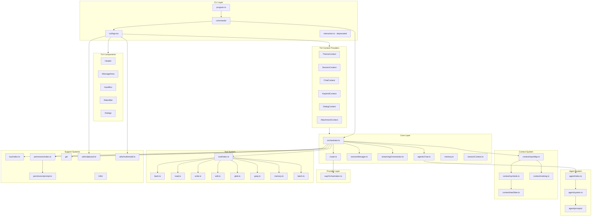

## Module Descriptions

### CLI Layer

| Module | File | Description |
|--------|------|-------------|
| Program | `src/cli/program.ts` | CLI entry point using Commander.js |
| Commands | `src/cli/commands/` | Individual CLI command implementations |
| TUI App | `src/cli/tui/App.tsx` | Ink-based terminal user interface |
| Interactive (deprecated) | `src/cli/interactive.ts` | Legacy readline-based REPL |

### TUI Components

| Component | File | Description |
|-----------|------|-------------|
| Header | `src/cli/tui/components/Header.tsx` | Top bar with model, agent, session info |
| MessageArea | `src/cli/tui/components/MessageArea.tsx` | Scrollable message history display |
| MessageBubble | `src/cli/tui/components/MessageBubble.tsx` | Individual message rendering |
| InputBox | `src/cli/tui/components/InputBox.tsx` | User input field with history |
| StatusBar | `src/cli/tui/components/StatusBar.tsx` | Bottom bar with keybindings and status |
| MarkdownRenderer | `src/cli/tui/components/MarkdownRenderer.tsx` | Markdown to terminal formatting |
| ToolCallBlock | `src/cli/tui/components/ToolCallBlock.tsx` | Tool execution display |
| DiffView | `src/cli/tui/components/DiffView.tsx` | File diff visualization |
| CommandPalette | `src/cli/tui/components/CommandPalette.tsx` | Fuzzy command search |
| AttachmentBar | `src/cli/tui/components/AttachmentBar.tsx` | Image attachment preview |

### TUI Context Providers

| Provider | File | Description |
|----------|------|-------------|
| ThemeContext | `src/cli/tui/context/ThemeContext.tsx` | Dark/light theme management |
| SessionContext | `src/cli/tui/context/SessionContext.tsx` | Session state management |
| ChatContext | `src/cli/tui/context/ChatContext.tsx` | Message history and streaming |
| KeybindContext | `src/cli/tui/context/KeybindContext.tsx` | Keyboard shortcuts |
| DialogContext | `src/cli/tui/context/DialogContext.tsx` | Modal dialog management |
| AttachmentContext | `src/cli/tui/context/AttachmentContext.tsx` | Image attachment handling |

### TUI Dialogs

| Dialog | File | Description |
|--------|------|-------------|
| ModelPicker | `src/cli/tui/dialogs/ModelPicker.tsx` | Interactive model selection |
| AgentSelector | `src/cli/tui/dialogs/AgentSelector.tsx` | Agent switching interface |
| PermissionDialog | `src/cli/tui/dialogs/PermissionDialog.tsx` | Permission request prompt |
| SessionList | `src/cli/tui/dialogs/SessionList.tsx` | Session browser |
| McpManager | `src/cli/tui/dialogs/McpManager.tsx` | MCP server management |

### Core Layer

| Module | File | Description |
|--------|------|-------------|
| Orchestrator | `src/core/orchestrator.ts` | Main orchestration logic |
| Router | `src/core/router.ts` | Model selection and routing |
| Session Manager | `src/core/sessionManager.ts` | Conversation session persistence |
| Streaming Orchestrator | `src/core/streamingOrchestrator.ts` | Real-time streaming support |
| Agentic Chat | `src/core/agenticChat.ts` | Autonomous agent with tool execution loop |
| Session Context | `src/core/sessionContext.ts` | Session metadata and state |
| Session Close | `src/core/sessionClose.ts` | Session finalization and summary |
| Memory | `src/core/memory.ts` | Persistent memory management |
| Effort Level | `src/core/effortLevel.ts` | Task effort configuration |
| Aliases | `src/core/aliases.ts` | Command alias management |

### Agent System

| Module | File | Description |
|--------|------|-------------|
| Agent Registry | `src/agent/index.ts` | Agent registration and switching |
| System Prompts | `src/agent/system.ts` | Prompt assembly pipeline |
| Code Agent | `src/agent/prompts/code.txt` | Coding specialist prompt |
| Debug Agent | `src/agent/prompts/debug.txt` | Debugging specialist prompt |
| Plan Agent | `src/agent/prompts/plan.txt` | Planning specialist prompt |
| Explore Agent | `src/agent/prompts/explore.txt` | Exploration specialist prompt |
| Orchestrator Agent | `src/agent/prompts/orchestrator.txt` | Orchestration prompt |
| Soul Prompt | `src/agent/prompts/soul.txt` | Core identity prompt |

### Context System

| Module | File | Description |
|--------|------|-------------|
| Repo Map | `src/context/repoMap.ts` | Repository structure mapping |
| Symbols | `src/context/symbols.ts` | Code symbol extraction |
| Tree Sitter | `src/context/treeSitter.ts` | Syntax tree parsing |
| Ranking | `src/context/ranking.ts` | File importance ranking |

### Provider Layer

| Module | File | Description |
|--------|------|-------------|
| SAP Orchestration | `src/providers/sapOrchestration.ts` | SAP AI Core via SDK with multimodal support |

### Tool System

| Tool | File | Description |
|------|------|-------------|
| Bash | `src/tool/tools/bash.ts` | Execute shell commands with timeout |
| Read | `src/tool/tools/read.ts` | Read files and directories |
| Write | `src/tool/tools/write.ts` | Write files |
| Edit | `src/tool/tools/edit.ts` | Edit files with string replacement |
| Multiedit | `src/tool/tools/multiedit.ts` | Multiple file edits |
| Delete | `src/tool/tools/delete.ts` | Delete files |
| Glob | `src/tool/tools/glob.ts` | Find files by pattern |
| Grep | `src/tool/tools/grep.ts` | Search file contents |
| Memory | `src/tool/tools/memory.ts` | Store and retrieve memories |
| Batch | `src/tool/tools/batch.ts` | Parallel tool execution |

### Support Systems

| Module | File | Description |
|--------|------|-------------|
| Event Bus | `src/bus/index.ts` | Pub/sub event system |
| Permission | `src/permission/index.ts` | File access control |
| Permission Prompt | `src/permission/prompt.ts` | Interactive permission requests |
| Permission Next | `src/permission/next.ts` | Next permission handler |
| Git Auto-Commit | `src/git/autoCommit.ts` | Automatic git commits |
| Git Attribution | `src/git/attribution.ts` | File attribution tracking |
| Git Commit Message | `src/git/commitMessage.ts` | LLM-generated commit messages |
| Git Config | `src/git/config.ts` | Git configuration |
| Git Dirty Files | `src/git/dirtyFiles.ts` | Working directory changes |
| Internationalization | `src/i18n/index.ts` | Translation system |
| Clipboard | `src/utils/clipboard.ts` | Clipboard image detection |
| Multimodal | `src/utils/multimodal.ts` | Multimodal content building |
| Image Validation | `src/utils/imageValidation.ts` | Image format validation |

## TUI Architecture

The terminal user interface uses React components rendered with Ink for a full-screen experience.

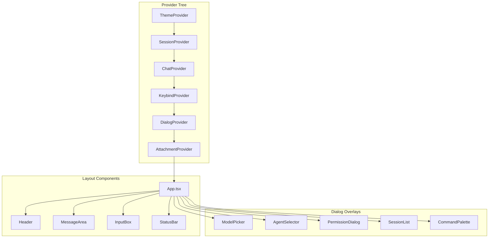

### TUI Layout

```
┌─────────────────────────────────────────────────────────┐
│ Header (3 lines)                                        │
│ Model: gpt-4o | Agent: code | Session: abc123          │
├─────────────────────────────────────────────────────────┤
│ MessageArea (flexible height)                           │
│                                                         │
│ ┌─────────────────────────────────────────────────┐   │
│ │ User: Hello                                     │   │
│ └─────────────────────────────────────────────────┘   │
│                                                         │
│ ┌─────────────────────────────────────────────────┐   │
│ │ Assistant: Hi! How can I help?                  │   │
│ └─────────────────────────────────────────────────┘   │
│                                                         │
├─────────────────────────────────────────────────────────┤
│ InputBox (1+ lines)                                     │
│ > Type your message...                                  │
├─────────────────────────────────────────────────────────┤
│ StatusBar (1 line)                                      │
│ Tab: agent · Ctrl+X: leader · /help                    │
└─────────────────────────────────────────────────────────┘
```

## Agent System Architecture

The agent system provides specialized prompts and role switching for different tasks.

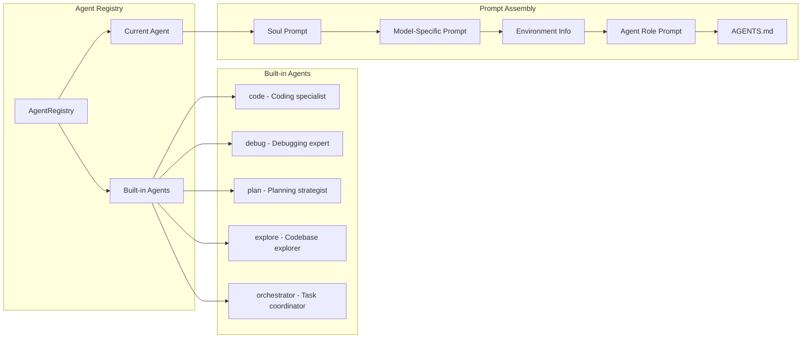

### System Prompt Assembly Pipeline

The system prompt is assembled from multiple layers:

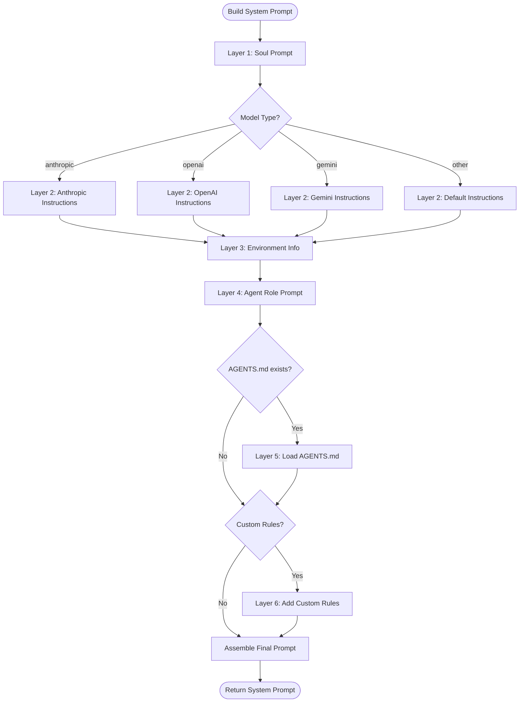

## Data Flow

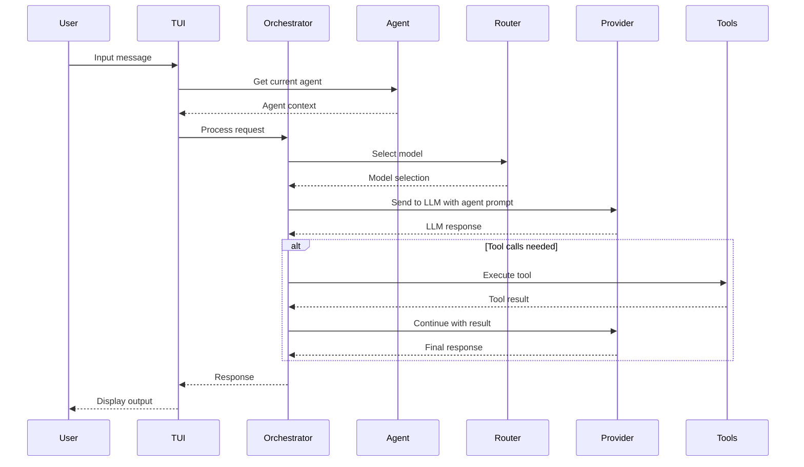

## Agentic Chat Flow

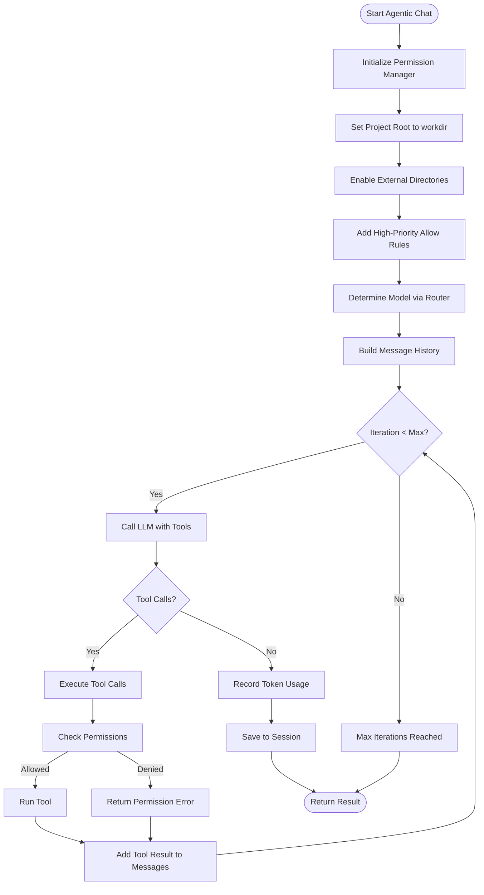

## Permission System Flow

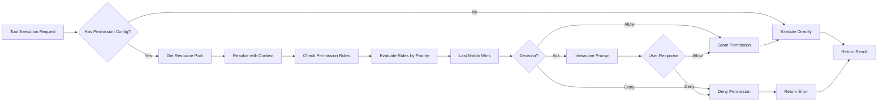

## Tool System with Context Resolution

The tool system resolves relative paths using the workdir context:

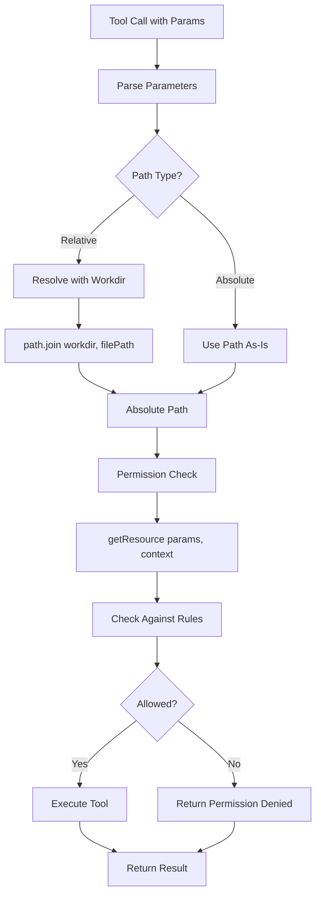

## Multimodal Support

Alexi supports image attachments through clipboard paste functionality.

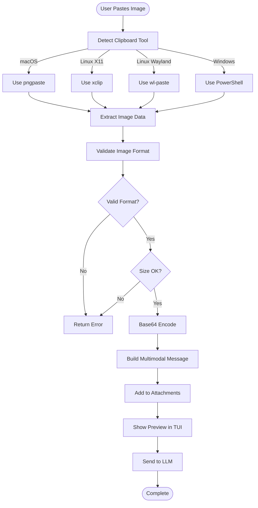

### Supported Image Formats

- PNG (image/png)
- JPEG (image/jpeg)
- GIF (image/gif)
- WebP (image/webp)

### Image Validation

Images are validated for:
- Format signature (magic bytes)
- File size limits
- Dimensions
- Encoding integrity

### Multimodal Message Structure

```typescript
interface MultimodalUserMessage {
  role: 'user';
  content: MultimodalContentItem[];
}

type MultimodalContentItem =
  | { type: 'text'; text: string }
  | { type: 'image'; source: { type: 'base64'; media_type: string; data: string } };
```

## Repository Context System

Alexi can generate repository maps using tree-sitter for code parsing.

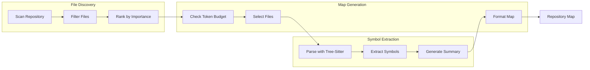

### File Ranking Criteria

Files are ranked by:
1. Git modification status (modified files ranked higher)
2. Modification time (recently modified ranked higher)
3. Import relationships (frequently imported ranked higher)
4. File type priority (source files over config files)

### Symbol Extraction

Tree-sitter extracts:
- Function definitions
- Class definitions
- Interface definitions
- Type definitions
- Export statements
- Import statements

## Configuration

### Environment Variables

```
AICORE_SERVICE_KEY    # SAP AI Core credentials
AICORE_RESOURCE_GROUP # SAP AI Core resource group
OPENAI_API_KEY        # OpenAI API key (optional)
ANTHROPIC_API_KEY     # Anthropic API key (optional)
```

### Routing Configuration

Routing rules are defined in `routing-config.json` or `~/.alexi/routing-config.json`:

```json
{
  "rules": [
    {
      "name": "code-tasks",
      "priority": 100,
      "condition": { "contains": ["code", "implement", "fix"] },
      "model": "anthropic--claude-4-sonnet"
    }
  ],
  "default": {
    "model": "anthropic--claude-4-sonnet"
  }
}
```

## Directory Structure

```
alexi/
├── src/
│   ├── cli/              # CLI entry points
│   │   ├── program.ts    # Commander.js CLI
│   │   ├── commands/     # CLI commands
│   │   ├── tui/          # Ink TUI components
│   │   │   ├── App.tsx   # Root TUI component
│   │   │   ├── components/  # UI components
│   │   │   ├── context/     # React context providers
│   │   │   ├── dialogs/     # Modal dialogs
│   │   │   ├── hooks/       # Custom React hooks
│   │   │   └── theme/       # Theme definitions
│   │   ├── utils/        # CLI utilities
│   │   └── interactive.ts # Legacy REPL (deprecated)
│   ├── core/             # Core orchestration
│   │   ├── orchestrator.ts
│   │   ├── agenticChat.ts
│   │   ├── sessionManager.ts
│   │   ├── sessionContext.ts
│   │   ├── memory.ts
│   │   └── effortLevel.ts
│   ├── providers/        # LLM providers
│   │   └── sapOrchestration.ts
│   ├── tool/             # Tool system
│   │   ├── index.ts      # Tool framework
│   │   └── tools/        # Individual tools
│   │       ├── bash.ts
│   │       ├── read.ts
│   │       ├── write.ts
│   │       ├── edit.ts
│   │       ├── glob.ts
│   │       ├── grep.ts
│   │       ├── memory.ts
│   │       └── batch.ts
│   ├── agent/            # Agent system
│   │   ├── index.ts      # Agent registry
│   │   ├── system.ts     # Prompt assembly
│   │   └── prompts/      # Agent prompts
│   ├── context/          # Repository context
│   │   ├── repoMap.ts    # Map generation
│   │   ├── symbols.ts    # Symbol extraction
│   │   ├── treeSitter.ts # Syntax parsing
│   │   └── ranking.ts    # File ranking
│   ├── bus/              # Event bus
│   ├── permission/       # Permission system
│   │   ├── index.ts
│   │   ├── prompt.ts     # Interactive prompts
│   │   └── next.ts       # Next handler
│   ├── git/              # Git integration
│   │   ├── autoCommit.ts
│   │   ├── attribution.ts
│   │   ├── commitMessage.ts
│   │   ├── config.ts
│   │   └── dirtyFiles.ts
│   ├── i18n/             # Internationalization
│   ├── config/           # Configuration
│   ├── utils/            # Utilities
│   │   ├── clipboard.ts
│   │   ├── multimodal.ts
│   │   └── imageValidation.ts
│   └── ...
├── tests/                # Test files
│   ├── cli/tui/          # TUI component tests
│   ├── clipboard.test.ts
│   ├── multimodal.test.ts
│   └── ...
├── specs/                # Feature specifications
│   ├── 001-tui-clone/    # TUI implementation spec
│   └── 002-screenshot-paste/  # Image paste spec
├── dist/                 # Compiled output
├── docs/                 # Documentation
└── .github/              # GitHub workflows
```

## Key Design Decisions

### 1. Component-Based TUI

Alexi uses Ink (React for CLI) to provide a modern terminal user interface:
- Full-screen layout with Header, MessageArea, InputBox, and StatusBar
- React component architecture with context providers
- Real-time streaming message display
- Interactive dialogs for model selection, agent switching, and permissions
- Theme support (dark/light modes)
- Keyboard shortcuts and command palette

### 2. Agent System with Specialized Prompts

The agent system provides role-based specialization:
- Built-in agents for different tasks (code, debug, plan, explore)
- Agent registry with aliases and switching
- Layered prompt assembly (soul + model + environment + agent + project)
- Agent-specific color coding in UI
- Agent switching via Tab key or explicit commands

### 3. Repository Context Mapping

Alexi can generate repository maps for better context:
- Tree-sitter based code parsing
- Symbol extraction from TypeScript/JavaScript files
- File ranking by importance (git status, modification time)
- Token budget management
- Configurable via --map-tokens flag

### 4. Multimodal Support

Screenshot and image paste functionality:
- Clipboard detection for multiple platforms (macOS, Linux, Windows)
- Image validation and format detection
- Base64 encoding for LLM transmission
- Attachment preview in TUI
- Support for PNG, JPEG, GIF, WebP formats

### 5. Tool System with Permission Control

Tools are implemented as independent modules that:
- Follow a consistent interface based on Zod schema validation
- Can be enabled/disabled per session
- Support permission-based access control with last-match-wins rule evaluation
- Resolve relative paths using workdir context for agentic operations
- Support interactive permission prompts and high-priority allow rules
- Convert Zod schemas to JSON Schema for LLM function calling with proper type handling

### 6. Agentic Execution Mode

The agentic chat system enables autonomous file operations:
- Automatic permission configuration for write and execute actions
- High-priority allow rules (priority 200) override default ask prompts
- External directory access for full workspace capability
- Tool execution loop with LLM-driven decision making
- Iteration limits based on effort level (quick: 5, standard: 10, thorough: 25, exhaustive: 50)

### 7. Event-Driven Architecture

The event bus enables:
- Loose coupling between modules
- Plugin extensibility
- Real-time streaming updates
- Permission events (DoomLoopDetected, ExternalAccessAttempted)
- Agent switching events
- Tool execution events

### 8. Session Management with Memory

Sessions provide:
- Multi-turn conversation context
- Persistence across CLI invocations
- Export and sharing capabilities
- Typed memory storage and retrieval
- Session summaries generated on close

### 9. Git Integration

Automatic git operations:
- Auto-commit with LLM-generated messages
- File attribution tracking
- Dirty files detection
- Git configuration management

## Security Considerations

1. **Secrets Management**: Secrets are redacted in exports and logs
2. **Permission System**: File access is controlled by configurable rules
3. **Environment Isolation**: Sensitive config stored in `~/.alexi/`
4. **Type Safety**: Strict TypeScript configuration with proper type assertions
5. **Logging**: Centralized logger replaces direct console calls for better control

## Logging System

Alexi uses a centralized logging utility to provide consistent logging across the application.

### Logger API

```typescript
import { logger } from './utils/logger.js';

// Set log level (debug, info, warn, error)
logger.setLevel('debug');

// Log messages at different levels
logger.debug('Debug message', additionalData);
logger.info('Info message');
logger.warn('Warning message');
logger.error('Error message', error);

// Print without formatting (for CLI output)
logger.print('Raw output');
```

### Log Levels

| Level | Priority | Description | Output Format |
|-------|----------|-------------|---------------|
| `debug` | 0 | Detailed debugging information | `[DEBUG] message` |
| `info` | 1 | General informational messages | `message` (no prefix) |
| `warn` | 2 | Warning messages | `[WARN] message` |
| `error` | 3 | Error messages | `[ERROR] message` |

The logger respects the configured log level and only outputs messages at or above that level. The default level is `info`.

### ESLint Integration

The logger utility is the only module permitted to use direct console calls. All other modules should import and use the centralized logger to maintain ESLint compliance.

```typescript
// ❌ Avoid direct console usage
console.log('message');

// ✅ Use centralized logger
import { logger } from './utils/logger.js';
logger.info('message');
```

## Type Safety and Code Quality

### TypeScript Configuration

Alexi uses strict TypeScript configuration with proper type assertions:

```typescript
// Model capability filtering with explicit type assertion
const models = config.models.filter(
  (m) => (m as ModelCapability & { enabled?: boolean }).enabled !== false
);

// Zod schema type handling with interface definitions
interface ZodDefBase {
  description?: string;
}

const def = (schema as unknown as { _def: ZodDefBase })._def;
```

### ESLint Rules

Key ESLint rules enforced:

- `no-console: warn` - Prevents direct console usage (except in logger)
- `@typescript-eslint/no-explicit-any: warn` - Flags any type usage
- `@typescript-eslint/no-unused-vars: error` - Prevents unused variables
- `prefer-const: error` - Enforces const for immutable variables
- `eqeqeq: error` - Requires strict equality checks

### Code Quality Diagram

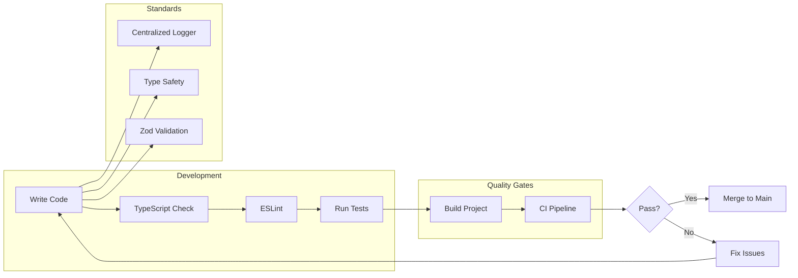

## Future Improvements

- [ ] Add more provider implementations
- [ ] Improve test coverage
- [ ] Add metrics and telemetry
- [ ] Implement caching layer
- [ ] Add web UI option
