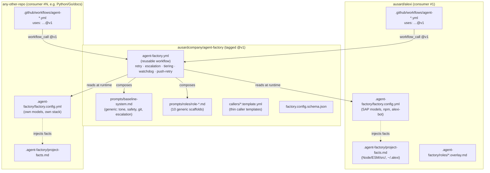

# Agent Factory Unification — Architecture & Roadmap

Companion to `spec.md`. Shows the target topology and a phased, low-risk path
to get there without breaking alexi's currently-working fleet.

## Target topology



## Prompt composition (runtime, in the engine)

```
composed_prompt =
    engine/baseline-system.md          # generic horizontal
  + consumer/project-facts.md          # THIS repo's facts (replaces SAP facts)
  + engine/roles/role-<role>.md        # generic role scaffold
  + consumer/roles/<role>.overlay.md   # optional project role addendum
  + consumer/tasks/<task>.md           # the concrete task
```

The engine never contains project facts; the consumer never contains engine
mechanics. This is the same "constitution amendment" discipline as today, but
the constitution now lives in one versioned place for all projects.

## Phased roadmap (each phase independently shippable & reversible)

### Phase 0 — Contract freeze (design, no code moves)
- Finalize `factory.config.yml` schema + JSON Schema validator.
- Define the exact prompt-composition order (above).
- Decide secret-name indirection (config names → `secrets:` passthrough).
- **Exit**: schema reviewed; alexi's current values expressed in the example config.

### Phase 1 — Extract engine into its own repo
- Create `ausardcompany/agent-factory`; move `agent-factory.yml` + generic
  prompt scaffolds + caller templates + schema + docs.
- Add engine-side CI: grep-guard that fails if any SAP/alexi/Node string appears
  in engine files (enforces SC-004); actionlint; a smoke "hello role" run.
- Tag `v1.0.0-rc`.
- **Exit**: engine repo green; no consumer wired yet.

### Phase 2 — Make the engine config-driven
- `agent-factory.yml` reads `.agent-factory/factory.config.yml` from the caller
  repo (checked out), resolves models/stack/git/roles from it.
- Replace hardcoded `npm ci` with `stack.install`; same for build/test/lint.
- `stack: none` path skips build-oriented gates.
- Fail-fast on missing/invalid config.
- **Exit**: engine runs a role using only config-provided commands (tested on a
  throwaway Python + a docs-only fixture repo).

### Phase 3 — Dogfood: migrate alexi to consume @v1
- Split alexi's baseline → `project-facts.md`; split role files → overlays.
- Move SAP models / npm / alexi-bot / scopes / sync into `factory.config.yml`.
- Swap alexi callers to `uses: ausardcompany/agent-factory/...@v1`.
- Run the full 10-role fleet; diff produced PRs/issues/commits vs pre-migration
  baseline for parity (SC-002).
- **Exit**: alexi fully on the engine; engine tagged `v1.0.0` stable.

### Phase 4 — Second consumer (proves portability)
- Onboard one non-Node and/or non-engineering repo using only `.agent-factory/`.
- Confirm SC-001 and SC-005.
- **Exit**: two live consumers on one engine; portability proven.

### Phase 5 (later, separate feature) — `create-agent-factory` CLI
- `npx @ausard/create-agent-factory init` detects stack, scaffolds
  `.agent-factory/` + callers, opens a setup PR. Depends on the frozen contract.

## Risk controls

- **Don't break alexi**: engine extraction is copy-first; alexi keeps working on
  its current inlined workflows until Phase 3 cutover is proven green.
- **Versioning**: consumers pin `@v1`; breaking changes only in `@v2`.
- **Blast radius**: engine `baseline-system.md` now affects ALL consumers, not
  just alexi — treat edits as a cross-org constitution amendment; require the
  engine's eval gate (Wave 2) before publishing a new `@v1.x`.
- **Secret leakage**: engine takes secret *names* from config and receives
  *values* via `secrets:` passthrough; never inline secrets in the engine.
